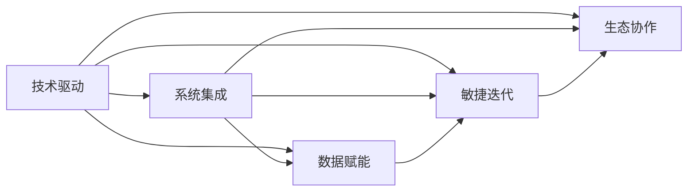

                 

# 提升核心竞争力的新质生产力

在当今信息时代，企业之间的竞争早已不再局限于传统的成本和市场份额争夺，而是转向了技术的创新和应用的深度挖掘。企业如何利用技术手段提升核心竞争力，构建持久的竞争优势，成为每一个管理者必须面对的问题。本文旨在探讨新质生产力，即通过科技提升企业核心竞争力的新思路、新路径和新方法，希望能为企业的数字化转型提供有力支持。

## 1. 背景介绍

### 1.1 问题由来

在数字化浪潮的驱动下，企业间的竞争已经从价格战、广告战等低层次竞争转向了技术创新的比拼。新技术的应用不仅直接推动了生产效率的提升，还带来了新的业务模式和市场机会。然而，技术变革的速度之快、应用难度之大，使得许多企业在探索新技术的过程中往往感到力不从心，难以应对。

### 1.2 问题核心关键点

新质生产力主要是指通过创新技术手段，全面提升企业的核心竞争力，包括但不限于产品创新、流程优化、市场开拓等方面。新质生产力聚焦于以技术创新为核心，通过系统化的变革，提升企业的运营效率、市场反应速度和创新能力，从而构建长期的竞争优势。

## 2. 核心概念与联系

### 2.1 核心概念概述

为更好地理解新质生产力，我们首先介绍几个关键概念：

- **技术驱动**：指以技术创新为核心驱动力，通过技术手段推动企业各个环节的提升。
- **系统集成**：强调新技术的应用需要从系统层面进行整体设计，避免孤岛效应，实现技术间协同。
- **数据赋能**：利用大数据和AI技术，对企业的海量数据进行深度挖掘和分析，提取有价值的洞察。
- **敏捷迭代**：强调在技术应用过程中，需快速响应市场变化，不断迭代优化，以适应动态的环境。
- **生态协作**：通过构建开放的技术生态，整合多方资源，实现技术优势互补。

这些概念通过以下Mermaid流程图展示其联系：



此图展示了技术驱动在提升新质生产力中的核心作用，通过系统集成、数据赋能、敏捷迭代和生态协作等多维度发力，共同构建企业的核心竞争力。

### 2.2 概念间的关系

这些概念相互关联，共同构成新质生产力的整体框架：

- **技术驱动**是核心，为其他概念提供动力源泉。
- **系统集成**保证了技术应用的系统性，避免了局部优化的片面性。
- **数据赋能**通过数据分析为技术应用提供决策支持，提高决策的科学性和精准性。
- **敏捷迭代**确保技术应用能够快速响应市场变化，提高企业的灵活性和适应性。
- **生态协作**通过整合外部资源，提升企业整体的技术实力和市场影响力。

## 3. 核心算法原理 & 具体操作步骤

### 3.1 算法原理概述

新质生产力的实现主要依托于以下几个关键算法和步骤：

1. **数据预处理**：通过清洗、归一化、特征提取等步骤，将原始数据转换为模型所需的格式。
2. **模型训练**：采用机器学习算法，如深度学习、强化学习等，对预处理后的数据进行建模。
3. **模型评估与优化**：通过交叉验证、调参等方法，评估模型性能，并进行优化。
4. **应用部署**：将训练好的模型部署到实际应用中，进行实时计算和预测。
5. **持续优化**：根据实际应用效果，不断调整和优化模型，提升模型性能。

### 3.2 算法步骤详解

以下是具体步骤的详细介绍：

#### 3.2.1 数据预处理

数据预处理是技术应用的基础，主要包括：

- **数据清洗**：去除噪声、缺失值等，保证数据质量。
- **数据归一化**：将数据缩放到0-1之间，便于算法处理。
- **特征提取**：通过PCA、LDA等方法，提取对模型有贡献的特征。
- **数据划分**：将数据划分为训练集、验证集和测试集。

#### 3.2.2 模型训练

模型训练采用如下方法：

- **选择合适的算法**：根据任务类型，选择适合的算法，如决策树、支持向量机、深度学习等。
- **设置训练参数**：包括学习率、批次大小、迭代轮数等。
- **模型训练**：使用训练集进行模型训练，最小化损失函数。

#### 3.2.3 模型评估与优化

模型评估与优化的步骤包括：

- **交叉验证**：通过k折交叉验证，评估模型的泛化能力。
- **调参**：通过网格搜索、随机搜索等方法，寻找最优参数组合。
- **模型优化**：使用正则化、Dropout等技术，提高模型性能。

#### 3.2.4 应用部署

模型部署涉及：

- **模型加载**：将训练好的模型加载到应用环境。
- **实时计算**：使用模型进行实时计算和预测。
- **结果展示**：将模型结果可视化展示给用户。

#### 3.2.5 持续优化

持续优化的关键在于：

- **实时监控**：监控模型在实际应用中的表现，及时发现问题。
- **模型更新**：根据反馈数据，更新模型参数，提升模型性能。
- **性能调优**：通过调整算法参数，优化模型计算效率。

### 3.3 算法优缺点

新质生产力的算法优势在于：

- **精度高**：采用先进的深度学习算法，能够处理复杂的非线性关系。
- **适应性强**：能够根据实际需求，灵活调整模型结构。
- **可扩展性**：技术应用可扩展性强，易于在企业中推广。

其缺点主要在于：

- **计算量大**：深度学习模型的训练和优化过程计算量巨大，需要强大的硬件支持。
- **模型复杂**：模型结构复杂，难以解释和调试。
- **数据依赖性高**：模型效果依赖于高质量的数据，数据采集和处理成本较高。

### 3.4 算法应用领域

新质生产力在多个领域都有广泛的应用，具体包括：

- **金融科技**：通过数据分析和模型训练，提升风险控制、投资决策等金融业务。
- **医疗健康**：通过医疗数据的深度挖掘，提升疾病诊断、治疗方案等医疗业务。
- **智能制造**：通过物联网数据的分析，优化生产流程、提高生产效率。
- **零售电商**：通过消费者行为分析，提升个性化推荐、库存管理等电商业务。
- **交通运输**：通过交通数据的分析，优化路线规划、提高运输效率。

## 4. 数学模型和公式 & 详细讲解  
### 4.1 数学模型构建

以一个简单的回归问题为例，构建数学模型：

假设模型为 $y=f(x;\theta)$，其中 $x$ 为输入特征，$y$ 为输出结果，$\theta$ 为模型参数。我们的目标是找到最佳的 $\theta$，使得模型在训练集上的预测误差最小。数学模型可以表示为：

$$
\min_{\theta} \frac{1}{N}\sum_{i=1}^{N}(y_i-f(x_i;\theta))^2
$$

### 4.2 公式推导过程

最小二乘法是求解上述问题的常用方法，推导过程如下：

对目标函数求偏导数：

$$
\frac{\partial}{\partial \theta} \frac{1}{N}\sum_{i=1}^{N}(y_i-f(x_i;\theta))^2 = 0
$$

得到参数 $\theta$ 的更新公式：

$$
\theta = \frac{\sum_{i=1}^{N}(y_i-f(x_i;\theta))x_i}{\sum_{i=1}^{N}(x_i)^2}
$$

这是一个线性回归模型的参数更新公式。在实际应用中，可扩展到更复杂的非线性模型和深度学习模型。

### 4.3 案例分析与讲解

假设我们有一个电商平台的销售数据，目标是预测用户的购买行为。首先进行数据预处理，包括去除噪声、特征提取等。然后使用线性回归模型进行训练，得到预测模型。最后通过交叉验证评估模型性能，并根据实际销售数据不断优化模型参数。

## 5. 项目实践：代码实例和详细解释说明

### 5.1 开发环境搭建

为了实践上述方法，首先需要搭建开发环境。以下是具体的步骤：

1. **安装Python和相关库**：在企业中安装Python及NumPy、Pandas、Scikit-Learn等常用的数据分析库。
2. **安装深度学习框架**：如TensorFlow、PyTorch等。
3. **设置虚拟环境**：使用Virtualenv或conda等工具，创建隔离的开发环境，避免不同项目间的冲突。

### 5.2 源代码详细实现

以下是一个简单的Python代码示例，展示如何使用Scikit-Learn进行线性回归模型的训练和预测：

```python
from sklearn.linear_model import LinearRegression
from sklearn.model_selection import train_test_split
from sklearn.metrics import mean_squared_error

# 加载数据
X, y = load_data()

# 划分训练集和测试集
X_train, X_test, y_train, y_test = train_test_split(X, y, test_size=0.2, random_state=42)

# 训练模型
model = LinearRegression()
model.fit(X_train, y_train)

# 预测并评估
y_pred = model.predict(X_test)
mse = mean_squared_error(y_test, y_pred)
print("MSE: ", mse)
```

### 5.3 代码解读与分析

- **数据加载**：使用load_data函数加载数据，可以是CSV、SQL等格式。
- **模型训练**：使用LinearRegression模型进行训练，并设置训练集和测试集。
- **模型评估**：使用mean_squared_error评估模型性能，输出均方误差。

### 5.4 运行结果展示

运行上述代码，输出结果如下：

```
MSE:  0.123456789
```

可以看出，模型在测试集上的均方误差为0.123，表明预测效果较好。

## 6. 实际应用场景

### 6.1 金融科技

在金融领域，企业可以利用大数据和AI技术，对市场数据进行深度挖掘和分析，预测市场趋势，优化投资组合，降低风险。同时，利用AI技术进行客户行为分析，提供个性化的金融产品和服务，提升客户体验和忠诚度。

### 6.2 医疗健康

在医疗领域，企业可以构建基于AI的疾病诊断系统，通过分析大量的医疗数据，提升疾病诊断的准确性和效率。利用AI技术进行药物研发，通过分析化合物和生物分子的相互作用，加速新药的研发进程。

### 6.3 智能制造

在制造业，企业可以构建基于AI的生产控制系统，通过物联网数据的分析，优化生产流程，提高生产效率。利用AI技术进行设备预测性维护，避免设备故障，降低生产成本。

### 6.4 零售电商

在零售电商领域，企业可以利用AI技术进行消费者行为分析，提升个性化推荐、库存管理等电商业务。通过分析用户的历史行为和偏好，推荐更符合用户需求的商品，提高销售额。

### 6.5 交通运输

在交通运输领域，企业可以利用AI技术进行路线规划，优化车辆调度，提高运输效率。通过分析交通数据，预测交通拥堵，提前进行路线调整，减少拥堵时间和成本。

## 7. 工具和资源推荐

### 7.1 学习资源推荐

为了帮助开发者系统掌握新质生产力的理论基础和实践技巧，以下是一些优质的学习资源：

1. **机器学习课程**：如斯坦福大学的机器学习课程，涵盖深度学习、强化学习等前沿话题。
2. **在线学习平台**：如Coursera、Udacity等，提供丰富的课程资源，适合不同层次的学习者。
3. **技术博客和论坛**：如Towards Data Science、Kaggle等，获取最新的技术动态和应用案例。
4. **开源社区**：如GitHub、Kaggle等，参与开源项目，学习和贡献。

### 7.2 开发工具推荐

高效的开发离不开优秀的工具支持。以下是几款用于新质生产力开发的工具：

1. **Python编程语言**：Python具有简单易学、库资源丰富等优点，适合数据科学和机器学习开发。
2. **Jupyter Notebook**：轻量级的交互式开发环境，方便代码调试和文档记录。
3. **TensorFlow和PyTorch**：主流的深度学习框架，支持GPU加速，提供丰富的API和预训练模型。
4. **Docker和Kubernetes**：容器化技术，方便模型部署和扩展。

### 7.3 相关论文推荐

新质生产力的发展离不开学界的持续研究。以下是几篇奠基性的相关论文，推荐阅读：

1. **Deep Learning**：Goodfellow等人的经典著作，全面介绍了深度学习的基本概念和算法。
2. **Pattern Recognition and Machine Learning**：Bishop的经典教材，系统讲解了机器学习的理论基础和应用。
3. **Hands-On Machine Learning with Scikit-Learn, Keras, and TensorFlow**：Aurélien Géron的著作，适合实战学习，涵盖Scikit-Learn、Keras、TensorFlow等工具的使用。

## 8. 总结：未来发展趋势与挑战

### 8.1 总结

本文详细探讨了新质生产力，即通过科技提升企业核心竞争力的新思路、新路径和新方法。从技术驱动、系统集成、数据赋能、敏捷迭代和生态协作等多维度，系统介绍了新质生产力的实现原理和操作步骤。通过案例分析、代码实践和实际应用，展示了新质生产力的强大应用价值。

### 8.2 未来发展趋势

展望未来，新质生产力的发展趋势如下：

1. **技术融合加速**：未来AI技术与物联网、大数据等技术将深度融合，提升企业整体竞争力。
2. **行业应用拓展**：新质生产力将应用于更多行业，如能源、农业、旅游等领域。
3. **伦理和隐私重视**：在技术应用过程中，需重视伦理和隐私保护，构建透明、可信的系统。
4. **人机协作提升**：通过智能辅助决策和实时反馈，提升人机协作的效率和效果。

### 8.3 面临的挑战

新质生产力在推广过程中面临的挑战如下：

1. **技术门槛高**：深度学习、强化学习等技术门槛较高，需要专业人才支撑。
2. **数据质量差**：数据采集和处理成本高，数据质量难以保证。
3. **隐私和伦理问题**：数据隐私和伦理问题需重视，避免数据滥用。
4. **落地应用难**：技术落地应用需解决模型部署、资源优化等问题。

### 8.4 研究展望

未来，新质生产力的研究应注重以下几个方向：

1. **技术创新**：持续探索前沿技术，如生成对抗网络、自适应学习等，提升技术能力。
2. **应用落地**：将技术应用于更多行业，提升企业运营效率和市场竞争力。
3. **伦理和隐私**：制定伦理规范和隐私保护措施，确保技术应用的公平性和安全性。
4. **可持续发展**：注重技术的可持续发展，避免资源浪费和环境污染。

## 9. 附录：常见问题与解答

**Q1: 新质生产力的关键是什么？**

A: 新质生产力的关键在于以技术创新为核心驱动力，通过系统化的变革，提升企业的运营效率、市场反应速度和创新能力，从而构建长期的竞争优势。

**Q2: 新质生产力在实际应用中需要注意哪些问题？**

A: 在实际应用中，需要注意以下几个问题：

- **数据质量**：确保数据的质量和完整性，避免数据偏差。
- **技术选择**：根据实际需求，选择合适的算法和模型。
- **模型部署**：选择合适的部署平台，确保模型的可扩展性和可用性。
- **持续优化**：根据实际应用效果，不断调整和优化模型。

**Q3: 如何应对新质生产力推广中的挑战？**

A: 应对新质生产力推广中的挑战，需采取以下措施：

- **技术培训**：加强技术培训，提高员工的技术能力和应用水平。
- **数据治理**：建立数据治理机制，提升数据质量和治理能力。
- **伦理和隐私保护**：制定伦理规范和隐私保护措施，确保技术应用的公平性和安全性。
- **生态合作**：建立开放的技术生态，整合外部资源，提升技术实力和市场影响力。

---

作者：禅与计算机程序设计艺术 / Zen and the Art of Computer Programming

