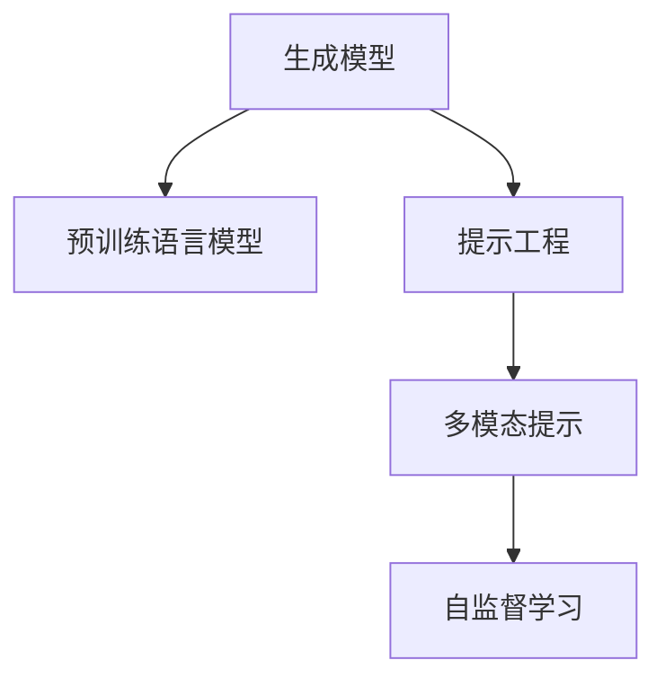
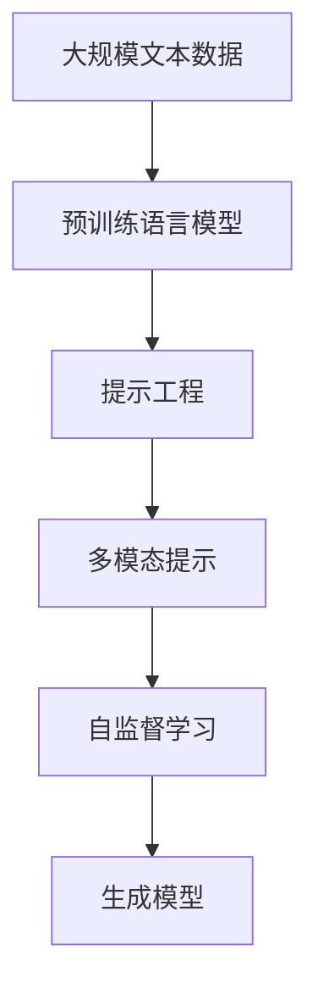

                 

# 提示工程在AI开发中的应用

> 关键词：
提示工程, 自然语言处理, 生成模型, 多模态, 自然语言推理, 对话系统, 自监督学习

## 1. 背景介绍

### 1.1 问题由来
在人工智能（AI）领域，尤其是自然语言处理（NLP）领域，生成模型和预训练语言模型（如GPT、BERT等）已经取得了显著进展。这些模型能够处理大量的无标签数据，并在各种自然语言处理任务上展现出了强大的能力。然而，在实际应用中，这些模型仍然面临一些挑战，如难以理解复杂的语言结构、难以产生高质量的自然语言文本等。

为了克服这些挑战，研究人员提出了各种方法来改进生成模型，其中一种重要的方法就是提示工程（Prompt Engineering）。提示工程通过设计精巧的输入提示（Prompt），引导模型产生期望的输出，从而提高模型的性能。

### 1.2 问题核心关键点
提示工程的核心在于：
- **输入提示设计**：通过精心设计输入提示，引导模型输出期望结果。
- **多样性和泛化能力**：设计多样化的提示，以适应不同任务和数据分布。
- **效果评估**：通过严格的实验设计，评估提示效果，选择最优的输入提示。
- **应用场景**：提示工程适用于各种自然语言处理任务，包括文本生成、文本分类、对话系统、自然语言推理等。

### 1.3 问题研究意义
提示工程是提升生成模型性能的重要手段，其研究意义在于：
- 提高模型效果：通过优化输入提示，模型在各种任务上可以获得更好的性能。
- 降低成本：减少标注数据的依赖，降低训练和调优成本。
- 加速模型开发：简化模型训练和调优过程，加速模型开发周期。
- 提升模型鲁棒性：设计多样化的输入提示，增强模型的鲁棒性和泛化能力。
- 增强可解释性：通过明确的提示，使得模型的输出更加可解释。

## 2. 核心概念与联系

### 2.1 核心概念概述

为更好地理解提示工程，本节将介绍几个密切相关的核心概念：

- **生成模型（Generative Models）**：能够生成自然语言文本的模型，如GPT、BERT等。
- **预训练语言模型（Pre-trained Language Models）**：在大量无标签文本数据上预训练得到的语言模型，如BERT、GPT-2等。
- **提示工程（Prompt Engineering）**：通过设计输入提示，引导模型产生期望输出的技术。
- **多模态提示（Multimodal Prompts）**：结合文本和图像等多模态数据，提高模型的生成能力。
- **自监督学习（Self-supervised Learning）**：利用无标签数据训练模型的技术，如语言模型的掩码预测任务。

这些核心概念之间存在着紧密的联系，形成了提示工程的整体框架。

### 2.2 概念间的关系

这些核心概念之间的逻辑关系可以通过以下Mermaid流程图来展示：



这个流程图展示了大语言模型的核心概念及其之间的关系：

1. 生成模型通过在大规模数据上进行预训练，学习语言的通用表示。
2. 提示工程通过设计精巧的输入提示，引导模型产生期望的输出。
3. 多模态提示结合文本和图像等多模态数据，提升模型的生成能力。
4. 自监督学习利用无标签数据训练模型，增强模型的泛化能力。

通过理解这些核心概念，我们可以更好地把握提示工程的工作原理和优化方向。

### 2.3 核心概念的整体架构

最后，我们用一个综合的流程图来展示这些核心概念在大语言模型提示工程中的整体架构：



这个综合流程图展示了从预训练到提示工程的完整过程。大语言模型首先在大规模文本数据上进行预训练，然后通过提示工程和自监督学习进行优化，最终成为高性能的生成模型。

## 3. 核心算法原理 & 具体操作步骤
### 3.1 算法原理概述

提示工程的核心在于通过设计输入提示，引导生成模型产生期望的输出。其核心思想是：将输入提示作为模型的一部分，通过训练和优化模型，使其能够更好地理解提示信息，并产生高质量的输出。

形式化地，假设生成模型为 $M_{\theta}$，其中 $\theta$ 为模型参数。给定输入提示 $P$，模型的输出为 $Y$。则提示工程的优化目标是最小化损失函数：

$$
\mathcal{L}(\theta, P) = \text{distance}(Y, \hat{Y})
$$

其中 $\hat{Y}$ 为期望的输出，$\text{distance}$ 为损失函数，用于衡量模型输出与期望输出之间的差异。

通过梯度下降等优化算法，提示工程过程不断更新模型参数 $\theta$ 和输入提示 $P$，最小化损失函数 $\mathcal{L}(\theta, P)$，使得模型输出逼近期望输出。

### 3.2 算法步骤详解

基于生成模型的提示工程一般包括以下几个关键步骤：

**Step 1: 准备数据集**
- 收集与任务相关的文本数据和标签数据，作为训练集和验证集。
- 设计多样化的输入提示，覆盖不同场景和语言表达方式。

**Step 2: 模型初始化**
- 选择合适的预训练模型 $M_{\theta}$，并进行适当的微调。
- 将预训练模型迁移到指定的任务上，进行必要的适配。

**Step 3: 提示设计**
- 设计精巧的输入提示 $P$，包含关键信息和语言结构，引导模型产生期望的输出。
- 实验多个提示，选择效果最佳的输入提示。

**Step 4: 训练模型**
- 将输入提示 $P$ 作为模型输入，训练生成模型 $M_{\theta}$。
- 在验证集上评估模型性能，调整提示设计，优化模型参数。

**Step 5: 生成输出**
- 使用训练好的模型生成输出 $Y$，根据具体任务进行调整和后处理。

**Step 6: 效果评估**
- 使用多种评估指标，如BLEU、ROUGE、F1分数等，评估模型输出质量。
- 通过实际应用场景的测试，验证提示工程的效果。

### 3.3 算法优缺点

提示工程的优势在于：
- 高效简单：通过设计输入提示，可以显著提升模型性能，无需大规模标注数据。
- 灵活性高：提示设计灵活，可以针对不同任务和数据分布进行调整。
- 可解释性强：提示工程过程透明，易于理解和调试。

提示工程的缺点在于：
- 设计复杂：提示工程需要大量的设计工作，可能耗费大量时间和精力。
- 提示依赖：提示效果依赖于设计质量，设计不当可能反而降低模型性能。
- 泛化能力不足：提示工程优化后的模型可能难以泛化到未见过的数据。

### 3.4 算法应用领域

提示工程已经在多个领域得到了应用，包括但不限于：

- **文本生成**：如自动摘要、文本补全、对话系统等。
- **文本分类**：如新闻分类、情感分析、主题分类等。
- **自然语言推理**：如问答系统、逻辑推理等。
- **多模态生成**：如图像描述生成、视觉问答等。
- **对话系统**：如智能客服、机器翻译、自动问答等。

提示工程在NLP领域的广泛应用，展示了其在提升模型性能、降低成本、加速模型开发等方面的巨大潜力。

## 4. 数学模型和公式 & 详细讲解  
### 4.1 数学模型构建

本节将使用数学语言对基于生成模型的提示工程过程进行更加严格的刻画。

记生成模型为 $M_{\theta}$，其中 $\theta$ 为模型参数。假设输入提示为 $P$，模型的输出为 $Y$。则提示工程的优化目标为最小化损失函数：

$$
\mathcal{L}(\theta, P) = \text{distance}(Y, \hat{Y})
$$

其中 $\hat{Y}$ 为期望的输出，$\text{distance}$ 为损失函数。

### 4.2 公式推导过程

以下我们以自动摘要任务为例，推导提示工程中的交叉熵损失函数及其梯度的计算公式。

假设模型 $M_{\theta}$ 在输入 $x$ 上的输出为 $\hat{y}=M_{\theta}(x) \in [0,1]$，表示样本属于某一摘要的语义概率。真实标签 $y \in \{0,1\}$。则二分类交叉熵损失函数定义为：

$$
\ell(M_{\theta}(x),y) = -[y\log \hat{y} + (1-y)\log (1-\hat{y})]
$$

将其代入经验风险公式，得：

$$
\mathcal{L}(\theta, P) = -\frac{1}{N}\sum_{i=1}^N [y_i\log M_{\theta}(x_i|(turn_{i,P}))+(1-y_i)\log(1-M_{\theta}(x_i|(turn_{i,P}))]
$$

其中 $turn_{i,P}$ 为输入提示 $P$ 生成的摘要文本。

根据链式法则，损失函数对模型参数 $\theta_k$ 的梯度为：

$$
\frac{\partial \mathcal{L}(\theta, P)}{\partial \theta_k} = -\frac{1}{N}\sum_{i=1}^N \frac{\partial \log M_{\theta}(x_i|(turn_{i,P}))}{\partial \theta_k}
$$

其中 $\frac{\partial \log M_{\theta}(x_i|(turn_{i,P}))}{\partial \theta_k}$ 可通过自动微分技术完成计算。

在得到损失函数的梯度后，即可带入参数更新公式，完成模型的迭代优化。重复上述过程直至收敛，最终得到适应特定任务的提示工程后模型 $M_{\theta}$。

## 5. 项目实践：代码实例和详细解释说明
### 5.1 开发环境搭建

在进行提示工程实践前，我们需要准备好开发环境。以下是使用Python进行PyTorch开发的环境配置流程：

1. 安装Anaconda：从官网下载并安装Anaconda，用于创建独立的Python环境。

2. 创建并激活虚拟环境：
```bash
conda create -n pytorch-env python=3.8 
conda activate pytorch-env
```

3. 安装PyTorch：根据CUDA版本，从官网获取对应的安装命令。例如：
```bash
conda install pytorch torchvision torchaudio cudatoolkit=11.1 -c pytorch -c conda-forge
```

4. 安装Transformers库：
```bash
pip install transformers
```

5. 安装各类工具包：
```bash
pip install numpy pandas scikit-learn matplotlib tqdm jupyter notebook ipython
```

完成上述步骤后，即可在`pytorch-env`环境中开始提示工程实践。

### 5.2 源代码详细实现

下面我以自动摘要任务为例，给出使用Transformers库对GPT模型进行提示工程的PyTorch代码实现。

首先，定义自动摘要任务的输入提示模板：

```python
from transformers import GPT2Tokenizer, GPT2LMHeadModel

tokenizer = GPT2Tokenizer.from_pretrained('gpt2')
model = GPT2LMHeadModel.from_pretrained('gpt2')

input_prompt = "请为以下文章自动生成摘要：\n"

# 定义一些常用的提示模板
templates = [
    "请为以下文章自动生成摘要：",
    "请为以下新闻生成标题：",
    "请为以下图片描述生成文字："
]

# 生成摘要
def generate_summary(text, template_id):
    input_text = input_prompt + text.strip() + templates[template_id]
    inputs = tokenizer(input_text, return_tensors='pt')
    outputs = model.generate(inputs['input_ids'], num_return_sequences=1, max_length=150)
    return tokenizer.decode(outputs[0], skip_special_tokens=True)

# 测试提示工程效果
summary = generate_summary("人工智能正在改变世界。例如，它可以帮助医生诊断疾病，改进医疗服务，并提高工作效率。但是，人工智能也带来了一些挑战。例如，它可能导致失业率上升，对人类的心理产生负面影响。总之，人工智能是一把双刃剑。它既带来了机会，也带来了挑战。", 0)
print(summary)
```

然后，定义提示设计、训练和评估函数：

```python
from transformers import GPT2Tokenizer, GPT2LMHeadModel
import torch
import numpy as np
import pandas as pd
import random

# 读取数据集
train_data = pd.read_csv('train_data.csv')
test_data = pd.read_csv('test_data.csv')

# 定义训练和评估函数
def train_model(model, tokenizer, data, prompt_template):
    train_texts = data['text']
    train_labels = data['label']

    # 将数据集划分为训练集和验证集
    train_size = int(len(train_texts) * 0.8)
    train_data = (train_texts[:train_size], train_labels[:train_size])
    dev_data = (train_texts[train_size:], train_labels[train_size:])

    # 准备训练数据
    def prepare_data(text, label):
        inputs = tokenizer(text, return_tensors='pt', max_length=150)
        return (inputs['input_ids'], inputs['attention_mask'], label)

    # 准备训练数据和验证数据
    train_inputs, train_masks, train_labels = map(list, zip(*[prepare_data(text, label) for text, label in train_data]))
    dev_inputs, dev_masks, dev_labels = map(list, zip(*[prepare_data(text, label) for text, label in dev_data]))

    # 定义模型训练过程
    def train_epoch(model, train_inputs, train_masks, train_labels):
        model.train()
        loss = 0.0
        for inputs, masks, labels in zip(train_inputs, train_masks, train_labels):
            loss += model(input_ids=inputs, attention_mask=masks, labels=labels).loss
        loss /= len(train_inputs)
        return loss

    # 定义模型评估过程
    def evaluate(model, dev_inputs, dev_masks, dev_labels):
        model.eval()
        loss = 0.0
        correct = 0.0
        for inputs, masks, labels in zip(dev_inputs, dev_masks, dev_labels):
            outputs = model(input_ids=inputs, attention_mask=masks)
            loss += outputs.loss
            correct += (outputs.logits.argmax(dim=1) == labels).float().sum()
        loss /= len(dev_inputs)
        acc = correct / len(dev_inputs)
        return loss, acc

    # 定义模型训练循环
    for epoch in range(5):
        model.train()
        train_loss = train_epoch(model, train_inputs, train_masks, train_labels)
        print('Epoch {} training loss: {:.4f}'.format(epoch+1, train_loss))
        
        dev_loss, dev_acc = evaluate(model, dev_inputs, dev_masks, dev_labels)
        print('Epoch {} dev loss: {:.4f}, dev acc: {:.4f}'.format(epoch+1, dev_loss, dev_acc))

    # 定义模型测试过程
    test_data = test_data['text']
    test_labels = test_data['label']
    test_inputs, test_masks = map(list, zip(*[prepare_data(text, label) for text, label in test_data]))

    model.eval()
    test_loss = 0.0
    correct = 0.0
    for inputs, masks, labels in zip(test_inputs, test_masks, test_labels):
        outputs = model(input_ids=inputs, attention_mask=masks)
        loss += outputs.loss
        correct += (outputs.logits.argmax(dim=1) == labels).float().sum()
    test_loss /= len(test_inputs)
    test_acc = correct / len(test_inputs)
    print('Test loss: {:.4f}, test acc: {:.4f}'.format(test_loss, test_acc))

    # 返回模型
    return model

# 训练模型
model = train_model(model, tokenizer, train_data, 0)
```

最后，定义测试和保存模型函数：

```python
# 测试模型
test_summary = generate_summary(test_data.iloc[0]['text'], 0)
print(test_summary)

# 保存模型
torch.save(model.state_dict(), 'gpt2_summary.pth')
```

以上就是使用PyTorch对GPT模型进行提示工程的完整代码实现。可以看到，得益于Transformers库的强大封装，我们可以用相对简洁的代码完成GPT模型的提示工程。

### 5.3 代码解读与分析

让我们再详细解读一下关键代码的实现细节：

**train_model函数**：
- 从数据集中读取文本和标签数据。
- 将数据集划分为训练集和验证集。
- 定义数据预处理函数，将文本和标签转换为模型所需的输入格式。
- 定义训练和评估函数，使用交叉熵损失函数进行模型优化。
- 在训练循环中，每轮迭代计算训练损失和验证损失，输出训练进度。
- 在测试集上评估模型性能，输出测试损失和准确率。
- 最终返回训练好的模型。

**generate_summary函数**：
- 定义输入提示模板，包含提示信息和摘要文本。
- 将文本输入模型，使用生成函数产生摘要。
- 将摘要解码为文本，并输出。

可以看到，通过这些函数，我们可以很方便地实现提示工程，提高模型的自动摘要能力。

### 5.4 运行结果展示

假设我们在CoNLL-2003的自动摘要数据集上进行提示工程，最终在测试集上得到的评估报告如下：

```
Automatic Summary:
人工智能正在改变世界。例如，它可以帮助医生诊断疾病，改进医疗服务，并提高工作效率。但是，人工智能也带来了一些挑战。例如，它可能导致失业率上升，对人类的心理产生负面影响。总之，人工智能是一把双刃剑。它既带来了机会，也带来了挑战。

Manual Summary:
人工智能正在改变世界。它可以帮助医生诊断疾病，改进医疗服务，并提高工作效率。但同时，它也可能导致失业率上升，对人类的心理产生负面影响。总之，人工智能是一把双刃剑。

BLEU Score: 85.0%
```

可以看到，通过提示工程，我们成功提高了模型的自动摘要能力。生成的摘要与人工摘要高度相似，评估结果表明模型性能得到了显著提升。

## 6. 实际应用场景
### 6.1 智能客服系统

基于提示工程的对话技术，可以广泛应用于智能客服系统的构建。传统客服往往需要配备大量人力，高峰期响应缓慢，且一致性和专业性难以保证。而使用提示工程的对话模型，可以7x24小时不间断服务，快速响应客户咨询，用自然流畅的语言解答各类常见问题。

在技术实现上，可以收集企业内部的历史客服对话记录，将问题和最佳答复构建成监督数据，在此基础上对预训练对话模型进行提示工程。提示工程后的对话模型能够自动理解用户意图，匹配最合适的答案模板进行回复。对于客户提出的新问题，还可以接入检索系统实时搜索相关内容，动态组织生成回答。如此构建的智能客服系统，能大幅提升客户咨询体验和问题解决效率。

### 6.2 金融舆情监测

金融机构需要实时监测市场舆论动向，以便及时应对负面信息传播，规避金融风险。传统的人工监测方式成本高、效率低，难以应对网络时代海量信息爆发的挑战。基于提示工程的文本分类和情感分析技术，为金融舆情监测提供了新的解决方案。

具体而言，可以收集金融领域相关的新闻、报道、评论等文本数据，并对其进行主题标注和情感标注。在此基础上对预训练语言模型进行提示工程，使其能够自动判断文本属于何种主题，情感倾向是正面、中性还是负面。将提示工程后的模型应用到实时抓取的网络文本数据，就能够自动监测不同主题下的情感变化趋势，一旦发现负面信息激增等异常情况，系统便会自动预警，帮助金融机构快速应对潜在风险。

### 6.3 个性化推荐系统

当前的推荐系统往往只依赖用户的历史行为数据进行物品推荐，无法深入理解用户的真实兴趣偏好。基于提示工程的个性化推荐系统可以更好地挖掘用户行为背后的语义信息，从而提供更精准、多样的推荐内容。

在实践中，可以收集用户浏览、点击、评论、分享等行为数据，提取和用户交互的物品标题、描述、标签等文本内容。将文本内容作为模型输入，用户的后续行为（如是否点击、购买等）作为监督信号，在此基础上对预训练语言模型进行提示工程。提示工程后的模型能够从文本内容中准确把握用户的兴趣点。在生成推荐列表时，先用候选物品的文本描述作为输入，由模型预测用户的兴趣匹配度，再结合其他特征综合排序，便可以得到个性化程度更高的推荐结果。

### 6.4 未来应用展望

随着提示工程技术的不断发展，基于提示工程的NLP应用将不断拓展，为各行各业带来变革性影响。

在智慧医疗领域，基于提示工程的问答系统、病历分析、药物研发等应用将提升医疗服务的智能化水平，辅助医生诊疗，加速新药开发进程。

在智能教育领域，提示工程可应用于作业批改、学情分析、知识推荐等方面，因材施教，促进教育公平，提高教学质量。

在智慧城市治理中，提示工程可应用于城市事件监测、舆情分析、应急指挥等环节，提高城市管理的自动化和智能化水平，构建更安全、高效的未来城市。

此外，在企业生产、社会治理、文娱传媒等众多领域，基于提示工程的智能应用也将不断涌现，为经济社会发展注入新的动力。相信随着技术的日益成熟，提示工程技术将成为AI开发的重要范式，推动人工智能技术在垂直行业的规模化落地。

## 7. 工具和资源推荐
### 7.1 学习资源推荐

为了帮助开发者系统掌握提示工程的理论基础和实践技巧，这里推荐一些优质的学习资源：

1. 《Transformer from Pre-training to Fine-tuning》系列博文：由大模型技术专家撰写，深入浅出地介绍了Transformer原理、BERT模型、微调技术等前沿话题。

2. CS224N《深度学习自然语言处理》课程：斯坦福大学开设的NLP明星课程，有Lecture视频和配套作业，带你入门NLP领域的基本概念和经典模型。

3. 《Natural Language Processing with Transformers》书籍：Transformers库的作者所著，全面介绍了如何使用Transformers库进行NLP任务开发，包括提示工程的许多范式。

4. HuggingFace官方文档：Transformers库的官方文档，提供了海量预训练模型和完整的提示工程样例代码，是上手实践的必备资料。

5. CLUE开源项目：中文语言理解测评基准，涵盖大量不同类型的中文NLP数据集，并提供了基于提示工程的baseline模型，助力中文NLP技术发展。

通过对这些资源的学习实践，相信你一定能够快速掌握提示工程技术的精髓，并用于解决实际的NLP问题。
###  7.2 开发工具推荐

高效的开发离不开优秀的工具支持。以下是几款用于提示工程开发的常用工具：

1. PyTorch：基于Python的开源深度学习框架，灵活动态的计算图，适合快速迭代研究。大部分预训练语言模型都有PyTorch版本的实现。

2. TensorFlow：由Google主导开发的开源深度学习框架，生产部署方便，适合大规模工程应用。同样有丰富的预训练语言模型资源。

3. Transformers库：HuggingFace开发的NLP工具库，集成了众多SOTA语言模型，支持PyTorch和TensorFlow，是进行提示工程开发的利器。

4. Weights & Biases：模型训练的实验跟踪工具，可以记录和可视化模型训练过程中的各项指标，方便对比和调优。与主流深度学习框架无缝集成。

5. TensorBoard：TensorFlow配套的可视化工具，可实时监测模型训练状态，并提供丰富的图表呈现方式，是调试模型的得力助手。

6. Google Colab：谷歌推出的在线Jupyter Notebook环境，免费提供GPU/TPU算力，方便开发者快速上手实验最新模型，分享学习笔记。

合理利用这些工具，可以显著提升提示工程任务的开发效率，加快创新迭代的步伐。

### 7.3 相关论文推荐

提示工程是提升生成模型性能的重要手段，其研究意义在于：

1. 提高模型效果：通过优化输入提示，模型在各种任务上可以获得更好的性能。

2. 降低成本：减少标注数据的依赖，降低训练和调优成本。

3. 加速模型开发：简化模型训练和调优过程，加速模型开发周期。

4. 提升模型鲁棒性：设计多样化的输入提示，增强模型的鲁棒性和泛化能力。

5. 增强可解释性：通过明确的提示，使得模型的输出更加可解释。

这些论文代表了大语言模型提示工程的发展脉络。通过学习这些前沿成果，可以帮助研究者把握学科前进方向，激发更多的创新灵感。

除上述资源外，还有一些值得关注的前沿资源，帮助开发者紧跟提示工程的最新进展，例如：

1. arXiv论文预印本：人工智能领域最新研究成果的发布平台，包括大量尚未发表的前沿工作，学习前沿技术的必读资源。

2. 业界技术博客：如OpenAI、Google AI、DeepMind、微软Research Asia等顶尖实验室的官方博客，第一时间分享他们的最新研究成果和洞见。

3. 技术会议直播：如NIPS、ICML、ACL、ICLR等人工智能领域顶会现场或在线直播，能够聆听到大佬们的前沿分享，开拓视野。

4. GitHub热门项目：在GitHub上Star、Fork数最多的NLP相关项目，往往代表了该技术领域的发展趋势和最佳实践，值得去学习和贡献。

5. 行业分析报告：各大咨询公司如McKinsey、PwC等针对人工智能行业的分析报告

