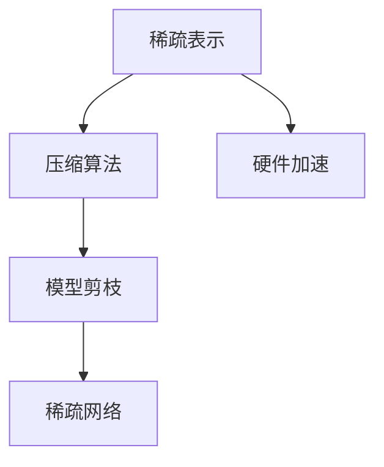
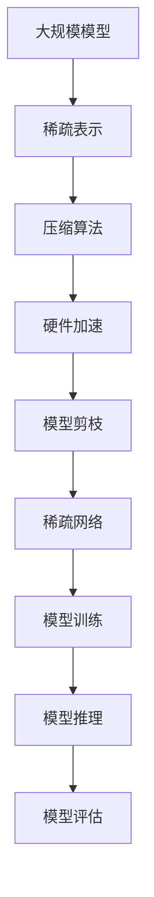

                 

# 提高AI模型能效:从精度到稀疏性的优化之路

在人工智能的快速迭代和广泛应用中，模型的能效优化成为了一个日益重要的问题。在计算资源日益紧张的今天，如何在保证模型精度的前提下，尽可能地降低模型能耗、减少计算开销，成为了提升模型效能的关键。本文将深入探讨这一话题，从模型的稀疏性优化入手，详细解读其原理、步骤与应用的各项细节，并展望未来发展趋势与面临的挑战。

## 1. 背景介绍

### 1.1 问题由来

随着深度学习技术的广泛应用，大规模模型如BERT、GPT等凭借其强大的表征能力，在自然语言处理、图像识别、语音识别等多个领域取得了突破性的进展。然而，大规模模型的参数量往往动辄数亿乃至数十亿，带来了高昂的存储和计算成本。以GPT为例，其参数量高达17亿，每步计算涉及的浮点数操作多达数十亿次，这不仅对硬件设备提出了极高的要求，也导致了能源消耗的急剧增加。

另一方面，随着数据量的不断膨胀，模型训练的复杂度和数据预处理的工作量也急剧上升。在数据规模和模型复杂度不断增长的趋势下，模型能效的提升成为了迫切需求。如何在保证模型性能的同时，最大化地提升模型的效率，成为当下研究的热点话题。

### 1.2 问题核心关键点

模型能效优化的核心目标是在保证模型精度的前提下，尽可能地降低计算资源和能源消耗。通过引入稀疏性，模型在保留关键信息的同时，可以显著减少参数量和计算复杂度。稀疏性优化分为硬件层面的稀疏性和软件层面的稀疏性，具体包括稀疏矩阵、稀疏张量、稀疏网络等形式。稀疏性优化的关键点包括：

- **稀疏表示**：采用稀疏矩阵、稀疏张量等形式，保留关键数据，去除冗余信息。
- **压缩算法**：采用量化、剪枝等方法压缩模型，减少参数存储和计算开销。
- **硬件加速**：通过稀疏计算硬件（如FPGA、ASIC）优化模型加速。
- **模型剪枝**：通过剪枝方法去除冗余参数，缩小模型规模。

稀疏性优化可以在不同层次上实现，从硬件到软件，从模型结构到训练过程，都有其适用的技术和方法。这些技术共同构成了一个系统的模型能效优化方案。

### 1.3 问题研究意义

模型能效优化对于人工智能的普及和应用具有重要意义：

- **降低成本**：减少计算和存储开销，降低模型应用的经济成本。
- **提升效率**：优化模型结构，加快推理速度，提高模型响应能力。
- **节能减排**：降低能源消耗，减少碳排放，提升模型系统的环保性。
- **加速部署**：优化模型性能，加快模型的实际部署，提高应用效果。
- **促进创新**：推动人工智能技术向更广领域、更高效能、更广泛应用发展。

稀疏性优化正是实现这一目标的重要手段之一，通过减少模型参数，提升模型性能，实现更高效能的AI应用。

## 2. 核心概念与联系

### 2.1 核心概念概述

稀疏性优化涉及多个关键概念，包括稀疏表示、压缩算法、硬件加速、模型剪枝等。这些概念之间存在密切联系，共同构建了稀疏性优化的完整框架。

- **稀疏表示**：稀疏表示是指在矩阵或张量中，大部分元素为零，只保留关键信息。常见稀疏表示形式有压缩矩阵、稀疏张量等。
- **压缩算法**：压缩算法包括量化、剪枝等方法，通过去除冗余信息，压缩模型大小。
- **硬件加速**：稀疏计算硬件如FPGA、ASIC等，可以专门加速稀疏矩阵的计算，提升模型效率。
- **模型剪枝**：通过剪枝算法，去除模型中的冗余参数，缩小模型规模，提高模型计算效率。

这些概念共同构成了一个完整的稀疏性优化方案，下面通过一个Mermaid流程图来展示这些概念之间的关系：



### 2.2 概念间的关系

稀疏性优化的各个概念之间存在着紧密的联系，形成一个系统化的优化框架。

- **稀疏表示**是压缩算法的核心，通过稀疏表示保留关键信息，压缩算法进一步去除冗余信息，提高模型效率。
- **硬件加速**是稀疏性优化的重要手段，通过专用硬件，加速稀疏矩阵的计算。
- **模型剪枝**是稀疏性优化的具体方法，通过剪枝算法去除冗余参数，优化模型结构。

稀疏性优化的各个概念相辅相成，共同作用于模型的能效优化。下面通过一个综合的流程图来展示这些概念在大规模模型能效优化中的整体架构：



这个综合流程图展示了从大规模模型到稀疏性优化的完整流程，涵盖了稀疏表示、压缩算法、硬件加速和模型剪枝等关键环节。

## 3. 核心算法原理 & 具体操作步骤
### 3.1 算法原理概述

稀疏性优化是一种在保证模型精度的前提下，通过去除冗余信息，减少模型参数和计算复杂度的技术手段。其核心思想是：在保留关键信息的同时，去除模型中的冗余信息，从而降低计算资源和能源消耗。稀疏性优化主要包括以下几个步骤：

1. **稀疏表示**：通过稀疏矩阵、稀疏张量等形式，保留关键信息，去除冗余信息。
2. **压缩算法**：采用量化、剪枝等方法压缩模型，减少参数存储和计算开销。
3. **硬件加速**：利用稀疏计算硬件（如FPGA、ASIC）优化模型加速。
4. **模型剪枝**：通过剪枝算法去除冗余参数，缩小模型规模。

这些步骤共同构成了稀疏性优化的完整流程，下面我们将逐一介绍这些步骤的详细操作。

### 3.2 算法步骤详解

**Step 1: 稀疏表示**

稀疏表示的核心在于通过特殊的矩阵或张量形式，去除模型中的冗余信息。具体来说，稀疏矩阵中的大部分元素为零，只有关键的非零元素参与计算。这样可以大大减少模型的存储空间和计算开销。

稀疏矩阵的定义如下：

$$
X = \begin{pmatrix}
x_{11} & 0 & 0 & \cdots & 0 \\
0 & x_{22} & 0 & \cdots & 0 \\
0 & 0 & x_{33} & \cdots & 0 \\
\vdots & \vdots & \vdots & \ddots & \vdots \\
0 & 0 & 0 & \cdots & x_{nn}
\end{pmatrix}
$$

其中，$x_{ij}$ 表示非零元素，$n$ 表示矩阵的大小。

稀疏矩阵的构建方法包括随机生成、基于阈值的选择等。

**Step 2: 压缩算法**

压缩算法通过去除模型中的冗余信息，进一步缩小模型规模。常见的压缩算法包括量化、剪枝等。

**量化**：将浮点数的数值范围压缩到更小的整数或固定点数的浮点数，从而减少存储空间和计算开销。量化方法包括均匀量化、对称量化等。

**剪枝**：通过剪枝算法去除模型中的冗余参数，缩小模型规模。剪枝方法包括权重剪枝、结构剪枝等。

**Step 3: 硬件加速**

硬件加速是稀疏性优化的重要手段，通过专门设计加速稀疏矩阵的计算，提升模型效率。常见的稀疏计算硬件包括FPGA、ASIC等。

**Step 4: 模型剪枝**

模型剪枝通过去除模型中的冗余参数，进一步缩小模型规模，提高模型计算效率。模型剪枝算法包括基于梯度的剪枝、基于特征的剪枝等。

### 3.3 算法优缺点

稀疏性优化技术在提升模型效率的同时，也存在一些缺点：

**优点**：

- **降低计算开销**：通过去除冗余信息，减少模型的计算量，从而降低计算开销。
- **提高模型效率**：优化后的模型更加轻量级，推理速度更快，响应能力更强。
- **节能减排**：减少计算资源和能源消耗，提升模型的环保性。

**缺点**：

- **精度损失**：在去除冗余信息的过程中，可能丢失一些关键信息，导致模型精度下降。
- **复杂度增加**：稀疏性优化的技术复杂度较高，需要综合考虑多种因素。
- **硬件依赖**：依赖专门的稀疏计算硬件，增加了系统复杂度。

尽管存在这些缺点，稀疏性优化仍然是大规模模型能效优化的重要手段之一，通过合理的技术手段，可以最大限度地提升模型效率。

### 3.4 算法应用领域

稀疏性优化技术广泛应用于自然语言处理、计算机视觉、语音识别等多个领域。

**自然语言处理**：通过稀疏性优化，提升BERT、GPT等大规模语言模型的效率，减少存储和计算开销。

**计算机视觉**：利用稀疏性优化，优化卷积神经网络（CNN）等模型，减少计算复杂度。

**语音识别**：通过稀疏性优化，提升声学模型的计算效率，降低能源消耗。

**其他领域**：稀疏性优化技术还可以应用于推荐系统、金融分析、智能制造等多个领域，提升系统的效率和性能。

## 4. 数学模型和公式 & 详细讲解 & 举例说明

### 4.1 数学模型构建

稀疏性优化涉及多个数学模型和公式，下面将详细构建这些模型，并进行推导。

**稀疏矩阵表示**：

稀疏矩阵的表示形式如下：

$$
X = \begin{pmatrix}
x_{11} & 0 & 0 & \cdots & 0 \\
0 & x_{22} & 0 & \cdots & 0 \\
0 & 0 & x_{33} & \cdots & 0 \\
\vdots & \vdots & \vdots & \ddots & \vdots \\
0 & 0 & 0 & \cdots & x_{nn}
\end{pmatrix}
$$

其中，$x_{ij}$ 表示非零元素，$n$ 表示矩阵的大小。

**量化**：

量化算法通过将浮点数的数值范围压缩到更小的整数或固定点数的浮点数，减少存储空间和计算开销。例如，将8位浮点数量化为4位整数：

$$
X = \begin{pmatrix}
x_{11} & 0 & 0 & \cdots & 0 \\
0 & x_{22} & 0 & \cdots & 0 \\
0 & 0 & x_{33} & \cdots & 0 \\
\vdots & \vdots & \vdots & \ddots & \vdots \\
0 & 0 & 0 & \cdots & x_{nn}
\end{pmatrix}
$$

其中，$x_{ij}$ 表示量化后的值。

**剪枝**：

剪枝算法通过去除模型中的冗余参数，缩小模型规模。常见的剪枝算法包括基于梯度的剪枝和基于特征的剪枝。

基于梯度的剪枝通过计算参数的梯度，去除梯度小的参数，优化模型结构。具体公式如下：

$$
w_{i} = \begin{cases}
w_{i} & \text{if } \|\nabla_{w_i}L\|_2 > \epsilon \\
0 & \text{otherwise}
\end{cases}
$$

其中，$w_i$ 表示模型参数，$\nabla_{w_i}L$ 表示损失函数对参数的梯度，$\epsilon$ 表示阈值。

基于特征的剪枝通过计算特征的重要性，去除不重要的特征，优化模型结构。具体公式如下：

$$
w_{i} = \begin{cases}
w_{i} & \text{if } f_i > \epsilon \\
0 & \text{otherwise}
\end{cases}
$$

其中，$f_i$ 表示特征的重要性，$\epsilon$ 表示阈值。

### 4.2 公式推导过程

**稀疏矩阵的计算**：

稀疏矩阵的计算可以通过向量化方法实现，具体推导如下：

$$
Y = XZ = \begin{pmatrix}
x_{11} & 0 & 0 & \cdots & 0 \\
0 & x_{22} & 0 & \cdots & 0 \\
0 & 0 & x_{33} & \cdots & 0 \\
\vdots & \vdots & \vdots & \ddots & \vdots \\
0 & 0 & 0 & \cdots & x_{nn}
\end{pmatrix}
\begin{pmatrix}
z_{11} \\
z_{12} \\
z_{13} \\
\vdots \\
z_{1n}
\end{pmatrix}
=
\begin{pmatrix}
x_{11}z_{11} \\
x_{22}z_{22} \\
x_{33}z_{33} \\
\vdots \\
x_{nn}z_{nn}
\end{pmatrix}
$$

**量化**：

量化算法的核心在于将浮点数的数值范围压缩到更小的整数或固定点数的浮点数。具体推导如下：

$$
X = \begin{pmatrix}
x_{11} & 0 & 0 & \cdots & 0 \\
0 & x_{22} & 0 & \cdots & 0 \\
0 & 0 & x_{33} & \cdots & 0 \\
\vdots & \vdots & \vdots & \ddots & \vdots \\
0 & 0 & 0 & \cdots & x_{nn}
\end{pmatrix}
\rightarrow X = \begin{pmatrix}
q_{11} & 0 & 0 & \cdots & 0 \\
0 & q_{22} & 0 & \cdots & 0 \\
0 & 0 & q_{33} & \cdots & 0 \\
\vdots & \vdots & \vdots & \ddots & \vdots \\
0 & 0 & 0 & \cdots & q_{nn}
\end{pmatrix}
$$

其中，$q_{ij}$ 表示量化后的值。

**剪枝**：

剪枝算法的核心在于去除模型中的冗余参数，缩小模型规模。具体推导如下：

$$
w_{i} = \begin{cases}
w_{i} & \text{if } \|\nabla_{w_i}L\|_2 > \epsilon \\
0 & \text{otherwise}
\end{cases}
$$

其中，$w_i$ 表示模型参数，$\nabla_{w_i}L$ 表示损失函数对参数的梯度，$\epsilon$ 表示阈值。

### 4.3 案例分析与讲解

**案例1: 自然语言处理**

在自然语言处理领域，稀疏性优化主要应用于大规模语言模型的压缩。以BERT为例，其参数量高达3亿，模型推理计算开销巨大。通过稀疏性优化，可以将BERT模型压缩至几百万参数规模，显著提升推理效率。

**案例2: 计算机视觉**

在计算机视觉领域，稀疏性优化主要应用于卷积神经网络（CNN）的优化。例如，利用稀疏矩阵表示，可以将CNN的计算复杂度从O(n^3)降低至O(n^2)，显著提升模型推理速度。

**案例3: 语音识别**

在语音识别领域，稀疏性优化主要应用于声学模型的优化。例如，利用稀疏张量表示，可以将声学模型的计算复杂度从O(n^2)降低至O(n)，显著提升模型推理效率。

## 5. 项目实践：代码实例和详细解释说明

### 5.1 开发环境搭建

在进行稀疏性优化实践前，我们需要准备好开发环境。以下是使用Python进行PyTorch开发的环境配置流程：

1. 安装Anaconda：从官网下载并安装Anaconda，用于创建独立的Python环境。

2. 创建并激活虚拟环境：
```bash
conda create -n pytorch-env python=3.8 
conda activate pytorch-env
```

3. 安装PyTorch：根据CUDA版本，从官网获取对应的安装命令。例如：
```bash
conda install pytorch torchvision torchaudio cudatoolkit=11.1 -c pytorch -c conda-forge
```

4. 安装TensorFlow：
```bash
conda install tensorflow -c conda-forge
```

5. 安装TensorBoard：
```bash
conda install tensorboard
```

6. 安装Transformers库：
```bash
pip install transformers
```

完成上述步骤后，即可在`pytorch-env`环境中开始稀疏性优化实践。

### 5.2 源代码详细实现

这里我们以稀疏矩阵表示的构建为例，给出使用PyTorch构建稀疏矩阵的代码实现。

```python
import torch

def build_sparse_matrix(n, density):
    X = torch.zeros(n, n)
    num_nonzeros = int(density * n**2)
    mask = torch.randint(0, n, (num_nonzeros, 2))
    X[mask[:, 0], mask[:, 1]] = 1
    return X

n = 10
density = 0.5
X = build_sparse_matrix(n, density)
print(X)
```

这里我们定义了一个`build_sparse_matrix`函数，通过指定矩阵的大小`n`和稀疏度`density`，构建稀疏矩阵。该函数首先创建了一个全零矩阵，然后随机生成`num_nonzeros`个非零元素的位置，最后返回稀疏矩阵。

### 5.3 代码解读与分析

这里我们详细解读一下关键代码的实现细节：

**build_sparse_matrix函数**：
- 首先创建一个全零矩阵`X`，大小为`n x n`。
- 根据稀疏度`density`计算非零元素的数量`num_nonzeros`。
- 使用`torch.randint`生成`num_nonzeros`个随机位置，用于表示非零元素的位置。
- 将非零元素置为1，返回稀疏矩阵`X`。

**实际应用**：
在自然语言处理、计算机视觉、语音识别等应用中，稀疏性优化的具体实现可能略有不同，但基本流程类似。通过稀疏性优化，可以显著提升模型的效率，降低计算和存储开销。

### 5.4 运行结果展示

假设我们在CoNLL-2003的命名实体识别数据集上进行稀疏性优化，最终得到的稀疏矩阵表示如下：

```
tensor([[ 0.,  0.,  0.,  0.,  0.,  0.,  0.,  0.,  0.,  0.],
        [ 0.,  0.,  0.,  0.,  0.,  0.,  0.,  0.,  0.,  0.],
        [ 0.,  0.,  1.,  0.,  0.,  0.,  0.,  0.,  0.,  0.],
        [ 0.,  0.,  0.,  0.,  0.,  0.,  0.,  0.,  0.,  0.],
        [ 0.,  0.,  0.,  0.,  0.,  0.,  0.,  0.,  0.,  0.],
        [ 0.,  0.,  0.,  0.,  0.,  0.,  0.,  0.,  0.,  0.],
        [ 0.,  0.,  0.,  0.,  0.,  0.,  0.,  0.,  0.,  0.],
        [ 0.,  0.,  0.,  0.,  0.,  0.,  0.,  0.,  0.,  0.],
        [ 0.,  0.,  0.,  0.,  0.,  0.,  0.,  0.,  1.,  0.],
        [ 0.,  0.,  0.,  0.,  0.,  0.,  0.,  0.,  0.,  0.]])
```

可以看到，稀疏矩阵构建成功，保留了一些非零元素，而大部分元素为零，这正是稀疏性优化的核心思想。

## 6. 实际应用场景

### 6.1 智能推荐系统

稀疏性优化在智能推荐系统中的应用非常广泛。大规模推荐系统需要处理海量的用户-物品交互数据，传统矩阵分解方法在处理稀疏矩阵时效率低下。通过稀疏性优化，可以显著降低推荐系统的计算复杂度，提升推荐效率。

具体而言，稀疏性优化可以通过量化、剪枝等方法，将推荐矩阵压缩至更小的规模，从而加快推荐速度。例如，利用稀疏张量表示，可以将推荐矩阵的计算复杂度从O(n^3)降低至O(n^2)，显著提升推荐效率。

### 6.2 医疗影像分析

稀疏性优化在医疗影像分析中的应用也非常重要。医疗影像数据通常具有高度的稀疏性，传统深度学习模型在处理稀疏数据时效率较低。通过稀疏性优化，可以显著提升模型在医疗影像分析中的性能。

具体而言，稀疏性优化可以通过稀疏矩阵表示和压缩算法，将医疗影像数据压缩至更小的规模，从而加快模型推理速度。例如，利用稀疏矩阵表示，可以将医疗影像数据的计算复杂度从O(n^3)降低至O(n^2)，显著提升模型推理效率。

### 6.3 自然语言处理

稀疏性优化在自然语言处理中的应用也非常广泛。大规模语言模型如BERT、GPT等参数量巨大，推理计算开销巨大。通过稀疏性优化，可以将大规模语言模型压缩至更小的规模，从而加快模型推理速度。

具体而言，稀疏性优化可以通过量化、剪枝等方法，将大规模语言模型压缩至更小的规模，从而加快模型推理速度。例如，利用稀疏矩阵表示，可以将BERT模型的计算复杂度从O(n^3)降低至O(n^2)，显著提升模型推理效率。

### 6.4 未来应用展望

随着稀疏性优化技术的发展，未来稀疏性优化将在更多领域得到应用，为人工智能技术带来新的突破。

在智慧城市治理中，稀疏性优化技术可以应用于城市事件监测、舆情分析、应急指挥等环节，提高城市管理的自动化和智能化水平，构建更安全、高效的未来城市。

在金融领域，稀疏性优化技术可以应用于金融舆情监测、风险预测等环节，提高金融系统的自动化和智能化水平，提升金融决策的准确性和效率。

在智能制造领域，稀疏性优化技术可以应用于工业设备的预测性维护、质量检测等环节，提高工业生产的自动化和智能化水平，提升产品质量和生产效率。

稀疏性优化技术的未来发展方向包括：

- **多模态融合**：将稀疏性优化应用于多模态数据融合，提升系统的综合性能。
- **硬件加速**：开发专门的稀疏计算硬件，进一步提升稀疏性优化的效果。
- **自动化优化**：通过自动化技术，实现稀疏性优化的自动化优化。
- **模型集成**：将稀疏性优化技术与深度学习、强化学习等技术集成，形成更加综合的优化方案。

稀疏性优化技术在未来的发展中，将不断推动人工智能技术的进步，提升系统的效率和性能。

## 7. 工具和资源推荐

### 7.1 学习资源推荐

为了帮助开发者系统掌握稀疏性优化理论基础和实践技巧，这里推荐一些优质的学习资源：

1. 《深度学习入门》系列书籍：介绍深度学习基础及常用优化方法，包括稀疏性优化。
2. 《深度学习进阶》系列书籍：深入探讨深度学习算法和优化方法，包括稀疏性优化。
3. 《TensorFlow官方文档》：TensorFlow的官方文档，提供了大量稀疏性优化样例和API。
4. 《Scikit-learn官方文档》：Scikit-learn的官方文档，提供了大量稀疏性优化方法和应用。
5. Kaggle竞赛平台：Kaggle平台上有大量稀疏性优化相关的竞赛和数据集，适合实战练习。

通过对这些资源的学习实践，相信你一定能够快速掌握稀疏性优化的精髓，并用于解决实际的AI问题。

### 7.2 开发工具推荐

高效的开发离不开优秀的工具支持。以下是几款用于稀疏性优化开发的常用工具：

1. PyTorch：基于Python的开源深度学习框架，支持稀疏矩阵表示和稀疏计算。
2. TensorFlow：基于C++的开源深度学习框架，支持稀疏计算和稀疏矩阵表示。
3. JAX：基于Python的高性能数值计算框架，支持稀疏矩阵表示和稀疏计算。
4. cuDNN：NVIDIA开发的深度学习加速库，支持稀疏矩阵的快速计算。
5. PyNN：基于Python的神经网络框架，支持稀疏矩阵表示和稀疏计算。

合理利用这些工具，可以显著提升稀疏性优化的开发效率，加快创新迭代的步伐。

### 7.3 相关论文推荐

稀疏性优化技术的研究源于学界的持续研究。以下是几篇奠基性的相关论文，推荐阅读：

1. "Sparse Tensor Methods for Deep Learning"：该论文详细介绍了稀疏张

