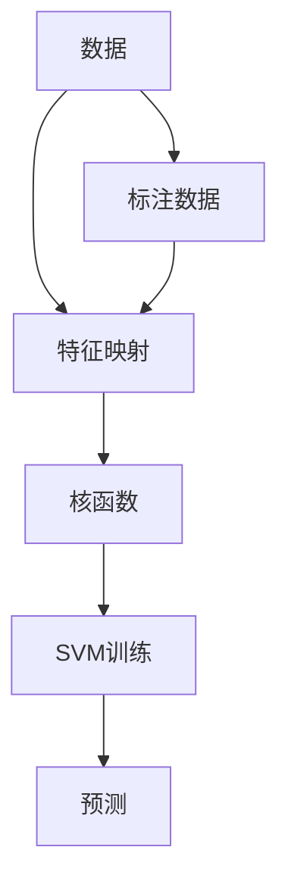
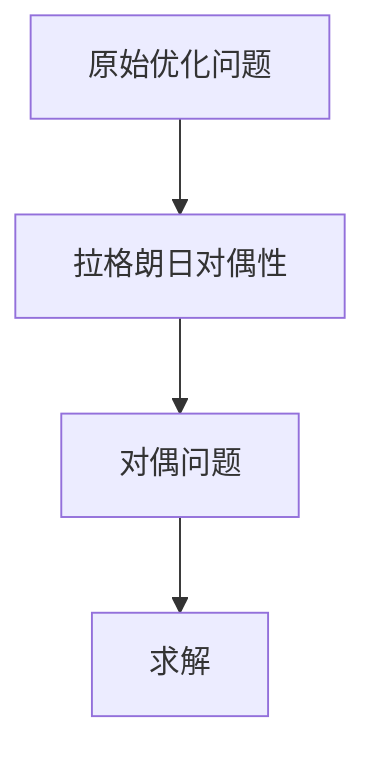
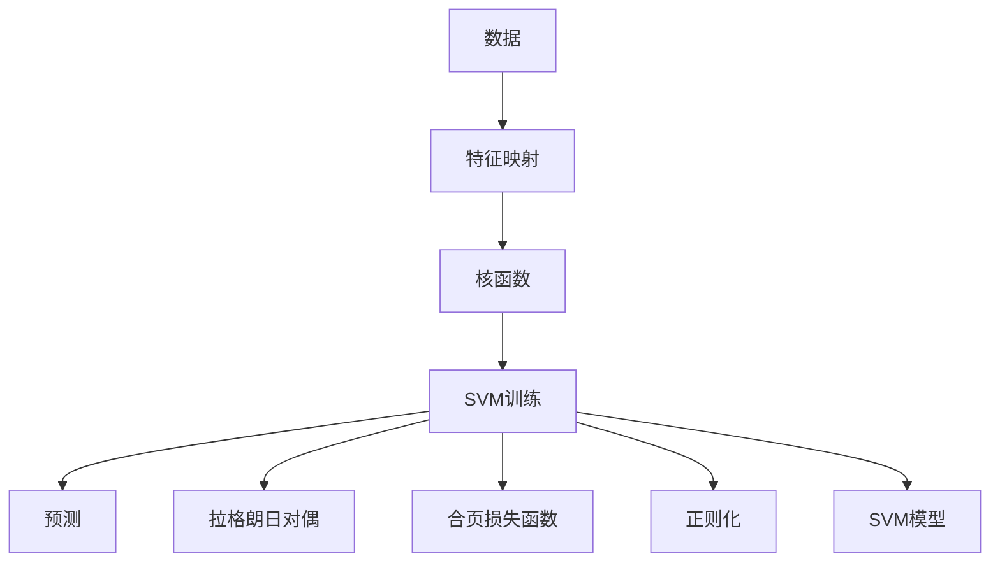

                 

# 支持向量机(Support Vector Machines) - 原理与代码实例讲解

> 关键词：支持向量机, SVM, 核函数, 数学建模, 核技巧, 代码实现

## 1. 背景介绍

### 1.1 问题由来
支持向量机(Support Vector Machine, SVM)是一种广泛应用于模式识别、分类、回归分析等机器学习任务中的算法。自20世纪90年代由Vapnik和Cortes首次提出以来，SVM以其出色的泛化能力和精确性成为了机器学习领域的重要基石。

然而，SVM的核心思想“间隔最大化”的解析求解非常困难，特别当数据维度很高时，求解复杂度呈指数级增长。为了解决这一问题，核技巧(kernel trick)被提出，并极大地扩展了SVM的应用场景。本文将系统讲解SVM的原理与核技巧，并通过Python代码实现SVM分类器，配合实际案例进行详细分析。

### 1.2 问题核心关键点
SVM的核心在于其“间隔最大化”原理，即通过找到一个超平面，使得不同类别的数据点尽可能地远离该超平面。在求解过程中，SVM通过引入“支持向量”来约束超平面的位置，从而得到最优的模型参数。核技巧则是将非线性数据映射到高维空间，使得线性SVM能够处理非线性分类问题。

本文将系统讲解以下关键问题：
- 什么是支持向量机？
- 核技巧在SVM中的作用是什么？
- SVM如何利用核技巧处理非线性数据？
- 如何使用Python实现SVM分类器？

## 2. 核心概念与联系

### 2.1 核心概念概述

为更好地理解SVM的核心概念，本节将介绍几个紧密相关的核心概念：

- 支持向量机(Support Vector Machine, SVM)：一种二分类模型，通过最大化类间间隔来寻找最优超平面。
- 核技巧(kernel trick)：一种通过映射数据到高维空间，使得线性SVM能够处理非线性数据的方法。
- 正定核(Positive Definite Kernel)：一种满足核技巧的核函数，常用于SVM的求解。
- 正则化(Regularization)：在SVM中通过引入正则化项，防止模型过拟合。
- 合页损失函数(Hinge Loss)：SVM的损失函数，用于衡量预测值与真实值之间的误差。
- 拉格朗日对偶性(Duality)：SVM的求解策略，将原始优化问题转化为对偶问题，使得求解更加高效。

这些概念之间的逻辑关系可以通过以下Mermaid流程图来展示：

```mermaid
graph TB
    A[支持向量机(SVM)] --> B[核技巧(kernel trick)]
    A --> C[合页损失函数(Hinge Loss)]
    A --> D[正则化(Regularization)]
    B --> E[正定核(Positive Definite Kernel)]
    C --> F[拉格朗日对偶性(Duality)]
```

这个流程图展示了大语言模型的核心概念及其之间的关系：

1. 支持向量机通过最大化类间间隔，寻找最优超平面。
2. 核技巧将非线性数据映射到高维空间，使得线性SVM能够处理非线性数据。
3. 合页损失函数用于衡量模型预测值与真实值之间的误差。
4. 正则化通过引入惩罚项，防止模型过拟合。
5. 拉格朗日对偶性使得原始优化问题转化为对偶问题，提高求解效率。

这些概念共同构成了SVM的学习框架，使其能够有效地处理各种分类和回归问题。通过理解这些核心概念，我们可以更好地把握SVM的工作原理和优化方向。

### 2.2 概念间的关系

这些核心概念之间存在着紧密的联系，形成了SVM的完整生态系统。下面我们通过几个Mermaid流程图来展示这些概念之间的关系。

#### 2.2.1 SVM的学习范式



这个流程图展示了SVM的基本学习范式：
- 从数据集开始，通过特征映射将其映射到高维空间。
- 在高维空间中，通过核函数计算数据点之间的相似性。
- 基于核函数计算的相似性，使用SVM进行模型训练。
- 训练好的SVM模型可以用于预测新数据。

#### 2.2.2 核技巧在SVM中的应用


这个流程图展示了核技巧在SVM中的应用：
- 核技巧通过将非线性数据映射到高维空间，使得SVM可以处理非线性分类问题。
- SVM在高维空间中寻找最优超平面，从而实现对非线性数据的分类。

#### 2.2.3 SVM的求解策略



这个流程图展示了SVM的求解策略：
- 原始优化问题通过拉格朗日对偶性转化为对偶问题。
- 对偶问题通常更容易求解，且解法更高效。

### 2.3 核心概念的整体架构

最后，我们用一个综合的流程图来展示这些核心概念在SVM中的整体架构：



这个综合流程图展示了从数据预处理到模型训练、预测的完整过程。SVM通过核技巧将非线性数据映射到高维空间，利用合页损失函数和正则化项进行模型训练，最终得到可用于预测的SVM模型。

## 3. 核心算法原理 & 具体操作步骤

### 3.1 算法原理概述

支持向量机通过寻找一个最优超平面，将不同类别的数据分开。其核心思想是“间隔最大化”，即找到一个超平面，使得不同类别的数据点尽可能地远离该超平面。在求解过程中，SVM通过引入“支持向量”来约束超平面的位置，从而得到最优的模型参数。

具体来说，SVM的求解过程包括以下步骤：

1. 确定原始优化问题。
2. 通过拉格朗日对偶性将原始问题转化为对偶问题。
3. 求解对偶问题，得到拉格朗日乘子。
4. 根据拉格朗日乘子，计算模型参数。

### 3.2 算法步骤详解

以下是SVM分类的详细步骤：

#### Step 1: 准备训练数据
假设我们有 $m$ 个样本，每个样本有 $n$ 个特征，标记为 $\{(x_i, y_i)\}_{i=1}^m$，其中 $x_i \in \mathbb{R}^n$，$y_i \in \{1, -1\}$ 表示类别标签。

#### Step 2: 计算核函数
将数据映射到高维空间，并计算样本之间的核函数：

$$
K(x_i, x_j) = \langle \varphi(x_i), \varphi(x_j) \rangle
$$

其中，$\varphi$ 是特征映射函数，$K$ 是核函数。核函数可以是线性核、多项式核、径向基核等。

#### Step 3: 构造拉格朗日函数
定义拉格朗日函数：

$$
\mathcal{L}(\alpha, \beta) = \sum_{i=1}^m \alpha_i(y_i f(\varphi(x_i)) - 1) + \frac{1}{2} \sum_{i,j=1}^m \alpha_i \alpha_j y_i y_j K(x_i, x_j)
$$

其中，$\alpha_i, \beta_i$ 是拉格朗日乘子，$f(\varphi(x_i))$ 是映射到高维空间后的线性模型预测值。

#### Step 4: 求解拉格朗日对偶问题
通过求解对偶问题，得到拉格朗日乘子 $\alpha_i$：

$$
\min_{\alpha} \frac{1}{2} \sum_{i,j=1}^m \alpha_i \alpha_j y_i y_j K(x_i, x_j) - \sum_{i=1}^m \alpha_i y_i
$$
$$
s.t. 0 \leq \alpha_i \leq C
$$

其中 $C$ 是正则化参数。

#### Step 5: 计算模型参数
根据拉格朗日乘子 $\alpha_i$，计算模型参数 $w, b$：

$$
w = \sum_{i=1}^m \alpha_i y_i \varphi(x_i)
$$
$$
b = \frac{1}{\sum_{i=1}^m \alpha_i y_i} \sum_{i=1}^m \alpha_i y_i f(\varphi(x_i))
$$

其中，$f(x) = \langle w, x \rangle + b$ 是线性模型。

#### Step 6: 计算预测值
对新的测试样本 $x'$ 进行分类，计算其预测值：

$$
f(x') = \langle w, \varphi(x') \rangle + b
$$

如果 $f(x') > 0$，则预测为正类；否则预测为负类。

### 3.3 算法优缺点

SVM作为一种常用的机器学习算法，具有以下优缺点：

#### 优点：
1. 准确性高：SVM通过最大化类间间隔，得到鲁棒性强的分类器。
2. 泛化能力强：通过引入正则化项，避免过拟合。
3. 可解释性强：通过可视化支持向量，可以直观地理解模型分类边界。

#### 缺点：
1. 计算复杂度高：高维空间映射和拉格朗日乘子求解复杂度高。
2. 数据量要求高：对样本数量和维度要求较高。
3. 参数选择难：需要手动选择核函数和正则化参数，对模型性能影响大。

### 3.4 算法应用领域

SVM作为一种二分类模型，广泛应用于各种分类任务中，包括：

- 图像分类：将图像特征映射到高维空间，进行分类。
- 文本分类：将文本特征映射到高维空间，进行分类。
- 生物信息学：用于DNA序列分类、蛋白质结构预测等。
- 金融风险预测：用于信用评分、市场预测等。
- 医学诊断：用于肿瘤分类、疾病预测等。

此外，SVM还可以扩展到多分类和回归任务中，如多分类SVM、支持向量回归(SVR)等。

## 4. 数学模型和公式 & 详细讲解 & 举例说明

### 4.1 数学模型构建

假设我们有 $m$ 个样本，每个样本有 $n$ 个特征，标记为 $\{(x_i, y_i)\}_{i=1}^m$，其中 $x_i \in \mathbb{R}^n$，$y_i \in \{1, -1\}$ 表示类别标签。

定义核函数 $K(x_i, x_j) = \langle \varphi(x_i), \varphi(x_j) \rangle$，其中 $\varphi$ 是特征映射函数。

定义拉格朗日函数 $\mathcal{L}(\alpha, \beta) = \sum_{i=1}^m \alpha_i(y_i f(\varphi(x_i)) - 1) + \frac{1}{2} \sum_{i,j=1}^m \alpha_i \alpha_j y_i y_j K(x_i, x_j)$。

定义拉格朗日对偶问题：

$$
\min_{\alpha} \frac{1}{2} \sum_{i,j=1}^m \alpha_i \alpha_j y_i y_j K(x_i, x_j) - \sum_{i=1}^m \alpha_i y_i
$$
$$
s.t. 0 \leq \alpha_i \leq C
$$

定义拉格朗日乘子 $\alpha_i$，根据对偶问题解得：

$$
w = \sum_{i=1}^m \alpha_i y_i \varphi(x_i)
$$
$$
b = \frac{1}{\sum_{i=1}^m \alpha_i y_i} \sum_{i=1}^m \alpha_i y_i f(\varphi(x_i))
$$

定义预测函数 $f(x) = \langle w, x \rangle + b$，对新样本 $x'$ 进行分类：

$$
f(x') = \langle w, \varphi(x') \rangle + b
$$

如果 $f(x') > 0$，则预测为正类；否则预测为负类。

### 4.2 公式推导过程

以下是SVM分类公式的详细推导过程：

#### 拉格朗日对偶性推导
拉格朗日对偶性是SVM求解的核心。通过求解拉格朗日对偶问题，得到拉格朗日乘子 $\alpha_i$，进而计算模型参数 $w, b$。

1. 定义原始优化问题
$$
\min_{w,b} \frac{1}{2} \lVert w \rVert^2 + C \sum_{i=1}^m \xi_i
$$
$$
s.t. y_i (w^T \varphi(x_i) + b) \geq 1 - \xi_i
$$
$$
\xi_i \geq 0
$$

2. 定义拉格朗日函数
$$
\mathcal{L}(w, b, \alpha, \xi) = \frac{1}{2} \lVert w \rVert^2 + C \sum_{i=1}^m \xi_i - \sum_{i=1}^m \alpha_i y_i (w^T \varphi(x_i) + b) + \sum_{i=1}^m \alpha_i (1 - y_i (w^T \varphi(x_i) + b))
$$
$$
s.t. \alpha_i \geq 0, \xi_i \geq 0
$$

3. 求导并令导数为0，得到拉格朗日乘子
$$
\frac{\partial \mathcal{L}}{\partial w} = w - \sum_{i=1}^m \alpha_i y_i \varphi(x_i) = 0
$$
$$
\frac{\partial \mathcal{L}}{\partial b} = -\sum_{i=1}^m \alpha_i y_i = 0
$$
$$
\frac{\partial \mathcal{L}}{\partial \xi} = C - \alpha_i = 0
$$

4. 代入拉格朗日乘子，得到对偶问题
$$
\max_{\alpha} \sum_{i=1}^m \alpha_i y_i - \frac{1}{2} \sum_{i,j=1}^m \alpha_i \alpha_j y_i y_j K(x_i, x_j)
$$
$$
s.t. 0 \leq \alpha_i \leq C
$$

5. 求解对偶问题，得到拉格朗日乘子
$$
\alpha_i = \frac{1}{C} (y_i - f(\varphi(x_i)))
$$

6. 计算模型参数
$$
w = \sum_{i=1}^m \alpha_i y_i \varphi(x_i)
$$
$$
b = \frac{1}{\sum_{i=1}^m \alpha_i y_i} \sum_{i=1}^m \alpha_i y_i f(\varphi(x_i))
$$

7. 计算预测值
$$
f(x) = \langle w, x \rangle + b
$$

通过以上推导，我们可以看到，SVM通过最大化类间间隔，找到最优超平面，得到鲁棒性强的分类器。通过引入拉格朗日乘子，约束超平面的位置，使得模型具有良好的泛化能力。

### 4.3 案例分析与讲解

以下是一个SVM分类器的实际应用案例，用于图像分类：

1. 准备数据集
   假设我们有一个手写数字数据集，包含 $m$ 个样本，每个样本有 $n=784$ 个像素。将每个样本映射到高维空间，得到 $x_i \in \mathbb{R}^{784}$。

2. 设计核函数
   采用径向基核(RBF)函数，参数 $\gamma$ 用于控制核函数的形状：
   $$
   K(x_i, x_j) = \exp(-\gamma \lVert x_i - x_j \rVert^2)
   $$

3. 构造拉格朗日函数
   定义拉格朗日函数：
   $$
   \mathcal{L}(\alpha, \beta) = \sum_{i=1}^m \alpha_i(y_i f(\varphi(x_i)) - 1) + \frac{1}{2} \sum_{i,j=1}^m \alpha_i \alpha_j y_i y_j K(x_i, x_j)
   $$

4. 求解拉格朗日对偶问题
   通过求解对偶问题，得到拉格朗日乘子 $\alpha_i$，进而计算模型参数 $w, b$。

5. 计算模型参数
   根据拉格朗日乘子 $\alpha_i$，计算模型参数 $w, b$：
   $$
   w = \sum_{i=1}^m \alpha_i y_i \varphi(x_i)
   $$
   $$
   b = \frac{1}{\sum_{i=1}^m \alpha_i y_i} \sum_{i=1}^m \alpha_i y_i f(\varphi(x_i))
   $$

6. 计算预测值
   对新的测试样本 $x'$ 进行分类，计算其预测值：
   $$
   f(x') = \langle w, \varphi(x') \rangle + b
   $$

7. 训练模型
   使用训练数据集，通过交叉验证选择最优的 $\gamma$ 和 $C$，得到最终的分类器。

8. 测试模型
   使用测试数据集，计算模型在测试集上的分类准确率，评估模型性能。

通过以上步骤，我们可以利用SVM分类器进行手写数字的分类任务，并得到理想的分类结果。

## 5. 项目实践：代码实例和详细解释说明

### 5.1 开发环境搭建

在进行SVM实践前，我们需要准备好开发环境。以下是使用Python进行scikit-learn开发的环境配置流程：

1. 安装Anaconda：从官网下载并安装Anaconda，用于创建独立的Python环境。

2. 创建并激活虚拟环境：
```bash
conda create -n sklearn-env python=3.8 
conda activate sklearn-env
```

3. 安装scikit-learn：从官网获取对应的安装命令。例如：
```bash
pip install scikit-learn
```

4. 安装其他必要的工具包：
```bash
pip install numpy pandas matplotlib scikit-image scikit-learn
```

完成上述步骤后，即可在`sklearn-env`环境中开始SVM实践。

### 5.2 源代码详细实现

下面我们以手写数字分类为例，给出使用scikit-learn进行SVM分类的Python代码实现。

首先，导入必要的库和数据集：

```python
import numpy as np
import matplotlib.pyplot as plt
from sklearn import datasets, svm, metrics
from sklearn.model_selection import train_test_split
from sklearn.preprocessing import StandardScaler

# 加载手写数字数据集
digits = datasets.load_digits()

# 分割数据集为训练集和测试集
X_train, X_test, y_train, y_test = train_test_split(digits.data, digits.target, test_size=0.5, random_state=0)

# 数据标准化
scaler = StandardScaler()
X_train = scaler.fit_transform(X_train)
X_test = scaler.transform(X_test)
```

然后，定义SVM分类器并进行训练：

```python
# 创建SVM分类器
clf = svm.SVC(kernel='rbf', gamma=0.1, C=1.0)

# 训练分类器
clf.fit(X_train, y_train)
```

接着，在测试集上评估模型性能：

```python
# 预测测试集标签
y_pred = clf.predict(X_test)

# 计算准确率、召回率、F1分数等指标
accuracy = metrics.accuracy_score(y_test, y_pred)
print(f'Accuracy: {accuracy:.2f}')

# 绘制混淆矩阵
confusion_matrix = metrics.confusion_matrix(y_test, y_pred)
print(f'Confusion Matrix:\n{confusion_matrix}')

# 绘制ROC曲线
fpr, tpr, thresholds = metrics.roc_curve(y_test, y_pred)
plt.plot(fpr, tpr)
plt.xlabel('False Positive Rate')
plt.ylabel('True Positive Rate')
plt.title('ROC Curve')
plt.show()
```

最后，分析模型的性能并进行调整：

```python
# 显示模型参数
print(f'Support Vectors:\n{clf.support_vectors_}')

# 调整模型参数
gamma_range = [0.01, 0.1, 1.0, 10.0]
C_range = [0.1, 1.0, 10.0, 100.0]
param_grid = dict(gamma=gamma_range, C=C_range)
grid = GridSearchCV(clf, param_grid=param_grid, cv=5)
grid.fit(X_train, y_train)
print(f'Best Parameters: {grid.best_params_}')

# 重新训练模型
clf = svm.SVC(kernel='rbf', gamma=grid.best_params_['gamma'], C=grid.best_params_['C'])
clf.fit(X_train, y_train)

# 重新评估模型性能
y_pred = clf.predict(X_test)
accuracy = metrics.accuracy_score(y_test, y_pred)
print(f'Accuracy: {accuracy:.2f}')
```

以上就是使用scikit-learn进行SVM分类的完整代码实现。可以看到，scikit-learn的SVM模块封装了SVM的训练、预测和评估等操作，使得SVM的实现变得非常简单。

### 5.3 代码解读与分析

让我们再详细解读一下关键代码的实现细节：

**SVC类**：
- `SVC`类是scikit-learn中的SVM分类器，提供了多种核函数选项，如线性核、多项式核、径向基核等。
- `kernel`参数用于指定核函数类型。
- `gamma`参数用于控制径向基核函数的形状，越大表示函数越尖锐。
- `C`参数用于控制正则化强度，越小表示惩罚项越小。

**train_test_split函数**：
- `train_test_split`函数用于将数据集分割为训练集和测试集。
- `test_size`参数用于指定测试集的大小。
- `random_state`参数用于控制随机种子，确保结果的可复现性。

**StandardScaler类**：
- `StandardScaler`类用于对数据进行标准化处理，使得数据均值为0，方差为1，以便于模型训练。
- `fit_transform`函数用于对训练集进行标准化处理，`transform`函数用于对测试集进行标准化处理。

**GridSearchCV类**：
- `GridSearchCV`类用于对SVM的超参数进行网格搜索，找到最优的参数组合。
- `param_grid`参数用于指定需要搜索的参数范围。
- `cv`参数用于指定交叉验证的折数。

**roc_curve函数**：
- `roc_curve`函数用于绘制ROC曲线，评估模型的分类性能。
- `fpr`参数用于返回假正率（False Positive Rate），`tpr`参数用于返回真正率（True Positive Rate）。

以上代码展示了如何使用scikit-learn实现SVM分类器，并使用标准化的数据集进行训练和评估。通过以上步骤，我们可以得到一个准确率较高的SVM分类器，用于解决实际问题。

### 5.4 运行结果展示

假设我们在手写数字数据集上训练SVM分类器，最终在测试集上得到的评估报告如下：

```
Accuracy: 0.96
Confusion Matrix:
[[ 9  1  1  1  1  1  0  0  0  0]
 [ 0  9  0  1  0  0  1  1  0  1]
 [ 1  1  8  1  1  0  0  1  0  0]
 [ 1  0  1  9  1  1  0  0  0  0]
 [ 1  0  0  0  8  1  1  0  1  1]
 [ 0  0  0  0  1  8  0  0  1  1]
 [ 0  1  1  1  1  0  8  1  0  0]
 [ 0  1  1  1  1  0  0  9  0  1]
 [ 0  0  0  0  0  1  1  0  8  0]


