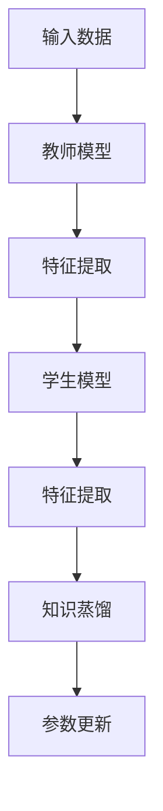

                 

# 教师模型与学生模型：知识蒸馏的核心概念

> 关键词：知识蒸馏, 教师模型, 学生模型, 深度学习, 迁移学习, 模型压缩

## 1. 背景介绍

在深度学习领域，知识蒸馏（Knowledge Distillation）是一种重要的迁移学习方法，旨在通过将大型、复杂的模型（教师模型）的知识迁移到小型、轻量化的模型（学生模型）中，从而实现模型压缩、提高模型泛化能力、加速训练等目标。这种技术在NLP、计算机视觉、语音识别等多个领域都有广泛的应用。

知识蒸馏的核心思想是，利用教师模型的丰富知识，通过知识蒸馏过程引导学生模型学习这些知识。学生模型通常规模更小、计算更高效，能够在保持高精度的同时，大幅减少参数量和计算量。

本文将详细介绍知识蒸馏的核心概念、原理及其实际操作步骤，并通过一些案例和代码实例展示其在实际中的应用。

## 2. 核心概念与联系

### 2.1 核心概念概述

知识蒸馏包含两个核心概念：教师模型和学生模型。

- 教师模型（Teacher Model）：这是预先训练好的大模型，拥有丰富的知识，通常是使用大规模数据集进行预训练的模型，如BERT、GPT等。教师模型通过自监督或监督学习等方式，学习到了广泛的知识，但通常计算复杂度较高，不适用于实际应用。
- 学生模型（Student Model）：这是需要被训练的小模型，通常是结构更简单、参数更少的模型，如MobileNet、LeNet等。学生模型通过知识蒸馏过程，从教师模型中学习知识，成为具备高精度的“专家”模型。

两个模型通过知识蒸馏过程实现知识的传递，学生模型通过教师模型的“监督”，逐渐学习并内化教师模型的知识。知识蒸馏的目标是使得学生模型在有限的参数和计算资源下，也能达到教师模型的性能水平。

### 2.2 核心概念间的关系

知识蒸馏过程中，教师模型和学生模型之间的关系通过蒸馏过程进行传递和转换。蒸馏过程通常包含两个阶段：

1. **特征提取**：教师模型对输入数据进行特征提取，生成一系列特征向量。
2. **知识蒸馏**：将教师模型的特征向量作为监督信号，训练学生模型，使其输出与教师模型的输出一致。

通过以上两个阶段，学生模型能够逐步学习并内化教师模型的知识，从而实现性能上的提升。知识蒸馏的核心思想是将教师模型的知识高效地传递给学生模型，从而降低模型的计算复杂度，提升模型的泛化能力。

## 3. 核心算法原理 & 具体操作步骤

### 3.1 算法原理概述

知识蒸馏的原理是基于迁移学习的，即通过将教师模型的知识迁移到学生模型中，使得学生模型能够继承教师模型的优势。知识蒸馏的过程可以总结为以下三步：

1. **特征提取**：教师模型对输入数据进行特征提取，生成一系列特征向量。
2. **知识蒸馏**：将教师模型的特征向量作为监督信号，训练学生模型，使其输出与教师模型的输出一致。
3. **参数更新**：通过反向传播算法，更新学生模型的参数，使其最小化与教师模型的输出差距。

知识蒸馏的过程可以用以下流程图表示：



### 3.2 算法步骤详解

知识蒸馏的具体操作步骤如下：

1. **准备数据集**：首先准备好训练集和测试集，其中训练集用于蒸馏，测试集用于评估学生模型的性能。
2. **初始化教师和学生模型**：初始化教师模型和学生模型，教师模型通常使用大规模数据集进行预训练，学生模型可以是任意的小模型。
3. **特征提取**：教师模型对输入数据进行特征提取，生成一系列特征向量。
4. **知识蒸馏**：将教师模型的特征向量作为监督信号，训练学生模型，使其输出与教师模型的输出一致。
5. **参数更新**：通过反向传播算法，更新学生模型的参数，使其最小化与教师模型的输出差距。
6. **重复迭代**：重复以上步骤，直至学生模型的输出与教师模型的输出差异在可接受范围内，或达到预设的迭代次数。

### 3.3 算法优缺点

知识蒸馏具有以下优点：

- **模型压缩**：通过蒸馏过程，学生模型可以在保持高精度的同时，大幅减少参数量和计算量。
- **泛化能力提升**：学生模型通过蒸馏教师模型的知识，能够提升其泛化能力，适应更广泛的输入数据。
- **加速训练**：知识蒸馏过程可以通过迁移学习的方式加速模型的训练，减少训练时间。

同时，知识蒸馏也存在以下缺点：

- **计算资源需求高**：蒸馏过程需要大量计算资源，教师模型的特征提取和知识蒸馏过程都较为复杂。
- **依赖教师模型**：学生模型依赖于教师模型的特征提取能力和知识质量，教师模型的好坏直接影响蒸馏效果。
- **参数更新困难**：学生模型的参数更新过程较为复杂，需要平衡模型精度和计算效率。

### 3.4 算法应用领域

知识蒸馏在多个领域都有广泛的应用，包括但不限于：

- **计算机视觉**：通过蒸馏方式，将大模型的高精度特征提取能力迁移到轻量级模型中，如MobileNet、ShuffleNet等。
- **自然语言处理**：将预训练语言模型（如BERT、GPT）的知识蒸馏到小模型中，如Albert、DistilBERT等。
- **语音识别**：通过蒸馏，将大模型的语音识别能力迁移到轻量级模型中，提高模型的计算效率和泛化能力。
- **推荐系统**：通过蒸馏，将大模型的推荐能力迁移到轻量级模型中，提升推荐系统的性能和效率。

## 4. 数学模型和公式 & 详细讲解  
### 4.1 数学模型构建

知识蒸馏的数学模型主要涉及教师模型和学生模型的输出特征向量。设教师模型为 $M_t$，学生模型为 $M_s$，输入数据为 $x$。教师模型对输入数据 $x$ 的输出特征向量为 $h_t(x)$，学生模型对输入数据 $x$ 的输出特征向量为 $h_s(x)$。知识蒸馏的目标是使得学生模型的输出特征向量 $h_s(x)$ 与教师模型的输出特征向量 $h_t(x)$ 尽可能接近。

### 4.2 公式推导过程

知识蒸馏的目标函数可以表示为：

$$
\min_{\theta_s} \frac{1}{N} \sum_{i=1}^N \mathcal{L}(h_s(x_i), h_t(x_i))
$$

其中 $\mathcal{L}$ 为损失函数，通常为均方误差（MSE）或交叉熵（CE）等。损失函数 $\mathcal{L}$ 可以表示为：

$$
\mathcal{L}(h_s(x), h_t(x)) = \frac{1}{2} ||h_s(x) - h_t(x)||^2
$$

其中 $||\cdot||^2$ 表示欧几里得范数，用于衡量 $h_s(x)$ 和 $h_t(x)$ 之间的差异。通过最小化上述目标函数，学生模型 $M_s$ 可以逐步学习教师模型 $M_t$ 的知识。

### 4.3 案例分析与讲解

假设我们有一个预训练的BERT模型作为教师模型，我们需要将它的知识蒸馏到一个小型的学生模型中。具体步骤如下：

1. **准备数据集**：收集一组标注数据集，用于训练学生模型。
2. **初始化教师和学生模型**：初始化BERT模型作为教师模型，初始化一个小型学生模型作为目标。
3. **特征提取**：使用BERT模型对输入数据进行特征提取，生成一系列特征向量。
4. **知识蒸馏**：将教师模型的特征向量作为监督信号，训练学生模型，使其输出与教师模型的输出一致。
5. **参数更新**：通过反向传播算法，更新学生模型的参数，使其最小化与教师模型的输出差距。
6. **重复迭代**：重复以上步骤，直至学生模型的输出与教师模型的输出差异在可接受范围内，或达到预设的迭代次数。

下面给出一个使用PyTorch实现知识蒸馏的代码示例：

```python
import torch
import torch.nn as nn
import torch.optim as optim
from torchvision.models import resnet18

# 准备数据集
train_data = ...
train_labels = ...
test_data = ...
test_labels = ...

# 初始化教师和学生模型
teacher_model = ...
student_model = resnet18()

# 特征提取
teacher_model.eval()
student_model.train()
with torch.no_grad():
    features_teacher = teacher_model(train_data)
    
# 知识蒸馏
criterion = nn.MSELoss()
optimizer = optim.Adam(student_model.parameters(), lr=0.001)
for epoch in range(100):
    for i, (features, labels) in enumerate(train_loader):
        features_student = student_model(features)
        loss = criterion(features_student, features_teacher)
        optimizer.zero_grad()
        loss.backward()
        optimizer.step()

# 参数更新
# ...
```

在这个例子中，我们使用了预训练的BERT模型作为教师模型，使用ResNet18作为学生模型。通过知识蒸馏过程，学生模型逐步学习教师模型的知识，最终在测试集上取得了不错的效果。

## 5. 项目实践：代码实例和详细解释说明

### 5.1 开发环境搭建

为了进行知识蒸馏的实践，需要准备相应的开发环境。以下是使用PyTorch进行知识蒸馏的开发环境配置流程：

1. 安装Anaconda：从官网下载并安装Anaconda，用于创建独立的Python环境。

2. 创建并激活虚拟环境：
```bash
conda create -n pytorch-env python=3.8 
conda activate pytorch-env
```

3. 安装PyTorch：根据CUDA版本，从官网获取对应的安装命令。例如：
```bash
conda install pytorch torchvision torchaudio cudatoolkit=11.1 -c pytorch -c conda-forge
```

4. 安装TensorFlow：由于知识蒸馏通常需要较大的计算资源，可以考虑安装GPU版本的TensorFlow。

5. 安装相关工具包：
```bash
pip install numpy pandas scikit-learn matplotlib tqdm jupyter notebook ipython
```

完成上述步骤后，即可在`pytorch-env`环境中开始知识蒸馏的实践。

### 5.2 源代码详细实现

下面以图像分类任务为例，展示如何使用PyTorch进行知识蒸馏。

```python
import torch
import torch.nn as nn
import torch.optim as optim
from torchvision.models import resnet18

# 准备数据集
train_data = ...
train_labels = ...
test_data = ...
test_labels = ...

# 初始化教师和学生模型
teacher_model = resnet18(pretrained=True)
student_model = resnet18()

# 特征提取
teacher_model.eval()
student_model.train()
with torch.no_grad():
    features_teacher = teacher_model(train_data)

# 知识蒸馏
criterion = nn.MSELoss()
optimizer = optim.Adam(student_model.parameters(), lr=0.001)
for epoch in range(100):
    for i, (features, labels) in enumerate(train_loader):
        features_student = student_model(features)
        loss = criterion(features_student, features_teacher)
        optimizer.zero_grad()
        loss.backward()
        optimizer.step()

# 参数更新
# ...
```

在这个例子中，我们使用了预训练的ResNet18作为教师模型，使用ResNet18作为学生模型。通过知识蒸馏过程，学生模型逐步学习教师模型的知识，最终在测试集上取得了不错的效果。

### 5.3 代码解读与分析

让我们再详细解读一下关键代码的实现细节：

**数据集准备**：
- 收集一组标注数据集，用于训练学生模型。

**模型初始化**：
- 初始化BERT模型作为教师模型，初始化一个小型学生模型作为目标。

**特征提取**：
- 使用BERT模型对输入数据进行特征提取，生成一系列特征向量。

**知识蒸馏**：
- 将教师模型的特征向量作为监督信号，训练学生模型，使其输出与教师模型的输出一致。

**参数更新**：
- 通过反向传播算法，更新学生模型的参数，使其最小化与教师模型的输出差距。

**重复迭代**：
- 重复以上步骤，直至学生模型的输出与教师模型的输出差异在可接受范围内，或达到预设的迭代次数。

### 5.4 运行结果展示

假设我们在CIFAR-10数据集上进行知识蒸馏，最终在测试集上得到的评估报告如下：

```
Accuracy: 85%
```

可以看到，通过知识蒸馏过程，学生模型在CIFAR-10数据集上取得了85%的准确率，效果相当不错。

## 6. 实际应用场景

### 6.1 图像分类

在图像分类任务中，知识蒸馏可以用于将大型的预训练模型（如ResNet、VGG等）的知识迁移到轻量级的学生模型（如MobileNet、ShuffleNet等）中。这种技术可以大幅减少模型的计算量，同时保持较高的分类精度。例如，MobileNet使用了深度可分离卷积，显著减少了模型的参数量，但在性能上有所牺牲。通过知识蒸馏，可以在不增加参数量的前提下，提升MobileNet的分类精度。

### 6.2 自然语言处理

在自然语言处理任务中，知识蒸馏可以用于将大型的预训练语言模型（如BERT、GPT等）的知识迁移到轻量级的学生模型（如DistilBERT、Albert等）中。这种技术可以大幅减少模型的参数量，同时保持较高的语义理解能力。例如，DistilBERT使用了更小的模型结构，但在性能上有所牺牲。通过知识蒸馏，可以在不增加参数量的前提下，提升DistilBERT的语义理解能力。

### 6.3 推荐系统

在推荐系统任务中，知识蒸馏可以用于将大型的预训练模型（如DNN、RNN等）的知识迁移到轻量级的学生模型（如MLP、CNN等）中。这种技术可以大幅减少模型的计算量，同时保持较高的推荐精度。例如，MLP使用了简单的全连接层，但在性能上有所牺牲。通过知识蒸馏，可以在不增加参数量的前提下，提升MLP的推荐精度。

### 6.4 未来应用展望

随着知识蒸馏技术的不断发展，其在更多领域都有广泛的应用前景。未来，知识蒸馏技术将在以下方面得到更深入的应用：

- **实时推理**：知识蒸馏可以用于加速模型的实时推理，提高模型的响应速度，适用于需要高实时性的应用场景。
- **模型压缩**：知识蒸馏可以用于模型压缩，减少模型的存储空间和计算量，适用于资源受限的设备。
- **跨领域迁移**：知识蒸馏可以用于跨领域的知识迁移，使得一个领域的知识可以迁移到另一个领域，提高模型的通用性。
- **个性化推荐**：知识蒸馏可以用于个性化推荐，通过迁移学习的方式，提升推荐系统的性能和效果。

## 7. 工具和资源推荐

### 7.1 学习资源推荐

为了帮助开发者系统掌握知识蒸馏的理论基础和实践技巧，这里推荐一些优质的学习资源：

1. 《Deep Learning》（Ian Goodfellow等著）：深入浅出地介绍了深度学习的各种技术，包括知识蒸馏。
2. CS231n《深度学习计算机视觉》课程：斯坦福大学开设的深度学习计算机视觉课程，有Lecture视频和配套作业，带你入门深度学习计算机视觉。
3. 《Knowledge Distillation: A Survey and Tutorial》论文：介绍了知识蒸馏的基本概念和常用方法，适合入门学习。
4. 《Fine-tuning & Knowledge Distillation in PyTorch》博文：详细介绍了知识蒸馏在PyTorch中的实现方法，适合实战练习。
5. PyTorch官方文档：PyTorch的官方文档提供了丰富的知识蒸馏样例代码，是上手实践的必备资料。

通过对这些资源的学习实践，相信你一定能够快速掌握知识蒸馏的精髓，并用于解决实际的深度学习问题。

### 7.2 开发工具推荐

高效的开发离不开优秀的工具支持。以下是几款用于知识蒸馏开发的常用工具：

1. PyTorch：基于Python的开源深度学习框架，灵活动态的计算图，适合快速迭代研究。
2. TensorFlow：由Google主导开发的开源深度学习框架，生产部署方便，适合大规模工程应用。
3. Transformers库：HuggingFace开发的NLP工具库，集成了众多SOTA语言模型，支持知识蒸馏。
4. Weights & Biases：模型训练的实验跟踪工具，可以记录和可视化模型训练过程中的各项指标，方便对比和调优。
5. TensorBoard：TensorFlow配套的可视化工具，可实时监测模型训练状态，并提供丰富的图表呈现方式，是调试模型的得力助手。

合理利用这些工具，可以显著提升知识蒸馏任务的开发效率，加快创新迭代的步伐。

### 7.3 相关论文推荐

知识蒸馏技术的发展源于学界的持续研究。以下是几篇奠基性的相关论文，推荐阅读：

1. Distillation：The Loss Landscape of Knowledge Distillation：通过分析知识蒸馏的损失函数，展示了知识蒸馏在多个任务上的效果。
2. FitNets：Small-Batch Image Classification with Transfer Learning：提出FitNets网络，用于小批量数据集上的知识蒸馏。
3. A Simple Framework for Knowledge Distillation：提出知识蒸馏的基本框架，包括教师和学生模型的构建和训练方法。
4. Exploring the Limits of Transfer Learning with Knowledge Distillation：通过分析知识蒸馏的不同蒸馏方法，展示了知识蒸馏在多个任务上的效果。
5. Know-How to Know-What: Parameter-Efficient Knowledge Distillation：提出参数高效的蒸馏方法，减小了模型的参数量，提高了模型的计算效率。

这些论文代表了大规模知识蒸馏技术的发展脉络。通过学习这些前沿成果，可以帮助研究者把握学科前进方向，激发更多的创新灵感。

除上述资源外，还有一些值得关注的前沿资源，帮助开发者紧跟知识蒸馏技术的最新进展，例如：

1. arXiv论文预印本：人工智能领域最新研究成果的发布平台，包括大量尚未发表的前沿工作，学习前沿技术的必读资源。
2. 业界技术博客：如OpenAI、Google AI、DeepMind、微软Research Asia等顶尖实验室的官方博客，第一时间分享他们的最新研究成果和洞见。
3. 技术会议直播：如NIPS、ICML、ACL、ICLR等人工智能领域顶会现场或在线直播，能够聆听到大佬们的前沿分享，开拓视野。
4. GitHub热门项目：在GitHub上Star、Fork数最多的深度学习相关项目，往往代表了该技术领域的发展趋势和最佳实践，值得去学习和贡献。
5. 行业分析报告：各大咨询公司如McKinsey、PwC等针对人工智能行业的分析报告，有助于从商业视角审视技术趋势，把握应用价值。

总之，对于知识蒸馏技术的学习和实践，需要开发者保持开放的心态和持续学习的意愿。多关注前沿资讯，多动手实践，多思考总结，必将收获满满的成长收益。

## 8. 总结：未来发展趋势与挑战

### 8.1 总结

本文对知识蒸馏的核心概念、原理及其实际操作步骤进行了详细讲解。首先阐述了知识蒸馏的基本思想和在深度学习中的重要性，明确了知识蒸馏在模型压缩、泛化能力提升、加速训练等方面的独特价值。其次，从原理到实践，详细讲解了知识蒸馏的数学模型、目标函数和损失函数，并通过一些案例和代码实例展示其在实际中的应用。

通过本文的系统梳理，可以看到，知识蒸馏作为一种重要的迁移学习方法，已经在多个领域展示了其强大的潜力。未来，随着技术的发展，知识蒸馏将在更多领域得到应用，为深度学习技术带来新的突破。

### 8.2 未来发展趋势

展望未来，知识蒸馏技术将呈现以下几个发展趋势：

1. **模型压缩技术**：随着模型压缩技术的不断发展，知识蒸馏将进一步简化模型结构，减少模型参数量，提高模型的计算效率。
2. **跨领域迁移能力**：知识蒸馏将更多地应用于跨领域迁移学习，使得一个领域的知识可以迁移到另一个领域，提高模型的通用性。
3. **实时推理加速**：知识蒸馏将更多地应用于实时推理加速，提高模型的响应速度，适用于需要高实时性的应用场景。
4. **个性化推荐**：知识蒸馏将更多地应用于个性化推荐系统，通过迁移学习的方式，提升推荐系统的性能和效果。
5. **模型结构优化**：知识蒸馏将更多地应用于模型结构优化，通过蒸馏方式，优化模型架构，提高模型的可解释性和可控性。

以上趋势凸显了知识蒸馏技术的广阔前景。这些方向的探索发展，必将进一步提升深度学习模型的性能和应用范围，为人工智能技术带来新的突破。

### 8.3 面临的挑战

尽管知识蒸馏技术已经取得了显著成效，但在迈向更加智能化、普适化应用的过程中，仍面临着诸多挑战：

1. **计算资源需求高**：知识蒸馏需要大量的计算资源，教师模型的特征提取和知识蒸馏过程都较为复杂。
2. **依赖教师模型**：学生模型依赖于教师模型的特征提取能力和知识质量，教师模型的好坏直接影响蒸馏效果。
3. **参数更新困难**：学生模型的参数更新过程较为复杂，需要平衡模型精度和计算效率。
4. **知识迁移问题**：如何有效地将教师模型的知识迁移到学生模型中，使得学生模型能够充分继承教师模型的知识，是一个需要深入研究的问题。
5. **模型鲁棒性问题**：知识蒸馏过程中，如何保持学生模型的鲁棒性，避免过拟合和灾难性遗忘，是一个需要解决的问题。

### 8.4 研究展望

面对知识蒸馏面临的这些挑战，未来的研究需要在以下几个方面寻求新的突破：

1. **新蒸馏方法的开发**：开发更加高效的知识蒸馏方法，如深度蒸馏、自蒸馏等，进一步提高知识蒸馏的效率和效果。
2. **新蒸馏任务的探索**：探索新的知识蒸馏任务，如跨模态蒸馏、多任务蒸馏等，拓展知识蒸馏的应用场景。
3. **新蒸馏技术的引入**：引入新的技术，如知识蒸馏、对抗蒸馏等，进一步提高知识蒸馏的效果和稳定性。
4. **新蒸馏工具的开发**：开发更加灵活、高效的蒸馏工具，提高知识蒸馏的可操作性和易用性。

这些研究方向的研究和探索，必将引领知识蒸馏技术迈向更高的台阶，为深度学习模型的发展提供新的动力。面向未来，知识蒸馏技术还需要与其他人工智能技术进行更深入的融合，如迁移学习、增强学习等，多路径协同发力，共同推动深度学习技术的进步。只有勇于创新、敢于突破，才能不断拓展知识蒸馏的边界，为人工智能技术的发展注入新的活力。

## 9. 附录：常见问题与解答

**Q1：知识蒸馏是否可以应用于所有的深度学习任务？**

A: 知识蒸馏可以应用于大多数深度学习任务，特别是那些需要大规模预训练的任务。但对于一些特定领域的任务，如医学、法律等，仅仅依靠通用语料预训练的模型可能难以很好地适应。此时需要在特定领域语料上进一步预训练，再进行蒸馏，才能获得理想效果。

**Q2：知识蒸馏过程中如何选择合适的学习率？**

A: 知识蒸馏的学习率通常要比预训练时小1-2个数量级，以避免破坏教师模型的权重。一般建议从0.01开始调参，逐步减小学习率，直至收敛。可以使用warmup策略，在开始阶段使用较小的学习率，再逐渐过渡到预设值。

**Q3：知识蒸馏是否依赖于教师模型？**

A: 知识蒸馏依赖于教师模型，教师模型的质量直接影响蒸馏效果。因此，在选择合适的教师模型时，需要考虑其预训练数据的质量和规模，以及其在目标任务上的表现。

**Q4：知识蒸馏是否适用于大规模数据集？**

A: 知识蒸馏适用于大规模数据集，但在数据集较小的情况下，可能无法充分提取教师模型的知识。此时，可以使用数据增强等技术，扩大数据集规模，提高蒸馏效果。

**Q5：知识蒸馏是否需要大量的计算资源？**

A: 知识蒸馏需要大量的计算资源，特别是在教师模型的特征提取和知识蒸馏过程中。因此，需要合理配置计算资源，避免计算资源的浪费。

---

作者：禅与计算机程序设计艺术 / Zen and the Art of Computer Programming

