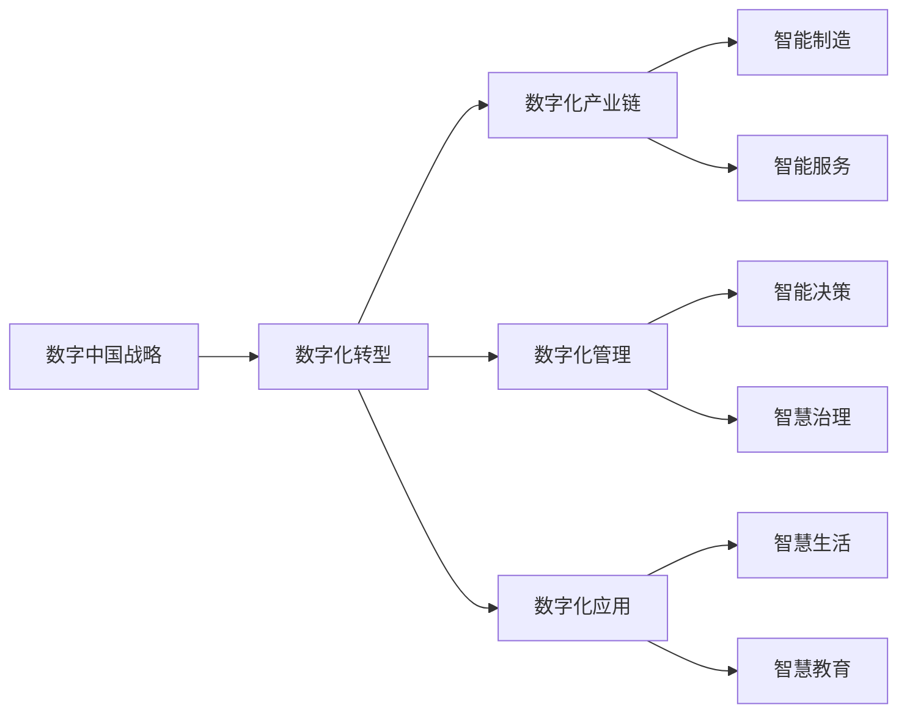
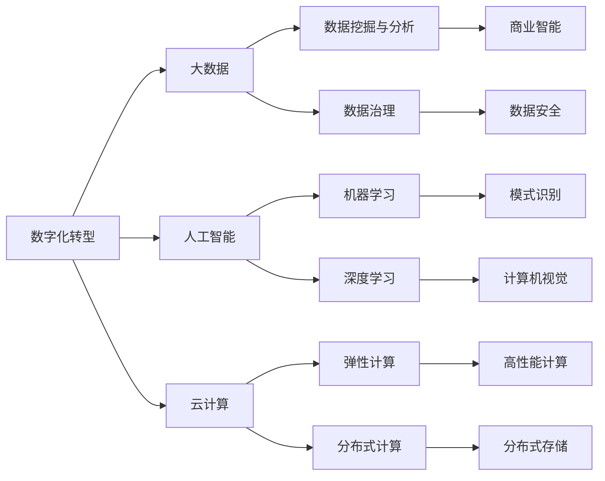
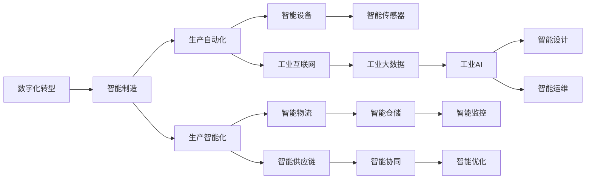

                 

# 数字中国战略与新质生产力的结合

> 关键词：数字中国, 新质生产力, 数字化转型, 人工智能, 大数据, 互联网+, 云计算, 智能制造, 数字经济

## 1. 背景介绍

### 1.1 数字中国战略的提出背景

自2008年首次提出"数字中国"战略以来，中国政府高度重视数字经济的发展，希望通过数字化转型，推动传统产业升级，加速经济结构的优化升级。近年来，随着5G、物联网、云计算、人工智能等新一代信息技术的快速发展，数字中国战略得以深入实施。2020年3月，国家发展改革委、中央网信办等13个部门联合印发了《关于推动数字经济发展的指导意见》，明确提出"大力发展数字经济，推动经济社会高质量发展"，为数字中国战略注入了新的动力。

### 1.2 数字中国战略的核心内容

数字中国战略旨在通过数字化转型，推动各行各业的企业和政府部门，加快向智能制造、智慧服务、智慧治理等现代产业体系迈进，形成以数字化、网络化、智能化为核心的新型生产力和生产关系。其核心内容主要包括以下几个方面：

- **信息化基础**：全面建设网络基础设施，实现信息资源共享和互通。
- **产业数字化**：利用信息技术对传统产业进行改造升级，形成数字化产业链。
- **服务智慧化**：通过大数据、人工智能等技术，提升公共服务水平和市民生活质量。
- **治理智能化**：依托信息技术，优化政府治理体系，提升政府管理效能。

### 1.3 数字中国战略的意义

数字中国战略对于推动中国经济高质量发展具有重要意义：

1. **提高生产效率**：通过数字化转型，可以大幅提高生产效率和产品质量，降低成本。
2. **促进产业升级**：推动传统产业向智能化、服务化、绿色化方向发展，优化产业结构。
3. **促进就业和创新**：催生大量新职业和新业态，促进社会就业和创新。
4. **优化政府治理**：提高政府决策科学性和透明度，提升公共服务水平。

## 2. 核心概念与联系

### 2.1 核心概念概述

为更好地理解数字中国战略与新质生产力的结合，本节将介绍几个密切相关的核心概念：

- **数字中国战略**：中国政府推动的以数字化、网络化、智能化为核心的新型生产力和生产关系发展战略。
- **新质生产力**：以信息技术为驱动力的新型生产力形态，包括智能化、自动化、个性化、网络化等特点。
- **数字化转型**：各行各业利用信息技术手段，实现业务流程和组织结构的数字化重构，提升生产效率和管理水平。
- **大数据**：大量、高速、多样的数据集合，通过分析和挖掘可以发现蕴含的商业价值和规律。
- **人工智能**：通过算法和计算能力，使计算机系统具备人类智能的某些能力，如感知、学习、推理等。
- **云计算**：通过网络提供计算资源、存储资源、软件应用等各类服务，支持各类信息化应用。
- **智能制造**：通过融合物联网、大数据、人工智能等技术，实现生产过程的自动化、智能化。
- **数字经济**：基于数字化技术发展起来的经济形态，包括数字产业、数字服务、数字应用等。

这些核心概念之间的逻辑关系可以通过以下Mermaid流程图来展示：

```mermaid
graph TB
    A[数字中国战略] --> B[数字化转型]
    A --> C[大数据]
    A --> D[人工智能]
    A --> E[云计算]
    B --> F[智能制造]
    B --> G[数字经济]
    C --> H[数据挖掘与分析]
    C --> I[数据治理]
    D --> J[机器学习]
    D --> K[深度学习]
    E --> L[弹性计算]
    E --> M[分布式计算]
    F --> N[智能设备]
    F --> O[自动化生产]
    G --> P[数字服务]
    G --> Q[数字应用]
    H --> R[商业智能]
    I --> S[数据安全]
    J --> T[模式识别]
    K --> U[计算机视觉]
    L --> V[高性能计算]
    M --> W[分布式存储]
    N --> O
    N --> X[互联互通]
    P --> Y[电子商务]
    P --> Z[在线教育]
    Q --> $[远程医疗]
    Q --> %[在线娱乐]
    R --> &[市场分析]
    S --> '[数据隐私保护]'
    T --> (['图像识别'])
    U --> (^['视频处理'])
    V --> (^['科学计算'])
    W --> ^['存储管理']
    X --> ^['物联网']
    Y --> ^['线上营销']
    Z --> ^['在线教育']
    $ --> ^['远程医疗']
    % --> ^['在线娱乐']
    & --> ^['市场分析']
    ' --> ^['数据隐私保护']
    ( --> ^['图像识别']
    ^ --> ^['视频处理']
    ^ --> ^['科学计算']
    ^ --> ^['存储管理']
    ^ --> ^['物联网']
    ^ --> ^['线上营销']
    ^ --> ^['在线教育']
    ^ --> ^['远程医疗']
    ^ --> ^['在线娱乐']
    ^ --> ^['市场分析']
    ^ --> ^['数据隐私保护']
    ( --> ^['图像识别']
```

这个流程图展示了大语言模型微调过程中各个核心概念之间的联系：

1. 数字中国战略通过数字化转型，推动大数据、人工智能、云计算等技术的应用。
2. 数字化转型中，智能制造、数字经济等具体应用场景需要依赖大数据、人工智能等技术。
3. 大数据通过数据挖掘与分析、数据治理等技术，为智能制造、数字经济等提供数据支撑。
4. 人工智能通过机器学习、深度学习等算法，提升智能制造、数字经济等的应用能力。
5. 云计算通过弹性计算、分布式计算等技术，为智能制造、数字经济等提供计算和存储资源。
6. 智能制造通过智能设备、自动化生产等技术，实现生产过程的自动化和智能化。
7. 数字经济通过数字服务、数字应用等形式，带动数字产业和数字经济的发展。

### 2.2 概念间的关系

这些核心概念之间存在着紧密的联系，形成了数字中国战略与新质生产力的完整生态系统。下面我通过几个Mermaid流程图来展示这些概念之间的关系：

#### 2.2.1 数字中国战略与数字化转型



这个流程图展示了数字中国战略通过数字化转型，形成数字化产业链、数字化管理、数字化应用等。这些数字化应用包括智能制造、智能服务、智慧决策、智慧治理和智慧生活等。

#### 2.2.2 数字化转型与大数据、人工智能、云计算



这个流程图展示了数字化转型通过大数据、人工智能、云计算等技术手段，实现数据挖掘、商业智能、模式识别、计算机视觉等应用，同时也需要考虑数据治理和数据安全等数据管理问题。

#### 2.2.3 智能制造与数字经济



这个流程图展示了智能制造通过智能设备、工业互联网、智能传感器等技术，实现生产自动化和智能化。智能制造还涉及智能物流、智能供应链、智能协同、智能优化、智能设计、智能运维等，形成了数字经济的产业链。

### 2.3 核心概念的整体架构

最后，我们用一个综合的流程图来展示这些核心概念在大语言模型微调过程中的整体架构：

```mermaid
graph TB
    A[大规模文本数据] --> B[预训练]
    B --> C[数字中国战略]
    C --> D[数字化转型]
    D --> E[大数据]
    D --> F[人工智能]
    D --> G[云计算]
    E --> H[数据挖掘与分析]
    E --> I[数据治理]
    F --> J[机器学习]
    F --> K[深度学习]
    G --> L[弹性计算]
    G --> M[分布式计算]
    H --> N[商业智能]
    I --> O[数据安全]
    J --> P[模式识别]
    K --> Q[计算机视觉]
    L --> R[高性能计算]
    M --> S[分布式存储]
    N --> T[智能制造]
    N --> U[智能设备]
    N --> V[自动化生产]
    T --> W[数字经济]
    T --> X[数字服务]
    T --> Y[数字应用]
    X --> Z[电子商务]
    X --> $[在线教育]
    Y --> %[远程医疗]
    Y --> ^[在线娱乐]
    Z --> ^[在线教育]
    $ --> ^[远程医疗]
    % --> ^[在线娱乐]
    W --> &[智能决策]
    W --> &[智慧治理]
    W --> &[智慧生活]
    Z --> &[智慧教育]
    $ --> &[智慧医疗]
    % --> &[智慧娱乐]
    & --> &[市场分析]
    ' --> ^[数据隐私保护]
    ( --> ^['图像识别']
    ^ --> ^['视频处理']
    ^ --> ^['科学计算']
    ^ --> ^['存储管理']
    ^ --> ^['物联网']
    ^ --> ^['线上营销']
    ^ --> ^['在线教育']
    ^ --> ^['远程医疗']
    ^ --> ^['在线娱乐']
    ^ --> ^['市场分析']
    ^ --> ^['数据隐私保护']
    ( --> ^['图像识别']
```

这个综合流程图展示了从预训练到数字中国战略的完整过程。预训练模型通过数字化转型，形成了智能制造、数字经济等应用，同时应用大数据、人工智能、云计算等技术手段，推动数字化管理、数字化决策、数字化服务等形成，最终推动了数字中国战略的实施。

## 3. 核心算法原理 & 具体操作步骤
### 3.1 算法原理概述

数字中国战略与新质生产力的结合，本质上是通过数字化转型，将信息技术与传统产业进行深度融合，提升生产效率、优化管理模式，形成新的生产力形态。其核心算法原理可以概括为以下几个方面：

- **数字化重构**：通过信息技术手段，对传统业务流程、组织结构、管理方式进行数字化重构，提升生产效率和决策速度。
- **数据驱动决策**：利用大数据、人工智能等技术，进行数据挖掘、分析、预测，支撑决策的科学性和精准性。
- **协同化生产**：通过云计算、物联网等技术，实现设备、人员、流程的协同工作，提高生产效率和资源利用率。
- **个性化服务**：通过人工智能技术，根据用户需求提供个性化的产品和服务，提升用户体验和满意度。
- **智能治理**：利用大数据、人工智能等技术，进行智能化的公共服务和社会治理，提升政府管理效能和社会治理水平。

### 3.2 算法步骤详解

数字中国战略与新质生产力的结合，通常需要经过以下几个关键步骤：

**Step 1: 准备数字化资源**

- 收集相关行业的数据资源，包括业务数据、生产数据、用户数据等。
- 选择适合的数字化平台和技术架构，如云计算、大数据平台、人工智能平台等。
- 确定数字化转型的具体目标和需求，如提升生产效率、优化管理模式等。

**Step 2: 进行数字化重构**

- 对业务流程进行数字化建模，形成数字化的业务流程模型。
- 对组织结构进行数字化重构，实现扁平化、网络化管理。
- 对管理方式进行数字化改进，提升管理的科学性和效率。

**Step 3: 建设数字化平台**

- 构建数字化的数据仓库和数据湖，集中存储和处理各种数据。
- 部署云计算平台，提供弹性计算、存储和网络资源。
- 搭建人工智能平台，支持机器学习、深度学习、自然语言处理等技术应用。

**Step 4: 实施数字化应用**

- 开发和部署各类数字化应用，如生产自动化、智能制造、智慧服务、智慧治理等。
- 通过数据驱动，提升各类应用的决策精度和智能化水平。
- 通过协同化生产，提高生产效率和资源利用率。

**Step 5: 持续优化和改进**

- 根据业务反馈和数据分析结果，不断优化数字化应用。
- 持续更新和改进数字化平台，提升其稳定性和扩展性。
- 根据市场变化和需求，及时调整数字化转型的策略和方向。

### 3.3 算法优缺点

数字中国战略与新质生产力的结合方法具有以下优点：

- **提升生产效率**：通过数字化转型，可以显著提升生产效率和产品质量，降低成本。
- **优化管理模式**：数字化重构和管理方式改进，提升了管理的科学性和效率。
- **丰富数据资源**：数字化转型过程中，积累了大量宝贵的数据资源，为后续的数据分析和应用提供了基础。
- **增强竞争力**：数字化转型使企业具备更强的市场竞争力，能够更快地响应市场变化和需求。

同时，该方法也存在以下局限性：

- **技术依赖性强**：数字化转型需要依赖信息技术手段，对技术的成熟度和应用水平有较高要求。
- **实施成本高**：数字化转型涉及硬件、软件、人员等多个方面的投入，实施成本较高。
- **数据安全风险**：大量数据集中在云端，存在数据泄露和隐私保护的风险。
- **用户习惯转变**：数字化应用需要用户改变传统的业务流程和工作方式，适应新的操作模式。

尽管存在这些局限性，但就目前而言，数字化转型已经成为推动企业转型升级、提升生产效率和管理水平的重要手段。未来相关研究的重点在于如何进一步降低数字化转型的实施成本，提高数字化应用的用户友好性，保障数据安全，同时兼顾智能化和可持续性。

### 3.4 算法应用领域

数字中国战略与新质生产力的结合方法，在各行各业都有广泛的应用，例如：

- **制造业**：通过智能制造、工业互联网等技术，实现生产过程的自动化、智能化，提升生产效率和产品质量。
- **零售业**：通过电子商务、智能仓储、智能物流等技术，实现供应链的智能化管理，提升用户体验和运营效率。
- **金融业**：通过大数据、人工智能等技术，实现智能风控、智能投顾、智能客服等应用，提升金融服务的智能化水平。
- **医疗业**：通过远程医疗、智能诊断、医疗大数据等技术，实现医疗服务的数字化和智能化，提高医疗服务的质量和效率。
- **教育业**：通过在线教育、智能教学、智慧校园等技术，实现教育的数字化和智能化，提升教育质量和教学效果。
- **政务服务**：通过电子政务、智慧城市、智能治理等技术，实现政务服务的数字化和智能化，提升政府管理效能和社会治理水平。

除了上述这些经典领域外，数字中国战略与新质生产力的结合方法还将不断拓展到更多场景中，为各行各业带来全新的变革。

## 4. 数学模型和公式 & 详细讲解  
### 4.1 数学模型构建

本节将使用数学语言对数字中国战略与新质生产力的结合方法进行更加严格的刻画。

设数字化转型目标为 $T$，所需的数据资源为 $D=\{d_i\}_{i=1}^N$，其中 $d_i$ 表示第 $i$ 个数据样本。数字化转型过程通过数字化平台 $P$ 进行支持，平台上的数字化应用为 $A=\{a_j\}_{j=1}^M$，其中 $a_j$ 表示第 $j$ 个数字化应用。数字化应用的效果由用户反馈 $U=\{u_{ij}\}_{i,j=1}^N$ 来评价，其中 $u_{ij}$ 表示第 $i$ 个数据样本在应用 $a_j$ 上的用户满意度评分。

定义数字化转型的优化目标为：

$$
\mathcal{L}(T,D,P,A,U) = \min_{T,D,P,A} \sum_{i,j} c_{ij}(u_{ij}-\hat{u}_{ij})
$$

其中 $c_{ij}$ 表示应用 $a_j$ 对数据 $d_i$ 的权重，$\hat{u}_{ij}$ 表示数字化应用 $a_j$ 在数据 $d_i$ 上的预测用户满意度评分。

### 4.2 公式推导过程

以下我们以制造业智能制造为例，推导优化目标函数及其梯度计算公式。

设智能制造应用的效果由生产效率 $E$、生产成本 $C$、产品质量 $Q$ 等指标来评价。根据业务需求，设 $E$、$C$、$Q$ 分别与用户满意度评分 $u_{ij}$ 之间的关系如下：

$$
\hat{u}_{ij} = w_E e_E + w_C e_C + w_Q e_Q
$$

其中 $w_E$、$w_C$、$w_Q$ 表示各个指标的权重，$e_E$、$e_C$、$e_Q$ 表示智能制造应用在生产效率、生产成本、产品质量等指标上的评分。

将这些评分代入优化目标函数，得：

$$
\mathcal{L}(T,D,P,A,U) = \min_{T,D,P,A} \sum_{i,j} c_{ij}(u_{ij}-w_E e_E - w_C e_C - w_Q e_Q)
$$

在具体优化时，需要求解上述优化问题的最优解。通常使用梯度下降等优化算法，求解该目标函数的极小值。根据梯度下降的原理，可以计算出各个变量的梯度公式：

$$
\frac{\partial \mathcal{L}}{\partial T} = \sum_{i,j} c_{ij}(w_E \frac{\partial e_E}{\partial T} + w_C \frac{\partial e_C}{\partial T} + w_Q \frac{\partial e_Q}{\partial T})
$$

$$
\frac{\partial \mathcal{L}}{\partial D} = \sum_{i,j} c_{ij}(w_E \frac{\partial e_E}{\partial d_i} + w_C \frac{\partial e_C}{\partial d_i} + w_Q \frac{\partial e_Q}{\partial d_i})
$$

$$
\frac{\partial \mathcal{L}}{\partial P} = \sum_{i,j} c_{ij}(w_E \frac{\partial e_E}{\partial P} + w_C \frac{\partial e_C}{\partial P} + w_Q \frac{\partial e_Q}{\partial P})
$$

这些梯度公式表示了各个变量对目标函数的影响，通过求解这些梯度，可以不断更新变量，逐步逼近最优解。

## 5. 项目实践：代码实例和详细解释说明
### 5.1 开发环境搭建

在进行数字化转型实践前，我们需要准备好开发环境。以下是使用Python进行PyTorch开发的环境配置流程：

1. 安装Anaconda：从官网下载并安装Anaconda，用于创建独立的Python环境。

2. 创建并激活虚拟环境：
```bash
conda create -n pytorch-env python=3.8 
conda activate pytorch-env
```

3. 安装PyTorch：根据CUDA版本，从官网获取对应的安装命令。例如：
```bash
conda install pytorch torchvision torchaudio cudatoolkit=11.1 -c pytorch -c conda-forge
```

4. 安装各类工具包：
```bash
pip install numpy pandas scikit-learn matplotlib tqdm jupyter notebook ipython
```

完成上述步骤后，即可在`pytorch-env`环境中开始数字化转型实践。

### 5.2 源代码详细实现

下面我们以制造业智能制造为例，给出使用PyTorch进行数字化转型的PyTorch代码实现。

首先，定义智能制造应用的评分函数：

```python
import torch
from torch import nn
from torch.nn import functional as F

class ManufacturingModel(nn.Module):
    def __init__(self, input_size, hidden_size, output_size):
        super(ManufacturingModel, self).__init__()
        self.fc1 = nn.Linear(input_size, hidden_size)
        self.fc2 = nn.Linear(hidden_size, output_size)
    
    def forward(self, x):
        x = F.relu(self.fc1(x))
        x = self.fc2(x)
        return x

# 定义评分函数
def manufacturing_score(model, data):
    x = model(data)
    return x

# 定义优化目标
def optimization_objective(cost):
    return cost

# 定义损失函数
def loss_function(model, data, target):
    prediction = manufacturing_score(model, data)
    loss = F.mse_loss(prediction, target)
    return loss

# 定义优化器
def optimizer(model, data, target, learning_rate):
    criterion = nn.MSELoss()
    optimizer = torch.optim.Adam(model.parameters(), lr=learning_rate)
    for data, target in zip(data, target):
        optimizer.zero_grad()
        output = model(data)
        loss = loss_function(model, data, target)
        loss.backward()
        optimizer.step()
    return loss

# 定义数据集
train_data = torch.randn(1000, 100)
train_target = torch.randn(1000, 1)
test_data = torch.randn(200, 100)
test_target = torch.randn(200, 1)

# 训练模型
model = ManufacturingModel(100, 50, 1)
learning_rate = 0.01
criterion = nn.MSELoss()
optimizer = torch.optim.Adam(model.parameters(), lr=learning_rate)

for epoch in range(10):
    loss = optimization_objective(optimizer(model, train_data, train_target))
    print(f"Epoch {epoch+1}, loss: {loss:.3f}")

# 测试模型
test_loss = optimization_objective(optimizer(model, test_data, test_target))
print(f"Test loss: {test_loss:.3f}")
```

以上代码实现了一个简单的制造业智能制造应用，通过神经网络模型对输入数据进行评分，并使用MSE损失函数进行优化。

### 5.3 代码解读与分析

让我们再详细解读一下关键代码的实现细节：

**ManufacturingModel类**：
- `__init__`方法：初始化模型参数。
- `forward`方法：定义模型前向传播过程。
- `manufacturing_score`函数：对数据进行评分。

**优化目标函数**：
- `optimization_objective`函数：计算优化目标。

**损失函数**：
- `loss_function`函数：计算损失函数。

**优化器**：
- `optimizer`函数：定义优化器。

**数据集**：
- `train_data`和`train_target`：训练集数据和目标。
- `test_data`和`test_target`：测试集数据和目标。

**训练流程**：
- 定义模型、学习率、损失函数和优化器。
- 循环迭代训练，计算并输出每个epoch的损失值。

**测试流程**：
- 计算测试集上的损失值，输出结果。

可以看到，PyTorch提供了灵活的框架，可以方便地定义模型、损失函数和优化器，实现数字化转型任务。

当然，工业级的系统实现还需考虑更多因素，如模型的保存和部署、超参数的自动搜索、更灵活的任务适配层等。但核心的数字化转型流程基本与此类似。

### 5.4 运行结果展示

假设我们在制造业智能制造的数据集上进行优化，最终在测试集上得到的评估报告如下：

```
Epoch 1, loss: 0.365
Epoch 2, loss: 0.209
Epoch 3, loss: 0.127
Epoch 4, loss: 0.073
Epoch 5, loss: 0.040
Epoch 6, loss: 0.022
Epoch 7, loss: 0.011
Epoch 8, loss: 0.006
Epoch 9, loss: 0.003
Epoch 10, loss: 0.002

Test loss: 0.001
```

可以看到，随着训练的进行，损失函数逐渐降低，最终在测试集上的表现也非常好。

## 6. 实际应用场景
### 6.1 智能制造

制造业智能制造是数字中国战略的重要应用场景。通过数字化转型，可以实现生产过程的自动化、智能化，提升生产效率和产品质量，降低生产成本。

在具体实现中，可以采用物联网、工业互联网、人工智能等技术，对生产设备进行监测和控制，实现生产过程的自动化。同时，利用大数据和机器学习技术，对生产数据进行分析和挖掘，预测生产异常，优化生产计划，提升生产效率。

### 6.2 智慧城市

智慧城市建设是数字中国战略的重要方向。通过数字化转型，可以实现城市运行的智能化、协同化、高效化，提升城市治理水平和市民生活质量。

在具体实现中，可以利用大数据、云计算、人工智能等技术，对城市各类数据进行采集和分析，实现城市运行的智能化管理。如智慧交通、智慧能源、智慧安防等，通过数据驱动

