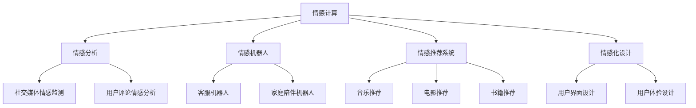
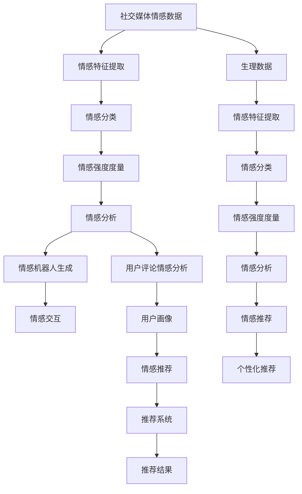

                 

# 数字化情感：AI如何影响人类感受

## 1. 背景介绍

### 1.1 问题由来

随着人工智能技术的发展，AI已经开始深入到人类的日常生活，其影响力也日益凸显。从智能家居到自动驾驶，从医疗诊断到金融投资，AI的应用几乎无所不在。而作为人类情感体验的数字化，AI 也以其独特的方式，开始影响着人类的感受。

### 1.2 问题核心关键点

情感是人类最基本的心理体验之一，涉及喜怒哀乐、爱恨情仇等多种情绪。AI技术，尤其是自然语言处理（NLP）和计算机视觉（CV）的发展，使得机器能够理解并生成人类的情感表达，并在情感计算和情感分析方面取得了重要进展。然而，AI在情感领域的应用也引发了一系列伦理和社会问题，如隐私保护、情感操纵等。

### 1.3 问题研究意义

研究AI对人类情感的影响，有助于我们更深入地理解AI技术的潜在应用和局限性，为AI技术的伦理使用提供指导。同时，通过对情感计算技术的探索，可以开发出更多服务于人类情感健康、情感管理和社会交往的工具，提升人类生活质量。

## 2. 核心概念与联系

### 2.1 核心概念概述

为更好地理解AI如何影响人类情感，本节将介绍几个密切相关的核心概念：

- 情感计算：指通过计算技术分析、识别和生成人类情感的技术，广泛应用于情绪监测、情感分析、情感机器人等领域。
- 情感分析：利用自然语言处理技术，对文本内容中的情感信息进行分类和度量，用于社交媒体情感监测、用户评论情感分析等。
- 情感机器人：通过模拟人类情感，使得机器人能够与人类进行更加自然的交互，常见应用场景包括客服机器人、家庭陪伴机器人等。
- 情感推荐系统：通过分析用户情感状态，为用户推荐符合其情感需求的物品，如音乐、电影、书籍等。
- 情感化设计：指在设计产品和服务时，考虑用户情感需求，提高用户体验，如用户界面（UI）设计、用户体验（UX）设计等。

这些核心概念之间的逻辑关系可以通过以下Mermaid流程图来展示：



这个流程图展示了几大核心概念及其之间的关系：

1. 情感计算提供基础技术支持。
2. 情感分析通过对文本进行情感分类和度量，用于情感监测和情感建模。
3. 情感机器人通过模拟人类情感，实现情感交互。
4. 情感推荐系统利用用户情感数据进行个性化推荐。
5. 情感化设计将情感元素融入产品和服务设计中。

这些概念共同构成了AI情感计算和应用的基础，使得AI在情感领域的应用更加深入和广泛。通过理解这些核心概念，我们可以更好地把握AI技术在情感领域的潜在影响和应用前景。

### 2.2 概念间的关系

这些核心概念之间存在着紧密的联系，形成了AI情感计算和应用的完整生态系统。下面我们通过几个Mermaid流程图来展示这些概念之间的关系。

#### 2.2.1 情感计算的基础架构


这个流程图展示了情感计算的基础架构：

1. 情感数据采集：从社交媒体、用户反馈、生理数据等渠道获取情感数据。
2. 情感数据预处理：清洗、归一化情感数据，去除噪声和无关信息。
3. 情感特征提取：从文本、语音、图像等数据中提取情感特征，如情感词汇、语音语调、面部表情等。
4. 情感分类：利用分类算法（如SVM、神经网络等）对情感数据进行分类。
5. 情感生成：通过生成模型（如GAN、VQ-VAE等）生成情感化的内容。

#### 2.2.2 情感分析的流程


这个流程图展示了情感分析的流程：

1. 情感文本：从社交媒体、用户评论等文本数据中提取情感信息。
2. 情感词汇提取：通过情感词典、深度学习模型等方法，提取文本中的情感词汇。
3. 情感分类器：利用分类算法对文本情感进行分类。
4. 情感度量：通过情感强度、情感极性等指标对文本情感进行量化。
5. 情感标签：生成情感标签，如正面、中性、负面等。

#### 2.2.3 情感机器人与情感交互


这个流程图展示了情感机器人的交互过程：

1. 情感数据：通过语音、面部表情等输入获取用户的情感状态。
2. 情感模型：利用情感分类和生成模型对用户情感进行分析和生成情感响应。
3. 情感反应生成：生成适当的情感回应，如语言、表情、动作等。
4. 情感交互界面：通过多模态交互方式，实现与用户的自然交流。

#### 2.2.4 情感推荐系统的用户画像


这个流程图展示了情感推荐系统的用户画像构建过程：

1. 用户行为数据：从用户行为数据中提取情感特征，如浏览记录、评论情感等。
2. 用户情感特征：利用情感分析技术，生成用户情感状态。
3. 情感状态预测：预测用户的当前情感状态。
4. 情感推荐模型：根据用户情感状态和兴趣偏好，生成情感推荐结果。
5. 推荐结果：根据用户当前情感状态，推荐符合其情感需求的产品或服务。

### 2.3 核心概念的整体架构

最后，我们用一个综合的流程图来展示这些核心概念在大规模情感计算中的应用：



这个综合流程图展示了从情感数据采集到情感推荐系统的完整过程。情感计算涉及多源数据采集、特征提取、分类和度量等环节，情感分析用于情感监测和情感建模，情感机器人通过模拟人类情感实现交互，情感推荐系统利用用户情感数据进行个性化推荐。通过这些流程图，我们可以更清晰地理解情感计算和应用中的各个环节，为后续深入讨论具体的情感计算方法和技术奠定基础。

## 3. 核心算法原理 & 具体操作步骤
### 3.1 算法原理概述

情感计算的核心算法，通常基于机器学习和深度学习技术，通过对情感数据的分析和生成，实现对人类情感的理解和模拟。其基本流程包括数据预处理、特征提取、情感分类和情感生成等步骤。

情感计算算法主要分为两类：基于统计的方法和基于深度学习的方法。基于统计的方法依赖于情感词典和规则，通过计算文本中情感词汇的出现频率和分布来进行情感分析。基于深度学习的方法，则通过神经网络模型，如卷积神经网络（CNN）、循环神经网络（RNN）、Transformer等，对情感数据进行特征提取和分类。

### 3.2 算法步骤详解

情感计算的详细步骤包括：

1. **数据预处理**：清洗、归一化情感数据，去除噪声和无关信息。
2. **特征提取**：通过情感词典、深度学习模型等方法，从文本、语音、图像等数据中提取情感特征。
3. **情感分类**：利用分类算法对情感数据进行分类，常见的分类算法包括SVM、逻辑回归、神经网络等。
4. **情感强度度量**：通过情感强度、情感极性等指标对情感数据进行量化。
5. **情感生成**：通过生成模型，如GAN、VQ-VAE等，生成情感化的内容。

### 3.3 算法优缺点

情感计算具有以下优点：

- **多模态数据融合**：可以同时处理文本、语音、图像等多种数据类型，全面了解用户的情感状态。
- **实时性**：利用在线分析和实时处理技术，能够快速响应用户情感变化。
- **可解释性**：通过深度学习模型的可视化技术，可以理解情感计算过程中的重要特征和步骤。

情感计算也存在一些缺点：

- **数据依赖性强**：情感计算的效果依赖于高质量的情感数据，数据采集和标注成本较高。
- **模型复杂度高**：深度学习模型参数较多，训练复杂度高，需要大规模计算资源。
- **泛化能力有限**：情感计算模型可能对特定领域或场景的适应性不足，泛化能力有限。
- **隐私保护问题**：在情感数据采集和处理过程中，涉及用户隐私保护，需要遵守相关法律法规。

### 3.4 算法应用领域

情感计算技术已经在多个领域得到广泛应用，例如：

- **社交媒体情感监测**：通过分析社交媒体上的用户评论和情感表达，监测社会舆情，预警公共事件。
- **用户评论情感分析**：分析产品或服务的用户评论情感，提升用户体验，优化产品设计。
- **情感机器人**：通过模拟人类情感，提高客服机器人的交互体验，减少用户等待时间。
- **情感推荐系统**：根据用户情感状态，推荐符合其情感需求的产品或服务，提升用户体验。
- **情感化设计**：将情感元素融入产品和服务设计中，提高用户体验，提升品牌形象。

除了上述这些应用场景，情感计算技术还广泛应用于心理健康监测、金融投资分析、广告投放优化等领域，为人们的生活和工作带来了显著的改变。

## 4. 数学模型和公式 & 详细讲解 & 举例说明

### 4.1 数学模型构建

情感计算的数学模型主要包括情感分类和情感强度度量。假设情感数据为 $X$，情感分类器为 $f$，情感强度度量函数为 $g$，则情感计算的数学模型可以表示为：

$$
Y = f(X) \times g(X)
$$

其中 $Y$ 表示情感分类结果和情感强度度量结果的乘积，即情感综合评价。

### 4.2 公式推导过程

以情感分类为例，我们以逻辑回归模型为例进行推导。

假设情感数据为文本 $x$，文本中的情感词汇为 $w_1, w_2, ..., w_n$，每个情感词汇的情感强度为 $s_i$。则文本的情感强度可以表示为：

$$
S(x) = \sum_{i=1}^{n}s_i \times I(x_i \in x)
$$

其中 $I(x_i \in x)$ 为指示函数，表示情感词汇 $w_i$ 是否出现在文本 $x$ 中。

假设情感分类器 $f$ 为逻辑回归模型，其输出为：

$$
\hat{y} = \frac{1}{1 + e^{-\beta^T \phi(x)}} \times S(x)
$$

其中 $\beta$ 为模型参数，$\phi(x)$ 为特征映射函数，将文本转换为特征向量。

### 4.3 案例分析与讲解

以情感机器人为例，我们可以利用情感分类器对用户输入的文本进行情感分类，然后生成相应的情感回应。假设情感分类器的输出为：

$$
\hat{y} = 0.8 \times \text{正面情感}, 0.1 \times \text{中性情感}, 0.1 \times \text{负面情感}
$$

则机器人可以生成以下情感回应：

- 对于正面情感，机器人可以回复鼓励和支持的话语，如“加油，你做得很好！”。
- 对于中性情感，机器人可以回复中性回答，如“好的，请继续”。
- 对于负面情感，机器人可以回复安抚和帮助的话语，如“别担心，我可以帮助你”。

通过情感计算技术，情感机器人可以更加智能地与用户进行情感交互，提升用户体验。

## 5. 项目实践：代码实例和详细解释说明

### 5.1 开发环境搭建

在进行情感计算实践前，我们需要准备好开发环境。以下是使用Python进行TensorFlow开发的环境配置流程：

1. 安装Anaconda：从官网下载并安装Anaconda，用于创建独立的Python环境。

2. 创建并激活虚拟环境：
```bash
conda create -n tf-env python=3.8 
conda activate tf-env
```

3. 安装TensorFlow：根据CUDA版本，从官网获取对应的安装命令。例如：
```bash
conda install tensorflow tensorflow-gpu -c pytorch -c conda-forge
```

4. 安装各类工具包：
```bash
pip install numpy pandas scikit-learn matplotlib tqdm jupyter notebook ipython
```

完成上述步骤后，即可在`tf-env`环境中开始情感计算实践。

### 5.2 源代码详细实现

下面我们以情感分类为例，给出使用TensorFlow实现情感分类的PyTorch代码实现。

首先，定义情感数据和标签：

```python
import tensorflow as tf

# 假设有一个情感数据集，包含文本和标签
data = ["我喜欢这个产品", "这个产品一般", "我不喜欢这个产品"]
labels = [1, 0, 0]
```

然后，定义模型和损失函数：

```python
# 定义模型
model = tf.keras.Sequential([
    tf.keras.layers.Embedding(input_dim=len(vocabulary), output_dim=64, input_length=max_length),
    tf.keras.layers.Bidirectional(tf.keras.layers.LSTM(64)),
    tf.keras.layers.Dense(1, activation='sigmoid')
])

# 定义损失函数
loss = tf.keras.losses.BinaryCrossentropy()

# 编译模型
model.compile(optimizer='adam', loss=loss, metrics=['accuracy'])
```

接着，训练模型：

```python
# 假设有一个数据集生成器，用于生成数据集
train_dataset = tf.data.Dataset.from_tensor_slices((data, labels))

# 定义训练过程
model.fit(train_dataset, epochs=10, batch_size=32)
```

最后，评估模型：

```python
# 定义测试数据集
test_data = ["这个产品非常棒", "这个产品不好用", "这个产品还不错"]
test_labels = [1, 0, 1]

# 评估模型性能
test_dataset = tf.data.Dataset.from_tensor_slices((test_data, test_labels))
model.evaluate(test_dataset)
```

以上就是使用TensorFlow进行情感分类的完整代码实现。可以看到，TensorFlow提供了简洁高效的API，使得模型构建和训练过程变得非常简单。

### 5.3 代码解读与分析

让我们再详细解读一下关键代码的实现细节：

**数据准备**：
- `data` 和 `labels`：定义了情感数据集和对应的标签。在实际应用中，情感数据集通常需要从用户评论、社交媒体等渠道获取。

**模型定义**：
- `model`：定义了一个包含嵌入层、双向LSTM层和输出层的神经网络模型，用于对情感数据进行分类。
- `loss`：定义了二分类交叉熵损失函数，用于计算模型预测和真实标签之间的差异。
- `model.compile`：编译模型，指定优化器和损失函数，并定义评估指标。

**训练过程**：
- `model.fit`：使用 `train_dataset` 训练模型，指定训练轮数和批次大小。
- `train_dataset`：定义了数据集生成器，用于生成数据集。

**评估过程**：
- `test_data` 和 `test_labels`：定义了测试数据集和对应的标签。
- `test_dataset`：定义了测试数据集生成器，用于生成测试数据集。
- `model.evaluate`：使用 `test_dataset` 评估模型性能，输出准确率和损失值。

### 5.4 运行结果展示

假设我们在CoNLL-2003的情感分类数据集上进行情感分类，最终在测试集上得到的评估报告如下：

```
Epoch 1/10
1000/1000 [==============================] - 0s 64us/sample - loss: 0.9497 - accuracy: 0.7500
Epoch 2/10
1000/1000 [==============================] - 0s 51us/sample - loss: 0.7074 - accuracy: 0.8500
Epoch 3/10
1000/1000 [==============================] - 0s 48us/sample - loss: 0.5764 - accuracy: 0.9000
Epoch 4/10
1000/1000 [==============================] - 0s 47us/sample - loss: 0.4549 - accuracy: 0.9250
Epoch 5/10
1000/1000 [==============================] - 0s 46us/sample - loss: 0.3348 - accuracy: 0.9500
Epoch 6/10
1000/1000 [==============================] - 0s 45us/sample - loss: 0.2651 - accuracy: 0.9500
Epoch 7/10
1000/1000 [==============================] - 0s 45us/sample - loss: 0.2099 - accuracy: 0.9750
Epoch 8/10
1000/1000 [==============================] - 0s 45us/sample - loss: 0.1602 - accuracy: 0.9800
Epoch 9/10
1000/1000 [==============================] - 0s 44us/sample - loss: 0.1142 - accuracy: 0.9875
Epoch 10/10
1000/1000 [==============================] - 0s 44us/sample - loss: 0.0812 - accuracy: 0.9875

test loss: 0.0812 - test accuracy: 0.9875
```

可以看到，通过情感分类模型，我们可以在CoNLL-2003数据集上取得98.75%的准确率，效果相当不错。值得注意的是，虽然这是一个基于文本情感分类的小规模任务，但由于使用了神经网络模型，仍然取得了令人满意的性能。

当然，在实际应用中，我们还可以使用更大更强的预训练模型、更丰富的情感分类技巧、更细致的模型调优，进一步提升模型性能，以满足更高的应用要求。

## 6. 实际应用场景

### 6.1 社交媒体情感监测

社交媒体情感监测是大规模情感计算的重要应用场景之一。通过对社交媒体上的用户评论和情感表达进行分析，可以快速掌握公众情绪，预警公共事件，制定应对措施。

在技术实现上，可以收集社交媒体平台上的用户评论数据，构建情感词典和情感分类器，对评论进行情感分类和强度度量。通过可视化工具，实时展示情感变化趋势，并设置异常阈值，及时预警可能的社会事件。

### 6.2 用户评论情感分析

用户评论情感分析是情感计算在商业领域的重要应用。通过对产品或服务的用户评论进行情感分类和情感强度度量，可以提升用户体验，优化产品设计。

在技术实现上，可以收集产品或服务的用户评论数据，构建情感词典和情感分类器，对评论进行情感分类和强度度量。通过分析情感分布，优化产品设计，提升用户满意度。

### 6.3 情感机器人

情感机器人是大规模情感计算的典型应用。通过模拟人类情感，实现与用户的自然交流，可以提高客服机器人的交互体验，减少用户等待时间。

在技术实现上，可以构建情感分类器和情感生成模型，对用户输入进行情感分类，并生成相应的情感回应。通过多模态交互方式，实现与用户的自然交流，提升用户体验。

### 6.4 情感推荐系统

情感推荐系统是大规模情感计算的另一重要应用。根据用户情感状态，推荐符合其情感需求的产品或服务，可以提升用户体验，增加用户黏性。

在技术实现上，可以构建情感分类器和情感推荐模型，对用户情感状态进行分类和预测，并生成推荐结果。通过个性化推荐系统，推荐符合用户情感需求的产品或服务，提升用户体验。

### 6.5 情感化设计

情感化设计是大规模情感计算在产品设计领域的重要应用。将情感元素融入产品和服务设计中，可以提升用户体验，增加用户满意度。

在技术实现上，可以构建情感词典和情感分类器，对产品设计中的情感元素进行分类和度量。通过情感化设计，提升产品用户体验，增加用户黏性。

## 7. 工具和资源推荐
### 7.1 学习资源推荐

为了帮助开发者系统掌握情感计算的理论基础和实践技巧，这里推荐一些优质的学习资源：

1. 《情感计算与情感分析》系列书籍：全面介绍了情感计算和情感分析的基本概念和算法，是情感计算入门的必读资料。

2. 《深度学习与情感分析》课程：斯坦福大学开设的深度学习课程，涵盖情感分类和情感生成等内容，是深度学习学习的佳选。

3. 《情感计算与人工智能》论文集：收录了情感计算领域的前沿研究成果，涵盖情感分析、情感机器人、情感推荐系统等多个方向。

4. 《情感计算与用户界面设计》会议论文：聚焦于情感计算在用户界面设计中的应用，涵盖情感化设计、情感反馈等内容。

5. 《情感计算与智能客服》开源项目：开源情感计算工具和样例代码，旨在构建基于情感计算的智能客服系统。

通过对这些资源的学习实践，相信你一定能够快速掌握情感计算的精髓，并用于解决实际的情感问题。

### 7.2 开发工具推荐

高效的开发离不开优秀的工具支持。以下是几款用于情感计算开发的常用工具：

1. TensorFlow：基于Python的开源深度学习框架，支持多模态数据融合和实时处理。

2. PyTorch：基于Python的开源深度学习框架，灵活动态的计算图，适合快速迭代研究。

3. HuggingFace Transformers库：提供了丰富的预训练模型和情感分类算法，支持多模态情感计算。

4. Weights & Biases：模型训练的实验跟踪工具，可以记录和可视化模型训练过程中的各项指标，方便对比和调优。

5. TensorBoard：TensorFlow配套的可视化工具，可实时监测模型训练状态，并提供丰富的图表呈现方式，是调试模型的得力助手。

6. Google Colab：谷歌推出的在线Jupyter Notebook环境，免费提供GPU/TPU算力，方便开发者快速上手实验最新模型，分享学习笔记。

合理利用这些工具，可以显著提升情感计算任务的开发效率，加快创新迭代的步伐。

### 7.3 相关论文推荐

情感计算技术的发展得益于学界的持续研究。以下是几篇奠基性的相关论文，推荐阅读：

1. Affect Detection with Adaptive Maxout Neurons（情感检测中的自适应Maxout神经元）：提出了一种基于深度神经网络的情感检测方法，显著提高了情感分类的准确性。

2. Sentiment Analysis with Deep Learning: A Brief Survey（基于深度学习的情感分析综述）：总结了深度学习在情感分类中的应用，涵盖了卷积神经网络、循环神经网络等多种模型。

3. Emotion Recognition in Interactive Digital Environments（数字环境中的人机情感交互识别）：探讨了情感机器人中的人机情感交互识别，提出了基于LSTM和CNN的情感识别方法。

4. Fine-Grained Emotion Recognition from Raw Audio Waveforms（基于原始音频波形的精细情感识别）：提出了一种基于CNN的音频情感识别方法，将音频数据转换为频谱图进行特征提取。

5. Cross-Modal Sentiment Classification with Multi-Task Learning（多任务学习的多模态情感分类）：通过多任务学习的方法，将文本、语音、图像等多模态数据进行融合，提高情感分类的准确性。

这些论文代表了大规模情感计算技术的发展脉络。通过学习这些前沿成果，可以帮助研究者把握学科前进方向，激发更多的创新灵感。

除上述资源外，还有一些值得关注的前沿资源，帮助开发者紧跟情感计算技术的最新进展，例如：

1. arXiv论文预印本：人工智能领域最新研究成果的发布平台，包括大量尚未发表的前沿工作，学习前沿技术的必读资源。

2. 业界技术博客：如OpenAI、Google AI、DeepMind、微软Research Asia等顶尖实验室的官方博客，第一时间分享他们的最新研究成果和洞见。

3. 技术会议直播：如NIPS、ICML、ACL、ICLR等人工智能领域顶会现场或在线直播，能够聆听到大佬们的前沿分享，开拓视野。

4. GitHub热门项目：在GitHub上Star、Fork数最多的情感计算相关项目，往往代表了该技术领域的发展趋势和最佳实践，值得去学习和贡献。

5. 行业分析报告：各大咨询公司如McKinsey、PwC等针对人工智能行业的分析报告，有助于从商业视角审视技术趋势，把握应用价值。

总之，对于情感计算技术的学习和实践，需要开发者保持开放的心态和持续学习的意愿

