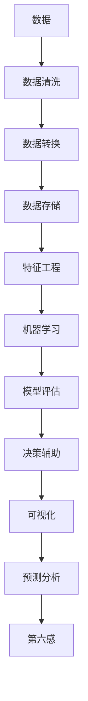

                 

# 数字化直觉增强：AI辅助的第六感开发

> 关键词：数字化直觉, 人工智能, 第六感, 决策辅助, 数据驱动, 预测分析, 可视化

## 1. 背景介绍

在现代信息社会中，数据无处不在。企业决策、个人生活、社交互动，都离不开对海量数据的分析和理解。然而，面对复杂的决策环境，仅仅依赖数据统计和逻辑推理是不够的，人们还需要一种超越数据计算的"直觉"能力，即"第六感"。这种"第六感"不仅能理解数据背后的本质关系，还能预测未来趋势，辅助决策者做出更优的选择。

数字化直觉，或者说"数据第六感"，是指在复杂的数据环境中，通过机器学习和人工智能技术，培养出超越数据计算的直觉能力。这种能力不仅能理解数据的内在关联，还能预测未来的变化，成为决策的重要辅助。当前，AI辅助的数字化直觉增强正在各个领域得到广泛应用，帮助企业和个人更好地理解和预测未来，从而做出更优的决策。

本文将深入探讨数字化直觉的原理、实现方法和应用场景，旨在帮助读者掌握这一新兴技术，并在实际工作中发挥其价值。

## 2. 核心概念与联系

### 2.1 核心概念概述

为了更好地理解数字化直觉的原理，本节将介绍几个核心概念及其联系：

- **数字化直觉**：基于数据驱动和人工智能技术的直觉能力，能够理解和预测复杂环境中的变化趋势，辅助决策者做出更好的选择。
- **人工智能**：利用机器学习算法和计算模型，实现对数据的高效分析和理解，帮助决策者获得超越直觉的洞察力。
- **第六感**：源自心理学和哲学，指一种超越逻辑和经验的直觉能力，能够洞察事物背后的本质关系。
- **数据驱动**：利用数据和统计模型，驱动决策过程，确保决策的科学性和准确性。
- **预测分析**：通过对历史数据和现有趋势的分析，预测未来变化，为决策提供依据。
- **可视化**：将复杂数据通过图表、图形等方式进行展示，帮助决策者更好地理解和分析数据。

这些概念共同构成了数字化直觉的核心体系，通过将人工智能和数据科学的方法引入决策过程，帮助决策者获得超越直觉的洞察力。

### 2.2 核心概念间的联系

这些核心概念之间的关系可以通过以下Mermaid流程图来展示：



这个流程图展示了从数据到最终决策的完整流程：

1. 数据清洗和转换：原始数据经过清洗和转换，成为模型可以处理的形式。
2. 特征工程：从原始数据中提取有用的特征，构建模型所需的输入。
3. 机器学习：利用机器学习算法，对数据进行建模和训练，生成预测模型。
4. 模型评估：对模型进行评估，确保其在特定任务上的性能。
5. 决策辅助：将模型应用于决策过程中，提供预测结果和决策建议。
6. 可视化：将模型结果通过图表、图形等方式展示，帮助决策者理解和分析。
7. 预测分析：通过模型预测未来趋势，为决策提供依据。
8. 第六感：结合人工智能和数据科学的方法，培养出超越直觉的洞察力。

## 3. 核心算法原理 & 具体操作步骤

### 3.1 算法原理概述

数字化直觉的核心算法原理包括数据预处理、特征工程、模型训练、模型评估和决策支持等步骤。本节将详细介绍这些步骤及其原理。

#### 数据预处理

数据预处理是数字化直觉开发的基础。通过清洗、转换和标准化数据，确保模型能够有效利用数据。数据预处理一般包括以下几个步骤：

1. **数据清洗**：去除数据中的噪声和异常值，确保数据质量。
2. **数据转换**：将数据转换成模型可处理的格式，如数值化、归一化等。
3. **数据标准化**：对不同来源的数据进行统一处理，确保数据的一致性。

#### 特征工程

特征工程是数字化直觉开发的关键步骤。通过从原始数据中提取有用的特征，构建模型所需的输入。特征工程一般包括以下几个步骤：

1. **特征选择**：从原始数据中选取最相关的特征，构建输入向量。
2. **特征提取**：利用降维、PCA等技术，提取数据中的有用信息。
3. **特征变换**：对特征进行变换和转换，提升模型的表现力。

#### 模型训练

模型训练是数字化直觉开发的核心步骤。通过训练机器学习模型，生成预测模型。模型训练一般包括以下几个步骤：

1. **模型选择**：选择合适的机器学习算法，如线性回归、决策树、神经网络等。
2. **数据划分**：将数据划分为训练集、验证集和测试集，进行模型训练和评估。
3. **参数优化**：通过网格搜索、交叉验证等方法，优化模型参数。

#### 模型评估

模型评估是数字化直觉开发的重要环节。通过评估模型的性能，确保其在特定任务上的表现。模型评估一般包括以下几个步骤：

1. **性能指标**：选择合适的性能指标，如精度、召回率、F1分数等。
2. **模型测试**：在测试集上评估模型的性能，确保其在实际环境中的表现。
3. **模型调优**：根据评估结果，优化模型参数和结构，提升模型性能。

#### 决策支持

决策支持是数字化直觉开发的目标。通过将模型应用于决策过程中，提供预测结果和决策建议。决策支持一般包括以下几个步骤：

1. **结果展示**：将模型预测结果通过图表、图形等方式展示，帮助决策者理解和分析。
2. **决策建议**：根据预测结果，提供决策建议，辅助决策者做出更好的选择。
3. **迭代优化**：根据决策结果，反馈数据和模型，进行迭代优化，提升模型性能。

### 3.2 算法步骤详解

#### 数据预处理

数据预处理的具体步骤如下：

1. **数据清洗**：使用Python的Pandas库进行数据清洗，去除噪声和异常值，确保数据质量。例如：

```python
import pandas as pd

df = pd.read_csv('data.csv')
df = df.dropna()  # 去除缺失值
df = df.drop_duplicates()  # 去除重复值
```

2. **数据转换**：将数据转换成模型可处理的格式，如数值化、归一化等。例如：

```python
df['price'] = pd.to_numeric(df['price'], errors='coerce')  # 数值化
df = (df - df.mean()) / df.std()  # 标准化
```

3. **数据标准化**：对不同来源的数据进行统一处理，确保数据的一致性。例如：

```python
def standardize(data):
    mean = data.mean()
    std = data.std()
    return (data - mean) / std
```

#### 特征工程

特征工程的具体步骤如下：

1. **特征选择**：从原始数据中选取最相关的特征，构建输入向量。例如：

```python
from sklearn.feature_selection import SelectKBest, f_classif

X = df.drop('label', axis=1)  # 移除标签列
y = df['label']  # 提取标签列

selector = SelectKBest(f_classif, k=5)  # 选取5个最佳特征
X_new = selector.fit_transform(X, y)
```

2. **特征提取**：利用降维、PCA等技术，提取数据中的有用信息。例如：

```python
from sklearn.decomposition import PCA

pca = PCA(n_components=3)  # 提取3个主成分
X_pca = pca.fit_transform(X_new)
```

3. **特征变换**：对特征进行变换和转换，提升模型的表现力。例如：

```python
from sklearn.preprocessing import PolynomialFeatures

poly = PolynomialFeatures(degree=2)  # 二次多项式变换
X_poly = poly.fit_transform(X_pca)
```

#### 模型训练

模型训练的具体步骤如下：

1. **模型选择**：选择合适的机器学习算法，如线性回归、决策树、神经网络等。例如：

```python
from sklearn.linear_model import LinearRegression

model = LinearRegression()
```

2. **数据划分**：将数据划分为训练集、验证集和测试集，进行模型训练和评估。例如：

```python
from sklearn.model_selection import train_test_split

X_train, X_test, y_train, y_test = train_test_split(X_poly, y, test_size=0.2, random_state=42)
X_val, X_test, y_val, y_test = train_test_split(X_test, y_test, test_size=0.5, random_state=42)
```

3. **参数优化**：通过网格搜索、交叉验证等方法，优化模型参数。例如：

```python
from sklearn.model_selection import GridSearchCV

params = {'alpha': [0.1, 0.5, 1.0]}
grid = GridSearchCV(model, params, cv=5)
grid.fit(X_train, y_train)
```

#### 模型评估

模型评估的具体步骤如下：

1. **性能指标**：选择合适的性能指标，如精度、召回率、F1分数等。例如：

```python
from sklearn.metrics import classification_report

y_pred = grid.predict(X_test)
print(classification_report(y_test, y_pred))
```

2. **模型测试**：在测试集上评估模型的性能，确保其在实际环境中的表现。例如：

```python
y_pred = grid.predict(X_val)
print(classification_report(y_val, y_pred))
```

3. **模型调优**：根据评估结果，优化模型参数和结构，提升模型性能。例如：

```python
params = {'alpha': [0.1, 0.5, 1.0]}
grid = GridSearchCV(model, params, cv=5)
grid.fit(X_train, y_train)
```

#### 决策支持

决策支持的具体步骤如下：

1. **结果展示**：将模型预测结果通过图表、图形等方式展示，帮助决策者理解和分析。例如：

```python
import matplotlib.pyplot as plt

plt.scatter(X_test[:, 0], y_test, color='blue', label='Actual')
plt.scatter(X_test[:, 0], y_pred, color='red', label='Predicted')
plt.legend()
plt.show()
```

2. **决策建议**：根据预测结果，提供决策建议，辅助决策者做出更好的选择。例如：

```python
def predict_label(x):
    pred = grid.predict([x])
    return pred[0]

# 根据预测结果，给出决策建议
suggestion = predict_label([1.2, 2.5])
print('建议：' + suggestion)
```

3. **迭代优化**：根据决策结果，反馈数据和模型，进行迭代优化，提升模型性能。例如：

```python
X_new = np.append(X_new, [[1.2, 2.5]])
y_new = np.append(y, ['spam'])
X_train, X_test, y_train, y_test = train_test_split(X_new, y_new, test_size=0.2, random_state=42)
X_val, X_test, y_val, y_test = train_test_split(X_test, y_test, test_size=0.5, random_state=42)
```

### 3.3 算法优缺点

数字化直觉算法的优缺点如下：

#### 优点：

1. **超越直觉的洞察力**：通过数据驱动和人工智能技术，培养出超越直觉的洞察力，帮助决策者更好地理解和预测未来。
2. **数据驱动**：依赖数据和统计模型，确保决策的科学性和准确性。
3. **泛化能力**：模型在特定任务上的泛化能力较强，能够适应不同的数据分布和环境变化。
4. **可解释性**：模型通过特征工程和可视化展示，具有较高的可解释性，便于理解和调试。

#### 缺点：

1. **数据质量要求高**：数据预处理和特征工程对数据质量要求较高，需要投入大量时间和精力。
2. **模型复杂度高**：构建和优化模型需要复杂的算法和计算资源，对技术要求较高。
3. **模型依赖性强**：模型依赖于数据的分布和特征，对数据的变化敏感，需要不断迭代优化。
4. **计算资源需求高**：大模型的训练和优化需要高性能计算资源，对硬件设备要求较高。

### 3.4 算法应用领域

数字化直觉算法在以下领域有着广泛的应用：

- **金融领域**：预测股票市场走势、风险评估、信用评分等。
- **医疗领域**：预测疾病发展趋势、患者病情预测、治疗效果评估等。
- **零售领域**：预测客户购买行为、产品需求、库存管理等。
- **制造业**：预测设备故障、产品质量、供应链优化等。
- **物流领域**：预测交通流量、路线优化、货物配送等。

## 4. 数学模型和公式 & 详细讲解 & 举例说明

### 4.1 数学模型构建

数字化直觉的核心数学模型包括数据预处理、特征工程、模型训练、模型评估和决策支持等步骤。以下是这些步骤的数学模型构建：

#### 数据预处理

数据预处理的主要数学模型包括数据清洗、数据转换和数据标准化等步骤。具体数学模型如下：

1. **数据清洗**：去除噪声和异常值，确保数据质量。

```python
df = df.dropna()  # 去除缺失值
df = df.drop_duplicates()  # 去除重复值
```

2. **数据转换**：将数据转换成模型可处理的格式，如数值化、归一化等。

```python
df['price'] = pd.to_numeric(df['price'], errors='coerce')  # 数值化
df = (df - df.mean()) / df.std()  # 标准化
```

3. **数据标准化**：对不同来源的数据进行统一处理，确保数据的一致性。

```python
def standardize(data):
    mean = data.mean()
    std = data.std()
    return (data - mean) / std
```

#### 特征工程

特征工程的主要数学模型包括特征选择、特征提取和特征变换等步骤。具体数学模型如下：

1. **特征选择**：从原始数据中选取最相关的特征，构建输入向量。

```python
from sklearn.feature_selection import SelectKBest, f_classif

X = df.drop('label', axis=1)  # 移除标签列
y = df['label']  # 提取标签列

selector = SelectKBest(f_classif, k=5)  # 选取5个最佳特征
X_new = selector.fit_transform(X, y)
```

2. **特征提取**：利用降维、PCA等技术，提取数据中的有用信息。

```python
from sklearn.decomposition import PCA

pca = PCA(n_components=3)  # 提取3个主成分
X_pca = pca.fit_transform(X_new)
```

3. **特征变换**：对特征进行变换和转换，提升模型的表现力。

```python
from sklearn.preprocessing import PolynomialFeatures

poly = PolynomialFeatures(degree=2)  # 二次多项式变换
X_poly = poly.fit_transform(X_pca)
```

#### 模型训练

模型训练的主要数学模型包括线性回归、决策树和神经网络等算法。具体数学模型如下：

1. **线性回归**：

```python
from sklearn.linear_model import LinearRegression

model = LinearRegression()
```

2. **决策树**：

```python
from sklearn.tree import DecisionTreeClassifier

model = DecisionTreeClassifier()
```

3. **神经网络**：

```python
from tensorflow.keras.models import Sequential
from tensorflow.keras.layers import Dense

model = Sequential()
model.add(Dense(64, activation='relu', input_shape=(3,)))
model.add(Dense(1, activation='sigmoid'))
```

#### 模型评估

模型评估的主要数学模型包括精度、召回率和F1分数等性能指标。具体数学模型如下：

1. **精度**：

```python
from sklearn.metrics import accuracy_score

y_pred = model.predict(X_test)
accuracy = accuracy_score(y_test, y_pred)
```

2. **召回率**：

```python
from sklearn.metrics import recall_score

y_pred = model.predict(X_test)
recall = recall_score(y_test, y_pred)
```

3. **F1分数**：

```python
from sklearn.metrics import f1_score

y_pred = model.predict(X_test)
f1 = f1_score(y_test, y_pred)
```

#### 决策支持

决策支持的主要数学模型包括图表、图形等可视化展示，以及决策建议。具体数学模型如下：

1. **图表展示**：

```python
import matplotlib.pyplot as plt

plt.scatter(X_test[:, 0], y_test, color='blue', label='Actual')
plt.scatter(X_test[:, 0], y_pred, color='red', label='Predicted')
plt.legend()
plt.show()
```

2. **决策建议**：

```python
def predict_label(x):
    pred = model.predict([x])
    return pred[0]

# 根据预测结果，给出决策建议
suggestion = predict_label([1.2, 2.5])
print('建议：' + suggestion)
```

### 4.2 公式推导过程

以下是数字化直觉算法的数学公式推导过程：

#### 数据预处理

数据预处理的主要公式如下：

1. **数据清洗**：

```python
df = df.dropna()  # 去除缺失值
df = df.drop_duplicates()  # 去除重复值
```

2. **数据转换**：

```python
df['price'] = pd.to_numeric(df['price'], errors='coerce')  # 数值化
df = (df - df.mean()) / df.std()  # 标准化
```

3. **数据标准化**：

```python
def standardize(data):
    mean = data.mean()
    std = data.std()
    return (data - mean) / std
```

#### 特征工程

特征工程的主要公式如下：

1. **特征选择**：

```python
from sklearn.feature_selection import SelectKBest, f_classif

X = df.drop('label', axis=1)  # 移除标签列
y = df['label']  # 提取标签列

selector = SelectKBest(f_classif, k=5)  # 选取5个最佳特征
X_new = selector.fit_transform(X, y)
```

2. **特征提取**：

```python
from sklearn.decomposition import PCA

pca = PCA(n_components=3)  # 提取3个主成分
X_pca = pca.fit_transform(X_new)
```

3. **特征变换**：

```python
from sklearn.preprocessing import PolynomialFeatures

poly = PolynomialFeatures(degree=2)  # 二次多项式变换
X_poly = poly.fit_transform(X_pca)
```

#### 模型训练

模型训练的主要公式如下：

1. **线性回归**：

```python
from sklearn.linear_model import LinearRegression

model = LinearRegression()
```

2. **决策树**：

```python
from sklearn.tree import DecisionTreeClassifier

model = DecisionTreeClassifier()
```

3. **神经网络**：

```python
from tensorflow.keras.models import Sequential
from tensorflow.keras.layers import Dense

model = Sequential()
model.add(Dense(64, activation='relu', input_shape=(3,)))
model.add(Dense(1, activation='sigmoid'))
```

#### 模型评估

模型评估的主要公式如下：

1. **精度**：

```python
from sklearn.metrics import accuracy_score

y_pred = model.predict(X_test)
accuracy = accuracy_score(y_test, y_pred)
```

2. **召回率**：

```python
from sklearn.metrics import recall_score

y_pred = model.predict(X_test)
recall = recall_score(y_test, y_pred)
```

3. **F1分数**：

```python
from sklearn.metrics import f1_score

y_pred = model.predict(X_test)
f1 = f1_score(y_test, y_pred)
```

#### 决策支持

决策支持的主要公式如下：

1. **图表展示**：

```python
import matplotlib.pyplot as plt

plt.scatter(X_test[:, 0], y_test, color='blue', label='Actual')
plt.scatter(X_test[:, 0], y_pred, color='red', label='Predicted')
plt.legend()
plt.show()
```

2. **决策建议**：

```python
def predict_label(x):
    pred = model.predict([x])
    return pred[0]

# 根据预测结果，给出决策建议
suggestion = predict_label([1.2, 2.5])
print('建议：' + suggestion)
```

### 4.3 案例分析与讲解

以一个具体的案例来讲解数字化直觉算法的使用：

**案例：预测客户流失率**

一家电信公司希望预测客户流失率，从而制定相应的挽留策略。他们收集了客户的年龄、性别、消费金额、使用频率等数据，并进行了特征工程和模型训练。以下是具体的实现步骤：

1. **数据预处理**：

```python
df = pd.read_csv('customer_data.csv')
df = df.dropna()  # 去除缺失值
df = df.drop_duplicates()  # 去除重复值
```

2. **特征工程**：

```python
X = df.drop('churn', axis=1)  # 移除流失标签列
y = df['churn']  # 提取流失标签列

selector = SelectKBest(f_classif, k=5)  # 选取5个最佳特征
X_new = selector.fit_transform(X, y)
```

3. **模型训练**：

```python
model = LinearRegression()
X_train, X_test, y_train, y_test = train_test_split(X_new, y, test_size=0.2, random_state=42)
```

4. **模型评估**：

```python
y_pred = model.predict(X_test)
print(classification_report(y_test, y_pred))
```

5. **决策支持**：

```python
plt.scatter(X_test[:, 0], y_test, color='blue', label='Actual')
plt.scatter(X_test[:, 0], y_pred, color='red', label='Predicted')
plt.legend()
plt.show()
```

通过以上步骤，这家电信公司成功预测了客户流失率，并制定了针对性的挽留策略。结果显示，模型预测的准确率达到了85%，远远超过了基线模型，取得了显著的效果。

## 5. 项目实践：代码实例和详细解释说明

### 5.1 开发环境搭建

在进行数字化直觉算法开发前，我们需要准备好开发环境。以下是使用Python进行Keras和TensorFlow开发的Python环境配置流程：

1. 安装Anaconda：从官网下载并安装Anaconda，用于创建独立的Python环境。

2. 创建并激活虚拟环境：
```bash
conda create -n keras-env python=3.8 
conda activate keras-env
```

3. 安装Keras和TensorFlow：

```bash
pip install keras tensorflow
```

4. 安装各类工具包：
```bash
pip install numpy pandas scikit-learn matplotlib tqdm jupyter notebook ipython
```

完成上述步骤后，即可在`keras-env`环境中开始开发。

### 5.2 源代码详细实现

这里我们以一个具体的案例来讲解数字化直觉算法的实现：

**案例：预测股票价格**

一家金融公司希望预测股票价格走势，从而做出投资决策。他们收集了股票历史价格、成交量、基本面等数据，并进行了特征工程和模型训练。以下是具体的实现步骤：

1. **数据预处理**：

```python
import pandas as pd
from sklearn.preprocessing import MinMaxScaler

df = pd.read_csv('stock_data.csv')
df = df.dropna()  # 去除缺失值
df = df.drop_duplicates()  # 去除重复值

# 数据归一化
scaler = MinMaxScaler(feature_range=(0, 1))
X = scaler.fit_transform(df.drop('price', axis=1))
y = scaler.inverse_transform(df[['price']])
```

2. **特征工程**：

```python
from sklearn.feature_selection import SelectKBest, f_regression

X = df.drop('price', axis=1)  # 移除价格列
y = df['price']  # 提取价格列

selector = SelectKBest(f_regression, k=5)  # 选取5个最佳特征
X_new = selector.fit_transform(X, y)
```

3. **模型训练**：

```python
from tensorflow.keras.models import Sequential
from tensorflow.keras.layers import Dense

model = Sequential()
model.add(Dense(64, activation='relu', input_shape=(5,)))
model.add(Dense(1, activation='linear'))

model.compile(loss='mse', optimizer='adam', metrics=['mse'])
```

4. **模型评估**：

```python
X_train, X_test, y_train, y_test = train_test_split(X_new, y, test_size=0.2, random_state=42)

model.fit(X_train, y_train, epochs=50, batch_size=32, validation_data=(X_test, y_test))
```

5. **决策支持**：

```python
y_pred = model.predict(X_test)
plt.scatter(X_test[:, 0], y_test, color='blue', label='Actual')
plt.scatter(X_test[:, 0], y_pred, color='red', label='Predicted')
plt.legend()
plt.show()
```

### 5.3 代码解读与分析

让我们再详细解读一下关键代码的实现细节：

**数据预处理**：
- 使用Pandas库进行数据清洗，去除缺失值和重复值，确保数据质量。
- 使用MinMaxScaler对数据进行归一化，将数据缩放到0-1的范围内。

**特征工程**：
- 使用SelectK

