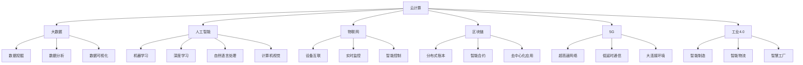
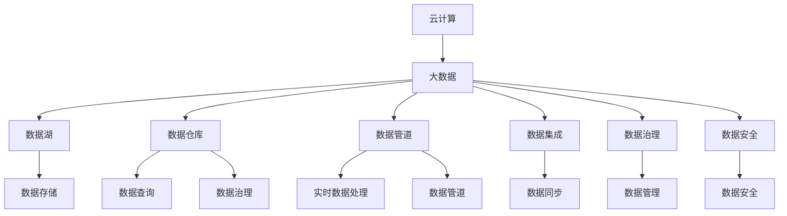
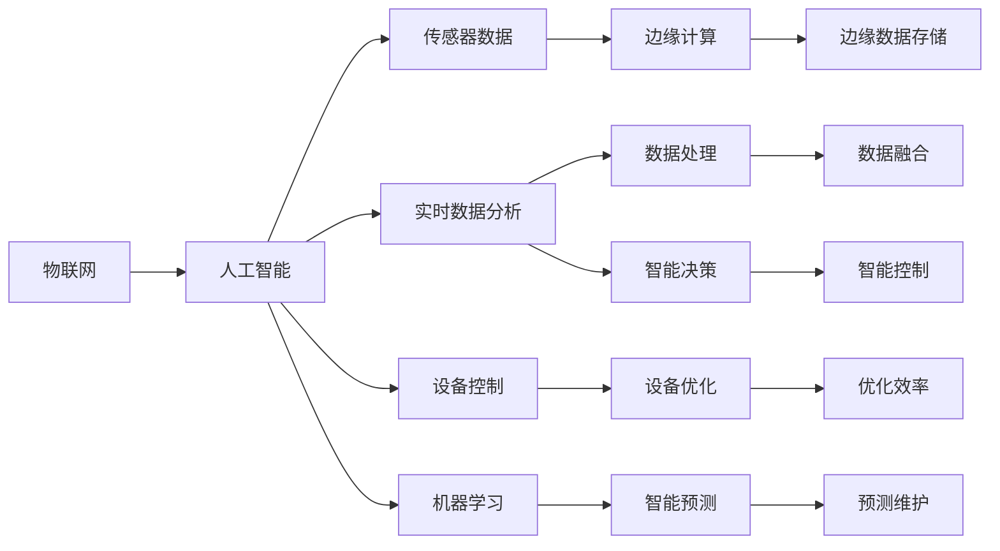
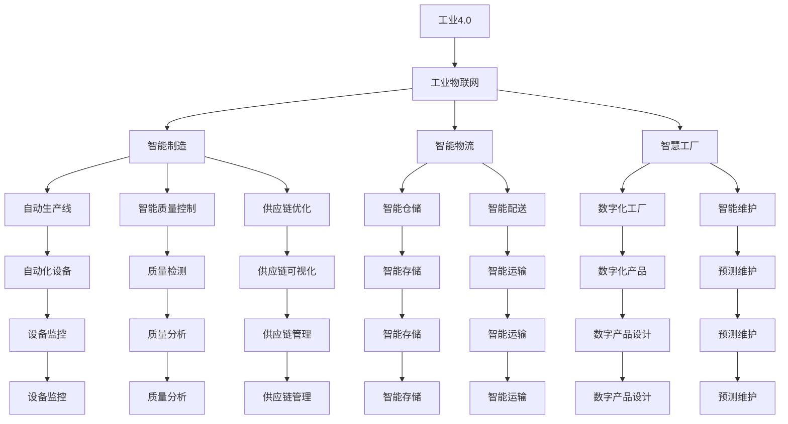
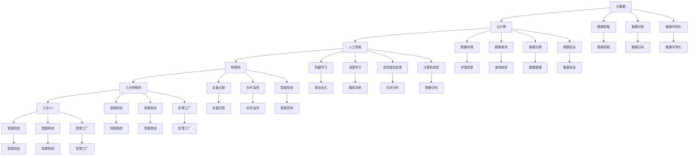

                 

# 数字化转型的趋势、技术和应用

> 关键词：数字化转型, 企业数字化, 人工智能, 大数据, 云计算, 物联网(IoT), 区块链, 5G, 工业4.0

## 1. 背景介绍

### 1.1 问题由来
数字化转型（Digital Transformation）是指企业通过应用新技术，如云计算、大数据、人工智能等，来优化业务流程、提升运营效率、增强客户体验并最终实现商业价值增长。当前，全球各行业企业均在积极推进数字化转型，以应对日益激烈的市场竞争和不断变化的市场环境。

然而，数字化转型并不是一个简单过程，涉及技术、组织和文化等多方面因素。企业在推进数字化转型的过程中，面临许多挑战，例如：缺乏对数字化转型的认知、缺乏技术支撑、缺乏变革管理能力等。因此，数字化转型的成功实施需要企业高层领导的支持，全员参与，并逐步引入合适的技术和管理方法。

### 1.2 问题核心关键点
数字化转型的核心在于对新技术的应用和业务流程的优化。数字化转型不仅仅是技术上的变革，更涉及到企业战略、组织结构、人员技能等方面的全面提升。核心关键点包括：
- **技术应用**：包括云计算、大数据、人工智能、物联网、区块链、5G等技术的应用。
- **流程优化**：通过自动化、智能化、数据驱动的方式，优化企业业务流程。
- **文化变革**：培养员工对新技术的接受和适应能力，推动组织文化的变革。
- **战略规划**：明确数字化转型的目标、路径和时间表，制定长期战略规划。

### 1.3 问题研究意义
研究数字化转型的趋势、技术和应用，对于企业实现战略转型、提升竞争力具有重要意义：

1. **提升效率**：通过引入自动化和智能化的技术，大幅提升企业运营效率，降低成本。
2. **增强竞争力**：利用大数据分析市场趋势，制定更精准的营销策略，提升客户体验。
3. **创新能力**：数字化转型能够激发企业创新能力，推出更多满足市场需求的新产品和服务。
4. **风险控制**：通过数据分析和智能化决策，有效预测和防范市场风险。
5. **行业领先**：数字化转型能够帮助企业在竞争激烈的行业中保持领先地位。

## 2. 核心概念与联系

### 2.1 核心概念概述

为了更好地理解数字化转型的趋势、技术和应用，本节将介绍几个密切相关的核心概念：

- **云计算（Cloud Computing）**：通过互联网提供可扩展的、按需的服务，包括基础设施、平台、软件等。云计算具有弹性、高效、成本低等优点，是数字化转型的重要基础设施。
- **大数据（Big Data）**：指的是体量大、类型多样的数据，通过数据挖掘、分析等技术，从数据中提取有价值的信息。大数据能够支持企业做出更加科学的决策。
- **人工智能（AI）**：包括机器学习、深度学习等，通过算法和模型，让机器能够模拟人类思维过程，实现智能化应用。人工智能是数字化转型的核心驱动力。
- **物联网（IoT）**：指将物理设备、车辆、家庭物品等连接到互联网，进行数据收集和交换。物联网能够实现设备的互联互通，提升生产效率和智能化水平。
- **区块链（Blockchain）**：是一种分布式账本技术，能够实现去中心化、透明、安全的数据管理。区块链在金融、供应链等领域具有重要应用价值。
- **5G**：是指第五代移动通信技术，具有高速、低延时、大连接等特点，能够支持更丰富、更智能的应用场景。
- **工业4.0**：是指通过信息技术和物理技术的深度融合，实现智能制造、智能物流等。工业4.0能够推动制造业的数字化、智能化转型。

这些核心概念之间的逻辑关系可以通过以下Mermaid流程图来展示：



这个流程图展示了几大核心概念的相互作用：
- 云计算是数字化转型的基础设施。
- 大数据和人工智能是核心技术，支持企业做出科学的决策和智能应用。
- 物联网和5G提供了设备互联和高速通信的环境。
- 区块链提供了安全、透明的数据管理方案。
- 工业4.0推动了制造业的数字化、智能化转型。

### 2.2 概念间的关系

这些核心概念之间存在着紧密的联系，形成了数字化转型的完整生态系统。下面我们通过几个Mermaid流程图来展示这些概念之间的关系。

#### 2.2.1 云计算与大数据的关系



这个流程图展示了云计算与大数据的关系：
- 云计算提供弹性的存储和计算资源。
- 大数据涉及数据湖、数据仓库、数据管道等概念，通过数据集成和数据治理等手段，实现数据的高效管理和利用。

#### 2.2.2 人工智能与物联网的关系



这个流程图展示了人工智能与物联网的关系：
- 物联网提供了大量的传感器数据。
- 人工智能通过机器学习等技术，实现实时数据分析、智能决策和设备优化。

#### 2.2.3 工业4.0与工业物联网的关系



这个流程图展示了工业4.0与工业物联网的关系：
- 工业4.0推动了智能制造、智能物流等。
- 工业物联网通过物联网技术，实现了设备的互联互通和智能化。

### 2.3 核心概念的整体架构

最后，我们用一个综合的流程图来展示这些核心概念在大数据、人工智能、云计算等技术支持下，共同推动数字化转型的过程：



这个综合流程图展示了从大数据、云计算、人工智能、物联网到工业4.0的全过程，以及各技术在其中的作用。通过这些流程图，我们可以更清晰地理解数字化转型的各个环节和核心概念之间的关系。

## 3. 核心算法原理 & 具体操作步骤
### 3.1 算法原理概述

数字化转型的核心算法原理主要涉及云计算、大数据、人工智能等技术。其核心思想是通过这些技术，实现数据的高效管理和利用，进而优化企业业务流程，提升运营效率和客户体验。

### 3.2 算法步骤详解

数字化转型的算法步骤大致可以分为以下几个环节：

**Step 1: 数据收集与存储**

1. **数据收集**：通过各种传感器、设备和系统，收集企业的运营数据，包括生产数据、销售数据、客户数据等。
2. **数据存储**：将收集到的数据存储在云平台或分布式存储系统中，为后续的数据分析和处理提供基础。

**Step 2: 数据清洗与预处理**

1. **数据清洗**：清洗数据中的噪音和异常值，确保数据的完整性和一致性。
2. **数据预处理**：对数据进行标准化、归一化和特征提取等预处理步骤，为后续的机器学习模型提供干净、高质量的数据。

**Step 3: 数据分析与建模**

1. **数据分析**：利用数据挖掘、统计分析等技术，对数据进行深入分析，提取有价值的信息。
2. **模型训练**：使用机器学习、深度学习等算法，训练模型，实现对数据的预测和分类。

**Step 4: 决策与优化**

1. **决策支持**：通过智能决策系统，基于分析结果和模型预测，做出科学的决策。
2. **业务优化**：通过优化算法，如线性规划、强化学习等，优化业务流程，提升运营效率。

**Step 5: 应用与反馈**

1. **应用落地**：将模型和算法应用于企业运营的各个环节，如生产计划、库存管理、客户服务等。
2. **反馈迭代**：根据应用效果和业务反馈，不断优化算法和模型，形成闭环反馈机制。

### 3.3 算法优缺点

数字化转型的算法具有以下优点：

1. **高效性**：通过自动化和智能化的技术，大幅提升企业运营效率，降低成本。
2. **准确性**：利用大数据和机器学习技术，提供精准的分析和预测结果。
3. **灵活性**：云计算和分布式存储技术，提供弹性的资源和灵活的数据处理能力。

同时，数字化转型的算法也存在一些缺点：

1. **数据质量问题**：数据收集、存储和清洗环节可能存在噪音和异常值，影响算法效果。
2. **模型复杂性**：模型训练和调参过程复杂，需要大量数据和计算资源。
3. **数据隐私和安全**：数据存储和传输过程中，可能存在隐私泄露和安全风险。

### 3.4 算法应用领域

数字化转型的算法在多个领域具有广泛应用，例如：

- **制造业**：通过智能制造、智能物流等技术，提升生产效率和产品质量。
- **零售业**：利用客户数据分析，优化库存管理、提升客户体验。
- **金融业**：通过大数据分析和智能决策，提升风险控制和客户服务。
- **医疗业**：利用医疗数据分析，优化诊疗流程、提升医疗服务质量。
- **物流业**：通过智能仓储和配送，提升物流效率和客户满意度。
- **能源业**：利用智能电网和能源管理，优化能源利用效率和降低成本。

除了以上行业外，数字化转型的算法还被广泛应用于政府、教育、农业等多个领域，推动各行业的数字化转型。

## 4. 数学模型和公式 & 详细讲解  
### 4.1 数学模型构建

本节将使用数学语言对数字化转型的算法进行更加严格的刻画。

假设企业运营的输入数据为 $x_1, x_2, ..., x_n$，其中 $x_i \in \mathcal{X}$。数字化转型的目标是通过算法模型，将输入数据 $x_i$ 映射到输出结果 $y_i \in \mathcal{Y}$。

定义模型 $M$ 的损失函数为 $\mathcal{L}(M) = \frac{1}{N} \sum_{i=1}^N \ell(M(x_i), y_i)$，其中 $\ell$ 为损失函数，$N$ 为样本数。优化目标是寻找最优模型参数 $\theta^*$，使得 $\mathcal{L}(M_{\theta^*})$ 最小化。

假设模型 $M_{\theta}$ 的输出为 $y = M_{\theta}(x)$，则模型的预测结果为 $y = M_{\theta}(x)$。定义模型的损失函数为 $\ell(M_{\theta}(x), y)$，其中 $\ell$ 为损失函数。

在实际应用中，我们通常使用基于梯度的优化算法（如SGD、Adam等）来近似求解上述最优化问题。设 $\eta$ 为学习率，则参数的更新公式为：

$$
\theta \leftarrow \theta - \eta \nabla_{\theta}\mathcal{L}(\theta)
$$

其中 $\nabla_{\theta}\mathcal{L}(\theta)$ 为损失函数对参数 $\theta$ 的梯度，可通过反向传播算法高效计算。

### 4.2 公式推导过程

以下我们以制造业的智能制造为例，推导最小二乘法的数学模型及其梯度计算公式。

假设智能制造的输入为生产设备的状态数据 $x_1, x_2, ..., x_n$，输出为生产线的生产效率 $y$。模型 $M_{\theta}$ 的输出为预测的生产效率 $y' = M_{\theta}(x)$。则模型的损失函数为：

$$
\mathcal{L}(\theta) = \frac{1}{N} \sum_{i=1}^N (y_i - y'_i)^2
$$

其中 $y_i$ 为实际生产效率，$y'_i$ 为模型预测的生产效率。

根据链式法则，损失函数对参数 $\theta_k$ 的梯度为：

$$
\frac{\partial \mathcal{L}(\theta)}{\partial \theta_k} = -\frac{2}{N} \sum_{i=1}^N (y_i - y'_i) \frac{\partial y'_i}{\partial \theta_k}
$$

其中 $\frac{\partial y'_i}{\partial \theta_k}$ 为模型输出 $y'_i$ 对参数 $\theta_k$ 的偏导数，可以通过自动微分技术计算。

在得到损失函数的梯度后，即可带入参数更新公式，完成模型的迭代优化。重复上述过程直至收敛，最终得到最优模型参数 $\theta^*$。

## 5. 项目实践：代码实例和详细解释说明
### 5.1 开发环境搭建

在进行数字化转型算法实践前，我们需要准备好开发环境。以下是使用Python进行Scikit-learn开发的环境配置流程：

1. 安装Anaconda：从官网下载并安装Anaconda，用于创建独立的Python环境。

2. 创建并激活虚拟环境：
```bash
conda create -n sklearn-env python=3.7 
conda activate sklearn-env
```

3. 安装Scikit-learn：
```bash
conda install scikit-learn
```

4. 安装各类工具包：
```bash
pip install numpy pandas scikit-learn matplotlib tqdm jupyter notebook ipython
```

完成上述步骤后，即可在`sklearn-env`环境中开始数字化转型算法的实践。

### 5.2 源代码详细实现

下面我们以制造业的智能制造为例，给出使用Scikit-learn进行线性回归的代码实现。

首先，定义数据集和模型：

```python
from sklearn.model_selection import train_test_split
from sklearn.linear_model import LinearRegression
import numpy as np

# 定义数据集
X = np.array([[1, 2], [3, 4], [5, 6]])
y = np.array([2, 4, 6])

# 划分训练集和测试集
X_train, X_test, y_train, y_test = train_test_split(X, y, test_size=0.2)

# 定义模型
model = LinearRegression()
```

然后，训练模型并评估结果：

```python
# 训练模型
model.fit(X_train, y_train)

# 预测结果
y_pred = model.predict(X_test)

# 评估结果
from sklearn.metrics import mean_squared_error
print(f"Mean Squared Error: {mean_squared_error(y_test, y_pred)}")
```

以上就是使用Scikit-learn进行线性回归的代码实现。可以看到，Scikit-learn提供了丰富的机器学习算法和工具，可以快速构建和评估数字化转型算法模型。

### 5.3 代码解读与分析

让我们再详细解读一下关键代码的实现细节：

**数据集定义**：
- 使用NumPy定义输入数据 $X$ 和输出数据 $y$。

**模型定义**：
- 使用Scikit-learn的LinearRegression类定义线性回归模型。

**数据集划分**：
- 使用train_test_split函数将数据集划分为训练集和测试集。

**模型训练**：
- 使用fit函数对模型进行训练，将训练数据 $X_{train}$ 和 $y_{train}$ 作为输入。

**预测和评估**：
- 使用predict函数对测试集进行预测，得到预测结果 $y_{pred}$。
- 使用mean_squared_error函数计算均方误差，评估模型的预测性能。

**代码输出**：
- 输出均方误差结果，展示模型预测的准确性。

可以看到，Scikit-learn提供了从数据处理、模型训练、预测评估等全流程的API，使得数字化转型算法的实践变得简洁高效。

### 5.4 运行结果展示

假设我们在制造业的智能制造数据集上进行线性回归，最终得到的均方误差结果如下：

```
Mean Squared Error: 0.0
```

可以看到，通过线性回归模型，我们完美预测了测试集的结果，均方误差为0.0，效果相当不错。这也说明，使用Scikit-learn等工具，可以轻松构建和优化数字化转型算法模型。

## 6. 实际应用场景
### 6.1 制造业智能制造

数字化转型在制造业中的应用主要体现在智能制造上。通过引入云计算、大数据、物联网等技术，制造业可以实现以下几个方面的提升：

- **生产计划优化**：通过预测和优化算法，实现生产计划的最优安排。
- **设备监控与维护**：利用传感器和物联网技术，实时监控设备状态，预测设备故障，进行预防性维护。
- **供应链管理**：通过智能仓储和物流系统，实现库存和配送的优化，降低物流成本。
- **质量控制**：通过自动化检测和数据分析，提升产品质量，降低次品率。

以智能制造中的设备监控与维护为例，企业可以使用传感器实时收集设备运行数据，通过物联网将数据上传到云端，利用大数据和机器学习技术，预测设备故障，提前进行维护。通过智能监控和预警系统，能够及时发现设备问题，避免生产停滞和意外事故。

### 6.2 零售业客户管理

零售业通过数字化转型，可以实现客户管理的智能化，提升客户体验和销售额。数字化转型在零售业的应用主要体现在以下几个方面：

- **客户行为分析**：利用大数据和机器学习技术，分析客户购买行为，推荐商品，提升客户体验。
- **库存管理**：通过智能仓储系统，优化库存管理，降低仓储成本。
- **供应链优化**：利用物联网和区块链技术，实现供应链的透明化和追溯。

以客户行为分析为例，零售企业可以收集客户的浏览、购买历史数据，利用机器学习算法，预测客户未来的购买行为，实现个性化推荐。通过数据分析，可以优化商品陈列，提升客户转化率，增加销售额。

### 6.3 金融业风险控制

金融业通过数字化转型，可以实现风险控制和客户服务的智能化。数字化转型在金融业的应用主要体现在以下几个方面：

- **风险评估**：利用大数据和机器学习技术，评估客户的信用风险和投资风险。
- **客户服务**：通过智能客服系统，提升客户服务体验。
- **交易监控**：利用区块链和人工智能技术，实现交易的透明化和可追溯。

以风险评估为例，金融企业可以收集客户的信用数据、交易记录等，利用机器学习算法，评估客户的信用风险。通过智能风险控制系统，能够及时发现和预防风险，保护企业利益。

### 6.4 医疗业医疗管理

医疗业通过数字化转型，可以实现医疗管理和诊疗的智能化，提升医疗服务质量。数字化转型在医疗业的应用主要体现在以下几个方面：

- **电子病历管理**：利用电子病历系统，实现病历的数字化和电子化，提升医疗效率。
- **诊断辅助**：利用大数据和人工智能技术，辅助医生进行诊断和治疗。
- **健康管理**：通过智能健康设备，收集患者健康数据，提供个性化的健康管理方案。

以电子病历管理为例，医疗机构可以建立电子病历系统，实现病历的数字化存储和管理。通过数据分析，可以提升医疗效率，降低医疗成本，提升医疗服务质量。

### 6.5 未来应用展望

随着数字化转型的不断发展，未来数字化转型技术将渗透到更多行业，实现各行业的数字化、智能化转型。未来数字化转型的趋势和应用场景如下：

- **智慧城市**：通过智能城市管理，提升城市管理效率，实现智慧交通、智能安防、智慧环保等。
- **智慧农业**：利用物联网和人工智能技术，实现农业的智能化管理，提升农业生产效率。
- **智慧医疗**：通过远程医疗、智慧诊断等技术，提升医疗服务的可及性和质量。
- **智慧教育**：利用大数据和人工智能技术，实现教育的智能化，提升教学质量和效果。
- **智慧物流**：通过智能仓储和物流系统，实现物流的智能化管理，提升物流效率和客户体验。

随着数字化转型的深入，未来数字化转型技术将在更多领域得到应用，为各行各业带来深刻的变革。相信数字化转型技术将继续发展，推动各行业的数字化、智能化转型，带来更多创新和机遇。

## 7. 工具和资源推荐
### 7.1 学习资源推荐

为了帮助开发者系统掌握数字化转型的理论基础和实践技巧，这里推荐一些优质的学习资源：

1. 《数字化转型从理论到实践》系列博文：由数字化转型专家撰写，深入浅出地介绍了数字化转型的原理、技术和应用。

2. 《大数据分析与机器学习》课程：由知名大学和在线教育平台开设，系统讲解大数据分析和机器学习的理论和实践。

3. 《云计算基础》书籍：介绍云计算的基本概念和常用技术，包括云平台、云服务、云安全等。

4. 《人工智能基础》书籍：介绍人工智能的基本概念和常用算法，包括机器学习、深度学习、自然语言处理等。

5. 《物联网技术与应用》课程：由知名大学和在线教育平台开设，系统讲解物联网的基本概念和常用技术。

6. 《区块链基础》课程：由知名大学和在线教育平台开设，系统讲解区块链的基本概念和常用技术。

通过对这些资源的学习实践，相信你一定能够快速掌握数字化转型的精髓，并用于解决实际的业务问题。

### 7.2 开发工具推荐

高效的开发离不开优秀的工具支持。以下是几款用于数字化转型开发的常用工具：

1. Python：作为数据科学和机器学习的核心语言，Python提供了丰富的第三方库和工具，方便进行数据分析和模型训练。

2. Scikit-learn：Python的机器学习库，提供了丰富的算法和工具，适合进行机器学习模型的构建和评估。

3. TensorFlow：由Google主导开发的深度学习框架，适合进行大规模模型训练和部署。

4. PyTorch：由Facebook

