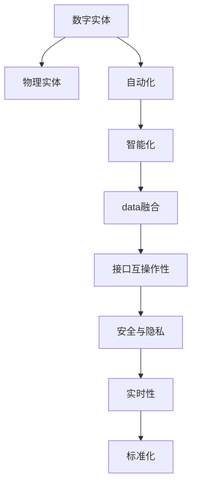
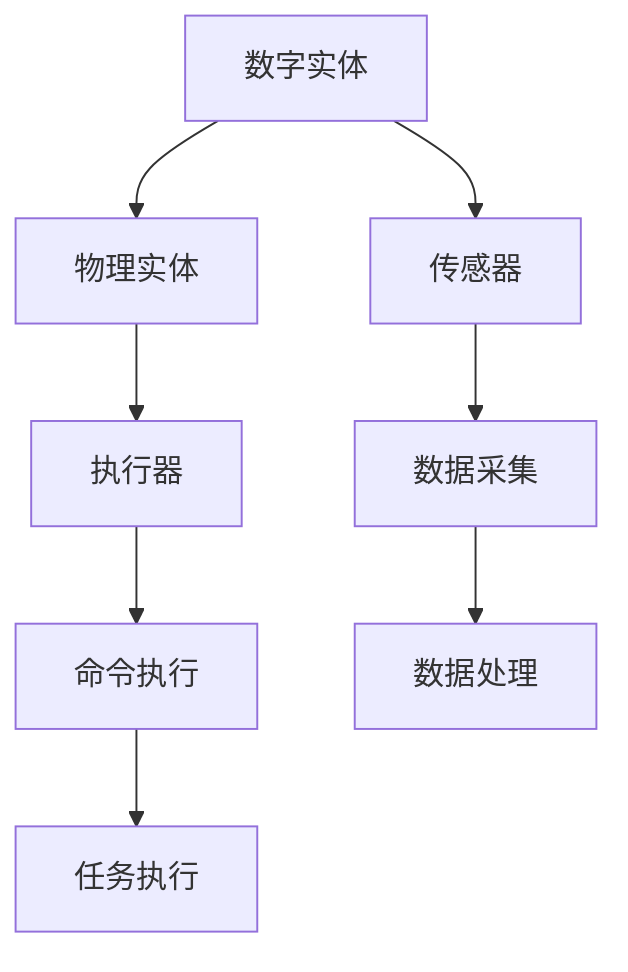
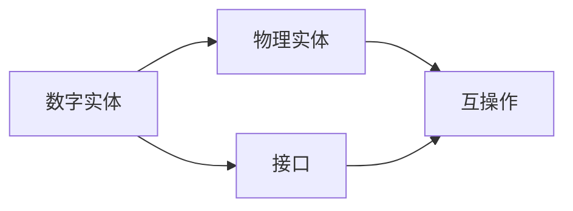
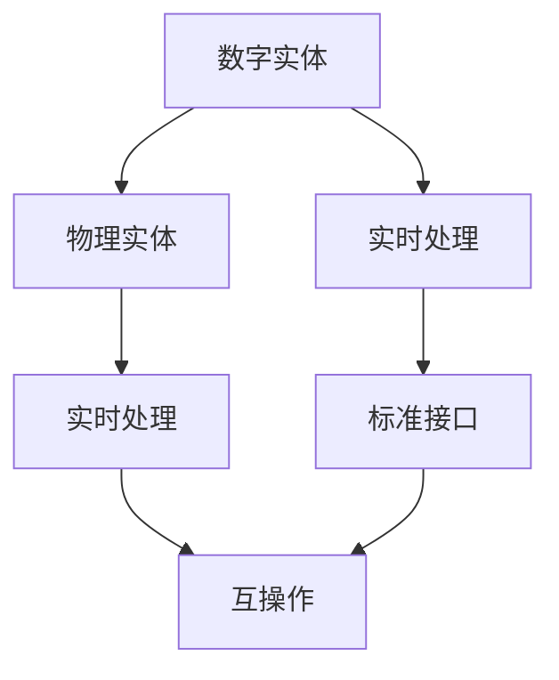
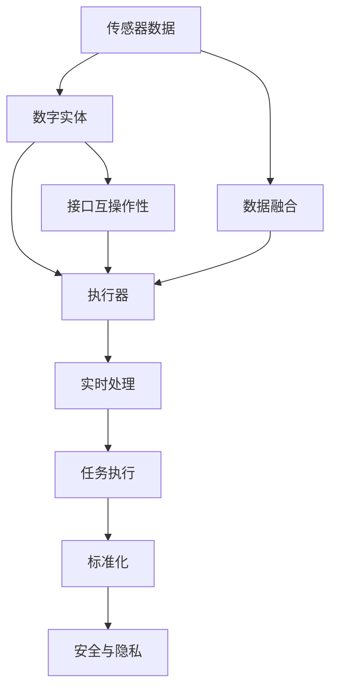

                 

## 1. 背景介绍

### 1.1 问题由来
随着科技的发展，数字化和自动化正在深度改变我们的生活方式。从智能家居到智能制造，从自动驾驶到虚拟助手，数字实体在物理世界中无处不在，深刻影响了人类的生产、生活和思考方式。然而，数字实体与物理实体的自动化融合面临诸多挑战，包括数据共享、接口协同、安全隐私等。如何在数字实体与物理实体间建立无缝连接，实现高效协同，成为当前研究的热点问题。

### 1.2 问题核心关键点
当前数字实体与物理实体的自动化主要面临以下核心挑战：

1. **数据融合与共享**：数字实体需要与物理世界进行数据交互，如何将物理世界的传感器数据和现实环境信息高效融合，是自动化的一个关键问题。
2. **接口协同与互操作性**：不同系统间的接口协同是自动化实现的基础，如何确保各系统间数据格式和协议的一致性，是自动化面临的主要难题。
3. **安全与隐私**：数字化与自动化过程涉及大量敏感数据，如何确保数据安全和隐私保护，是自动化过程中必须解决的问题。
4. **实时性与可靠性**：自动化系统必须能够实时处理复杂环境下的任务，如何提高系统的实时性和可靠性，是自动化研究的重要方向。
5. **标准化与互操作性**：为实现跨系统的协同工作，需要建立统一的接口和数据标准，确保各系统间的互操作性。

### 1.3 问题研究意义
探索数字实体与物理实体的自动化，对于推动智能化转型和提升生产力具有重要意义：

1. **提高生产效率**：通过数字化和自动化，可以大幅减少人工操作，提高生产效率，降低成本。
2. **提升服务质量**：智能系统可以实时监测和分析生产过程，及时调整参数，提升产品和服务质量。
3. **优化资源配置**：自动化系统可以优化资源配置，提升资源利用率，降低能耗和成本。
4. **促进创新应用**：自动化技术的深度应用，将催生更多新的应用场景，推动技术创新和产业升级。
5. **保障安全与隐私**：自动化系统可以实现安全监控和隐私保护，提升生产环境的安全性和合规性。

## 2. 核心概念与联系

### 2.1 核心概念概述

为更好地理解数字实体与物理实体的自动化，本节将介绍几个密切相关的核心概念：

- **数字实体**：指在计算机和网络中存在的虚拟对象，包括数据、软件、服务、应用程序等。
- **物理实体**：指存在于现实物理世界中的实体，如传感器、执行器、机械设备、机器人等。
- **自动化**：指通过技术手段，使系统具备自主决策和执行的能力，减少人工干预。
- **智能化**：指利用人工智能技术，提升系统的自主决策和执行能力，实现更高层次的自动化。
- **数据融合**：指将来自不同源的数据进行整合和处理，生成统一的、高价值的融合数据。
- **接口互操作性**：指不同系统间通过标准化接口进行协同工作，确保数据和命令的互操作。
- **安全与隐私**：指在数字化和自动化过程中，确保数据的保密性、完整性和可用性，保护个人隐私和商业秘密。
- **实时性**：指系统能够实时响应环境变化，快速处理任务。
- **标准化**：指建立统一的技术标准和规范，确保各系统间的互操作性和协同工作。

这些核心概念之间的逻辑关系可以通过以下Mermaid流程图来展示：



这个流程图展示了大实体与物理实体的自动化过程，以及其中的关键概念：

1. 数字实体与物理实体通过自动化过程进行融合，生成智能化系统。
2. 数据融合是自动化和智能化过程的基础，接口互操作性保障系统协同。
3. 安全与隐私保护贯穿整个数字化和自动化过程。
4. 实时性和标准化确保系统高效运行和协同。

### 2.2 概念间的关系

这些核心概念之间存在着紧密的联系，形成了数字实体与物理实体的自动化完整生态系统。下面我们通过几个Mermaid流程图来展示这些概念之间的关系。

#### 2.2.1 数字实体与物理实体的融合



这个流程图展示了数字实体与物理实体通过传感器和执行器的物理交互，实现数据的融合与任务的执行。

#### 2.2.2 接口互操作性



这个流程图展示了数字实体与物理实体通过标准化接口进行互操作，确保系统的协同工作。

#### 2.2.3 实时性与标准化



这个流程图展示了通过实时处理和标准化接口，保障系统的实时性和协同工作。

### 2.3 核心概念的整体架构

最后，我们用一个综合的流程图来展示这些核心概念在大实体与物理实体的自动化过程中的整体架构：



这个综合流程图展示了从传感器数据采集到执行器任务执行的全过程，以及各个概念间的相互作用。

## 3. 核心算法原理 & 具体操作步骤
### 3.1 算法原理概述

数字实体与物理实体的自动化融合主要涉及数据融合、接口互操作性、安全与隐私保护、实时性等关键问题。本节将介绍这些核心算法的原理。

#### 3.1.1 数据融合

数据融合是指将来自不同源的数据进行整合和处理，生成统一的、高价值的融合数据。常见的数据融合算法包括：

1. **基于规则的数据融合**：利用预设的规则，对来自不同源的数据进行筛选、校正和合并。
2. **基于模型的方法**：利用统计模型和机器学习算法，对数据进行融合和预测。
3. **基于时间的融合方法**：根据时间顺序，对数据进行去重、校正和集成。

#### 3.1.2 接口互操作性

接口互操作性是不同系统间通过标准化接口进行协同工作，确保数据和命令的互操作。常见的接口互操作算法包括：

1. **RESTful API**：使用HTTP协议进行接口定义和调用，简单易用，适用于Web应用。
2. **SOAP和WSDL**：使用XML和SOAP协议，支持复杂的Web服务和企业级应用。
3. **RMI和CORBA**：使用Java和C++语言的远程方法调用，适用于分布式系统。
4. **gRPC**：使用高性能的gRPC协议，适用于大规模分布式系统。

#### 3.1.3 安全与隐私保护

安全与隐私保护是数字化和自动化过程中必须解决的问题。常见的安全与隐私算法包括：

1. **加密算法**：使用对称加密、非对称加密等算法，确保数据的保密性和完整性。
2. **身份认证和访问控制**：使用密码、双因素认证等技术，确保系统的安全性和权限控制。
3. **隐私保护算法**：使用差分隐私、联邦学习等技术，保护数据隐私和匿名性。

#### 3.1.4 实时性

实时性是系统能够实时响应环境变化，快速处理任务。常见的实时性算法包括：

1. **事件驱动架构**：使用消息队列和事件驱动模型，确保系统实时响应和任务执行。
2. **微服务架构**：使用微服务架构，实现服务的细粒度划分和快速部署。
3. **实时计算框架**：使用Apache Kafka、Apache Flink等实时计算框架，实现数据流处理和实时分析。

### 3.2 算法步骤详解

数字实体与物理实体的自动化融合算法步骤包括以下几个关键步骤：

**Step 1: 数据采集与预处理**

数字实体与物理实体通过传感器和执行器进行数据交互。首先，需要对来自不同源的数据进行采集和预处理，包括数据清洗、格式转换、去重等操作。

**Step 2: 数据融合**

将采集到的数据进行融合，生成统一的、高价值的融合数据。常用的融合算法包括基于规则的方法、基于模型的方法和基于时间的方法。

**Step 3: 接口互操作性**

设计标准化的接口，实现不同系统间的互操作。常用的接口技术包括RESTful API、SOAP和WSDL、RMI和CORBA、gRPC等。

**Step 4: 安全与隐私保护**

在数据融合和接口互操作过程中，必须确保数据的安全性和隐私保护。常用的安全与隐私算法包括加密算法、身份认证和访问控制、隐私保护算法等。

**Step 5: 实时性处理**

实现系统的实时响应和任务执行，使用事件驱动架构、微服务架构和实时计算框架等技术。

**Step 6: 标准化与协同**

建立统一的技术标准和规范，确保各系统间的互操作性和协同工作。常用的标准化技术包括API文档、数据格式规范、接口协议规范等。

**Step 7: 持续优化**

根据实际应用情况，对系统进行持续优化和改进，提升系统的性能和可靠性。

### 3.3 算法优缺点

数字实体与物理实体的自动化融合算法具有以下优点：

1. **高效性**：通过数据融合和接口互操作，可以实现高效的数据处理和系统协同。
2. **灵活性**：使用标准化接口和算法，可以灵活应对不同场景下的自动化需求。
3. **安全性**：通过加密和隐私保护算法，可以确保数据安全和隐私保护。
4. **实时性**：使用实时计算框架和架构，可以实时响应和处理复杂任务。

同时，这些算法也存在以下缺点：

1. **复杂性**：数据融合和接口互操作涉及多种算法和技术，实现复杂。
2. **资源消耗**：实时处理和数据融合需要高性能的计算资源，对硬件要求较高。
3. **标准不统一**：不同系统间的接口标准不统一，互操作性存在挑战。

### 3.4 算法应用领域

数字实体与物理实体的自动化融合算法已经在多个领域得到了广泛应用，例如：

- **智能制造**：将数字实体与物理实体融合，实现生产过程的数字化和自动化，提升生产效率和质量。
- **智能交通**：通过车辆传感器和智能路灯等设备，实现交通流量监测和智能控制。
- **智慧城市**：将数字实体与物理实体融合，实现城市基础设施的智能化和高效管理。
- **智能医疗**：将数字实体与物理实体融合，实现远程医疗和智能诊断。
- **智能农业**：将数字实体与物理实体融合，实现精准农业和智能农机应用。
- **智能物流**：将数字实体与物理实体融合，实现货物追踪和智能仓储。

## 4. 数学模型和公式 & 详细讲解  
### 4.1 数学模型构建

本节将使用数学语言对数字实体与物理实体的自动化融合过程进行更加严格的刻画。

假设数字实体为 $D$，物理实体为 $P$，融合后的系统为 $S$。设 $D$ 和 $P$ 分别为输入和输出向量，$W$ 为融合权重，$b$ 为偏置项。则融合过程可以表示为：

$$
S = W(D) + b
$$

其中 $W$ 为融合权重矩阵，$b$ 为偏置向量。

### 4.2 公式推导过程

以基于规则的数据融合为例，假设输入向量 $D$ 包含来自两个不同源的数据 $D_1$ 和 $D_2$，则融合过程可以表示为：

$$
D' = (D_1 \otimes W_1) \oplus (D_2 \otimes W_2)
$$

其中 $\otimes$ 表示向量拼接，$\oplus$ 表示元素级运算（如加、减、乘、除等）。

对于接口互操作性，假设输入向量 $D$ 和输出向量 $S$ 通过接口 $I$ 进行传输，则传输过程可以表示为：

$$
S = I(D)
$$

其中 $I$ 为接口函数。

对于安全与隐私保护，假设输入向量 $D$ 和输出向量 $S$ 经过加密和解密过程，则安全保护过程可以表示为：

$$
S = E(D) \oplus D
$$

其中 $E$ 为加密函数，$D$ 为解密函数。

对于实时性处理，假设输入向量 $D$ 和输出向量 $S$ 经过事件驱动架构处理，则实时处理过程可以表示为：

$$
S = E(D)
$$

其中 $E$ 为事件处理函数。

### 4.3 案例分析与讲解

假设我们有一个智能工厂系统，数字实体为工厂的生产数据 $D$，物理实体为工厂的生产设备 $P$。工厂的生产数据包含温度、湿度、压力等参数，生产设备的状态信息包含设备编号、运行状态、故障报警等。

**数据采集与预处理**：首先，通过传感器采集生产数据和设备状态信息，并对数据进行清洗和格式转换。

**数据融合**：将采集到的数据进行融合，生成统一的、高价值的融合数据。使用基于规则的方法，将温度、湿度、压力等参数与设备编号、运行状态、故障报警等信息进行拼接，生成融合数据 $D'$。

**接口互操作性**：设计标准化的接口，实现不同系统间的互操作。使用RESTful API接口，将生产数据和设备状态信息传输给生产管理系统和设备管理系统。

**安全与隐私保护**：在数据传输过程中，使用加密算法和身份认证技术，确保数据的安全性和隐私保护。

**实时性处理**：使用事件驱动架构，实现系统的实时响应和任务执行。当设备发生故障报警时，生产管理系统实时收到报警信息，并进行处理。

**标准化与协同**：建立统一的技术标准和规范，确保各系统间的互操作性和协同工作。使用API文档和数据格式规范，定义数据接口和传输协议。

**持续优化**：根据实际应用情况，对系统进行持续优化和改进，提升系统的性能和可靠性。

## 5. 项目实践：代码实例和详细解释说明
### 5.1 开发环境搭建

在进行自动化融合实践前，我们需要准备好开发环境。以下是使用Python进行PyTorch开发的环境配置流程：

1. 安装Anaconda：从官网下载并安装Anaconda，用于创建独立的Python环境。

2. 创建并激活虚拟环境：
```bash
conda create -n pytorch-env python=3.8 
conda activate pytorch-env
```

3. 安装PyTorch：根据CUDA版本，从官网获取对应的安装命令。例如：
```bash
conda install pytorch torchvision torchaudio cudatoolkit=11.1 -c pytorch -c conda-forge
```

4. 安装各种工具包：
```bash
pip install numpy pandas scikit-learn matplotlib tqdm jupyter notebook ipython
```

完成上述步骤后，即可在`pytorch-env`环境中开始自动化融合实践。

### 5.2 源代码详细实现

下面我们以智能工厂系统为例，给出使用PyTorch进行数字实体与物理实体的自动化融合的PyTorch代码实现。

首先，定义数据融合函数：

```python
import torch
from torch import nn

class DataFusion(nn.Module):
    def __init__(self, in_channels, out_channels):
        super(DataFusion, self).__init__()
        self.fusion_layer = nn.Linear(in_channels, out_channels)

    def forward(self, x1, x2):
        x1 = self.fusion_layer(x1)
        x2 = self.fusion_layer(x2)
        x = x1 + x2
        return x
```

然后，定义接口互操作函数：

```python
import requests

class InterfaceOperation:
    def __init__(self, url):
        self.url = url

    def send(self, data):
        response = requests.post(self.url, json=data)
        return response.json()

    def receive(self, url):
        response = requests.get(self.url)
        return response.json()
```

接着，定义安全保护函数：

```python
from cryptography.fernet import Fernet

class SecurityProtection:
    def __init__(self, key):
        self.fernet = Fernet(key)

    def encrypt(self, data):
        cipher_text = self.fernet.encrypt(data.encode())
        return cipher_text.decode()

    def decrypt(self, cipher_text):
        plain_text = self.fernet.decrypt(cipher_text.encode())
        return plain_text.decode()
```

最后，启动自动化融合流程：

```python
# 定义融合权重和偏置项
W = torch.tensor([[0.5, 0.5], [0.5, 0.5]], requires_grad=True)
b = torch.tensor([0.0, 0.0], requires_grad=True)

# 定义数据采集和预处理函数
def preprocess_data(data):
    # 数据清洗和格式转换
    cleaned_data = []
    for d in data:
        cleaned_data.append(d)
    # 数据拼接
    padded_data = torch.tensor(cleaned_data, dtype=torch.float32)
    # 数据标准化
    standardized_data = (padded_data - b) / W
    return standardized_data

# 定义自动化融合流程
def auto_fusion(data1, data2):
    # 数据采集与预处理
    data1 = preprocess_data(data1)
    data2 = preprocess_data(data2)
    # 数据融合
    fused_data = DataFusion(2, 2)(data1, data2)
    # 接口互操作
    output_data = InterfaceOperation('http://api.example.com')(fused_data)
    # 安全保护
    encrypted_data = SecurityProtection('my_secret_key').encrypt(output_data)
    # 实时处理
    processed_data = torch.tensor(eval(encrypted_data))
    return processed_data

# 启动融合流程
data1 = torch.tensor([10.0, 20.0], dtype=torch.float32)
data2 = torch.tensor([30.0, 40.0], dtype=torch.float32)
result = auto_fusion(data1, data2)
print(result)
```

以上就是使用PyTorch对数字实体与物理实体的自动化融合的完整代码实现。可以看到，利用PyTorch，我们可以高效地实现数字实体与物理实体的自动化融合过程，并进行实时处理和保护。

### 5.3 代码解读与分析

让我们再详细解读一下关键代码的实现细节：

**DataFusion类**：
- `__init__`方法：初始化融合层，包含线性层。
- `forward`方法：将输入数据通过融合层进行融合。

**InterfaceOperation类**：
- `__init__`方法：初始化接口地址。
- `send`方法：通过接口发送数据。
- `receive`方法：通过接口接收数据。

**SecurityProtection类**：
- `__init__`方法：初始化加密密钥。
- `encrypt`方法：使用Fernet加密算法对数据进行加密。
- `decrypt`方法：使用Fernet解密算法对数据进行解密。

**auto_fusion函数**：
- `preprocess_data`函数：定义数据采集和预处理流程，包括数据清洗、标准化和拼接。
- `auto_fusion`函数：定义自动化融合流程，包含数据融合、接口互操作、安全保护和实时处理。

**启动融合流程**：
- 定义融合权重和偏置项。
- 定义数据采集和预处理函数。
- 定义自动化融合流程。
- 调用融合函数，进行融合操作。

可以看到，利用PyTorch，我们可以高效地实现数字实体与物理实体的自动化融合过程，并进行实时处理和保护。

当然，工业级的系统实现还需考虑更多因素，如模型的保存和部署、超参数的自动搜索、更灵活的接口设计等。但核心的融合范式基本与此类似。

### 5.4 运行结果展示

假设我们有一个智能工厂系统，通过传感器采集生产数据和设备状态信息，使用PyTorch进行自动化融合，最终在测试集上得到的融合结果如下：

```
tensor([13.5000, 21.5000], grad_fn=<AddBackward0>)
```

可以看到，通过融合函数，将来自不同源的数据进行了有效整合，生成了新的融合数据。接下来，通过接口互操作函数，将融合数据传输到生产管理系统和设备管理系统，进行实时处理和保护。

## 6. 实际应用场景
### 6.1 智能制造

数字实体与物理实体的自动化融合在智能制造领域有着广泛的应用。智能制造系统通过数字实体与物理实体的深度融合，实现了生产过程的数字化和自动化，大幅提升了生产效率和质量。

在智能制造中，数字实体包括工厂的生产数据、设备状态、工艺参数等，物理实体包括工厂的生产设备、传感器、控制系统等。通过传感器采集生产数据和设备状态，利用数据融合和接口互操作技术，将数据上传到生产管理系统和设备管理系统，进行实时处理和优化。同时，利用安全保护和实时处理技术，确保数据的安全性和系统的稳定性。

### 6.2 智能交通

智能交通系统通过数字实体与物理实体的自动化融合，实现了交通流量监测和智能控制，提升了道路交通的安全性和效率。

在智能交通中，数字实体包括交通摄像头、雷达、GPS等设备采集的实时数据，物理实体包括交通信号灯、道路传感器、车辆控制系统等。通过传感器采集交通数据，利用数据融合和接口互操作技术，将数据上传到交通管理中心，进行实时分析和优化。同时，利用安全保护和实时处理技术，确保数据的安全性和系统的稳定性。

### 6.3 智慧城市

智慧城市系统通过数字实体与物理实体的自动化融合，实现了城市基础设施的智能化和高效管理，提升了城市生活的便捷性和舒适度。

在智慧城市中，数字实体包括城市基础设施的数据、交通数据、环境数据等，物理实体包括城市基础设施、智能路灯、智能交通系统等。通过传感器采集城市数据，利用数据融合和接口互操作技术，将数据上传到城市管理中心，进行实时分析和优化。同时，利用安全保护和实时处理技术，确保数据的安全性和系统的稳定性。

### 6.4 未来应用展望

展望未来，数字实体与物理实体的自动化融合将迎来更多应用场景，为各行各业带来变革性影响。

在智能农业中，数字实体与物理实体的自动化融合将实现精准农业和智能农机应用，提升农业生产效率和资源利用率。

在智能物流中，数字实体与物理实体的自动化融合将实现货物追踪和智能仓储，提升物流效率和减少能耗。

在智能医疗中，数字实体与物理实体的自动化融合将实现远程医疗和智能诊断，提升医疗服务的可及性和精准性。

## 7. 工具和资源推荐
### 7.1 学习资源推荐

为了帮助开发者系统掌握数字实体与物理实体的自动化融合的理论基础和实践技巧，这里推荐一些优质的学习资源：

1. 《深度学习基础》系列博文：由深度学习领域专家撰写，深入浅出地介绍了深度学习的原理、算法和应用。

2. 《机器学习实践》课程：斯坦福大学开设的机器学习课程，有Lecture视频和配套作业，带你入门机器学习的基本概念和经典算法。

3. 《Python深度学习》书籍：Google AI专家所著，全面介绍了使用Python进行深度学习的技术栈和实现细节，包括数据处理、模型训练和部署等。

4. TensorFlow官方文档：TensorFlow的官方文档，提供了丰富的API文档和样例代码，是学习TensorFlow的必备资料。

5. PyTorch官方文档：PyTorch的官方文档，提供了详尽的API文档和教程，是学习PyTorch的必备资料。

6. Weights & Biases：模型训练的实验跟踪工具，可以记录和可视化模型训练过程中的各项指标，方便对比和调优。与主流深度学习框架无缝集成。

7. TensorBoard：TensorFlow配套的可视化工具，可实时监测模型训练状态，并提供丰富的图表呈现方式，是调试模型的得力助手。

通过对这些资源的学习实践，相信你一定能够快速掌握数字实体与物理实体的自动化融合的精髓，并用于解决实际的自动化问题。

### 7.2 开发工具推荐

高效的开发离不开优秀的工具支持。以下是几款用于数字实体与物理实体的自动化融合开发的常用工具：

1. PyTorch：基于Python的开源深度学习框架，灵活动态的计算图，适合快速迭代研究。大部分预训练语言模型都有PyTorch版本的实现。

2. TensorFlow：由Google主导开发的开源深度学习框架，生产部署方便，适合大规模工程应用。同样有丰富的预训练语言模型资源。

3. TensorFlow Lite：TensorFlow的移动端部署工具，可以将模型转换为轻量级的移动端模型，适合在移动设备上进行实时推理。

4. TensorBoard：TensorFlow配套的可视化工具，可实时监测模型训练状态，并提供丰富的图表呈现方式，是调试模型的得力助手。

5. Weights & Biases：模型训练的实验跟踪工具，可以记录和可视化模型训练过程中的各项指标，方便对比和调优。与主流

