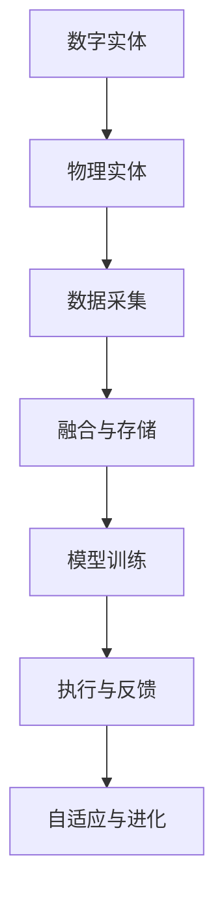

                 

## 数字实体与物理实体的自动化前景

### 1. 背景介绍

在当今数字化浪潮下，数字实体与物理实体的深度融合成为了推动各行各业向智能化转型的关键驱动力。本文将聚焦于数字实体与物理实体的自动化，探讨其核心概念、原理、算法及其实际应用，以期为相关领域的研究者及实践者提供有价值的参考。

### 2. 核心概念与联系

#### 2.1 核心概念概述

- **数字实体**：指在数字世界中定义和操作的信息对象，包括数据、模型、规则等。数字实体通常以0和1的形式存在，具有强大的计算和处理能力。
- **物理实体**：指现实世界中具有物理属性的对象，如设备、环境、人等。物理实体具有感知、交互和响应环境变化的能力。
- **自动化**：指通过技术手段，实现对过程、任务或系统的自动控制和优化。

#### 2.2 核心概念的联系

数字实体与物理实体的自动化通过以下关键环节实现深度融合：
1. **数据采集与融合**：将物理实体的感知数据采集到数字实体中，形成统一的数据仓库。
2. **模型训练与优化**：利用数字实体中的历史数据和知识，训练智能模型，优化物理实体的控制策略。
3. **执行与反馈**：将训练好的模型应用于物理实体，实时监控执行结果，并根据反馈调整模型参数。
4. **自适应与进化**：通过不断的学习和优化，实现物理实体与数字实体之间的自适应和进化。

这一过程可以用以下Mermaid流程图来表示：



该流程图展示了数字实体与物理实体的自动化过程，其中每个环节都至关重要。

### 3. 核心算法原理 & 具体操作步骤

#### 3.1 算法原理概述

数字实体与物理实体的自动化基于以下几个关键算法：
- **数据采集与融合算法**：将多源异构数据进行统一处理，构建完整的数据视图。
- **模型训练与优化算法**：利用历史数据和领域知识，训练智能模型，并通过优化算法（如遗传算法、贝叶斯优化等）不断提升模型性能。
- **执行与反馈算法**：将训练好的模型应用于物理实体，实时监控执行效果，并通过反馈调整模型参数。
- **自适应与进化算法**：通过持续学习和经验积累，使物理实体与数字实体之间实现自适应和进化。

#### 3.2 算法步骤详解

1. **数据采集与融合**：
   - 定义数据采集接口，确保多源异构数据能够统一采集。
   - 采用数据清洗和预处理技术，去除噪声和异常值，确保数据质量。
   - 使用数据融合算法（如时间对齐、特征选择等），构建统一的数据视图。

2. **模型训练与优化**：
   - 选择合适的模型框架（如TensorFlow、PyTorch等）和模型结构（如神经网络、决策树等）。
   - 准备训练数据集，并进行数据增强（如旋转、翻转等）以提升模型鲁棒性。
   - 设计合适的损失函数和优化算法（如Adam、SGD等），训练模型。
   - 利用交叉验证和超参数调优技术（如网格搜索、随机搜索等），优化模型性能。

3. **执行与反馈**：
   - 将训练好的模型部署到物理实体上，实现自动控制和决策。
   - 实时监控物理实体的执行效果，并通过传感器和监控设备获取反馈信息。
   - 根据反馈信息，调整模型参数和控制策略，实现自适应和优化。

4. **自适应与进化**：
   - 利用在线学习技术（如在线梯度下降、增量学习等），持续更新模型参数。
   - 引入强化学习算法（如Q-learning、SARSA等），优化控制策略。
   - 定期进行模型评估和性能测试，确保系统稳定性和可靠性。

#### 3.3 算法优缺点

**优点**：
- 提升效率和精度：通过自动控制和优化，减少了人工干预和错误，提升了操作效率和决策精度。
- 增强灵活性：模型可以根据实时反馈自适应调整，具备较强的环境适应性。
- 降低成本：减少了人工操作和维护成本，提高了资源利用率。

**缺点**：
- 初始设置复杂：模型训练和参数调优需要大量前期工作。
- 依赖数据质量：数据质量和采集方式对自动化效果有直接影响。
- 系统复杂性：涉及数字实体与物理实体的多层次交互，系统设计和实现复杂。

#### 3.4 算法应用领域

数字实体与物理实体的自动化已经在多个领域实现了成功应用：
- **智能制造**：利用数字模型优化生产流程，实现智能制造。
- **智慧城市**：通过实时数据监控和智能决策，提升城市管理水平。
- **自动驾驶**：结合高精度地图和感知数据，实现车辆自主导航。
- **智能家居**：通过数字实体控制智能设备，实现家庭自动化。

### 4. 数学模型和公式 & 详细讲解

#### 4.1 数学模型构建

我们以智能制造领域的自动化为例，构建数学模型。假设物理实体为机器，数字实体为控制系统，其自动化过程可以用以下数学模型来描述：

- **状态空间**：定义机器状态 $s_t$ 和控制策略 $u_t$，以及状态转移函数 $f$。
- **成本函数**：定义状态转移的成本函数 $c(s_t, u_t)$。
- **目标函数**：定义最优控制策略 $u^*_t$，最小化成本函数。

#### 4.2 公式推导过程

1. **状态转移方程**：
   $$
   s_{t+1} = f(s_t, u_t)
   $$
   其中 $s_t$ 表示机器在时间 $t$ 的状态，$u_t$ 表示控制策略，$f$ 表示状态转移函数。

2. **成本函数**：
   $$
   c(s_t, u_t) = \sum_{t=0}^{T-1} \gamma^t \cdot l(s_t, u_t)
   $$
   其中 $\gamma$ 为折扣因子，$l(s_t, u_t)$ 为状态转移的即时成本函数。

3. **最优控制策略**：
   通过求解动态规划方程，找到最优控制策略 $u^*_t$，使得总成本函数最小化：
   $$
   \min_{u_t} \sum_{t=0}^{T-1} \gamma^t \cdot l(s_t, u_t)
   $$
   其中 $u^*_t$ 为最优控制策略，$l(s_t, u_t)$ 为即时成本函数。

4. **优化算法**：
   采用贝尔曼方程求解最优控制策略，具体步骤包括：
   - 初始化价值函数 $V(s_0)$。
   - 迭代计算状态价值函数 $V(s_t)$ 和最优控制策略 $u^*_t$。
   - 通过迭代逼近最优价值函数 $V^*(s_t)$ 和最优控制策略 $u^*_t$。

#### 4.3 案例分析与讲解

以智能制造中的机器人自动化为例，通过以下步骤进行自动化设计：
1. 定义机器人的状态和动作空间。
2. 构建状态转移模型，描述机器人的运动过程。
3. 设计成本函数，考虑机器人操作的效率和安全性。
4. 利用动态规划算法，求解最优控制策略。
5. 将最优控制策略应用到机器人控制系统中，实现自动化操作。

### 5. 项目实践：代码实例和详细解释说明

#### 5.1 开发环境搭建

1. **安装依赖包**：
   ```bash
   pip install tensorflow gym gymnasium numpy
   ```

2. **配置环境**：
   - 设置虚拟环境，激活conda或venv。
   - 安装依赖包，如TensorFlow、Gym等。

#### 5.2 源代码详细实现

以下是一个简单的强化学习控制策略的实现，用于自动化机器人：

```python
import tensorflow as tf
import gymnasium as gym
import numpy as np

class RobotController:
    def __init__(self, env):
        self.env = env
        self.state_dim = self.env.observation_space.shape[0]
        self.action_dim = self.env.action_space.shape[0]
        self.gamma = 0.99
        self.learning_rate = 0.01
        self.memory = []
        self.target_network = self.build_network("target")
        self.learn_network = self.build_network("learn")

    def build_network(self, name):
        model = tf.keras.Sequential([
            tf.keras.layers.Dense(64, activation='relu', input_dim=self.state_dim),
            tf.keras.layers.Dense(64, activation='relu'),
            tf.keras.layers.Dense(self.action_dim, activation='linear')
        ])
        model.compile(optimizer=tf.keras.optimizers.Adam(self.learning_rate), loss='mse')
        if name == "target":
            model.compile(optimizer=tf.keras.optimizers.SGD(0.001, momentum=0.9), loss='mse')
        return model

    def act(self, state):
        state = np.reshape(state, [1, self.state_dim])
        action = self.learn_network.predict(state)[0]
        return action

    def train(self, batch_size):
        batch = np.random.choice(self.memory, batch_size)
        batch_x, batch_y = np.array(batch).T
        state_batch = np.vstack(batch_x)
        action_batch = np.vstack(batch_y)
        target_batch = np.vstack(self.learn_network.predict(state_batch))
        target_batch_next = self.target_network.predict(state_batch)
        target_batch = self.target_network.predict(state_batch)
        for i in range(self.memory.size()):
            target = self.gamma * np.amax(target_batch_next[i]) + target_batch[i][self.action_dim]
            if batch_y[i] == self.action_dim:
                target = target_batch[i][0]
            target_f = target_batch[i][0]
            self.memory[i] = (state_batch[i], action_batch[i], target)
        self.learn_network.fit(state_batch, action_batch, epochs=1, verbose=0)
        self.target_network.fit(state_batch, target_batch_next, epochs=1, verbose=0)

    def store_memory(self, state, action, reward, next_state, done):
        self.memory.append((state, action, reward, next_state, done))

    def replay(self, batch_size):
        batch = np.random.choice(self.memory, batch_size)
        batch_x, batch_y = np.array(batch).T
        state_batch = np.vstack(batch_x)
        action_batch = np.vstack(batch_y)
        target_batch = np.vstack(self.learn_network.predict(state_batch))
        target_batch_next = self.target_network.predict(state_batch)
        target_batch = self.target_network.predict(state_batch)
        for i in range(self.memory.size()):
            target = self.gamma * np.amax(target_batch_next[i]) + target_batch[i][self.action_dim]
            if batch_y[i] == self.action_dim:
                target = target_batch[i][0]
            target_f = target_batch[i][0]
            self.memory[i] = (state_batch[i], action_batch[i], target)
        self.learn_network.fit(state_batch, action_batch, epochs=1, verbose=0)
        self.target_network.fit(state_batch, target_batch_next, epochs=1, verbose=0)
```

#### 5.3 代码解读与分析

上述代码实现了一个简单的基于强化学习的机器人控制器。具体步骤如下：
1. **定义状态和动作空间**：使用Gym环境定义机器人状态和动作空间。
2. **构建神经网络**：使用TensorFlow构建一个简单的神经网络模型。
3. **训练和优化**：通过强化学习算法，训练机器人控制器，优化动作策略。
4. **记忆和经验回放**：使用经验回放技术，利用历史数据进行模型更新。
5. **执行与反馈**：在实际环境中执行控制策略，实时获取反馈信息。

#### 5.4 运行结果展示

通过训练，机器人可以成功完成特定的任务，如避障、抓取物品等。以下是一个简单的训练过程的展示：

```python
import gymnasium as gym
env = gym.make('CartPole-v0')
robot = RobotController(env)
for episode in range(100):
    state = env.reset()
    done = False
    while not done:
        action = robot.act(state)
        state, reward, done, _ = env.step(action)
        robot.store_memory(state, action, reward, state, done)
    robot.train(32)
```

### 6. 实际应用场景

#### 6.1 智能制造

在智能制造领域，数字实体与物理实体的自动化可以显著提升生产效率和质量，降低成本。例如，通过自动化机器人实现生产线的智能化，可以大幅提高生产速度和精度，减少人工干预和错误。

#### 6.2 智慧城市

智慧城市通过实时监控和智能决策，提升了城市管理的智能化水平。例如，利用传感器和监控设备采集交通流量、环境质量等数据，通过数字模型优化交通控制和能源管理，实现节能减排和优化资源配置。

#### 6.3 自动驾驶

自动驾驶通过数字实体与物理实体的深度融合，实现车辆的自主导航。例如，结合高精度地图和感知数据，利用机器学习算法进行路径规划和障碍物识别，提升驾驶安全和舒适性。

#### 6.4 智能家居

智能家居通过数字实体控制智能设备，实现家庭自动化。例如，通过物联网设备采集室内环境数据，通过数字模型优化空调、灯光等设备的工作状态，提升居住体验和能效。

### 7. 工具和资源推荐

#### 7.1 学习资源推荐

1. **在线课程**：
   - Coursera上的《机器学习》课程（Andrew Ng）。
   - Udacity上的《深度学习》课程（Sebastian Thrun）。

2. **书籍推荐**：
   - 《深度学习》（Ian Goodfellow）。
   - 《强化学习》（Richard S. Sutton, Andrew G. Barto）。

3. **开源项目**：
   - TensorFlow官网（tensorflow.org）。
   - OpenAI的Gym环境库（gymnasium.envs）。

#### 7.2 开发工具推荐

1. **编程语言**：
   - Python：流行广泛，拥有丰富的科学计算和机器学习库。
   - C++：高效快速，适合底层系统开发。

2. **深度学习框架**：
   - TensorFlow：强大的深度学习框架，支持分布式计算。
   - PyTorch：灵活易用，适合科研和开发。

3. **强化学习库**：
   - OpenAI Gym：丰富的环境库和评估工具。
   - TensorFlow Agents：基于TensorFlow的强化学习库。

#### 7.3 相关论文推荐

1. **强化学习**：
   - "Reinforcement Learning: An Introduction" by Richard S. Sutton and Andrew G. Barto。
   - "Playing Atari with Deep Reinforcement Learning" by Volodymyr Mnih et al.。

2. **深度学习**：
   - "ImageNet Classification with Deep Convolutional Neural Networks" by Alex Krizhevsky et al.。
   - "Deep Residual Learning for Image Recognition" by Kaiming He et al.。

3. **数字实体与物理实体的自动化**：
   - "Cyber-Physical Systems: Design, Analysis, and Control" by Peter L. Antsaklis and Ioannis G. Papachristodoulou。
   - "Autonomous Vehicles: Theory, Design, and Applications" by Emmanuel Carrillo and Peter L. Antsaklis。

### 8. 总结：未来发展趋势与挑战

#### 8.1 研究成果总结

数字实体与物理实体的自动化已经成为推动智能化转型的重要驱动力。通过数据采集与融合、模型训练与优化、执行与反馈、自适应与进化等关键环节，实现了多领域智能化的成功应用。

#### 8.2 未来发展趋势

1. **更广泛的应用**：未来数字实体与物理实体的自动化将进一步应用于更多领域，如医疗、能源、金融等。
2. **更高的智能化水平**：通过深度学习、强化学习等技术，实现更高级的智能决策和自主控制。
3. **更强的自适应能力**：通过持续学习和经验积累，提升系统的环境适应性和鲁棒性。

#### 8.3 面临的挑战

1. **数据获取和质量**：多源异构数据的采集和处理是一个挑战，需要确保数据的完整性和准确性。
2. **模型复杂性**：数字实体与物理实体的自动化涉及多层次交互，系统设计和实现复杂。
3. **安全和隐私**：采集和处理大量数据，需要关注数据安全和隐私保护问题。

#### 8.4 研究展望

未来需要进一步研究以下几个方向：
1. **跨领域模型**：研究通用的数字实体与物理实体的自动化模型，提升系统的跨领域应用能力。
2. **边缘计算**：利用边缘计算技术，实现实时数据处理和智能决策。
3. **人机协作**：研究人机协作机制，提升系统的交互能力和用户体验。

### 9. 附录：常见问题与解答

**Q1: 如何选择合适的模型框架？**

A: 选择模型框架需要考虑多个因素，如任务类型、数据规模、计算资源等。常见的模型框架包括TensorFlow、PyTorch、MXNet等。一般来说，TensorFlow适合大规模工业应用，PyTorch适合科研和开发。

**Q2: 如何处理多源异构数据？**

A: 处理多源异构数据需要数据清洗、特征选择和融合等技术。使用数据预处理库（如Pandas）可以进行数据清洗和处理。利用特征选择算法（如PCA、LDA等）可以提取出有意义的特征。使用数据融合算法（如时间对齐、特征融合等）可以构建统一的数据视图。

**Q3: 如何提高系统的自适应能力？**

A: 通过持续学习和经验积累，系统可以不断优化模型参数，提升环境适应性和鲁棒性。利用在线学习技术和强化学习算法，可以动态调整控制策略，实现自适应和进化。

**Q4: 如何保障数据安全和隐私？**

A: 数据安全和隐私保护是数字实体与物理实体自动化中的重要问题。需要采用加密、脱敏等技术，确保数据在传输和存储过程中的安全。同时，建立数据访问和使用的监管机制，防止数据滥用。

**Q5: 如何优化算法的计算效率？**

A: 优化算法的计算效率可以从以下几个方面入手：
1. 使用高效的计算模型和算法，如分布式计算、GPU加速等。
2. 利用模型压缩和稀疏化存储技术，减少计算量和存储空间。
3. 采用数据并行和模型并行技术，提升系统计算能力。

通过系统总结和展望，可以看出数字实体与物理实体的自动化具有广阔的应用前景和发展潜力。但同时，也面临着诸多挑战和需要进一步研究的问题。未来需要进一步推动相关技术的发展，实现更高水平、更广泛领域的智能化应用。

