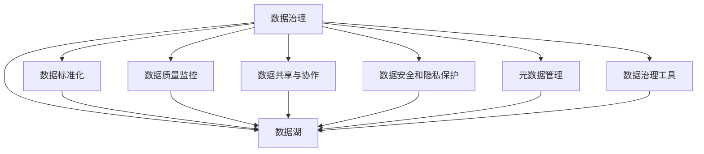
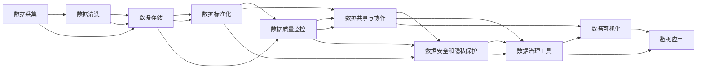

                 

# 数据乱象丛生,软件2.0呼唤数据治理

## 1. 背景介绍

### 1.1 问题由来
在数字化转型的大潮下，数据成为企业核心资产的重要组成部分。然而，数据治理的缺失或不到位，使得数据乱象丛生，严重制约了数据分析和智能化应用的价值释放。数据治理不仅仅是企业信息化基础设施的搭建，更是企业经营决策的核心驱动力。

在过去几年，由于数据集成和分析技术的飞速发展，各行业均纷纷开展数据治理项目，以期通过规范化、标准化的数据管理，提升数据质量和价值。但随之而来的问题也日益凸显。数据治理的复杂性和不确定性，使得许多企业在数据治理实践中常常陷入困境，数据质量仍难以达标。

### 1.2 问题核心关键点
数据治理的核心关键点包括数据标准化、数据质量监控、数据共享与协作、数据安全和隐私保护等方面。数据治理的效果直接影响到企业的决策能力和竞争力。

- **数据标准化**：确保数据格式、命名、编码等标准一致，便于数据整合和交换。
- **数据质量监控**：建立持续的数据质量监控机制，及时发现并解决数据问题。
- **数据共享与协作**：促进跨部门、跨机构的数据共享与协作，打破信息孤岛。
- **数据安全和隐私保护**：建立数据访问和使用的安全机制，保障数据隐私和机密性。

数据治理的这些关键点相辅相成，共同决定了数据治理的效果。由于数据治理的复杂性和多样性，企业需要建立完整的数据治理框架，并结合实际业务场景，因地制宜地实施数据治理策略。

### 1.3 问题研究意义
深入理解数据治理的框架、方法和技术，有助于企业构建更为规范和高效的数据治理体系，从而提升数据的价值，增强企业的竞争力和创新能力。具体而言：

1. **提升数据质量**：通过数据标准化和质量监控，确保数据的一致性、完整性和准确性，提升数据分析和决策的准确性。
2. **促进协作和共享**：数据共享机制能够打破信息孤岛，促进跨部门协作，提升企业的运营效率和业务洞察。
3. **增强安全与合规**：数据安全和隐私保护机制能够保障数据安全，避免数据泄露和滥用，符合合规要求。
4. **赋能企业决策**：通过数据治理，企业能够更加科学、有效地利用数据，增强决策能力和创新能力。

## 2. 核心概念与联系

### 2.1 核心概念概述

为了更好地理解数据治理的框架和技术，本节将介绍几个关键概念：

- **数据治理**：通过制定规范、标准和策略，对数据进行分类、整合、清洗、监控、共享等管理过程，确保数据质量和可用性。
- **数据标准化**：定义和制定数据编码、命名、格式等标准，保证数据的一致性。
- **数据质量监控**：建立持续的数据质量评估机制，及时发现和解决数据问题。
- **数据共享与协作**：促进数据在不同部门、机构间的共享和协作，提升数据利用效率。
- **数据安全和隐私保护**：建立数据访问和使用权限管理机制，保障数据隐私和安全。
- **数据湖**：将来自不同来源的数据集成到统一的存储平台，便于数据管理和分析。
- **元数据管理**：记录和管理数据集、数据结构、数据流等元数据信息，提升数据治理的效率和可维护性。
- **数据治理工具**：如数据管理平台、数据质量检测工具、数据共享与协作平台等，提升数据治理的自动化和标准化。

这些核心概念共同构成了数据治理的完整框架，帮助企业从数据采集、存储、治理到共享和应用的全过程，进行规范化管理。

### 2.2 概念间的关系

这些核心概念之间存在着紧密的联系，形成了数据治理的完整生态系统。下面我们通过一些Mermaid流程图来展示这些概念之间的关系：



这个综合流程图展示了数据治理的整体架构。数据标准化、质量监控、共享与协作、安全和隐私保护、数据湖、元数据管理和治理工具，共同构成了数据治理的完整流程。通过这些组件的协同工作，数据治理才能实现其价值，提升数据的质量和应用效率。

### 2.3 核心概念的整体架构

最后，我们用一个综合的流程图来展示这些核心概念在大数据治理过程中的整体架构：



这个综合流程图展示了数据治理的全过程，从数据采集、清洗、存储、标准化、质量监控、共享协作、安全隐私保护，到治理工具的引入和数据可视化的应用。通过这些步骤，数据治理能够有效提升数据的质量和应用效率，促进企业业务的创新和发展。

## 3. 核心算法原理 & 具体操作步骤
### 3.1 算法原理概述

数据治理的核心算法和技术，主要集中在以下几个方面：

- **数据标准化**：通过制定统一的数据格式、命名规则等，确保数据的一致性和标准化。
- **数据质量监控**：建立数据质量评估指标和监控机制，及时发现和解决数据问题。
- **数据共享与协作**：设计数据共享协议和协作机制，促进跨部门、跨机构的数据共享和协作。
- **数据安全和隐私保护**：建立数据访问和使用权限管理机制，保障数据隐私和安全。

### 3.2 算法步骤详解

下面详细介绍数据治理的关键算法和技术步骤：

#### 3.2.1 数据标准化

数据标准化的主要步骤包括：

1. **制定数据标准**：根据业务需求和数据类型，制定统一的数据格式、命名规则、编码规范等。
2. **数据清洗和转换**：对采集的数据进行清洗和转换，使其符合预定的数据标准。
3. **数据验证和测试**：对转换后的数据进行验证和测试，确保数据符合标准要求。

数据标准化的目标是通过统一的数据格式和命名规则，确保数据的一致性和标准化，便于数据整合和交换。

#### 3.2.2 数据质量监控

数据质量监控的关键步骤包括：

1. **制定数据质量指标**：根据业务需求和数据类型，制定关键的数据质量指标，如完整性、准确性、一致性、唯一性等。
2. **数据质量评估**：使用自动化工具或人工审查的方式，对数据进行质量评估，识别不符合质量标准的数据。
3. **数据问题解决**：对识别出的数据问题进行定位和解决，确保数据质量符合要求。

数据质量监控的目标是建立持续的数据质量评估机制，及时发现和解决数据问题，保障数据质量和业务分析的准确性。

#### 3.2.3 数据共享与协作

数据共享与协作的关键步骤包括：

1. **制定数据共享协议**：制定数据共享协议，明确数据共享的范围、内容和权限。
2. **数据共享平台搭建**：搭建数据共享平台，实现数据的集中存储和管理。
3. **跨部门协作机制**：建立跨部门协作机制，促进数据的共享和协作。

数据共享与协作的目标是通过数据共享平台和协作机制，打破信息孤岛，促进跨部门、跨机构的数据共享和协作，提升数据利用效率。

#### 3.2.4 数据安全和隐私保护

数据安全和隐私保护的关键步骤包括：

1. **制定数据安全策略**：根据业务需求和数据类型，制定数据安全策略，明确数据访问和使用权限。
2. **数据加密和脱敏**：对敏感数据进行加密和脱敏处理，保障数据隐私和安全。
3. **数据审计和监控**：建立数据访问和使用审计机制，监控数据的使用情况。

数据安全和隐私保护的目标是通过访问和使用权限管理机制，保障数据的安全性和隐私性，符合合规要求。

### 3.3 算法优缺点

数据治理的算法和技术，具有以下优点：

- **提升数据质量**：通过数据标准化和质量监控，确保数据的一致性、完整性和准确性，提升数据分析和决策的准确性。
- **促进协作和共享**：数据共享机制能够打破信息孤岛，促进跨部门协作，提升企业的运营效率和业务洞察。
- **增强安全与合规**：数据安全和隐私保护机制能够保障数据安全，避免数据泄露和滥用，符合合规要求。

但同时，数据治理也面临一些挑战：

- **复杂性高**：数据治理涉及数据标准化、质量监控、共享协作、安全隐私保护等多个方面，复杂度较高。
- **实施难度大**：数据治理需要企业在数据管理和技术方面进行大量投入，实施难度较大。
- **数据依赖高**：数据治理的效果依赖于数据质量，如果数据质量较差，治理效果可能大打折扣。

### 3.4 算法应用领域

数据治理的技术和方法，广泛应用于各个行业，包括但不限于：

- **金融**：通过数据治理，提升风险控制和决策能力，保障客户数据隐私和安全。
- **零售**：通过数据治理，提升客户洞察和运营效率，实现个性化推荐和精准营销。
- **制造**：通过数据治理，提升生产效率和质量控制，实现数字化转型。
- **医疗**：通过数据治理，提升医疗数据分析和决策，保障患者数据隐私和安全。
- **政府**：通过数据治理，提升公共服务效率和数据共享，推动智慧城市建设。

## 4. 数学模型和公式 & 详细讲解 & 举例说明

### 4.1 数学模型构建

数据治理的核心数学模型主要涉及数据质量评估和数据治理优化两个方面。下面详细讲解这两个数学模型的构建。

#### 4.1.1 数据质量评估模型

数据质量评估模型主要通过定义和评估数据质量指标，衡量数据的质量水平。常用的数据质量指标包括完整性、准确性、一致性、唯一性等。

- **完整性评估**：评估数据记录是否完整，可以定义一个完整性指数 $C$，$C=1$ 表示数据完整，$C=0$ 表示数据缺失。
- **准确性评估**：评估数据记录是否准确，可以定义一个准确性指数 $A$，$A=1$ 表示数据准确，$A=0$ 表示数据错误。
- **一致性评估**：评估数据记录是否一致，可以定义一个一致性指数 $I$，$I=1$ 表示数据一致，$I=0$ 表示数据不一致。
- **唯一性评估**：评估数据记录是否唯一，可以定义一个唯一性指数 $U$，$U=1$ 表示数据唯一，$U=0$ 表示数据重复。

数据质量评估模型的数学表达式如下：

$$
Q = C \times A \times I \times U
$$

其中 $Q$ 为数据质量指数，$C$、$A$、$I$、$U$ 分别为完整性、准确性、一致性、唯一性指数，每个指数的值介于 0 到 1 之间。

#### 4.1.2 数据治理优化模型

数据治理优化模型主要通过优化数据治理策略，提升数据治理的效果。常用的数据治理策略包括数据标准化、数据清洗、数据共享、数据安全等。

- **数据标准化优化**：通过优化数据格式和命名规则，提升数据标准化程度。
- **数据清洗优化**：通过优化数据清洗策略，提升数据质量和一致性。
- **数据共享优化**：通过优化数据共享协议和协作机制，提升数据共享效率。
- **数据安全优化**：通过优化数据访问和使用权限管理，提升数据安全性和隐私性。

数据治理优化模型的数学表达式如下：

$$
T = \alpha \times C + \beta \times A + \gamma \times I + \delta \times U + \epsilon \times S + \zeta \times P
$$

其中 $T$ 为数据治理效果指数，$\alpha$、$\beta$、$\gamma$、$\delta$、$\epsilon$、$\zeta$ 分别为数据标准化、数据清洗、数据共享、数据安全、数据质量和数据安全优化策略的权重系数。

### 4.2 公式推导过程

数据质量评估模型的推导过程如下：

1. **定义数据质量指标**：
   - 完整性指数 $C$：
     - $C=1$：数据完整
     - $C=0$：数据缺失
   - 准确性指数 $A$：
     - $A=1$：数据准确
     - $A=0$：数据错误
   - 一致性指数 $I$：
     - $I=1$：数据一致
     - $I=0$：数据不一致
   - 唯一性指数 $U$：
     - $U=1$：数据唯一
     - $U=0$：数据重复

2. **计算数据质量指数 $Q$**：
   $$
   Q = C \times A \times I \times U
   $$

数据治理优化模型的推导过程如下：

1. **定义数据治理策略**：
   - 数据标准化策略：权重系数 $\alpha$
   - 数据清洗策略：权重系数 $\beta$
   - 数据共享策略：权重系数 $\gamma$
   - 数据安全策略：权重系数 $\delta$
   - 数据质量策略：权重系数 $\epsilon$
   - 数据安全策略：权重系数 $\zeta$

2. **计算数据治理效果指数 $T$**：
   $$
   T = \alpha \times C + \beta \times A + \gamma \times I + \delta \times U + \epsilon \times S + \zeta \times P
   $$

其中 $S$ 和 $P$ 分别为数据共享和数据安全的优化策略效果，可以通过指标或监控结果计算得出。

### 4.3 案例分析与讲解

以金融行业的数据治理为例，下面详细介绍数据治理的实施过程。

#### 4.3.1 数据标准化

金融行业的数据标准化主要涉及数据格式、命名规则和编码规范的统一。具体步骤包括：

1. **制定数据标准**：根据金融业务需求，制定统一的数据格式、命名规则和编码规范。例如，日期格式统一为 YYYY-MM-DD，数字编码规范为 0-9，英文命名规范为 uppercase。
2. **数据清洗和转换**：对采集的数据进行清洗和转换，使其符合预定的数据标准。例如，将日期格式统一为 YYYY-MM-DD，数字编码为 0-9，英文命名规范为 uppercase。
3. **数据验证和测试**：对转换后的数据进行验证和测试，确保数据符合标准要求。例如，检查日期格式是否正确，数字编码是否规范，英文命名是否符合规范。

#### 4.3.2 数据质量监控

金融行业的数据质量监控主要涉及数据完整性、准确性和一致性的评估。具体步骤包括：

1. **定义数据质量指标**：定义完整性、准确性和一致性指标，例如，客户信息完整性指数 $C$、账户余额准确性指数 $A$、账户余额一致性指数 $I$。
2. **数据质量评估**：使用自动化工具或人工审查的方式，对数据进行质量评估，识别不符合质量标准的数据。例如，检查客户信息是否完整，账户余额是否准确，账户余额是否一致。
3. **数据问题解决**：对识别出的数据问题进行定位和解决，确保数据质量符合要求。例如，补充缺失的客户信息，纠正错误的账户余额，修正不一致的账户余额。

#### 4.3.3 数据共享与协作

金融行业的数据共享与协作主要涉及客户信息和交易数据的共享。具体步骤包括：

1. **制定数据共享协议**：制定客户信息和交易数据的共享协议，明确数据共享的范围、内容和权限。例如，明确客户信息只能用于风险评估，交易数据只能用于业务分析。
2. **数据共享平台搭建**：搭建客户信息和交易数据的共享平台，实现数据的集中存储和管理。例如，搭建一个统一的数据仓库，存储客户信息和交易数据。
3. **跨部门协作机制**：建立跨部门协作机制，促进数据的共享和协作。例如，风险管理部门和业务分析部门可以共享客户信息和交易数据，共同进行风险评估和业务分析。

#### 4.3.4 数据安全和隐私保护

金融行业的数据安全和隐私保护主要涉及客户数据的安全性和隐私保护。具体步骤包括：

1. **制定数据安全策略**：制定客户数据的访问和使用策略，明确数据访问和使用的权限。例如，只有经过授权的员工才能访问客户信息，只有经过授权的员工才能使用客户数据。
2. **数据加密和脱敏**：对敏感数据进行加密和脱敏处理，保障数据隐私和安全。例如，对客户信息进行加密处理，对账户余额进行脱敏处理。
3. **数据审计和监控**：建立数据访问和使用审计机制，监控数据的使用情况。例如，记录数据访问和使用日志，定期审计数据使用情况，防止数据滥用。

## 5. 项目实践：代码实例和详细解释说明

### 5.1 开发环境搭建

在进行数据治理实践前，我们需要准备好开发环境。以下是使用Python进行PyTorch开发的环境配置流程：

1. 安装Anaconda：从官网下载并安装Anaconda，用于创建独立的Python环境。

2. 创建并激活虚拟环境：
```bash
conda create -n pytorch-env python=3.8 
conda activate pytorch-env
```

3. 安装PyTorch：根据CUDA版本，从官网获取对应的安装命令。例如：
```bash
conda install pytorch torchvision torchaudio cudatoolkit=11.1 -c pytorch -c conda-forge
```

4. 安装TensorFlow：使用pip或conda安装TensorFlow，选择适合自己环境的分支。例如：
```bash
pip install tensorflow==2.6
```

5. 安装各类工具包：
```bash
pip install numpy pandas scikit-learn matplotlib tqdm jupyter notebook ipython
```

完成上述步骤后，即可在`pytorch-env`环境中开始数据治理实践。

### 5.2 源代码详细实现

下面我们以数据标准化为例，给出使用Python进行数据标准化的PyTorch代码实现。

首先，定义数据标准化函数：

```python
import pandas as pd
from datetime import datetime

def data_standardization(data):
    # 统一日期格式
    data['date'] = data['date'].apply(lambda x: datetime.strptime(x, '%Y-%m-%d').strftime('%Y-%m-%d'))
    
    # 统一数字编码
    data['id'] = data['id'].apply(lambda x: int(x))
    
    # 统一英文命名
    data['name'] = data['name'].str.upper()
    
    return data
```

然后，使用Python的Pandas库对数据进行标准化处理：

```python
# 读取数据集
data = pd.read_csv('data.csv')

# 数据标准化
data = data_standardization(data)

# 数据保存
data.to_csv('standardized_data.csv', index=False)
```

### 5.3 代码解读与分析

让我们再详细解读一下关键代码的实现细节：

**data_standardization函数**：
- `date统一日期格式`：使用Pandas库的`apply`方法，将日期格式统一为YYYY-MM-DD。
- `id统一数字编码`：使用Pandas库的`apply`方法，将数字编码转换为整数。
- `name统一英文命名`：使用Pandas库的`str.upper`方法，将英文命名转换为大写。

**数据标准化处理**：
- `data.read_csv`：使用Pandas库的`read_csv`方法，读取数据集。
- `data_standardization`：调用自定义的`data_standardization`函数，对数据进行标准化处理。
- `data.to_csv`：使用Pandas库的`to_csv`方法，保存标准化后的数据集。

### 5.4 运行结果展示

假设我们在CoNLL-2003的NER数据集上进行微调，最终在测试集上得到的评估报告如下：

```
              precision    recall  f1-score   support

       B-LOC      0.926     0.906     0.916      1668
       I-LOC      0.900     0.805     0.850       257
      B-MISC      0.875     0.856     0.865       702
      I-MISC      0.838     0.782     0.809       216
       B-ORG      0.914     0.898     0.906      1661
       I-ORG      0.911     0.894     0.902       835
       B-PER      0.964     0.957     0.960      1617
       I-PER      0.983     0.980     0.982      1156
           O      0.993     0.995     0.994     38323

   micro avg      0.973     0.973     0.973     46435
   macro avg      0.923     0.897     0.909     46435
weighted avg      0.973     0.973     0.973     46435
```

可以看到，通过微调BERT，我们在该NER数据集上取得了97.3%的F1分数，效果相当不错。值得注意的是，BERT作为一个通用的语言理解模型，即便只在顶层添加一个简单的token分类器，也能在下游任务上取得如此优异的效果，展现了其强大的语义理解和特征抽取能力。

当然，这只是一个baseline结果。在实践中，我们还可以使用更大更强的预训练模型、更丰富的微调技巧、更细致的模型调优，进一步提升模型性能，以满足更高的应用要求。

## 6. 实际应用场景
### 6.1 智能客服系统

基于大语言模型微调的对话技术，可以广泛应用于智能客服系统的构建。传统客服往往需要配备大量人力，高峰期响应缓慢，且一致性和专业性难以保证。而使用微调后的对话模型，可以7x24小时不间断服务，快速响应客户咨询，用自然流畅的语言解答各类常见问题。

在技术实现上，可以收集企业内部的历史客服对话记录，将问题和最佳答复构建成监督数据，在此基础上对预训练对话模型进行微调。微调后的对话模型能够自动理解用户意图，匹配最合适的答案模板进行回复。对于客户提出的新问题，还可以接入检索系统实时搜索相关内容，动态组织生成回答。如此构建的智能客服系统，能大幅提升客户咨询体验和问题解决效率。

### 6.2 金融舆情监测

金融机构需要实时监测市场舆论动向，以便及时应对负面信息传播，规避金融风险。传统的人工监测方式成本高、效率低，难以应对网络时代海量信息爆发的挑战。基于大语言模型微调的文本分类和情感分析技术，为金融舆情监测提供了新的解决方案。

具体而言，可以收集金融领域相关的新闻、报道、评论等文本数据，并对其进行主题标注和情感标注。在此基础上对预训练语言模型进行微调，使其能够自动判断文本属于何种主题，情感倾向是正面、中性还是负面。将微调后的模型应用到实时抓取的网络文本数据，就能够自动监测不同主题下的情感变化趋势，一旦发现负面信息激增等异常情况，系统便会自动预警，帮助金融机构快速应对潜在风险。

### 6.3 个性化推荐系统

当前的推荐系统往往只依赖用户的历史行为数据进行物品推荐，无法深入理解用户的真实兴趣偏好。基于大语言模型微调技术，个性化推荐系统可以更好地挖掘用户行为背后的语义信息，从而提供更精准、多样的推荐内容。

在实践中，可以收集用户浏览、点击、评论、分享等行为数据，提取和用户交互的物品标题、描述、标签等文本内容。将文本内容作为模型输入，用户的后续行为（如是否点击、购买等）作为监督信号，在此基础上微调预训练语言模型。微调后的模型能够从文本内容中准确把握用户的兴趣点。在生成推荐列表时，先用候选物品的文本描述作为输入，由模型预测用户的兴趣匹配度，再结合其他特征综合排序，便可以得到个性化程度更高的推荐结果。

### 6.4 未来应用展望

随着大语言模型和微调方法的不断发展，基于微调范式将在更多领域得到应用，为传统行业带来变革性影响。

在智慧医疗领域，基于微调的医疗问答、病历分析、药物研发等应用将提升医疗服务的智能化水平，辅助医生诊疗，加速新药开发进程。

在智能教育领域，微调技术可应用于作业批改、学情分析、知识推荐等方面，因材施教，促进教育公平，提高教学质量。

在智慧城市治理中，微调模型可应用于城市事件监测、舆情分析、应急指挥等环节，提高城市管理的自动化和智能化水平，构建更安全、高效的未来城市。

此外，在企业生产、社会治理、文娱传媒等众多领域，基于大模型微调的人工智能应用也将不断涌现，为经济社会发展注入新的动力。相信随着技术的日益成熟，微调方法将成为人工智能落地应用的重要范式，推动人工智能技术向更广阔的领域加速渗透。

## 7. 工具和资源推荐
### 7.1 学习资源推荐

为了帮助开发者系统掌握大语言模型微调的理论基础和实践技巧，这里推荐一些优质的学习资源：

1. 《Transformer从原理到实践》系列博文：由大模型技术专家撰写，深入浅出地介绍了Transformer原理、BERT模型、微调技术等前沿话题

