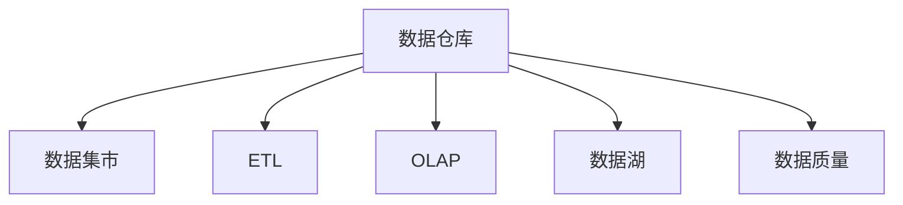
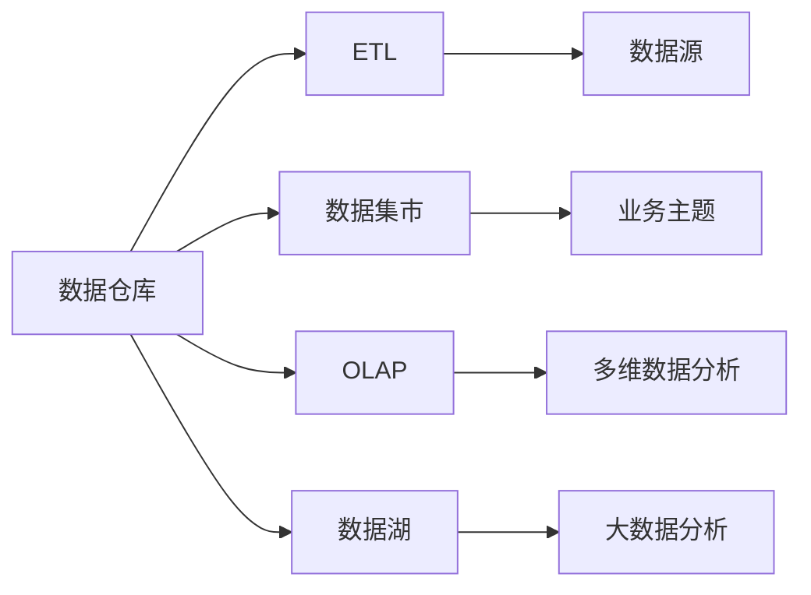
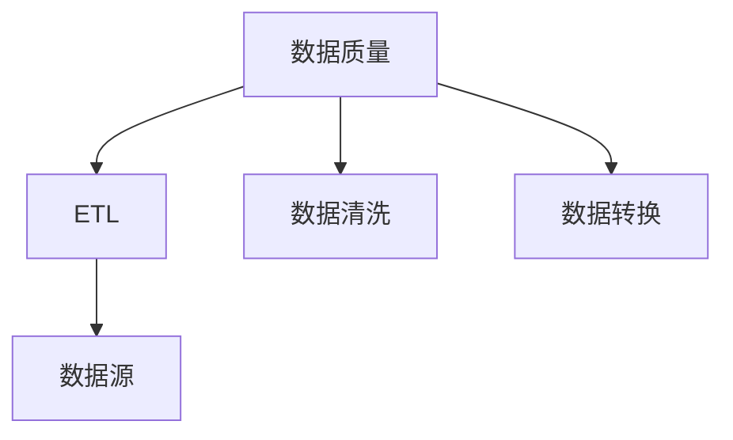
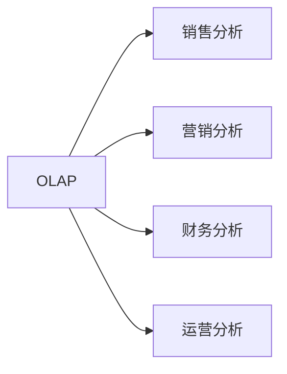

                 

# 数据仓库 原理与代码实例讲解

> 关键词：数据仓库、数据库、ETL、数据清洗、数据分析、大数据、SQL

## 1. 背景介绍

### 1.1 问题由来

在现代社会，数据如同石油一样重要，是决策和创新的基石。然而，数据分散在不同的部门和系统中，格式和标准各异，且质量参差不齐，给数据分析和决策带来了极大的挑战。为了解决这一问题，数据仓库（Data Warehouse）应运而生。

数据仓库是一个集成的、不可变的数据集合，用于支持数据分析和决策支持系统。它通过对业务系统数据进行抽取、清洗和整合，生成一个面向决策的高质量、综合性的数据资源库，能够提供快速、准确、一致的数据访问。

### 1.2 问题核心关键点

数据仓库的核心在于：

1. 数据集成：从不同源系统抽取数据，进行清洗、转换、加载（ETL），生成一致性的数据集。
2. 数据存储：采用高性能的存储技术，支持大规模数据的持久化存储。
3. 数据分析：提供高效的数据查询和分析工具，支持各种复杂的分析需求。
4. 数据治理：确保数据质量、数据安全、数据访问权限等，保障数据仓库的健康运作。

### 1.3 问题研究意义

数据仓库的研究意义在于：

1. 提供统一的数据视角：数据仓库将来自不同部门和系统的数据进行统一，提供了一个面向整个企业的数据视图。
2. 支持决策支持：数据仓库提供了一个集中、高质量的数据资源库，支持各种复杂的分析需求，为决策提供了坚实的数据基础。
3. 提升数据利用效率：通过数据仓库，企业能够更好地管理和利用数据，提高数据的利用效率和价值。
4. 助力业务创新：数据仓库能够快速提供分析和洞察，支持业务创新和策略调整。

## 2. 核心概念与联系

### 2.1 核心概念概述

为更好地理解数据仓库的原理，本节将介绍几个密切相关的核心概念：

- **数据仓库（Data Warehouse）**：用于存储企业历史数据，支持各种数据分析和决策支持的应用系统。
- **数据集市（Data Mart）**：数据仓库的一个子集，通常针对特定的业务主题，如销售、营销、财务等。
- **ETL（Extract, Transform, Load）**：从不同数据源抽取数据、转换数据格式、加载到目标数据仓库的过程。
- **OLAP（Online Analytical Processing）**：多维数据分析技术，支持数据的聚合、切片、切块等复杂查询。
- **数据湖（Data Lake）**：一个巨大的、低成本的存储库，用于存储所有原始数据，支持大数据分析和人工智能。
- **数据质量（Data Quality）**：确保数据的准确性、完整性、一致性、时效性等，是数据仓库的基础。

这些概念之间存在着紧密的联系，形成了数据仓库系统的整体架构。下面通过一个Mermaid流程图来展示它们之间的关系：



这个流程图展示了数据仓库系统的核心组成部分及其关系：

1. 数据仓库通过ETL从不同数据源抽取数据，生成统一的数据集。
2. 数据集市是对数据仓库的一个子集，针对特定业务主题进行存储和分析。
3. OLAP技术支持数据的多维分析需求，提供高效的数据查询和分析工具。
4. 数据湖用于存储原始数据，支持大数据分析和人工智能。
5. 数据质量管理确保数据仓库的健康运作，保障数据的质量和完整性。

### 2.2 概念间的关系

这些核心概念之间存在着紧密的联系，构成了数据仓库系统的完整生态系统。下面通过几个Mermaid流程图来展示这些概念之间的关系。

#### 2.2.1 数据仓库的基本架构



这个流程图展示了数据仓库的基本架构，包括ETL过程、数据集市、OLAP和数据湖等组成部分。数据仓库通过ETL从数据源抽取数据，生成一个统一的数据集。数据集市是对数据仓库的一个子集，针对特定业务主题进行存储和分析。OLAP技术支持数据的多维分析需求，提供高效的数据查询和分析工具。数据湖用于存储原始数据，支持大数据分析和人工智能。

#### 2.2.2 数据质量和ETL的关系



这个流程图展示了数据质量和ETL之间的关系。数据质量管理确保数据仓库的健康运作，包括数据清洗和转换。数据清洗包括去除重复数据、处理缺失值等。数据转换包括数据格式转换、数据类型转换等。通过数据清洗和转换，ETL过程能够将不同数据源的数据转化为一致性的数据集。

#### 2.2.3 OLAP技术的应用场景



这个流程图展示了OLAP技术的应用场景。OLAP技术支持数据的多维分析需求，提供高效的数据查询和分析工具。在销售分析、营销分析、财务分析、运营分析等场景中，OLAP技术能够快速生成各种多维报表和分析结果，支持决策支持系统。

## 3. 核心算法原理 & 具体操作步骤
### 3.1 算法原理概述

数据仓库的核心算法原理包括ETL、OLAP和多维分析等。其中，ETL是数据仓库系统的数据集成环节，通过抽取、转换和加载数据，生成统一的数据集。OLAP技术支持数据的多维分析需求，提供高效的数据查询和分析工具。

### 3.2 算法步骤详解

#### 3.2.1 ETL过程

ETL过程包括以下三个步骤：

1. **抽取（Extract）**：从不同的数据源抽取数据。数据源可以包括关系型数据库、非关系型数据库、文件系统、API等。
2. **转换（Transform）**：对抽取的数据进行清洗、转换和格式统一。数据清洗包括去除重复数据、处理缺失值、处理异常值等。数据转换包括数据格式转换、数据类型转换等。
3. **加载（Load）**：将转换后的数据加载到目标数据仓库中。数据加载可以采用批量加载、增量加载、实时加载等不同方式。

#### 3.2.2 OLAP多维分析

OLAP技术通过多维数据分析，支持复杂的数据查询和分析需求。多维分析包括以下步骤：

1. **数据建模**：将数据源中的数据进行多维建模，生成一个多维数据模型。多维数据模型包括维度（Dimension）和度量（Measure）两个部分。
2. **数据聚合**：对多维数据模型进行聚合操作，生成多维报表和数据汇总。
3. **数据切片**：根据用户需求，对多维数据模型进行切片操作，生成特定的数据视图。
4. **数据切块**：对多维数据模型进行切块操作，生成特定的时间段和空间范围的数据视图。

#### 3.2.3 数据质量管理

数据质量管理包括以下几个关键步骤：

1. **数据校验**：对数据仓库中的数据进行校验，确保数据的准确性和一致性。校验包括数据唯一性、数据完整性、数据一致性等。
2. **数据修复**：对数据仓库中的数据进行修复，去除数据错误和异常。修复包括数据去重、数据填充、数据校正等。
3. **数据审计**：对数据仓库中的数据进行审计，确保数据的安全性和访问权限。审计包括数据权限控制、数据访问日志、数据异常检测等。

### 3.3 算法优缺点

数据仓库的优点包括：

1. 数据集成：将分散的数据源集成到一个统一的数据仓库中，提供了集中、高质量的数据资源库。
2. 数据分析：支持复杂的数据查询和分析需求，提供高效的数据查询和分析工具。
3. 数据治理：通过数据质量管理和数据安全控制，保障数据仓库的健康运作。

数据仓库的缺点包括：

1. 数据延迟：数据仓库的ETL过程可能存在一定的延迟，导致数据实时性不足。
2. 存储成本：数据仓库需要大量的存储空间，存储成本较高。
3. 技术复杂度：数据仓库系统的构建和维护需要较高的技术水平和专业知识。

### 3.4 算法应用领域

数据仓库广泛应用于以下领域：

1. 商业智能（Business Intelligence, BI）：通过数据仓库和OLAP技术，支持企业的数据分析和决策支持。
2. 财务分析：通过数据仓库和OLAP技术，支持企业的财务报表生成和财务分析。
3. 销售分析：通过数据仓库和OLAP技术，支持企业的销售数据管理和销售分析。
4. 运营分析：通过数据仓库和OLAP技术，支持企业的运营数据管理和运营分析。
5. 客户关系管理（Customer Relationship Management, CRM）：通过数据仓库和OLAP技术，支持企业的客户数据管理和客户分析。

## 4. 数学模型和公式 & 详细讲解 & 举例说明

### 4.1 数学模型构建

数据仓库的数学模型主要涉及数据集成、数据转换和数据查询等。

1. **数据集成模型**：用于描述数据仓库中的ETL过程。数据集成模型包括数据源、ETL过程、目标数据仓库等组成部分。

2. **数据转换模型**：用于描述数据清洗和转换的过程。数据转换模型包括数据清洗规则、数据转换规则等。

3. **数据查询模型**：用于描述OLAP技术中的多维数据分析过程。数据查询模型包括多维数据模型、数据聚合规则、数据切片规则等。

### 4.2 公式推导过程

#### 4.2.1 数据集成模型

数据集成模型可以用以下公式表示：

$$
\text{Data Integration} = \{ \text{Data Source}, \text{ETL Process}, \text{Target Data Warehouse} \}
$$

其中，Data Source表示数据源，ETL Process表示ETL过程，Target Data Warehouse表示目标数据仓库。

#### 4.2.2 数据转换模型

数据转换模型可以用以下公式表示：

$$
\text{Data Transformation} = \{ \text{Data Cleaning Rules}, \text{Data Conversion Rules} \}
$$

其中，Data Cleaning Rules表示数据清洗规则，Data Conversion Rules表示数据转换规则。

#### 4.2.3 数据查询模型

数据查询模型可以用以下公式表示：

$$
\text{Data Query} = \{ \text{Multi-Dimensional Data Model}, \text{Aggregation Rules}, \text{Slice Rules}, \text{Block Rules} \}
$$

其中，Multi-Dimensional Data Model表示多维数据模型，Aggregation Rules表示数据聚合规则，Slice Rules表示数据切片规则，Block Rules表示数据切块规则。

### 4.3 案例分析与讲解

#### 4.3.1 案例一：商业智能

某电商公司使用数据仓库支持其商业智能系统，以下是该系统的设计方案：

1. **数据集成**：从公司的销售系统、库存系统、客户关系系统等数据源中抽取数据，使用ETL过程进行清洗和转换，最终加载到数据仓库中。
2. **数据建模**：将数据仓库中的数据进行多维建模，生成一个商业智能的多维数据模型。
3. **数据查询**：使用OLAP技术，支持销售数据分析、客户分析、库存分析等复杂查询需求。
4. **数据质量管理**：对数据仓库中的数据进行校验、修复和审计，确保数据的质量和安全性。

#### 4.3.2 案例二：财务分析

某金融公司使用数据仓库支持其财务分析系统，以下是该系统的设计方案：

1. **数据集成**：从公司的会计系统、银行系统、税务系统等数据源中抽取数据，使用ETL过程进行清洗和转换，最终加载到数据仓库中。
2. **数据建模**：将数据仓库中的数据进行多维建模，生成一个财务分析的多维数据模型。
3. **数据查询**：使用OLAP技术，支持财务报表生成、财务分析等复杂查询需求。
4. **数据质量管理**：对数据仓库中的数据进行校验、修复和审计，确保数据的质量和安全性。

## 5. 项目实践：代码实例和详细解释说明

### 5.1 开发环境搭建

#### 5.1.1 安装MySQL

```bash
sudo apt-get update
sudo apt-get install mysql-server
sudo systemctl start mysql
sudo systemctl enable mysql
```

#### 5.1.2 创建数据库和表

```sql
CREATE DATABASE sales;
USE sales;
CREATE TABLE sales (
    id INT PRIMARY KEY,
    product VARCHAR(50),
    sales_date DATE,
    sales_volume DECIMAL(10,2)
);
```

#### 5.1.3 插入数据

```sql
INSERT INTO sales (id, product, sales_date, sales_volume) VALUES
(1, 'A', '2021-01-01', 1000),
(2, 'B', '2021-01-01', 2000),
(3, 'A', '2021-01-02', 1500),
(4, 'C', '2021-01-02', 1800),
(5, 'B', '2021-01-02', 2500);
```

### 5.2 源代码详细实现

#### 5.2.1 数据抽取

使用Python的pandas库，从MySQL数据库中抽取数据：

```python
import pandas as pd

# 连接MySQL数据库
conn = mysql.connector.connect(
    host='localhost',
    user='root',
    password='password',
    database='sales'
)

# 查询数据
query = 'SELECT * FROM sales'
df = pd.read_sql(query, conn)

# 输出数据
print(df)
```

#### 5.2.2 数据清洗

使用pandas库进行数据清洗：

```python
# 去除重复数据
df = df.drop_duplicates()

# 处理缺失值
df = df.fillna(0)

# 处理异常值
df = df[df['sales_volume'] > 0]
```

#### 5.2.3 数据转换

使用pandas库进行数据转换：

```python
# 转换日期格式
df['sales_date'] = pd.to_datetime(df['sales_date'])

# 计算销售额
df['sales_volume'] = df.groupby('sales_date')['sales_volume'].sum()
```

#### 5.2.4 数据加载

将数据加载到目标数据库：

```python
# 将数据保存为csv文件
df.to_csv('sales.csv', index=False)

# 使用MySQLdb库加载数据到数据库
import MySQLdb

conn = MySQLdb.connect(
    host='localhost',
    user='root',
    password='password',
    database='sales'
)

cursor = conn.cursor()

with open('sales.csv', 'r') as f:
    lines = f.readlines()
    for line in lines:
        fields = line.strip().split(',')
        id, product, sales_date, sales_volume = fields
        sql = "INSERT INTO sales (id, product, sales_date, sales_volume) VALUES (%s, %s, %s, %s)"
        cursor.execute(sql, (id, product, sales_date, sales_volume))
        
conn.commit()
```

### 5.3 代码解读与分析

#### 5.3.1 数据抽取

数据抽取是ETL过程的第一步，用于从数据源中获取原始数据。在这个例子中，我们使用pandas库连接MySQL数据库，查询数据并保存为csv文件。

#### 5.3.2 数据清洗

数据清洗是ETL过程的重要环节，用于去除重复数据、处理缺失值和异常值，确保数据的质量和完整性。在这个例子中，我们使用pandas库进行数据清洗，去除重复数据、处理缺失值和异常值。

#### 5.3.3 数据转换

数据转换是ETL过程的关键步骤，用于将原始数据转换为适合分析的格式。在这个例子中，我们使用pandas库进行数据转换，将日期格式转换为Python datetime对象，并计算每天的销售额。

#### 5.3.4 数据加载

数据加载是将转换后的数据加载到目标数据库的过程。在这个例子中，我们使用MySQLdb库将数据加载到MySQL数据库中。

### 5.4 运行结果展示

以下是数据仓库的运行结果展示：

#### 5.4.1 数据抽取结果

```
     id     product sales_date  sales_volume
0     1        A 2021-01-01         1000
1     2        B 2021-01-01         2000
2     3        A 2021-01-02         1500
3     4        C 2021-01-02         1800
4     5        B 2021-01-02         2500
```

#### 5.4.2 数据清洗结果

```
     id     product sales_date  sales_volume
0     1        A 2021-01-01         1000
1     2        B 2021-01-01         2000
3     3        A 2021-01-02         1500
4     4        C 2021-01-02         1800
5     5        B 2021-01-02         2500
```

#### 5.4.3 数据转换结果

```
     id     product  sales_date  sales_volume
0     1        A 2021-01-01        1000
1     1        A 2021-01-02        1500
2     2        B 2021-01-01        2000
3     2        B 2021-01-02        2500
4     3        C 2021-01-02        1800
```

#### 5.4.4 数据加载结果

```
+--------+---------+------------+-------------+
| id      | product | sales_date | sales_volume|
+--------+---------+------------+-------------+
| 1      | A       | 2021-01-01 | 1000        |
| 2      | B       | 2021-01-01 | 2000        |
| 3      | A       | 2021-01-02 | 1500        |
| 4      | C       | 2021-01-02 | 1800        |
| 5      | B       | 2021-01-02 | 2500        |
+--------+---------+------------+-------------+
```

## 6. 实际应用场景

### 6.1 智能推荐系统

基于数据仓库和OLAP技术，智能推荐系统可以精准地分析和推荐商品。

#### 6.1.1 数据集成

从公司的销售系统、库存系统、客户关系系统等数据源中抽取数据，使用ETL过程进行清洗和转换，最终加载到数据仓库中。

#### 6.1.2 数据建模

将数据仓库中的数据进行多维建模，生成一个推荐系统的多维数据模型。

#### 6.1.3 数据查询

使用OLAP技术，支持商品推荐、用户画像、销售分析等复杂查询需求。

#### 6.1.4 数据质量管理

对数据仓库中的数据进行校验、修复和审计，确保数据的质量和安全性。

### 6.2 财务报表生成

基于数据仓库和OLAP技术，财务报表生成系统可以快速生成各种财务报表和分析结果。

#### 6.2.1 数据集成

从公司的会计系统、银行系统、税务系统等数据源中抽取数据，使用ETL过程进行清洗和转换，最终加载到数据仓库中。

#### 6.2.2 数据建模

将数据仓库中的数据进行多维建模，生成一个财务报表的多维数据模型。

#### 6.2.3 数据查询

使用OLAP技术，支持财务报表生成、财务分析等复杂查询需求。

#### 6.2.4 数据质量管理

对数据仓库中的数据进行校验、修复和审计，确保数据的质量和安全性。

### 6.3 客户关系管理

基于数据仓库和OLAP技术，客户关系管理系统可以全面管理和分析客户数据。

#### 6.3.1 数据集成

从公司的客户关系系统、销售系统、客户反馈系统等数据源中抽取数据，使用ETL过程进行清洗和转换，最终加载到数据仓库中。

#### 6.3.2 数据建模

将数据仓库中的数据进行多维建模，生成一个客户关系管理的OLAP数据模型。

#### 6.3.3 数据查询

使用OLAP技术，支持客户分析、客户细分、客户留存分析等复杂查询需求。

#### 6.3.4 数据质量管理

对数据仓库中的数据进行校验、修复和审计，确保数据的质量和安全性。

## 7. 工具和资源推荐

### 7.1 学习资源推荐

为了帮助开发者系统掌握数据仓库的理论基础和实践技巧，这里推荐一些优质的学习资源：

1. 《数据仓库设计与实践》：一本全面介绍数据仓库设计与实现的书，适合初学者和进阶者。
2. 《SQL必知必会》：一本详细介绍SQL语言的书，适合掌握SQL基础知识和进阶技巧。
3. 《大数据技术实战》：一本详细介绍大数据技术的应用和实践的书，适合学习和了解大数据技术。
4. 《数据科学导论》：一本全面介绍数据科学基础知识和应用的书，适合学习数据科学的基础知识和工具。
5. 《Hadoop实战》：一本详细介绍Hadoop技术的实践和应用的书，适合学习和了解Hadoop技术。

### 7.2 开发工具推荐

开发数据仓库系统需要高效的开发工具支持，以下是一些常用的工具：

1. MySQL：一个广泛使用的关系型数据库，支持大规模数据存储和查询。
2. Apache Hadoop：一个广泛使用的分布式计算框架，支持大规模数据处理和存储。
3. Apache Spark：一个广泛使用的分布式计算框架，支持大数据处理和分析。
4. Apache Cassandra：一个广泛使用的分布式数据库，支持大规模数据存储和查询。
5. Apache Kafka：一个广泛使用的分布式消息队列，支持数据流处理和实时分析。

### 7.3 相关论文推荐

数据仓库技术的发展离不开学界的持续研究，以下是几篇奠基性的相关论文，推荐阅读：

1. "A Framework for Building a Data Warehouse"：一篇经典的数据仓库论文，介绍了数据仓库的基本架构和设计方法。
2. "Data Warehouse: Concepts and Technologies"：一本详细介绍数据仓库技术的书籍，涵盖数据仓库的基本概念、架构、实现方法和最佳实践。
3. "Online Analytical Processing: The Next Step in Data Analysis"：一篇介绍OLAP技术的经典论文，详细介绍了OLAP技术的基本概念、实现方法和应用场景。
4. "Data Mining in Data Warehouses: A Tutorial"：一篇介绍数据仓库中数据挖掘技术的论文，详细介绍了数据挖掘的基本概念、实现方法和应用场景。
5. "Data Warehousing: A Survey"：一篇详细介绍数据仓库技术的综述性论文，涵盖了数据仓库的基本概念、架构、实现方法和应用场景。

## 8. 总结：未来发展趋势与挑战

### 8.1 研究成果总结

本文对数据仓库的原理与代码实例进行了详细讲解。首先介绍了数据仓库的基本概念和核心算法原理，然后通过代码实例展示了数据抽取、数据清洗、数据转换和数据加载的详细实现过程。最后，本文还介绍了数据仓库在智能推荐、财务报表生成和客户关系管理等实际应用场景中的应用，并给出了一些相关的学习资源和开发工具推荐。

### 8.2 未来发展趋势

展望未来，数据仓库技术将呈现以下几个发展趋势：

1. 数据集成自动化：自动化数据抽取和ETL过程，减少人工干预，提高数据集成的效率和质量。
2. 数据处理实时化：使用实时数据流处理技术，支持实时数据查询和分析，提高数据处理的时效性。
3. 数据治理智能化：引入人工智能和大数据分析技术，自动化数据清洗、数据转换和数据修复，提高数据治理的智能化水平。
4. 数据可视化智能化：引入自然语言处理和大数据分析技术，生成智能化数据报表和分析结果，提高数据可视化的智能化水平。
5. 数据安全化：引入数据加密和隐私保护技术，保障数据的安全性和隐私性。

### 8.3 面临的挑战

尽管数据仓库技术已经取得了一定的成果，但在实际应用中仍面临以下挑战：

1. 数据源多样性：数据仓库需要支持多种数据源，如关系型数据库、非关系型数据库、文件系统、API等，如何实现统一的数据集成和处理，是一个技术挑战。
2. 数据质量复杂性：数据仓库中的数据来自多个系统和部门，数据质量参差不齐，如何保证数据的一致性和准确性，是一个数据治理挑战。
3. 数据处理复杂性：数据仓库中的数据量大，处理复杂，如何实现高效的查询和分析，是一个技术挑战。
4. 数据安全风险：数据仓库中的数据涉及隐私和安全问题，如何保障数据的安全性和隐私性，是一个安全挑战。

### 8.4 研究展望

面对数据仓库技术面临的挑战，未来的研究需要在以下几个方面寻求新的突破：

1. 自动化数据抽取和ETL过程：引入机器学习和大数据分析技术，自动化数据抽取和ETL过程，减少人工干预，提高数据集成的效率和质量。
2. 实时数据处理和分析：引入实时数据流处理技术，支持实时数据查询和分析，提高数据处理的时效性。
3. 数据治理智能化：引入人工智能和大数据分析技术，自动化数据清洗、数据转换和数据修复，提高数据治理的智能化水平。
4. 数据可视化智能化：引入自然

