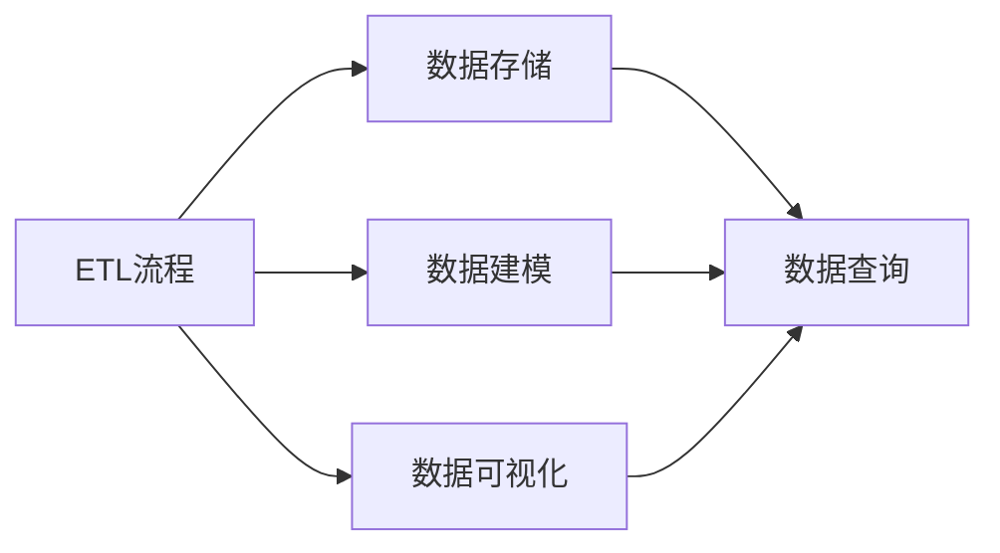
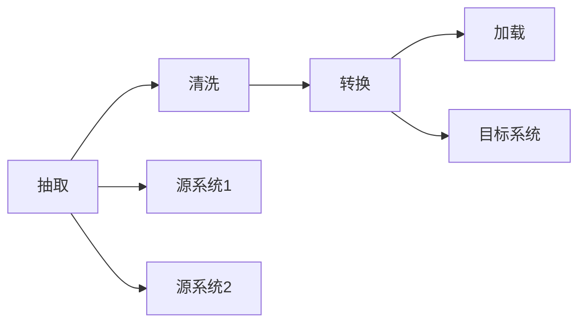
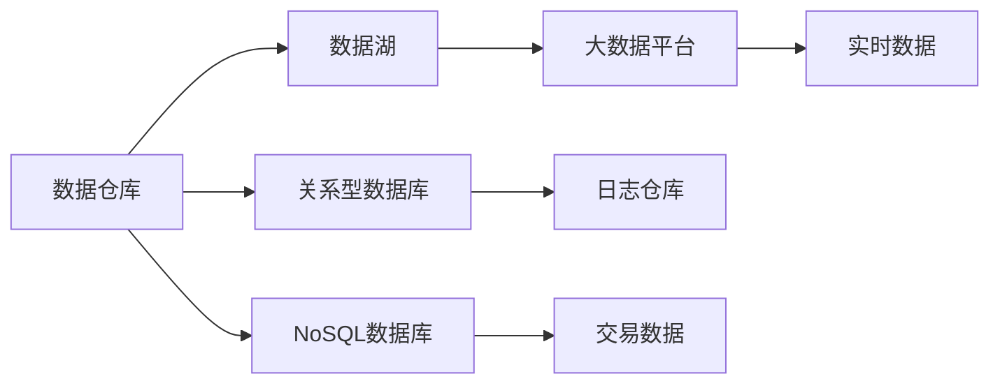
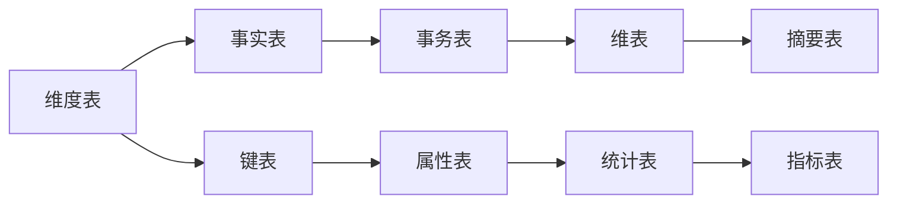
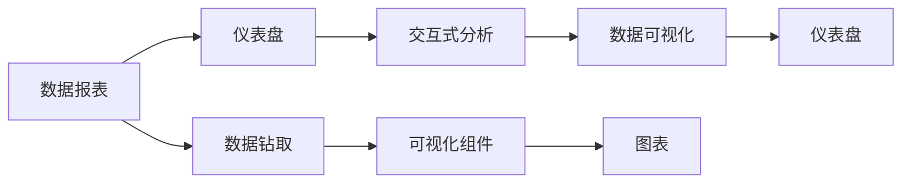
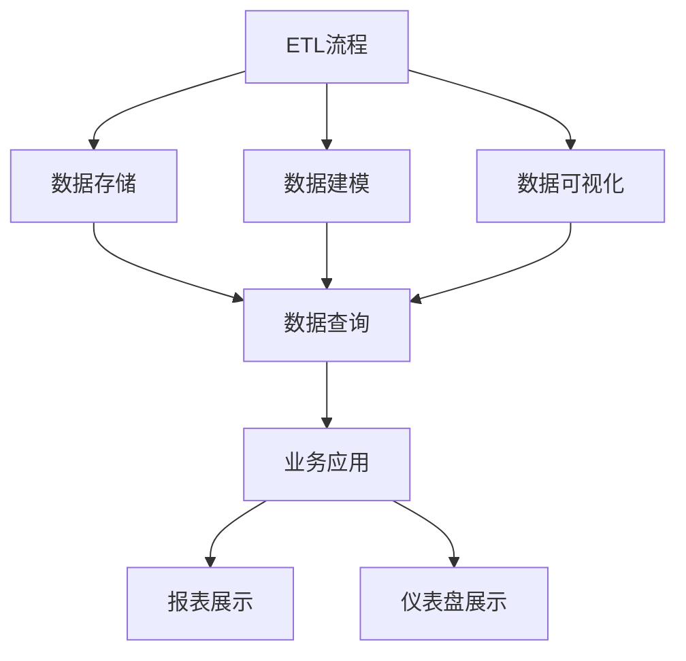

                 

# 数据仓库 原理与代码实例讲解

> 关键词：数据仓库,ETL,SQL,数据建模,数据可视化,Apache Hive,Apache Spark

## 1. 背景介绍

### 1.1 问题由来

数据仓库作为一种高效的数据管理和分析平台，已经成为现代企业中不可或缺的基础设施。随着大数据时代的到来，企业对于数据的存储和分析需求日益增长，如何构建高效、稳定、可扩展的数据仓库，成为数据工作者的一个重要课题。

数据仓库的建设不仅仅是技术层面的问题，更涉及到业务理解、数据治理、系统架构等诸多方面。从技术角度来看，数据仓库主要包含以下几个核心组件：

1. **ETL流程**：负责从源系统抽取数据、转换和加载到目标系统中。
2. **数据存储**：提供高效、可靠的数据存储能力，支持大规模数据存储和检索。
3. **数据建模**：构建合理的数据模型，确保数据的一致性和完整性。
4. **数据可视化**：提供直观、易用的数据展示工具，支持数据驱动的决策支持。

本博客将从技术角度深入探讨数据仓库的原理和实现，并结合实际案例，讲解数据仓库的搭建和优化。

### 1.2 问题核心关键点

数据仓库的核心关键点在于如何高效、稳定、可靠地构建和维护数据仓库。这涉及到以下几个方面：

1. **数据抽取**：如何从源系统中高效抽取数据，确保数据的完整性和准确性。
2. **数据转换**：如何对抽取的数据进行清洗、转换，去除冗余和错误数据。
3. **数据加载**：如何将处理后的数据加载到目标系统中，确保数据的一致性和完整性。
4. **数据存储**：如何设计高效的数据存储架构，支持大规模数据的存储和检索。
5. **数据建模**：如何构建合理的数据模型，支持高效的数据查询和分析。
6. **数据可视化**：如何构建直观、易用的数据展示工具，支持数据驱动的决策支持。

本文将详细介绍这些核心关键点的原理和实现，并通过实际案例展示数据仓库的搭建和优化过程。

### 1.3 问题研究意义

研究数据仓库的原理和实现，对于提升企业的数据管理和分析能力，推动业务决策的科学化、精准化具有重要意义：

1. **提升数据治理水平**：构建统一、规范的数据仓库，有助于提升数据的质量和治理水平。
2. **加速数据驱动决策**：通过高效的数据存储和分析，加速数据驱动的决策过程，提升企业竞争力。
3. **支撑业务创新**：数据仓库能够为业务创新提供数据支持和分析能力，推动企业持续发展。
4. **优化资源配置**：通过数据驱动的资源配置，提升企业运营效率和盈利能力。

数据仓库作为企业数字化转型的关键基础设施，其建设质量直接关系到企业的数字化转型效果。因此，深入理解数据仓库的原理和实现，对于数据工作者和IT从业人员具有重要的指导意义。

## 2. 核心概念与联系

### 2.1 核心概念概述

数据仓库的建设涉及多个核心概念，包括ETL流程、数据存储、数据建模、数据可视化等。这些概念之间存在着紧密的联系，共同构成了数据仓库的整体框架。

- **ETL流程**：负责从源系统抽取数据、转换和加载到目标系统中，是数据仓库建设的核心环节。
- **数据存储**：提供高效、可靠的数据存储能力，支持大规模数据存储和检索。
- **数据建模**：构建合理的数据模型，确保数据的一致性和完整性。
- **数据可视化**：提供直观、易用的数据展示工具，支持数据驱动的决策支持。

这些概念之间的联系可以通过以下Mermaid流程图来展示：



这个流程图展示了ETL流程、数据存储、数据建模和数据可视化之间的关系：

1. 数据仓库的建设始于ETL流程，从源系统抽取、转换和加载数据到目标系统中。
2. 数据存储为数据仓库提供高效、可靠的数据存储能力，支持大规模数据的存储和检索。
3. 数据建模构建合理的数据模型，确保数据的一致性和完整性。
4. 数据可视化提供直观、易用的数据展示工具，支持数据驱动的决策支持。

这些核心概念共同构成了数据仓库的整体框架，使得企业能够高效、稳定地管理和分析数据，支撑业务决策。

### 2.2 概念间的关系

这些核心概念之间存在着紧密的联系，形成了数据仓库的完整生态系统。下面我们通过几个Mermaid流程图来展示这些概念之间的关系。

#### 2.2.1 ETL流程的详细设计



这个流程图展示了ETL流程的详细设计过程：

1. 数据抽取：从源系统1和源系统2中抽取数据。
2. 数据清洗：对抽取的数据进行清洗、转换，去除冗余和错误数据。
3. 数据加载：将处理后的数据加载到目标系统中，确保数据的一致性和完整性。

#### 2.2.2 数据存储的架构设计



这个流程图展示了数据存储的架构设计：

1. 数据仓库：提供高效、可靠的数据存储能力，支持大规模数据的存储和检索。
2. 数据湖：存储海量原始数据，支持大规模数据的存储和检索。
3. 关系型数据库：存储结构化数据，支持高效的数据查询和分析。
4. NoSQL数据库：存储非结构化数据，支持高效的数据存储和检索。
5. 大数据平台：提供分布式计算和存储能力，支持大规模数据的处理和分析。

#### 2.2.3 数据建模的模型设计



这个流程图展示了数据建模的模型设计：

1. 维度表：存储多维度的数据，支持高效的数据查询和分析。
2. 事实表：存储业务事实，支持高效的数据查询和分析。
3. 键表：存储主键和外键，确保数据的一致性和完整性。
4. 事务表：存储事务记录，支持高效的数据查询和分析。
5. 属性表：存储属性信息，支持高效的数据查询和分析。
6. 维表：存储维度信息，支持高效的数据查询和分析。
7. 统计表：存储统计信息，支持高效的数据查询和分析。
8. 摘要表：存储摘要信息，支持高效的数据查询和分析。
9. 指标表：存储指标信息，支持高效的数据查询和分析。

#### 2.2.4 数据可视化的展示设计



这个流程图展示了数据可视化的展示设计：

1. 数据报表：提供结构化的数据展示，支持数据分析和决策支持。
2. 仪表盘：提供直观、易用的数据展示工具，支持数据驱动的决策支持。
3. 数据钻取：支持用户对数据进行多维度的查询和分析。
4. 可视化组件：提供丰富的图表和可视化工具，支持用户自定义展示。
5. 交互式分析：提供交互式的分析工具，支持用户对数据进行深入分析。

### 2.3 核心概念的整体架构

最后，我们用一个综合的流程图来展示这些核心概念在大数据仓库中的整体架构：



这个综合流程图展示了从ETL流程、数据存储、数据建模到数据可视化的完整过程：

1. 数据仓库的建设始于ETL流程，从源系统抽取、转换和加载数据到目标系统中。
2. 数据存储为数据仓库提供高效、可靠的数据存储能力，支持大规模数据的存储和检索。
3. 数据建模构建合理的数据模型，确保数据的一致性和完整性。
4. 数据可视化提供直观、易用的数据展示工具，支持数据驱动的决策支持。

这些概念共同构成了数据仓库的整体框架，使得企业能够高效、稳定地管理和分析数据，支撑业务决策。

## 3. 核心算法原理 & 具体操作步骤
### 3.1 算法原理概述

数据仓库的建设涉及多个核心算法，包括ETL流程、数据存储、数据建模、数据可视化等。这些算法共同构成了数据仓库的完整体系，使得企业能够高效、稳定地管理和分析数据。

### 3.2 算法步骤详解

#### 3.2.1 ETL流程

1. **数据抽取**：从源系统抽取数据。抽取的方式包括定时任务、事件触发、API接口等，确保数据的完整性和准确性。
2. **数据转换**：对抽取的数据进行清洗、转换，去除冗余和错误数据。转换的方式包括数据去重、数据标准化、数据类型转换等。
3. **数据加载**：将处理后的数据加载到目标系统中，确保数据的一致性和完整性。加载的方式包括批量加载、增量加载、实时加载等。

#### 3.2.2 数据存储

1. **数据仓库**：提供高效、可靠的数据存储能力，支持大规模数据的存储和检索。数据仓库的设计需要考虑数据分布、存储引擎、数据一致性等方面。
2. **数据湖**：存储海量原始数据，支持大规模数据的存储和检索。数据湖的设计需要考虑数据分布、存储引擎、数据一致性等方面。
3. **关系型数据库**：存储结构化数据，支持高效的数据查询和分析。关系型数据库的设计需要考虑数据模型、索引、事务管理等方面。
4. **NoSQL数据库**：存储非结构化数据，支持高效的数据存储和检索。NoSQL数据库的设计需要考虑数据模型、索引、事务管理等方面。
5. **大数据平台**：提供分布式计算和存储能力，支持大规模数据的处理和分析。大数据平台的设计需要考虑数据分布、计算引擎、数据一致性等方面。

#### 3.2.3 数据建模

1. **维度表**：存储多维度的数据，支持高效的数据查询和分析。维度表的设计需要考虑维度定义、维度聚合、维度关系等方面。
2. **事实表**：存储业务事实，支持高效的数据查询和分析。事实表的设计需要考虑业务事实定义、事实关系、事实关联等方面。
3. **键表**：存储主键和外键，确保数据的一致性和完整性。键表的设计需要考虑主键定义、外键定义、键关系等方面。
4. **事务表**：存储事务记录，支持高效的数据查询和分析。事务表的设计需要考虑事务关系、事务处理、事务关联等方面。
5. **属性表**：存储属性信息，支持高效的数据查询和分析。属性表的设计需要考虑属性定义、属性关系、属性关联等方面。
6. **维表**：存储维度信息，支持高效的数据查询和分析。维表的设计需要考虑维度定义、维度聚合、维度关系等方面。
7. **统计表**：存储统计信息，支持高效的数据查询和分析。统计表的设计需要考虑统计定义、统计关系、统计关联等方面。
8. **摘要表**：存储摘要信息，支持高效的数据查询和分析。摘要表的设计需要考虑摘要定义、摘要关系、摘要关联等方面。
9. **指标表**：存储指标信息，支持高效的数据查询和分析。指标表的设计需要考虑指标定义、指标关系、指标关联等方面。

#### 3.2.4 数据可视化

1. **数据报表**：提供结构化的数据展示，支持数据分析和决策支持。数据报表的设计需要考虑数据展示、数据关联、数据计算等方面。
2. **仪表盘**：提供直观、易用的数据展示工具，支持数据驱动的决策支持。仪表盘的设计需要考虑数据展示、数据关联、数据计算等方面。
3. **数据钻取**：支持用户对数据进行多维度的查询和分析。数据钻取的设计需要考虑维度定义、维度关联、维度计算等方面。
4. **可视化组件**：提供丰富的图表和可视化工具，支持用户自定义展示。可视化组件的设计需要考虑图表类型、图表展示、图表关联等方面。
5. **交互式分析**：提供交互式的分析工具，支持用户对数据进行深入分析。交互式分析的设计需要考虑分析工具、分析关联、分析计算等方面。

### 3.3 算法优缺点

数据仓库的建设涉及多个核心算法，这些算法各自具有优缺点，共同构成了数据仓库的完整体系。

#### 3.3.1 数据抽取

1. **优点**：
   - 高效的数据抽取方式能够确保数据的完整性和准确性。
   - 定时任务和事件触发能够确保数据的及时性和稳定性。
   - API接口能够实现数据抽取的灵活性和可扩展性。

2. **缺点**：
   - 数据抽取的方式需要消耗大量计算资源，影响系统的性能。
   - 数据抽取的方式需要考虑数据格式的复杂性，增加了实现难度。
   - 数据抽取的方式需要考虑数据源的多样性，增加了实现难度。

#### 3.3.2 数据转换

1. **优点**：
   - 数据转换能够确保数据的完整性和一致性。
   - 数据转换能够去除冗余和错误数据，提高数据质量。
   - 数据转换能够实现数据的规范化，提高数据的可维护性。

2. **缺点**：
   - 数据转换的方式需要消耗大量计算资源，影响系统的性能。
   - 数据转换的方式需要考虑数据格式的多样性，增加了实现难度。
   - 数据转换的方式需要考虑数据源的多样性，增加了实现难度。

#### 3.3.3 数据加载

1. **优点**：
   - 高效的数据加载方式能够确保数据的一致性和完整性。
   - 批量加载和增量加载能够实现数据的快速加载和更新。
   - 实时加载能够实现数据的即时更新和分析。

2. **缺点**：
   - 数据加载的方式需要消耗大量计算资源，影响系统的性能。
   - 数据加载的方式需要考虑数据源的多样性，增加了实现难度。
   - 数据加载的方式需要考虑数据格式的复杂性，增加了实现难度。

### 3.4 算法应用领域

数据仓库的建设涉及多个核心算法，这些算法广泛应用于多个领域，涵盖企业数据管理、业务决策支持、数据分析等多个方面。

#### 3.4.1 企业数据管理

数据仓库的建设能够提升企业的数据治理水平，确保数据的一致性和完整性。通过数据仓库，企业可以实现数据的统一管理和规范化，避免数据冗余和数据不一致的问题，提升数据质量。

#### 3.4.2 业务决策支持

数据仓库的建设能够提供高效的数据存储和分析能力，支撑业务决策的科学化和精准化。通过数据仓库，企业可以实现数据分析和业务建模，为业务决策提供数据支持和决策支持。

#### 3.4.3 数据分析

数据仓库的建设能够提供高效的数据查询和分析能力，支持数据驱动的决策支持。通过数据仓库，企业可以实现多维度的数据查询和分析，挖掘数据背后的业务洞察和趋势，推动业务创新和发展。

## 4. 数学模型和公式 & 详细讲解 & 举例说明

### 4.1 数学模型构建

本节将使用数学语言对数据仓库的构建过程进行更加严格的刻画。

记数据仓库为 $W$，其包含多个维度 $D_1, D_2, ..., D_n$ 和多个事实表 $F_1, F_2, ..., F_m$。维度 $D_i$ 包含 $K_i$ 个属性 $A_{ij} (1 \leq j \leq K_i)$，事实表 $F_j$ 包含 $K_j$ 个属性 $A_{ij} (1 \leq j \leq K_j)$。数据仓库的建模目标是最小化模型误差，即：

$$
\min_{\theta} \sum_{i=1}^n \sum_{j=1}^m \sum_{k=1}^{K_i} \sum_{l=1}^{K_j} |A_{ij} - A_{il}|^2
$$

其中 $\theta$ 为模型参数，$|.|$ 为绝对值函数，表示模型误差。

### 4.2 公式推导过程

为了求解上述优化问题，我们引入最小二乘法的思想，将误差函数转化为加权平方和的形式：

$$
\min_{\theta} \sum_{i=1}^n \sum_{j=1}^m \sum_{k=1}^{K_i} \sum_{l=1}^{K_j} \theta_{A_{ij}A_{il}}(A_{ij} - A_{il})^2
$$

其中 $\theta_{A_{ij}A_{il}}$ 为属性 $A_{ij}$ 和 $A_{il}$ 之间的协方差，表示属性之间的相关性。

根据梯度下降算法的原理，我们求出误差函数对模型参数 $\theta$ 的梯度：

$$
\nabla_{\theta} \min_{\theta} \sum_{i=1}^n \sum_{j=1}^m \sum_{k=1}^{K_i} \sum_{l=1}^{K_j} \theta_{A_{ij}A_{il}}(A_{ij} - A_{il})^2
$$

通过求解梯度，我们可以更新模型参数 $\theta$，使得模型误差最小化，从而构建出高效的数据仓库模型。

### 4.3 案例分析与讲解

以一个简单的销售数据分析为例，展示数据仓库的构建和分析过程。

假设企业销售数据包含多个维度，如时间、产品、地区、渠道等，以及多个事实表，如销售额、库存量、订单量等。数据仓库的建模过程如下：

1. **维度表设计**：
   - 时间维度：包含日期、时间段、月度等属性。
   - 产品维度：包含产品名称、产品类别、品牌等属性。
   - 地区维度：包含地区名称、省份、城市等属性。
   - 渠道维度：包含渠道名称、渠道类型、渠道级别等属性。

2. **事实表设计**：
   - 销售额事实表：包含销售额、日期、产品、地区、渠道等属性。
   - 库存量事实表：包含库存量、日期、产品、地区、渠道等属性。
   - 订单量事实表：包含订单量、日期、产品、地区、渠道等属性。

3. **数据模型构建**：
   - 时间维度：设计时间维度表，包含日期、时间段、月度等属性。
   - 产品维度：设计产品维度表，包含产品名称、产品类别、品牌等属性。
   - 地区维度：设计地区维度表，包含地区名称、省份、城市等属性。
   - 渠道维度：设计渠道维度表，包含渠道名称、渠道类型、渠道级别等属性。
   - 销售额事实表：设计销售额事实表，包含销售额、日期、产品、地区、渠道等属性。
   - 库存量事实表：设计库存量事实表，包含库存量、日期、产品、地区、渠道等属性。
   - 订单量事实表：设计订单量事实表，包含订单量、日期、产品、地区、渠道等属性。

4. **数据可视化展示**：
   - 仪表盘设计：设计仪表盘，展示销售数据分析结果，如销售额、库存量、订单量等。
   - 数据报表设计：设计数据报表，展示详细的数据分析结果，如时间、产品、地区、渠道等的分析结果。

通过上述建模和分析过程，企业可以高效、稳定地管理和分析销售数据，为业务决策提供数据支持和决策支持。

## 5. 项目实践：代码实例和详细解释说明

### 5.1 开发环境搭建

在进行数据仓库项目实践前，我们需要准备好开发环境。以下是使用Python进行Hive开发的开发环境配置流程：

1. 安装Anaconda：从官网下载并安装Anaconda，用于创建独立的Python环境。

2. 创建并激活虚拟环境：
```bash
conda create -n hive-env python=3.8 
conda activate hive-env
```

3. 安装Hive：
```bash
pip install pyspark
```

4. 安装Hive依赖包：
```bash
pip install hive-sync
```

5. 安装数据可视化工具：
```bash
pip install matplotlib
```

完成上述步骤后，即可在`hive-env`环境中开始Hive开发实践。

### 5.2 源代码详细实现

这里我们以Hive开发为例，展示数据仓库的构建和分析过程。

首先，创建一个Hive数据仓库项目，并定义数据表：

```hiveql
CREATE DATABASE sales;

USE sales;

CREATE TABLE time (
  date STRING,
  day DATE,
  month STRING
);

CREATE TABLE product (
  product_id INT,
  product_name STRING,
  product_category STRING
);

CREATE TABLE region (
  region_id INT,
  region_name STRING,
  province STRING
);

CREATE TABLE channel (
  channel_id INT,
  channel_name STRING,
  channel_type STRING
);

CREATE TABLE sales (
  sale_id INT,
  date DATE,
  product_id INT,
  region_id INT,
  channel_id INT,
  sales_amount FLOAT
);

CREATE TABLE inventory (
  inventory_id INT,
  date DATE,
  product_id INT,
  region_id INT,
  channel_id INT,
  inventory_amount FLOAT
);

CREATE TABLE orders (
  order_id INT,
  date DATE,
  product_id INT,
  region_id INT,
  channel_id INT,
  order_amount FLOAT
);
```

然后，使用Hive的SQL语言对数据进行查询和分析：

```hiveql
-- 查询销售额
SELECT product_id, sum(sales_amount) as total_sales
FROM sales
GROUP BY product_id;

-- 查询库存量
SELECT product_id, sum(inventory_amount) as total_inventory
FROM inventory
GROUP BY product_id;

-- 查询订单量
SELECT product_id, sum(order_amount) as total_orders
FROM orders
GROUP BY product_id;

-- 查询时间维度分析
SELECT month, sum(sales_amount) as total_sales
FROM sales
GROUP BY month;
```

最后，使用数据可视化工具对分析结果进行展示：

```python
import matplotlib.pyplot as plt

# 查询销售额
sales_query = "SELECT product_id, sum(sales_amount) as total_sales FROM sales GROUP BY product_id;"
sales_data = spark.sql(sales_query).collect()

# 查询库存量
inventory_query = "SELECT product_id, sum(inventory_amount) as total_inventory FROM inventory GROUP BY product_id;"
inventory_data = spark.sql(inventory_query).collect()

# 查询订单量
orders_query = "SELECT product_id, sum(order_amount) as total_orders FROM orders GROUP BY product_id;"
orders_data = spark.sql(orders_query).collect()

# 查询时间维度分析
time_query = "SELECT month, sum(sales_amount) as total_sales FROM sales GROUP BY month;"
time_data = spark.sql(time_query).collect()

# 可视化展示
plt.figure(figsize=(10, 6))
plt.plot([data['month'] for data in time_data], [data['total_sales'] for data in time_data])
plt.title('Sales Analysis by Month')
plt.xlabel('Month')
plt.ylabel('Total Sales')
plt.show()

plt.figure(figsize=(10, 6))
plt.plot([data['product_id'] for data in sales_data], [data['total_sales'] for data in sales_data])
plt.title('Sales Analysis by Product')
plt.xlabel('Product ID')
plt.ylabel('Total Sales')
plt.show()
```

以上就是使用Hive进行数据仓库构建和分析的完整代码实现。可以看到，Hive提供了丰富的SQL语言支持，可以方便地进行数据建模和分析。

### 5.3 代码解读与分析

让我们再详细解读一下关键代码的实现细节：

**数据表定义**：
- `CREATE TABLE`语句用于创建数据表，定义表的字段类型和属性。

**数据查询**：
- `SELECT`语句用于查询数据，并使用`GROUP BY`进行分组聚合计算。
- `SUM`函数用于计算销售金额、库存量、订单量等统计指标。

**数据可视化**：
- `matplotlib`库用于绘制图表，展示数据查询结果。
- 通过`plt.plot`函数，将数据绘制成折线图，并添加标题、坐标轴等元素。

**代码执行**：
- `spark.sql`方法用于执行SQL查询，将查询结果转换为Python列表。
- `collect`方法用于将查询结果从Spark上下文中提取出来，转换为Python列表。

**可视化展示**：
- `plt.figure`方法用于创建画布，设置画布大小。
- `plt.plot`方法用于绘制折线图，指定横轴、纵轴数据。
- `plt.title`方法用于添加图表标题。
- `plt.xlabel`和`plt.ylabel`方法用于添加坐标轴标签。
- `plt.show`方法用于

