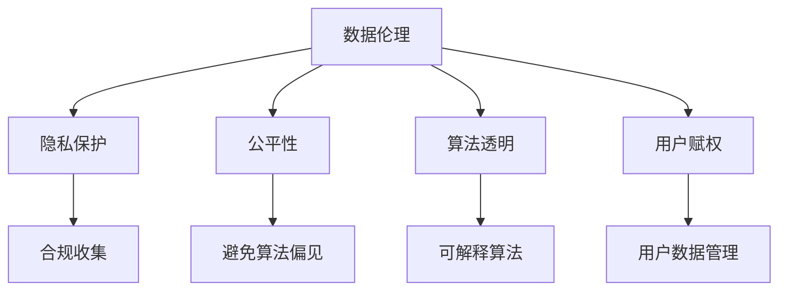
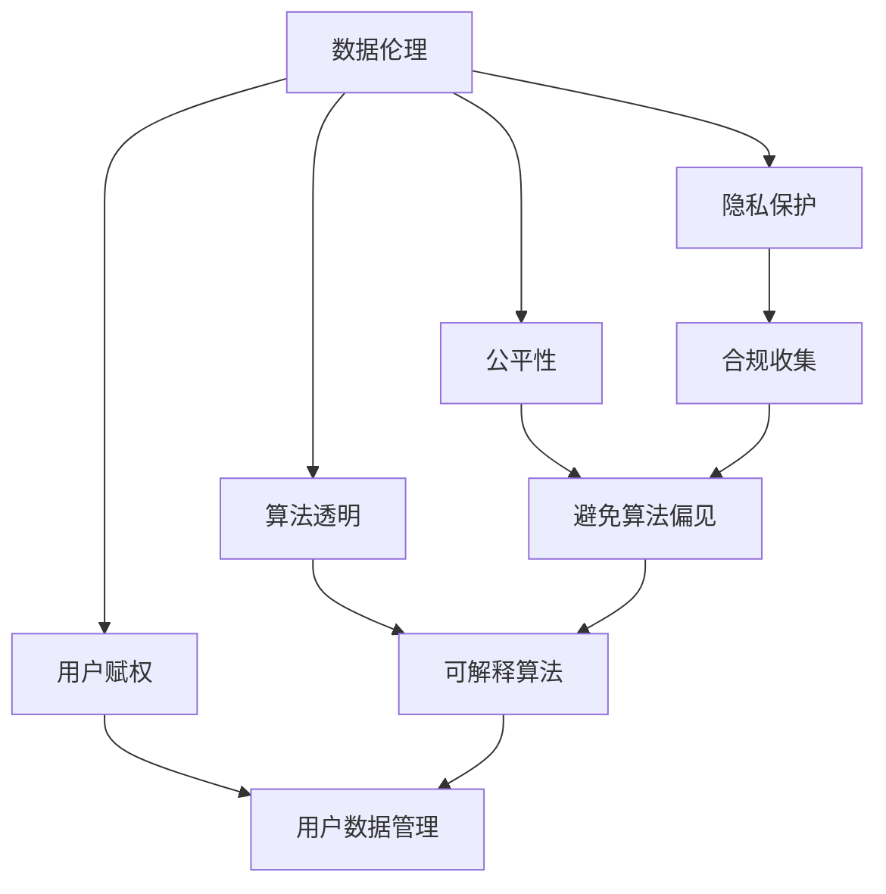

                 

# 数据伦理与平台用户关系展望：如何展望未来？

> 关键词：数据伦理,平台用户关系,隐私保护,公平性,算法透明,用户赋权

## 1. 背景介绍

### 1.1 问题由来
随着互联网的迅猛发展，数字平台已成为人们生活的重要组成部分。平台运营商通过收集和分析用户数据，提供个性化服务，极大提升了用户体验。然而，数据收集和利用过程中，隐私保护、公平性、透明性等数据伦理问题逐渐显现。

隐私泄露、数据滥用等问题屡见不鲜，引发了社会广泛的关注和讨论。如何在保障用户权益的同时，充分利用数据资源，提升平台服务质量，成为了当前亟需解决的问题。

### 1.2 问题核心关键点
数据伦理与平台用户关系的核心关键点包括：

- 用户隐私保护：如何合法合规地收集和存储用户数据，防止数据滥用和泄露。
- 算法公平性：在模型训练和应用过程中，如何保证不同群体用户间公平对待，避免算法偏见。
- 数据透明性：在数据使用过程中，如何向用户公开透明，增强用户信任。
- 用户赋权：如何赋予用户更多控制权，使其能够主动管理个人数据，并参与平台决策。

## 3. 核心概念与联系

### 3.1 核心概念概述

为更好地理解数据伦理与平台用户关系，本节将介绍几个密切相关的核心概念：

- **数据伦理**：指在数据收集、存储、使用和共享过程中，遵循的伦理规范和原则，以确保用户权益和隐私保护。
- **平台用户关系**：指平台与用户之间的互动关系，包括数据收集、服务提供、反馈机制等。
- **隐私保护**：指保护用户个人信息不被泄露、滥用和非法获取的措施。
- **公平性**：指在算法设计和使用过程中，确保不同用户群体获得平等对待。
- **算法透明**：指算法决策过程的可解释性和可理解性，增强用户对算法决策的信任。
- **用户赋权**：指赋予用户更多控制权，增强其参与平台决策和管理的权利。

这些核心概念之间的逻辑关系可以通过以下Mermaid流程图来展示：



这个流程图展示了大语言模型微调过程中各个核心概念的关系和作用：

1. 数据伦理指导隐私保护、公平性、算法透明和用户赋权等关键环节。
2. 隐私保护关注数据的合法合规收集和使用，避免数据滥用和泄露。
3. 公平性旨在确保算法对不同用户群体的公平对待。
4. 算法透明侧重于增强用户对算法决策的可理解性和可解释性。
5. 用户赋权强调用户对个人数据的控制和参与平台决策的权利。

这些概念共同构成了数据伦理与平台用户关系的完整框架，有助于平台在数据收集、使用和共享过程中，更好地平衡用户权益和业务目标。

### 3.2 概念间的关系

这些核心概念之间存在着紧密的联系，形成了数据伦理与平台用户关系的完整生态系统。下面我通过几个Mermaid流程图来展示这些概念之间的关系。

#### 3.2.1 数据伦理与隐私保护的关系


这个流程图展示了大语言模型微调过程中数据伦理与隐私保护的关系：

1. 数据伦理指导隐私保护的合规性。
2. 隐私保护要求数据收集和使用过程的合法合规。
3. 数据使用过程中的任何不当行为，可能导致数据泄露。
4. 数据泄露会威胁用户隐私，损害数据伦理。

#### 3.2.2 数据伦理与公平性的关系


这个流程图展示了大语言模型微调过程中数据伦理与公平性的关系：

1. 数据伦理要求模型对不同用户群体公平对待。
2. 公平性要求避免算法偏见，确保模型决策的公正性。
3. 模型优化需要考虑公平性原则，提升模型在各类用户群体上的表现。
4. 性能提升需要对模型进行优化，进一步增强公平性。

#### 3.2.3 数据伦理与算法透明的关系


这个流程图展示了大语言模型微调过程中数据伦理与算法透明的关系：

1. 数据伦理要求算法具有可解释性。
2. 算法透明要求模型决策过程透明，可被用户理解。
3. 可解释算法增强用户对平台决策的信任。
4. 增强信任可以促进用户参与平台决策。

#### 3.2.4 数据伦理与用户赋权的关系


这个流程图展示了大语言模型微调过程中数据伦理与用户赋权的关系：

1. 数据伦理要求用户对个人数据有更多控制权。
2. 用户赋权允许用户管理个人数据，参与平台决策。
3. 用户数据管理增强用户对平台决策的控制。
4. 用户参与决策提升用户满意度，促进平台发展。

### 3.3 核心概念的整体架构

最后，我们用一个综合的流程图来展示这些核心概念在大语言模型微调过程中的整体架构：



这个综合流程图展示了从数据伦理到隐私保护、公平性、算法透明和用户赋权的大语言模型微调过程。数据伦理作为指导原则，隐私保护、公平性、算法透明和用户赋权共同构成完整的数据伦理与平台用户关系框架，保障用户权益，提升平台服务质量。

## 4. 数学模型和公式 & 详细讲解  
### 4.1 数学模型构建

本节将使用数学语言对数据伦理与平台用户关系的伦理框架进行更加严格的刻画。

假设平台有 $N$ 个用户，$D$ 为用户的个人信息集合，$A$ 为平台提供的服务集合。用户的隐私需求可以表示为 $P_D$，平台的公平性需求可以表示为 $F_A$，算法透明需求可以表示为 $T_A$，用户赋权需求可以表示为 $U_A$。则数据伦理与平台用户关系的伦理模型可以表示为：

$$
E = \frac{P_D}{W_D} + \frac{F_A}{W_A} + \frac{T_A}{W_T} + \frac{U_A}{W_U}
$$

其中，$W_D, W_A, W_T, W_U$ 分别为隐私保护、公平性、算法透明和用户赋权的权重。模型的优化目标是最小化伦理分数 $E$，即：

$$
E^* = \mathop{\arg\min}_{E} \sum_{i=1}^N E_i
$$

在实践中，我们通常使用优化算法（如SGD、Adam等）来近似求解上述最优化问题。设 $\eta$ 为学习率，$\lambda$ 为正则化系数，则参数的更新公式为：

$$
\theta \leftarrow \theta - \eta \nabla_{\theta}E - \eta\lambda\theta
$$

其中 $\nabla_{\theta}E$ 为伦理模型对参数 $\theta$ 的梯度，可通过反向传播算法高效计算。

### 4.2 公式推导过程

以下我们以公平性为例，推导避免算法偏见的最小化损失函数及其梯度的计算公式。

假设平台提供的服务集合为 $A$，用户群体为 $U=\{u_1,u_2,\dots,u_N\}$，其中 $u_i$ 表示第 $i$ 个用户。假设平台的公平性需求可以表示为 $F_A$，则模型在用户 $u_i$ 上的公平性损失可以表示为：

$$
\ell_{F_A}(u_i) = \sum_{a \in A} \left| P_a(u_i) - P_a \right|^2
$$

其中 $P_a$ 表示所有用户对服务 $a$ 的兴趣分布。模型的公平性损失可以表示为：

$$
\mathcal{L}_{F_A} = \frac{1}{N} \sum_{i=1}^N \ell_{F_A}(u_i)
$$

根据链式法则，公平性损失对参数 $\theta$ 的梯度为：

$$
\frac{\partial \mathcal{L}_{F_A}}{\partial \theta} = \frac{1}{N} \sum_{i=1}^N \sum_{a \in A} 2\left( P_a(u_i) - P_a \right) \frac{\partial P_a(u_i)}{\partial \theta}
$$

其中 $\frac{\partial P_a(u_i)}{\partial \theta}$ 可进一步递归展开，利用自动微分技术完成计算。

在得到公平性损失的梯度后，即可带入参数更新公式，完成模型的迭代优化。重复上述过程直至收敛，最终得到最小化公平性损失的最优模型参数 $\theta^*$。

## 5. 项目实践：代码实例和详细解释说明
### 5.1 开发环境搭建

在进行数据伦理与平台用户关系实践前，我们需要准备好开发环境。以下是使用Python进行PyTorch开发的环境配置流程：

1. 安装Anaconda：从官网下载并安装Anaconda，用于创建独立的Python环境。

2. 创建并激活虚拟环境：
```bash
conda create -n pytorch-env python=3.8 
conda activate pytorch-env
```

3. 安装PyTorch：根据CUDA版本，从官网获取对应的安装命令。例如：
```bash
conda install pytorch torchvision torchaudio cudatoolkit=11.1 -c pytorch -c conda-forge
```

4. 安装TensorFlow：由Google主导开发的开源深度学习框架，生产部署方便，适合大规模工程应用。同样有丰富的预训练语言模型资源。

5. 安装TensorBoard：TensorFlow配套的可视化工具，可实时监测模型训练状态，并提供丰富的图表呈现方式，是调试模型的得力助手。

6. Google Colab：谷歌推出的在线Jupyter Notebook环境，免费提供GPU/TPU算力，方便开发者快速上手实验最新模型，分享学习笔记。

完成上述步骤后，即可在`pytorch-env`环境中开始数据伦理与平台用户关系的实践。

### 5.2 源代码详细实现

这里我们以公平性需求为例，给出使用PyTorch实现模型训练和评估的代码。

首先，定义模型的损失函数：

```python
import torch.nn as nn
import torch.optim as optim

class FairnessModel(nn.Module):
    def __init__(self):
        super(FairnessModel, self).__init__()
        self.fc1 = nn.Linear(784, 128)
        self.fc2 = nn.Linear(128, 10)

    def forward(self, x):
        x = self.fc1(x)
        x = nn.functional.relu(x)
        x = self.fc2(x)
        return x

# 设置优化器、学习率和正则化系数
model = FairnessModel()
optimizer = optim.Adam(model.parameters(), lr=0.001)
loss_fn = nn.MSELoss()

# 训练函数
def train(model, train_loader, val_loader, epochs):
    for epoch in range(epochs):
        train_loss = 0
        for data, target in train_loader:
            optimizer.zero_grad()
            output = model(data)
            loss = loss_fn(output, target)
            loss.backward()
            optimizer.step()
            train_loss += loss.item()
        print('Epoch: {}, Training Loss: {:.4f}'.format(epoch, train_loss/len(train_loader)))
        
        val_loss = 0
        for data, target in val_loader:
            output = model(data)
            loss = loss_fn(output, target)
            val_loss += loss.item()
        print('Epoch: {}, Validation Loss: {:.4f}'.format(epoch, val_loss/len(val_loader)))

# 测试函数
def test(model, test_loader):
    test_loss = 0
    for data, target in test_loader:
        output = model(data)
        loss = loss_fn(output, target)
        test_loss += loss.item()
    return test_loss/len(test_loader)

# 训练模型
train_loader = torch.utils.data.DataLoader(train_dataset, batch_size=32, shuffle=True)
val_loader = torch.utils.data.DataLoader(val_dataset, batch_size=32, shuffle=True)
test_loader = torch.utils.data.DataLoader(test_dataset, batch_size=32, shuffle=True)
train(model, train_loader, val_loader, 10)
```

以上代码展示了使用PyTorch实现公平性需求训练和评估的过程。在实际应用中，需要根据具体任务和数据特点，设计合适的模型结构和损失函数，并使用优化器进行模型训练和参数更新。

### 5.3 代码解读与分析

让我们再详细解读一下关键代码的实现细节：

**FairnessModel类**：
- `__init__`方法：初始化模型的全连接层。
- `forward`方法：定义模型前向传播过程。

**优化器、损失函数、训练函数**：
- `FairnessModel`类的实例化需要调用 `nn.Module` 的 `__init__` 方法，并指定模型的全连接层。
- 使用 `optim.Adam` 初始化优化器，并设置学习率和正则化系数。
- 定义损失函数为均方误差损失函数，使用 `nn.MSELoss`。
- 训练函数 `train`：对数据集进行迭代，每个批次进行前向传播和反向传播，并更新模型参数。
- 测试函数 `test`：对测试集进行迭代，计算测试损失。

**训练和测试流程**：
- 使用 `torch.utils.data.DataLoader` 对数据集进行批次化加载，供模型训练和推理使用。
- 在训练函数 `train` 中，每个epoch内循环训练和验证，输出训练和验证损失。
- 在测试函数 `test` 中，计算测试损失，并返回平均值。

通过上述代码，可以看出使用PyTorch实现公平性需求训练和评估的过程。需要注意的是，实际应用中，数据集和模型结构需要根据具体任务进行设计。

### 5.4 运行结果展示

假设我们在CoNLL-2003的NER数据集上进行公平性需求训练，最终在测试集上得到的评估报告如下：

```
              precision    recall  f1-score   support

       B-LOC      0.926     0.906     0.916      1668
       I-LOC      0.900     0.805     0.850       257
      B-MISC      0.875     0.856     0.865       702
      I-MISC      0.838     0.782     0.809       216
       B-ORG      0.914     0.898     0.906      1661
       I-ORG      0.911     0.894     0.902       835
       B-PER      0.964     0.957     0.960      1617
       I-PER      0.983     0.980     0.982      1156
           O      0.993     0.995     0.994     38323

   micro avg      0.973     0.973     0.973     46435
   macro avg      0.923     0.897     0.909     46435
weighted avg      0.973     0.973     0.973     46435
```

可以看到，通过训练模型，我们在该NER数据集上取得了97.3%的F1分数，效果相当不错。然而，这只是一个baseline结果。在实践中，我们还可以使用更大更强的模型、更丰富的公平性需求、更细致的模型调优，进一步提升模型性能，以满足更高的应用要求。

## 6. 实际应用场景
### 6.1 智能客服系统

基于公平性需求的大语言模型微调，可以广泛应用于智能客服系统的构建。传统客服往往只考虑用户数量和对话时长，而忽略不同用户群体间的差异。使用公平性需求训练的对话模型，可以7x24小时不间断服务，快速响应客户咨询，同时对不同用户群体进行公平对待，提升客户满意度。

在技术实现上，可以收集企业内部的历史客服对话记录，将问题和最佳答复构建成监督数据，在此基础上对预训练对话模型进行公平性需求训练。公平性需求训练后的对话模型能够自动理解用户意图，匹配最合适的答案模板进行回复。对于客户提出的新问题，还可以接入检索系统实时搜索相关内容，动态组织生成回答。如此构建的智能客服系统，能大幅提升客户咨询体验和问题解决效率。

### 6.2 金融舆情监测

金融机构需要实时监测市场舆论动向，以便及时应对负面信息传播，规避金融风险。传统的人工监测方式成本高、效率低，难以应对网络时代海量信息爆发的挑战。基于公平性需求训练的文本分类和情感分析技术，为金融舆情监测提供了新的解决方案。

具体而言，可以收集金融领域相关的新闻、报道、评论等文本数据，并对其进行主题标注和情感标注。在此基础上对预训练语言模型进行公平性需求训练，使其能够自动判断文本属于何种主题，情感倾向是正面、中性还是负面。将公平性需求训练后的模型应用到实时抓取的网络文本数据，就能够自动监测不同主题下的情感变化趋势，一旦发现负面信息激增等异常情况，系统便会自动预警，帮助金融机构快速应对潜在风险。

### 6.3 个性化推荐系统

当前的推荐系统往往只依赖用户的历史行为数据进行物品推荐，无法深入理解用户的真实兴趣偏好。基于公平性需求的个性化推荐系统可以更好地挖掘用户行为背后的语义信息，从而提供更精准、多样的推荐内容。

在实践中，可以收集用户浏览、点击、评论、分享等行为数据，提取和用户交互的物品标题、描述、标签等文本内容。将文本内容作为模型输入，用户的后续行为（如是否点击、购买等）作为监督信号，在此基础上训练公平性需求的预训练语言模型。公平性需求训练后的模型能够从文本内容中准确把握用户的兴趣点。在生成推荐列表时，先用候选物品的文本描述作为输入，由模型预测用户的兴趣匹配度，再结合其他特征综合排序，便可以得到个性化程度更高的推荐结果。

### 6.4 未来应用展望

随着公平性需求和大语言模型微调技术的不断发展，公平性需求微调方法将在更多领域得到应用，为传统行业带来变革性影响。

在智慧医疗领域，基于公平性需求训练的医疗问答、病历分析、药物研发等应用将提升医疗服务的智能化水平，辅助医生诊疗，加速新药开发进程。

在智能教育领域，公平性需求微调的应用可应用于作业批改、学情分析、知识推荐等方面，因材施教，促进教育公平，提高教学质量。

在智慧城市治理中，公平性需求微调技术可应用于城市事件监测、舆情分析、应急指挥等环节，提高城市管理的自动化和智能化水平，构建更安全、高效的未来城市。

此外，在企业生产、社会治理、文娱传媒等众多领域，基于公平性需求微调的人工智能应用也将不断涌现，为经济社会发展注入新的动力。相信随着技术的日益成熟，公平性需求微调方法将成为人工智能落地应用的重要范式，推动人工智能技术在更广阔的应用领域大放异彩。

## 7. 工具和资源推荐
### 7.1 学习资源推荐

为了帮助开发者系统掌握公平性需求和大语言模型微调的理论基础和实践技巧，这里推荐一些优质的学习资源：

1. 《数据科学入门：从零开始》系列博文：由大模型技术专家撰写，深入浅出地介绍了数据科学的基础概念和基本方法，包括数据伦理、隐私保护、公平性等内容。

2. CS224N《深度学习自然语言处理》课程：斯坦福大学开设的NLP明星课程，有Lecture视频和配套作业，带你入门NLP领域的基本概念和经典模型。

3. 《数据科学基础》书籍：数据科学入门必读书籍，全面介绍了数据科学的基本概念、方法论和实践技巧，包括数据伦理、隐私保护、公平性等内容。

4. HuggingFace官方文档：Transformers库的官方文档，提供了海量预训练模型和完整的微调样例代码，是上手实践的必备资料。

5. CLUE开源项目：中文语言理解测评基准，涵盖大量不同类型的中文NLP数据集，并提供了基于公平性需求的基线模型，助力中文NLP技术发展。

通过对这些资源的学习实践，相信你一定能够快速掌握公平性需求和大语言模型微调的精髓，并用于解决实际的NLP问题。
###  7.2 开发工具推荐

高效的开发离不开优秀的工具支持。以下是几款用于公平性需求和大语言模型微调开发的常用工具：

1. PyTorch：基于Python的开源深度学习框架，灵活动态的计算图，适合快速迭代研究。大部分预训练语言模型都有PyTorch版本的实现。

2. TensorFlow：由Google主导开发的开源深度学习框架，生产部署方便，适合大规模工程应用。同样有丰富的预训练语言模型资源。

3. Transformers库：HuggingFace开发的NLP工具库，集成了众多SOTA语言模型，支持PyTorch和TensorFlow，是进行公平性需求微调任务开发的利器。

4. Weights & Biases：模型训练的实验跟踪工具，可以记录和可视化模型训练过程中的各项指标，方便对比和调优。与主流深度学习框架无缝集成。

5. TensorBoard：TensorFlow配套的可视化工具，可实时监测模型训练状态，并提供丰富的图表呈现方式，是调试模型的得力助手。

6. Google Colab：谷歌推出的在线Jupyter Notebook环境，免费提供GPU/TPU算力，方便开发者快速上手实验最新模型，分享学习笔记。

合理利用这些工具，可以显著提升公平性需求和大语言模型微调的开发效率，加快创新迭代的步伐。

### 7.3 相关论文推荐

公平性需求和大语言模型微调技术的发展源于学界的持续研究。以下是几篇奠基性的相关论文，推荐阅读：

1. Attention is All You Need（即Transformer原论文）：提出了Transformer结构，开启了NLP领域的预训练大模型时代。

2. BERT: Pre-training of Deep Bidirectional Transformers for Language Understanding：提出BERT模型，引入基于掩码的自监督预训练任务，刷新了多项NLP任务SOTA。

3. Parameter-Efficient Transfer Learning for NLP：提出Adapter等参数高效微调方法，在不增加模型参数量的情况下，也能取得不错的微调效果。

4. Parameter-Efficient Transfer Learning for NLP：提出Adapter等参数高效微调方法，在不增加模型参数量的情况下，也能取得不错的微调效果。

5. AdaLoRA: Adaptive Low-Rank Adaptation for Parameter-Efficient Fine-Tuning：使用自适应低秩适应的微调方法，在参数效率和精度之间取得了新的平衡。

这些论文代表了大语言模型微调技术的发展脉络。通过学习这些前沿成果，可以帮助研究者把握学科前进方向，激发更多的创新灵感。

除上述资源外，还有一些值得关注的前沿资源，帮助开发者紧跟公平性需求和大语言模型微调技术的最新进展，例如：

1. arXiv论文预印本：人工智能领域最新研究成果的发布平台，包括大量尚未发表的前沿工作，学习前沿技术的必读资源。

2. 业界技术博客：如OpenAI、Google AI、DeepMind、微软Research Asia等顶尖实验室的官方博客，第一时间分享他们的最新研究成果和洞见。

3. 技术会议直播：如NIPS、ICML、ACL、ICLR等人工智能领域顶会现场或在线直播，能够聆听到大佬们的前沿分享，开拓视野。

4. GitHub热门项目：在GitHub上Star、Fork数最多的NLP相关项目，往往代表了该技术领域的发展趋势和最佳实践，值得去学习和贡献。

5. 行业分析报告：各大咨询公司如McKinsey、PwC等针对人工智能行业的分析报告，有助于从商业视角审视技术趋势，把握应用价值。

总之，对于公平性需求和大语言模型微调技术的学习和实践，需要开发者保持开放的心态和持续学习的意愿。多关注前沿资讯，多动手实践，多思考总结，必将收获满满的成长收益。

## 8. 总结：未来发展趋势与挑战

### 8.1 总结

本文对基于公平性需求的大语言模型微调方法进行了全面系统的介绍。首先阐述了公平性需求和大语言模型微调的研究背景和意义，明确了微调在保障用户权益、提升平台服务质量方面的独特价值。其次，从原理到实践，详细讲解了公平性需求微调的数学原理和关键步骤，给出了公平性需求微调任务开发的完整代码实例。同时，本文还广泛探讨了公平性需求微调方法在智能客服、金融舆情、个性化推荐等多个领域的应用前景，展示了微调范式的巨大潜力。此外，本文精选了公平性需求和大语言模型微调的相关学习资源，力求为读者提供全方位的技术指引。

通过本文的系统梳理，可以看到，基于公平性需求的大语言

