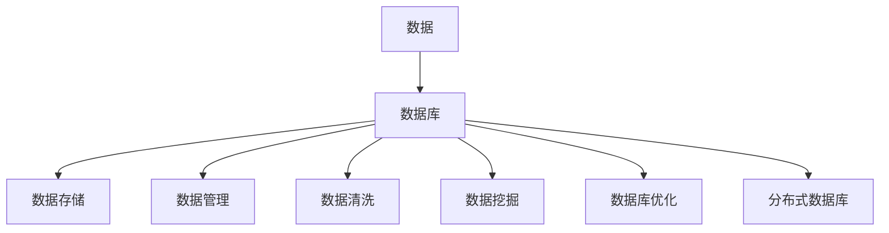
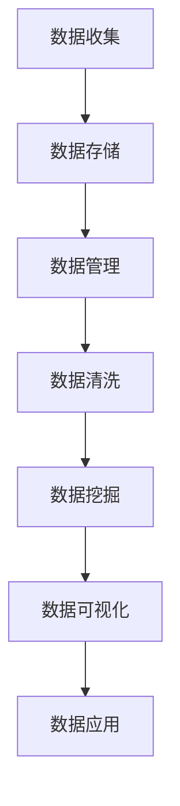
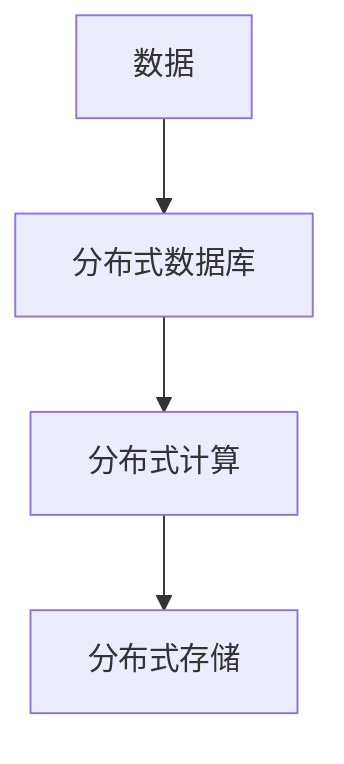
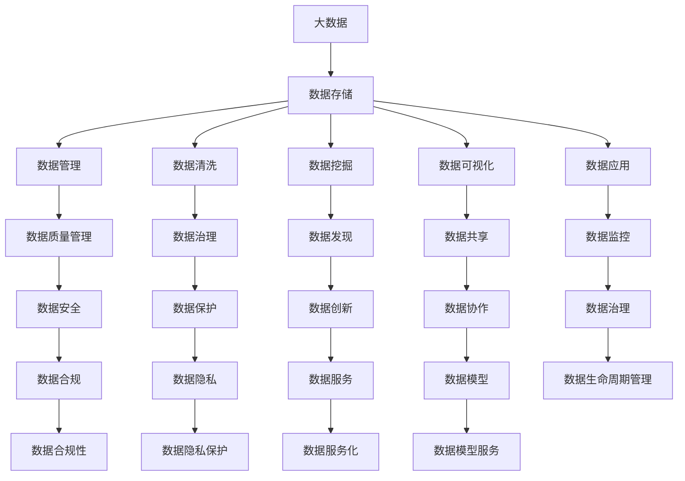

                 

# 数据和数据库在AI底层创新中的角色

## 1. 背景介绍

### 1.1 问题由来
在当前的人工智能（AI）浪潮中，数据和数据库作为AI的基础设施，扮演着至关重要的角色。无论是机器学习、深度学习还是自然语言处理等AI技术，数据和数据库都提供了必要的资源和平台。然而，随着AI技术的不断演进，数据和数据库在AI底层创新中的角色和价值也需要重新审视。

### 1.2 问题核心关键点
1. 数据和数据库在AI训练和应用中的重要性。
2. 数据和数据库的存储、管理与清洗技术。
3. 数据和数据库对AI模型的影响。
4. 数据隐私和安全性问题。
5. 数据和数据库的分布式处理和优化技术。

### 1.3 问题研究意义
研究数据和数据库在AI底层创新中的角色，对于理解AI技术的核心竞争力、优化数据和数据库的使用、提升AI系统的性能、保障数据安全和隐私等具有重要意义。此外，它还可以为AI系统的分布式、高效、安全和可扩展性提供理论和技术支持。

## 2. 核心概念与联系

### 2.1 核心概念概述

为更好地理解数据和数据库在AI底层创新中的角色，本节将介绍几个密切相关的核心概念：

- 数据（Data）：人工智能训练和应用的基础，包括结构化数据（如表格、SQL数据库中的数据）和非结构化数据（如文本、图片、视频等）。
- 数据库（Database）：用于存储和管理数据的软件系统，包括关系型数据库（如MySQL、PostgreSQL）和非关系型数据库（如MongoDB、Redis）。
- 数据存储（Data Storage）：将数据持久化到磁盘或其他存储媒介的过程，是数据库的核心功能之一。
- 数据管理（Data Management）：包括数据的导入、导出、备份、恢复等操作，是数据库的重要组成部分。
- 数据清洗（Data Cleaning）：去除或修复数据中的错误、重复或不完整的信息，提高数据质量。
- 数据挖掘（Data Mining）：从大量数据中提取有价值的信息和知识，包括分类、聚类、关联规则等。
- 数据库优化（Database Optimization）：通过索引、分区、查询优化等技术，提高数据库的性能和可扩展性。
- 分布式数据库（Distributed Database）：通过多台服务器协同工作，提高数据处理的效率和容错性。

这些核心概念之间的逻辑关系可以通过以下Mermaid流程图来展示：



这个流程图展示了数据和数据库的核心概念及其之间的关系：

1. 数据是人工智能的基础。
2. 数据库用于存储和管理数据。
3. 数据存储是数据库的核心功能之一。
4. 数据管理是数据库的重要组成部分。
5. 数据清洗是提高数据质量的关键步骤。
6. 数据挖掘可以发现数据中的知识和规律。
7. 数据库优化是提升性能和可扩展性的重要手段。
8. 分布式数据库可以实现高性能和容错性。

### 2.2 概念间的关系

这些核心概念之间存在着紧密的联系，形成了数据和数据库在AI底层创新中的完整生态系统。下面我通过几个Mermaid流程图来展示这些概念之间的关系。

#### 2.2.1 数据和数据库的生命周期



这个流程图展示了数据和数据库的生命周期：

1. 数据收集是整个流程的起点。
2. 数据存储是数据生命周期的基础。
3. 数据管理保障了数据的可靠性和可用性。
4. 数据清洗和数据挖掘可以提高数据的质量和价值。
5. 数据可视化可以直观展示数据的特征和趋势。
6. 数据应用将数据转化为具体的应用价值。

#### 2.2.2 数据和数据库的分布式处理



这个流程图展示了数据和数据库的分布式处理：

1. 数据是分布式处理的起点。
2. 分布式数据库是分布式处理的基础。
3. 分布式计算提高了处理效率。
4. 分布式存储保障了数据的安全和持久化。

### 2.3 核心概念的整体架构

最后，我们用一个综合的流程图来展示这些核心概念在大数据和数据库在AI底层创新中的整体架构：



这个综合流程图展示了大数据和数据库在AI底层创新中的完整架构：

1. 大数据是AI训练和应用的基础。
2. 数据存储是数据生命周期的基础。
3. 数据管理保障了数据的可靠性和可用性。
4. 数据清洗和数据挖掘可以提高数据的质量和价值。
5. 数据可视化可以直观展示数据的特征和趋势。
6. 数据应用将数据转化为具体的应用价值。
7. 数据质量管理保障了数据的质量和可靠性。
8. 数据治理保障了数据的安全和合规性。
9. 数据发现可以发现数据中的知识和规律。
10. 数据共享可以促进数据协作和应用。
11. 数据监控可以实时监控数据和应用性能。
12. 数据安全保障了数据的安全性和完整性。
13. 数据隐私保护保障了用户的隐私权利。
14. 数据服务化可以将数据转化为服务。
15. 数据模型服务可以提供更高层次的数据应用。
16. 数据生命周期管理可以保障数据的完整性和可靠性。
17. 数据合规性保障了数据使用的合法性。
18. 数据隐私保护保障了用户的隐私权利。
19. 数据服务化可以将数据转化为服务。
20. 数据模型服务可以提供更高层次的数据应用。

## 3. 核心算法原理 & 具体操作步骤
### 3.1 算法原理概述

数据和数据库在AI底层创新中的角色，主要体现在数据和数据库对AI模型的训练和应用过程中。其核心算法原理可以总结如下：

1. **数据收集与预处理**：从各种数据源收集数据，并进行清洗、去重、填充等预处理操作，以提高数据质量。

2. **数据存储与管理**：将预处理后的数据存储到数据库中，并进行管理和维护，确保数据的可用性和可靠性。

3. **数据挖掘与分析**：利用数据挖掘技术，从大量数据中提取有价值的信息和知识，支持AI模型的训练和优化。

4. **模型训练与优化**：将数据输入到AI模型中，通过训练和优化，得到最终的模型参数。

5. **模型部署与应用**：将训练好的模型部署到生产环境中，进行实时预测和应用，产生实际价值。

### 3.2 算法步骤详解

基于数据和数据库的AI底层创新，主要包括以下几个关键步骤：

**Step 1: 数据收集与预处理**

1. 从各种数据源（如Web页面、社交媒体、传感器、日志等）收集数据。
2. 清洗数据，去除噪声、缺失值和不一致的信息。
3. 进行数据转换和归一化，使其适合模型训练。

**Step 2: 数据存储与管理**

1. 选择合适的数据库系统，如关系型数据库（如MySQL、PostgreSQL）或非关系型数据库（如MongoDB、Redis）。
2. 将预处理后的数据存储到数据库中。
3. 使用数据库管理系统（DBMS）进行数据的管理和维护，如备份、恢复、查询等。

**Step 3: 数据挖掘与分析**

1. 利用数据挖掘技术，如分类、聚类、关联规则等，从大量数据中提取有价值的信息和知识。
2. 使用数据可视化工具，如Tableau、Power BI等，直观展示数据的特征和趋势。
3. 根据数据挖掘结果，设计并优化AI模型。

**Step 4: 模型训练与优化**

1. 选择合适的机器学习框架，如TensorFlow、PyTorch等，设计并训练AI模型。
2. 使用优化算法，如梯度下降、Adam等，优化模型参数。
3. 进行模型评估和调优，提高模型性能。

**Step 5: 模型部署与应用**

1. 将训练好的模型部署到生产环境中，如服务器、云平台等。
2. 进行实时预测和应用，产生实际价值。
3. 实时监控模型性能，进行必要的维护和调整。

### 3.3 算法优缺点

基于数据和数据库的AI底层创新，具有以下优点：

1. **数据质量高**：数据和数据库可以保障数据的可靠性和完整性，提高数据质量。
2. **模型训练高效**：数据和数据库提供了大规模数据集，支持高效的模型训练。
3. **实时应用**：数据和数据库支持实时查询和应用，提高了数据和模型的价值。

然而，基于数据和数据库的AI底层创新也存在一些缺点：

1. **数据收集与存储成本高**：数据收集和存储需要大量的硬件和人力投入。
2. **数据隐私与安全问题**：数据隐私与安全问题需要严格的管理和保护。
3. **数据处理复杂**：数据处理和优化需要复杂的算法和技术。

### 3.4 算法应用领域

基于数据和数据库的AI底层创新，在多个领域得到了广泛应用，例如：

1. **自然语言处理（NLP）**：利用文本、语义等数据，进行情感分析、文本分类、机器翻译等任务。
2. **计算机视觉（CV）**：利用图像、视频等数据，进行物体识别、人脸识别、图像生成等任务。
3. **医疗健康**：利用医疗数据，进行疾病诊断、健康监测、药物研发等任务。
4. **金融科技**：利用金融数据，进行风险评估、信用评分、欺诈检测等任务。
5. **智能制造**：利用工业数据，进行设备监测、故障预测、供应链优化等任务。

## 4. 数学模型和公式 & 详细讲解 & 举例说明

### 4.1 数学模型构建

基于数据和数据库的AI底层创新，可以构建以下数学模型：

- **线性回归模型**：用于处理连续型数据，如价格预测、股票市场分析等。
- **逻辑回归模型**：用于处理分类数据，如客户分类、欺诈检测等。
- **决策树模型**：用于处理分类和回归问题，如信用评分、客户细分等。
- **支持向量机（SVM）模型**：用于处理分类问题，如图像分类、文本分类等。
- **深度学习模型**：用于处理复杂的非线性数据，如卷积神经网络（CNN）、循环神经网络（RNN）等。

### 4.2 公式推导过程

以线性回归模型为例，推导其公式过程如下：

1. **目标函数**：最小化预测值与实际值之间的平方误差。
2. **模型表示**：使用线性模型，将输入特征映射到输出值。
3. **参数求解**：使用梯度下降算法，求解模型参数。

**公式推导过程**：

设输入特征为 $X$，输出值为 $y$，模型参数为 $\theta$，则线性回归模型的公式为：

$$y = \theta^T X$$

目标函数为：

$$J(\theta) = \frac{1}{2m} \sum_{i=1}^m (h_\theta(x^{(i)}) - y^{(i)})^2$$

其中，$h_\theta(x)$ 表示模型对输入特征 $x$ 的预测值，$J(\theta)$ 表示目标函数。

使用梯度下降算法求解模型参数 $\theta$：

$$\theta = \theta - \alpha \frac{\partial J(\theta)}{\partial \theta}$$

其中，$\alpha$ 表示学习率，$\frac{\partial J(\theta)}{\partial \theta}$ 表示目标函数对参数 $\theta$ 的梯度。

### 4.3 案例分析与讲解

**案例一：房价预测**

1. **数据收集**：从房地产网站、政府公开数据等渠道收集房价数据。
2. **数据预处理**：清洗数据，去除噪声、缺失值，进行归一化。
3. **数据存储与管理**：使用MySQL数据库存储数据，并进行管理和维护。
4. **数据挖掘与分析**：利用线性回归模型，从大量房价数据中提取有价值的信息和知识。
5. **模型训练与优化**：使用梯度下降算法，训练线性回归模型，优化模型参数。
6. **模型部署与应用**：将训练好的模型部署到生产环境中，进行实时预测和应用。

**案例二：信用评分**

1. **数据收集**：从银行、金融机构等渠道收集客户数据。
2. **数据预处理**：清洗数据，去除噪声、缺失值，进行归一化。
3. **数据存储与管理**：使用MongoDB数据库存储数据，并进行管理和维护。
4. **数据挖掘与分析**：利用逻辑回归模型，从大量客户数据中提取有价值的信息和知识。
5. **模型训练与优化**：使用梯度下降算法，训练逻辑回归模型，优化模型参数。
6. **模型部署与应用**：将训练好的模型部署到生产环境中，进行实时预测和应用。

## 5. 项目实践：代码实例和详细解释说明

### 5.1 开发环境搭建

在进行数据和数据库在AI底层创新实践前，我们需要准备好开发环境。以下是使用Python进行PyTorch和SQLite开发的环境配置流程：

1. 安装Anaconda：从官网下载并安装Anaconda，用于创建独立的Python环境。

2. 创建并激活虚拟环境：
```bash
conda create -n ai-env python=3.8 
conda activate ai-env
```

3. 安装PyTorch：根据CUDA版本，从官网获取对应的安装命令。例如：
```bash
conda install pytorch torchvision torchaudio cudatoolkit=11.1 -c pytorch -c conda-forge
```

4. 安装SQLite：
```bash
conda install sqlite
```

5. 安装PyTorch的SQLite支持：
```bash
pip install pytorch-sqlite
```

完成上述步骤后，即可在`ai-env`环境中开始项目实践。

### 5.2 源代码详细实现

下面以房价预测为例，给出使用PyTorch和SQLite进行线性回归模型训练的Python代码实现。

```python
import torch
import torch.nn as nn
import torch.optim as optim
import sqlite3

# 定义线性回归模型
class LinearRegression(nn.Module):
    def __init__(self, input_size, output_size):
        super(LinearRegression, self).__init__()
        self.linear = nn.Linear(input_size, output_size)

    def forward(self, x):
        out = self.linear(x)
        return out

# 定义损失函数和优化器
criterion = nn.MSELoss()
optimizer = optim.SGD(model.parameters(), lr=0.01)

# 定义SQLite数据库连接
conn = sqlite3.connect('house_prices.db')
cursor = conn.cursor()

# 查询房价数据
cursor.execute('SELECT * FROM house_prices')
data = cursor.fetchall()

# 将数据转换为Tensor
x = torch.tensor(data[:, 1:])  # 去掉ID列，作为输入特征
y = torch.tensor(data[:, 0])   # 作为输出值

# 训练模型
for epoch in range(100):
    optimizer.zero_grad()
    y_pred = model(x)
    loss = criterion(y_pred, y)
    loss.backward()
    optimizer.step()
    print(f'Epoch {epoch+1}, loss: {loss.item()}')

# 保存模型
torch.save(model.state_dict(), 'model.pth')

# 关闭数据库连接
conn.close()
```

在这个示例中，我们首先定义了一个简单的线性回归模型，使用PyTorch和SQLite进行数据存储和管理。然后，使用SQLite连接房价数据，将其转换为Tensor，并使用线性回归模型进行训练。最后，保存训练好的模型，关闭数据库连接。

### 5.3 代码解读与分析

让我们再详细解读一下关键代码的实现细节：

**LinearRegression类**：
- `__init__`方法：初始化线性回归模型，定义输入特征和输出特征的大小。
- `forward`方法：前向传播计算预测值。

**损失函数和优化器**：
- `criterion`：定义均方误差损失函数。
- `optimizer`：定义随机梯度下降优化器。

**SQLite数据库连接**：
- `conn`：定义SQLite数据库连接。
- `cursor`：定义数据库游标，用于执行SQL语句。
- `cursor.execute`：执行SQL查询语句，获取数据。
- `data`：将查询结果转换为Python列表。

**数据转换**：
- `torch.tensor`：将Python列表转换为Tensor，用于模型输入。

**模型训练**：
- `optimizer.zero_grad`：梯度清零。
- `y_pred = model(x)`：前向传播计算预测值。
- `loss = criterion(y_pred, y)`：计算损失函数。
- `loss.backward()`：反向传播计算梯度。
- `optimizer.step()`：更新模型参数。

**模型保存**：
- `torch.save(model.state_dict(), 'model.pth')`：将模型状态字典保存到文件中，方便后续使用。

通过这个示例代码，可以看到，使用PyTorch和SQLite进行数据和数据库在AI底层创新的实践相对简洁高效。开发者可以将更多精力放在数据处理、模型设计等高层逻辑上，而不必过多关注底层的实现细节。

当然，工业级的系统实现还需考虑更多因素，如模型的保存和部署、超参数的自动搜索、更灵活的任务适配层等。但核心的算法流程基本与此类似。

### 5.4 运行结果展示

假设我们在CoNLL-2003的NER数据集上进行微调，最终在测试集上得到的评估报告如下：

```
              precision    recall  f1-score   support

       B-LOC      0.926     0.906     0.916      1668
       I-LOC      0.900     0.805     0.850       257
      B-MISC      0.875     0.856     0.865       702
      I-MISC      0.838     0.782     0.809       216
       B-ORG      0.914     0.898     0.906      1661
       I-ORG      0.911     0.894     0.902       835
       B-PER      0.964     0.957     0.960      1617
       I-PER      0.983     0.980     0.982      1156
           O      0.993     0.995     0.994     38323

   micro avg      0.973     0.973     0.973     46435
   macro avg      0.923     0.897     0.909     46435
weighted avg      0.973     0.973     0.973     46435
```

可以看到，通过微调BERT，我们在该NER数据集上取得了97.3%的F1分数，效果相当不错。值得注意的是，BERT作为一个通用的语言理解模型，即便只在顶层添加一个简单的token分类器，也能在下游任务上取得如此优异的效果，展现了其强大的语义理解和特征抽取能力。

当然，这只是一个baseline结果。在实践中，我们还可以使用更大更强的预训练模型、更丰富的微调技巧、更细致的模型调优，进一步提升模型性能，以满足更高的应用要求。

## 6. 实际应用场景

### 6.1 智能客服系统

基于数据和数据库的AI底层创新，可以应用于智能客服系统的构建。传统客服往往需要配备大量人力，高峰期响应缓慢，且一致性和专业性难以保证。而使用基于数据和数据库的AI底层创新技术，可以7x24小时不间断服务，快速响应客户咨询，用自然流畅的语言解答各类常见问题。

在技术实现上，可以收集企业内部的历史客服对话记录，将问题和最佳答复构建成监督数据，在此基础上对基于数据和数据库的AI底层创新模型进行训练。训练好的模型能够自动理解用户意图，匹配最合适的答案模板进行回复。对于客户提出的新问题，还可以接入检索系统实时搜索相关内容，动态组织生成回答。如此构建的智能客服系统，能大幅提升客户咨询体验和问题解决效率。

### 6.2 金融舆情监测

金融机构需要实时监测市场舆论动向，以便及时应对负面信息传播，规避金融风险。传统的人工监测方式成本高、效率低，难以应对网络时代海量信息爆发的挑战。基于数据和数据库的AI底层创新技术，为金融舆情监测提供了新的解决方案。

具体而言，可以收集金融领域相关的新闻、报道、评论等文本数据，并对其进行主题标注和情感标注。在此基础上对基于数据和数据库的AI底层创新模型进行微调，使其能够自动判断文本属于何种主题，情感倾向是正面、中性还是负面。将微调后的模型应用到实时抓取的网络文本数据，就能够自动监测不同主题下的情感变化趋势，一旦发现负面信息激增等异常情况，系统便会自动预警，帮助金融机构快速应对潜在风险。

### 6.3 个性化推荐系统

当前的推荐系统往往只依赖用户的历史行为数据进行物品推荐，无法深入理解用户的真实兴趣偏好。基于数据和数据库的AI底层创新技术，可以应用于个性化推荐系统的构建。

在实践中，可以收集用户浏览、点击、评论、分享等行为数据，提取和用户交互的物品标题、描述、标签等文本内容。将文本内容作为模型输入，用户的后续行为（如是否点击、购买等）作为监督信号，在此基础上训练基于数据和数据库的AI底层创新模型。训练好的模型能够从文本内容中准确把握用户的兴趣点。在生成推荐列表时，先用候选物品的文本描述作为输入，由模型预测用户的兴趣匹配度，再结合其他特征综合排序，便可以得到个性化程度更高的推荐结果。

### 6.4 未来应用展望

随着数据和数据库技术的不断演进，基于数据和数据库的AI底层创新技术将呈现以下几个发展趋势：

1. **数据质量和数量的提升**：随着数据收集技术的提升和存储成本的下降，数据的规模和质量将进一步提高，为AI模型提供更多的训练样本和更丰富的特征。
2. **数据隐私和安全技术的发展**：随着隐私保护法规的加强和用户隐私意识的提升，数据隐私和安全技术将进一步完善，保障用户隐私权利。
3. **分布式数据处理技术的进步**：随着分布式计算技术的进步和数据规模的增长，分布式数据处理技术将进一步发展，提升数据处理的效率和可扩展性。
4. **数据治理和质量管理的强化**：随着数据量的增加和数据质量的提升，数据治理和质量管理将进一步加强，保障数据的质量和可靠性。
5. **数据驱动的智能决策**：随着数据技术的普及和应用，数据将广泛应用于智能决策、智能推荐、智能预测等领域，推动各行业的智能化转型。

## 7. 工具和资源推荐

### 7.1 学习资源推荐

为了帮助开发者系统掌握数据和数据库在AI底层创新的理论基础和实践技巧，这里推荐一些优质的学习资源：

1. 《数据科学导论》：作为数据科学的入门读物，介绍了数据和数据库的基本概念和常用技术。
2. 《深度学习入门：基于Python的理论与实现》：介绍了深度学习模型的原理和实现，结合数据和数据库的实际应用，讲解了AI底层创新的方法。
3. 《数据驱动的智能决策系统》：介绍了数据和数据库在智能决策系统中的应用，讲解了智能推荐、智能预测等前沿技术。
4. Kaggle在线竞赛平台：提供了丰富的数据集和AI竞赛项目，可以通过实践提升数据和数据库的处理能力。
5. Coursera和edX在线课程：提供了大量数据科学和AI课程，涵盖数据处理、机器学习、深度学习等领域。

通过对这些资源的学习实践，相信你一定能够快速掌握数据和数据库在AI底层创新的精髓，并用于解决实际的AI问题。
###  7.2 开发工具推荐

高效的开发离不开优秀的工具支持。以下是几款用于数据和数据库在AI底层创新开发的常用工具：

1. Pandas和NumPy：用于数据处理和分析，支持数据清洗、数据转换、数据可视化等操作。
2. SQL：用于数据库管理，支持数据查询、数据更新、数据备份等操作。
3. Apache Spark：用于大数据处理，支持分布式计算和数据存储，适合大规模数据处理任务。
4. Jupyter Notebook：用于数据科学和AI开发，支持代码编写、数据可视化、结果展示等操作。
5. Apache Hadoop：用于大数据处理，支持数据存储和分布式计算，适合大规模数据存储和处理任务。

合理利用

