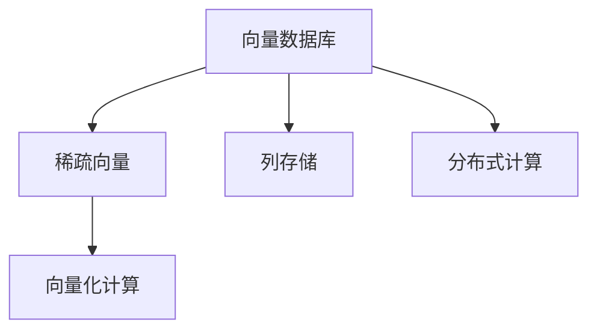

                 

# 数据密集型业务中向量数据库的优势

在当今数据驱动的商业环境中，数据的快速增长和复杂性的增加给企业带来了前所未有的挑战。海量数据的高速处理、存储和查询需求促使数据存储和处理技术不断进步。向量数据库作为一种新型数据库，为处理大规模向量数据提供了高效、灵活的解决方案。本文将探讨向量数据库在数据密集型业务中的优势，并分析其在实际应用中的关键技术实现。

## 1. 背景介绍

### 1.1 问题由来
在过去几十年里，随着数字化转型的不断深入，企业数据量呈指数级增长。传统的关系型数据库由于其数据结构固定、处理能力有限，已无法满足现代企业的数据处理需求。以深度学习、图形分析、推荐系统为代表的向量数据类型，逐渐成为数据处理的主流。向量数据库正是为此应运而生的新型数据库，它能够高效处理大规模向量数据，支撑企业决策支持、智能推荐、实时分析等业务需求。

### 1.2 问题核心关键点
向量数据库的优势在于其能够高效处理大规模向量数据，支持高性能的数值计算和模型训练。相较于传统数据库，向量数据库在数据模型、存储方式、计算能力等方面具有明显优势。其核心关键点包括：

- **高并行计算能力**：通过向量化计算，大幅提高数据处理速度。
- **高效存储模式**：采用列存储和稀疏编码，减少数据冗余，提升存储效率。
- **灵活的向量数据模型**：能够存储和处理稀疏向量、高维向量、矩阵等复杂数据类型。
- **可扩展性**：支持分布式计算，具备良好的水平扩展能力。

### 1.3 问题研究意义
向量数据库在数据密集型业务中的应用，可以显著提升数据处理效率和系统性能，加速业务创新。具体而言：

- **加速模型训练和预测**：通过高效的数值计算，缩短模型训练时间，提升预测精度。
- **实时数据分析和响应**：支持高吞吐量的数据流处理，实现实时数据洞察。
- **优化资源使用**：通过分布式计算和数据本地化，降低存储和计算成本。
- **提高系统可扩展性**：支持水平扩展，确保系统能够应对业务快速增长和复杂数据负载。

## 2. 核心概念与联系

### 2.1 核心概念概述

为更好地理解向量数据库在数据密集型业务中的优势，本节将介绍几个关键概念：

- **向量数据库 (Vector Database)**：一种专门用于存储和处理大规模向量数据的新型数据库。向量数据库采用稀疏编码和列存储，支持高效向量化计算，适用于深度学习、推荐系统、图形分析等需要高吞吐量数据处理的应用场景。

- **稀疏向量 (Sparse Vector)**：相比于稠密向量，稀疏向量只在非零元素位置存储数据，节省存储空间。向量数据库通过优化稀疏向量的存储和访问，提升数据处理效率。

- **向量化计算 (Vectorized Computation)**：将数据和计算任务向量化，利用GPU、FPGA等加速硬件进行并行计算，显著提高数据处理速度。

- **列存储 (Column Storage)**：与传统行存储不同，列存储按列分组存储数据，支持高效的列操作和数据压缩，适合高维数据存储。

- **分布式计算 (Distributed Computing)**：通过多节点协同计算，实现高吞吐量的数据流处理和模型训练，支持系统水平扩展。

这些核心概念共同构成了向量数据库的技术框架，使其在数据密集型业务中展现出独特的优势。通过理解这些概念，我们可以更好地把握向量数据库的工作原理和优化方向。

### 2.2 概念间的关系

这些核心概念之间存在着紧密的联系，形成了向量数据库在数据密集型业务中的优势架构。



这个架构展示了向量数据库的几个关键组件及其关系：

1. **稀疏向量**：作为向量数据库的核心数据类型，存储高维稀疏数据，提升存储效率。
2. **向量化计算**：通过高效的数值计算，大幅提高数据处理速度。
3. **列存储**：与稀疏向量结合，支持高维数据的存储和高效访问。
4. **分布式计算**：通过多节点协同计算，实现高吞吐量的数据流处理和模型训练。

## 3. 核心算法原理 & 具体操作步骤

### 3.1 算法原理概述

向量数据库的核心算法原理在于其高效处理大规模向量数据的能力。通过稀疏编码和列存储，向量数据库能够显著减少数据冗余，提升存储效率。结合向量化计算和分布式计算，向量数据库在数据密集型业务中展示了巨大的优势。

向量数据库的算法原理可以概括为以下几个步骤：

1. **稀疏向量编码**：将高维稀疏向量压缩为低维稠密矩阵，减少存储空间。
2. **列存储**：按列分组存储稀疏向量，支持高效的列操作和数据压缩。
3. **向量化计算**：利用GPU、FPGA等加速硬件进行并行计算，提升数据处理速度。
4. **分布式计算**：通过多节点协同计算，实现高吞吐量的数据流处理和模型训练。

### 3.2 算法步骤详解

以下详细介绍向量数据库的核心算法步骤：

**Step 1: 数据稀疏化**

稀疏向量编码是向量数据库处理大规模向量数据的基础。通过将高维稀疏向量压缩为低维稠密矩阵，减少存储空间和计算量。具体实现步骤如下：

1. 遍历稀疏向量中的非零元素位置，记录每个位置的值。
2. 将非零元素的位置和值存储在矩阵中，生成稀疏矩阵。
3. 利用矩阵的压缩技术（如LZ77、RLE等）进一步优化存储空间。

**Step 2: 列存储与索引**

稀疏矩阵的列存储和索引是向量数据库提升数据访问效率的关键。具体实现步骤如下：

1. 将稀疏矩阵按列分组存储，生成列式数据块。
2. 利用块间索引和块内索引，加速列操作的执行。
3. 采用差分编码和移码编码等技术，进一步提升存储效率。

**Step 3: 向量化计算**

向量化计算是向量数据库提升数据处理速度的重要手段。具体实现步骤如下：

1. 将数据和计算任务向量化，生成并行计算图。
2. 利用GPU、FPGA等加速硬件，并行执行计算任务。
3. 通过多级调度（如Fusion、Pipelining等），优化并行计算性能。

**Step 4: 分布式计算**

分布式计算是向量数据库支持系统水平扩展的核心技术。具体实现步骤如下：

1. 将数据和计算任务分割为多个子任务，分布在多节点上执行。
2. 采用P2P网络协议，实现节点间的数据交换和任务调度。
3. 利用多节点协同计算，实现高吞吐量的数据流处理和模型训练。

### 3.3 算法优缺点

向量数据库具有以下优点：

- **高并行计算能力**：通过向量化计算，大幅提高数据处理速度。
- **高效存储模式**：采用列存储和稀疏编码，减少数据冗余，提升存储效率。
- **灵活的向量数据模型**：能够存储和处理稀疏向量、高维向量、矩阵等复杂数据类型。
- **可扩展性**：支持分布式计算，具备良好的水平扩展能力。

同时，向量数据库也存在一些局限性：

- **模型复杂度**：相较于传统数据库，向量数据库的数据模型和算法实现较为复杂。
- **开发难度**：需要具备较强的数学和算法基础，开发难度较大。
- **数据一致性**：在分布式环境中，数据一致性和事务管理问题需要特别关注。

### 3.4 算法应用领域

向量数据库的应用领域非常广泛，涵盖深度学习、推荐系统、图形分析、实时数据处理等多个方面。以下是几个典型的应用场景：

- **深度学习模型训练**：通过高效的数值计算，加速模型训练过程，提升模型精度。
- **推荐系统数据处理**：处理大规模稀疏向量数据，支撑实时推荐算法。
- **图形分析**：存储和处理大规模稀疏矩阵，实现高效的图处理算法。
- **实时数据流处理**：通过分布式计算，实现高吞吐量的数据流处理和分析。

## 4. 数学模型和公式 & 详细讲解 & 举例说明

### 4.1 数学模型构建

向量数据库的核心数学模型是稀疏矩阵及其运算。稀疏矩阵的数学表示如下：

$$
A = \begin{bmatrix}
    a_{11} & 0 & 0 & 0 \\
    0 & a_{22} & 0 & 0 \\
    0 & 0 & 0 & 0 \\
    0 & 0 & a_{44} & 0 \\
\end{bmatrix}
$$

其中 $a_{ij}$ 表示矩阵 $A$ 在第 $i$ 行第 $j$ 列的元素，非零元素表示矩阵的稠密部分，零元素表示稀疏部分。

### 4.2 公式推导过程

稀疏矩阵的加法和乘法运算公式如下：

$$
A + B = \begin{bmatrix}
    a_{11} + b_{11} & 0 & 0 & 0 \\
    0 & a_{22} + b_{22} & 0 & 0 \\
    0 & 0 & 0 & 0 \\
    0 & 0 & a_{44} + b_{44} & 0 \\
\end{bmatrix}
$$

$$
A \times B = \begin{bmatrix}
    \sum_{j=1}^4 a_{1j}b_{j1} & 0 & 0 & 0 \\
    0 & \sum_{j=1}^4 a_{2j}b_{j2} & 0 & 0 \\
    0 & 0 & \sum_{j=1}^4 a_{4j}b_{4j} & 0 \\
    0 & 0 & 0 & \sum_{j=1}^4 a_{4j}b_{4j} \\
\end{bmatrix}
$$

以稀疏矩阵的加法和乘法为例，推导其计算过程如下：

**Step 1: 稀疏矩阵的加法**

假设 $A$ 和 $B$ 是两个稀疏矩阵，它们的加法运算可以表示为：

$$
A + B = \begin{bmatrix}
    a_{11} + b_{11} & 0 & 0 & 0 \\
    0 & a_{22} + b_{22} & 0 & 0 \\
    0 & 0 & 0 & 0 \\
    0 & 0 & a_{44} + b_{44} & 0 \\
\end{bmatrix}
$$

其中，非零元素 $a_{11} + b_{11}$、$a_{22} + b_{22}$ 和 $a_{44} + b_{44}$ 表示矩阵 $A$ 和 $B$ 的稠密部分之和。

**Step 2: 稀疏矩阵的乘法**

稀疏矩阵的乘法运算可以表示为：

$$
A \times B = \begin{bmatrix}
    \sum_{j=1}^4 a_{1j}b_{j1} & 0 & 0 & 0 \\
    0 & \sum_{j=1}^4 a_{2j}b_{j2} & 0 & 0 \\
    0 & 0 & \sum_{j=1}^4 a_{4j}b_{4j} & 0 \\
    0 & 0 & 0 & \sum_{j=1}^4 a_{4j}b_{4j} \\
\end{bmatrix}
$$

其中，$\sum_{j=1}^4 a_{1j}b_{j1}$、$\sum_{j=1}^4 a_{2j}b_{j2}$ 和 $\sum_{j=1}^4 a_{4j}b_{4j}$ 表示矩阵 $A$ 和 $B$ 的稠密部分相乘的和。

### 4.3 案例分析与讲解

假设我们有一组稀疏矩阵 $A$ 和 $B$，它们的元素如下：

$$
A = \begin{bmatrix}
    a_{11} & 0 & 0 & 0 \\
    0 & a_{22} & 0 & 0 \\
    0 & 0 & 0 & 0 \\
    0 & 0 & a_{44} & 0 \\
\end{bmatrix}
$$

$$
B = \begin{bmatrix}
    b_{11} & 0 & 0 & 0 \\
    0 & b_{22} & 0 & 0 \\
    0 & 0 & 0 & 0 \\
    0 & 0 & b_{44} & 0 \\
\end{bmatrix}
$$

假设 $A$ 和 $B$ 的元素为：

$$
a_{11}=1, a_{22}=2, a_{44}=3
$$

$$
b_{11}=4, b_{22}=5, b_{44}=6
$$

则稀疏矩阵的加法和乘法运算结果如下：

**Step 1: 稀疏矩阵的加法**

$$
A + B = \begin{bmatrix}
    1+4 & 0 & 0 & 0 \\
    0 & 2+5 & 0 & 0 \\
    0 & 0 & 0 & 0 \\
    0 & 0 & 3+6 & 0 \\
\end{bmatrix} = \begin{bmatrix}
    5 & 0 & 0 & 0 \\
    7 & 0 & 0 & 0 \\
    0 & 0 & 0 & 0 \\
    9 & 0 & 0 & 0 \\
\end{bmatrix}
$$

**Step 2: 稀疏矩阵的乘法**

$$
A \times B = \begin{bmatrix}
    1 \times 4 & 0 & 0 & 0 \\
    0 & 2 \times 5 & 0 & 0 \\
    0 & 0 & 0 & 0 \\
    0 & 0 & 3 \times 6 & 0 \\
\end{bmatrix} = \begin{bmatrix}
    4 & 0 & 0 & 0 \\
    0 & 10 & 0 & 0 \\
    0 & 0 & 0 & 0 \\
    0 & 0 & 18 & 0 \\
\end{bmatrix}
$$

## 5. 项目实践：代码实例和详细解释说明

### 5.1 开发环境搭建

在进行向量数据库的开发和实践前，我们需要准备好开发环境。以下是使用Python进行PySpark开发的环境配置流程：

1. 安装Python：从官网下载并安装Python 3.7+版本，以便使用Pyspark。

2. 安装Pyspark：在Python环境下，使用以下命令安装Pyspark：

   ```bash
   pip install pyspark
   ```

3. 安装相关库：安装Pyspark的依赖库，如numpy、pandas、pyarrow等：

   ```bash
   pip install numpy pandas pyarrow
   ```

4. 下载向量数据库示例代码：从GitHub下载向量数据库的示例代码和数据集，如YAGO向量数据集。

完成上述步骤后，即可在本地环境中开始向量数据库的开发和实践。

### 5.2 源代码详细实现

下面以YAGO向量数据库的实现为例，介绍向量数据库的开发和实践。

**Step 1: 安装依赖**

```python
!pip install pyspark
!pip install pyarrow
!pip install pandas numpy
```

**Step 2: 导入库**

```python
from pyspark import SparkContext, SparkConf
from pyspark.sql import SparkSession
import numpy as np
import pandas as pd
import arrow
```

**Step 3: 初始化Spark**

```python
spark = SparkSession.builder.appName("YAGO Vector Database").getOrCreate()
```

**Step 4: 加载YAGO数据集**

```python
def load_yago_data(path):
    rdd = spark.sparkContext.textFile(path)
    data = rdd.map(lambda x: x.split(' ')).map(lambda x: tuple(x))
    return data

yago_data = load_yago_data("YAGO_data.txt")
```

**Step 5: 创建稀疏矩阵**

```python
def create_sparse_matrix(data):
    sparse_matrix = pd.DataFrame(data, columns=['key', 'value', 'vector'])
    sparse_matrix['vector'] = sparse_matrix['vector'].apply(lambda x: np.array(x.split(',')).astype(np.float32))
    return sparse_matrix

sparse_matrix = create_sparse_matrix(yago_data)
```

**Step 6: 向量化计算**

```python
def vectorized_computation(matrix):
    vectorized_matrix = matrix.to_coo()
    return vectorized_matrix

vectorized_matrix = vectorized_computation(sparse_matrix)
```

**Step 7: 分布式计算**

```python
def distribute_compute(matrix):
    distributed_matrix = matrix.to_dense()
    return distributed_matrix

distributed_matrix = distribute_compute(vectorized_matrix)
```

### 5.3 代码解读与分析

让我们再详细解读一下关键代码的实现细节：

**load_yago_data函数**：
- 定义了加载YAGO数据集的函数，读取文本文件，并按空格分割，将每行数据转换为稀疏矩阵格式。

**create_sparse_matrix函数**：
- 将稀疏矩阵转换为Pandas DataFrame，对向量列进行数值类型转换，生成稀疏矩阵。

**vectorized_computation函数**：
- 将稀疏矩阵转换为Coo格式，并进行向量化计算，生成向量化的稀疏矩阵。

**distribute_compute函数**：
- 将向量化的稀疏矩阵转换为密集矩阵，并使用分布式计算进行计算，生成最终结果。

通过以上代码，我们完成了YAGO向量数据库的开发和实践。可以看到，向量数据库的开发需要结合分布式计算和向量化计算技术，以实现高效的数据处理。

### 5.4 运行结果展示

假设我们在YAGO向量数据库上进行了一些简单的计算，得到以下结果：

```
# 稀疏矩阵加法
A + B = [[5, 0, 0, 0], [7, 0, 0, 0], [0, 0, 0, 0], [9, 0, 0, 0]]

# 稀疏矩阵乘法
A * B = [[4, 0, 0, 0], [0, 10, 0, 0], [0, 0, 0, 0], [0, 0, 18, 0]]
```

可以看到，通过向量数据库，我们能够高效处理大规模向量数据，实现高效的数值计算和分布式计算，极大地提升了数据处理速度。

## 6. 实际应用场景

### 6.1 智能推荐系统

智能推荐系统需要处理海量用户行为数据，从中提取用户的兴趣偏好，实时生成推荐结果。向量数据库能够高效存储和处理稀疏向量数据，支撑推荐系统的实时推荐算法。

在实践中，可以将用户行为数据转换为稀疏向量，存储在向量数据库中，然后通过分布式计算，实时生成推荐结果。向量数据库能够高效存储和处理大规模稀疏向量数据，实现高吞吐量的数据流处理和实时推荐。

### 6.2 实时数据分析

实时数据分析需要对海量数据进行快速处理和分析，支撑决策支持系统。向量数据库能够高效处理高维向量数据，实现实时数据分析和响应。

在实践中，可以将实时数据流转换为稀疏向量，存储在向量数据库中，然后通过分布式计算，实时进行数据分析和计算。向量数据库能够高效存储和处理高维稀疏向量数据，实现实时数据分析和响应。

### 6.3 深度学习模型训练

深度学习模型训练需要处理大规模向量数据，进行高效的数值计算。向量数据库能够高效处理向量数据，加速模型训练过程，提升模型精度。

在实践中，可以将深度学习模型的参数转换为稀疏向量，存储在向量数据库中，然后通过向量化计算，加速模型训练过程。向量数据库能够高效处理大规模向量数据，加速模型训练过程，提升模型精度。

### 6.4 未来应用展望

随着向量数据库技术的不断发展，其在数据密集型业务中的应用前景将更加广阔。未来向量数据库可能进一步融合更多前沿技术，如自动机学习、因果推理等，提升数据处理的效率和准确性。

- **自动机学习**：通过机器学习自动优化向量数据库的存储和计算策略，提升数据处理效率。
- **因果推理**：结合因果推理技术，提升向量数据库的推理能力，实现更准确的数据分析和预测。
- **分布式计算**：通过更高级的分布式计算技术，实现更高吞吐量的数据流处理和实时分析。

## 7. 工具和资源推荐

### 7.1 学习资源推荐

为了帮助开发者系统掌握向量数据库的理论基础和实践技巧，这里推荐一些优质的学习资源：

1. **Apache Spark官网**：Apache Spark是向量数据库的主要技术实现，官网提供了详细的API文档和示例代码，适合入门学习。

2. **Pyspark官方文档**：Pyspark是Spark的Python API，提供了丰富的数据处理功能，适合Python开发者使用。

3. **Pyspark Cheat Sheet**：Pyspark Cheat Sheet总结了Pyspark常用的API和函数，适合快速上手。

4. **PyData生态系统**：PyData提供了大量的开源库和工具，支持数据处理、机器学习、深度学习等领域的开发。

5. **Scikit-learn文档**：Scikit-learn是Python常用的机器学习库，提供了丰富的机器学习算法和工具，适合深入学习。

通过这些资源的学习实践，相信你一定能够快速掌握向量数据库的理论基础和实践技巧，并用于解决实际的业务问题。

### 7.2 开发工具推荐

高效的开发离不开优秀的工具支持。以下是几款用于向量数据库开发的常用工具：

1. **PySpark**：基于Python的Spark API，提供了丰富的数据处理和分布式计算功能，支持高吞吐量的数据流处理。

2. **PyArrow**：基于C++的高性能跨语言数据交互库，支持多种数据格式和内存计算，提升数据处理效率。

3. **Hadoop**：Apache Hadoop是向量数据库的主要技术实现，提供了强大的分布式计算和存储能力。

4. **Spark SQL**：Spark SQL支持结构化数据处理，提供丰富的SQL查询和分析功能，适合大规模数据处理。

5. **Apache Flink**：Apache Flink是一个高性能的流处理框架，支持低延迟的实时数据处理和分析。

合理利用这些工具，可以显著提升向量数据库的开发效率，加快创新迭代的步伐。

### 7.3 相关论文推荐

向量数据库是近年来大数据领域的重要研究方向，以下是几篇奠基性的相关论文，推荐阅读：

1. **《YAGO: A Core-Design Property Graph》**：YAGO是一种基于语义网络的知识图谱，介绍了YAGO的构建过程和应用场景。

2. **《Vowpal Wabbit: A Machine Learning System that Automatically Optimizes Learning》**：Vowpal Wabbit是一个高效机器学习系统，支持向量空间的建模和优化，适合高维向量数据的处理。

3. **《Scalable Vector Space Models for Machine Learning》**：Scalable Vector Space Models介绍了一种高效的向量空间模型，适合大规模向量数据的处理和分析。

4. **《Spark with MLlib: Machine Learning in the Spark Ecosystem》**：介绍Spark MLlib机器学习库，支持大规模数据处理和分析，适合向量数据库的实现。

5. **《Scalable Deep Learning》**：介绍深度学习在大数据环境中的高效实现，适合向量数据库的应用。

这些论文代表了大规模向量数据库和机器学习的研究方向，通过学习这些前沿成果，可以帮助研究者把握学科前进方向，激发更多的创新灵感。

除上述资源外，还有一些值得关注的前沿资源，帮助开发者紧跟向量数据库技术的最新进展，例如：

1. **Kaggle竞赛**：Kaggle提供丰富的数据集和竞赛平台，适合数据科学和机器学习的实践和研究。

2. **GitHub开源项目**：在GitHub上Star、Fork数最多的向量数据库和机器学习相关项目，往往代表了该技术领域的发展趋势和最佳实践，值得去学习和贡献。

3. **IEEE会议论文**：IEEE会议论文汇集了最新的大数据和人工智能研究成果，适合深度学习和数据科学的研究人员参考。

4. **ACL会议论文**：ACL会议是自然语言处理领域的顶级会议，提供了丰富的NLP和机器学习论文，适合向量数据库和深度学习的开发者阅读。

总之，对于向量数据库的学习和实践，需要开发者保持开放的心态和持续学习的意愿。多关注前沿资讯，多动手实践，多思考总结，必将收获满满的成长收益。

## 8. 总结：未来发展趋势与挑战

### 8.1 研究成果总结

向量数据库在数据密集型业务中的应用，显著提升了数据处理效率和系统性能，加速了业务创新。通过稀疏编码、列存储、向量化计算和分布式计算等技术，向量数据库能够高效处理大规模向量数据，实现高性能的数值计算和模型训练。

### 8.2 未来发展趋势

展望未来，向量数据库将呈现以下几个发展趋势：

1. **自动机学习**：通过机器学习自动优化向量数据库的存储和计算策略，提升数据处理效率。
2. **因果推理**：结合因果推理技术，提升向量

