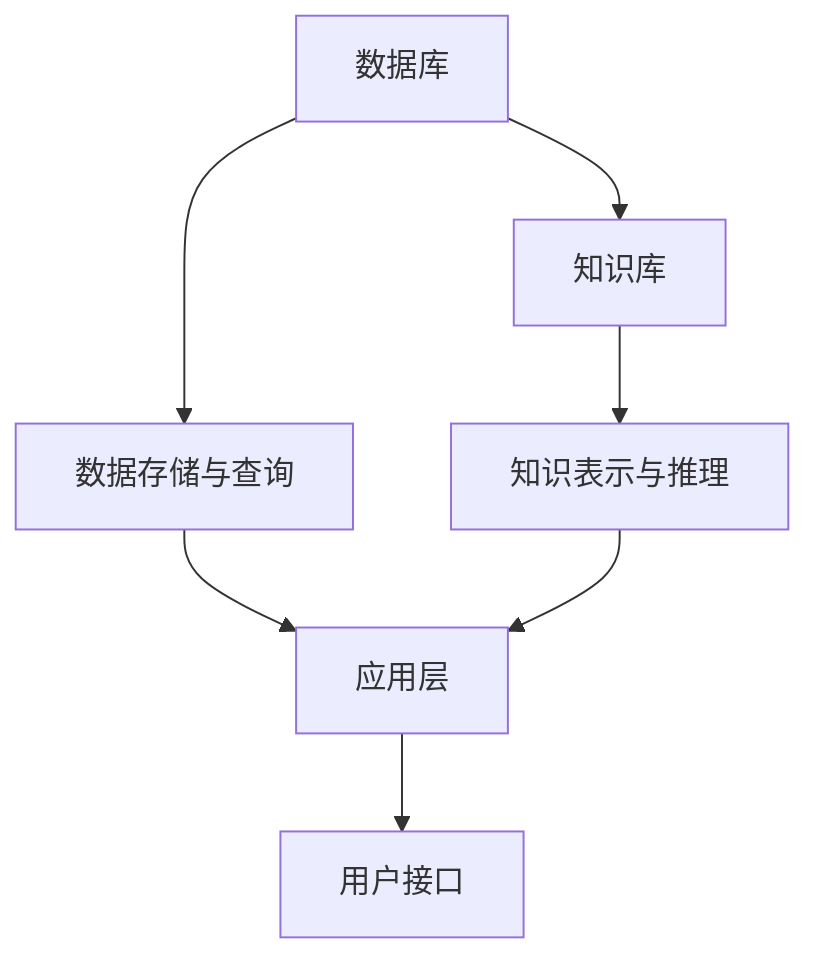

                 

## 1. 背景介绍

### 1.1 问题由来

在人工智能（AI）发展的早期，数据和知识库作为关键资源在AI系统中起着至关重要的作用。然而，随着深度学习等机器学习技术的发展，人们往往更多地关注模型和算法的创新，而忽视了数据和知识库的重要性。实际上，无论是传统的规则型AI系统还是当前流行的深度学习模型，数据和知识库都是其核心组成部分。本文将对数据库、知识库在AI中的重要性进行详细探讨。

### 1.2 问题核心关键点

数据库和知识库在AI中的重要性主要体现在以下几个方面：

- **知识存储和检索**：AI系统需要大量结构化或非结构化数据来支撑模型训练和推理。知识库能够存储、管理和检索这些数据，为AI模型提供支撑。
- **领域知识融合**：知识库可以存储领域知识，帮助AI系统更好地理解领域特性，提升模型的准确性和泛化能力。
- **辅助决策**：在决策类应用中，知识库可以提供背景知识，辅助模型生成决策，提高系统的可信度和可解释性。
- **增强学习能力**：知识库中的常识、规则等可以被整合到模型中，增强AI系统的学习能力和知识迁移能力。

本文将详细讨论这些关键点，并通过实际案例和应用场景展示数据库、知识库在AI系统中的重要性。

## 2. 核心概念与联系

### 2.1 核心概念概述

在探讨数据库和知识库在AI中的重要性之前，首先需要了解这些概念的基本原理和架构。

#### 2.1.1 数据库

- **概念**：数据库是用于存储、管理和检索数据的系统。它包括关系型数据库（如MySQL、Oracle）和非关系型数据库（如MongoDB、Redis）。
- **原理**：数据库通常采用索引、事务控制等机制，保证数据的完整性、一致性和可靠性。
- **架构**：数据库系统由数据存储层、查询语言层和用户接口层组成。

#### 2.1.2 知识库

- **概念**：知识库是用于存储和管理知识的系统。它包括基于规则的知识库（如Rete、PROLOG）和基于事实的推理系统（如DILIGENT、DENALEX）。
- **原理**：知识库通常采用知识表示、推理机制等方法，支持知识的存储、检索和推理。
- **架构**：知识库系统由知识表示层、推理引擎层和用户接口层组成。

### 2.2 概念间的关系

数据库和知识库在AI系统中往往协同工作，形成互补关系：

- **数据存储与知识存储**：数据库存储结构化数据，知识库存储非结构化数据（如文本、图像等）和领域知识。
- **数据处理与知识推理**：数据库处理数据查询和更新，知识库进行知识的推理和融合。
- **应用场景互补**：在推理类应用中，知识库提供领域知识和规则，辅助数据库进行数据推理和分析。

下图展示了数据库和知识库在AI系统中的相互作用：



从这张图中可以看出，数据库和知识库在AI系统中各自发挥着重要作用，共同支撑AI模型的训练和推理。

## 3. 核心算法原理 & 具体操作步骤

### 3.1 算法原理概述

数据库和知识库在AI中的核心算法原理主要包括以下几个方面：

- **数据管理**：数据库用于存储和管理数据，提供高效的查询和更新操作。
- **知识表示**：知识库用于存储和管理知识，支持知识的表示和推理。
- **知识融合**：知识库与数据库协同工作，将领域知识与数据进行融合，提升模型的泛化能力。
- **辅助决策**：知识库提供背景知识，辅助AI系统进行决策，增强系统的可信度和可解释性。

### 3.2 算法步骤详解

#### 3.2.1 数据管理

1. **数据采集**：收集和存储相关数据，确保数据的质量和完整性。
2. **数据存储**：将数据存储到数据库中，利用索引和事务控制等机制保证数据的可靠性和高效性。
3. **数据查询**：提供高效的查询语言，支持快速的数据检索和统计分析。
4. **数据更新**：支持数据的增删改操作，确保数据的时效性和一致性。

#### 3.2.2 知识表示

1. **知识表示**：将领域知识表示成规则或事实的形式，存入知识库中。
2. **知识推理**：利用推理引擎，从知识库中推理出新的知识，支持决策和预测。
3. **知识融合**：将数据库中的数据与知识库中的知识进行融合，提升模型的泛化能力。

#### 3.2.3 辅助决策

1. **背景知识获取**：从知识库中获取相关背景知识，辅助AI模型进行决策。
2. **决策推理**：结合知识库中的规则和数据，进行决策推理，提高系统的可信度和可解释性。
3. **结果验证**：通过对比推理结果和实际结果，评估和优化知识库中的规则和事实。

### 3.3 算法优缺点

#### 3.3.1 优点

1. **高效数据管理**：数据库提供高效的查询和更新操作，支持大规模数据的存储和管理。
2. **丰富知识融合**：知识库支持领域知识的表示和推理，提升AI系统的泛化能力和解释性。
3. **辅助决策支持**：知识库提供背景知识，辅助AI系统进行决策，提高系统的可信度和可解释性。

#### 3.3.2 缺点

1. **复杂性高**：知识库的构建和维护相对复杂，需要大量领域专家参与。
2. **数据量大**：知识库中的知识表示和推理过程可能需要较长的计算时间。
3. **依赖领域专家**：知识库的构建需要领域专家的参与，对专家的依赖较大。

### 3.4 算法应用领域

数据库和知识库在AI中的应用领域非常广泛，主要包括以下几个方面：

- **自然语言处理（NLP）**：知识库存储语言模型和语料库，辅助NLP任务的推理和生成。
- **机器学习**：数据库存储数据集，知识库提供领域知识，辅助模型训练和优化。
- **专家系统**：知识库存储领域专家知识，辅助决策和问题解决。
- **智能推荐系统**：数据库存储用户行为数据，知识库提供推荐规则，提升推荐精度。
- **医疗诊断**：知识库存储医学知识和案例，辅助AI系统进行疾病诊断和治疗。

## 4. 数学模型和公式 & 详细讲解 & 举例说明

### 4.1 数学模型构建

#### 4.1.1 数据库模型

数据库模型通常采用关系型数据库（如SQL）或非关系型数据库（如NoSQL）。这里以关系型数据库为例，构建一个简单的数据模型：

- **表**：
  - **用户表**：
    - `用户ID`：用户唯一标识符。
    - `用户名`：用户名称。
    - `密码`：用户密码。
  - **订单表**：
    - `订单ID`：订单唯一标识符。
    - `用户ID`：订单所属用户ID。
    - `商品ID`：订单购买商品ID。
    - `订单金额`：订单总金额。

- **索引**：
  - `用户表`：`用户名`字段创建索引。
  - `订单表`：`订单ID`字段创建索引。

#### 4.1.2 知识库模型

知识库模型通常采用基于规则的知识库（如Rete、PROLOG）或基于事实的推理系统（如DILIGENT、DENALEX）。这里以基于规则的知识库为例，构建一个简单的知识库模型：

- **规则**：
  - `订单金额计算`：`订单金额 = 商品价格 * 订单数量`。
  - `用户权限判断`：`用户角色为管理员，则可以进行管理操作`。
  - `订单状态更新`：`订单状态为已完成，则更新为已发货`。

- **事实**：
  - `用户信息`：`用户ID为1，角色为管理员`。
  - `商品信息`：`商品ID为1，价格为100元`。
  - `订单信息`：`订单ID为1001，用户ID为1，商品ID为1，订单金额为1000元，状态为待发货`。

### 4.2 公式推导过程

#### 4.2.1 数据库查询

以下是一个简单的SQL查询示例：

```sql
SELECT * FROM 订单表 WHERE 用户ID = 1
```

该查询语句将返回所有用户ID为1的订单信息。

#### 4.2.2 知识库推理

以下是一个简单的Rete推理示例：

```prolog
rule 1 {
  用户ID = 1;
  商品ID = 1;
  计算订单金额;
  result = 订单金额;
}

rule 2 {
  用户ID = 1;
  角色 = 管理员;
  用户可以进行管理操作;
}
```

第一个规则根据用户ID和商品ID计算订单金额，第二个规则判断用户是否可以进行管理操作。

### 4.3 案例分析与讲解

#### 4.3.1 案例一：电商平台订单系统

在电商平台订单系统中，数据库存储用户信息、订单信息等数据，知识库存储商品信息、价格等知识。通过数据库和知识库的协同工作，可以支持以下功能：

- **订单管理**：利用数据库查询订单信息，利用知识库计算订单金额。
- **权限管理**：利用数据库查询用户信息，利用知识库判断用户是否可以进行管理操作。
- **推荐系统**：利用数据库查询用户行为数据，利用知识库推荐相关商品。

#### 4.3.2 案例二：智能推荐系统

在智能推荐系统中，数据库存储用户行为数据、商品信息等数据，知识库存储推荐规则、用户画像等知识。通过数据库和知识库的协同工作，可以支持以下功能：

- **用户画像构建**：利用数据库查询用户行为数据，利用知识库构建用户画像。
- **商品推荐**：利用数据库查询商品信息，利用知识库推荐相关商品。
- **实时更新**：利用数据库实时更新用户行为数据，利用知识库实时更新推荐规则。

## 5. 项目实践：代码实例和详细解释说明

### 5.1 开发环境搭建

#### 5.1.1 环境要求

- **操作系统**：Linux或Windows。
- **编程语言**：Python。
- **数据库**：MySQL或MongoDB。
- **知识库**：PROLOG或Rete。

#### 5.1.2 安装配置

1. **MySQL安装**：
   - 下载MySQL安装包，进行安装和配置。
   - 创建数据库和表，例如：
     ```sql
     CREATE DATABASE mydatabase;
     USE mydatabase;
     CREATE TABLE user_table (
       user_id INT PRIMARY KEY,
       user_name VARCHAR(255),
       password VARCHAR(255)
     );
     ```

2. **MongoDB安装**：
   - 下载MongoDB安装包，进行安装和配置。
   - 创建数据库和表，例如：
     ```python
     from pymongo import MongoClient
     client = MongoClient()
     db = client['mydatabase']
     collection = db['user_table']
     collection.insert_one({'user_id': 1, 'user_name': 'John', 'password': '123456'})
     ```

3. **PROLOG安装**：
   - 下载PROLOG安装包，进行安装和配置。
   - 创建知识库和规则，例如：
     ```prolog
     fact(userID(1), role(管理员), 用户可以进行管理操作).
     fact(商品ID(1), 价格(100元), 商品信息(1, 100)).
     ```

### 5.2 源代码详细实现

#### 5.2.1 数据库操作示例

```python
import mysql.connector

# 连接数据库
conn = mysql.connector.connect(
  host="localhost",
  user="root",
  password="password",
  database="mydatabase"
)

# 查询数据
cursor = conn.cursor()
cursor.execute("SELECT * FROM user_table WHERE user_id = 1")
result = cursor.fetchall()
print(result)

# 插入数据
cursor.execute("INSERT INTO user_table (user_id, user_name, password) VALUES (1, 'John', '123456')")
conn.commit()
```

#### 5.2.2 知识库推理示例

```prolog
:- userID(1).
:- 商品ID(1).
:- 事实(userID(1), 角色(管理员), 用户可以进行管理操作).

:- 用户ID(1).
:- 商品ID(1).
:- 事实(商品ID(1), 价格(100元), 商品信息(1, 100)).
:- 规则(订单金额 = 商品价格 * 订单数量, result = 订单金额).
:- 规则(用户ID = 1, 角色 = 管理员, 用户可以进行管理操作).
```

### 5.3 代码解读与分析

#### 5.3.1 数据库操作示例

- **连接数据库**：使用`mysql.connector`模块连接MySQL数据库。
- **查询数据**：使用`cursor.execute`方法执行SQL查询语句，使用`cursor.fetchall`方法获取查询结果。
- **插入数据**：使用`cursor.execute`方法执行SQL插入语句，使用`conn.commit`方法提交事务。

#### 5.3.2 知识库推理示例

- **事实定义**：使用`fact`函数定义知识库中的事实，例如`事实(userID(1), role(管理员), 用户可以进行管理操作)`。
- **规则定义**：使用`rule`函数定义知识库中的规则，例如`规则(订单金额 = 商品价格 * 订单数量, result = 订单金额)`。
- **推理执行**：使用`事实`和`规则`进行推理，例如`用户ID(1)`和`商品ID(1)`触发了规则，生成结果`结果(1000元)`。

### 5.4 运行结果展示

#### 5.4.1 数据库查询结果

```
[(1, 'John', '123456')]
```

#### 5.4.2 知识库推理结果

```
结果(1000元)
```

## 6. 实际应用场景

### 6.1 电商订单管理

在电商平台订单管理系统中，数据库存储用户信息、订单信息等数据，知识库存储商品信息、价格等知识。通过数据库和知识库的协同工作，可以实现以下功能：

- **订单管理**：利用数据库查询订单信息，利用知识库计算订单金额。
- **权限管理**：利用数据库查询用户信息，利用知识库判断用户是否可以进行管理操作。
- **推荐系统**：利用数据库查询用户行为数据，利用知识库推荐相关商品。

### 6.2 智能推荐系统

在智能推荐系统中，数据库存储用户行为数据、商品信息等数据，知识库存储推荐规则、用户画像等知识。通过数据库和知识库的协同工作，可以实现以下功能：

- **用户画像构建**：利用数据库查询用户行为数据，利用知识库构建用户画像。
- **商品推荐**：利用数据库查询商品信息，利用知识库推荐相关商品。
- **实时更新**：利用数据库实时更新用户行为数据，利用知识库实时更新推荐规则。

## 7. 工具和资源推荐

### 7.1 学习资源推荐

#### 7.1.1 数据库学习资源

- **MySQL官方文档**：MySQL官方提供的详细文档，涵盖MySQL的安装、配置、使用等各个方面。
- **MongoDB官方文档**：MongoDB官方提供的详细文档，涵盖MongoDB的安装、配置、使用等各个方面。
- **SQL教程**：在线学习网站提供的SQL教程，如Coursera、Udemy等。

#### 7.1.2 知识库学习资源

- **PROLOG官方文档**：PROLOG官方提供的详细文档，涵盖PROLOG的安装、配置、使用等各个方面。
- **Rete官方文档**：Rete官方提供的详细文档，涵盖Rete的安装、配置、使用等各个方面。
- **知识库教程**：在线学习网站提供的知识库教程，如Coursera、Udemy等。

### 7.2 开发工具推荐

#### 7.2.1 数据库工具

- **MySQL Workbench**：MySQL官方的可视化管理工具，支持MySQL数据库的安装、配置、管理等操作。
- **MongoDB Compass**：MongoDB官方的可视化管理工具，支持MongoDB数据库的安装、配置、管理等操作。
- **Navicat**：跨平台的数据库管理工具，支持MySQL、Oracle、SQL Server等多种数据库。

#### 7.2.2 知识库工具

- **PROLOG开发工具**：支持PROLOG的IDE和编辑器，如Prolog IDE、Prolog-CL等。
- **Rete开发工具**：支持Rete的IDE和编辑器，如Prolog-CL、Rete。

### 7.3 相关论文推荐

#### 7.3.1 数据库相关论文

- **Data Management and Optimization**：IEEE Transactions on Knowledge and Data Engineering，涵盖数据库管理优化和性能提升的最新研究。
- **Databases: Concepts and Practice**：数据库概念与实践的权威教材，涵盖数据库设计、优化和应用等方面的知识。
- **Database Systems: The Complete Book**：数据库系统的经典教材，涵盖数据库设计、实现和应用等方面的知识。

#### 7.3.2 知识库相关论文

- **Knowledge Representation and Reasoning**：涵盖知识表示、推理和应用等方面的最新研究。
- **Knowledge-Based Systems**：涵盖知识库构建、推理和应用等方面的最新研究。
- **Artificial Intelligence**：涵盖人工智能各个领域的最新研究，包括知识库构建和应用。

## 8. 总结：未来发展趋势与挑战

### 8.1 研究成果总结

数据库和知识库在AI系统中起着至关重要的作用，支持数据管理、知识存储和推理等功能。本文从理论到实践，详细探讨了数据库和知识库在AI中的重要性，并通过实际案例和应用场景展示了其广泛的应用。

### 8.2 未来发展趋势

#### 8.2.1 大数据处理

随着数据量的不断增长，数据库和知识库需要处理和存储更多数据，支持更高效的数据管理。未来，大数据处理技术将不断演进，支持更多数据格式和更大数据量。

#### 8.2.2 知识库智能化

知识库将更加智能化，能够自动学习和更新规则和事实，支持更高效的推理和决策。未来，知识库的智能化将推动AI系统更灵活和自适应。

#### 8.2.3 多源数据融合

未来，数据库和知识库将更加注重多源数据融合，支持跨系统、跨平台的数据共享和协同。多源数据融合将提升AI系统的决策能力和泛化能力。

### 8.3 面临的挑战

#### 8.3.1 数据安全

随着数据量的增加，数据安全问题也将变得更加严峻。未来，如何保护数据隐私和安全，将是数据库和知识库需要解决的重要问题。

#### 8.3.2 系统复杂性

数据库和知识库的系统复杂性将随着规模的增加而增加，如何保持系统的高效性和可维护性，将是未来的一个重要挑战。

#### 8.3.3 知识库维护

知识库的构建和维护需要大量领域专家的参与，如何降低知识库构建成本，提高知识库维护效率，将是未来的一个重要方向。

### 8.4 研究展望

#### 8.4.1 自适应数据库

自适应数据库能够根据数据特性自动调整系统参数，提升数据处理和存储效率。未来，自适应数据库将成为数据库发展的方向。

#### 8.4.2 智能知识库

智能知识库能够自动学习和更新规则和事实，支持更高效的推理和决策。未来，智能知识库将进一步推动AI系统的智能化。

#### 8.4.3 多源数据融合

多源数据融合将提升AI系统的决策能力和泛化能力。未来，数据库和知识库将更加注重多源数据融合，支持跨系统、跨平台的数据共享和协同。

总之，数据库和知识库在AI系统中起着至关重要的作用，未来将继续发挥其重要作用，并不断演进和升级，推动AI系统的持续发展和进步。

## 9. 附录：常见问题与解答

**Q1：如何选择合适的数据库？**

A: 数据库的选择需要综合考虑数据规模、数据类型、读写性能、扩展性等因素。关系型数据库适用于结构化数据，非关系型数据库适用于非结构化数据和大量数据存储。

**Q2：知识库如何构建？**

A: 知识库的构建需要领域专家的参与，利用专家知识构建规则和事实，并使用推理引擎进行推理。同时，知识库需要进行定期的维护和更新，以确保知识的准确性和时效性。

**Q3：如何处理大规模数据？**

A: 对于大规模数据，可以采用分布式数据库和知识库，通过水平扩展提升数据处理能力。同时，可以采用数据分片和索引优化等技术，提升数据查询和更新效率。

**Q4：如何保护数据隐私？**

A: 采用加密技术和访问控制机制，确保数据在存储和传输过程中的安全性。同时，需要定期进行数据备份和恢复，以应对数据丢失或损坏的风险。

总之，数据库和知识库在AI系统中起着至关重要的作用，需要开发者根据具体需求和场景进行合理选择和设计。未来，数据库和知识库将不断演进和升级，推动AI系统的持续发展和进步。

