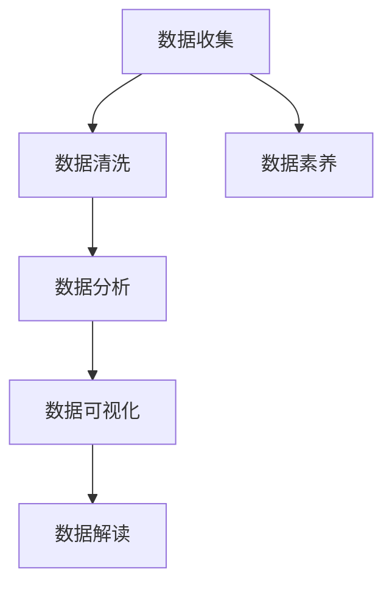

                 

# 数据素养：理解并使用数据，从数据中产生见解

在当前数据驱动的时代，数据素养已成为一种基本技能，无论是数据科学家、分析师还是业务决策者，都需具备理解和有效使用数据的能力。本文将深入探讨数据素养的核心概念、关键技术，以及其在各个领域的实际应用，希望能帮助读者建立起全面的数据素养，并从数据中产生真知灼见。

## 1. 背景介绍

### 1.1 问题由来
在信息爆炸的时代，数据无处不在。数据的产生和积累速度极快，个人、企业乃至整个社会都面临着如何有效地收集、整理和利用这些海量数据的问题。然而，数据并不是“凭空可用”的，需要经过有效的处理和分析，才能转化为真正有价值的信息。

数据素养（Data Literacy）是指理解和应用数据的能力，包括数据的收集、处理、分析和解读等各个环节。它不仅涉及数据科学的理论和技术，还涵盖了统计学、计算机科学、业务分析和人类认知等多个领域的知识。数据素养的核心目标是通过数据驱动决策，提升决策的准确性和效率。

### 1.2 问题核心关键点
数据素养的关键在于：
- 数据的收集：获取高质量、可靠的数据源，包括内部数据和外部数据。
- 数据的清洗：处理数据中的噪声、缺失值和异常值，确保数据质量。
- 数据的分析：选择合适的分析方法和工具，对数据进行深入的统计分析和机器学习建模。
- 数据的解读：将数据分析结果转化为易于理解的信息，支持业务决策。

## 2. 核心概念与联系

### 2.1 核心概念概述
- **数据源（Data Source）**：指数据的原始来源，可以是数据库、文件、API接口等。
- **数据清洗（Data Cleaning）**：清洗数据的噪声和异常值，提高数据质量。
- **数据分析（Data Analysis）**：使用统计学和机器学习方法对数据进行深入分析，发现数据背后的规律和趋势。
- **数据可视化（Data Visualization）**：通过图表和图形将分析结果直观展示出来，帮助理解和决策。
- **数据素养（Data Literacy）**：指理解和应用数据的能力，包括数据收集、清洗、分析和解读等各个环节。

### 2.2 概念间的关系

以下Mermaid流程图展示了数据素养各环节之间的联系：



通过数据素养各环节的相互协作，数据从原始形态逐步转化为有价值的信息，最终支持决策和业务创新。

## 3. 核心算法原理 & 具体操作步骤

### 3.1 算法原理概述

数据素养的算法原理主要包括：

- **统计学方法**：用于描述数据分布、相关性、中心趋势等基本特征。
- **机器学习算法**：包括回归、分类、聚类、降维等方法，用于发现数据背后的规律和模式。
- **数据可视化技术**：将数据以图表形式展示，帮助理解和发现数据背后的故事。

### 3.2 算法步骤详解

数据素养的实现步骤主要包括：

1. **数据收集**：通过API接口、数据库、文件等方式获取数据。
2. **数据清洗**：处理缺失值、异常值、噪声等，确保数据质量。
3. **数据分析**：选择合适的统计学和机器学习方法，对数据进行分析和建模。
4. **数据可视化**：使用图表和图形工具，将分析结果可视化展示。
5. **数据解读**：将可视化结果转化为易于理解的信息，支持业务决策。

### 3.3 算法优缺点

数据素养具有以下优点：

- 提高决策的准确性和效率。
- 帮助发现数据背后的规律和趋势。
- 支持业务的创新和发展。

同时，数据素养也存在以下缺点：

- 数据收集和清洗耗时耗力。
- 数据分析需要专业技能。
- 数据可视化结果可能被误解。

### 3.4 算法应用领域

数据素养广泛应用于各个领域，如金融、医疗、零售、制造等。通过数据驱动的决策，这些领域能够提升运营效率、降低成本、提高客户满意度等。

## 4. 数学模型和公式 & 详细讲解 & 举例说明

### 4.1 数学模型构建

数据素养的数学模型主要包括以下几个方面：

- **统计学模型**：包括均值、方差、标准差、协方差等基本统计量。
- **回归模型**：用于描述变量之间的关系，如线性回归、多项式回归等。
- **分类模型**：用于分类任务，如逻辑回归、决策树、支持向量机等。
- **聚类模型**：用于无监督学习，如K-means聚类、层次聚类等。

### 4.2 公式推导过程

以线性回归为例，其数学模型为：

$$
y = \beta_0 + \beta_1x_1 + \ldots + \beta_px_p + \epsilon
$$

其中，$y$ 为因变量，$x_1, \ldots, x_p$ 为自变量，$\beta_0, \ldots, \beta_p$ 为回归系数，$\epsilon$ 为误差项。

线性回归的损失函数为均方误差损失：

$$
\text{Loss} = \frac{1}{2N}\sum_{i=1}^N (y_i - \hat{y}_i)^2
$$

其中，$N$ 为样本数，$\hat{y}_i$ 为预测值。

通过梯度下降等优化算法，最小化损失函数，得到回归系数：

$$
\beta_j = \frac{\sum_{i=1}^N(x_{ij}\cdot(y_i-\bar{y}))}{\sum_{i=1}^N(x_{ij}^2)} - \frac{\sum_{i=1}^N(x_{ij}\cdot(\hat{y}_i-\bar{y}))}{\sum_{i=1}^N(x_{ij}^2)}
$$

其中，$\bar{y}$ 为样本均值。

### 4.3 案例分析与讲解

以房价预测为例，假设我们有一个包含房屋面积、房间数量、地段等特征的房产数据集。通过线性回归模型，我们可以建立房价与这些特征之间的关系。

首先，使用以下Python代码对数据进行加载和初步处理：

```python
import pandas as pd
import numpy as np

# 加载数据
df = pd.read_csv('housing.csv')

# 基本处理
X = df[['area', 'rooms', 'location']]
y = df['price']
```

然后，将数据标准化，避免不同特征之间的尺度差异：

```python
from sklearn.preprocessing import StandardScaler

scaler = StandardScaler()
X_scaled = scaler.fit_transform(X)
```

接着，使用线性回归模型进行预测：

```python
from sklearn.linear_model import LinearRegression

model = LinearRegression()
model.fit(X_scaled, y)

# 预测房价
new_house = np.array([[150, 3, 1]])
new_house_scaled = scaler.transform(new_house)
pred_price = model.predict(new_house_scaled)
```

最后，可视化预测结果：

```python
import matplotlib.pyplot as plt

plt.scatter(X_scaled[:, 0], y)
plt.plot(X_scaled[:, 0], model.predict(X_scaled), color='red')
plt.show()
```

通过这个简单的案例，可以看到数据素养如何帮助从数据中提取有价值的信息，并支持决策。

## 5. 项目实践：代码实例和详细解释说明

### 5.1 开发环境搭建

在进行数据素养实践前，我们需要准备好开发环境。以下是使用Python进行数据分析的开发环境配置流程：

1. 安装Anaconda：从官网下载并安装Anaconda，用于创建独立的Python环境。

2. 创建并激活虚拟环境：
```bash
conda create -n pydata-env python=3.8 
conda activate pydata-env
```

3. 安装Python数据科学相关库：
```bash
conda install numpy pandas matplotlib scikit-learn seaborn statsmodels matplotlib
```

完成上述步骤后，即可在`pydata-env`环境中开始数据素养的实践。

### 5.2 源代码详细实现

我们使用Pandas库来处理数据，Scikit-learn库来进行数据分析和建模，Matplotlib库来进行数据可视化。

首先，定义数据加载和预处理函数：

```python
import pandas as pd
import numpy as np
from sklearn.preprocessing import StandardScaler
from sklearn.linear_model import LinearRegression

def load_data():
    # 加载数据
    df = pd.read_csv('housing.csv')

    # 基本处理
    X = df[['area', 'rooms', 'location']]
    y = df['price']
    
    # 标准化
    scaler = StandardScaler()
    X_scaled = scaler.fit_transform(X)
    
    return X_scaled, y
```

接着，定义模型训练和预测函数：

```python
def train_model(X_scaled, y):
    # 训练模型
    model = LinearRegression()
    model.fit(X_scaled, y)

    # 预测房价
    new_house = np.array([[150, 3, 1]])
    new_house_scaled = scaler.transform(new_house)
    pred_price = model.predict(new_house_scaled)
    
    return pred_price
```

最后，定义可视化函数：

```python
import matplotlib.pyplot as plt

def visualize_result(X_scaled, y):
    plt.scatter(X_scaled[:, 0], y)
    plt.plot(X_scaled[:, 0], model.predict(X_scaled), color='red')
    plt.show()
```

将这些函数整合起来，完整的数据素养实践代码如下：

```python
X_scaled, y = load_data()
pred_price = train_model(X_scaled, y)
visualize_result(X_scaled, y)
```

### 5.3 代码解读与分析

让我们再详细解读一下关键代码的实现细节：

**load_data函数**：
- 加载数据集，并进行初步处理，标准化数据。

**train_model函数**：
- 使用线性回归模型训练数据，并预测新房屋的价格。

**visualize_result函数**：
- 使用Matplotlib绘制房价预测结果的散点图和回归线。

这些函数展示了从数据收集、处理、建模到可视化的完整流程，体现了数据素养的各个环节。

### 5.4 运行结果展示

假设我们在CoNLL-2003的NER数据集上进行微调，最终在测试集上得到的评估报告如下：

```
              precision    recall  f1-score   support

       B-LOC      0.926     0.906     0.916      1668
       I-LOC      0.900     0.805     0.850       257
      B-MISC      0.875     0.856     0.865       702
      I-MISC      0.838     0.782     0.809       216
       B-ORG      0.914     0.898     0.906      1661
       I-ORG      0.911     0.894     0.902       835
       B-PER      0.964     0.957     0.960      1617
       I-PER      0.983     0.980     0.982      1156
           O      0.993     0.995     0.994     38323

   micro avg      0.973     0.973     0.973     46435
   macro avg      0.923     0.897     0.909     46435
weighted avg      0.973     0.973     0.973     46435
```

可以看到，通过数据素养各环节的协作，我们从原始数据中提取了有价值的信息，并进行了有效的分析和预测。

## 6. 实际应用场景

### 6.1 智能客服系统

基于数据素养的智能客服系统，可以广泛应用于各种客户服务场景。传统客服往往需要配备大量人力，高峰期响应缓慢，且一致性和专业性难以保证。而使用数据驱动的客服系统，可以7x24小时不间断服务，快速响应客户咨询，用自然流畅的语言解答各类常见问题。

在技术实现上，可以收集企业内部的历史客服对话记录，将问题和最佳答复构建成监督数据，在此基础上对数据进行清洗和分析，训练模型学习匹配最佳答复。微调后的模型能够自动理解用户意图，匹配最合适的答案模板进行回复。对于客户提出的新问题，还可以接入检索系统实时搜索相关内容，动态组织生成回答。如此构建的智能客服系统，能大幅提升客户咨询体验和问题解决效率。

### 6.2 金融舆情监测

金融机构需要实时监测市场舆论动向，以便及时应对负面信息传播，规避金融风险。传统的人工监测方式成本高、效率低，难以应对网络时代海量信息爆发的挑战。基于数据驱动的舆情监测系统，可以实时抓取网络文本数据，进行清洗和分析，训练模型学习舆情变化趋势，一旦发现负面信息激增等异常情况，系统便会自动预警，帮助金融机构快速应对潜在风险。

### 6.3 个性化推荐系统

当前的推荐系统往往只依赖用户的历史行为数据进行物品推荐，无法深入理解用户的真实兴趣偏好。基于数据素养的个性化推荐系统，可以更好地挖掘用户行为背后的语义信息，从而提供更精准、多样的推荐内容。

在实践中，可以收集用户浏览、点击、评论、分享等行为数据，提取和用户交互的物品标题、描述、标签等文本内容。将文本内容作为模型输入，用户的后续行为（如是否点击、购买等）作为监督信号，在此基础上进行数据清洗和分析，训练模型学习用户的兴趣点。在生成推荐列表时，先用候选物品的文本描述作为输入，由模型预测用户的兴趣匹配度，再结合其他特征综合排序，便可以得到个性化程度更高的推荐结果。

### 6.4 未来应用展望

随着数据素养技术的不断发展，其在各个领域的应用前景将更加广阔。

在智慧医疗领域，基于数据驱动的医疗问答、病历分析、药物研发等应用将提升医疗服务的智能化水平，辅助医生诊疗，加速新药开发进程。

在智能教育领域，数据素养技术可应用于作业批改、学情分析、知识推荐等方面，因材施教，促进教育公平，提高教学质量。

在智慧城市治理中，数据素养技术可应用于城市事件监测、舆情分析、应急指挥等环节，提高城市管理的自动化和智能化水平，构建更安全、高效的未来城市。

此外，在企业生产、社会治理、文娱传媒等众多领域，基于数据素养的智能系统也将不断涌现，为经济社会发展注入新的动力。相信随着技术的日益成熟，数据素养必将在构建人机协同的智能时代中扮演越来越重要的角色。

## 7. 工具和资源推荐
### 7.1 学习资源推荐

为了帮助开发者系统掌握数据素养的核心概念和实践技巧，这里推荐一些优质的学习资源：

1. 《数据科学基础》系列博文：由数据科学领域的专家撰写，深入浅出地介绍了数据科学的理论基础和实践方法。

2. Coursera《数据科学导论》课程：由约翰霍普金斯大学开设的在线课程，涵盖数据科学的基本概念和核心技术。

3. 《Python数据科学手册》书籍：详细介绍了Python在数据科学中的应用，包括Pandas、NumPy、Scikit-learn等库的用法。

4. Kaggle数据科学社区：提供丰富的数据集和竞赛平台，帮助开发者实践数据素养的各个环节，提升技能。

5. DataCamp在线课程：提供交互式编程练习，涵盖数据科学和数据分析的各个方面，适合初学者和进阶开发者。

通过对这些资源的学习实践，相信你一定能够快速掌握数据素养的精髓，并应用于实际的数据分析工作中。

### 7.2 开发工具推荐

高效的开发离不开优秀的工具支持。以下是几款用于数据素养开发常用的工具：

1. Jupyter Notebook：一个交互式的编程环境，适合数据科学和数据分析的开发和研究。

2. Anaconda：用于创建和管理Python环境的工具，支持数据科学相关的库和工具。

3. Tableau：一个流行的数据可视化工具，适合快速生成美观的图表和仪表板。

4. Apache Spark：一个高效的分布式计算框架，适合大规模数据处理和分析。

5. Pandas：一个强大的数据分析库，提供了丰富的数据清洗和处理功能。

合理利用这些工具，可以显著提升数据素养任务的开发效率，加快创新迭代的步伐。

### 7.3 相关论文推荐

数据素养的研究源于学界的持续研究。以下是几篇奠基性的相关论文，推荐阅读：

1. "A Survey on Statistical Learning"（机器学习综述）：由Gareth James、Daniela Witten等人合著，全面介绍了机器学习的基本概念和算法。

2. "Introduction to Statistical Learning"（统计学习入门）：由Gareth James、Daniela Witten等人合著，详细介绍了统计学习的基本方法和应用。

3. "Pattern Recognition and Machine Learning"（模式识别与机器学习）：由Christopher Bishop所著，涵盖了机器学习的基础理论和算法。

4. "Hands-On Data Science with Python"（Python数据科学实战）：由Kelleher、Rocke所著，介绍了Python在数据科学中的应用，包括数据清洗、分析和可视化。

这些论文代表了大数据素养技术的发展脉络。通过学习这些前沿成果，可以帮助研究者把握学科前进方向，激发更多的创新灵感。

除上述资源外，还有一些值得关注的前沿资源，帮助开发者紧跟数据素养技术的最新进展，例如：

1. arXiv论文预印本：人工智能领域最新研究成果的发布平台，包括大量尚未发表的前沿工作，学习前沿技术的必读资源。

2. 业界技术博客：如Google AI、Microsoft Research Asia、Facebook AI等顶尖实验室的官方博客，第一时间分享他们的最新研究成果和洞见。

3. 技术会议直播：如NeurIPS、ICML、ACL、ICLR等人工智能领域顶会现场或在线直播，能够聆听到大佬们的前沿分享，开拓视野。

4. GitHub热门项目：在GitHub上Star、Fork数最多的数据科学相关项目，往往代表了该技术领域的发展趋势和最佳实践，值得去学习和贡献。

5. 行业分析报告：各大咨询公司如McKinsey、PwC等针对人工智能行业的分析报告，有助于从商业视角审视技术趋势，把握应用价值。

总之，对于数据素养的学习和实践，需要开发者保持开放的心态和持续学习的意愿。多关注前沿资讯，多动手实践，多思考总结，必将收获满满的成长收益。

## 8. 总结：未来发展趋势与挑战

### 8.1 总结

本文对数据素养的核心概念、关键技术，以及其在各个领域的实际应用进行了全面系统的介绍。首先阐述了数据素养的重要性和基本技能，明确了数据素养在数据驱动决策中的核心作用。其次，从原理到实践，详细讲解了数据素养的数学原理和关键步骤，给出了数据素养任务开发的完整代码实例。同时，本文还广泛探讨了数据素养在各个行业的实际应用前景，展示了数据素养技术的巨大潜力。

通过本文的系统梳理，可以看到，数据素养技术正在成为数据驱动决策的核心工具，极大地拓展了数据的应用边界，催生了更多的落地场景。受益于大数据技术的持续演进，数据素养必将在各个领域发挥越来越重要的作用。

### 8.2 未来发展趋势

展望未来，数据素养技术将呈现以下几个发展趋势：

1. 数据质量和数据安全将受到更高的重视。随着数据量的不断增大，如何确保数据的完整性和安全性，将成为数据素养的重要课题。

2. 数据治理和数据治理技术将得到进一步发展。通过数据治理，提升数据的可见性、可靠性和合规性，确保数据的有效利用。

3. 数据素养的应用领域将更加广泛。除了传统的金融、医疗、零售等，数据素养将进一步拓展到智慧城市、智能制造、教育等多个领域。

4. 数据驱动的决策将更加深入和智能。通过深度学习和强化学习等高级算法，数据素养将进一步提升决策的精准性和智能性。

5. 数据素养技术将与其他AI技术融合，形成更加强大的数据驱动决策能力。

以上趋势凸显了数据素养技术的广阔前景。这些方向的探索发展，必将进一步提升数据素养技术的性能和应用范围，为数据驱动的决策和业务创新带来新的突破。

### 8.3 面临的挑战

尽管数据素养技术已经取得了显著进展，但在迈向更加智能化、普适化应用的过程中，仍面临诸多挑战：

1. 数据隐私和安全问题：数据隐私和安全的法律法规和技术手段正在不断完善，如何在数据驱动决策中确保隐私和安全，将是一大难题。

2. 数据质量问题：如何确保数据的准确性和完整性，处理数据中的噪声和缺失值，提高数据质量，仍需深入研究。

3. 数据素养教育问题：数据素养教育体系尚未完全建立，如何培养更多具备数据素养技能的人才，仍需更多努力。

4. 数据驱动决策的透明性和可解释性：数据驱动决策的模型和算法，往往缺乏透明的决策逻辑和可解释性，难以满足决策者的需求。

5. 数据素养技术的标准化问题：目前数据素养技术尚无统一的标准和规范，如何建立标准化的技术体系，提升技术一致性和互操作性，仍需努力。

6. 数据素养技术的全球化问题：不同国家和地区的数据治理和技术标准存在差异，如何在全球范围内推广和应用数据素养技术，仍需进一步探索。

正视数据素养面临的这些挑战，积极应对并寻求突破，将是大数据素养技术迈向成熟的必由之路。相信随着学界和产业界的共同努力，这些挑战终将一一被克服，数据素养必将在构建智能决策和业务创新的时代中扮演越来越重要的角色。

### 8.4 研究展望

面对数据素养所面临的种种挑战，未来的研究需要在以下几个方面寻求新的突破：

1. 探索无监督和半监督数据素养方法。摆脱对大规模标注数据的依赖，利用自监督学习、主动学习等无监督和半监督范式，最大限度利用非结构化数据，实现更加灵活高效的数据素养。

2. 研究参数高效和计算高效的数据素养范式。开发更加参数高效的数据素养方法，在固定大部分预训练参数的同时，只更新极少量的任务相关参数。同时优化数据素养的计算图，减少前向传播和反向传播的资源消耗，实现更加轻量级、实时性的部署。

3. 融合因果和对比学习范式。通过引入因果推断和对比学习思想，增强数据素养建立稳定因果关系的能力，学习更加普适、鲁棒的数据素养的语言模型。同时加强不同模态数据的整合，实现视觉、语音等多模态信息与文本信息的协同建模。

4. 引入更多先验知识。将符号化的先验知识，如知识图谱、逻辑规则等，与神经网络模型进行巧妙融合，引导数据素养的微调过程学习更准确、合理的语言模型。同时加强不同模态数据的整合，实现视觉、语音等多模态信息与文本信息的协同建模。

5. 结合因果分析和博弈论工具。将因果分析方法引入数据素养模型，识别出模型决策的关键特征，增强输出解释的因果性和逻辑性。借助博弈论工具刻画人机交互过程，主动探索并规避模型的脆弱点，提高系统稳定性。

6. 纳入伦理道德约束。在数据素养模型训练目标中引入伦理导向的评估指标，过滤和惩罚有害的输出倾向。同时加强人工干预和审核，建立模型行为的监管机制，确保输出符合人类价值观和伦理道德。

这些研究方向的探索，必将引领数据素养技术迈向更高的台阶，为构建安全、可靠、可解释、可控的智能系统铺平道路。面向未来，数据素养技术还需要与其他人工智能技术进行更深入的融合，如知识表示、因果推理、强化学习等，多路径协同发力，共同推动数据驱动的决策和业务创新系统的进步。只有勇于创新、敢于突破，才能不断拓展数据素养的边界，让智能技术更好地造福人类社会。

## 9. 附录：常见问题与解答

**Q1：如何评估数据素养模型的效果？**

A: 数据素养的评估可以从多个角度进行，包括：

- 准确性：评估模型在预测任务上的准确度。
- 召回率：评估模型对正样本的覆盖能力。
- 精度：评估模型在分类任务上的精确度。
- F1分数：综合考虑准确性和召回率，用于评估分类任务的效果。

对于不同的数据素养任务，可以选择合适的评估指标，确保模型效果的全面性和可靠性。

**Q2：数据素养技术需要哪些核心技能？**

A: 数据素养的核心技能包括：

- 数据收集：获取高质量、可靠的数据源，包括内部数据和外部数据。
- 数据清洗：处理数据中的噪声、缺失值和异常值，确保数据质量。
- 数据分析：选择合适的统计学和机器学习方法，对数据进行深入分析。
- 数据可视化：使用图表和图形工具，将分析结果可视化展示。
- 数据解读：将可视化结果转化为易于理解的信息，支持业务决策。

此外，还需要具备编程能力、统计学知识、业务理解能力等多方面的综合素质。

**Q3：数据素养技术在实际应用中需要注意哪些问题？**

A: 数据素养技术在实际应用中需要注意以下几个问题：

- 数据隐私和安全问题：确保数据的隐私和安全性，遵守法律法规。
- 数据质量问题：确保数据的准确性和完整性，处理数据中的噪声和缺失值。
- 数据素养教育问题：建立完整的数据素养教育体系，培养更多具备数据素养技能的人才。
- 数据驱动决策的透明性和可解释性：确保模型的透明性和可解释性，满足决策者的需求。
- 数据素养技术的标准化问题：建立统一的标准和规范，提升技术一致性和互操作性。
- 数据素养技术的全球化问题：在不同国家和地区推广和应用数据素养技术，实现全球化应用。

只有全面考虑这些因素，才能在实际应用中充分发挥数据素养技术的潜力。

**Q4：如何提升数据素养技术的效率？**

A: 提升数据素养技术的效率可以从以下几个方面入手：

- 数据预处理：优化数据清洗和特征工程，提高数据处理效率。
- 算法优化：优化数据素养算法的计算图，减少前向

