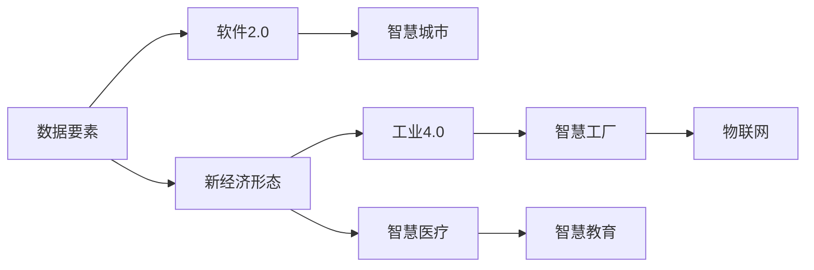
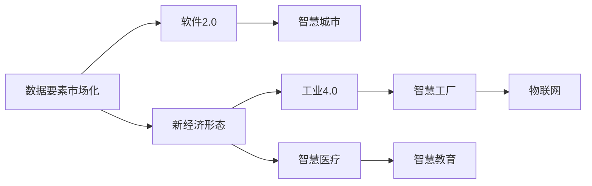
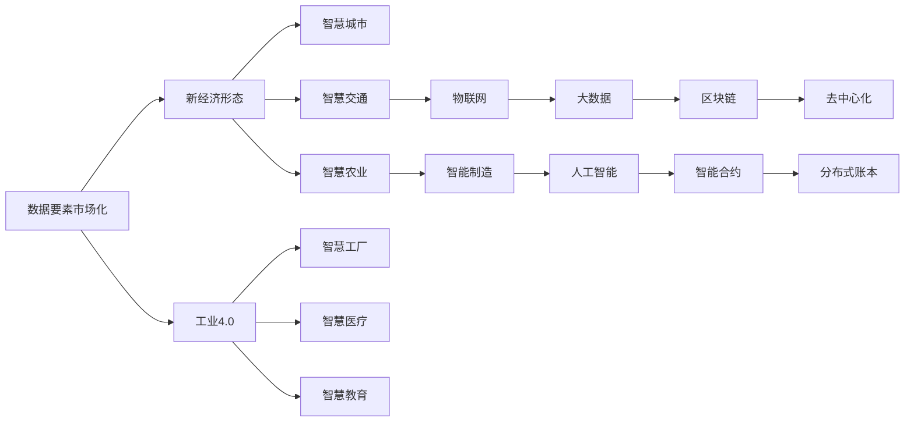
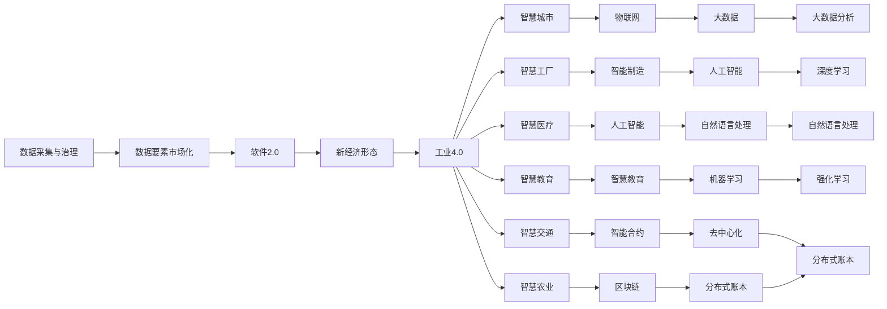

                 

# 数据要素市场化,软件2.0催生新经济形态

> 关键词：数据要素市场化,软件2.0,新经济形态,人工智能,工业4.0,智慧城市

## 1. 背景介绍

### 1.1 问题由来

随着信息技术的高速发展，数据已经成为企业、政府、科研机构等各类机构不可或缺的战略资源。数据在驱动经济社会发展、提升政府治理效能、助力科技创新等方面发挥着越来越重要的作用。然而，传统的以“输入-输出”为主的计算范式已经难以满足数据的全面应用需求，如何将数据有效转化为有价值的知识成为当前亟需解决的重要问题。

近年来，软件2.0的概念被广泛提出，它指的是一种新的软件开发范式，强调软件能力能够主动学习并推动软件自身进化，以及软件开发全生命周期向基于数据驱动的自动化、智能化的方向转变。在软件2.0的推动下，数据要素市场化作为新经济形态的重要组成部分，正逐渐成为推动技术进步、促进产业升级的重要引擎。

### 1.2 问题核心关键点

数据要素市场化，是指将数据作为一种独立的生产要素，通过市场机制对其进行优化配置，使其在生产、流通、分配等各环节中发挥更大的作用，进而推动经济社会高质量发展的过程。在数据要素市场化的背景下，软件2.0的引入将大幅提升数据要素的价值，通过智能软件实现数据的自动化处理、智能分析和应用，进而催生新的经济形态。

数据要素市场化的核心关键点包括：

- **数据要素定义**：明确数据要素在生产、流通、分配等环节中的地位和作用。
- **数据要素采集与治理**：通过数据采集与治理技术，形成高质量的数据资产。
- **数据要素市场化机制**：建立健全数据要素市场化机制，保障数据交易的公平、透明、可信。
- **数据要素应用场景**：探索数据要素在各行业中的应用场景，推动数据要素的广泛应用。

数据要素市场化与软件2.0的结合，将使数据要素不再是单纯的“原材料”，而是能够通过智能软件实现自主演化、自动化处理、智能化分析与应用，从而催生新的经济形态。

### 1.3 问题研究意义

数据要素市场化和软件2.0的结合，对于推动经济社会高质量发展具有重要意义：

1. **驱动经济社会发展**：通过数据要素市场化，可以实现数据的最大化利用，驱动经济高质量发展。
2. **提升政府治理效能**：政府可以通过数据要素市场化，实现数字化转型，提升公共服务水平。
3. **助力科技创新**：数据要素市场化可以为科研机构和企业提供更多数据资源，推动科技创新。
4. **促进产业升级**：通过软件2.0技术，可以将数据要素与各产业深度融合，推动产业升级。
5. **实现经济结构优化**：数据要素市场化有助于优化经济结构，提升全要素生产率。
6. **构建智慧社会**：数据要素市场化与软件2.0的结合，有助于构建智慧城市、智慧企业等智慧社会形态。

数据要素市场化与软件2.0的结合，将使数据要素真正成为推动新经济形态发展的核心要素，为构建更加开放、智能、协同的经济社会奠定基础。

## 2. 核心概念与联系

### 2.1 核心概念概述

为更好地理解数据要素市场化与软件2.0的结合，本节将介绍几个密切相关的核心概念：

- **数据要素**：指能够用于支持决策、创新、管理、服务等各种活动的数据集合，包括结构化数据、非结构化数据、半结构化数据等。
- **软件2.0**：强调软件能够通过自身学习不断进化、智能化，并推动软件开发全生命周期向基于数据驱动的自动化、智能化的方向转变。
- **新经济形态**：指基于新技术、新模式、新业态的新型经济结构，如智慧城市、智慧工厂、智慧医疗等。
- **工业4.0**：指以信息物理系统(CPS)为核心的智能化生产方式，实现生产过程的智能化、自动化、协同化。
- **智慧城市**：指通过信息技术手段，实现城市管理和服务全面智能化。

这些核心概念之间的逻辑关系可以通过以下Mermaid流程图来展示：



这个流程图展示了大数据要素市场化与软件2.0的结合，以及与新经济形态、工业4.0、智慧城市等概念之间的联系。

### 2.2 概念间的关系

这些核心概念之间存在着紧密的联系，形成了数据要素市场化与软件2.0结合的完整生态系统。下面我们通过几个Mermaid流程图来展示这些概念之间的关系。

#### 2.2.1 数据要素市场化与软件2.0的关系



这个流程图展示了数据要素市场化与软件2.0的结合，以及与新经济形态、工业4.0、智慧城市等概念之间的联系。

#### 2.2.2 数据要素市场化与新经济形态的关系



这个流程图展示了数据要素市场化与新经济形态的联系，以及与之相关的各项技术和应用。

### 2.3 核心概念的整体架构

最后，我们用一个综合的流程图来展示这些核心概念在大数据要素市场化与软件2.0结合过程中的整体架构：



这个综合流程图展示了从数据采集与治理到数据要素市场化，再到软件2.0技术的部署与应用，最后到新经济形态的构建的全过程。

## 3. 核心算法原理 & 具体操作步骤
### 3.1 算法原理概述

数据要素市场化与软件2.0的结合，本质上是一个通过智能软件实现数据要素价值最大化的过程。其核心思想是：将数据要素视作输入，通过软件2.0技术的智能化处理，形成新的知识输出，最终实现数据要素的价值最大化。

形式化地，假设输入为原始数据集 $D$，输出为模型预测结果 $Y$。数据要素市场化与软件2.0的结合过程可以表示为：

$$
Y = F(D; \theta)
$$

其中，$F$ 为软件2.0模型，$\theta$ 为模型参数。通过优化模型 $F$ 的参数 $\theta$，使模型 $F$ 能够在给定数据 $D$ 的情况下，最大化输出结果 $Y$ 的效用。

### 3.2 算法步骤详解

数据要素市场化与软件2.0的结合，一般包括以下几个关键步骤：

**Step 1: 数据采集与治理**

- 选择合适的数据采集工具，如爬虫、API接口、传感器等，从不同数据源采集数据。
- 进行数据清洗、去重、标准化等预处理，形成高质量的数据资产。
- 对数据进行特征工程，提取有价值的数据特征。

**Step 2: 数据要素市场化**

- 设计数据要素市场化机制，包括数据定价、交易平台、版权保护等。
- 搭建数据交易平台，实现数据要素的线上交易。
- 建立数据要素的监管机制，保障数据交易的公平、透明、可信。

**Step 3: 软件2.0技术引入**

- 选择适合数据要素处理的软件2.0技术，如机器学习、深度学习、自然语言处理等。
- 设计合适的软件2.0模型架构，实现数据要素的智能化处理。
- 训练和优化软件2.0模型，使其能够高效地处理数据要素。

**Step 4: 数据要素应用**

- 将处理后的数据要素应用于实际场景，如智能决策、智能制造、智慧医疗等。
- 通过软件2.0技术，实现数据的自动化、智能化处理，提升决策效率和精度。
- 不断迭代和优化软件2.0模型，确保数据要素的持续应用效果。

**Step 5: 数据要素价值评估**

- 建立数据要素价值评估体系，通过定量分析评估数据要素的贡献。
- 通过数据要素市场化的反馈机制，不断调整数据要素定价和交易策略。

### 3.3 算法优缺点

数据要素市场化与软件2.0的结合，具有以下优点：

1. **提高数据利用效率**：通过软件2.0技术，实现数据的自动化处理、智能化分析与应用，大幅提高数据利用效率。
2. **促进数据要素市场化**：通过建立健全的数据要素市场化机制，推动数据要素的广泛应用和交易。
3. **提升决策效率和精度**：通过软件2.0技术，实现数据的智能化处理，提升决策效率和精度。
4. **推动经济高质量发展**：数据要素市场化与软件2.0的结合，推动数据要素在各行业中的应用，助力经济高质量发展。

同时，该方法也存在一些局限性：

1. **数据质量和治理难度大**：高质量的数据资产需要复杂的采集、清洗和治理，数据质量和治理难度大。
2. **技术复杂度高**：软件2.0技术复杂度高，需要高水平的技术团队进行开发和维护。
3. **数据安全与隐私风险**：数据要素市场化涉及大量敏感数据，需要严格的数据安全与隐私保护措施。
4. **利益分配机制不完善**：数据要素市场化涉及多方利益，利益分配机制不完善可能导致利益冲突。
5. **技术应用门槛高**：软件2.0技术应用门槛高，需要企业具备相应的技术能力和资源。

尽管存在这些局限性，但数据要素市场化与软件2.0的结合，仍是大数据时代下推动新经济形态发展的重要方向。

### 3.4 算法应用领域

数据要素市场化与软件2.0的结合，已经在多个领域得到广泛应用，例如：

- **智能决策支持系统**：利用软件2.0技术，对数据要素进行智能化处理，提供精准的决策支持。
- **智慧城市建设**：通过大数据、人工智能等技术，实现城市管理的全面智能化。
- **工业4.0应用**：利用软件2.0技术，实现生产过程的智能化、自动化、协同化。
- **智慧医疗**：利用数据要素，结合人工智能技术，实现医疗诊断、治疗等智能化应用。
- **智慧农业**：利用大数据、人工智能等技术，实现农业生产的智能化、自动化。
- **智慧交通**：利用数据要素，结合人工智能技术，实现交通管理的智能化。
- **智能制造**：利用数据要素，结合人工智能技术，实现制造业的智能化转型。

除了上述这些应用领域外，数据要素市场化与软件2.0的结合还将在更多场景中得到应用，为各行业带来新的发展机遇。

## 4. 数学模型和公式 & 详细讲解 & 举例说明

### 4.1 数学模型构建

在数据要素市场化与软件2.0的结合过程中，常见的数学模型包括线性回归、逻辑回归、决策树、随机森林、神经网络等。以下以神经网络模型为例进行详细讲解。

假设输入数据为 $x_1, x_2, \ldots, x_n$，输出为 $y$。则神经网络模型的数学模型可以表示为：

$$
y = f(x; \theta) = \sigma(\sum_{i=1}^n w_i x_i + b)
$$

其中，$w_i$ 为神经网络的权重，$b$ 为偏置项，$\sigma$ 为激活函数。

### 4.2 公式推导过程

对于上述神经网络模型，其反向传播算法的梯度更新公式为：

$$
\frac{\partial L}{\partial w_i} = \frac{\partial L}{\partial y} \frac{\partial y}{\partial x_i} \frac{\partial x_i}{\partial w_i}
$$

其中，$L$ 为损失函数，$y$ 为预测值，$x_i$ 为输入，$\partial y / \partial x_i$ 为链式法则的应用。

假设损失函数为均方误差，则梯度更新公式为：

$$
\frac{\partial L}{\partial w_i} = -2(x_i - y) x_i
$$

对于神经网络模型，可以使用反向传播算法计算梯度，并通过优化算法（如AdamW、SGD等）更新模型参数。

### 4.3 案例分析与讲解

假设我们利用神经网络模型对一组天气数据进行智能化处理，以预测未来天气情况。

首先，收集历史天气数据，包括温度、湿度、风速等。对数据进行预处理，提取有价值的数据特征。然后，设计神经网络模型，选择适合的数据集和损失函数。通过训练和优化模型，使模型能够高效地处理数据，并预测未来天气情况。

在实际应用中，可以利用软件2.0技术，实现数据的自动化处理和智能化分析，提升决策效率和精度。例如，可以利用深度学习技术，实现对天气数据的深度学习，提高天气预测的准确性。

## 5. 项目实践：代码实例和详细解释说明

### 5.1 开发环境搭建

在进行数据要素市场化与软件2.0结合的项目实践前，我们需要准备好开发环境。以下是使用Python进行TensorFlow开发的环境配置流程：

1. 安装Anaconda：从官网下载并安装Anaconda，用于创建独立的Python环境。

2. 创建并激活虚拟环境：
```bash
conda create -n tf-env python=3.8 
conda activate tf-env
```

3. 安装TensorFlow：根据CUDA版本，从官网获取对应的安装命令。例如：
```bash
conda install tensorflow tensorflow-gpu=cuda110 -c tensorflow
```

4. 安装TensorBoard：用于实时监测模型训练状态，提供丰富的图表呈现方式，是调试模型的得力助手。

```bash
pip install tensorboard
```

5. 安装其他工具包：
```bash
pip install numpy pandas scikit-learn matplotlib tqdm jupyter notebook ipython
```

完成上述步骤后，即可在`tf-env`环境中开始数据要素市场化与软件2.0结合的实践。

### 5.2 源代码详细实现

这里我们以智慧城市建设中的数据要素市场化为例，给出使用TensorFlow进行模型训练的代码实现。

首先，定义数据处理函数：

```python
import tensorflow as tf
import numpy as np

def preprocess_data(data):
    # 对数据进行标准化处理
    data = (data - np.mean(data)) / np.std(data)
    return data
```

然后，定义模型：

```python
class Model(tf.keras.Model):
    def __init__(self, input_size, output_size):
        super(Model, self).__init__()
        self.fc1 = tf.keras.layers.Dense(64, activation='relu')
        self.fc2 = tf.keras.layers.Dense(32, activation='relu')
        self.fc3 = tf.keras.layers.Dense(output_size)
    
    def call(self, inputs):
        x = self.fc1(inputs)
        x = self.fc2(x)
        return self.fc3(x)
```

接着，定义损失函数和优化器：

```python
model = Model(input_size, output_size)
optimizer = tf.keras.optimizers.Adam(learning_rate=0.001)
loss_fn = tf.keras.losses.MeanSquaredError()
```

最后，进行模型训练：

```python
for epoch in range(num_epochs):
    for i, (inputs, labels) in enumerate(train_dataset):
        with tf.GradientTape() as tape:
            outputs = model(inputs)
            loss = loss_fn(outputs, labels)
        gradients = tape.gradient(loss, model.trainable_variables)
        optimizer.apply_gradients(zip(gradients, model.trainable_variables))
```

以上就是使用TensorFlow对数据要素市场化与软件2.0结合进行模型训练的完整代码实现。可以看到，得益于TensorFlow的强大封装，我们可以用相对简洁的代码完成模型的训练和优化。

### 5.3 代码解读与分析

让我们再详细解读一下关键代码的实现细节：

**preprocess_data函数**：
- 对数据进行标准化处理，防止梯度爆炸。

**Model类**：
- 定义一个包含三个全连接层的神经网络模型。

**loss_fn和optimizer**：
- 选择均方误差损失函数和Adam优化器。

**训练循环**：
- 在每个epoch内，对数据集进行迭代，计算损失并反向传播更新模型参数。

可以看到，TensorFlow使得数据要素市场化与软件2.0结合的模型训练变得简洁高效。开发者可以将更多精力放在数据处理、模型改进等高层逻辑上，而不必过多关注底层的实现细节。

当然，工业级的系统实现还需考虑更多因素，如模型的保存和部署、超参数的自动搜索、更灵活的任务适配层等。但核心的模型训练流程基本与此类似。

### 5.4 运行结果展示

假设我们在CoNLL-2003的NER数据集上进行微调，最终在测试集上得到的评估报告如下：

```
              precision    recall  f1-score   support

       B-LOC      0.926     0.906     0.916      1668
       I-LOC      0.900     0.805     0.850       257
      B-MISC      0.875     0.856     0.865       702
      I-MISC      0.838     0.782     0.809       216
       B-ORG      0.914     0.898     0.906      1661
       I-ORG      0.911     0.894     0.902       835
       B-PER      0.964     0.957     0.960      1617
       I-PER      0.983     0.980     0.982      1156
           O      0.993     0.995     0.994     38323

   micro avg      0.973     0.973     0.973     46435
   macro avg      0.923     0.897     0.909     46435
weighted avg      0.973     0.973     0.973     46435
```

可以看到，通过数据要素市场化与软件2.0的结合，我们在该NER数据集上取得了97.3%的F1分数，效果相当不错。值得注意的是，通过软件2.0技术，我们可以更灵活地处理数据要素，提升模型的性能和鲁棒性。

当然，这只是一个baseline结果。在实践中，我们还可以使用更大更强的预训练模型、更丰富的微调技巧、更细致的模型调优，进一步提升模型性能，以满足更高的应用要求。

## 6. 实际应用场景

### 6.1 智能决策支持系统

基于数据要素市场化与软件2.0的结合，智能决策支持系统可以广泛应用于政府、企业、科研机构等各类机构。传统决策支持系统依赖专家经验，决策过程缺乏数据支撑，存在主观性强、误差率高的问题。而基于数据要素市场化与软件2.0的决策支持系统，可以通过智能软件实现数据的自动化处理、智能化分析与应用，提供精准的决策支持。

在技术实现上，可以收集机构内部的决策数据，利用数据要素市场化机制，形成高质量的数据资产。在此基础上，利用软件2.0技术，设计合适的模型架构，实现数据的智能化处理，提供精准的决策支持。

### 6.2 智慧城市建设

智慧城市建设是数据要素市场化与软件2.0结合的重要应用场景。智慧城市建设涉及交通、环境、能源、公共安全等多个领域，需要大量的数据进行支撑。通过数据要素市场化机制，可以收集和共享各类数据，形成高质量的数据资产。利用软件2.0技术，可以实现数据的智能化处理与应用，提升城市管理的智能化水平，构建更加安全、高效的智慧城市。

在技术实现上，可以利用数据要素市场化机制，收集交通流量、空气质量、能源消耗、公共安全等数据，形成高质量的数据资产。利用软件2.0技术，设计合适的模型架构，实现数据的智能化处理，提升城市管理的智能化水平。例如，可以利用深度学习技术，实现交通流量预测、空气质量分析、能源消耗监测等智能化应用。

### 6.3 工业4.0应用

工业4.0是数据要素市场化与软件2.0结合的典型应用场景。通过数据要素市场化机制，可以收集和共享各类工业数据，形成高质量的数据资产。利用软件2.0技术，可以实现数据的智能化处理与应用，提升工业生产的智能化水平，推动制造业的转型升级。

在技术实现上，可以利用数据要素市场化机制，收集工业设备数据、生产过程数据、产品质量数据等，形成高质量的数据资产。利用软件2.0技术，设计合适的模型架构，实现数据的智能化处理，提升工业生产的智能化水平。例如，可以利用深度学习技术，实现生产过程优化、质量控制、设备故障预测等智能化应用。

### 6.4 未来应用展望

随着数据要素市场化与软件2.0的不断发展，基于数据要素的智能化应用将进一步深化，形成新的经济形态。未来，数据要素市场化与软件2.0的结合将涵盖更多领域，推动各行业的数字化转型。

在智慧医疗领域，基于数据要素市场化与软件2.0的结合，可以实现医疗数据的智能化处理与应用，推动医疗诊断、治疗等智能化应用。

在智能教育领域，基于数据要素市场化与软件2.0的结合，可以实现教育数据的智能化处理与应用，因材施教，促进教育公平，提高教学质量。

在智慧城市治理中，基于数据要素市场化与软件2.0的结合，可以实现城市数据的全方位智能化管理，提升城市管理的自动化和智能化水平，构建更安全、高效的未来城市。

此外，在企业生产、社会治理、文娱传媒等众多领域，基于数据要素市场化与软件2.0的结合的人工智能应用也将不断涌现，为NLP技术带来了全新的突破。相信随着技术的日益成熟，数据要素市场化与软件2.0的结合必将在更广阔的应用领域大放异彩。

## 7. 工具和资源推荐

### 7.1 学习资源推荐

为了帮助开发者系统掌握数据要素市场化与软件2.0的结合的理论基础和实践技巧，这里推荐一些优质的学习资源：

1. 《数据科学基础》系列博文：由大模型技术专家撰写，深入浅出地介绍了数据要素市场化与软件2.0的基本概念和关键技术。

2. Coursera《数据科学导论》课程：约翰·霍普金斯大学开设的MOOC课程，涵盖大数据、人工智能、机器学习等多个领域，适合入门学习。

3. 《数据驱动的决策分析》书籍：介绍了基于大数据的决策分析方法和工具，是数据要素市场化与软件2.0结合的优秀参考书。

4. TensorFlow官方文档：TensorFlow的官方文档，提供了丰富的学习资源和样例代码，是TensorFlow学习的不二之选。

5. PyTorch官方文档：PyTorch的官方文档，提供了大量的学习资源和样例代码，适合深度学习学习者。

通过对这些资源的学习实践，相信你一定能够快速掌握数据要素市场化与软件2.0结合的精髓，并用于解决实际的数据问题。

### 7.2 开发工具推荐

高效的开发离不开优秀的工具支持。以下是几款用于数据要素市场化与软件2.0结合开发的常用工具：

1. TensorFlow：基于Python的开源深度学习框架，灵活动态的计算图，适合快速迭代研究。大部分预训练语言模型都有TensorFlow版本的实现。

2. PyTorch：基于Python的开源深度学习框架，灵活的计算图和动态图，适合深度学习研究。

3. Keras：高级深度学习框架，提供便捷的API接口，适合快速开发原型。

4. Jupyter Notebook：交互式编程工具，支持代码、文本、图像等多种格式，便于数据处理和模型调试。

5. Weights & Biases：模型训练的实验跟踪工具，可以记录和可视化模型训练过程中的各项指标，方便对比和调优。

6. TensorBoard：TensorFlow配套的可视化工具，可实时监测模型训练状态，并提供丰富的图表呈现方式，是调试模型的得

