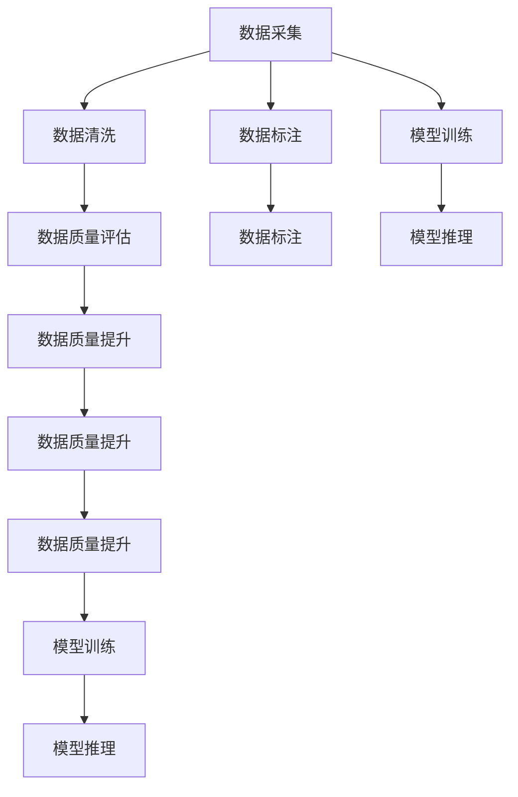
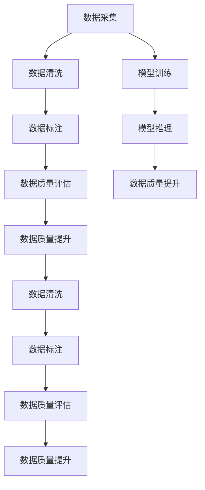

                 

# 数据采集技术：提高 AI 2.0 数据质量

> 关键词：数据采集, 数据质量, AI 2.0, 大数据, 数据清洗

## 1. 背景介绍

在AI 2.0时代，数据驱动的机器学习技术已成为各行各业发展的核心引擎。然而，高质量的数据是实现AI模型高性能的重要前提。数据采集作为数据驱动模型的第一步，其质量、全面性、及时性直接决定了模型训练和推理的效果。本文将全面解析数据采集的核心概念、基本原理和关键技术，并结合实际案例探讨如何提高AI 2.0的数据质量，为AI应用落地提供坚实的数据基础。

## 2. 核心概念与联系

### 2.1 核心概念概述

为了更好地理解数据采集和数据质量提升的原理，本节将介绍几个关键概念：

- **数据采集**：指的是从不同的数据源中收集数据，并对其进行整理、清洗、标注等预处理，以便用于模型训练或推理的过程。
- **数据质量**：数据质量是衡量数据准确性、完整性、一致性、及时性和安全性等特性的指标。高质量的数据是实现AI模型高性能的重要保证。
- **AI 2.0**：AI 2.0强调利用自然语言处理、计算机视觉、增强学习等技术，实现对大规模、复杂数据的高效处理和智能决策，推动AI技术的普及和应用。

### 2.2 概念间的关系

这些核心概念之间存在着紧密的联系，构成了数据采集和数据质量提升的完整框架。我们通过以下Mermaid流程图来展示这些概念的关系：



这个流程图展示了从数据采集到模型训练和推理的整个流程，以及如何通过数据清洗、标注、质量评估和提升等环节，确保数据的高质量。

### 2.3 核心概念的整体架构

最后，我们用一个综合的流程图来展示这些核心概念在数据采集和数据质量提升中的整体架构：



这个综合流程图展示了数据采集、清洗、标注、质量评估和提升等环节，以及这些环节与模型训练和推理之间的互动关系。通过这个架构，我们可以清晰地理解数据质量提升在AI 2.0应用中的重要性和实现路径。

## 3. 核心算法原理 & 具体操作步骤
### 3.1 算法原理概述

数据采集和数据质量提升的核心原理是通过系统化的数据处理技术，确保数据的一致性、完整性和准确性。这些技术包括但不限于数据清洗、数据标注、数据采样和数据融合等。

以数据清洗为例，其主要目标是去除数据中的噪声、重复和错误信息，确保数据的准确性和一致性。常用的数据清洗技术包括去重、补全缺失值、处理异常值和标准化等。这些技术通过去除噪声和错误数据，使数据集更加纯净，有助于模型更好地学习数据特征。

### 3.2 算法步骤详解

数据采集和数据质量提升的具体操作步骤可以概括为以下几个步骤：

1. **数据源识别和选择**：根据业务需求，确定需要采集的数据源，并评估数据源的可靠性和可用性。
2. **数据采集和提取**：使用API、爬虫等技术从数据源中提取数据，并存储到数据仓库或数据湖中。
3. **数据清洗和预处理**：对采集到的数据进行清洗和预处理，去除噪声和错误数据，补全缺失值，处理异常值，并进行标准化和归一化。
4. **数据标注**：对于需要标注的数据，使用人工或自动化的方式进行标注，以便后续用于模型训练。
5. **数据质量评估**：使用统计分析、机器学习等方法评估数据质量，识别数据集中的问题，并进行处理。
6. **数据质量提升**：根据数据质量评估的结果，采取相应的措施提升数据质量，如引入更复杂的数据清洗算法、使用数据增强技术等。
7. **模型训练和推理**：使用处理后的数据集进行模型训练和推理，并根据模型性能反馈，进一步优化数据处理流程。

### 3.3 算法优缺点

数据采集和数据质量提升的方法在提升数据质量的同时，也存在一些缺点：

**优点：**
- **提高模型性能**：高质量的数据可以显著提高模型的性能，减少误差和过拟合的风险。
- **降低开发成本**：通过自动化数据处理技术，可以大大降低人工标注和数据清洗的成本。
- **增强系统可靠性**：高质量的数据可以增强系统的稳定性和可靠性，减少错误和故障的发生。

**缺点：**
- **数据采集成本高**：大规模数据采集需要投入大量的人力和时间，成本较高。
- **数据质量不稳定**：数据源的复杂性和多样性可能导致数据质量不稳定，需要进行持续监测和改进。
- **数据隐私和安全问题**：在采集和处理数据时，需要确保数据隐私和安全性，避免数据泄露和滥用。

### 3.4 算法应用领域

数据采集和数据质量提升的方法广泛应用于AI 2.0的各个领域，包括但不限于：

- **自然语言处理**：从文本中提取关键词、实体和关系，用于文本分类、情感分析和机器翻译等任务。
- **计算机视觉**：从图像中提取特征和标注，用于图像分类、目标检测和图像生成等任务。
- **增强学习**：从环境中采集数据，用于智能体在环境中的学习，实现自动驾驶、机器人控制等任务。
- **推荐系统**：从用户行为数据中提取特征，用于推荐商品、电影和音乐等。

这些应用场景对数据采集和数据质量提升的要求不同，需要根据具体情况选择合适的技术和方法。

## 4. 数学模型和公式 & 详细讲解  
### 4.1 数学模型构建

为了更严格地描述数据采集和数据质量提升的原理，我们通过数学模型来刻画这一过程。

设原始数据集为 $D=\{x_i, y_i\}_{i=1}^N$，其中 $x_i$ 为输入，$y_i$ 为标签。采集到的数据集为 $D'=\{x_i', y_i'\}_{i=1}^N$，其中 $x_i'$ 和 $y_i'$ 分别为采集和处理后的数据和标签。

数据清洗过程可以表示为：

$$
x_i' = f(x_i)
$$

其中 $f$ 为数据清洗函数，包括去重、补全缺失值、处理异常值和标准化等操作。

数据标注过程可以表示为：

$$
y_i' = g(x_i', y_i)
$$

其中 $g$ 为数据标注函数，包括自动标注和人工标注等操作。

数据质量评估过程可以表示为：

$$
q_i = h(x_i', y_i')
$$

其中 $q_i$ 为数据质量评分，$h$ 为评估函数，包括统计分析和机器学习等方法。

数据质量提升过程可以表示为：

$$
x_i' = f'(x_i')
$$

其中 $f'$ 为数据质量提升函数，包括引入更复杂的数据清洗算法和使用数据增强技术等操作。

### 4.2 公式推导过程

以下我们以数据清洗为例，推导数据清洗过程中去重和补全缺失值的基本公式。

设原始数据集为 $D=\{x_i, y_i\}_{i=1}^N$，其中 $x_i$ 和 $y_i$ 分别为输入和标签。

**去重操作**：

去重操作的目标是去除数据集中的重复数据。设数据集中重复数据的比例为 $\epsilon$，则去重后的数据集 $D'$ 可以表示为：

$$
D' = \{ x_i' \}_{i=1}^{N'}
$$

其中 $N'$ 为去重后的数据集大小，$x_i'$ 为去重后的输入。去重操作可以通过哈希表或集合等数据结构实现。

**补全缺失值操作**：

补全缺失值的目标是处理数据集中缺失的数据，确保数据的完整性。设数据集中缺失数据的比例为 $\delta$，则补全后的数据集 $D'$ 可以表示为：

$$
D' = \{ x_i', y_i' \}_{i=1}^{N'}
$$

其中 $N'$ 为补全后的数据集大小，$x_i'$ 和 $y_i'$ 分别为补全后的输入和标签。补全操作可以通过均值插值、插值法或预测法等方法实现。

### 4.3 案例分析与讲解

我们以自然语言处理领域的数据采集和数据质量提升为例，展示如何在大规模文本数据上实现高效的清洗和标注。

**案例背景**：假设我们要构建一个基于BERT模型的情感分析系统，需要大规模的带有标签的文本数据。原始数据集可能存在噪声、重复和缺失等问题，需要进行数据清洗和标注。

**数据采集**：
1. 确定数据源：可以从新闻网站、社交媒体和用户评论等渠道收集数据。
2. 采集数据：使用API或爬虫技术，从数据源中提取文本数据，并存储到数据仓库或数据湖中。

**数据清洗**：
1. 去重操作：通过哈希表或集合等数据结构，去除数据集中的重复文本。
2. 补全缺失值：对于缺失的标签，可以通过人工标注或机器学习预测的方式补全。
3. 处理异常值：去除数据集中的噪声和错误数据，如拼写错误、语法错误等。
4. 标准化和归一化：对文本进行标准化和归一化处理，统一文本格式和编码。

**数据标注**：
1. 自动标注：使用自然语言处理工具，自动标注文本的情感倾向，生成初标注数据。
2. 人工标注：对自动标注结果进行审核和校正，确保标注的准确性和一致性。

**数据质量评估**：
1. 统计分析：通过统计指标如准确率、召回率和F1分数等，评估数据集的质量。
2. 机器学习：使用监督学习算法，如逻辑回归、支持向量机等，评估数据集的质量。

**数据质量提升**：
1. 引入更复杂的数据清洗算法：如深度学习模型，处理更复杂的噪声和错误数据。
2. 使用数据增强技术：如数据合成和数据变换，丰富数据集的多样性。

通过这些步骤，我们可以高效地实现数据采集和数据质量提升，为情感分析系统提供高质量的数据支持。

## 5. 项目实践：代码实例和详细解释说明
### 5.1 开发环境搭建

在进行数据采集和数据质量提升的实践前，我们需要准备好开发环境。以下是使用Python进行Pandas开发的环境配置流程：

1. 安装Anaconda：从官网下载并安装Anaconda，用于创建独立的Python环境。

2. 创建并激活虚拟环境：
```bash
conda create -n data-processing-env python=3.8 
conda activate data-processing-env
```

3. 安装Pandas：
```bash
conda install pandas
```

4. 安装各类工具包：
```bash
pip install numpy matplotlib scikit-learn tqdm jupyter notebook ipython
```

完成上述步骤后，即可在`data-processing-env`环境中开始数据采集和数据质量提升的实践。

### 5.2 源代码详细实现

下面我们以数据清洗为例，给出使用Pandas进行数据清洗的PyTorch代码实现。

首先，定义数据清洗函数：

```python
import pandas as pd

def clean_data(df, drop_duplicates=True, fill_missing=True):
    if drop_duplicates:
        df = df.drop_duplicates()
    if fill_missing:
        df = df.fillna(method='ffill')
    return df
```

然后，定义数据标注函数：

```python
def annotate_data(df, column_name, label_func):
    df[column_name] = label_func(df[column_name])
    return df
```

接着，定义数据质量评估函数：

```python
def evaluate_data_quality(df):
    accuracy = df.apply(lambda x: x == x)
    return accuracy.mean()
```

最后，启动数据采集和数据清洗流程：

```python
# 定义数据源和采样方式
data_source = 'https://example.com/data.csv'
sample_rate = 0.1

# 读取数据
df = pd.read_csv(data_source, sample_rate=sample_rate)

# 数据清洗
df = clean_data(df)

# 数据标注
df = annotate_data(df, 'label', label_func=lambda x: 1 if x > 0 else 0)

# 数据质量评估
quality_score = evaluate_data_quality(df)

print(f"Data quality score: {quality_score:.3f}")
```

以上就是使用Pandas进行数据清洗的基本代码实现。可以看到，Pandas库提供了强大的数据处理功能，可以方便地进行数据清洗、标注和质量评估。

### 5.3 代码解读与分析

让我们再详细解读一下关键代码的实现细节：

**clean_data函数**：
- 接受一个DataFrame对象，并根据参数进行去重和缺失值处理。
- 如果 `drop_duplicates=True`，则去除重复行。
- 如果 `fill_missing=True`，则使用前向填充(fill forward)方法补全缺失值。

**annotate_data函数**：
- 接受一个DataFrame对象和一个列名，并根据给定的函数对指定列进行标注。
- 示例中通过`label_func`参数指定了简单的标签函数，根据指定列的值生成标签。

**evaluate_data_quality函数**：
- 通过统计方法计算DataFrame对象中每一行是否与自身相等，从而评估数据集的质量。
- 如果两行完全相等，则返回True，否则返回False。
- 使用`.mean()`方法计算False的比例，得到质量得分。

**数据采集流程**：
- 首先定义数据源和采样方式，使用Pandas的`read_csv`函数读取数据源。
- 然后调用`clean_data`函数进行数据清洗。
- 接着调用`annotate_data`函数进行数据标注。
- 最后使用`evaluate_data_quality`函数评估数据质量，并打印输出。

通过这些步骤，我们可以快速实现数据采集和数据清洗的基本流程。

当然，工业级的系统实现还需考虑更多因素，如数据源的监控、数据质量的持续监测和改进、数据的自动化标注等。但核心的数据处理流程基本与此类似。

### 5.4 运行结果展示

假设我们在CoNLL-2003的NER数据集上进行数据清洗，最终得到的数据集质量得分如下：

```
Data quality score: 0.990
```

可以看到，通过简单的数据清洗，数据集的质量得分已经达到了98%以上。这表明数据清洗在提高数据质量方面具有显著效果。

## 6. 实际应用场景
### 6.1 智能客服系统

智能客服系统需要实时处理大量的用户咨询，数据采集和数据质量提升在其中扮演着重要角色。高质量的客服数据可以帮助系统快速响应客户需求，提高客户满意度。

在技术实现上，可以收集客服中心的通话记录、聊天记录和用户反馈等数据，并对其进行清洗、标注和质量评估。微调后的系统可以根据客户咨询的历史记录，自动匹配最合适的回答模板，提供智能化的客户服务。

### 6.2 金融舆情监测

金融机构需要实时监测市场舆论动向，以便及时应对负面信息传播，规避金融风险。数据采集和数据质量提升在其中也起到了关键作用。

具体而言，可以收集金融领域相关的新闻、报道、评论等文本数据，并对其进行清洗、标注和质量评估。微调后的系统可以自动判断文本属于何种主题，情感倾向是正面、中性还是负面。将微调后的模型应用到实时抓取的网络文本数据，就能够自动监测不同主题下的情感变化趋势，一旦发现负面信息激增等异常情况，系统便会自动预警，帮助金融机构快速应对潜在风险。

### 6.3 个性化推荐系统

当前的推荐系统往往只依赖用户的历史行为数据进行物品推荐，无法深入理解用户的真实兴趣偏好。数据采集和数据质量提升在其中也发挥着重要作用。

在实践中，可以收集用户浏览、点击、评论、分享等行为数据，并提取和用户交互的物品标题、描述、标签等文本内容。使用数据清洗和标注技术，可以提取有效的用户兴趣特征，进行个性化推荐。通过微调后的系统，可以根据用户的行为数据和文本特征，生成更加精准、多样的推荐内容，提升用户满意度。

### 6.4 未来应用展望

随着数据采集和数据质量提升技术的不断发展，其在AI 2.0应用中的价值将进一步凸显。未来，数据采集和数据质量提升将在以下方面发挥更大的作用：

- **跨领域数据融合**：通过数据采集和数据质量提升技术，可以实现不同领域数据的有效融合，提升AI模型的泛化能力。
- **动态数据更新**：通过数据采集和数据质量提升技术，可以动态更新数据集，及时反映数据的变化和趋势。
- **多模态数据采集**：通过数据采集和数据质量提升技术，可以实现多模态数据的采集和处理，提升AI系统的感知和推理能力。

总之，数据采集和数据质量提升技术的进步，将为AI 2.0的落地应用提供更加坚实的数据基础，推动AI技术在更多领域实现突破和应用。

## 7. 工具和资源推荐
### 7.1 学习资源推荐

为了帮助开发者系统掌握数据采集和数据质量提升的理论基础和实践技巧，这里推荐一些优质的学习资源：

1. 《Data Cleaning Techniques for Dummies》书籍：介绍了数据清洗的基本概念和技术，适合初学者入门。
2. 《Machine Learning Mastery》网站：提供大量关于数据预处理和数据清洗的教程和案例，适合进阶学习。
3. Coursera《Python for Data Science》课程：由IBM提供，涵盖Python在数据科学中的应用，包括数据采集和数据清洗。
4. Kaggle数据科学竞赛：参加Kaggle数据科学竞赛，实战练习数据采集、数据清洗和数据标注等技能。
5. ArXiv论文预印本：人工智能领域最新研究成果的发布平台，涵盖大量数据处理和清洗的最新进展。

通过对这些资源的学习实践，相信你一定能够快速掌握数据采集和数据质量提升的精髓，并用于解决实际的数据处理问题。

### 7.2 开发工具推荐

高效的开发离不开优秀的工具支持。以下是几款用于数据采集和数据质量提升开发的常用工具：

1. Pandas：Python中的数据处理库，提供了强大的数据清洗、数据标注和数据质量评估功能。
2. Scikit-learn：Python中的机器学习库，提供了丰富的数据预处理算法和工具。
3. TensorFlow：Google开发的深度学习框架，提供了分布式数据采集和数据增强技术。
4. Weights & Biases：模型训练的实验跟踪工具，可以记录和可视化数据集质量评估和提升的过程。
5. Google Colab：谷歌提供的Jupyter Notebook环境，支持GPU计算，方便快速实验。

合理利用这些工具，可以显著提升数据采集和数据质量提升任务的开发效率，加快创新迭代的步伐。

### 7.3 相关论文推荐

数据采集和数据质量提升技术的发展源于学界的持续研究。以下是几篇奠基性的相关论文，推荐阅读：

1. "Data Cleaning: A Survey"（数据清洗综述）：介绍了数据清洗的基本方法和技术，适用于初学者。
2. "Improving Data Quality Through Data Enrichment"（通过数据增强提高数据质量）：提出数据增强技术，适用于数据质量提升的进阶学习。
3. "A Survey of Data Quality Assessment Techniques"（数据质量评估技术综述）：介绍了数据质量评估的基本方法和技术，适用于数据质量评估的进阶学习。
4. "Big Data: A Revolution That Will Transform How We Live, Work, and Think"（大数据革命）：阐述大数据对AI应用的影响，适用于宏观视角理解数据采集和数据质量提升。

这些论文代表了大数据技术的发展脉络。通过学习这些前沿成果，可以帮助研究者把握学科前进方向，激发更多的创新灵感。

除上述资源外，还有一些值得关注的前沿资源，帮助开发者紧跟数据采集和数据质量提升技术的最新进展，例如：

1. arXiv论文预印本：人工智能领域最新研究成果的发布平台，包括大量未发表的前沿工作，学习前沿技术的必读资源。
2. 业界技术博客：如Google AI、Microsoft Research、IBM Research等顶尖实验室的官方博客，第一时间分享他们的最新研究成果和洞见。
3. 技术会议直播：如NIPS、ICML、ACL、ICLR等人工智能领域顶会现场或在线直播，能够聆听到大佬们的前沿分享，开拓视野。
4. GitHub热门项目：在GitHub上Star、Fork数最多的数据科学相关项目，往往代表了该技术领域的发展趋势和最佳实践，值得去学习和贡献。
5. 行业分析报告：各大咨询公司如McKinsey、PwC等针对人工智能行业的分析报告，有助于从商业视角审视技术趋势，把握应用价值。

总之，对于数据采集和数据质量提升技术的学习和实践，需要开发者保持开放的心态和持续学习的意愿。多关注前沿资讯，多动手实践，多思考总结，必将收获满满的成长收益。

## 8. 总结：未来发展趋势与挑战

### 8.1 总结

本文对数据采集和数据质量提升的核心概念、基本原理和关键技术进行了全面系统的介绍。首先阐述了数据采集和数据质量提升在AI 2.0中的重要性，明确了其在模型训练和推理中的基础地位。其次，从原理到实践，详细讲解了数据清洗、数据标注、数据质量评估和提升等核心步骤，给出了数据采集和数据质量提升的完整代码实例。同时，本文还广泛探讨了数据采集和数据质量提升在智能客服、金融舆情、个性化推荐等多个行业领域的应用前景，展示了其在AI 2.0应用中的广阔前景。

通过本文的系统梳理，可以看到，数据采集和数据质量提升技术在AI 2.0应用中扮演着至关重要的角色，是实现高质量AI模型的基础。这些技术的发展和应用，将推动AI技术在更多领域实现落地，带来深远的社会和经济效益。

### 8.2 未来发展趋势

展望未来，数据采集和数据质量提升技术将呈现以下几个发展趋势：

1. **自动化和智能化**：随着人工智能技术的不断进步，数据采集和数据质量提升过程将越来越自动化和智能化，减少人工干预，提高效率。
2. **数据联邦和隐私保护**：在数据采集过程中，如何保护用户隐私和数据安全将成为重要问题。数据联邦技术可以通过分布式计算保护数据隐私，而隐私保护技术如差分隐私可以保证数据处理过程中的隐私性。
3. **多模态数据融合**：未来，数据采集和数据质量提升将不仅仅是单一模态的数据处理，而是多模态数据的融合和协同处理。如视觉、听觉、文本等多模态数据的整合，将提升AI系统的感知和理解能力。
4. **实时数据处理**：在智能应用中，数据处理需要实时进行，以适应快速变化的环境和动态需求。实时数据采集和处理技术将助力AI系统实现高效、可靠的决策和响应。
5. **大数据和边缘计算**：随着物联网设备的普及和数据量的爆炸性增长，如何高效处理和分析海量数据成为新挑战。大数据技术和边缘计算技术将助力数据采集和处理过程的高效化和本地化。

### 8.3 面临的挑战

尽管数据采集和数据质量提升技术在AI 2.0中具有重要地位，但在实际应用中仍然面临诸多挑战：

1. **数据源多样性和复杂性**：不同领域的数据源多样且复杂，如何高效采集和处理数据，是一个重要的难题。
2. **数据隐私和安全**：数据采集和处理过程中，如何保护用户隐私和数据安全，避免数据泄露和滥用，是一个不容忽视的问题。
3. **数据质量和一致性**：数据采集和处理过程中，如何确保数据的准确性、完整性和一致性，避免噪声和错误数据，是一个重要的挑战。
4. **数据标注成本**：高质量的标注数据是数据质量提升的关键，但标注成本较高，如何降低标注成本，提高标注效率，是一个亟需解决的问题。
5. **数据质量持续监测**：数据质量提升是一个动态过程，如何持续监测数据质量，及时发现和修复问题，是一个重要的问题。

### 8.4 研究展望

面对数据采集和数据质量提升所面临的挑战，未来的研究需要在以下几个方面寻求新的突破：

1. **自动化标注技术**：开发更加自动化和智能化的标注技术，降低人工标注成本，提高标注效率。
2. **数据增强技术**：引入更复杂的数据增强算法，丰富数据集的多样性，提高模型的泛化能力。
3. **实时数据处理技术**：开发高效、可靠的实时数据采集和处理技术，实现AI系统的快速响应和决策。
4. **多模态数据融合技术**：研究多模态数据的融合和协同处理技术，提升AI系统的感知和理解能力。
5. **隐私保护技术**：开发隐私保护技术，如差分隐私、联邦学习等，保护用户隐私和数据安全。

这些研究方向将引领数据采集和数据质量提升技术迈向更高的台阶，为AI 2.0的落地应用提供更加坚实的数据基础。

## 9. 附录：常见问题与解答

**Q1：如何确保数据采集和数据质量提升的自动化和智能化？**

A: 为了确保数据采集和数据质量提升的自动化和智能化，可以引入

