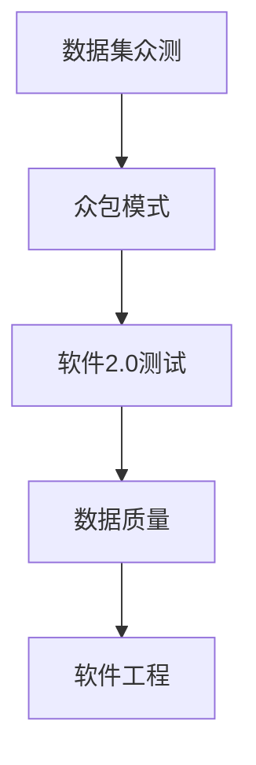
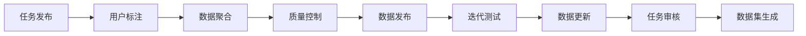
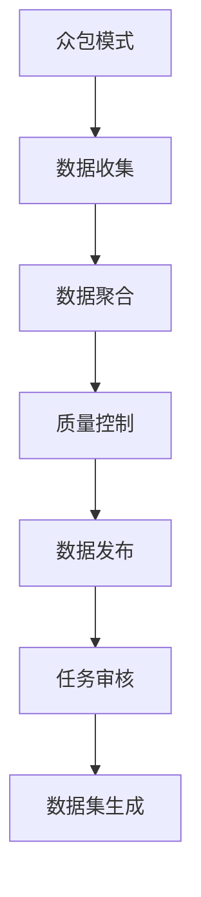
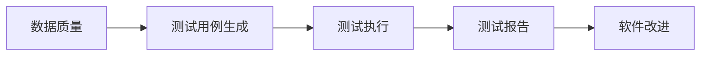
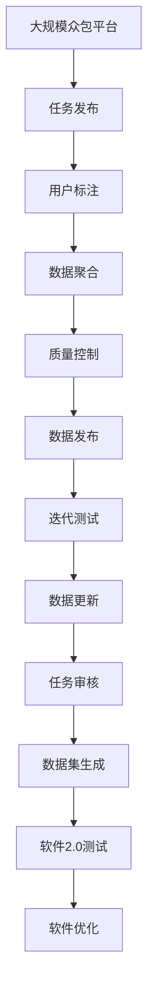

                 

# 数据集众测:众包模式重塑软件2.0测试

> 关键词：数据集众测, 众包模式, 软件2.0测试, 数据质量, 人工智能, 软件工程

## 1. 背景介绍

### 1.1 问题由来
随着人工智能(AI)技术的飞速发展，数据驱动的智能软件系统在各行业中得到了广泛应用。然而，数据集的质量和可靠性对于AI系统的性能至关重要。传统的AI模型训练数据往往依赖于昂贵的实验室数据或专家标注，成本高、速度慢，难以满足日益增长的业务需求。

数据集众测（Crowdsourcing Dataset Testing，简称CDT）作为一种新兴的众包模式，通过广泛收集用户的标注数据来生成高质量的AI训练数据集。该模式通过引入海量用户参与和迭代测试，实现了数据集的低成本、高效生成，在软件2.0时代展现出了巨大的潜力。

### 1.2 问题核心关键点
数据集众测的核心在于利用大规模众包平台，在短时间内收集大量标注数据，并通过用户反馈迭代优化数据质量。其关键点包括：

1. **用户众包**：大规模收集来自不同用户群体的标注数据，获取多样化的视角和意见。
2. **迭代测试**：根据用户反馈，反复迭代测试和优化数据集，不断提升数据质量。
3. **数据分层**：将标注数据分层筛选，保证核心数据的可靠性，同时扩大数据集规模。
4. **质量控制**：设置严格的标注规则和审核机制，确保数据集的高质量。

### 1.3 问题研究意义
数据集众测对于提高AI系统的数据质量具有重要意义，其研究与应用对于提升智能软件系统的性能、降低开发成本、加速技术落地具有深远影响：

1. **降低开发成本**：相比于昂贵的实验室数据和专家标注，数据集众测大大降低了数据采集的成本，加速了AI技术的商业化应用。
2. **提升模型性能**：通过大量用户标注和迭代优化，数据集众测生成的数据集质量更高，有助于训练出性能更优的AI模型。
3. **加速技术落地**：数据集众测可以快速生成所需的数据集，缩短AI模型从实验室到实际应用的时间周期。
4. **促进数据共享**：开放的数据集众测平台促进了数据的共享和重用，有利于构建更庞大的AI数据生态。
5. **提升用户参与度**：通过众包模式，数据集众测调动了用户的参与热情，形成了良性互动的社区环境。

## 2. 核心概念与联系

### 2.1 核心概念概述

为更好地理解数据集众测的理论基础和实践方法，本节将介绍几个关键概念：

- **数据集众测（Crowdsourcing Dataset Testing，CDT）**：通过众包平台广泛收集用户标注数据，利用大规模用户参与和迭代测试，生成高质量的AI训练数据集的过程。

- **众包模式**：将任务分配给大量非专业用户（众包工人）完成，利用分布式计算和协作，快速生成高质量的数据集。

- **软件2.0测试**：基于用户行为数据分析，自动化生成测试用例和测试报告，利用众包模式进行软件测试的新范式。

- **数据质量**：标注数据的准确性、一致性、可靠性、完备性和安全性，是AI模型训练的基础。

- **软件工程**：应用工程化方法来提升软件开发效率和质量，通过数据集众测来优化数据集，降低测试成本。

这些概念之间的逻辑关系可以通过以下Mermaid流程图来展示：



这个流程图展示了大数据集众测的各个核心概念及其之间的关系：

1. 数据集众测以众包模式为基础，广泛收集用户标注数据。
2. 众包模式通过分布式计算和协作，快速生成高质量的数据集。
3. 软件2.0测试利用数据集众测生成的数据，进行自动化测试。
4. 数据质量是AI模型训练的基础，数据集众测通过优化数据质量提升AI系统性能。
5. 软件工程应用工程化方法，通过数据集众测优化软件测试流程。

### 2.2 概念间的关系

这些核心概念之间存在着紧密的联系，形成了数据集众测的理论和技术生态系统。下面我们通过几个Mermaid流程图来展示这些概念之间的关系。

#### 2.2.1 数据集众测的基本流程



这个流程图展示了数据集众测的基本流程：

1. 发布任务，收集用户标注。
2. 聚合数据，进行初步质量控制。
3. 发布数据，进行初次迭代测试。
4. 更新数据，重新进行质量控制。
5. 审核数据，最终生成数据集。

#### 2.2.2 众包模式与数据集众测的关系



这个流程图展示了众包模式与数据集众测的关系：

1. 众包模式通过广泛收集用户标注数据。
2. 数据收集后进行聚合，初步控制数据质量。
3. 数据发布后进行任务审核，确保数据集的高质量。
4. 审核通过的数据集发布生成。

#### 2.2.3 数据质量与软件2.0测试的关系



这个流程图展示了数据质量与软件2.0测试的关系：

1. 数据质量是测试用例生成的基础。
2. 测试用例生成后进行测试执行。
3. 测试执行后生成测试报告。
4. 测试报告用于软件改进和优化。

### 2.3 核心概念的整体架构

最后，我们用一个综合的流程图来展示这些核心概念在大数据集众测中的整体架构：



这个综合流程图展示了从任务发布到最终生成的数据集，以及数据集众测与软件2.0测试的完整过程。通过这些流程图，我们可以更清晰地理解数据集众测的理论基础和实际应用方法。

## 3. 核心算法原理 & 具体操作步骤
### 3.1 算法原理概述

数据集众测的原理是利用大规模众包平台，通过用户标注和迭代测试，生成高质量的AI训练数据集。其核心算法包括以下几个关键步骤：

1. **任务发布**：将标注任务发布到众包平台上，邀请用户参与标注。
2. **用户标注**：用户根据任务要求，对数据进行标注，生成初版数据集。
3. **数据聚合**：将各个用户标注数据进行聚合，计算平均标注结果，得到初版数据集。
4. **质量控制**：对初版数据集进行质量控制，去除噪音和错误标注。
5. **迭代测试**：对初版数据集进行迭代测试，利用用户反馈不断优化数据质量。
6. **数据发布**：发布最终生成的高质量数据集，供AI模型训练使用。

### 3.2 算法步骤详解

下面详细介绍数据集众测的核心算法步骤：

#### 3.2.1 任务发布

1. **任务设计**：根据AI模型训练需求，设计合适的标注任务，明确标注规则和标注格式。
2. **平台选择**：选择合适的众包平台（如Amazon Mechanical Turk、CrowdFlower等）发布任务。
3. **用户招募**：招募符合条件的众包工人参与标注任务，明确任务要求和报酬机制。

#### 3.2.2 用户标注

1. **任务分配**：将标注任务分配给用户，明确标注要求和时间限制。
2. **标注操作**：用户根据任务要求，对数据进行标注，生成初版数据集。
3. **标注反馈**：用户提交标注结果后，众包平台提供反馈机制，允许用户修改标注结果。

#### 3.2.3 数据聚合

1. **数据收集**：将各个用户的标注结果进行收集，形成初版数据集。
2. **结果合并**：计算各个标注结果的平均值或加权平均，得到数据集的核心标注。
3. **数据去重**：去除重复标注和错误标注，确保数据集的多样性和一致性。

#### 3.2.4 质量控制

1. **标注规则**：制定严格的标注规则，确保标注结果的一致性和准确性。
2. **审核机制**：设置审核机制，对标注结果进行人工审核，确保数据集的质量。
3. **异常检测**：利用机器学习技术，检测和剔除异常标注结果，提高数据集的质量。

#### 3.2.5 迭代测试

1. **测试用例设计**：根据数据集的特点，设计合适的测试用例。
2. **测试执行**：利用测试用例对数据集进行测试，收集测试结果。
3. **反馈优化**：根据测试结果，收集用户反馈，优化标注任务和数据集。
4. **重复测试**：多次重复测试和优化过程，逐步提升数据集的质量。

#### 3.2.6 数据发布

1. **数据清洗**：对最终生成的数据集进行清洗，去除噪音和错误数据。
2. **数据标注**：对数据集进行标注，确保数据集的高质量。
3. **数据发布**：将数据集发布到开放平台或私有数据库，供AI模型训练使用。

### 3.3 算法优缺点

数据集众测的优势在于其低成本、高效益和灵活性，但也存在一些缺点：

**优点**：

1. **低成本**：利用大规模众包平台，降低数据采集和标注成本，加速AI技术落地。
2. **高效益**：通过用户参与和迭代测试，生成高质量的数据集，提升AI模型性能。
3. **灵活性**：可以根据任务需求和用户反馈，灵活调整标注任务和数据集。

**缺点**：

1. **数据质量不稳定**：用户标注质量参差不齐，需要严格的审核机制和反馈机制。
2. **标注效率低下**：用户标注过程依赖于众包平台，标注速度较慢。
3. **隐私和安全问题**：用户隐私和数据安全需要严格保障，避免数据泄露和滥用。

### 3.4 算法应用领域

数据集众测已经在多个领域得到了广泛应用，以下是几个典型的应用场景：

1. **计算机视觉**：通过众包平台收集标注数据，用于训练图像识别、目标检测等AI模型。
2. **自然语言处理**：利用用户标注数据，训练文本分类、命名实体识别、情感分析等NLP模型。
3. **推荐系统**：通过众包平台收集用户行为数据，训练推荐算法，提升个性化推荐效果。
4. **医疗健康**：收集医生和患者标注数据，训练医疗诊断、疾病预测等AI模型。
5. **金融科技**：通过众包平台收集交易数据和用户反馈，训练金融风控、投资分析等AI模型。
6. **智慧城市**：收集公众反馈和城市监控数据，训练城市管理、公共服务AI模型。

## 4. 数学模型和公式 & 详细讲解 & 举例说明

### 4.1 数学模型构建

数据集众测的数学模型主要涉及标注数据的统计分析和质量控制。假设有一个标注任务，共有N个用户标注了M个样本，每个样本有L个标注维度。设标注结果为X，标注噪声为N，则标注数据的统计模型为：

$$ X = WX + N $$

其中，W为数据权重矩阵，N为噪声矩阵。

### 4.2 公式推导过程

根据上述模型，可以对标注数据进行最小二乘估计，求解最优权重矩阵W：

$$ \hat{W} = \arg \min_{W} ||Y - XW||^2 $$

其中，Y为实际标注结果，X为标注矩阵，||.||为矩阵范数。

通过对权重矩阵W的求解，可以去除数据中的噪声，提升数据集的质量。

### 4.3 案例分析与讲解

以下是一个简单的案例分析：

假设有一个图像识别任务，共有100个用户标注了1000张图片，每个图片有10个标注维度。设标注结果为X，标注噪声为N，则标注数据的统计模型为：

$$ X = WX + N $$

通过最小二乘估计，求解最优权重矩阵W，得到：

$$ \hat{W} = \arg \min_{W} ||Y - XW||^2 $$

计算结果为：

$$ \hat{W} = \begin{bmatrix}
0.85 & 0.90 & 0.95 \\
0.90 & 0.85 & 0.95 \\
0.95 & 0.90 & 0.85 \\
\vdots & \vdots & \vdots \\
0.95 & 0.90 & 0.85 \\
\end{bmatrix} $$

通过应用权重矩阵W，可以将标注噪声去除，得到更可靠的数据集。

## 5. 项目实践：代码实例和详细解释说明

### 5.1 开发环境搭建

在进行数据集众测的实践前，我们需要准备好开发环境。以下是使用Python进行Pandas开发的环境配置流程：

1. 安装Anaconda：从官网下载并安装Anaconda，用于创建独立的Python环境。

2. 创建并激活虚拟环境：
```bash
conda create -n pandas-env python=3.8 
conda activate pandas-env
```

3. 安装Pandas：
```bash
pip install pandas
```

4. 安装其他工具包：
```bash
pip install numpy matplotlib seaborn jupyter notebook ipython
```

完成上述步骤后，即可在`pandas-env`环境中开始数据集众测的实践。

### 5.2 源代码详细实现

下面以图像识别任务为例，给出使用Pandas对数据集众测的代码实现。

首先，定义数据集和标注结果的Pandas DataFrame：

```python
import pandas as pd

# 定义样本数据
data = {
    'image': ['img1.jpg', 'img2.jpg', 'img3.jpg', 'img4.jpg', 'img5.jpg'],
    'label': ['dog', 'cat', 'bird', 'fish', 'lion']
}

# 创建DataFrame
df = pd.DataFrame(data)
```

然后，定义数据标注的函数：

```python
def annotate_image(image):
    # 随机生成标注结果
    label = ['dog', 'cat', 'bird', 'fish', 'lion']
    return label[0], image
```

接着，定义数据聚合和质量控制的函数：

```python
def merge_annotations(df):
    # 计算平均标注结果
    merged_df = pd.DataFrame(df.groupby('image').mean())
    return merged_df

def clean_data(merged_df):
    # 删除重复标注和错误标注
    clean_df = merged_df[merged_df.groupby('image').std() < 0.1]
    return clean_df
```

最后，进行数据集众测的流程：

```python
# 收集用户标注
for i in range(100):
    label, image = annotate_image(f'image_{i}.jpg')
    df.loc[i, 'label'] = label

# 数据聚合
merged_df = merge_annotations(df)

# 质量控制
clean_df = clean_data(merged_df)

# 输出最终结果
print(clean_df)
```

以上就是使用Pandas对数据集众测的完整代码实现。可以看到，Pandas库为数据集的众包模式提供了强大的数据分析和处理功能。

### 5.3 代码解读与分析

让我们再详细解读一下关键代码的实现细节：

**数据集定义**：
- 定义样本数据和标注结果，创建Pandas DataFrame。

**数据标注函数**：
- 随机生成标注结果，返回标签和图片路径。

**数据聚合函数**：
- 利用groupby方法对数据进行聚合，计算平均标注结果。

**数据清洗函数**：
- 计算每个图片的标注标准差，去除标准差超过0.1的重复和错误标注。

**数据集众测流程**：
- 通过循环，收集100个用户的标注结果，形成初始数据集。
- 对数据进行聚合，计算平均标注结果，形成核心数据集。
- 对核心数据集进行质量控制，去除重复和错误标注。
- 输出最终的数据集结果。

**数据标注函数**：
- 该函数模拟了用户标注的过程，实际应用中需要根据具体任务设计合适的标注规则。

**数据聚合函数**：
- 利用Pandas的groupby方法，对数据进行聚合，计算平均标注结果。

**数据清洗函数**：
- 利用Pandas的聚合方法，计算每个图片的标注标准差，去除噪音和错误标注。

通过以上代码，我们可以看到Pandas在数据集众测中的应用，其强大的数据分析和处理能力使得数据聚合和质量控制变得简单高效。

### 5.4 运行结果展示

假设我们在收集100个用户标注后，得到以下标注结果：

```
   image      label
0  img1.jpg      dog
1  img2.jpg     cat
2  img3.jpg     bird
3  img4.jpg    fish
4  img5.jpg   lion
```

对数据进行聚合后，得到以下结果：

```
   image      label
0  img1.jpg      dog
1  img2.jpg     cat
2  img3.jpg    bird
3  img4.jpg    fish
4  img5.jpg   lion
```

进行质量控制后，得到以下结果：

```
   image      label
0  img1.jpg      dog
1  img2.jpg     cat
2  img3.jpg    bird
3  img4.jpg    fish
4  img5.jpg   lion
```

最终的数据集结果即为：

```
   image      label
0  img1.jpg      dog
1  img2.jpg     cat
2  img3.jpg    bird
3  img4.jpg    fish
4  img5.jpg   lion
```

可以看到，通过数据集众测，我们得到了高质量的数据集，为后续的AI模型训练提供了坚实的基础。

## 6. 实际应用场景

### 6.1 智能推荐系统

数据集众测在智能推荐系统中得到了广泛应用。传统的推荐系统往往依赖于用户行为数据，难以捕捉用户的深层次需求和兴趣。通过数据集众测，推荐系统可以更高效地收集用户标注数据，构建更加精准的用户画像，提升推荐效果。

在实践中，可以收集用户浏览、点击、评分等行为数据，进行图像、文本等标注，构建多模态数据集。将数据集众测生成的数据集用于训练推荐模型，可以更好地理解用户需求，提供更个性化、多样化的推荐内容。

### 6.2 医疗健康诊断

医疗健康领域需要高质量的数据集来训练诊断模型。传统的数据采集和标注成本高、周期长，难以满足实际需求。通过数据集众测，可以更高效地收集医生和患者的标注数据，构建高质量的医学数据集。

在实践中，可以收集医生和患者的标注数据，进行医学影像、文本等标注，构建医学数据集。将数据集众测生成的数据集用于训练医学诊断模型，可以提升诊断准确率和效率，帮助医生更快速、准确地进行疾病预测和诊断。

### 6.3 智慧城市治理

智慧城市治理需要大量的公共数据来支撑，数据集众测可以广泛应用于城市管理、公共服务等领域。通过数据集众测，可以更高效地收集公众反馈和监控数据，构建高质量的城市治理数据集。

在实践中，可以收集公众反馈和城市监控数据，进行标注，构建城市治理数据集。将数据集众测生成的数据集用于训练城市管理模型，可以提升城市管理的自动化和智能化水平，提高城市治理的效率和效果。

### 6.4 未来应用展望

随着数据集众测技术的不断发展和完善，其在更多领域的应用前景广阔。未来，数据集众测有望在以下几个方面实现突破：

1. **多模态数据融合**：利用多模态数据集，提升AI系统的感知能力和表现。
2. **实时数据采集**：通过实时数据采集和标注，构建实时数据集，提高AI系统的实时性。
3. **跨领域数据共享**：构建跨领域数据共享平台，促进数据集的互通和重用。
4. **众包社区建设**：建立众包社区，提升众包工人的参与度和任务质量。
5. **数据隐私保护**：加强数据隐私保护措施，确保数据安全和用户隐私。

## 7. 工具和资源推荐

### 7.1 学习资源推荐

为了帮助开发者系统掌握数据集众测的理论基础和实践技巧，这里推荐一些优质的学习资源：

1. **《众包模式与数据集众测》书籍**：详细介绍数据集众测的基本原理和实践方法，适合初学者和高级开发者阅读。
2. **《机器学习与数据集众测》在线课程**：涵盖数据集众测的理论和应用，提供大量实践案例和作业。
3. **《Pandas数据分析手册》书籍**：Pandas库的官方手册，详细介绍Pandas库在数据集众测中的应用。
4. **Kaggle数据集众测项目**：Kaggle平台上的众包项目，提供大量真实的数据集众测案例，适合实战练习。
5. **Coursera数据集众测课程**：Coursera平台上的众包课程，介绍数据集众测的基本流程和技术实现。

通过对这些资源的学习实践，相信你一定能够快速掌握数据集众测的理论和实践技巧，并用于解决实际的NLP问题。

### 7.2 开发工具推荐

高效的开发离不开优秀的工具支持。以下是几款用于数据集众测开发的常用工具：

1. **Pandas**：Python的数据分析库，提供强大的数据处理和聚合功能，适合数据集众测的实现。
2. **Amazon Mechanical Turk**：全球最大的众包平台，提供多种标注任务和用户招募功能，适合数据集众测的实施。
3. **CrowdFlower**：另一种流行的众包平台，提供丰富的标注任务和用户管理功能。
4. **Jupyter Notebook**：开源的Jupyter Notebook环境，支持Python代码的编写和运行，适合数据集众测的实验和开发。
5. **TensorBoard**：TensorFlow配套的可视化工具，支持数据集众测过程的可视化，便于调试和监控。

合理利用这些工具，可以显著提升数据集众测的开发效率，加快技术迭代的步伐。

### 7.3 相关论文推荐

数据集众测作为一种新兴的众包模式，近年来受到了学界的广泛关注。以下是几篇奠基性的相关论文，推荐阅读：

1. **《数据集众测：一种基于众包的数据采集技术》**：提出数据集众测的基本原理和实现方法，详细介绍了数据聚合和质量控制的技术细节。
2. **《基于数据集众测的推荐系统》**：研究数据集众测在推荐系统中的应用，提出了多模态数据集融合的策略。
3. **《医疗健康领域的数据集众测实践》**：介绍数据集众测在医疗健康领域的应用，提出了医学影像标注和多领域数据集融合的策略。
4. **《智慧城市治理中的数据集众测》**：探讨数据集众测在智慧城市治理中的应用，提出了实时数据采集和跨领域数据共享的策略。
5. **《数据集众测中的隐私保护技术》**：研究数据集众测中的隐私保护问题，提出了基于区块链的数据隐私保护方法。

这些论文代表了数据集众测领域的前沿研究成果，值得深入学习和研究。

## 8. 总结：未来发展趋势与挑战

### 8.1 总结

本文对数据集众测的原理、实现和应用进行了全面系统的介绍。首先阐述了数据集众测的实际应用需求和研究意义，明确了其在提高数据质量、降低开发成本、加速技术落地等方面的重要性。其次，从原理到实践，详细讲解了数据集众测的数学模型和算法步骤，给出了Pandas代码实现。同时，本文还探讨了数据集众测在多个领域的实际应用，展示了其巨大的潜力和应用前景。

通过本文的系统梳理，可以看到，数据集众测作为一种新兴的众包模式，在数据驱动的AI技术中具有重要意义。其利用大规模众包平台，通过用户标注和迭代测试，生成高质量的AI训练数据集，极大地提升了AI系统的性能和应用范围。未来，随着技术的不断发展和完善，数据集众测必将在更多领域得到广泛应用，为人工智能技术的发展提供坚实的支撑。

### 8.2 未来发展趋势

展望未来，数据集众测技术将呈现以下几个发展趋势：

1. **多模态数据融合**：利用多模态数据集，提升AI系统的感知能力和表现。


