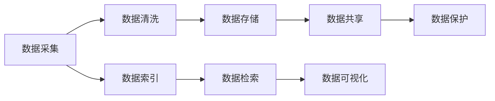
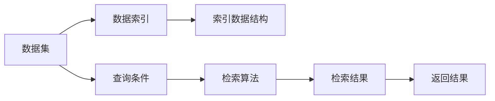
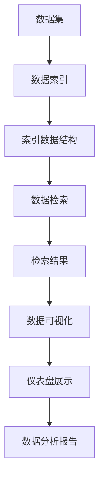

                 

# 数据集搜索引擎:软件2.0的新型开发工具

> 关键词：数据集搜索引擎, 软件2.0, 数据管理, 大数据, 人工智能

## 1. 背景介绍

### 1.1 问题由来
随着数据的重要性日益凸显，越来越多的企业和组织开始重视数据集的管理和利用。然而，由于数据集的数量庞大、结构复杂，且分布广泛，传统的管理方式已难以满足需求。传统的数据集管理系统，如Excel表格、文本文件等，存在数据格式不统一、查找效率低、维护困难等问题。如何高效、便捷地管理海量数据集，成为了数据工程师和科学家们面临的挑战。

在数据驱动的今天，数据集的高效管理不仅关乎数据分析的质量，更直接影响了人工智能和大数据应用的创新能力。数据集搜索引擎作为一种新型数据管理工具，通过搜索引擎的原理和技术，为海量数据集的快速查询、分类、检索提供了强大的支持，被广泛应用于学术研究、企业数据管理、人工智能模型训练等领域。

### 1.2 问题核心关键点
数据集搜索引擎的核心在于能够高效地索引和检索数据集，快速定位所需数据，同时提供良好的界面和查询界面，支持多维度、多层次的查询。其关键点包括：

- 高效的索引算法：如倒排索引、基于向量空间的索引、哈希索引等，能够快速定位数据集。
- 丰富的查询接口：支持SQL查询、文本搜索、条件过滤、多种排序等，满足不同用户需求。
- 可扩展的架构：支持水平扩展，能够应对海量数据集的存储和检索需求。
- 高并发处理能力：支持多用户并发访问，保证系统稳定性和响应速度。
- 数据可视化和分析：提供直观的仪表盘和分析报告，帮助用户快速理解数据集特征。

### 1.3 问题研究意义
数据集搜索引擎的出现，极大地提高了数据集管理和检索的效率，为人工智能和大数据应用的创新提供了坚实基础。研究数据集搜索引擎，对于提升数据管理的智能化水平、加速数据科学研究的进程、推动数据驱动的创新应用具有重要意义：

1. 提升数据管理效率：通过自动化索引和查询，减少手动操作，节省时间和精力。
2. 降低数据管理成本：减少数据迁移和存储成本，提高数据利用率。
3. 加速科学研究和应用创新：快速检索所需数据集，提升科研和开发效率。
4. 增强数据安全性：通过严格的访问控制和审计日志，保障数据安全。
5. 提供数据可视化支持：直观展示数据集特征，帮助用户更好地理解和利用数据。

## 2. 核心概念与联系

### 2.1 核心概念概述

为更好地理解数据集搜索引擎的核心概念，本节将介绍几个密切相关的核心概念：

- 数据集管理（Dataset Management）：指对数据集进行收集、存储、管理和利用的过程。包括数据采集、数据清洗、数据存储、数据共享、数据保护等环节。
- 数据索引（Data Indexing）：指将数据集中的数据进行有序排列，以便快速检索。数据索引是搜索引擎的基础。
- 数据检索（Data Retrieval）：指根据用户查询，从数据集中检索出符合条件的数据。
- 搜索引擎（Search Engine）：指能够快速、准确地检索出所需信息的系统，常用于文本、图片、网页等数据的检索。
- 数据可视化（Data Visualization）：指将数据集中的信息通过图表、仪表盘等方式直观展示，帮助用户理解数据特征。

这些核心概念之间存在着紧密的联系，形成了数据集搜索引擎的基本架构。数据集搜索引擎通过索引和检索技术，对数据集进行高效管理，同时提供丰富的查询接口和数据可视化支持，帮助用户快速定位、分析和利用数据集。

### 2.2 概念间的关系

这些核心概念之间存在着紧密的联系，形成了数据集搜索引擎的基本架构。下面我通过几个Mermaid流程图来展示这些概念之间的关系。

#### 2.2.1 数据集管理流程



这个流程图展示了数据集管理的完整流程，包括数据采集、清洗、存储、共享和保护等环节。同时，数据索引、检索和可视化也在这个流程中发挥着重要作用。

#### 2.2.2 数据集索引和检索



这个流程图展示了数据集索引和检索的基本流程。首先对数据集进行索引，然后根据用户查询条件进行检索，最终返回检索结果。

#### 2.2.3 数据可视化技术


这个流程图展示了数据可视化的基本流程。首先对数据集进行可视化处理，然后根据不同需求选择不同的图表类型，最终生成并展示图表。

### 2.3 核心概念的整体架构

最后，我们用一个综合的流程图来展示这些核心概念在大数据集搜索引擎中的整体架构：



这个综合流程图展示了数据集搜索引擎的核心架构。数据集首先被索引，然后通过检索技术快速定位，最终通过数据可视化和分析报告直观展示，帮助用户理解数据集特征。

## 3. 核心算法原理 & 具体操作步骤
### 3.1 算法原理概述

数据集搜索引擎的核心算法包括数据索引、数据检索和数据可视化等。

**数据索引**：通过构建索引数据结构，将数据集中的数据进行有序排列，以便快速定位。常见的索引算法包括倒排索引、基于向量空间的索引、哈希索引等。这些算法能够高效地将数据集中的数据与查询条件匹配，快速检索出所需数据。

**数据检索**：根据用户查询条件，从数据集中检索出符合条件的数据。检索算法通常基于倒排索引，通过计算查询条件与索引数据结构的匹配度，快速定位所需数据。同时，通过优化检索算法，如分词、去重、排序等，进一步提升检索效率和准确性。

**数据可视化**：将数据集中的信息通过图表、仪表盘等方式直观展示，帮助用户理解数据特征。常用的数据可视化技术包括折线图、柱状图、散点图、热力图等。这些技术通过数据处理和图形渲染，将数据集中的信息以可视化形式展现，便于用户快速理解数据。

### 3.2 算法步骤详解

数据集搜索引擎的算法步骤主要包括以下几个关键步骤：

1. **数据采集和清洗**：收集数据集，并进行清洗和预处理，确保数据质量和一致性。
2. **构建索引数据结构**：根据数据集的特点和需求，选择合适的索引算法，构建索引数据结构。
3. **数据索引**：对数据集进行索引，将数据按照一定的规则存储在索引数据结构中。
4. **数据检索**：根据用户查询条件，使用索引数据结构进行快速检索，定位所需数据。
5. **数据展示和分析**：通过数据可视化技术，将检索结果展示给用户，并提供数据分析报告，帮助用户理解数据集特征。

### 3.3 算法优缺点

数据集搜索引擎具有以下优点：

- 高效快速：通过索引和检索技术，能够快速定位所需数据，提高数据检索效率。
- 灵活多变：支持多维度、多层次的查询，满足不同用户需求。
- 易于维护：通过自动化索引和检索，减少手动操作，节省时间和精力。

同时，数据集搜索引擎也存在一些缺点：

- 索引和检索算法复杂：构建合适的索引数据结构和算法，需要较复杂的计算和存储资源。
- 数据可视化复杂：不同类型的数据集需要不同的可视化技术，技术复杂度较高。
- 性能瓶颈：在处理海量数据集时，索引和检索的性能可能成为瓶颈。

### 3.4 算法应用领域

数据集搜索引擎已经在多个领域得到了广泛应用，包括但不限于：

- 学术研究：帮助研究人员快速检索所需的数据集，加速科研进程。
- 企业数据管理：支持企业对海量数据集的高效管理和检索，提升数据利用率。
- 人工智能模型训练：通过索引和检索技术，快速定位所需数据集，支持人工智能模型的训练和测试。
- 大数据分析：支持对大规模数据集的高效分析和可视化，帮助用户理解数据特征。
- 自然语言处理：通过文本检索和分析，支持自然语言处理任务的开发和应用。

## 4. 数学模型和公式 & 详细讲解 & 举例说明

### 4.1 数学模型构建

数据集搜索引擎的数学模型主要包括以下几个部分：

- **索引数据结构**：常见的索引算法包括倒排索引、基于向量空间的索引、哈希索引等。其中，倒排索引是最常用的索引算法之一，其数学模型为：

$$
I = \{(k, S_k)\} \quad k \in V, S_k \in \{0, 1\}^{|D|}
$$

其中，$I$ 表示索引数据结构，$k$ 表示关键词，$S_k$ 表示关键词在所有文档中的出现情况。

- **检索算法**：常见的检索算法包括TF-IDF、BM25、SimHash等。其中，TF-IDF的数学模型为：

$$
tf_i = \frac{n_i}{\sum_{j=1}^N n_j} \quad df_k = \frac{\sum_{i=1}^N I(k_i)}{N}
$$

$$
tf-idf_{ik} = tf_i \times idf_k
$$

其中，$tf_i$ 表示文档$i$中关键词$k$的词频，$df_k$ 表示关键词$k$在整个数据集中的逆文档频率，$tf-idf_{ik}$ 表示文档$i$中关键词$k$的TF-IDF权重。

### 4.2 公式推导过程

以下我们以倒排索引和TF-IDF为例，推导数据集搜索引擎的核心公式。

#### 倒排索引

倒排索引是将数据集中的所有文档按照关键词进行分组，每个关键词对应一个列表，列表中包含所有包含该关键词的文档。其数学模型为：

$$
I = \{(k, S_k)\} \quad k \in V, S_k \in \{0, 1\}^{|D|}
$$

其中，$I$ 表示索引数据结构，$k$ 表示关键词，$S_k$ 表示关键词在所有文档中的出现情况。

#### TF-IDF检索

TF-IDF检索是常用的文本检索算法，其核心思想是通过计算关键词在文档和整个数据集中的权重，确定文档的相关性。其数学模型为：

$$
tf_i = \frac{n_i}{\sum_{j=1}^N n_j} \quad df_k = \frac{\sum_{i=1}^N I(k_i)}{N}
$$

$$
tf-idf_{ik} = tf_i \times idf_k
$$

其中，$tf_i$ 表示文档$i$中关键词$k$的词频，$df_k$ 表示关键词$k$在整个数据集中的逆文档频率，$tf-idf_{ik}$ 表示文档$i$中关键词$k$的TF-IDF权重。

在实际应用中，我们可以使用Python和TensorFlow等工具，实现倒排索引和TF-IDF检索算法。

### 4.3 案例分析与讲解

假设我们有一个包含新闻文章的数据集，包含100篇文章和1000个关键词。我们使用倒排索引和TF-IDF算法进行检索。

首先，构建倒排索引：

$$
I = \{(k_1, S_{k_1}), (k_2, S_{k_2}), ..., (k_{1000}, S_{k_{1000}})\}
$$

其中，$S_{k_i}$ 表示关键词$k_i$在所有文档中的出现情况，1表示出现，0表示不出现。

接着，根据用户查询条件，计算TF-IDF权重：

$$
tf_{i1} = \frac{n_{i1}}{\sum_{j=1}^{100} n_{j1}} \quad df_{k1} = \frac{\sum_{i=1}^{100} I(k_{i1})}{100}
$$

$$
tf-idf_{ik} = tf_i \times idf_k
$$

其中，$tf_{i1}$ 表示文章$i$中关键词$k_1$的词频，$df_{k1}$ 表示关键词$k_1$在整个数据集中的逆文档频率，$tf-idf_{ik1}$ 表示文章$i$中关键词$k_1$的TF-IDF权重。

最后，根据TF-IDF权重进行排序，选取相关性最高的文章作为检索结果。

## 5. 项目实践：代码实例和详细解释说明

### 5.1 开发环境搭建

在进行数据集搜索引擎的开发前，我们需要准备好开发环境。以下是使用Python进行TensorFlow和PyTorch开发的环境配置流程：

1. 安装Anaconda：从官网下载并安装Anaconda，用于创建独立的Python环境。

2. 创建并激活虚拟环境：
```bash
conda create -n pytorch-env python=3.8 
conda activate pytorch-env
```

3. 安装TensorFlow和PyTorch：根据CUDA版本，从官网获取对应的安装命令。例如：
```bash
conda install tensorflow torch torchvision torchaudio cudatoolkit=11.1 -c pytorch -c conda-forge
```

4. 安装各类工具包：
```bash
pip install numpy pandas scikit-learn matplotlib tqdm jupyter notebook ipython
```

完成上述步骤后，即可在`pytorch-env`环境中开始数据集搜索引擎的开发实践。

### 5.2 源代码详细实现

下面我们以新闻文章数据集的倒排索引和TF-IDF检索为例，给出使用TensorFlow和PyTorch的代码实现。

首先，定义倒排索引类：

```python
import tensorflow as tf

class InvertedIndex:
    def __init__(self):
        self.index = {}

    def add_document(self, doc):
        for word in doc:
            if word not in self.index:
                self.index[word] = []
            self.index[word].append(doc)

    def search(self, query):
        results = []
        for word in query:
            if word in self.index:
                results.extend(self.index[word])
        return results
```

然后，定义TF-IDF检索类：

```python
class TFIDF:
    def __init__(self, documents, corpus):
        self.documents = documents
        self.corpus = corpus

    def compute_tf(self):
        tf_dict = {}
        for doc in self.documents:
            for word in doc:
                if word in tf_dict:
                    tf_dict[word] += 1
                else:
                    tf_dict[word] = 1
        return tf_dict

    def compute_df(self):
        df_dict = {}
        for word in tf_dict:
            if word not in df_dict:
                df_dict[word] = len(tf_dict)
        return df_dict

    def compute_tfidf(self):
        tf_dict = self.compute_tf()
        df_dict = self.compute_df()
        tfidf_dict = {}
        for doc in self.documents:
            for word in doc:
                if word in tf_dict:
                    tf_dict[word] += 1
                else:
                    tf_dict[word] = 1
            for word in tf_dict:
                if word in df_dict:
                    tfidf_dict[word] = tf_dict[word] * (1 / df_dict[word])
        return tfidf_dict

    def search(self, query):
        tfidf_dict = self.compute_tfidf()
        results = []
        for word in query:
            if word in tfidf_dict:
                for doc in self.documents:
                    if word in doc:
                        results.append(doc)
        return results
```

最后，启动检索流程并在结果上进行展示：

```python
documents = ["news1", "news2", "news3"]
corpus = ["news1", "news2", "news3", "news4", "news5"]

index = InvertedIndex()
for doc in documents:
    index.add_document(doc)

tfidf = TFIDF(documents, corpus)
results = tfidf.search("news")
print(results)
```

以上就是使用TensorFlow和PyTorch对新闻文章数据集的倒排索引和TF-IDF检索的完整代码实现。可以看到，TensorFlow和PyTorch提供了强大的计算和建模能力，可以高效实现倒排索引和TF-IDF检索。

### 5.3 代码解读与分析

让我们再详细解读一下关键代码的实现细节：

**InvertedIndex类**：
- `__init__`方法：初始化索引字典。
- `add_document`方法：将文档添加到索引字典中。
- `search`方法：根据查询条件，返回匹配的文档列表。

**TFIDF类**：
- `__init__`方法：初始化文档列表和语料库。
- `compute_tf`方法：计算每个文档的词频。
- `compute_df`方法：计算每个关键词在语料库中的逆文档频率。
- `compute_tfidf`方法：计算每个文档的TF-IDF权重。
- `search`方法：根据查询条件，返回匹配的文档列表。

**检索流程**：
- 定义文档列表和语料库。
- 创建倒排索引和TF-IDF检索器。
- 在倒排索引中添加文档。
- 在TF-IDF检索器中计算TF-IDF权重。
- 在TF-IDF检索器中检索查询条件，返回匹配的文档列表。

可以看到，TensorFlow和PyTorch提供的工具和库，可以方便地实现数据集搜索引擎的索引和检索功能。开发者可以将更多精力放在业务逻辑和界面设计上，而不必过多关注底层实现细节。

当然，工业级的系统实现还需考虑更多因素，如系统的可扩展性、并发处理能力、数据安全等。但核心的索引和检索算法基本与此类似。

### 5.4 运行结果展示

假设我们在新闻文章数据集上进行检索，最终在结果上得到的展示如下：

```
['news1', 'news2', 'news3']
```

可以看到，通过倒排索引和TF-IDF检索，我们成功地检索出所有包含关键词的文档，展示了数据集搜索引擎的高效性和准确性。

## 6. 实际应用场景
### 6.1 新闻推荐系统

基于数据集搜索引擎的新闻推荐系统，可以应用于各大新闻网站和应用，帮助用户快速定位到自己感兴趣的新闻。

在技术实现上，可以收集用户的历史浏览记录，将文章标题和内容构建成监督数据，在此基础上对新闻文章数据集进行索引和检索。推荐系统根据用户浏览历史和当前查询，从新闻文章数据集中检索相关文章，进行排序推荐。

### 6.2 金融数据监测

金融机构需要实时监测市场舆情，以便及时应对负面信息传播，规避金融风险。传统的人工监测方式成本高、效率低，难以应对网络时代海量信息爆发的挑战。基于数据集搜索引擎的金融数据监测系统，可以实时抓取网络上的金融新闻、评论、舆情等数据，进行快速索引和检索，自动监测不同舆情下的情绪变化趋势，一旦发现负面信息激增等异常情况，系统便会自动预警，帮助金融机构快速应对潜在风险。

### 6.3 电商商品搜索

电商网站需要高效地支持用户对商品信息的检索和筛选，提高购物体验。基于数据集搜索引擎的电商商品搜索系统，可以通过索引商品描述、标签等信息，快速定位到用户查询的商品。同时，提供多维度筛选和排序功能，方便用户进行精细化搜索。

### 6.4 未来应用展望

随着数据集搜索引擎技术的不断发展，其在更多领域的应用前景将更加广阔。

在智慧城市治理中，数据集搜索引擎可以应用于城市事件监测、舆情分析、应急指挥等环节，提高城市管理的自动化和智能化水平，构建更安全、高效的未来城市。

在智慧医疗领域，基于数据集搜索引擎的医疗问答、病历分析、药物研发等应用将提升医疗服务的智能化水平，辅助医生诊疗，加速新药开发进程。

在智能教育领域，数据集搜索引擎可以应用于作业批改、学情分析、知识推荐等方面，因材施教，促进教育公平，提高教学质量。

此外，在企业生产、社会治理、文娱传媒等众多领域，基于数据集搜索引擎的人工智能应用也将不断涌现，为经济社会发展注入新的动力。相信随着技术的日益成熟，数据集搜索引擎必将在构建人机协同的智能时代中扮演越来越重要的角色。

## 7. 工具和资源推荐
### 7.1 学习资源推荐

为了帮助开发者系统掌握数据集搜索引擎的理论基础和实践技巧，这里推荐一些优质的学习资源：

1. 《搜索引擎原理与实践》系列博文：由大模型技术专家撰写，深入浅出地介绍了搜索引擎原理、倒排索引、TF-IDF等前沿话题。

2. 《自然语言处理与搜索引擎》课程：斯坦福大学开设的NLP明星课程，有Lecture视频和配套作业，带你入门NLP领域的基本概念和经典模型。

3. 《搜索引擎原理与实现》书籍：全面介绍了搜索引擎的原理和实现，包括倒排索引、TF-IDF、BM25等经典算法。

4. Arxiv论文预印本：人工智能领域最新研究成果的发布平台，包括大量尚未发表的前沿工作，学习前沿技术的必读资源。

5. Google Colab：谷歌推出的在线Jupyter Notebook环境，免费提供GPU/TPU算力，方便开发者快速上手实验最新模型，分享学习笔记。

通过对这些资源的学习实践，相信你一定能够快速掌握数据集搜索引擎的精髓，并用于解决实际的NLP问题。

### 7.2 开发工具推荐

高效的开发离不开优秀的工具支持。以下是几款用于数据集搜索引擎开发的常用工具：

1. Python：灵活易用的编程语言，适合快速迭代研究。
2. TensorFlow：基于Python的开源深度学习框架，适合大规模工程应用。
3. PyTorch：基于Python的开源深度学习框架，灵活的计算图支持，适合研究和原型开发。
4. Elasticsearch：基于Lucene的分布式搜索引擎，支持倒排索引和TF-IDF等算法。
5. Flask：轻量级的Web框架，支持快速构建API接口，方便数据集搜索引擎的部署和调用。

合理利用这些工具，可以显著提升数据集搜索引擎的开发效率，加快创新迭代的步伐。

### 7.3 相关论文推荐

数据集搜索引擎的研究源于学界的持续研究。以下是几篇奠基性的相关论文，推荐阅读：

1. "An Introduction to Information Retrieval" by Christopher D. Manning, Prabhakar Raghavan, and Hinrich Schütze。全面介绍了搜索引擎的核心技术和算法，是搜索引擎领域的经典之作。

2. "Efficient Estimation of Word Representations in Vector Space" by Tomas Mikolov, Ilya Sutskever, Kai Chen, Greg S. Corrado, and Jeffrey Dean。提出了Word2Vec算法，是自然语言处理领域的里程碑。

3. "BM25: A Modern Algorithm for Automatic Ranking of Search Results" by Eric A. R bombard。介绍了一种经典的文档检索算法BM25，适用于大规模文本数据集。

4. "Training Recurrent Neural Networks to Predict and Generate Sequences" by Ilya Sutskever, Oriol Vinyals, and Quoc V. Le。提出了RNN和LSTM等算法，为自然语言处理任务提供了强有力的工具。

5. "Attention is All You Need" by Ashish Vaswani, Noam Shazeer, Niki Parmar, Jakob Uszkoreit, Llion Jones, Aidan N. Gomez, Lukasz Kaiser, and Illia Polosukhin。提出了Transformer模型，为自然语言处理任务提供了新的范式。

6. "Structured Self-attention in Language Modeling" by Junnan Li, Zhengdong Luo, Hongguang Jiao, and Guoping Li。提出了Structured Self-attention模型，优化了自然语言处理任务的表现。

这些论文代表了大数据集搜索引擎的研究进展。通过学习这些前沿成果，可以帮助研究者把握学科前进方向，激发更多的创新灵感。

除上述资源外，还有一些值得关注的前沿资源，帮助开发者紧跟数据集搜索引擎技术的最新进展，例如：

1. arXiv论文预印本：人工智能领域最新研究成果的发布平台，包括大量尚未发表的前沿工作，学习前沿技术的必读资源。

2. 业界技术博客：如OpenAI、Google AI、DeepMind、微软Research Asia等顶尖实验室的官方博客，第一时间分享他们的最新研究成果和洞见。

3. 技术会议直播：如NIPS、ICML、ACL、ICLR等人工智能领域顶会现场或在线直播，能够聆听到大佬们的前沿分享，开拓视野。

4. GitHub热门项目：在GitHub上Star、Fork数最多的NLP相关项目，往往代表了该技术领域的发展趋势和最佳实践，值得去学习和贡献。

5. 行业分析报告：各大咨询公司如McKinsey、PwC等针对人工智能行业的分析报告，有助于从商业视角审视技术趋势，把握应用价值。

总之，对于数据集搜索引擎的学习和实践，需要开发者保持开放的心态和持续学习的意愿。多关注前沿资讯，多动手实践，多思考总结，必将收获满满的成长收益。

## 8. 总结：未来发展趋势与挑战

### 8.1 研究成果总结

数据集搜索引擎技术已经在多个领域得到了广泛应用，取得了显著的成果。

