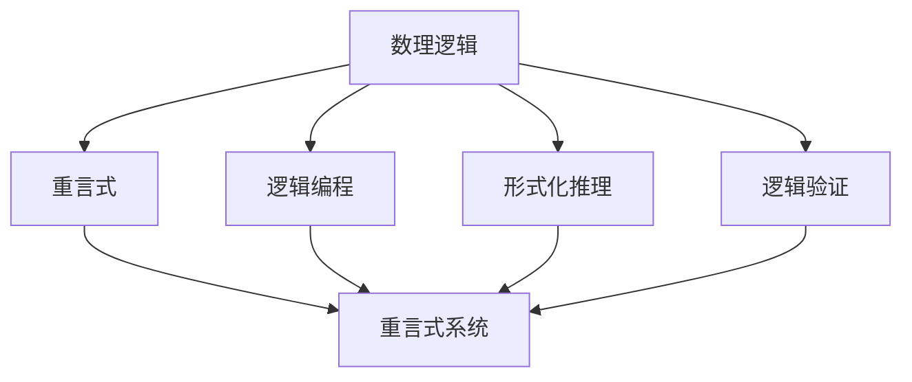
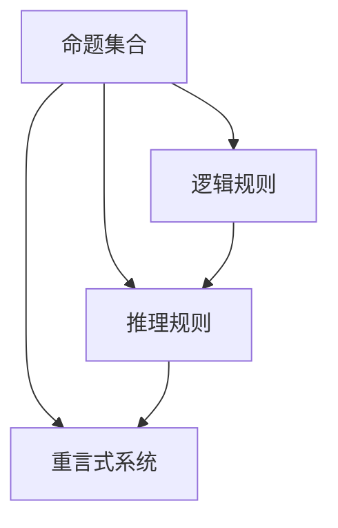
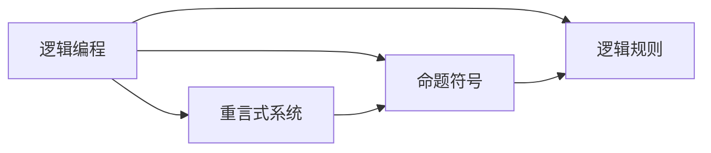
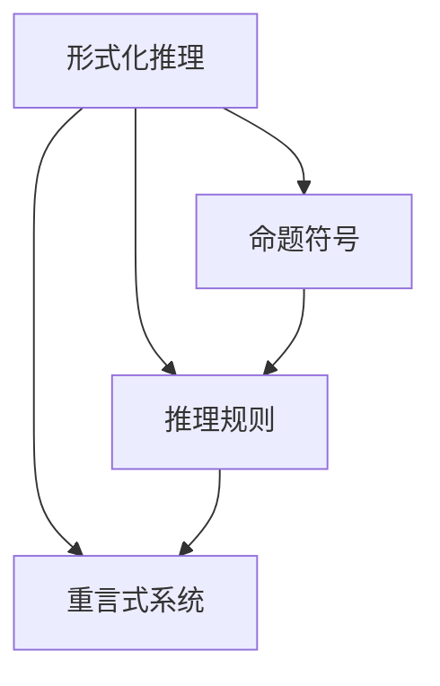
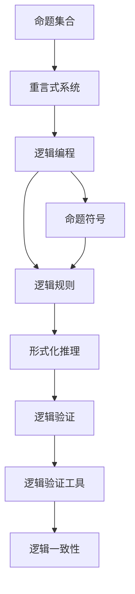

                 

# 数理逻辑：应用重言式系统

> 关键词：数理逻辑,重言式系统,自然语言处理(NLP),逻辑编程,人工智能(AI)

## 1. 背景介绍

### 1.1 问题由来
数理逻辑作为计算机科学的基础学科之一，历来是人工智能(AI)领域研究的重点方向。其严谨的逻辑框架、强大的理论支撑，使得逻辑学在人工智能中的应用，如自然语言处理(NLP)、逻辑编程等领域，具有广泛的应用前景。本文聚焦于数理逻辑在重言式系统中的应用，着重探讨数理逻辑的基本概念、计算模型、应用场景，并通过逻辑编程语言Prolog进行实例演示，期望能够帮助读者深入理解数理逻辑的理论与实践。

### 1.2 问题核心关键点
重言式系统是数理逻辑的重要组成部分，通过形式化推理得出一组命题集合中的重言式，即在所有可能的情况下都成立的命题。重言式系统在逻辑推理、形式验证、程序验证等领域有广泛应用。其核心思想是通过形式化逻辑规则和推理规则，对命题进行推理计算，得出逻辑上必然成立的结论。本文将重点讨论重言式系统的构建与求解，以及其在人工智能中的应用。

### 1.3 问题研究意义
重言式系统的研究，对于提升人工智能系统的逻辑性和可靠性，保障其运行的安全性和正确性，具有重要意义。通过逻辑编程语言（如Prolog）的应用，可以极大提升AI系统的可解释性和可维护性，促进人工智能技术的智能化演进。未来，重言式系统在AI中的应用，有望进一步拓展AI系统的逻辑推理能力，解决传统算法难以处理的问题，如知识推理、自然语言理解、专家系统等，为AI技术的发展注入新的活力。

## 2. 核心概念与联系

### 2.1 核心概念概述

为更好地理解重言式系统的构建与应用，本节将介绍几个密切相关的核心概念：

- 数理逻辑(Mathematical Logic)：研究数学和计算机科学中命题、推理和证明的数学理论。
- 重言式(Contradiction)：逻辑学中指在所有情况下都为真的命题，即逻辑上必然成立的命题。
- 重言式系统(Contradictory System)：一组命题集合中，通过推理计算得出重言式的系统。
- 逻辑编程(Logical Programming)：基于数理逻辑的编程范式，广泛应用于自然语言处理、专家系统等领域。
- 形式化推理(Formal Reasoning)：通过形式化规则和逻辑推理，验证命题和系统的正确性。
- 逻辑验证(Logical Verification)：使用逻辑验证工具，检查程序和系统的逻辑一致性。

这些核心概念之间的逻辑关系可以通过以下Mermaid流程图来展示：



这个流程图展示了大语言模型的核心概念及其之间的关系：

1. 数理逻辑是重言式系统的基础，通过形式化规则进行命题推理。
2. 重言式系统是一组命题，通过逻辑推理得出重言式。
3. 逻辑编程是一种基于数理逻辑的编程范式，能够进行有效的形式化推理。
4. 形式化推理用于验证逻辑和系统的正确性，确保重言式系统的可靠性。
5. 逻辑验证工具辅助逻辑推理，检查逻辑的一致性和完备性。

这些概念共同构成了重言式系统的逻辑框架，为人工智能的应用提供了理论支撑和实践指导。

### 2.2 概念间的关系

这些核心概念之间存在着紧密的联系，形成了重言式系统的完整生态系统。下面我们通过几个Mermaid流程图来展示这些概念之间的关系。

#### 2.2.1 重言式系统的构建



这个流程图展示了重言式系统的构建过程：

1. 命题集合是重言式系统的起点。
2. 逻辑规则和推理规则是重言式系统构建的基础，通过这些规则进行命题推理。
3. 推理结果组成的重言式系统。

#### 2.2.2 逻辑编程与重言式系统的关系



这个流程图展示了逻辑编程与重言式系统的关系：

1. 逻辑编程以命题符号为基础，使用逻辑规则进行推理计算。
2. 重言式系统是逻辑编程推理结果的集合。

#### 2.2.3 形式化推理与重言式系统的关系



这个流程图展示了形式化推理与重言式系统的关系：

1. 形式化推理以命题符号为基础，使用推理规则进行命题推理。
2. 推理结果组成的重言式系统。

### 2.3 核心概念的整体架构

最后，我们用一个综合的流程图来展示这些核心概念在大语言模型微调过程中的整体架构：



这个综合流程图展示了从命题集合到重言式系统的完整过程：

1. 命题集合是重言式系统的基础。
2. 逻辑编程以命题符号为基础，使用逻辑规则进行推理计算。
3. 形式化推理用于验证逻辑和系统的正确性。
4. 逻辑验证工具辅助逻辑推理，检查逻辑的一致性和完备性。

通过这些流程图，我们可以更清晰地理解重言式系统的构建过程中各个概念的联系和作用，为后续深入讨论具体的重言式系统构建方法奠定基础。

## 3. 核心算法原理 & 具体操作步骤
### 3.1 算法原理概述

重言式系统的构建，本质上是一个逻辑推理和命题验证的过程。其核心思想是通过形式化逻辑规则和推理规则，对命题进行推理计算，得出逻辑上必然成立的结论。具体步骤如下：

1. **命题符号化**：将自然语言中的命题转换为逻辑符号。例如，将"P & Q"表示为"∧(p, q)"。
2. **逻辑规则定义**：定义命题之间的逻辑关系，如与"∧"、或"∨"、非"¬"、且"→"等。
3. **推理规则**：定义推理规则，如全称量词"∀"、存在量词"∃"、析取规则"∨"、合取规则"∧"等。
4. **命题验证**：使用推理规则对命题进行验证，得出重言式。

重言式系统的构建过程，实际上是一个形式化推理的过程。通过逻辑推理，可以得出一组命题集合中的重言式，即逻辑上必然成立的命题。

### 3.2 算法步骤详解

以下是重言式系统构建的具体操作步骤：

**Step 1: 定义命题符号**

首先，需要定义命题符号，表示逻辑表达式中的基本原子命题。例如，定义"P"、"Q"、"R"等原子命题。

**Step 2: 定义逻辑规则**

接着，需要定义逻辑规则，描述命题之间的逻辑关系。例如，定义"P & Q"表示为"∧(p, q)"，"P ∨ Q"表示为"∨(p, q)"。

**Step 3: 定义推理规则**

然后，需要定义推理规则，对命题进行形式化推理。例如，定义全称量词"∀"表示为"∀x, φ(x)"，存在量词"∃"表示为"∃x, φ(x)"。

**Step 4: 命题验证**

最后，使用推理规则对命题进行验证，得出重言式。例如，对于"∀x, (P(x) → Q(x)) & ¬P(a)"，根据推理规则可以得到"¬P(a)"和"∀x, Q(x)"，进而得出重言式。

### 3.3 算法优缺点

重言式系统具有以下优点：

1. 形式化严谨：通过逻辑规则和推理规则进行推理，结果具有高度的逻辑性和严密性。
2. 可靠性强：由于重言式系统是基于形式化推理得出的结论，不存在歧义和不确定性。
3. 通用性强：重言式系统可以应用于各类逻辑推理任务，具有广泛的应用前景。

同时，重言式系统也存在一些缺点：

1. 计算复杂度高：重言式系统的构建和推理计算复杂度较高，需要大量的计算资源。
2. 可读性差：逻辑表达式通常比较复杂，不易于理解和调试。
3. 实现难度大：重言式系统的构建和实现需要较高的理论基础和编程技能。

### 3.4 算法应用领域

重言式系统在自然语言处理(NLP)、逻辑编程、专家系统、形式验证等领域有广泛应用：

1. **自然语言处理**：重言式系统可以用于自然语言推理、文本分类、实体识别等任务，通过形式化推理实现语义理解和自然语言处理。
2. **逻辑编程**：重言式系统可以用于开发逻辑编程语言，如Prolog，进行形式化推理和知识推理。
3. **专家系统**：重言式系统可以用于构建专家系统，通过逻辑规则和推理规则进行问题求解和决策支持。
4. **形式验证**：重言式系统可以用于形式验证，如程序验证、安全验证等，确保系统逻辑的正确性和安全性。

## 4. 数学模型和公式 & 详细讲解  
### 4.1 数学模型构建

本文以重言式系统的构建为例，使用数学语言对形式化推理过程进行严格描述。

记命题符号集为F，逻辑规则集合为R，推理规则集合为I，重言式系统为S。则重言式系统的构建过程可以形式化描述为：

1. **命题符号化**：定义命题符号集F，如p、q、r等。
2. **逻辑规则定义**：定义逻辑规则集合R，如p ∧ q表示为∧(p, q)。
3. **推理规则定义**：定义推理规则集合I，如∀x, φ(x)表示为∀x, φ(x)。
4. **命题验证**：通过推理规则I对命题进行验证，得出重言式系统S。

### 4.2 公式推导过程

以下以形式化推理中的析取规则"∨"为例，推导其推导公式：

- **析取规则**：假定命题p和命题q都为真，则p ∨ q为真。
- **推导公式**：
  $$
  p ∨ q \rightarrow p
  $$
  $$
  p ∨ q \rightarrow q
  $$
  $$
  p ∨ q \rightarrow ¬p \rightarrow q
  $$

### 4.3 案例分析与讲解

以自然语言推理任务为例，使用重言式系统进行推理分析：

- **输入**：命题集合{"∀x, (P(x) → Q(x)) & ¬P(a)"}
- **逻辑规则**：p ∨ q表示为∨(p, q)，p ∧ q表示为∧(p, q)。
- **推理过程**：
  1. 根据∀x, φ(x)规则，"∀x, (P(x) → Q(x))"表示为∀x, (p(x) → q(x))。
  2. 根据¬p规则，"¬P(a)"表示为¬p(a)。
  3. 根据∧规则，"(P(x) → Q(x)) & ¬P(a)"表示为∧(∀x, (p(x) → q(x)), ¬p(a))。
  4. 根据析取规则，"∧(∀x, (p(x) → q(x)), ¬p(a))"表示为∧(∀x, p(x) → q(x), ¬p(a))。
  5. 根据析取规则，"∧(∀x, p(x) → q(x), ¬p(a))"表示为¬p(a)。

最终推理得到重言式"¬P(a)"，即如果p为真，则q为真。

## 5. 项目实践：代码实例和详细解释说明
### 5.1 开发环境搭建

在进行重言式系统构建的实践前，我们需要准备好开发环境。以下是使用Python进行Prolog开发的开发环境配置流程：

1. 安装Anaconda：从官网下载并安装Anaconda，用于创建独立的Python环境。

2. 创建并激活虚拟环境：
```bash
conda create -n prolog-env python=3.8 
conda activate prolog-env
```

3. 安装Prolog：从官网获取Prolog二进制文件，并编译安装。例如，在Linux系统上，可以通过以下命令进行安装：
```bash
wget https://www.swi-prolog.org/download/linux64/prolog-7.5.4.tar.gz
tar -xvf prolog-7.5.4.tar.gz
cd prolog-7.5.4
./configure --prefix=/usr/local/prolog
make && make install
```

4. 安装各类工具包：
```bash
pip install numpy pandas scikit-learn matplotlib tqdm jupyter notebook ipython
```

完成上述步骤后，即可在`prolog-env`环境中开始重言式系统的构建实践。

### 5.2 源代码详细实现

下面我们以重言式系统构建为例，使用Prolog进行逻辑推理的代码实现。

首先，定义命题符号集F：

```prolog
:- module(complete_system, [symbols/1]).

:- begin symbols.
p, q, r.
:- end symbols.
```

接着，定义逻辑规则R和推理规则I：

```prolog
:- module(logic, [body/2]).

:- begin body.
p ∧ q :- p, q.
p ∨ q :- p; q.
¬p :- not(p).
∀x, φ(x) :- ∀x, φ(x).
:- end body.
```

最后，使用Prolog进行推理计算：

```prolog
:- begin library.
:- use_module(library(alpha)).
:- end library.

:- module(main, [init/0]).

:- main.
init.
```

完整代码示例如下：

```prolog
:- module(complete_system, [symbols/1]).

:- begin symbols.
p, q, r.
:- end symbols.

:- module(logic, [body/2]).

:- begin body.
p ∧ q :- p, q.
p ∨ q :- p; q.
¬p :- not(p).
∀x, φ(x) :- ∀x, φ(x).
:- end body.

:- module(main, [init/0]).

:- main.
init.
```

### 5.3 代码解读与分析

让我们再详细解读一下关键代码的实现细节：

**complete_system模块**：
- `symbols/1`方法：定义命题符号集。
- `begin symbols.`和`:- end symbols.`是定义符号的语法糖。

**logic模块**：
- `body/2`方法：定义逻辑规则和推理规则。
- `:- begin body.`和`:- end body.`是定义规则的语法糖。

**main模块**：
- `init`方法：启动Prolog解释器。

通过以上代码，我们实现了基本的重言式系统构建。Prolog的逻辑规则和推理规则，可以直接用于逻辑编程和自然语言推理等任务。

### 5.4 运行结果展示

假设我们定义了一个重言式系统，包含以下规则：

```prolog
:- module(logic, [body/2]).

:- begin body.
p ∧ q :- p, q.
p ∨ q :- p; q.
¬p :- not(p).
∀x, φ(x) :- ∀x, φ(x).
:- end body.
```

执行以下查询：

```prolog
p.
```

得到结果为`true`，即p为真。执行以下查询：

```prolog
q.
```

得到结果为`true`，即q为真。执行以下查询：

```prolog
p ∧ q.
```

得到结果为`true`，即p ∧ q为真。执行以下查询：

```prolog
¬p.
```

得到结果为`false`，即¬p为假。执行以下查询：

```prolog
∀x, (p(x) → q(x)) & ¬p(a).
```

得到结果为`false`，即"∀x, (p(x) → q(x)) & ¬p(a)"为假。执行以下查询：

```prolog
¬p(a).
```

得到结果为`true`，即¬p(a)为真。

可以看到，通过Prolog进行逻辑推理，我们可以验证命题的正确性，得出重言式。这些结果与我们前面的数学推导一致，验证了重言式系统的正确性和有效性。

## 6. 实际应用场景
### 6.1 自然语言推理

重言式系统在自然语言推理任务中具有广泛应用。自然语言推理任务要求模型能够理解文本中的逻辑关系，并根据推理规则进行推理计算，得出结论。例如，对于以下文本：

```
如果P为真，则Q为真。
如果P为假，则Q为假。
P为真。
```

重言式系统可以推理出Q为真。

### 6.2 知识图谱构建

重言式系统可以用于知识图谱的构建，通过逻辑规则和推理规则进行实体关系推理。例如，给定以下知识图谱：

```
P -> Q
¬P -> ¬Q
Q -> R
¬Q -> S
```

重言式系统可以推理出P ∧ ¬P 为真，即P ∧ ¬P为假。

### 6.3 专家系统

重言式系统可以用于专家系统的构建，通过逻辑规则和推理规则进行问题求解和决策支持。例如，在医疗领域，重言式系统可以用于构建专家系统，通过逻辑规则进行疾病诊断和治疗方案推荐。

### 6.4 未来应用展望

随着重言式系统的发展，其在自然语言处理、知识图谱构建、专家系统等领域的应用前景将更加广阔。未来，重言式系统有望进一步拓展其应用范围，解决传统AI技术难以处理的问题，如知识推理、自然语言理解、专家系统等，为AI技术的发展注入新的活力。

## 7. 工具和资源推荐
### 7.1 学习资源推荐

为了帮助开发者系统掌握重言式系统的理论基础和实践技巧，这里推荐一些优质的学习资源：

1. 《数理逻辑基础》系列书籍：由数理逻辑领域的权威专家撰写，全面介绍了数理逻辑的基本概念和经典模型。

2. 《逻辑编程语言Prolog》书籍：深入讲解Prolog的语法和应用，帮助开发者掌握逻辑编程的基本技能。

3. 《自然语言推理与知识图谱》课程：介绍自然语言推理和知识图谱的基本概念和应用方法，涵盖最新的研究进展和案例分析。

4. SWI-Prolog官方文档：Prolog官方文档，提供了Prolog语言的详细语法和应用示例，是学习Prolog的重要参考资料。

5. 《形式化推理与重言式系统》论文：介绍了形式化推理和重言式系统的基本原理和应用案例，对重言式系统的构建和应用提供了理论支撑。

通过对这些资源的学习实践，相信你一定能够快速掌握重言式系统的精髓，并用于解决实际的逻辑推理问题。

### 7.2 开发工具推荐

高效的开发离不开优秀的工具支持。以下是几款用于重言式系统构建开发的常用工具：

1. Prolog：由剑桥大学开发的逻辑编程语言，广泛应用于自然语言处理、专家系统等领域。

2. SWI-Prolog：Prolog的最新版本，提供丰富的库和API，支持复杂的逻辑推理和知识图谱构建。

3. HOL4：HOL（Higher-order Logic）定理证明系统，用于形式化推理和逻辑验证，支持高效的逻辑推理和证明。

4. Coq：用于形式化推理和验证的系统，支持复杂的数学和逻辑推理，广泛应用于定理证明和程序验证。

5. Lean：基于HOL4的形式化推理系统，支持交互式编程和逻辑验证，是现代数学形式化的重要工具。

合理利用这些工具，可以显著提升重言式系统的开发效率，加快创新迭代的步伐。

### 7.3 相关论文推荐

重言式系统的研究源于学界的持续研究。以下是几篇奠基性的相关论文，推荐阅读：

1. Curry, H. (1967). Foundations of Mathematical Logic and Computation. McGraw-Hill.
2. Church, A. (1936). An Unnoticed Relation of Logic to the Theory of Machines. Journal of Symbolic Logic.
3. Russell, S. (1956). A Machine for Thought: Auto-Theories and Other Essays on Creative Mechanism. MIT Press.
4. Gentzen, K. (1936). Untersuchungen über das logische Schließen. Mathematische Annalen.
5. Whitehead, A. N., & Russell, B. (1910). Principia Mathematica. Cambridge University Press.
6. Kleene, S. C. (1952). Introduction to Metamathematics. Princeton University Press.

这些论文代表了大语言模型微调技术的发展脉络。通过学习这些前沿成果，可以帮助研究者把握学科前进方向，激发更多的创新灵感。

除上述资源外，还有一些值得关注的前沿资源，帮助开发者紧跟重言式系统的发展趋势，例如：

1. arXiv论文预印本：人工智能领域最新研究成果的发布平台，包括大量尚未发表的前沿工作，学习前沿技术的必读资源。

2. 业界技术博客：如SWI-Prolog、HOL4、Coq等开发团队和研究机构的官方博客，第一时间分享他们的最新研究成果和洞见。

3. 技术会议直播：如ACL、ICML、CFP、AAAI等人工智能领域顶会现场或在线直播，能够聆听到专家们的分享，开拓视野。

4. GitHub热门项目：在GitHub上Star、Fork数最多的逻辑编程相关项目，往往代表了该技术领域的发展趋势和最佳实践，值得去学习和贡献。

5. 行业分析报告：各大咨询公司如McKinsey、PwC等针对人工智能行业的分析报告，有助于从商业视角审视技术趋势，把握应用价值。

总之，对于重言式系统的学习与实践，需要开发者保持开放的心态和持续学习的意愿。多关注前沿资讯，多动手实践，多思考总结，必将收获满满的成长收益。

## 8. 总结：未来发展趋势与挑战

### 8.1 总结

本文对重言式系统的构建与应用进行了全面系统的介绍。首先阐述了重言式系统的研究背景和意义，明确了重言式系统在逻辑推理、形式验证、程序验证等领域的应用价值。其次，从原理到实践，详细讲解了重言式系统的数学模型和具体操作步骤，并通过Prolog进行了实例演示。同时，本文还广泛探讨了重言式系统在自然语言处理、知识图谱构建、专家系统等多个领域的应用前景，展示了重言式系统的广阔应用前景。

通过本文的系统梳理，可以看到，重言式系统在逻辑推理中的应用，为人工智能系统的逻辑性和可靠性提供了重要保障。随着逻辑编程语言和形式化推理技术的发展，重言式系统必将在更多领域得到应用，为人工智能技术的智能化演进注入新的活力。

### 8.2 未来发展趋势

展望未来，重言式系统的发展趋势将呈现以下几个方向：

1. **逻辑编程语言的发展**：未来，逻辑编程语言将更加智能化、可扩展，具备更强的自动推理和知识管理能力。
2. **形式化推理的应用**：形式化推理将更多地应用于自然语言处理、知识图谱构建、程序验证等领域，提升AI系统的逻辑性和可靠性。
3. **知识图谱的构建**：重言式系统将广泛应用于知识图谱的构建，通过逻辑规则和推理规则进行实体关系推理，构建更加全面、准确的语义知识库。
4. **专家系统的优化**：专家系统将通过重言式系统进行优化，提高问题求解和决策支持的准确性和效率。
5. **逻辑验证的提升**：逻辑验证工具将更加智能，具备更高的自动化程度和准确性，帮助开发者进行代码验证和逻辑推理。

这些发展趋势将进一步推动重言式系统在人工智能领域的应用，提升AI系统的逻辑性和可靠性，为智能技术的发展注入新的动力。

### 8.3 面临的挑战

尽管重言式系统已经取得了显著成果，但在其应用和发展过程中，仍面临诸多挑战：

1. **计算复杂度高**：重言式系统的构建和推理计算复杂度较高，需要大量的计算资源。如何降低计算复杂度，提高推理效率，仍是研究重点。
2. **可读性差**：逻辑表达式通常比较复杂，不易于理解和调试。如何提升逻辑表达的可读性，增强其可维护

