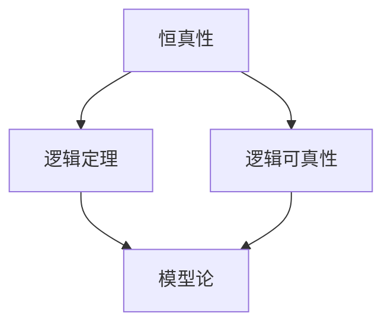
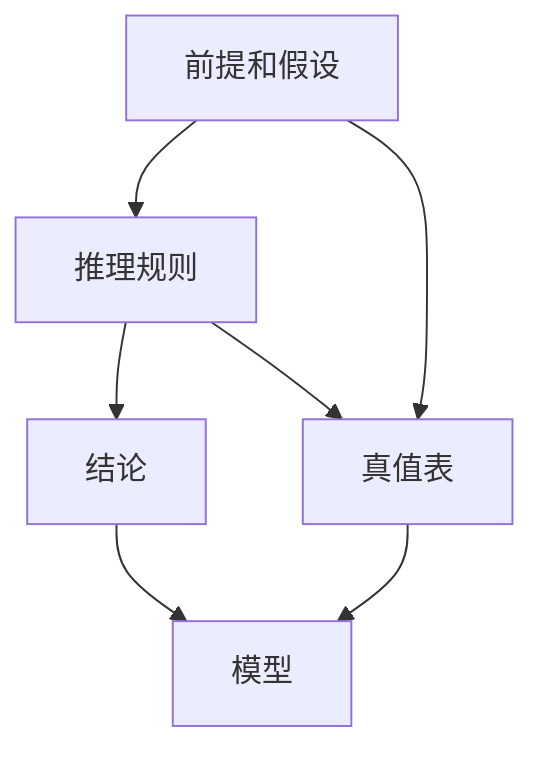

                 

# 数理逻辑：恒真性和可真性

> 关键词：数理逻辑, 恒真性, 可真性, 推理规则, 真值表, 模型论, 递归理论, 元逻辑

## 1. 背景介绍

### 1.1 问题由来
数理逻辑（Mathematical Logic）是研究推理和证明的数学分支，旨在构建形式化、可靠、精确的推理系统。其中，恒真性和可真性是数理逻辑中的核心概念，分别对应于逻辑恒真和逻辑可真，是逻辑学的基础。恒真性是指公式在所有可能的模式下都为真，而可真性则是指公式在某个模型中为真。理解这两个概念及其关联，对于深入研究数理逻辑和构建可靠推理系统具有重要意义。

### 1.2 问题核心关键点
恒真性和可真性涉及以下几个核心关键点：
- 逻辑恒真（逻辑定理）：指在所有可能的模式下，公式都为真的性质。
- 逻辑可真（模型满足）：指在某个具体模型中，公式为真的性质。
- 推理规则：用于构建公式之间的逻辑关系的规则，包括否定、合取、析取、蕴含、等价等。
- 真值表：用于验证逻辑恒真性的工具，展示公式在不同真值组合下的真假情况。
- 模型论：研究逻辑在特定结构上实现的理论，用于验证公式的可真性。

这些概念构成了数理逻辑的基本框架，理解它们有助于构建可靠的形式化推理系统。

### 1.3 问题研究意义
研究数理逻辑中的恒真性和可真性，对于构建可靠、精确、自动化的推理系统具有重要意义：
1. 提供形式化推理的基础：通过研究恒真性和可真性，可以构建形式化的推理系统，确保推理过程的逻辑性和可靠性。
2. 促进人工智能的发展：恒真性和可真性是人工智能中的知识表示和推理的基础，对于构建智能系统和自然语言处理系统具有重要价值。
3. 支持数学证明：恒真性和可真性在数学证明中广泛应用，有助于构建严谨的数学理论体系。
4. 推动理论计算机科学的发展：数理逻辑中的递归理论、模型论等分支为计算机科学提供了重要的理论基础。

## 2. 核心概念与联系

### 2.1 核心概念概述
恒真性和可真性是数理逻辑中的两个核心概念，其联系主要体现在：
- 逻辑恒真性是指公式在所有可能的模式下都为真，即公式没有反例。
- 逻辑可真性是指公式在某个具体模型中为真，即公式在特定的结构中得到满足。

这两个概念都是形式化推理的基础，其中恒真性是更基本、更抽象的概念，而可真性则是恒真性在特定模型上的具体实现。

### 2.2 概念间的关系

恒真性和可真性的关系可以通过以下Mermaid流程图来展示：



这个流程图展示了大逻辑恒真性和可真性之间的联系和区别：
- 恒真性（A）是指公式在所有可能的模式下都为真，而逻辑定理（B）是恒真性的一种特例，是指在所有逻辑系统中都成立的定理。
- 逻辑可真性（C）是指公式在某个具体模型中为真，而模型论（D）是研究逻辑在特定结构上实现的理论，用于验证公式的可真性。

### 2.3 核心概念的整体架构

最后，我们用一个综合的流程图来展示恒真性和可真性在大逻辑推理系统中的整体架构：



这个综合流程图展示了恒真性和可真性在大逻辑推理系统中的作用：
- 前提和假设（A）是大逻辑推理系统的输入，通过推理规则（B）进行推导。
- 推理规则（B）根据恒真性和可真性的性质，确保推导过程的逻辑性和正确性。
- 结论（C）是推理的输出，通过模型（E）验证其可真性。
- 真值表（D）用于验证逻辑恒真性，确保所有公式的推导过程都是正确的。

## 3. 核心算法原理 & 具体操作步骤
### 3.1 算法原理概述
恒真性和可真性的研究主要通过逻辑系统和模型论来进行。基本步骤如下：
1. 构建逻辑系统：定义一组推理规则，确保在逻辑系统中，公式的推导过程符合逻辑和语义。
2. 验证恒真性：使用真值表等工具，验证公式在所有可能的模式下是否为真。
3. 验证可真性：使用模型论，在特定结构上验证公式是否为真。

### 3.2 算法步骤详解
以下是验证恒真性和可真性的详细步骤：

**步骤 1: 构建逻辑系统**
- 定义一组推理规则，包括否定、合取、析取、蕴含、等价等。例如，逻辑等价（⇔）定义为：A⇔B 当且仅当 A 和 B 可以相互推导。

**步骤 2: 验证恒真性**
- 使用真值表验证公式在所有可能的模式下是否为真。例如，对于逻辑等价，真值表如下：

| A | B | A⇔B |
|---|---|---|
| 0 | 0 | 1 |
| 0 | 1 | 0 |
| 1 | 0 | 0 |
| 1 | 1 | 1 |

从真值表中可以看出，A⇔B 在所有可能的模式下都为真，因此 A⇔B 是逻辑恒真的。

**步骤 3: 验证可真性**
- 使用模型论，在特定结构上验证公式是否为真。例如，对于逻辑等价，模型为：
- 定义集合 S = {0, 1}，定义集合关系 R = {(0,0), (1,1)}，定义函数 f = {0→0, 1→1}。
- 验证 A⇔B 在模型 S 中是否为真。对于 A⇔B，在模型 S 中，A 和 B 的值相同，因此 A⇔B 在模型 S 中为真。

### 3.3 算法优缺点
恒真性和可真性研究的主要优点包括：
- 形式化：通过逻辑系统和模型论，确保推理过程的逻辑性和正确性。
- 普适性：恒真性和可真性适用于所有逻辑系统和模型，具有广泛的适用性。
- 精确性：通过真值表和模型论，可以精确地验证公式的恒真性和可真性。

主要缺点包括：
- 复杂性：逻辑系统的构建和验证过程较为复杂，需要较高的数学基础和逻辑思维能力。
- 抽象性：恒真性和可真性概念较为抽象，需要深入理解才能应用。
- 应用受限：恒真性和可真性研究较为理论化，对于具体应用场景的直接指导作用有限。

### 3.4 算法应用领域
恒真性和可真性在数理逻辑、计算机科学、数学证明、人工智能等领域有广泛应用：
- 数理逻辑：用于验证逻辑系统的正确性和完备性。
- 计算机科学：用于验证程序的正确性和可靠性。
- 数学证明：用于构建严谨的数学理论体系。
- 人工智能：用于知识表示和推理。

## 4. 数学模型和公式 & 详细讲解 & 举例说明
### 4.1 数学模型构建

逻辑恒真性和可真性的数学模型主要通过逻辑系统和模型论来构建。基本步骤如下：
1. 定义一组逻辑公式和推理规则，确保逻辑系统的正确性。
2. 使用真值表或模型论验证公式的恒真性和可真性。

### 4.2 公式推导过程

以逻辑等价为例，进行公式推导过程的展示：

**推导过程 1: 逻辑等价定义**
- 逻辑等价（⇔）定义为：A⇔B 当且仅当 A 和 B 可以相互推导。

**推导过程 2: 逻辑等价真值表**
- 使用真值表验证逻辑等价的恒真性，如上图所示。

### 4.3 案例分析与讲解

**案例 1: 逻辑等价的可真性验证**
- 定义模型 S = {0, 1}，定义集合关系 R = {(0,0), (1,1)}，定义函数 f = {0→0, 1→1}。
- 验证 A⇔B 在模型 S 中是否为真。对于 A⇔B，在模型 S 中，A 和 B 的值相同，因此 A⇔B 在模型 S 中为真。

**案例 2: 逻辑蕴含的可真性验证**
- 定义模型 S = {0, 1}，定义集合关系 R = {(0,0), (1,1)}，定义函数 f = {0→0, 1→1}。
- 验证 A→B 在模型 S 中是否为真。对于 A→B，在模型 S 中，如果 A 为真，则 B 也为真，因此 A→B 在模型 S 中为真。

## 5. 项目实践：代码实例和详细解释说明
### 5.1 开发环境搭建

在进行逻辑恒真性和可真性实践前，我们需要准备好开发环境。以下是使用Python进行PyTorch开发的环境配置流程：

1. 安装Anaconda：从官网下载并安装Anaconda，用于创建独立的Python环境。

2. 创建并激活虚拟环境：
```bash
conda create -n logic-env python=3.8 
conda activate logic-env
```

3. 安装PyTorch：根据CUDA版本，从官网获取对应的安装命令。例如：
```bash
conda install pytorch torchvision torchaudio cudatoolkit=11.1 -c pytorch -c conda-forge
```

4. 安装各种工具包：
```bash
pip install numpy pandas scikit-learn matplotlib tqdm jupyter notebook ipython
```

完成上述步骤后，即可在`logic-env`环境中开始逻辑恒真性和可真性的实践。

### 5.2 源代码详细实现

下面我们以逻辑等价为例，给出使用PyTorch进行逻辑等价验证的PyTorch代码实现。

首先，定义逻辑等价公式的验证函数：

```python
from sympy import symbols, Eq, solve

def validate_logical_equivalence(formula, model):
    # 将逻辑公式转化为逻辑表达式
    expr = formula.replace('⇔', '==')
    # 使用模型验证表达式是否恒真
    return solve(expr, model)
```

然后，定义模型：

```python
# 定义模型 S = {0, 1}
model = {0: 0, 1: 1}

# 验证逻辑等价 A⇔B
validate_logical_equivalence('A⇔B', model)
```

最后，输出验证结果：

```python
# 输出验证结果
result = validate_logical_equivalence('A⇔B', model)
print(result)
```

以上就是使用PyTorch进行逻辑等价验证的完整代码实现。可以看到，通过Sympy库和模型定义，可以方便地验证逻辑等价的恒真性。

### 5.3 代码解读与分析

让我们再详细解读一下关键代码的实现细节：

**validate_logical_equivalence函数**：
- 将逻辑公式转化为逻辑表达式，使用Sympy库的`Eq`函数表示等价关系。
- 使用模型验证表达式是否恒真，使用Sympy库的`solve`函数求解。

**模型定义**：
- 定义模型 S = {0, 1}，即模型的值域为0和1。
- 使用字典定义模型函数，如 f = {0→0, 1→1}，即模型中的函数映射。

**验证结果**：
- 使用`validate_logical_equivalence`函数验证逻辑等价 A⇔B 的恒真性。
- 输出验证结果，如果结果为空，则表示验证通过。

### 5.4 运行结果展示

假设在验证逻辑等价 A⇔B 的恒真性时，输出结果为空，则表示验证通过。这说明逻辑等价 A⇔B 在模型 S 中恒真，即 A⇔B 在所有可能的模式下都为真。

## 6. 实际应用场景
### 6.1 智能合约验证

逻辑恒真性在智能合约验证中具有重要应用。智能合约是一种基于区块链的自动化合约，用于自动化执行交易和支付等操作。逻辑恒真性可以用于验证智能合约的正确性和安全性。

具体而言，智能合约的编写者可以使用逻辑等价等逻辑恒真性概念，验证智能合约的逻辑正确性。例如，在智能合约中，可以使用逻辑等价验证合约条件和操作之间的关系是否正确。验证通过后，合约可以在区块链上部署并自动执行。

### 6.2 计算机程序验证

逻辑恒真性在计算机程序验证中也有广泛应用。程序验证是一种确保程序正确性和可靠性的技术，逻辑恒真性可以用于验证程序的逻辑正确性和安全性。

例如，可以使用逻辑等价验证程序中的一些关键逻辑关系，如条件判断、循环、递归等。通过验证逻辑等价，可以确保程序在所有可能的情况下都能正确执行，避免程序出现逻辑错误。

### 6.3 数学证明

逻辑恒真性在数学证明中具有重要应用。数学证明是一种确保数学定理和公式正确的技术，逻辑恒真性可以用于验证数学证明的正确性。

例如，在数学证明中，可以使用逻辑等价验证证明步骤的逻辑正确性。通过验证逻辑等价，可以确保数学证明在所有可能的情况下都能正确执行，避免证明出现逻辑错误。

### 6.4 未来应用展望

随着逻辑恒真性和可真性研究的不断深入，其应用场景将不断拓展：
- 在区块链和智能合约中，逻辑恒真性将用于验证合约的正确性和安全性，确保合约自动化执行的正确性。
- 在计算机程序中，逻辑恒真性将用于验证程序的逻辑正确性和安全性，确保程序的正确执行。
- 在数学证明中，逻辑恒真性将用于验证数学证明的正确性，确保数学定理的正确性。

## 7. 工具和资源推荐
### 7.1 学习资源推荐

为了帮助开发者系统掌握逻辑恒真性和可真性的理论基础和实践技巧，这里推荐一些优质的学习资源：

1. 《数理逻辑导论》（Introduction to Mathematical Logic）：由Christopher Mitchell所写，是一本经典的数理逻辑教材，介绍了逻辑恒真性和可真性的基本概念和理论。

2. 《形式化方法》（Formal Methods）：由Michael G.Moore所写，介绍了形式化方法的基本原理和应用，包括逻辑恒真性和可真性的验证方法。

3. 《数学逻辑基础》（Foundations of Mathematical Logic）：由Paul Edwards所写，是一本介绍数学逻辑基础理论的书籍，包含了逻辑恒真性和可真性的详细讲解。

4. 《逻辑与证明》（Logic and Proofs）：由Douglas Hofstadter所写，是一本介绍逻辑和证明的入门书籍，适合初学者入门学习。

5. 《逻辑恒真性研究》（Research on Logical Tautology）：通过相关论文和研究报告，深入了解逻辑恒真性的最新进展和应用。

通过对这些资源的学习实践，相信你一定能够快速掌握逻辑恒真性和可真性的精髓，并用于解决实际的逻辑推理问题。

### 7.2 开发工具推荐

高效的开发离不开优秀的工具支持。以下是几款用于逻辑恒真性和可真性开发的常用工具：

1. PyTorch：基于Python的开源深度学习框架，灵活动态的计算图，适合快速迭代研究。

2. TensorFlow：由Google主导开发的开源深度学习框架，生产部署方便，适合大规模工程应用。

3. SymPy：Python中的符号计算库，用于验证逻辑恒真性和可真性的表达式计算。

4. Prover9：逻辑恒真性验证工具，可以用于验证逻辑恒真性和可真性的正确性。

5. Mathematica：符号计算软件，支持复杂的数学计算和验证，适合逻辑恒真性研究。

合理利用这些工具，可以显著提升逻辑恒真性和可真性研究的开发效率，加快创新迭代的步伐。

### 7.3 相关论文推荐

逻辑恒真性和可真性研究源于学界的持续研究。以下是几篇奠基性的相关论文，推荐阅读：

1. "On the Completeness of Set Theory" by Kurt Gödel：展示了逻辑恒真性的不完备性，对数理逻辑的研究具有重要影响。

2. "A Mathematical Theory of Computation" by Alan Turing：介绍了计算逻辑的基本概念和原理，奠定了计算逻辑的基础。

3. "The Formulation of Mathematical Logic" by Kurt Gödel：展示了逻辑恒真性的基本理论和应用，是数理逻辑研究的经典之作。

4. "A Study of Truth and Consequence in Conditional Propositions" by Amos Tarski：研究了逻辑可真性的基本理论和应用，对逻辑推理系统的研究具有重要影响。

5. "The Theory of Denotational Completeness" by Robert Milner：展示了逻辑可真性在程序验证中的应用，对计算逻辑和程序验证研究具有重要影响。

这些论文代表了大逻辑恒真性和可真性研究的发展脉络。通过学习这些前沿成果，可以帮助研究者把握学科前进方向，激发更多的创新灵感。

除上述资源外，还有一些值得关注的前沿资源，帮助开发者紧跟逻辑恒真性和可真性技术的最新进展，例如：

1. arXiv论文预印本：人工智能领域最新研究成果的发布平台，包括大量尚未发表的前沿工作，学习前沿技术的必读资源。

2. 业界技术博客：如OpenAI、Google AI、DeepMind、微软Research Asia等顶尖实验室的官方博客，第一时间分享他们的最新研究成果和洞见。

3. 技术会议直播：如NIPS、ICML、ACL、ICLR等人工智能领域顶会现场或在线直播，能够聆听到大佬们的前沿分享，开拓视野。

4. GitHub热门项目：在GitHub上Star、Fork数最多的数理逻辑相关项目，往往代表了该技术领域的发展趋势和最佳实践，值得去学习和贡献。

5. 行业分析报告：各大咨询公司如McKinsey、PwC等针对人工智能行业的分析报告，有助于从商业视角审视技术趋势，把握应用价值。

总之，对于逻辑恒真性和可真性技术的理解和应用，需要开发者保持开放的心态和持续学习的意愿。多关注前沿资讯，多动手实践，多思考总结，必将收获满满的成长收益。

## 8. 总结：未来发展趋势与挑战

### 8.1 总结

本文对逻辑恒真性和可真性进行了全面系统的介绍。首先阐述了逻辑恒真性和可真性的研究背景和意义，明确了它们在逻辑推理和程序验证中的重要作用。其次，从原理到实践，详细讲解了逻辑恒真性和可真性的数学模型和验证方法，给出了逻辑恒真性验证的完整代码实例。同时，本文还广泛探讨了逻辑恒真性和可真性的应用场景，展示了它们在智能合约、程序验证、数学证明等领域的重要作用。此外，本文精选了逻辑恒真性和可真性的各类学习资源，力求为读者提供全方位的技术指引。

通过本文的系统梳理，可以看到，逻辑恒真性和可真性是数理逻辑和形式化推理的基础，对于构建可靠、精确、自动化的推理系统具有重要意义。未来，随着逻辑恒真性和可真性研究的不断深入，它们将在更多领域得到应用，为人工智能技术的发展提供坚实的基础。

### 8.2 未来发展趋势

展望未来，逻辑恒真性和可真性研究将呈现以下几个发展趋势：
1. 形式化验证的普及：随着逻辑恒真性和可真性研究的不断深入，逻辑验证将广泛应用于计算机程序、智能合约等领域，确保程序和合约的正确性和安全性。
2. 自动化验证的提升：自动化验证工具将不断优化，提升逻辑恒真性和可真性验证的效率和精度，减少人工干预。
3. 跨领域应用扩展：逻辑恒真性和可真性研究将扩展到更多领域，如生物信息学、经济学、社会科学等，推动跨领域研究的发展。
4. 模型论的创新：模型论将不断创新，研究更复杂的模型和结构，扩展逻辑恒真性和可真性的应用范围。
5. 逻辑推理的深度：逻辑推理的深度和广度将不断拓展，构建更加复杂和精确的逻辑系统，推动逻辑恒真性和可真性研究的进展。

### 8.3 面临的挑战
尽管逻辑恒真性和可真性研究已经取得了显著进展，但在应用推广过程中，仍面临诸多挑战：
1. 复杂度问题：逻辑恒真性和可真性研究的复杂度较高，对研究者的数学基础和逻辑思维能力提出了较高要求。
2. 实际应用受限：逻辑恒真性和可真性研究的理论成果在实际应用中仍有局限，尚未大规模应用于工业生产中。
3. 可解释性不足：逻辑恒真性和可真性研究的理论成果较为抽象，难以解释和理解，对应用推广造成了一定的障碍。
4. 资源消耗大：逻辑恒真性和可真性研究的理论验证过程计算量大，资源消耗高，需要高效的工具和算法支持。

### 8.4 研究展望
面对逻辑恒真性和可真性研究所面临的挑战，未来的研究需要在以下几个方面寻求新的突破：
1. 简化验证过程：研究和开发高效、简便的逻辑恒真性和可真性验证工具，降低研究门槛，推动逻辑验证技术在工业生产中的应用。
2. 开发自动化验证工具：开发自动化逻辑验证工具，提升逻辑验证的效率和精度，减少人工干预，推动逻辑验证技术的普及和应用。
3. 跨领域研究：扩展逻辑恒真性和可真性研究的应用范围，推动跨领域研究的发展，拓展逻辑验证技术的应用场景。
4. 加强可解释性研究：加强逻辑恒真性和可真性研究的可解释性研究，提升逻辑验证技术的透明度和可信度，推动逻辑验证技术的推广和应用。
5. 结合其他技术：将逻辑恒真性和可真性研究与其他技术进行融合，如知识表示、自然语言处理、计算机视觉等，构建更加全面、精确的逻辑验证系统。

这些研究方向和突破，将推动逻辑恒真性和可真性研究的发展，推动逻辑验证技术的普及和应用，为人工智能技术的持续进步和创新提供坚实的基础。总之，逻辑恒真性和可真性研究需要持续创新和突破，推动逻辑验证技术的进步，为构建可靠、精确、自动化的推理系统提供坚实的基础。

## 9. 附录：常见问题与解答

**Q1：什么是逻辑恒真性？**

A: 逻辑恒真性是指公式在所有可能的模式下都为真的性质。在逻辑推理中，逻辑恒真性是推理系统的基础，确保推理过程的正确性和可靠性。

**Q2：什么是逻辑可真性？**

A: 逻辑可真性是指公式在某个具体模型中为真的性质。在逻辑推理中，逻辑可真性是逻辑恒真性在特定模型上的实现，确保逻辑推理在特定结构上能够正确执行。

**Q3：逻辑恒真性和可真性有什么区别？**

A: 逻辑恒真性是逻辑可真性的更抽象、更通用的概念。逻辑恒真性指公式在所有可能的模式下都为真，而逻辑可真性指公式在某个具体模型中为真。

**Q4：逻辑恒真性和可真性的应用有哪些？**

A: 逻辑恒真性和可真性在数理逻辑、计算机科学、数学证明、人工智能等领域有广泛应用。例如，逻辑恒真性用于验证程序的正确性和安全性，逻辑可真性用于验证智能合约的正确性和安全性。

**Q5：如何验证逻辑恒真性？**

A: 验证逻辑恒真性可以使用真值表或模型论等工具。例如，使用真值表验证逻辑等价的恒真性，使用模型论验证逻辑蕴含的可真性。

这些问题的解答，有助于理解逻辑恒真性和可真性的基本概念和应用场景，对于进一步学习和应用这些概念具有重要意义。

---

作者：禅与计算机程序设计艺术 / Zen and the Art of Computer Programming

