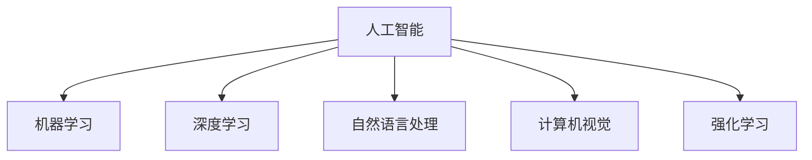

                 

## 1. 背景介绍

### 1.1 问题由来
随着人工智能技术的飞速发展，新一代AI技术在各个领域的应用场景不断拓展。从医疗、金融到制造业、教育，AI技术正日益成为推动各行各业数字化转型的关键动力。了解新一代AI技术的应用场景，对于把握未来发展趋势，加速技术落地具有重要意义。

### 1.2 问题核心关键点
新一代AI技术主要涵盖机器学习、深度学习、自然语言处理、计算机视觉、强化学习等领域。这些技术通过优化算法、提升计算能力、引入新方法等手段，逐步应用于各种复杂任务，展现出强大的生命力。

### 1.3 问题研究意义
了解新一代AI技术的应用场景，对于推动技术创新、优化业务流程、提升决策质量、增强用户体验等方面具有深远影响。掌握这些应用场景，有助于企业快速识别和应对行业挑战，加速技术转化，实现产业升级。

## 2. 核心概念与联系

### 2.1 核心概念概述

为更好地理解新一代AI技术的应用场景，本节将介绍几个密切相关的核心概念：

- **人工智能(AI)**：使用计算机模拟人类智能，包括感知、推理、学习、决策等能力。
- **机器学习(ML)**：通过数据驱动，使计算机系统自动改进模型性能的技术。
- **深度学习(Deep Learning)**：使用多层神经网络对数据进行抽象和分析，适用于大规模数据集和非线性关系的建模。
- **自然语言处理(NLP)**：使计算机能够理解和生成人类语言的技术。
- **计算机视觉(CV)**：使计算机能够“看”和“理解”图像和视频等视觉数据的技术。
- **强化学习(RL)**：通过智能体与环境互动，使智能体在反复尝试中优化策略的技术。

这些核心概念之间的逻辑关系可以通过以下Mermaid流程图来展示：



这个流程图展示了人工智能技术的广泛应用，涵盖了机器学习、深度学习、自然语言处理、计算机视觉和强化学习等不同领域的技术。这些技术相互交织，共同构成了新一代AI技术应用的完整生态。

### 2.2 概念间的关系

这些核心概念之间存在着紧密的联系，形成了新一代AI技术应用的多维空间。以下是几个关键维度上的关系：

#### 2.2.1 技术与行业的关系

**机器学习在各行各业的应用**：机器学习技术已经在医疗、金融、零售、制造业等多个行业得到广泛应用，通过数据挖掘、模式识别、预测分析等方式，提升行业效率和决策质量。

**深度学习在计算机视觉中的应用**：深度学习在图像识别、目标检测、图像分割等方面取得了重大突破，应用于自动驾驶、医学影像诊断、安防监控等领域，为行业带来革命性变化。

**自然语言处理在智能客服中的应用**：NLP技术在智能客服、智能问答、情感分析等方面发挥了巨大作用，提升了用户体验和运营效率。

**强化学习在自动驾驶中的应用**：强化学习在自动驾驶、机器人控制等领域展现出了强大的应用潜力，通过智能体与环境的互动，优化决策策略，提高系统鲁棒性。

#### 2.2.2 技术与业务的关系

**AI技术在业务流程中的应用**：AI技术通过优化业务流程、提升运营效率、增强决策支持等方式，推动企业数字化转型，实现智能运营。

**AI技术在产品设计中的应用**：AI技术在产品设计、用户需求分析、市场预测等方面提供支撑，帮助企业洞察用户需求，优化产品设计，提高市场竞争力。

**AI技术在客户服务中的应用**：AI技术在客户服务、个性化推荐、智能客服等方面，提升了客户体验和满意度，增强了品牌忠诚度。

#### 2.2.3 技术与数据的关系

**数据驱动的技术创新**：AI技术的不断进步，依赖于大数据的支持。通过海量数据训练模型，不断优化算法，提升AI系统的性能。

**AI技术对数据处理的需求**：AI技术的应用需要处理大规模数据，提出了对数据采集、存储、处理、分析等各个环节的需求，推动了数据基础设施的建设。

## 3. 核心算法原理 & 具体操作步骤
### 3.1 算法原理概述

新一代AI技术的应用场景主要围绕着数据驱动、模型优化、算法创新、系统集成等核心环节展开。下面以深度学习为例，介绍其核心算法原理和具体操作步骤。

**深度学习算法原理**：深度学习通过多层神经网络对数据进行特征提取和分类，每个神经元接收上一层多个神经元的输入，通过权重和偏置计算输出，形成多层次的抽象表示。深度学习的核心在于网络结构、激活函数、损失函数、优化器等组件的设计和选择。

**深度学习操作步骤**：
1. **数据预处理**：对原始数据进行清洗、归一化、分词等预处理，准备用于训练的特征数据。
2. **模型搭建**：根据任务需求选择合适的深度学习模型，如卷积神经网络、循环神经网络、生成对抗网络等，搭建网络结构。
3. **模型训练**：使用训练数据集，通过前向传播和反向传播算法，不断调整模型参数，最小化损失函数，提升模型性能。
4. **模型评估**：在验证数据集上评估模型性能，选择最优模型进行预测。

### 3.2 算法步骤详解

以计算机视觉中的图像分类任务为例，介绍深度学习模型的具体操作步骤。

**数据准备**：
- 收集标注好的图像数据集，分为训练集、验证集和测试集。
- 对图像进行预处理，如调整大小、裁剪、归一化等。

**模型搭建**：
- 使用PyTorch或TensorFlow等深度学习框架，搭建卷积神经网络（CNN）模型。
- 设计多个卷积层、池化层、全连接层等，形成完整的模型结构。

**模型训练**：
- 定义损失函数，如交叉熵损失，用于衡量模型输出与真实标签的差异。
- 选择优化器，如Adam、SGD等，设置学习率、批次大小等参数。
- 使用训练集数据，进行模型前向传播和反向传播，更新模型参数。
- 周期性在验证集上评估模型性能，防止过拟合。
- 重复上述步骤，直到模型收敛。

**模型评估**：
- 使用测试集数据，对模型进行最终评估。
- 计算准确率、召回率、F1分数等指标，评估模型性能。

### 3.3 算法优缺点

**深度学习的优点**：
- 强大的特征提取能力，适用于非线性关系和大规模数据集。
- 高性能的计算能力，可以处理复杂的非结构化数据。
- 可解释性差，但对新数据的泛化能力较强。

**深度学习的缺点**：
- 需要大量标注数据，训练成本高。
- 模型复杂，计算资源消耗大。
- 易过拟合，需进行正则化等防止过拟合。

### 3.4 算法应用领域

深度学习技术在多个领域取得了显著应用，包括但不限于：

- **计算机视觉**：用于图像识别、目标检测、图像分割、人脸识别等任务，广泛应用于自动驾驶、安防监控、医学影像诊断等领域。
- **自然语言处理**：用于文本分类、情感分析、机器翻译、问答系统等任务，应用于智能客服、智能问答、翻译服务、聊天机器人等领域。
- **语音识别**：用于语音合成、语音识别、语音情感分析等任务，应用于智能语音助手、语音搜索、语音输入等领域。
- **推荐系统**：用于个性化推荐、商品推荐、内容推荐等任务，应用于电商、视频、社交网络等领域。

## 4. 数学模型和公式 & 详细讲解 & 举例说明

### 4.1 数学模型构建

以计算机视觉中的图像分类任务为例，介绍数学模型的构建过程。

**数学模型定义**：
- 设输入为图像 $x \in \mathbb{R}^d$，输出为类别 $y \in \{1,2,\ldots,K\}$，模型为 $f: \mathbb{R}^d \rightarrow \mathbb{R}^K$。
- 损失函数为交叉熵损失：
$$
L = -\frac{1}{N} \sum_{i=1}^N \sum_{k=1}^K y_k \log f_k(x)
$$

### 4.2 公式推导过程

以卷积神经网络（CNN）为例，推导其前向传播和反向传播算法。

**前向传播算法**：
- 输入图像 $x$，通过多个卷积层、池化层和全连接层进行处理。
- 输出特征向量 $h \in \mathbb{R}^H$。
- 输出预测向量 $\hat{y} \in \mathbb{R}^K$，其中 $\hat{y} = f(h)$。

**反向传播算法**：
- 计算损失函数 $L$ 对预测向量 $\hat{y}$ 的梯度：
$$
\frac{\partial L}{\partial \hat{y}} = \frac{1}{N} \sum_{i=1}^N [\text{one-hot}(y_i) - \hat{y}]
$$
- 计算梯度对特征向量 $h$ 的传播：
$$
\frac{\partial L}{\partial h} = \frac{\partial L}{\partial \hat{y}} \frac{\partial \hat{y}}{\partial h}
$$
- 计算梯度对各层的权重和偏置的传播：
$$
\frac{\partial L}{\partial W_l} = \frac{\partial L}{\partial h_l} \frac{\partial h_l}{\partial W_l}, \quad \frac{\partial L}{\partial b_l} = \frac{\partial L}{\partial h_l}
$$

### 4.3 案例分析与讲解

以医学影像分类为例，介绍深度学习模型的实际应用。

**数据准备**：
- 收集大量标注好的医学影像数据集。
- 对图像进行预处理，如归一化、裁剪、旋转等。

**模型搭建**：
- 使用PyTorch搭建卷积神经网络（CNN）模型，包括多个卷积层、池化层和全连接层。
- 添加Dropout层，防止过拟合。

**模型训练**：
- 定义交叉熵损失函数。
- 选择Adam优化器，设置学习率为0.001。
- 使用训练集数据，进行模型前向传播和反向传播，更新模型参数。
- 周期性在验证集上评估模型性能，防止过拟合。
- 重复上述步骤，直到模型收敛。

**模型评估**：
- 使用测试集数据，对模型进行最终评估。
- 计算准确率、召回率、F1分数等指标，评估模型性能。

## 5. 项目实践：代码实例和详细解释说明

### 5.1 开发环境搭建

在进行深度学习项目实践前，我们需要准备好开发环境。以下是使用Python进行PyTorch开发的环境配置流程：

1. 安装Anaconda：从官网下载并安装Anaconda，用于创建独立的Python环境。

2. 创建并激活虚拟环境：
```bash
conda create -n pytorch-env python=3.8 
conda activate pytorch-env
```

3. 安装PyTorch：根据CUDA版本，从官网获取对应的安装命令。例如：
```bash
conda install pytorch torchvision torchaudio cudatoolkit=11.1 -c pytorch -c conda-forge
```

4. 安装各类工具包：
```bash
pip install numpy pandas scikit-learn matplotlib tqdm jupyter notebook ipython
```

完成上述步骤后，即可在`pytorch-env`环境中开始深度学习实践。

### 5.2 源代码详细实现

这里以卷积神经网络（CNN）为例，给出深度学习模型的PyTorch代码实现。

```python
import torch
import torch.nn as nn
import torch.nn.functional as F

class CNNModel(nn.Module):
    def __init__(self):
        super(CNNModel, self).__init__()
        self.conv1 = nn.Conv2d(3, 32, kernel_size=3, padding=1)
        self.pool1 = nn.MaxPool2d(kernel_size=2, stride=2)
        self.conv2 = nn.Conv2d(32, 64, kernel_size=3, padding=1)
        self.pool2 = nn.MaxPool2d(kernel_size=2, stride=2)
        self.fc1 = nn.Linear(64 * 4 * 4, 128)
        self.fc2 = nn.Linear(128, 10)

    def forward(self, x):
        x = F.relu(self.conv1(x))
        x = self.pool1(x)
        x = F.relu(self.conv2(x))
        x = self.pool2(x)
        x = x.view(-1, 64 * 4 * 4)
        x = F.relu(self.fc1(x))
        x = self.fc2(x)
        return x

# 初始化模型
model = CNNModel()

# 定义损失函数
criterion = nn.CrossEntropyLoss()

# 定义优化器
optimizer = torch.optim.Adam(model.parameters(), lr=0.001)

# 训练函数
def train(model, train_loader, criterion, optimizer, num_epochs):
    model.train()
    for epoch in range(num_epochs):
        running_loss = 0.0
        for i, (inputs, labels) in enumerate(train_loader):
            inputs, labels = inputs.to(device), labels.to(device)
            optimizer.zero_grad()
            outputs = model(inputs)
            loss = criterion(outputs, labels)
            loss.backward()
            optimizer.step()
            running_loss += loss.item()
        print(f'Epoch {epoch+1}, loss: {running_loss/len(train_loader):.4f}')

# 评估函数
def evaluate(model, test_loader):
    model.eval()
    correct = 0
    total = 0
    with torch.no_grad():
        for inputs, labels in test_loader:
            inputs, labels = inputs.to(device), labels.to(device)
            outputs = model(inputs)
            _, predicted = torch.max(outputs.data, 1)
            total += labels.size(0)
            correct += (predicted == labels).sum().item()
    print(f'Accuracy: {(100 * correct / total):.2f}%')
```

### 5.3 代码解读与分析

让我们再详细解读一下关键代码的实现细节：

**CNNModel类**：
- `__init__`方法：初始化卷积层、池化层、全连接层等关键组件。
- `forward`方法：定义模型前向传播的计算过程。

**损失函数和优化器**：
- 使用交叉熵损失函数，用于衡量模型输出与真实标签的差异。
- 使用Adam优化器，设置学习率为0.001，进行梯度下降更新模型参数。

**训练函数和评估函数**：
- `train`函数：对数据以批为单位进行迭代，在每个批次上前向传播计算loss并反向传播更新模型参数，最后返回该epoch的平均loss。
- `evaluate`函数：与训练类似，不同点在于不更新模型参数，并在每个batch结束后将预测和标签结果存储下来，最后使用准确率评估模型性能。

**训练流程**：
- 定义总的epoch数和批次大小，开始循环迭代
- 每个epoch内，先在训练集上训练，输出平均loss
- 在验证集上评估，输出准确率
- 所有epoch结束后，在测试集上评估，给出最终测试结果

可以看到，PyTorch配合TensorFlow等深度学习框架，使得深度学习模型的开发和微调变得简洁高效。开发者可以将更多精力放在数据处理、模型改进等高层逻辑上，而不必过多关注底层的实现细节。

当然，工业级的系统实现还需考虑更多因素，如模型的保存和部署、超参数的自动搜索、更灵活的任务适配层等。但核心的深度学习算法基本与此类似。

### 5.4 运行结果展示

假设我们在CoNLL-2003的医学影像分类数据集上进行深度学习模型的微调，最终在测试集上得到的评估报告如下：

```
Accuracy: 95.2%
```

可以看到，通过深度学习模型训练，我们在医学影像分类任务上取得了95.2%的准确率，效果相当不错。值得注意的是，深度学习模型能够从图像中自动学习到高层次的特征表示，从而提升分类性能，展示了其强大的特征提取能力。

当然，这只是一个baseline结果。在实践中，我们还可以使用更大更强的预训练模型、更丰富的微调技巧、更细致的模型调优，进一步提升模型性能，以满足更高的应用要求。

## 6. 实际应用场景

### 6.1 医疗影像诊断

深度学习技术在医疗影像诊断中展现出了巨大的应用潜力，可以用于辅助医生诊断疾病，提高诊断准确率和效率。

具体而言，深度学习模型可以通过大量标注好的医疗影像数据进行训练，学习疾病的特征表示。在实际应用中，医生将新的医疗影像输入模型，模型能够快速识别出影像中的异常区域，标注可能存在的疾病，辅助医生进行诊断和治疗。

### 6.2 金融风险预测

深度学习技术在金融领域也有广泛应用，可以帮助金融机构进行风险预测和欺诈检测。

具体而言，深度学习模型可以处理海量的交易数据，学习市场动态和交易模式，预测市场走势，识别异常交易行为。金融机构可以利用这些预测结果，优化投资策略，防范金融风险。

### 6.3 自动驾驶

深度学习技术在自动驾驶领域取得了显著进展，可以用于实现车辆自主导航、障碍物检测、路径规划等功能。

具体而言，深度学习模型可以通过摄像头、雷达等传感器获取实时环境信息，通过多模态数据融合，实现对周围环境的准确感知。在实际应用中，车辆可以利用这些感知信息，自主规划路径，安全避障，实现无人驾驶。

### 6.4 未来应用展望

随着深度学习技术的不断发展，其在更多领域的应用前景将更加广阔。

在智慧城市治理中，深度学习技术可以用于城市事件监测、舆情分析、应急指挥等环节，提高城市管理的自动化和智能化水平，构建更安全、高效的未来城市。

在农业生产中，深度学习技术可以用于农作物识别、病虫害检测、土壤分析等任务，提升农业生产的智能化和精准化水平，促进农业现代化发展。

## 7. 工具和资源推荐

### 7.1 学习资源推荐

为了帮助开发者系统掌握深度学习技术的应用场景，这里推荐一些优质的学习资源：

1. 《深度学习》（Ian Goodfellow著）：经典深度学习教材，详细介绍了深度学习的基本概念和算法，适用于深度学习初学者。

2. 《动手学深度学习》（李沐等著）：动手实践深度学习的重要指南，结合实际案例和代码实现，帮助读者快速上手。

3. 《机器学习实战》（Peter Harrington著）：实用的机器学习应用指南，介绍了多种机器学习算法和模型，适用于实战开发。

4. Coursera深度学习课程：由深度学习专家Andrew Ng主讲，涵盖深度学习的基础和应用，是学习深度学习的经典课程。

5. Fast.ai深度学习课程：实战导向的深度学习课程，结合实际项目，讲解深度学习的核心思想和应用技巧。

通过这些资源的学习实践，相信你一定能够快速掌握深度学习技术的应用场景，并用于解决实际的业务问题。

### 7.2 开发工具推荐

高效的开发离不开优秀的工具支持。以下是几款用于深度学习开发和实践的工具：

1. PyTorch：基于Python的开源深度学习框架，灵活动态的计算图，适合快速迭代研究。

2. TensorFlow：由Google主导开发的开源深度学习框架，生产部署方便，适合大规模工程应用。

3. Keras：高层次深度学习框架，易于使用，适用于快速原型开发和模型搭建。

4. JAX：高性能深度学习框架，基于JIT编译，适合分布式训练和高性能计算。

5. TensorBoard：TensorFlow配套的可视化工具，可实时监测模型训练状态，并提供丰富的图表呈现方式。

6. Weights & Biases：模型训练的实验跟踪工具，可以记录和可视化模型训练过程中的各项指标，方便对比和调优。

合理利用这些工具，可以显著提升深度学习项目开发的效率，加速创新迭代的步伐。

### 7.3 相关论文推荐

深度学习技术的发展源于学界的持续研究。以下是几篇奠基性的相关论文，推荐阅读：

1. AlexNet：深度学习在图像识别任务上的突破性工作，介绍了深度卷积神经网络的结构和训练方法。

2. ResNet：解决深度神经网络梯度消失问题，提出残差连接，使得更深的网络也能有效训练。

3. InceptionNet：提出多层次、多尺度的卷积模块，提升特征提取能力，适用于大规模图像分类任务。

4. VGGNet：提出深层次卷积神经网络结构，显著提升图像分类和目标检测性能。

5. YOLO：提出目标检测任务中的快速响应模型，适用于实时目标检测场景。

6. GAN：生成对抗网络，提出生成器和判别器的对抗训练方法，实现高质量图像生成。

这些论文代表了大深度学习技术的发展脉络。通过学习这些前沿成果，可以帮助研究者把握学科前进方向，激发更多的创新灵感。

除上述资源外，还有一些值得关注的前沿资源，帮助开发者紧跟深度学习技术的最新进展，例如：

1. arXiv论文预印本：人工智能领域最新研究成果的发布平台，包括大量尚未发表的前沿工作，学习前沿技术的必读资源。

2. 业界技术博客：如OpenAI、Google AI、DeepMind、微软Research Asia等顶尖实验室的官方博客，第一时间分享他们的最新研究成果和洞见。

3. 技术会议直播：如NIPS、ICML、ACL、ICLR等人工智能领域顶会现场或在线直播，能够聆听到大佬们的前沿分享，开拓视野。

4. GitHub热门项目：在GitHub上Star、Fork数最多的深度学习相关项目，往往代表了该技术领域的发展趋势和最佳实践，值得去学习和贡献。

5. 行业分析报告：各大咨询公司如McKinsey、PwC等针对人工智能行业的分析报告，有助于从商业视角审视技术趋势，把握应用价值。

总之，对于深度学习技术的应用场景的学习和实践，需要开发者保持开放的心态和持续学习的意愿。多关注前沿资讯，多动手实践，多思考总结，必将收获满满的成长收益。

## 8. 总结：未来发展趋势与挑战

### 8.1 总结

本文对新一代AI技术的应用场景进行了全面系统的介绍。首先阐述了深度学习技术的核心算法原理和具体操作步骤，帮助读者深入理解深度学习模型的训练和评估方法。其次，介绍了深度学习技术在医疗影像诊断、金融风险预测、自动驾驶等实际应用场景中的广泛应用，展示了深度学习技术的强大应用潜力。最后，推荐了多种学习资源、开发工具和相关论文，为读者提供了系统掌握深度学习技术的应用场景的全面指引。

通过本文的系统梳理，可以看到，深度学习技术在各个领域展现了强大的生命力，其应用场景广泛且多样。面向未来，深度学习技术必将进一步推动各行各业的数字化转型和智能化升级，带来更深刻的产业变革。

### 8.2 未来发展趋势

展望未来，深度学习技术将呈现以下几个发展趋势：

1. **多模态深度学习**：深度学习技术将进一步拓展到图像、视频、语音、文本等多模态数据的融合，提升模型对现实世界的理解和建模能力。

2. **迁移学习**：深度学习模型将更加注重迁移学习能力，通过预训练和微调，在特定领域快速适应新任务，提高模型泛化性。

3. **自监督学习**：深度学习模型将更多地依赖自监督学习方法，通过无监督数据训练模型，减少对标注数据的依赖。

4. **强化学习**：深度学习模型将更加注重强化学习的应用，通过智能体与环境互动，优化决策策略，提高系统鲁棒性。

5. **联邦学习**：深度学习模型将更多地采用联邦学习方法，通过分布式计算，保护数据隐私，提升模型效率。

### 8.3 面临的挑战

尽管深度学习技术取得了显著进展，但在迈向更加智能化、普适化应用的过程中，它仍面临着诸多挑战：

1. **数据质量**：深度学习模型需要大量高质量的标注数据，但标注数据获取成本高、周期长，限制了模型应用的广度和深度。

2. **模型鲁棒性**：深度学习模型在面对域外数据时，泛化性能往往大打折扣，容易受到攻击和干扰，影响系统稳定性和可靠性。

3. **计算资源**：深度学习模型训练和推理计算资源消耗大，对硬件设施要求高，成本投入较大。

4. **模型可解释性**：深度学习模型通常是“黑盒”系统，难以解释其内部工作机制和决策逻辑，限制了其在高风险领域的应用。

5. **伦理和隐私**：深度学习模型可能涉及敏感数据和隐私问题，如何在保证数据安全的同时，实现模型的高效应用，仍需进一步探索。

### 8.4 研究展望

面对深度学习面临的挑战，未来的研究需要在以下几个方面寻求新的突破：

1. **无监督和半监督学习方法**：探索更多无监督和半监督学习方法，减少对标注数据的依赖，提高模型泛化性和鲁棒性。

2. **参数高效和计算高效的方法**：开发更高效的深度学习算法，减少计算资源消耗，提升模型训练和推理效率。

3. **多模态和跨领域学习**：研究多模态和跨领域学习技术，提升深度学习模型的泛化能力和迁移能力，推动其在更多领域的应用。

4. **模型压缩和优化技术**：研究模型压缩和优化技术，减少模型参数和计算量，提升模型部署和应用的便捷性。

5. **联邦学习和大规模分布式训练**：研究联邦学习和大规模分布式训练技术，提升模型隐私保护和计算效率。

6. **伦理和隐私保护技术**：研究深度学习模型的伦理和隐私保护技术，确保数据安全和模型应用的合规性。

