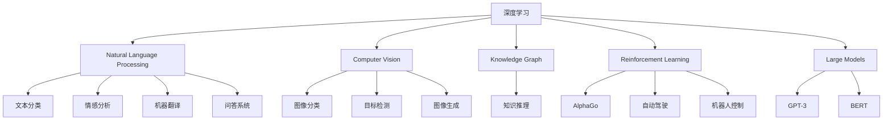
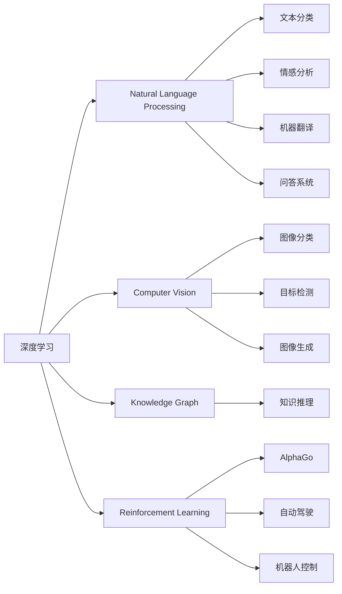
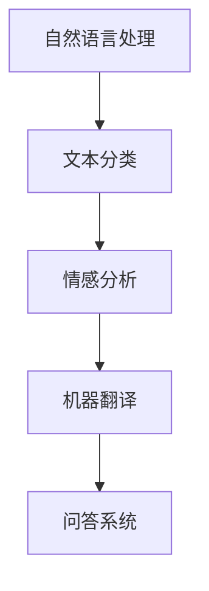
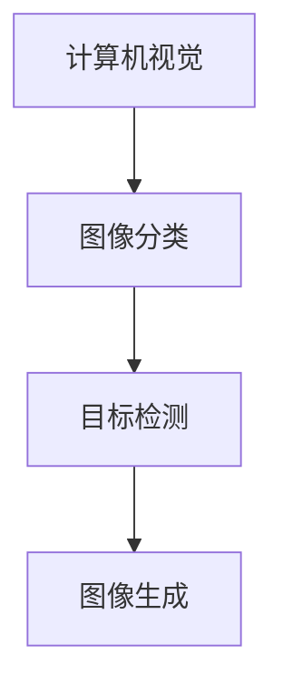
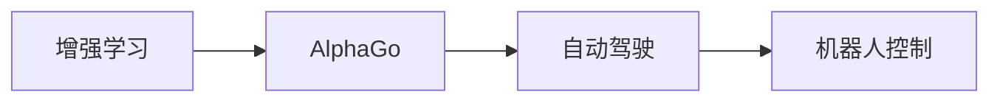
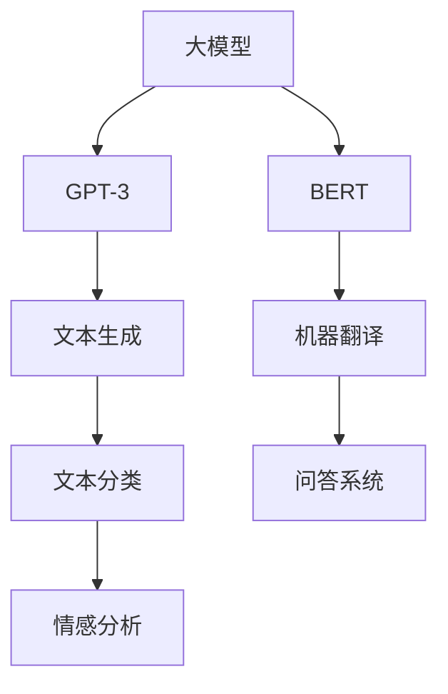
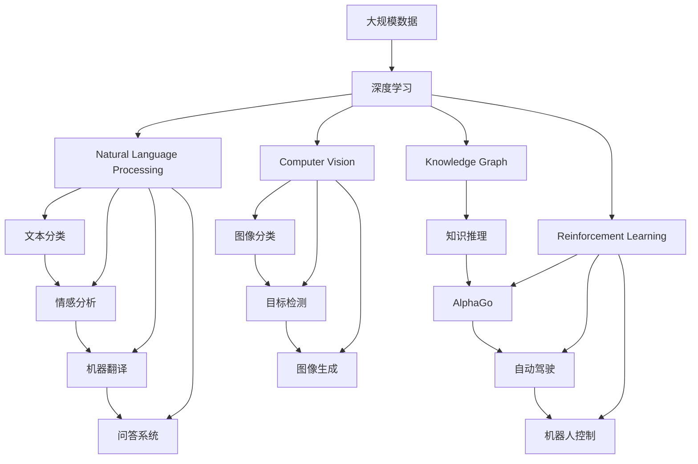

                 

# 新一代人工智能的技术趋势与应用场景

> 关键词：
人工智能, 深度学习, 自然语言处理, 计算机视觉, 知识图谱, 增强学习, 大模型, 数据科学, 跨领域应用

## 1. 背景介绍

### 1.1 问题由来
新一代人工智能（AI）技术的快速发展，尤其是深度学习（Deep Learning）技术的突破，推动了各领域的智能化转型。从语音识别到计算机视觉，从自然语言处理（NLP）到知识图谱，AI技术正以越来越强大的能力，深刻改变着人们的生活和工作方式。

AI技术的核心驱动因素包括计算能力的提升、数据量的爆炸性增长以及更高效的学习算法。这些技术进步共同促进了新一代AI的诞生，其特征是更加广泛的应用领域、更高的智能化水平以及更深层次的跨学科融合。

### 1.2 问题核心关键点
新一代AI的核心在于以下几个方面：
- **深度学习**：深度神经网络（如卷积神经网络CNN、循环神经网络RNN、长短期记忆网络LSTM等），通过多层次的特征提取与非线性变换，极大地提升了模型对于复杂问题的建模能力。
- **自然语言处理**：包括文本分类、情感分析、机器翻译、问答系统等任务，通过预训练模型如BERT、GPT等，显著提升了NLP任务的性能。
- **计算机视觉**：如图像分类、目标检测、图像生成、视频分析等任务，通过卷积神经网络等模型，实现了对图像和视频的高效处理。
- **知识图谱**：构建实体与关系图谱，实现更高效的知识推理和查询。
- **增强学习**：如AlphaGo、自动驾驶、机器人控制等任务，通过与环境的交互学习最优策略。
- **大模型**：如GPT-3、BERT等，通过在大规模数据上预训练，提升了模型对各类任务的泛化能力。

这些技术的进展，使得AI能够从简单的任务处理，拓展到复杂的智能交互，逐步向通用人工智能（AGI）迈进。

### 1.3 问题研究意义
新一代AI技术的研究与应用，对于推动各行业的智能化转型，提升生产力，具有重要意义：

1. **降低开发成本**：AI技术的自动化、高效性，极大地减少了人力物力的投入。
2. **提升效率**：AI能够快速处理大量数据，实现自动化决策，提高效率。
3. **创新驱动**：AI技术促进了跨学科的融合创新，催生了新业态和新产品。
4. **用户体验**：AI技术在各个领域的应用，提高了用户的体验和满意度。
5. **数据驱动**：AI技术通过对海量数据的处理与分析，推动了大数据技术的发展。

总之，新一代AI技术不仅是科技前沿的探索，更是未来社会发展的重要驱动力。

## 2. 核心概念与联系

### 2.1 核心概念概述

为更好地理解新一代AI的技术趋势和应用场景，本节将介绍几个关键概念：

- **深度学习**：基于神经网络模型，通过多层次特征提取与非线性变换，实现对复杂问题的建模和预测。
- **自然语言处理**：利用AI技术对文本信息进行处理与理解，包括文本分类、情感分析、机器翻译、问答系统等任务。
- **计算机视觉**：通过AI技术对图像和视频数据进行处理与分析，实现图像分类、目标检测、图像生成等任务。
- **知识图谱**：构建实体与关系图谱，实现更高效的知识推理和查询。
- **增强学习**：通过与环境的交互，学习最优策略，如AlphaGo、自动驾驶、机器人控制等。
- **大模型**：通过在大规模数据上预训练，提升了模型对各类任务的泛化能力，如GPT-3、BERT等。

这些概念之间的关系可以通过以下Mermaid流程图来展示：

这个流程图展示了各个核心概念及其相互关系：深度学习是基础技术，推动了自然语言处理、计算机视觉、增强学习和大模型的发展；自然语言处理、计算机视觉和增强学习分别在各自的领域应用广泛；大模型作为深度学习的高级形态，具备更强的泛化能力。

### 2.2 概念间的关系

这些核心概念之间存在着紧密的联系，构成了新一代AI技术的生态系统。下面通过几个Mermaid流程图来展示这些概念之间的关系。

#### 2.2.1 深度学习与NLP、CV、KG、RL的关系

这个流程图展示了深度学习如何通过其技术框架，支持自然语言处理、计算机视觉、增强学习和大模型的应用。

#### 2.2.2 自然语言处理的应用场景

这个流程图展示了自然语言处理在文本分类、情感分析、机器翻译和问答系统等任务中的应用。

#### 2.2.3 计算机视觉的应用场景

这个流程图展示了计算机视觉在图像分类、目标检测和图像生成等任务中的应用。

#### 2.2.4 增强学习的应用场景

这个流程图展示了增强学习在AlphaGo、自动驾驶和机器人控制等任务中的应用。

#### 2.2.5 大模型的应用场景

这个流程图展示了大模型在文本生成、文本分类、情感分析、机器翻译和问答系统等任务中的应用。

### 2.3 核心概念的整体架构

最后，我们用一个综合的流程图来展示这些核心概念在新一代AI技术的整体架构：

这个综合流程图展示了从大规模数据到深度学习，再到自然语言处理、计算机视觉、增强学习和大模型的整体架构。通过这些核心概念的相互配合，新一代AI技术能够实现跨领域的智能化应用。

## 3. 核心算法原理 & 具体操作步骤
### 3.1 算法原理概述

新一代AI技术的核心算法原理涉及深度学习、自然语言处理、计算机视觉、增强学习和大模型等多个领域。以下将简要介绍这些核心算法的原理。

#### 3.1.1 深度学习原理

深度学习算法通过多层神经网络进行特征提取和模型训练。其核心在于通过反向传播算法优化损失函数，最小化预测值与真实值之间的误差。

#### 3.1.2 自然语言处理原理

自然语言处理算法通过预训练模型（如BERT、GPT等），将文本转化为向量表示，并进行分类、情感分析、机器翻译等任务。

#### 3.1.3 计算机视觉原理

计算机视觉算法通过卷积神经网络等模型，对图像和视频数据进行特征提取和模式识别，实现图像分类、目标检测、图像生成等任务。

#### 3.1.4 增强学习原理

增强学习算法通过与环境的交互，学习最优策略，如通过Q-learning、策略梯度等方法，实现AlphaGo、自动驾驶、机器人控制等任务。

#### 3.1.5 大模型原理

大模型通过在大规模数据上预训练，学习通用的语言表示，能够更好地适应特定任务的微调。

### 3.2 算法步骤详解

#### 3.2.1 深度学习算法步骤

1. **数据准备**：收集训练数据集，并进行预处理，如数据清洗、归一化等。
2. **模型选择**：选择合适的深度学习模型，如卷积神经网络、循环神经网络、长短期记忆网络等。
3. **模型训练**：使用训练数据对模型进行训练，通过反向传播算法优化损失函数。
4. **模型评估**：使用验证数据对模型进行评估，选择合适的超参数，如学习率、批大小等。
5. **模型部署**：将训练好的模型部署到实际应用场景中，进行预测或推理。

#### 3.2.2 自然语言处理算法步骤

1. **数据准备**：收集训练数据集，并进行预处理，如分词、标注等。
2. **模型选择**：选择合适的自然语言处理模型，如BERT、GPT等。
3. **模型训练**：使用训练数据对模型进行训练，通过反向传播算法优化损失函数。
4. **模型评估**：使用验证数据对模型进行评估，选择合适的超参数，如学习率、批大小等。
5. **模型部署**：将训练好的模型部署到实际应用场景中，进行文本分类、情感分析、机器翻译等任务。

#### 3.2.3 计算机视觉算法步骤

1. **数据准备**：收集训练数据集，并进行预处理，如数据清洗、归一化等。
2. **模型选择**：选择合适的计算机视觉模型，如卷积神经网络、残差网络等。
3. **模型训练**：使用训练数据对模型进行训练，通过反向传播算法优化损失函数。
4. **模型评估**：使用验证数据对模型进行评估，选择合适的超参数，如学习率、批大小等。
5. **模型部署**：将训练好的模型部署到实际应用场景中，进行图像分类、目标检测、图像生成等任务。

#### 3.2.4 增强学习算法步骤

1. **环境建模**：构建模拟环境，定义状态、动作和奖励等要素。
2. **模型选择**：选择合适的增强学习模型，如Q-learning、策略梯度等。
3. **模型训练**：通过与环境的交互，学习最优策略。
4. **模型评估**：评估模型在环境中的性能，如Q值、策略梯度等。
5. **模型部署**：将训练好的模型部署到实际应用场景中，进行自动驾驶、机器人控制等任务。

#### 3.2.5 大模型算法步骤

1. **数据准备**：收集大规模无标签数据集，进行预处理。
2. **模型训练**：使用大规模数据对模型进行预训练，学习通用的语言表示。
3. **模型微调**：在特定任务的少量标注数据上进行微调，优化模型在特定任务上的性能。
4. **模型评估**：使用验证数据对模型进行评估，选择合适的超参数，如学习率、批大小等。
5. **模型部署**：将训练好的模型部署到实际应用场景中，进行文本生成、文本分类、情感分析等任务。

### 3.3 算法优缺点

#### 3.3.1 深度学习算法的优缺点

- **优点**：
  - 能够处理复杂的非线性问题。
  - 自适应能力较强，能够在大量数据上进行优化。
  - 可以并行计算，加速训练过程。

- **缺点**：
  - 需要大量的训练数据。
  - 模型复杂度较高，需要较高的计算资源。
  - 容易过拟合。

#### 3.3.2 自然语言处理算法的优缺点

- **优点**：
  - 能够处理大规模文本数据。
  - 通过预训练模型学习通用的语言表示。
  - 可以高效地进行文本分类、情感分析等任务。

- **缺点**：
  - 对于特定领域，模型性能可能不如专门训练的模型。
  - 需要大量的标注数据。

#### 3.3.3 计算机视觉算法的优缺点

- **优点**：
  - 能够处理大规模图像和视频数据。
  - 可以高效地进行图像分类、目标检测等任务。
  - 可以并行计算，加速训练过程。

- **缺点**：
  - 需要大量的训练数据。
  - 模型复杂度较高，需要较高的计算资源。
  - 对图像质量要求较高，如分辨率、光照等。

#### 3.3.4 增强学习算法的优缺点

- **优点**：
  - 可以自主学习最优策略。
  - 适应性强，能够处理复杂的决策问题。

- **缺点**：
  - 需要大量的交互数据。
  - 对于复杂环境，学习过程可能较慢。
  - 模型难以解释。

#### 3.3.5 大模型的优缺点

- **优点**：
  - 能够学习通用的语言表示，适应性强。
  - 可以高效地进行微调，适应特定任务。

- **缺点**：
  - 需要大量的训练数据。
  - 模型复杂度较高，需要较高的计算资源。
  - 容易过拟合。

### 3.4 算法应用领域

新一代AI技术在多个领域得到了广泛的应用，以下是几个典型领域的应用场景：

#### 3.4.1 自然语言处理

- **文本分类**：如新闻分类、情感分析等任务。通过深度学习模型训练，实现对文本的自动分类和情感分析。
- **机器翻译**：如中英文互译、多语言互译等任务。通过神经网络模型，实现对文本的自动翻译。
- **问答系统**：如智能客服、语音助手等任务。通过自然语言处理技术，实现对用户问题的自动理解和回答。

#### 3.4.2 计算机视觉

- **图像分类**：如物体识别、人脸识别等任务。通过卷积神经网络模型，实现对图像的自动分类。
- **目标检测**：如车辆检测、行人检测等任务。通过目标检测算法，实现对图像中特定目标的自动检测。
- **图像生成**：如图片生成、艺术创作等任务。通过生成对抗网络（GAN）等模型，实现对图像的自动生成。

#### 3.4.3 增强学习

- **自动驾驶**：如无人车、无人机等任务。通过增强学习技术，实现对车辆或无人机的自动驾驶和控制。
- **机器人控制**：如工业机器人、服务机器人等任务。通过增强学习技术，实现对机器人的自主控制和优化。
- **游戏AI**：如AlphaGo、星际争霸等任务。通过增强学习技术，实现对游戏的自动学习和优化。

#### 3.4.4 大模型

- **文本生成**：如文章生成、对话生成等任务。通过预训练模型进行微调，实现对文本的自动生成。
- **文本分类**：如新闻分类、情感分析等任务。通过预训练模型进行微调，实现对文本的自动分类和情感分析。
- **机器翻译**：如中英文互译、多语言互译等任务。通过预训练模型进行微调，实现对文本的自动翻译。

## 4. 数学模型和公式 & 详细讲解  
### 4.1 数学模型构建

#### 4.1.1 深度学习数学模型

深度学习模型由多层神经网络构成，其核心是前向传播和反向传播算法。以卷积神经网络（CNN）为例，其前向传播过程可以表示为：

$$
y = \sigma(\mathbf{W} x + b)
$$

其中，$x$ 为输入数据，$\sigma$ 为激活函数，$\mathbf{W}$ 为权重矩阵，$b$ 为偏置向量。反向传播算法通过计算损失函数对参数的梯度，更新权重和偏置，从而优化模型。

#### 4.1.2 自然语言处理数学模型

自然语言处理模型通过预训练模型，将文本转化为向量表示，并进行分类、情感分析等任务。以BERT模型为例，其前向传播过程可以表示为：

$$
\mathbf{h} = \text{Transformer}(\mathbf{x})
$$

其中，$\mathbf{x}$ 为输入文本，$\mathbf{h}$ 为文本的向量表示。反向传播算法通过计算损失函数对参数的梯度，更新预训练模型的权重，从而优化模型。

#### 4.1.3 计算机视觉数学模型

计算机视觉模型通过卷积神经网络等模型，对图像和视频数据进行特征提取和模式识别。以卷积神经网络为例，其前向传播过程可以表示为：

$$
\mathbf{h} = \sigma(\mathbf{W} \mathbf{f}(\mathbf{x}) + b)
$$

其中，$\mathbf{x}$ 为输入图像，$\mathbf{f}$ 为卷积层，$\mathbf{h}$ 为特征图，$\sigma$ 为激活函数，$\mathbf{W}$ 为权重矩阵，$b$ 为偏置向量。反向传播算法通过计算损失函数对参数的梯度，更新权重和偏置，从而优化模型。

#### 4.1.4 增强学习数学模型

增强学习模型通过与环境的交互，学习最优策略。以Q-learning算法为例，其前向传播过程可以表示为：

$$
Q(\mathbf{s}, \mathbf{a}) = r + \gamma \max_{\mathbf{a}'} Q(\mathbf{s}', \mathbf{a}')
$$

其中，$\mathbf{s}$ 为状态，$\mathbf{a}$ 为动作，$\mathbf{s}'$ 为下一个状态，$\mathbf{a}'$ 为下一个动作，$r$ 为奖励，$\gamma$ 为折扣因子。反向传播算法通过计算策略梯度，更新策略参数，从而优化模型。

#### 4.1.5 大模型数学模型

大模型通过在大规模数据上预训练，学习通用的语言表示。以BERT模型为例，其预训练过程可以表示为：

$$
\mathbf{h} = \text{Transformer}(\mathbf{x})
$$

其中，$\mathbf{x}$ 为输入文本，$\mathbf{h}$ 为文本的向量表示。反向传播算法通过计算损失函数对参数的梯度，更新预训练模型的权重，从而优化模型。

### 4.2 公式推导过程

#### 4.2.1 深度学习公式推导

以卷积神经网络为例，其反向传播过程可以表示为：

$$
\frac{\partial L}{\partial \mathbf{W}} = \frac{\partial L}{\partial \mathbf{h}} \frac{\partial \mathbf{h}}{\partial \mathbf{x}} \frac{\partial \mathbf{x}}{\partial \mathbf{W}}
$$

其中，$L$ 为损失函数，$\frac{\partial L}{\partial \mathbf{h}}$ 为对隐藏层的梯度，$\frac{\partial \mathbf{h}}{\partial \mathbf{x}}$ 为对输入层的梯度，$\frac{\partial \mathbf{x}}{\partial \mathbf{W}}$ 为对权重矩阵的梯度。

#### 4.2.2 自然语言处理公式推导

以BERT模型为例，其反向传播过程可以表示为：

$$
\frac{\partial L}{\partial \mathbf{W}} = \frac{\partial L}{\partial \mathbf{h}} \frac{\partial \mathbf{h}}{\partial \mathbf{x}} \frac{\partial \mathbf{x}}{\partial \mathbf{W}}
$$

其中，$L$ 为损失函数，$\frac{\partial L}{\partial \mathbf{h}}$ 为对隐藏层的梯度，$\frac{\partial \mathbf{h}}{\partial \mathbf{x}}$ 为对输入层的梯度，$\frac{\partial \mathbf{x}}{\partial \mathbf{W}}$ 为对权重矩阵的梯度。

#### 4.2.3 计算机视觉公式推导

以卷积神经网络为例，其反向传播过程可以表示为：

$$
\frac{\partial L}{\partial \mathbf{W}} = \frac{\partial L}{\partial \mathbf{h}} \frac{\partial \mathbf{h}}{\partial \mathbf{x}} \frac{\partial \mathbf{x}}{\partial \mathbf{W}}
$$

其中，$L$ 为损失函数，$\frac{\partial L}{\partial \mathbf{h}}$ 为对隐藏层的梯度，$\frac{\partial \mathbf{h}}{\partial \mathbf{x}}$ 为对输入层的梯度，$\frac{\partial \mathbf{x}}{\partial \mathbf{W}}$ 为对权重矩阵的梯度。

#### 4.2.4 增强学习公式推导

以Q-learning算法为例，其反向传播过程可以表示为：

$$
\frac{\partial Q}{\partial \theta} = \nabla_{\theta} Q(\mathbf{s}, \mathbf{a}) = \nabla_{\theta} [r + \gamma Q(\mathbf{s}', \mathbf{a}')]
$$

其中，$Q(\mathbf{s}, \mathbf{a})$ 为状态-动作值函数，$\theta$ 为策略参数，$r$ 为奖励，$\gamma$ 为折扣因子，$\frac{\partial Q}{\partial \theta}$ 为对策略参数的梯度。

#### 4.2.5 大模型公式推导

以BERT模型为例，其反向传播过程可以表示为：

$$
\frac{\partial L}{\partial \mathbf{W}} = \frac{\partial L}{\partial \mathbf{h}} \frac{\partial \mathbf{h}}{\partial \mathbf{x}} \frac{\partial \mathbf{x}}{\partial \mathbf{W}}
$$

其中，$L$ 为损失函数，$\frac{\partial L}{\partial \mathbf{h}}$ 为对隐藏层的梯度，$\frac{\partial \mathbf{h}}{\partial \mathbf{x}}$ 为对输入层的梯度，$\frac{\partial \mathbf{x}}{\partial \mathbf{W}}$ 为对权重矩阵的梯度。

### 4.3 案例分析与讲解

#### 4.3.1 文本分类案例分析

以情感分析为例，假设有一个数据集 $D=\{(x_i, y_i)\}_{i=1}^N$，其中 $x_i$ 为输入文本，$y_i$ 为情感标签（如正面、负面、中性）。我们可以使用BERT模型进行微调，其目标函数可以表示为：

$$
L = \sum_{i=1}^N L(y_i, f(x_i))
$$

其中，$L(y_i, f(x_i))$ 为交叉熵损失函数，$f(x_i)$ 为BERT模型对输入文本的预测结果。

在训练过程中，我们使用梯度下降算法进行优化，更新BERT模型的权重参数，使其最大化预测准确率。

#### 4.3.2 图像分类案例分析

以物体识别为例，假设有一个数据集 $D=\{(x_i, y_i)\}_{i=1}^N$，其中 $x_i$ 为输入图像，$y_i$ 为物体类别标签。我们可以使用卷积神经网络（CNN）进行训练，其目标函数可以表示为：

$$
L = \sum_{i=1}^N L(y_i, f(x_i))
$$

其中，$L(y_i, f(x_i))$ 为交叉熵损失函数，$f(x_i)$ 为CNN模型对输入图像的预测结果。

在训练过程中，我们使用梯度下降算法进行优化，更新CNN模型的权重参数，使其最大化预测准确率。

## 5. 项目实践：代码实例和详细解释说明
### 5.1 开发环境搭建

在进行AI技术的项目实践前，我们需要准备好开发环境。以下是使用Python进行TensorFlow开发的环境配置流程：

1. 安装Anaconda：从官网下载并安装Anaconda，用于创建独立的Python环境。

2

