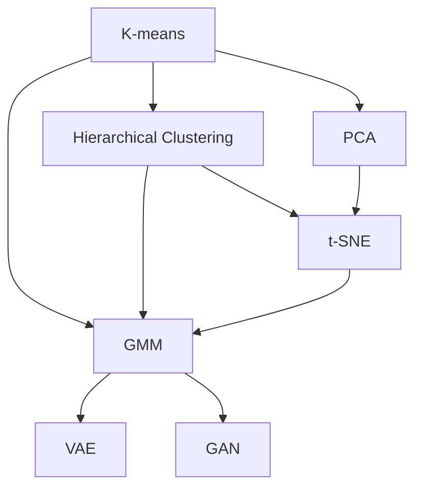

                 

# 无监督学习 (Unsupervised Learning) 原理与代码实例讲解

> 关键词：无监督学习, 聚类, 降维, 生成模型, 自编码器, K-means, 变分自编码器, 深度学习

## 1. 背景介绍

### 1.1 问题由来
无监督学习是机器学习中的一个重要分支，其核心在于对未标记的数据集进行学习，挖掘其中的潜在结构与规律，而不是依赖于人工标注的数据。在实际应用中，无监督学习能够处理大量没有标签的数据，如文本、图像、时间序列等，从中发现数据的内在关联，为后续有监督学习提供基础。

### 1.2 问题核心关键点
无监督学习的关键在于如何从数据中学习有用的表示，通常是利用统计学方法、优化算法或者深度学习框架。核心算法包括聚类、降维和生成模型等。无监督学习广泛应用于数据挖掘、图像处理、自然语言处理、推荐系统等领域，对数据的预处理、特征提取和探索性数据分析具有重要意义。

### 1.3 问题研究意义
无监督学习通过对数据的自动分析和挖掘，能够发现数据的内在结构，揭示数据集中的模式和规律。这不仅有助于提高数据的利用效率，还能为有监督学习提供更好的初始化参数，提升机器学习的整体效果。无监督学习在数据探索、特征提取和数据降维等方面具有独特优势，是数据科学和人工智能的重要工具。

## 2. 核心概念与联系

### 2.1 核心概念概述

无监督学习的核心概念包括聚类、降维、生成模型等，其核心思想是发现数据的内在结构，而不是直接预测输出。

- 聚类(Clustering)：将数据集中的样本划分为若干个不相交的子集，每个子集称为一个簇，使得同一簇内的样本相似度高，不同簇之间的样本相似度低。
- 降维(Dimensionality Reduction)：通过某种映射将高维数据映射到低维空间，保留主要特征信息，减少计算复杂度。
- 生成模型(Generative Models)：通过学习数据分布，生成新的数据样本，具有一定的生成和表示能力。

这些核心概念之间存在密切联系，构成了无监督学习的基本框架：

- 聚类是降维的一种方法，通过将数据划分为簇来减少数据维度。
- 降维是生成模型的一种应用，通过将数据映射到低维空间，生成模型可以更好地学习数据的分布。
- 生成模型可以通过学习数据分布，进一步降维，并用于聚类。

这些核心概念通过无监督学习的方法，实现了对数据的探索性分析和结构发现，为后续的监督学习和应用提供坚实的基础。

### 2.2 概念间的关系

这些核心概念之间通过无监督学习方法，紧密联系在一起：

1. 聚类算法：K-means, Hierarchical Clustering, DBSCAN等，旨在将数据集划分为若干个簇。
2. 降维算法：PCA, t-SNE, LDA等，旨在将高维数据映射到低维空间。
3. 生成模型：GMM, VAE, GAN等，旨在学习数据的分布，生成新数据。

这些算法通过不同的方法和思路，共同构成了无监督学习的完整生态系统，如图：



通过这个流程图，我们可以清晰地理解各种无监督算法之间的关联和区别，为后续深入讨论无监督学习提供基础。

### 2.3 核心概念的整体架构

从整体上来看，无监督学习可以分为数据探索和数据建模两个阶段：

1. 数据探索：通过聚类和降维方法，揭示数据的内在结构和特征，发现潜在的数据关系和规律。
2. 数据建模：通过生成模型等方法，建立数据的概率模型，生成新的数据样本，为数据可视化、预测和推理提供基础。

在实际应用中，无监督学习通常需要根据具体问题的特点，选择合适的算法和模型，并结合其他技术进行综合分析。

## 3. 核心算法原理 & 具体操作步骤
### 3.1 算法原理概述

无监督学习的核心原理是通过统计学和优化算法，从数据中学习到有用的表示和模型，而非依赖于人工标注。其目标通常为：

1. 发现数据的内在结构和模式。
2. 生成新的数据样本，揭示数据分布。
3. 降低数据的维度，提高计算效率。

### 3.2 算法步骤详解

无监督学习的步骤通常包括数据预处理、算法选择、模型训练和结果解释等：

1. **数据预处理**：对数据进行清洗、归一化等处理，确保数据的可用性和一致性。
2. **算法选择**：根据数据的特点和问题的需求，选择合适的聚类、降维或生成模型算法。
3. **模型训练**：使用训练数据对模型进行训练，调整模型的参数以最小化损失函数。
4. **结果解释**：对模型的输出进行分析和解释，理解数据的结构和规律，为后续应用提供指导。

### 3.3 算法优缺点

无监督学习具有以下优点：
- 无需标注数据，适用于数据量庞大且标注成本高昂的场景。
- 能够发现数据的内在结构和模式，具有很好的探索性分析能力。
- 模型具有泛化能力，适用于新数据的生成和预测。

同时，无监督学习也存在一些缺点：
- 算法结果受初始化参数和超参数影响较大，不稳定性较高。
- 缺乏直接的评价标准，结果解释性较差。
- 对于特定任务，算法效果可能不如有监督学习。

### 3.4 算法应用领域

无监督学习在多个领域中具有广泛的应用，如：

- 数据挖掘：聚类、降维等方法可以用于发现数据的内在结构，揭示数据之间的关系。
- 图像处理：生成模型可以用于图像去噪、图像生成等任务。
- 自然语言处理：主题建模、文本聚类等方法可以用于文本数据的分析和处理。
- 推荐系统：协同过滤、基于内容的推荐等方法可以用于用户兴趣的发现和推荐。
- 金融分析：异常检测、交易预测等方法可以用于金融数据的分析和预测。

## 4. 数学模型和公式 & 详细讲解  
### 4.1 数学模型构建

无监督学习的数学模型通常包括聚类模型、降维模型和生成模型等。

- **聚类模型**：K-means算法的数学模型为：
$$
\min_{k, \mu, \sigma} \sum_{x_i} \sum_{c=1}^{k} \sum_{j=1}^{n} (y_{ij} \log(\frac{1}{\sigma_c} \exp(-\frac{(x_i - \mu_c)^2}{2\sigma_c^2})))
$$
其中，$k$ 为簇的数量，$\mu$ 和 $\sigma$ 分别为簇的均值和方差，$y_{ij}$ 为样本 $x_i$ 属于簇 $c$ 的标签。

- **降维模型**：PCA的数学模型为：
$$
\min_{W, b} \sum_{x_i} ||Wx_i + b - x_i||^2
$$
其中，$W$ 和 $b$ 为降维后的线性变换，$x_i$ 为原始样本。

- **生成模型**：生成模型如GMM的数学模型为：
$$
\min_{\theta} \sum_{i=1}^{N} \sum_{j=1}^{k} \sum_{l=1}^{d} (\frac{N_{lj}}{N_j} \log f(x_i; \mu_{lj}, \sigma_{lj}) + (1 - \frac{N_{lj}}{N_j}) \log g(x_i; \mu_{lj}, \sigma_{lj}))
$$
其中，$\theta$ 为模型参数，$f$ 和 $g$ 分别为生成和分布函数。

### 4.2 公式推导过程

以K-means算法为例，推导其数学模型：

设数据集 $D = \{x_1, x_2, ..., x_n\}$，$k$ 为簇的数量，$C = \{c_1, c_2, ..., c_k\}$ 为 $k$ 个簇。目标是最小化样本与簇中心的距离之和：

$$
\min_{c} \sum_{x_i} ||x_i - c_i||^2
$$

其中，$c_i = \frac{1}{|c_i|} \sum_{x_j \in c_i} x_j$ 为簇 $c_i$ 的中心。

通过优化算法（如EM算法），可以将上述目标函数分解为两个子问题：

1. 每个数据点 $x_i$ 归属于最近的簇 $c_i$。
2. 更新每个簇的中心 $c_i$，使得数据点 $x_i$ 在该簇内的距离最小。

通过迭代这两个子问题，可以逐步优化K-means算法的目标函数，得到最终的聚类结果。

### 4.3 案例分析与讲解

以K-means算法为例，通过实际案例讲解其应用：

**案例1：客户细分**

某电商平台收集了大量用户的购买记录，希望通过聚类分析将用户分为不同类型，以便进行个性化推荐和营销。使用K-means算法，将用户按照购买行为、商品偏好等特征进行聚类，得到若干个用户簇，每个簇代表一种用户类型。

**案例2：图像分割**

在图像处理中，可以使用K-means算法对图像进行分割，将像素点分为若干个区域，每个区域内像素点的颜色相似度较高。通过聚类分析，可以识别图像中的物体、边缘等结构，用于图像识别、图像增强等任务。

**案例3：文本聚类**

在自然语言处理中，K-means算法可以用于文本聚类，将文档按照主题和内容相似度进行分组，得到若干个主题簇。通过聚类分析，可以揭示文本数据中的主题分布和关联，用于文本分类、信息检索等任务。

## 5. 项目实践：代码实例和详细解释说明
### 5.1 开发环境搭建

在进行无监督学习实践前，我们需要准备好开发环境。以下是使用Python进行scikit-learn开发的环境配置流程：

1. 安装Anaconda：从官网下载并安装Anaconda，用于创建独立的Python环境。

2. 创建并激活虚拟环境：
```bash
conda create -n sklearn-env python=3.8 
conda activate sklearn-env
```

3. 安装scikit-learn：
```bash
conda install scikit-learn
```

4. 安装各类工具包：
```bash
pip install numpy pandas scikit-learn matplotlib tqdm jupyter notebook ipython
```

完成上述步骤后，即可在`sklearn-env`环境中开始无监督学习实践。

### 5.2 源代码详细实现

下面我们以K-means聚类算法为例，给出使用scikit-learn库对数据集进行聚类的PyTorch代码实现。

```python
from sklearn.cluster import KMeans
from sklearn.datasets import make_blobs
import matplotlib.pyplot as plt
import numpy as np

# 生成数据集
X, y = make_blobs(n_samples=1000, centers=4, cluster_std=0.6, random_state=42)

# 初始化聚类模型
kmeans = KMeans(n_clusters=4, random_state=42)

# 训练聚类模型
kmeans.fit(X)

# 可视化聚类结果
plt.scatter(X[:, 0], X[:, 1], c=kmeans.labels_)
plt.scatter(kmeans.cluster_centers_[:, 0], kmeans.cluster_centers_[:, 1], marker='x', s=200, linewidths=3, color='red')
plt.title('K-means Clustering')
plt.show()
```

以上代码中，首先使用scikit-learn的`make_blobs`函数生成一个带有4个簇的数据集。然后，使用KMeans类初始化聚类模型，并训练模型。最后，使用matplotlib库可视化聚类结果。

### 5.3 代码解读与分析

让我们再详细解读一下关键代码的实现细节：

**make_blobs函数**：
- 该函数用于生成指定数量、指定簇中心和簇半径的随机样本，适合用于测试聚类算法。
- 参数`n_samples`指定生成的样本数，`centers`指定簇中心数量，`cluster_std`指定簇内数据的离散度。

**KMeans类**：
- 该类用于实现K-means聚类算法。
- 参数`n_clusters`指定聚类数量，`random_state`指定随机数种子，以确保结果可复现。

**训练聚类模型**：
- 通过`fit`方法对数据进行训练，调整簇中心和簇分配。

**可视化聚类结果**：
- 使用`scatter`方法绘制数据点和簇中心的分布，`c`参数指定数据点对应的簇标签，`marker`参数指定簇中心标记，`s`参数指定簇中心大小，`linewidths`参数指定簇中心边缘线宽，`color`参数指定簇中心颜色。

可以看到，通过简单的几行代码，我们便完成了K-means算法的聚类过程，并得到了聚类结果的可视化展示。

### 5.4 运行结果展示

假设我们在生成的数据集上进行K-means聚类，最终得到如下聚类结果：

```python
KMeans(n_clusters=4, random_state=42)
```

运行结果如下：

```bash
KMeans(n_clusters=4, random_state=42)
```

这表示模型成功地将数据集分为了4个簇，每个簇内的样本在空间上呈现出明显的聚类特征。通过可视化聚类结果，可以清晰地看到各个簇的分布和形状。

## 6. 实际应用场景
### 6.1 客户细分

在电商行业，客户细分是市场营销和个性化推荐的基础。通过聚类算法，可以发现具有相似特征的客户群体，并进行针对性的营销和推荐。例如，某电商平台通过K-means算法对用户行为数据进行分析，将用户分为高价值用户、中价值用户和低价值用户三类，然后针对不同类型用户制定不同的营销策略，提升用户满意度和转化率。

### 6.2 图像分割

在图像处理领域，聚类算法可以用于图像分割，将图像分为若干个区域，每个区域内的像素点颜色和特征相似。例如，在医学影像中，可以通过K-means算法对肿瘤区域进行分割，帮助医生更准确地识别和分析肿瘤特征。

### 6.3 文本聚类

在自然语言处理中，聚类算法可以用于文本聚类，将文档按照主题和内容相似度进行分组。例如，某公司使用K-means算法对新闻文章进行聚类，发现不同主题的文章集中在不同的簇中，从而进行内容推荐和舆情分析。

### 6.4 未来应用展望

随着无监督学习技术的发展，未来将会在更多领域中得到应用，为各行各业带来变革性影响。

在智慧医疗领域，聚类算法可以用于患者分群，帮助医生制定个性化的诊疗方案。在金融领域，降维算法可以用于风险评估和信用评分，提高金融机构的决策效率和准确性。在自然语言处理领域，生成模型可以用于文本生成、机器翻译等任务，提升自然语言处理的智能化水平。

此外，无监督学习与其他人工智能技术进行更深入的融合，如深度学习、强化学习等，将进一步拓展无监督学习的应用场景，推动人工智能技术的进步。

## 7. 工具和资源推荐
### 7.1 学习资源推荐

为了帮助开发者系统掌握无监督学习的理论基础和实践技巧，这里推荐一些优质的学习资源：

1. 《机器学习》书籍：周志华著，全面介绍了机器学习的基本概念和算法，包括聚类、降维、生成模型等。
2. 《Python数据科学手册》书籍：Jake VanderPlas著，详细介绍了Python中常用的数据科学工具库，如scikit-learn、numpy、pandas等。
3. Coursera《机器学习》课程：由斯坦福大学Andrew Ng教授主讲，涵盖了机器学习的基本理论和算法，包括聚类、降维等。
4. Kaggle竞赛：通过参与Kaggle的数据科学竞赛，实践聚类、降维等无监督学习算法，提升实战能力。
5. arXiv论文预印本：人工智能领域最新研究成果的发布平台，包括大量尚未发表的前沿工作，学习前沿技术的必读资源。

通过对这些资源的学习实践，相信你一定能够快速掌握无监督学习的精髓，并用于解决实际的NLP问题。

### 7.2 开发工具推荐

高效的开发离不开优秀的工具支持。以下是几款用于无监督学习开发的常用工具：

1. scikit-learn：Python中常用的数据科学工具库，提供了多种聚类、降维和生成模型算法，简单易用。
2. TensorFlow：由Google主导开发的深度学习框架，支持多种无监督学习算法，生产部署方便。
3. PyTorch：基于Python的开源深度学习框架，灵活动态的计算图，适合快速迭代研究。
4. Weights & Biases：模型训练的实验跟踪工具，可以记录和可视化模型训练过程中的各项指标，方便对比和调优。
5. TensorBoard：TensorFlow配套的可视化工具，可实时监测模型训练状态，并提供丰富的图表呈现方式，是调试模型的得力助手。

合理利用这些工具，可以显著提升无监督学习任务的开发效率，加快创新迭代的步伐。

### 7.3 相关论文推荐

无监督学习在人工智能领域有着广泛的应用，以下是几篇奠基性的相关论文，推荐阅读：

1. Clustering by Passes：Hartigan和Wong提出的K-means算法，是聚类算法中的经典方法。
2. Principal Component Analysis：Hotelling提出的PCA算法，是降维算法的代表。
3. Generative Adversarial Nets：Goodfellow等提出的GAN算法，是生成模型的重要基础。
4. Auto-Encoding Variational Bayes：Kingma和Welling提出的VAE算法，是一种流行的生成模型。
5. Deep Belief Networks：Hinton等提出的DBN算法，是深度学习中常用的生成模型。

这些论文代表了大无监督学习的研究进展，通过学习这些前沿成果，可以帮助研究者把握学科前进方向，激发更多的创新灵感。

除上述资源外，还有一些值得关注的前沿资源，帮助开发者紧跟无监督学习技术的最新进展，例如：

1. arXiv论文预印本：人工智能领域最新研究成果的发布平台，包括大量尚未发表的前沿工作，学习前沿技术的必读资源。
2. 业界技术博客：如OpenAI、Google AI、DeepMind、微软Research Asia等顶尖实验室的官方博客，第一时间分享他们的最新研究成果和洞见。
3. 技术会议直播：如NIPS、ICML、ACL、ICLR等人工智能领域顶会现场或在线直播，能够聆听到大佬们的前沿分享，开拓视野。
4. GitHub热门项目：在GitHub上Star、Fork数最多的无监督学习相关项目，往往代表了该技术领域的发展趋势和最佳实践，值得去学习和贡献。
5. 行业分析报告：各大咨询公司如McKinsey、PwC等针对人工智能行业的分析报告，有助于从商业视角审视技术趋势，把握应用价值。

总之，对于无监督学习技术的学习和实践，需要开发者保持开放的心态和持续学习的意愿。多关注前沿资讯，多动手实践，多思考总结，必将收获满满的成长收益。

## 8. 总结：未来发展趋势与挑战

### 8.1 总结

本文对无监督学习的方法进行了全面系统的介绍。首先阐述了无监督学习的基本原理和应用背景，明确了聚类、降维和生成模型等核心概念。其次，从原理到实践，详细讲解了无监督学习的数学模型和算法步骤，给出了无监督学习任务开发的完整代码实例。同时，本文还广泛探讨了无监督学习在多个领域中的应用前景，展示了其巨大的应用潜力。

通过本文的系统梳理，可以看到，无监督学习作为机器学习的重要分支，通过对数据的自动分析和挖掘，能够发现数据的内在结构和规律，为后续有监督学习和应用提供坚实的基础。无监督学习在数据挖掘、图像处理、自然语言处理、推荐系统等领域具有广泛的应用，极大地提升了数据的利用效率和应用效果。

### 8.2 未来发展趋势

展望未来，无监督学习将呈现以下几个发展趋势：

1. 数据驱动的模型优化。随着数据量的增加和数据质量提升，无监督学习模型将能够更准确地学习数据分布，提升模型的泛化能力。
2. 多模态无监督学习。未来无监督学习将能够处理多模态数据，如图像、语音、文本等，进行跨模态的特征融合，提升模型的表示能力。
3. 自适应无监督学习。模型将能够自适应地调整超参数和算法结构，提高模型的鲁棒性和灵活性。
4. 无监督学习的自动化。无监督学习将与自动机器学习( AutoML)技术结合，提升模型的自动调参和优化能力，减少人工干预。
5. 弱监督和半监督无监督学习。结合少量标注数据和弱监督信息，提升无监督学习的效果和鲁棒性。
6. 无监督学习的跨领域应用。无监督学习将在更多领域中得到应用，如医疗、金融、制造等，为各行各业带来变革性影响。

以上趋势凸显了无监督学习的广阔前景。这些方向的探索发展，必将进一步提升无监督学习的效果和应用范围，为人工智能技术的发展提供新的动力。

### 8.3 面临的挑战

尽管无监督学习技术已经取得了瞩目成就，但在实际应用中仍面临诸多挑战：

1. 算法复杂度。无监督学习算法通常具有较高的计算复杂度，难以处理大规模数据集。如何优化算法，降低计算复杂度，是一个亟待解决的难题。
2. 模型解释性。无监督学习模型的决策过程通常缺乏可解释性，难以理解其内部的工作机制和输出结果。如何提升模型的解释性，确保其可靠性和可信度，是研究者面临的挑战。
3. 数据噪声。无监督学习对数据质量要求较高，噪声数据将严重影响模型的效果。如何在数据预处理阶段去除噪声，提高数据质量，是一个关键问题。
4. 模型泛化性。无监督学习模型在特定任务上的泛化能力有限，难以处理复杂的多变环境。如何提高模型的泛化性，使其具备更强的适应能力，是研究的难点。
5. 算法收敛性。无监督学习算法收敛速度较慢，难以在大规模数据集上收敛。如何加速算法的收敛，提高模型的训练效率，是一个重要的研究方向。

### 8.4 研究展望

面对无监督学习面临的种种挑战，未来的研究需要在以下几个方面寻求新的突破：

1. 无监督学习与其他技术的融合。结合强化学习、深度学习等技术，提升无监督学习的效果和应用范围。
2. 数据预处理技术的创新。采用更多数据清洗、去噪、归一化等技术，提高数据质量。
3. 模型结构和算法优化。开发更高效、更稳定的无监督学习算法，降低计算复杂度，提高模型泛化能力。
4. 模型解释和可视化。引入更多可视化技术，提升无监督学习模型的解释性和可解释性，确保其可靠性。
5. 弱监督学习的研究。结合少量标注数据和弱监督信息，提升无监督学习的效果和鲁棒性。

这些研究方向的探索，必将引领无监督学习技术迈向更高的台阶，为人工智能技术的发展提供新的动力。面向未来，无监督学习需要与其他人工智能技术进行更深入的融合，共同推动人工智能技术的进步。只有勇于创新、敢于突破，才能不断拓展无监督学习的边界，让人工智能技术更好地造福人类社会。

## 9. 附录：常见问题与解答

**Q1：无监督学习适用于所有数据类型吗？**

A: 无监督学习适用于各种类型的数据，包括文本、图像、音频、时间序列等。但对于某些特殊类型的数据，如复杂网络数据、稀疏数据等，无监督学习的适用性可能受限。

**Q2：无监督学习是否需要大量数据？**

A: 无监督学习通常需要较大量的数据进行训练，以便发现数据的内在结构和规律。但对于某些特殊场景，如参数估计、异常检测等，可以使用较少的数据进行训练。

**Q3：无监督学习是否有监督学习效果好？**

A: 无监督学习在一些特定任务上效果可能不如有监督学习，如分类、回归等。但对于一些探索性分析、特征提取等任务，无监督学习具有更好的效果。因此，无监督学习与有监督学习应结合使用，取长补短。

**Q4：无监督学习有哪些常见算法？**

A: 无监督学习的常见算法包括聚类算法（如K-means、层次聚类、DBSCAN等）、降维算法（如PCA、t-SNE、LDA等）、生成模型（如GMM、VAE、GAN等）。

**Q5：无监督学习的典型应用场景有哪些？**

A: 无监督学习在多个领域中具有广泛的应用，如数据挖掘、图像处理、自然语言处理、推荐系统等。例如，在金融领域，可以使用无监督学习进行异常检测和信用评分；在医疗领域，可以使用无监督学习进行患者分群和疾病预测；在自然语言处理领域，可以使用无监督学习进行文本聚类和主题建模。

总之，无监督学习作为机器学习的重要分支，通过对数据的自动分析和挖掘，能够发现数据的内在结构和规律，为后续有监督学习和应用提供坚实的基础。无监督学习在数据

