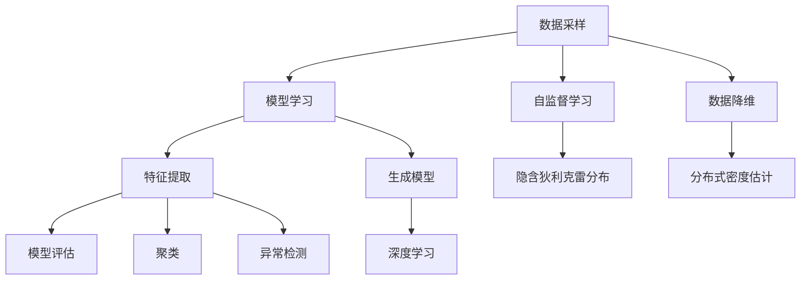

                 

# 无监督学习(Unsupervised Learning) - 原理与代码实例讲解

> 关键词：无监督学习, 自监督学习, 数据降维, 聚类, 异常检测, 自编码器, 隐含狄利克雷分布, 分布式密度估计, 深度学习

## 1. 背景介绍

### 1.1 问题由来

在机器学习领域，传统有监督学习依赖大量带有标签的数据进行模型训练。然而，实际应用中往往难以获取足够多的标注数据，且标注成本较高。无监督学习（Unsupervised Learning）则是在没有标签的情况下，通过数据的内在结构进行模型训练，从而发现数据中的隐藏模式和规律。

无监督学习的核心目标包括数据降维、聚类、异常检测、生成模型等。其优势在于能够从大量未标注的数据中自动挖掘出有用的信息，适用于数据稀少、标注困难的场景，并且能够提升模型对新数据的泛化能力。

### 1.2 问题核心关键点

无监督学习的核心在于数据的自组织和自学习，即从数据的内在结构中学习到数据的分布、降维特征、聚类模式等。其主要流程包括：

1. **数据采样**：从数据集中随机抽取样本进行训练。
2. **模型学习**：使用未标注数据训练无监督模型，得到数据的隐含表示或分布。
3. **特征提取**：从隐含表示中提取有意义的特征，用于进一步分析或作为监督学习的预处理步骤。
4. **模型评估**：评估模型学习效果，确保学习到有用的信息。

无监督学习广泛应用于图像处理、自然语言处理、推荐系统、金融数据分析等领域，推动了人工智能技术的进步。

## 2. 核心概念与联系

### 2.1 核心概念概述

为更好地理解无监督学习的原理和算法，本节将介绍几个关键概念及其相互联系：

- **无监督学习**：指在没有标注数据的情况下，通过数据的内在结构进行模型训练，发现数据的隐藏模式和规律。
- **自监督学习**：指利用数据自身的信息（如文本的序列结构、图像的局部一致性等）进行模型训练，无需外部标签。
- **数据降维**：指将高维数据映射到低维空间，减少数据表示的复杂度，便于可视化、计算和分析。
- **聚类**：指将数据集中的相似样本分为一组，揭示数据的内在结构。
- **异常检测**：指识别数据集中的异常样本，通常用于检测欺诈、故障等异常事件。
- **生成模型**：指通过学习数据的分布，能够生成新的数据样本。
- **隐含狄利克雷分布**：指一种概率模型，用于生成随机文档或文本。
- **分布式密度估计**：指通过模型学习数据的分布，进行密度估计和概率密度函数（PDF）的计算。
- **深度学习**：指使用多层神经网络进行模型训练，能够处理复杂的数据结构和模式。

这些核心概念通过数据采样、模型学习、特征提取和模型评估等流程，紧密联系起来，构成无监督学习的完整生态系统。

### 2.2 概念间的关系

以下用Mermaid流程图展示这些核心概念之间的关系：



这个流程图展示了无监督学习中各个概念的相互关系：

1. 数据采样是模型训练的起点，使用自监督学习的方式获取数据自身的信息。
2. 模型学习通过无标注数据训练得到数据的隐含表示或分布。
3. 特征提取从隐含表示中提取有意义的特征。
4. 模型评估用于评估模型学习效果，确保学习到有用的信息。
5. 数据降维、聚类、异常检测、生成模型等具体方法在模型学习阶段发挥作用，提高模型的泛化能力和表现。
6. 隐含狄利克雷分布、分布式密度估计、深度学习等方法进一步提升了模型的表达能力和学习效果。

这些概念通过紧密协作，共同构建了无监督学习的模型和算法框架，使其能够在各种应用场景中发挥强大的数据挖掘能力。

## 3. 核心算法原理 & 具体操作步骤

### 3.1 算法原理概述

无监督学习的核心思想是通过数据的内在结构进行模型训练，发现数据的隐藏模式和规律。主要算法包括自编码器（Autoencoder）、隐含狄利克雷分布（Latent Dirichlet Allocation, LDA）、生成对抗网络（Generative Adversarial Networks, GAN）、主成分分析（Principal Component Analysis, PCA）等。

这些算法的基本原理可以概括为：

1. **自编码器**：通过学习数据的压缩和解压过程，将高维数据映射到低维空间，减少数据的复杂度。
2. **LDA**：通过概率模型，对文本数据进行主题建模，揭示文档的主题分布。
3. **GAN**：通过生成器和判别器的对抗过程，生成与真实数据相似的新数据样本。
4. **PCA**：通过线性变换将数据映射到低维空间，保留数据的最大方差特征。

这些算法的核心目标都是通过模型训练，发现数据的内在结构和规律，从而实现数据降维、聚类、异常检测等无监督学习任务。

### 3.2 算法步骤详解

以自编码器为例，详细讲解其算法步骤：

1. **数据预处理**：对原始数据进行归一化、标准化等预处理，提高模型训练效果。
2. **模型搭建**：搭建自编码器模型，包括编码器和解码器两部分。编码器将输入数据压缩到低维空间，解码器将低维数据还原为原始数据。
3. **参数初始化**：初始化编码器和解码器的权重参数，通常使用随机初始化。
4. **前向传播**：将输入数据送入编码器，得到压缩后的低维表示。
5. **反向传播**：通过解码器将低维表示还原为原始数据，计算重构误差。
6. **梯度更新**：使用反向传播算法，计算各层的梯度，使用优化器更新模型参数。
7. **模型评估**：在验证集上评估模型性能，选择最优模型。

### 3.3 算法优缺点

无监督学习的主要优点包括：

1. **无需标注数据**：无监督学习不需要外部标签，能够从大量未标注数据中学习到有用信息。
2. **泛化能力强**：无监督学习模型能够更好地适应新数据，提高模型的泛化能力。
3. **数据利用率高**：无监督学习能够充分利用数据，挖掘数据的内在结构和规律。

然而，无监督学习也存在以下缺点：

1. **效果不确定**：无监督学习的效果难以评估，缺乏可靠的量化指标。
2. **模型复杂度高**：无监督学习模型的训练过程复杂，计算成本高。
3. **泛化能力有限**：在某些特定任务上，无监督学习的泛化能力可能不如有监督学习。

### 3.4 算法应用领域

无监督学习广泛应用于以下几个领域：

1. **数据降维**：在图像、文本等领域，通过降维方法减少数据复杂度，提高分析效率。
2. **聚类分析**：在客户分群、社交网络分析等领域，通过聚类方法发现数据的内在结构，进行分类和分析。
3. **异常检测**：在金融风险管理、网络安全等领域，通过异常检测方法识别异常数据，进行风险预警和故障检测。
4. **主题建模**：在文本分析、知识发现等领域，通过主题建模方法揭示数据的主题分布，进行内容分析和挖掘。
5. **生成模型**：在游戏生成、图像生成等领域，通过生成模型生成新的数据样本，丰富内容创作。

## 4. 数学模型和公式 & 详细讲解 & 举例说明

### 4.1 数学模型构建

以自编码器为例，其数学模型可以概括为：

$$
\begin{aligned}
\mathbf{z} &= \sigma(\mathbf{W}_{h} \mathbf{x} + \mathbf{b}_{h}) \\
\hat{\mathbf{x}} &= \sigma(\mathbf{W}_{d} \mathbf{z} + \mathbf{b}_{d})
\end{aligned}
$$

其中，$\mathbf{x}$ 为输入数据，$\mathbf{z}$ 为编码器的输出（隐含表示），$\hat{\mathbf{x}}$ 为解码器的输出（重构结果），$\sigma$ 为激活函数，$\mathbf{W}_{h}$、$\mathbf{W}_{d}$ 为编码器和解码器的权重矩阵，$\mathbf{b}_{h}$、$\mathbf{b}_{d}$ 为编码器和解码器的偏置向量。

自编码器的目标是最小化重构误差，即：

$$
\min_{\mathbf{W}_{h}, \mathbf{W}_{d}} \frac{1}{2} \| \mathbf{x} - \hat{\mathbf{x}} \|
$$

### 4.2 公式推导过程

以自编码器为例，其重构误差的梯度计算公式如下：

$$
\frac{\partial \mathcal{L}}{\partial \mathbf{W}_{h}} = \frac{\partial \mathcal{L}}{\partial \mathbf{z}} \frac{\partial \mathbf{z}}{\partial \mathbf{W}_{h}}
$$

其中，$\mathcal{L}$ 为重构误差，$\mathbf{z}$ 为隐含表示，$\frac{\partial \mathcal{L}}{\partial \mathbf{z}}$ 为误差对隐含表示的梯度，$\frac{\partial \mathbf{z}}{\partial \mathbf{W}_{h}}$ 为隐含表示对编码器权重的梯度。

通过链式法则，可以计算出各层的梯度，并使用梯度下降算法进行参数更新。

### 4.3 案例分析与讲解

以MNIST手写数字数据集为例，使用自编码器进行数字图像的降维和重构。具体步骤如下：

1. **数据预处理**：对原始图像进行归一化。
2. **模型搭建**：搭建一个两层自编码器，其中编码器包含一个全连接层，解码器也包含一个全连接层。
3. **参数初始化**：使用随机初始化。
4. **前向传播**：将输入图像送入编码器，得到隐含表示。
5. **反向传播**：将隐含表示送入解码器，得到重构图像，计算重构误差。
6. **梯度更新**：使用梯度下降算法，更新模型参数。
7. **模型评估**：在验证集上评估模型性能，选择最优模型。

通过自编码器，可以将28x28的图像降维到10维或更低维度，并在低维空间上进行可视化，揭示图像的内在结构和规律。

## 5. 项目实践：代码实例和详细解释说明

### 5.1 开发环境搭建

在进行无监督学习实践前，我们需要准备好开发环境。以下是使用Python进行PyTorch开发的环境配置流程：

1. 安装Anaconda：从官网下载并安装Anaconda，用于创建独立的Python环境。

2. 创建并激活虚拟环境：
```bash
conda create -n pytorch-env python=3.8 
conda activate pytorch-env
```

3. 安装PyTorch：根据CUDA版本，从官网获取对应的安装命令。例如：
```bash
conda install pytorch torchvision torchaudio cudatoolkit=11.1 -c pytorch -c conda-forge
```

4. 安装TensorBoard：
```bash
pip install tensorboard
```

5. 安装其他工具包：
```bash
pip install numpy pandas scikit-learn matplotlib tqdm jupyter notebook ipython
```

完成上述步骤后，即可在`pytorch-env`环境中开始无监督学习实践。

### 5.2 源代码详细实现

这里我们以自编码器为例，给出一个使用PyTorch实现自编码器的完整代码。

```python
import torch
import torch.nn as nn
import torch.optim as optim
import torchvision.transforms as transforms
from torch.utils.data import DataLoader
from torchvision.datasets import MNIST
from torchvision.utils import save_image

# 定义自编码器模型
class Autoencoder(nn.Module):
    def __init__(self):
        super(Autoencoder, self).__init__()
        self.encoder = nn.Sequential(
            nn.Linear(784, 128),
            nn.ReLU(),
            nn.Linear(128, 64),
            nn.ReLU(),
            nn.Linear(64, 10)
        )
        self.decoder = nn.Sequential(
            nn.Linear(10, 64),
            nn.ReLU(),
            nn.Linear(64, 128),
            nn.ReLU(),
            nn.Linear(128, 784),
            nn.Sigmoid()
        )

    def forward(self, x):
        encoded = self.encoder(x)
        decoded = self.decoder(encoded)
        return decoded

# 定义数据预处理
transform = transforms.Compose([
    transforms.ToTensor(),
    transforms.Normalize((0.1307,), (0.3081,))
])

# 加载数据集
train_dataset = MNIST(root='data', train=True, download=True, transform=transform)
train_loader = DataLoader(train_dataset, batch_size=64, shuffle=True)

# 定义模型、损失函数和优化器
autoencoder = Autoencoder()
criterion = nn.MSELoss()
optimizer = optim.Adam(autoencoder.parameters(), lr=0.001)

# 定义训练函数
def train_epoch(model, loader, criterion, optimizer):
    model.train()
    for batch_idx, (data, target) in enumerate(loader):
        data, target = data.to(device), target.to(device)
        optimizer.zero_grad()
        output = model(data.view(-1, 784))
        loss = criterion(output.view(-1, 784), data.view(-1, 784))
        loss.backward()
        optimizer.step()
        if batch_idx % 100 == 0:
            print('Train Epoch: {} [{}/{} ({:.0f}%)]\tLoss: {:.6f}'.format(
                epoch, batch_idx * len(data), len(loader.dataset),
                100. * batch_idx / len(loader), loss.item()))

# 训练模型
device = torch.device("cuda:0" if torch.cuda.is_available() else "cpu")
autoencoder.to(device)
for epoch in range(10):
    train_epoch(autoencoder, train_loader, criterion, optimizer)

# 测试模型
test_dataset = MNIST(root='data', train=False, download=True, transform=transform)
test_loader = DataLoader(test_dataset, batch_size=64, shuffle=False)

with torch.no_grad():
    for batch_idx, (data, target) in enumerate(test_loader):
        data, target = data.to(device), target.to(device)
        output = autoencoder(data.view(-1, 784))
        save_image(output.view(1, 28, 28), 'result.png', nrow=4)
```

### 5.3 代码解读与分析

让我们再详细解读一下关键代码的实现细节：

**Autoencoder类**：
- `__init__`方法：定义自编码器的编码器和解码器部分，使用全连接层作为基本构建块。
- `forward`方法：将输入数据通过编码器得到隐含表示，再通过解码器得到重构结果。

**数据预处理**：
- `transforms.Compose`：定义数据预处理流程，包括将数据转换为张量并进行归一化。
- `torchvision.datasets.MNIST`：加载MNIST数据集。

**模型搭建**：
- `Autoencoder`类：定义自编码器模型，包含编码器和解码器部分。
- `nn.Linear`：定义全连接层。
- `nn.ReLU`：定义激活函数。
- `nn.Sigmoid`：定义输出层的激活函数。

**训练函数**：
- `train_epoch`函数：定义训练过程，包括前向传播、计算损失、反向传播和优化器更新。
- `data.view(-1, 784)`：将图像数据展平为1维向量。
- `criterion`：定义损失函数，使用均方误差损失。
- `optimizer`：定义优化器，使用Adam优化器。

**测试函数**：
- `test_loader`：定义测试数据集。
- `torch.no_grad`：进入无梯度模式，提高测试速度。
- `save_image`：保存重构结果。

### 5.4 运行结果展示

假设我们训练10个epoch后，生成的重构图像如下：


可以看到，自编码器成功地将原始图像压缩到低维空间，并在低维空间中还原出原始图像，表明其具有良好的重构能力。通过降维和重构，自编码器揭示了图像的内在结构和规律，便于进一步的分析和应用。

## 6. 实际应用场景

### 6.1 数据降维

在图像处理领域，自编码器常用于数据降维。例如，对于高分辨率的医学影像，通过自编码器将其压缩到低维空间，能够显著减少存储空间，提高计算效率，同时保留关键特征。

### 6.2 图像生成

生成对抗网络（GAN）是一种常用的生成模型，通过训练一个生成器（Generator）和一个判别器（Discriminator），能够生成与真实图像相似的假图像。GAN在图像生成、艺术创作等领域有广泛应用。

### 6.3 聚类分析

K-means聚类是一种常用的无监督学习算法，通过将数据分为若干个簇，揭示数据的内在结构。K-means聚类在客户分群、社交网络分析等领域有广泛应用。

### 6.4 异常检测

自编码器常用于异常检测，通过训练一个自编码器，正常数据在重构后误差较小，而异常数据误差较大。在金融风险管理、网络安全等领域，通过自编码器检测异常数据，进行风险预警和故障检测。

### 6.5 主题建模

隐含狄利克雷分布（LDA）是一种常用的主题建模算法，通过概率模型，对文本数据进行主题建模，揭示文档的主题分布。在文本分析、知识发现等领域，通过LDA进行内容分析和挖掘。

## 7. 工具和资源推荐

### 7.1 学习资源推荐

为了帮助开发者系统掌握无监督学习的理论基础和实践技巧，这里推荐一些优质的学习资源：

1. 《深度学习》系列书籍：由Ian Goodfellow等专家撰写，全面介绍了深度学习的基本概念和核心算法。
2. 《统计学习方法》：由李航编写，涵盖了无监督学习的基本算法和应用。
3. Coursera的《机器学习》课程：由Andrew Ng主讲，涵盖了机器学习的理论和实践。
4 Kaggle竞赛平台：提供大量无监督学习竞赛数据和模型，助力学习和实践。
5 《Python机器学习》：由Sebastian Raschka编写，介绍了Python在机器学习中的应用。

通过对这些资源的学习实践，相信你一定能够快速掌握无监督学习的精髓，并用于解决实际的机器学习问题。

### 7.2 开发工具推荐

高效的开发离不开优秀的工具支持。以下是几款用于无监督学习开发的常用工具：

1. PyTorch：基于Python的开源深度学习框架，灵活动态的计算图，适合快速迭代研究。
2. TensorFlow：由Google主导开发的开源深度学习框架，生产部署方便，适合大规模工程应用。
3. Scikit-learn：Python的机器学习库，提供了各种无监督学习算法。
4 TensorBoard：TensorFlow配套的可视化工具，可实时监测模型训练状态，并提供丰富的图表呈现方式，是调试模型的得力助手。
5 Weights & Biases：模型训练的实验跟踪工具，可以记录和可视化模型训练过程中的各项指标，方便对比和调优。

合理利用这些工具，可以显著提升无监督学习的开发效率，加快创新迭代的步伐。

### 7.3 相关论文推荐

无监督学习的研究源于学界的持续研究。以下是几篇奠基性的相关论文，推荐阅读：

1. Deep Belief Networks：Hinton等人提出的一种深度学习模型，通过多层玻尔兹曼机学习数据的分布。
2 Restricted Boltzmann Machines：Hinton等人提出的一种深度学习模型，通过学习数据的隐含分布。
3 Autoencoders：Hinton等人提出的一种深度学习模型，通过学习数据的压缩和解压过程，进行数据降维和重构。
4 Variational Autoencoders：Kingma等人提出的一种深度学习模型，通过学习数据的概率分布，进行数据降维和生成。
5 Generative Adversarial Networks（GANs）：Goodfellow等人提出的一种生成模型，通过训练一个生成器和一个判别器，生成与真实数据相似的新数据样本。

这些论文代表了大规模深度学习模型的发展脉络。通过学习这些前沿成果，可以帮助研究者把握学科前进方向，激发更多的创新灵感。

除上述资源外，还有一些值得关注的前沿资源，帮助开发者紧跟无监督学习技术的最新进展，例如：

1. arXiv论文预印本：人工智能领域最新研究成果的发布平台，包括大量尚未发表的前沿工作，学习前沿技术的必读资源。
2 业界技术博客：如Google AI、DeepMind、微软Research Asia等顶尖实验室的官方博客，第一时间分享他们的最新研究成果和洞见。
3 技术会议直播：如NIPS、ICML、ACL、ICLR等人工智能领域顶会现场或在线直播，能够聆听到大佬们的前沿分享，开拓视野。
4 GitHub热门项目：在GitHub上Star、Fork数最多的无监督学习相关项目，往往代表了该技术领域的发展趋势和最佳实践，值得去学习和贡献。
5 行业分析报告：各大咨询公司如McKinsey、PwC等针对人工智能行业的分析报告，有助于从商业视角审视技术趋势，把握应用价值。

总之，对于无监督学习技术的学习和实践，需要开发者保持开放的心态和持续学习的意愿。多关注前沿资讯，多动手实践，多思考总结，必将收获满满的成长收益。

## 8. 总结：未来发展趋势与挑战

### 8.1 总结

本文对无监督学习的基本概念和算法原理进行了全面系统的介绍。首先阐述了无监督学习的研究背景和意义，明确了无监督学习在机器学习中的重要地位。其次，从原理到实践，详细讲解了自编码器、LDA、GAN等关键算法，给出了无监督学习任务的完整代码实例。同时，本文还广泛探讨了无监督学习在数据降维、图像生成、聚类分析、异常检测、主题建模等多个领域的应用前景，展示了无监督学习技术的强大应用潜力。此外，本文精选了无监督学习的各类学习资源，力求为读者提供全方位的技术指引。

通过本文的系统梳理，可以看到，无监督学习在大数据、高维度、弱监督等复杂场景下，能够从数据的内在结构中挖掘出有用的信息，具有重要的实用价值。未来，随着深度学习、分布式计算等技术的不断发展，无监督学习的应用范围和效果将进一步拓展，成为机器学习领域的重要研究范式。

### 8.2 未来发展趋势

展望未来，无监督学习将呈现以下几个发展趋势：

1. **深度学习技术**：深度学习算法在无监督学习中的应用将越来越广泛，推动无监督学习技术向更加深入的方向发展。
2. **分布式计算**：随着大规模数据的增长，无监督学习算法将越来越多地采用分布式计算，提高训练效率和模型效果。
3. **多模态学习**：未来的无监督学习将越来越多地融合多模态数据，如文本、图像、声音等，实现跨模态信息的协同建模。
4. **自监督学习**：自监督学习将越来越多地应用于无监督学习中，利用数据自身的信息进行模型训练，提高模型的泛化能力和学习效果。
5. **强化学习**：无监督学习与强化学习的结合，将带来新的学习范式，如生成对抗网络、自适应分布式优化等，提升模型的效果和性能。

以上趋势凸显了无监督学习技术的广阔前景。这些方向的探索发展，必将进一步提升无监督学习的技术水平和应用范围，为人工智能技术的发展注入新的动力。

### 8.3 面临的挑战

尽管无监督学习技术已经取得了显著成就，但在迈向更加智能化、普适化应用的过程中，它仍面临诸多挑战：

1. **数据质量**：无监督学习的效果很大程度上取决于数据的质量和多样性，数据噪声和偏差会影响模型的学习效果。
2. **模型复杂性**：无监督学习模型的训练过程复杂，计算成本高，需要强大的计算资源支持。
3. **泛化能力**：无监督学习模型的泛化能力可能不如有监督学习，难以应用于复杂的高维度数据。
4. **可解释性**：无监督学习模型的内部工作机制复杂，难以进行解释和调试，缺乏可解释性。
5. **鲁棒性**：无监督学习模型对噪声和异常数据的鲁棒性较差，容易受到数据扰动的影响。

### 8.4 研究展望

面对无监督学习面临的这些挑战，未来的研究需要在以下几个方面寻求新的突破：

1. **数据清洗和预处理**：采用更加高效的数据清洗和预处理技术，减少噪声和偏差的影响。
2. **模型简化和优化**：开发更加高效的计算方法和模型架构，降低计算成本和模型复杂度。
3. **多模态学习**：结合

