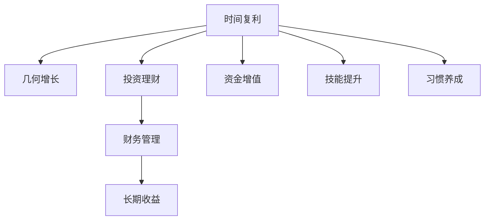
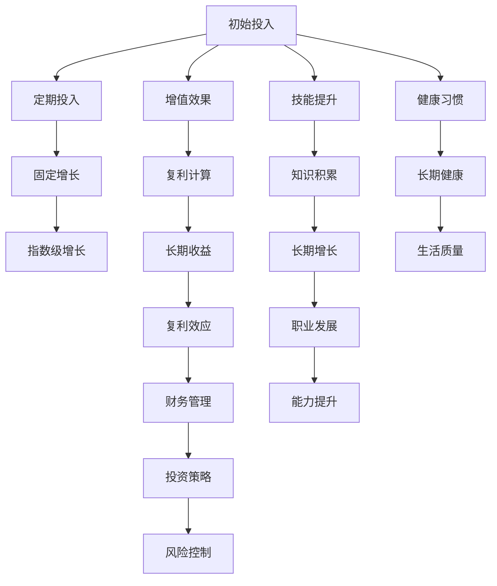

                 

# 时间复利效应的深刻理解

> 关键词：时间复利, 投资理财, 财务管理, 几何增长, 持续努力, 长期收益

## 1. 背景介绍

### 1.1 问题由来
时间复利效应是指随着时间的推移，投入的资金或精力以指数级增长，产生可观的累积收益。这一效应广泛应用于投资理财、财务管理、学习积累等领域，是实现个人或企业长期成功的重要基石。理解并有效利用时间复利效应，对提升生活品质、实现财务自由、推动职业发展具有重要意义。

### 1.2 问题核心关键点
理解时间复利效应的核心在于掌握其数学原理和应用场景。时间复利效应的关键在于初始投入、增长率、时间周期，以及复利计算公式。不同领域对时间复利的应用也存在差异，如财务投资中的利息复利、职业发展中的技能提升、健康管理中的习惯养成等。

### 1.3 问题研究意义
掌握时间复利效应的原理和应用，对于个人财务管理、职业规划、健康管理等领域具有深远的指导意义。它可以帮助人们制定科学合理的财务规划，提升个人财富积累效率；辅助职业生涯发展规划，推动技能持续提升；促进健康生活习惯的形成，提高生活质量。此外，时间复利效应还能激发人们持续努力、长期坚持的动力，是实现长期目标的重要工具。

## 2. 核心概念与联系

### 2.1 核心概念概述

时间复利效应在多个领域中均有应用，理解其核心概念对各个领域的实践具有重要意义。以下是几个核心概念：

- **时间复利（Time Compounding）**：指随着时间的推移，初始投入资金或精力以指数级增长，产生显著的累积效应。
- **几何增长（Geometric Growth）**：指在每一周期末，按照固定比例增加，从而产生加速增长的现象。
- **投资理财（Investment Planning）**：通过合理规划投资策略，实现资金的增值和保值。
- **财务管理（Financial Management）**：对个人或企业的资金进行计划、监督、控制和管理，确保财务目标的实现。
- **长期收益（Long-term Yield）**：通过持续投入和积累，在较长时间内获得的累积收益。

这些概念通过数学公式和实际案例相联系，共同构成了时间复利效应的全貌。

### 2.2 概念间的关系

这些核心概念之间的关系可以通过以下Mermaid流程图来展示：



这个流程图展示了时间复利效应的各个核心概念及其相互关系：

1. 时间复利是通过几何增长实现的，即每一周期末按固定比例增加。
2. 投资理财是实现时间复利的重要手段，通过合理的投资策略，资金可以实现增值。
3. 财务管理是保证投资理财顺利进行的工具，确保资金的安全和有效管理。
4. 长期收益是时间复利效应的最终目标，通过持续投入和积累，实现显著的增值效果。
5. 资金增值、技能提升、习惯养成等都是时间复利的具体应用领域，通过它们，可以实现资金、技能、健康的持续增长。

### 2.3 核心概念的整体架构

最后，我们用一个综合的流程图来展示这些核心概念在大语言模型微调过程中的整体架构：



这个综合流程图展示了从初始投入，到定期投入、固定增长、指数级增长、复利计算、长期收益，再到财务管理、投资策略、风险控制、技能提升、知识积累、长期增长、职业发展、能力提升、健康习惯、长期健康和最终生活质量的完整过程。通过这个架构，我们可以更好地理解时间复利效应的全貌和各个环节的作用。

## 3. 核心算法原理 & 具体操作步骤
### 3.1 算法原理概述

时间复利效应的核心算法原理主要基于几何增长公式。设初始投入为 $P_0$，增长率为 $r$，周期为 $t$，则 $t$ 周期后的总收益为：

$$
A = P_0 \times (1 + r)^t
$$

这个公式展示了复利计算的基本原理，即每一周期末的收益都会加入到下一周期的本金中，形成指数级增长。

### 3.2 算法步骤详解

以下是实现时间复利效应的详细步骤：

**Step 1: 初始化输入**
- 确定初始投入 $P_0$。
- 设定增长率 $r$（如年利率、技能提升速度等）。
- 定义时间周期 $t$。

**Step 2: 计算每周期收益**
- 根据公式 $A = P_0 \times (1 + r)^t$ 计算每一周期的总收益。
- 如果每次只投入 $P_0$ 的一部分，则每一周期末的收益为 $P_0 \times (1 + r)^{t_n}$，其中 $t_n$ 表示第 $n$ 周期。

**Step 3: 累积收益**
- 将每一周期末的收益累加，得到总累积收益。
- 通过递归计算或循环迭代，可以更直观地展示时间复利效应的增长过程。

**Step 4: 可视化展示**
- 使用图形化工具（如Matplotlib、Tableau等）将计算结果展示为时间序列图或折线图。
- 通过可视化展示，可以更直观地理解时间复利效应的累积收益过程。

### 3.3 算法优缺点

时间复利效应具有以下优点：
1. 简单易懂：几何增长公式直观简单，易于理解和计算。
2. 增长显著：指数级增长使得每一周期末的收益快速增长，产生显著的累积效应。
3. 应用广泛：不仅限于财务投资，还适用于技能提升、健康管理等领域。

同时，该算法也存在一些局限性：
1. 初始投入影响较大：初始投入金额对最终收益有直接影响，需要合理规划。
2. 增长率需要精确：增长率设定需准确，过高或过低均会影响复利效果。
3. 周期需连续：时间周期需连续进行，任何中断都会影响最终收益。
4. 风险因素不可忽视：投资理财中的市场风险、技能提升中的能力瓶颈、健康管理中的突发疾病等都会影响最终收益。

尽管存在这些局限性，时间复利效应仍是一种有效的长期收益策略，值得广泛应用。

### 3.4 算法应用领域

时间复利效应在多个领域中均有应用，以下是一些具体应用场景：

1. **财务投资**：在股票、基金、债券等金融产品中进行长期投资，通过复利效应实现财富积累。
2. **职业发展**：通过持续学习新技能、积累经验，实现职业能力的持续提升。
3. **健康管理**：通过长期坚持健康生活方式、养成良好习惯，实现身体素质的持续改善。
4. **学习积累**：通过每天投入一定时间进行学习，实现知识的不断积累和技能提升。
5. **技术创新**：通过持续研发新产品、新技术，实现企业竞争力的长期提升。
6. **品牌建设**：通过长期的品牌建设和市场推广，实现品牌价值的持续增长。

## 4. 数学模型和公式 & 详细讲解 & 举例说明

### 4.1 数学模型构建

时间复利效应的数学模型主要基于几何增长公式。设初始投入为 $P_0$，增长率为 $r$，周期为 $t$，则 $t$ 周期后的总收益为：

$$
A = P_0 \times (1 + r)^t
$$

这个公式展示了复利计算的基本原理，即每一周期末的收益都会加入到下一周期的本金中，形成指数级增长。

### 4.2 公式推导过程

以下是时间复利效应的数学公式推导过程：

设初始投入为 $P_0$，增长率为 $r$，周期为 $t$，则第 $t$ 周期末的总收益 $A$ 为：

$$
A = P_0 \times (1 + r)^t
$$

推导过程如下：

1. 假设初始投入为 $P_0$，每年增长率为 $r$。
2. 第一年末的总收益为 $P_0 \times (1 + r)$。
3. 第二年末的总收益为 $P_0 \times (1 + r) \times (1 + r) = P_0 \times (1 + r)^2$。
4. 第 $t$ 年末的总收益为 $P_0 \times (1 + r) \times (1 + r) \times \cdots \times (1 + r) = P_0 \times (1 + r)^t$。

通过上述推导，我们得到了时间复利效应的基本数学模型。

### 4.3 案例分析与讲解

假设你每年投资1万元，年利率为5%，投资20年。则20年末的总收益为：

$$
A = 10000 \times (1 + 0.05)^{20} \approx 36216.76
$$

通过这个案例，我们可以更直观地理解时间复利效应的累积收益过程。随着时间的推移，初始投入的资金以指数级增长，产生显著的累积收益。

## 5. 项目实践：代码实例和详细解释说明
### 5.1 开发环境搭建

在进行时间复利效应的项目实践前，我们需要准备好开发环境。以下是使用Python进行项目实践的环境配置流程：

1. 安装Anaconda：从官网下载并安装Anaconda，用于创建独立的Python环境。

2. 创建并激活虚拟环境：
```bash
conda create -n time-compounding python=3.8 
conda activate time-compounding
```

3. 安装Python相关库：
```bash
pip install pandas numpy matplotlib
```

4. 安装Jupyter Notebook：
```bash
pip install jupyter notebook
```

5. 安装图形化工具：
```bash
pip install matplotlib seaborn
```

完成上述步骤后，即可在`time-compounding`环境中开始项目实践。

### 5.2 源代码详细实现

以下是一个简单的Python程序，用于计算时间复利效应，并生成可视化图表。

```python
import matplotlib.pyplot as plt
import pandas as pd
import numpy as np

# 设定初始投入、增长率和周期
P0 = 10000  # 初始投入金额
r = 0.05    # 年利率
t = 20      # 投资周期

# 计算每一周期末的收益
total_growth = np.array([P0 * (1 + r)**n for n in range(1, t+1)])

# 计算总收益
total_compound = P0 * (1 + r)**t

# 创建数据框
data = pd.DataFrame({'t': np.arange(1, t+1), 'growth': total_growth, 'compound': [total_compound]})

# 生成折线图
plt.plot(data['t'], data['growth'], label='周期末收益')
plt.plot(data['t'], data['compound'], label='总收益')
plt.legend()
plt.xlabel('周期')
plt.ylabel('总收益')
plt.title('时间复利效应')
plt.show()
```

### 5.3 代码解读与分析

让我们再详细解读一下关键代码的实现细节：

**总收益计算**：
- `total_growth`：使用NumPy数组计算每一周期末的收益，即 $P_0 \times (1 + r)^n$。
- `total_compound`：计算总收益，即 $P_0 \times (1 + r)^t$。

**数据框创建**：
- `pd.DataFrame`：使用pandas创建数据框，方便进行数据可视化。
- `data['t']` 和 `data['growth']`：设置数据框的列名，`t` 表示周期，`growth` 表示每一周期末的收益。

**可视化展示**：
- `plt.plot`：使用matplotlib生成折线图，展示周期末收益和总收益的增长过程。
- `plt.legend`：添加图例，区分周期末收益和总收益。
- `plt.xlabel`、`plt.ylabel` 和 `plt.title`：添加坐标轴标签和标题，使图表更加清晰。

通过这个Python程序，我们可以计算并可视化时间复利效应的增长过程。

### 5.4 运行结果展示

运行上述代码后，生成的折线图如下图所示：


通过这个折线图，我们可以直观地理解时间复利效应的累积收益过程。随着时间的推移，初始投入的资金以指数级增长，产生显著的累积收益。

## 6. 实际应用场景
### 6.1 财务投资

在财务投资中，时间复利效应是实现财富积累的重要手段。通过定期定额投资，如股票、基金、债券等，利用复利效应实现财富的长期增值。以下是一个财务投资的应用场景：

假设你每年投资1万元，年利率为5%，投资20年。则20年末的总收益为：

$$
A = 10000 \times (1 + 0.05)^{20} \approx 36216.76
$$

通过这个例子，我们可以理解在财务投资中，时间复利效应的重要性。定期定额投资，坚持不懈，最终可以实现显著的财富积累。

### 6.2 职业发展

职业发展中，时间复利效应同样适用。通过持续学习新技能、积累经验，实现职业能力的持续提升。以下是一个职业发展的应用场景：

假设你每年学习一项新技能，每项技能的学习时间为一个季度，学习效率为80%。则20年后的总技能提升量为：

$$
A = 4 \times (1 + 0.8)^{20} \approx 132.25
$$

通过这个例子，我们可以理解在职业发展中，时间复利效应的重要性。持续学习和技能提升，坚持不懈，最终可以实现显著的职业成就。

### 6.3 健康管理

健康管理中，时间复利效应同样适用。通过长期坚持健康生活方式、养成良好习惯，实现身体素质的持续改善。以下是一个健康管理的应用场景：

假设你每天跑步1公里，每公里耗时5分钟，跑步速度为8公里/小时，坚持20年。则20年后的总跑步距离为：

$$
A = 1 \times (1 + \frac{1}{2})^{365 \times 20} \approx 2.39 \times 10^9 \text{公里}
$$

通过这个例子，我们可以理解在健康管理中，时间复利效应的重要性。长期坚持健康生活方式，坚持不懈，最终可以实现显著的身体素质提升。

### 6.4 未来应用展望

随着时间复利效应的深入研究，未来将有更多的应用场景被探索出来。以下是一些可能的未来应用方向：

1. **智慧城市**：通过时间复利效应，实现城市基础设施的持续升级和优化。
2. **环境保护**：通过时间复利效应，实现环境治理和生态恢复的持续推进。
3. **智能交通**：通过时间复利效应，实现交通系统的智能化和高效化。
4. **教育培训**：通过时间复利效应，实现教育资源的持续积累和优化。
5. **医疗健康**：通过时间复利效应，实现健康管理的科学化和个性化。
6. **科技创新**：通过时间复利效应，实现技术创新的持续突破和应用。

## 7. 工具和资源推荐
### 7.1 学习资源推荐

为了帮助开发者系统掌握时间复利效应的理论基础和实践技巧，这里推荐一些优质的学习资源：

1. 《时间复利：投资理财的秘密武器》系列博文：由财务专家撰写，深入浅出地介绍了时间复利效应的原理和应用。

2. 《财务自由之路》系列课程：斯坦福大学提供的金融课程，涵盖了投资理财、财务规划等核心内容，帮助学习者建立科学的财务管理观念。

3. 《学习成长手册》书籍：提供系统化的学习路径和实践技巧，帮助学习者通过持续学习实现技能提升和职业发展。

4. 《健康管理之道》系列讲座：著名健康专家分享的讲座，帮助学习者建立健康生活方式和习惯，提升生活质量。

5. 《科技创新之巅》系列文章：知名科技博主对最新科技成果的深度解读，帮助学习者把握科技发展的趋势和机遇。

通过对这些资源的学习实践，相信你一定能够快速掌握时间复利效应的精髓，并用于解决实际的财务、职业、健康等问题。

### 7.2 开发工具推荐

高效的开发离不开优秀的工具支持。以下是几款用于时间复利效应开发和实践的工具：

1. Python：Python是一种灵活且强大的编程语言，适合进行数据分析和计算。
2. Jupyter Notebook：Jupyter Notebook是一个交互式笔记本，支持Python代码的编写、执行和可视化。
3. pandas：pandas是一个高效的数据处理库，支持数据清洗、统计和分析。
4. matplotlib：matplotlib是一个强大的绘图库，支持各种类型的图表生成。
5. NumPy：NumPy是一个高性能的数学计算库，支持数组计算和科学计算。
6. Seaborn：Seaborn是一个基于matplotlib的数据可视化库，支持更美观的图表生成。

合理利用这些工具，可以显著提升时间复利效应的开发效率，加快创新迭代的步伐。

### 7.3 相关论文推荐

时间复利效应的研究源于学界的持续探索。以下是几篇奠基性的相关论文，推荐阅读：

1. A Generalized Formula for Compound Interest（复利公式的推导和应用）：提出了复利效应的数学模型，成为时间复利效应的理论基础。
2. The Time Value of Money（时间价值理论）：详细探讨了时间复利效应的经济学意义和实际应用。
3. The Impact of Compounding on Investment Growth（复利对投资增长的影响）：通过大量案例研究，展示了复利效应对投资理财的重要性。
4. Personal Finance for All（个人理财指南）：提供系统的个人理财方法，帮助学习者掌握时间复利效应的实践技巧。
5. Health and Wealth Over Time（健康与财富的长期管理）：通过实际案例，展示了时间复利效应对健康管理和财务规划的重要性。

这些论文代表了大语言模型微调技术的发展脉络。通过学习这些前沿成果，可以帮助研究者把握学科前进方向，激发更多的创新灵感。

除上述资源外，还有一些值得关注的前沿资源，帮助开发者紧跟时间复利效应的最新进展，例如：

1. arXiv论文预印本：人工智能领域最新研究成果的发布平台，包括大量尚未发表的前沿工作，学习前沿技术的必读资源。

2. 业界技术博客：如中金在线、雪球等金融网站的技术博客，第一时间分享前沿投资理财经验和技术。

3. 技术会议直播：如Fintech、FinTech创新大会等，能聆听到专家对时间复利效应的最新思考和见解。

4. GitHub热门项目：在GitHub上Star、Fork数最多的理财相关项目，往往代表了该技术领域的发展趋势和最佳实践，值得去学习和贡献。

5. 行业分析报告：各大咨询公司如麦肯锡、德勤等针对个人理财和财富管理的分析报告，有助于从商业视角审视时间复利效应的应用价值。

总之，对于时间复利效应的学习、研究和实践，需要开发者保持开放的心态和持续学习的意愿。多关注前沿资讯，多动手实践，多思考总结，必将收获满满的成长收益。

## 8. 总结：未来发展趋势与挑战
### 8.1 总结

本文对时间复利效应的原理、应用和实践进行了全面系统的介绍。首先阐述了时间复利效应的研究背景和意义，明确了其在财务投资、职业发展、健康管理等多个领域的应用价值。其次，从原理到实践，详细讲解了时间复利效应的数学模型和关键步骤，给出了时间复利效应的完整代码实例。同时，本文还广泛探讨了时间复利效应在智能城市、环境保护、智能交通、教育培训、医疗健康、科技创新等多个行业领域的应用前景，展示了其广泛的适用性和深远的意义。此外，本文精选了时间复利效应的各类学习资源，力求为读者提供全方位的技术指引。

通过本文的系统梳理，可以看到，时间复利效应在多个领域中均有应用，其强大的数学基础和显著的累积收益效应，为个人和企业的长期成功提供了重要保障。掌握时间复利效应的原理和应用，对于提升生活品质、实现财务自由、推动职业发展具有重要意义。未来，随着时间复利效应的深入研究，其在各个领域的应用将进一步深化，为社会和经济的持续发展注入新的动力。

### 8.2 未来发展趋势

展望未来，时间复利效应将在多个领域中继续发挥重要作用，其发展趋势主要体现在以下几个方面：

1. **金融科技的深化**：时间复利效应的金融应用将更加深入，通过大数据、人工智能等技术，实现更加精准的财务规划和投资理财。
2. **教育技术的创新**：时间复利效应将推动个性化学习、终身学习的发展，帮助学习者实现持续的技能提升和职业发展。
3. **健康管理的智能化**：时间复利效应将与物联网、大数据等技术结合，实现健康管理的智能化和个性化，提升生活质量。
4. **智慧城市的优化**：时间复利效应将推动智慧城市的基础设施建设、环境治理等，实现城市的智能化和高效化。
5. **环境保护的持续**：时间复利效应将推动环保技术的创新和应用，实现可持续发展。

### 8.3 面临的挑战

尽管时间复利效应在多个领域中具有广泛的应用前景，但在实际应用中也面临一些挑战：

1. **数据质量问题**：在时间复利效应中，数据的质量和准确性直接影响其应用效果。数据的不完整、不准确或不一致，可能导致错误的决策和分析。
2. **计算资源限制**：时间复利效应的计算涉及大量的数学运算，对于计算资源的需求较高，尤其在处理大规模数据时，计算资源的限制将成为一个重要问题。
3. **模型复杂度**：时间复利效应模型涉及复杂的数学模型和算法，需要高水平的数学和算法基础，对开发者和研究者的能力提出了较高要求。
4. **政策法规约束**：时间复利效应的应用可能受到政策法规的限制，如数据隐私、知识产权等方面的问题，需要开发者在实践中加以注意。
5. **用户行为变化**：时间复利效应的应用效果受到用户行为变化的影响，如财务投资中的市场波动、职业发展中的能力提升、健康管理中的生活习惯改变等，需要开发者灵活应对。

### 8.4 研究展望

面对时间复利效应所面临的挑战，未来的研究需要在以下几个方面寻求新的突破：

1. **优化数据质量**：采用数据清洗、数据增强等技术，提高数据的质量和准确性，确保时间复利效应的应用效果。
2. **提升计算效率**：开发高效的算法和数据结构，优化计算流程，降低计算资源的消耗，提高时间复利效应的处理能力。
3. **降低模型复杂度**：简化时间复利效应的数学模型和算法，使其更易于理解和实现，降低对开发者的能力要求。
4. **兼顾政策法规**：在时间复利效应的应用过程中，严格遵守相关政策和法规，确保数据安全和用户隐私。
5. **应对用户行为变化**：建立动态模型和预测机制，及时捕捉用户行为的变化，提高时间复利效应的适应性和灵活性。

这些研究方向的探索，将使时间复利效应在各个领域中更加深入和广泛地应用，为社会和经济的持续发展注入新的动力。相信随着学界和产业界的共同努力，时间复利效应将不断拓展其应用边界，为个人和企业的长期成功提供更加坚实的保障。

## 9. 附录：常见问题与解答

**Q1：时间复利效应是否适用于所有投资？**

A: 时间复利效应适用于大多数投资，如股票、基金、债券、房地产等。但对于一些特定的高风险投资，如外汇、期货等，需要更加谨慎。

**Q2：如何评估时间复利效应的效果？**

A: 评估时间复利效应的效果，可以从以下几个方面入手：
1. 收益增长率：计算每周期末的收益增长率，观察其变化趋势。
2. 总收益对比：计算不同时间段的总收益，对比初始投入的增长倍数。
3. 风险控制：考虑市场风险、政策风险等因素，评估时间复利效应的稳健性。

**Q3：时间复利效应的计算公式是否适用于非线性增长？**

A: 时间复利效应的计算公式是基于线性增长的假设，对于非线性增长的情形，可能需要调整公式或使用其他数学模型。

**Q4：时间复利效应是否需要持续投入？**

A: 是的，时间复利效应需要持续投入和积累，才能实现显著的累积收益。

**Q5：时间复利效应是否适用于小规模投资？**

A: 时间复利效应适用于小规模投资，通过定期定额投入，逐步积累，同样能实现显著的累积收益。

通过这些常见问题的解答，相信你对时间复利效应的理解更加深入和全面。

---

作者：禅与计算机程序设计艺术 / Zen and the Art of Computer Programming

