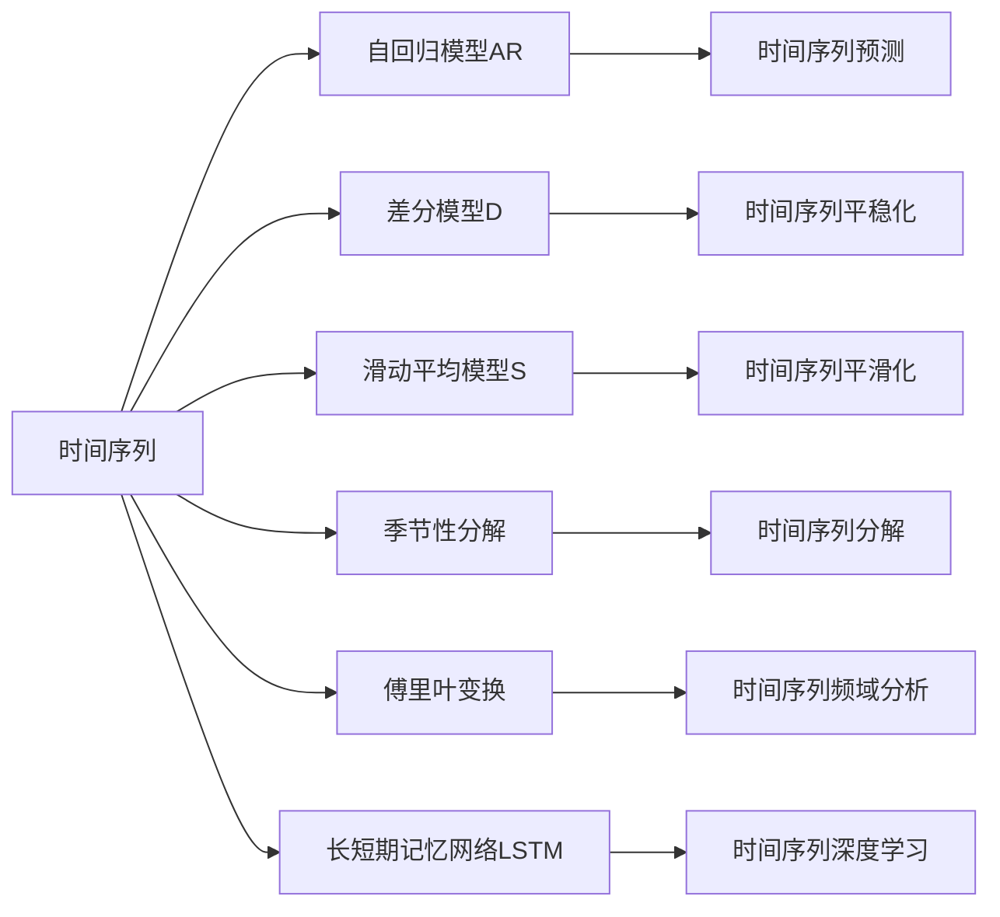

                 

# 时间序列分析(Time Series Analysis) - 原理与代码实例讲解

> 关键词：时间序列, 时间序列分析, ARIMA, 自回归模型, 差分模型, 滑动平均模型, 季节性分解, 傅里叶变换, 长短期记忆网络(LSTM), 时间序列预测, 时间序列异常检测

## 1. 背景介绍

时间序列分析（Time Series Analysis）是一种数据挖掘方法，旨在研究如何从时间序列数据中提取有用的信息，并进行预测、分类和异常检测等任务。时间序列分析广泛应用在金融、经济、医疗、交通等多个领域。传统的时间序列分析方法包括统计学方法、机器学习方法等，而深度学习技术的发展为时间序列分析带来了新的突破。

## 2. 核心概念与联系

### 2.1 核心概念概述

时间序列分析的核心概念包括：

- **时间序列（Time Series）**：一系列按时间顺序排列的数据点，如股票价格、气温、销售量等。时间序列可以是连续的或离散的，也可以是多维的。

- **自回归模型（AR）**：基于历史数据预测未来数据的模型，假设当前数据点与历史数据点之间存在线性关系。

- **差分模型（D）**：对时间序列数据进行差分操作，去除趋势和季节性成分，使数据变得平稳。

- **滑动平均模型（S）**：通过滑动平均的方式，平滑时间序列数据，消除随机波动。

- **季节性分解（Seasonality）**：将时间序列数据分解为趋势、季节性和随机波动三部分，分别进行预测和分析。

- **傅里叶变换（Fourier Transform）**：将时间序列数据转化为频域数据，揭示其周期性和频率特征。

- **长短期记忆网络（LSTM）**：一种特殊的循环神经网络（RNN），能够有效捕捉时间序列数据中的长期依赖关系。

### 2.2 概念间的关系

时间序列分析的核心概念之间存在紧密的联系，可以通过以下Mermaid流程图来展示：



这个流程图展示了时间序列分析中各个核心概念之间的关系：

1. 时间序列是分析的起点，通过不同模型进行处理。
2. AR模型用于时间序列预测，D模型用于平稳化，S模型用于平滑化，E模型用于季节性分解，F模型用于频域分析，G模型用于深度学习。
3. 这些处理后的结果可以用于时间序列预测、平稳化、平滑化、分解和频域分析。
4. LSTM模型则用于时间序列的深度学习预测。

## 3. 核心算法原理 & 具体操作步骤

### 3.1 算法原理概述

时间序列分析的原理基于统计学和机器学习的理论，旨在从时间序列数据中提取有用的信息，进行预测和分析。时间序列分析的常用方法包括统计学方法、机器学习方法等。深度学习技术的引入为时间序列分析带来了新的突破，尤其是在时间序列预测和异常检测方面取得了显著的进展。

### 3.2 算法步骤详解

时间序列分析的算法步骤通常包括以下几个关键步骤：

**Step 1: 数据预处理**
- 对时间序列数据进行清洗，去除异常值和缺失值。
- 对数据进行归一化或标准化处理。
- 对数据进行差分或滑动平均等平稳化处理。

**Step 2: 特征工程**
- 根据问题需求选择合适的特征，如趋势、季节性、随机波动等。
- 进行特征选择和特征提取。
- 对特征进行编码和转换。

**Step 3: 模型选择与训练**
- 选择适当的模型，如ARIMA、LSTM等。
- 对模型进行超参数调优，选择最优模型。
- 使用训练数据集对模型进行训练。

**Step 4: 模型评估与验证**
- 使用验证数据集对模型进行评估。
- 计算模型在验证数据集上的误差和指标。
- 根据评估结果调整模型参数或选择其他模型。

**Step 5: 预测与分析**
- 使用训练好的模型对未来数据进行预测。
- 对预测结果进行可视化分析。
- 进行异常检测和异常预警。

### 3.3 算法优缺点

时间序列分析的优点包括：
- 可以处理时间序列数据，揭示时间序列的周期性和趋势。
- 模型简单易懂，易于理解和实现。
- 适用于各种时间序列数据类型，包括连续型和离散型。

时间序列分析的缺点包括：
- 对数据质量要求高，数据中的噪声和异常值对模型的影响较大。
- 对长序列数据的处理能力有限，容易导致计算复杂度增加。
- 对数据的季节性特征要求高，对季节性变化敏感。

### 3.4 算法应用领域

时间序列分析广泛应用于金融、经济、医疗、交通等多个领域：

- **金融领域**：用于股票价格预测、利率预测、风险评估等。
- **经济领域**：用于GDP预测、通货膨胀预测、失业率预测等。
- **医疗领域**：用于疾病预测、药物效果预测、病人监测等。
- **交通领域**：用于交通流量预测、交通事故预测、路况分析等。

## 4. 数学模型和公式 & 详细讲解 & 举例说明

### 4.1 数学模型构建

时间序列分析的数学模型可以表示为：

$$
y_t = c + \sum_{i=1}^{p} \phi_i y_{t-i} + \sum_{j=1}^{d} \theta_j (y_{t-j} - \mu) + \epsilon_t
$$

其中：
- $y_t$ 是时间序列在第 $t$ 时刻的值。
- $c$ 是截距项。
- $\phi_i$ 是自回归参数。
- $\mu$ 是数据的均值。
- $\theta_j$ 是差分参数。
- $\epsilon_t$ 是随机误差项。

### 4.2 公式推导过程

时间序列分析的公式推导过程基于统计学和机器学习的理论，如自回归模型、差分模型、滑动平均模型、季节性分解、傅里叶变换等。这里以ARIMA模型为例，进行详细推导。

**ARIMA模型的基本假设**：
- 时间序列数据是平稳的。
- 随机误差项满足独立、同分布和均值为0的假设。

**ARIMA模型的公式推导**：

设时间序列数据为 $y_t$，其自回归模型为 $AR(p)$，差分模型为 $D(d)$，滑动平均模型为 $MA(q)$，则ARIMA模型可以表示为：

$$
ARIMA(p,d,q)(y_t) = c + \sum_{i=1}^{p} \phi_i y_{t-i} + \sum_{j=1}^{d} \theta_j (y_{t-j} - \mu) + \sum_{k=1}^{q} \gamma_k \epsilon_{t-k}
$$

其中，$\phi_i$、$\theta_j$、$\gamma_k$ 是模型参数，$\epsilon_t$ 是随机误差项。

### 4.3 案例分析与讲解

假设我们有一组时间序列数据 $y_t$，其ARIMA模型为ARIMA(2,1,2)，即 $AR(2)$、$D(1)$ 和 $MA(2)$，则模型可以表示为：

$$
ARIMA(2,1,2)(y_t) = c + \phi_1 y_{t-1} + \phi_2 y_{t-2} + \theta_1 (y_{t-1} - \mu) + \theta_2 (y_{t-2} - \mu) + \gamma_1 \epsilon_{t-1} + \gamma_2 \epsilon_{t-2}
$$

通过对历史数据进行拟合，得到模型的参数 $\phi_1$、$\phi_2$、$\theta_1$、$\theta_2$、$\gamma_1$、$\gamma_2$ 和截距项 $c$。

## 5. 项目实践：代码实例和详细解释说明

### 5.1 开发环境搭建

在进行时间序列分析项目开发前，我们需要准备好开发环境。以下是使用Python进行Pandas和Scikit-learn开发的环境配置流程：

1. 安装Anaconda：从官网下载并安装Anaconda，用于创建独立的Python环境。

2. 创建并激活虚拟环境：
```bash
conda create -n ts-env python=3.8 
conda activate ts-env
```

3. 安装Pandas：
```bash
conda install pandas
```

4. 安装Scikit-learn：
```bash
conda install scikit-learn
```

5. 安装各类工具包：
```bash
pip install numpy matplotlib seaborn statsmodels plotly
```

完成上述步骤后，即可在`ts-env`环境中开始时间序列分析项目的开发。

### 5.2 源代码详细实现

下面我们以时间序列预测为例，给出使用Pandas和Scikit-learn进行时间序列预测的Python代码实现。

首先，导入所需的库：

```python
import pandas as pd
import numpy as np
import matplotlib.pyplot as plt
from sklearn.metrics import mean_squared_error
from statsmodels.tsa.arima_model import ARIMA
from sklearn.model_selection import train_test_split
```

然后，准备数据：

```python
# 读取数据
data = pd.read_csv('time_series_data.csv', index_col='date', parse_dates=True)

# 划分训练集和测试集
train_data, test_data = train_test_split(data, test_size=0.2, shuffle=False)

# 数据可视化
train_data['y'].plot(figsize=(10, 6))
plt.title('Training Data')
plt.show()
```

接着，训练模型：

```python
# 模型拟合
model = ARIMA(train_data['y'], order=(2, 1, 2))
model_fit = model.fit(disp=0)

# 预测
forecast = model_fit.forecast(steps=len(test_data))
```

最后，评估模型：

```python
# 计算误差
mse = mean_squared_error(test_data['y'], forecast)
print(f'Mean Squared Error: {mse:.2f}')

# 可视化预测结果
plt.plot(test_data['y'], label='Actual')
plt.plot(forecast, label='Forecast')
plt.title('Forecast vs Actual')
plt.legend()
plt.show()
```

以上就是使用Pandas和Scikit-learn进行时间序列预测的完整代码实现。可以看到，通过Pandas和Scikit-learn，我们可以快速搭建时间序列分析的模型，并进行训练、预测和评估。

### 5.3 代码解读与分析

让我们再详细解读一下关键代码的实现细节：

**数据预处理**：
- `read_csv`方法：读取时间序列数据，并设置日期为索引。
- `train_test_split`方法：将数据划分为训练集和测试集。

**模型训练**：
- `ARIMA`方法：构建ARIMA模型，并使用`fit`方法进行拟合。
- `forecast`方法：使用拟合好的模型进行预测。

**模型评估**：
- `mean_squared_error`方法：计算预测值与实际值之间的均方误差。
- `plot`方法：绘制预测结果和实际值的对比图。

## 6. 实际应用场景

### 6.1 股票价格预测

时间序列分析在股票价格预测中有着广泛的应用。通过历史股票价格数据，可以使用ARIMA模型或其他时间序列模型，预测未来价格走势。时间序列分析可以揭示股票价格的周期性和趋势，提供有价值的投资参考。

### 6.2 交通流量预测

交通流量预测是时间序列分析的重要应用之一。通过对历史交通流量数据进行分析，可以预测未来交通流量变化，优化交通管理，缓解交通拥堵。时间序列分析可以揭示交通流量的季节性变化和趋势，提供更准确的预测结果。

### 6.3 气象数据预测

气象数据预测是时间序列分析的重要应用之一。通过对历史气象数据进行分析，可以预测未来气象变化，提供天气预报和灾害预警。时间序列分析可以揭示气象数据的周期性和趋势，提供更准确的预测结果。

## 7. 工具和资源推荐

### 7.1 学习资源推荐

为了帮助开发者系统掌握时间序列分析的理论基础和实践技巧，这里推荐一些优质的学习资源：

1. 《时间序列分析》（Time Series Analysis）书籍：James Hamilton所著，详细介绍了时间序列分析的理论和方法，是时间序列分析领域的经典教材。

2. 《机器学习实战》（Hands-On Machine Learning with Scikit-Learn, Keras, and TensorFlow）书籍：Aurélien Géron所著，介绍了时间序列分析在机器学习中的应用，并提供了丰富的代码示例。

3. Coursera《时间序列分析》课程：由Johns Hopkins大学开设的在线课程，由Robert Hyndman教授主讲，介绍了时间序列分析的理论和应用。

4. YouTube《时间序列分析》课程：由Georgia Tech OMSA开设的在线课程，由Christopher Brooks教授主讲，提供了丰富的视频教程和代码示例。

5. Kaggle时间序列分析竞赛：Kaggle是一个数据科学竞赛平台，提供了许多时间序列分析竞赛和实战项目，可以学习实战经验。

通过对这些资源的学习实践，相信你一定能够快速掌握时间序列分析的精髓，并用于解决实际问题。

### 7.2 开发工具推荐

高效的开发离不开优秀的工具支持。以下是几款用于时间序列分析开发的常用工具：

1. Python：Python是时间序列分析的主流语言，提供了丰富的库和框架，如Pandas、NumPy、Scikit-learn等。

2. R语言：R语言是时间序列分析的另一种常用语言，提供了丰富的统计学和机器学习库，如forecast、stats、caret等。

3. MATLAB：MATLAB是时间序列分析的商业软件，提供了丰富的工具箱和算法，适合进行复杂的时间序列建模和分析。

4. Excel：Excel是常用的数据处理工具，提供了丰富的时间序列分析函数和工具，适合进行简单的时间序列分析和预测。

5. Tableau：Tableau是数据可视化工具，可以将时间序列数据可视化展示，提供直观的趋势和周期性分析。

合理利用这些工具，可以显著提升时间序列分析任务的开发效率，加快创新迭代的步伐。

### 7.3 相关论文推荐

时间序列分析的研究源于学界的持续研究。以下是几篇奠基性的相关论文，推荐阅读：

1. "Time Series Analysis and Its Applications" by Robert T. Hyndman and George Athanasopoulos：介绍了时间序列分析的理论和方法，提供了丰富的案例和代码示例。

2. "An Introduction to Time Series Analysis and Its Applications" by Robert T. Hyndman：介绍了时间序列分析的基本概念和常见模型，适合初学者入门。

3. "A Comparison of Forecasting Methods for Short-Term Load Forecasting" by Qiang Shen, Wei Xu, and Xiongjun Hua：介绍了几种常见的时间序列预测方法，并进行了对比实验。

4. "Forecasting Techniques for Big Data: A Review" by Indrajit Bhattacharya and Masanori Natsukawa：介绍了大时间序列预测技术，适合大数据和实时预测场景。

这些论文代表了大时间序列分析的发展脉络。通过学习这些前沿成果，可以帮助研究者把握学科前进方向，激发更多的创新灵感。

除上述资源外，还有一些值得关注的前沿资源，帮助开发者紧跟时间序列分析技术的最新进展，例如：

1. arXiv论文预印本：人工智能领域最新研究成果的发布平台，包括大量尚未发表的前沿工作，学习前沿技术的必读资源。

2. GitHub热门项目：在GitHub上Star、Fork数最多的时间序列分析相关项目，往往代表了该技术领域的发展趋势和最佳实践，值得去学习和贡献。

3. 技术会议直播：如NIPS、ICML、ICLR等人工智能领域顶会现场或在线直播，能够聆听到大佬们的前沿分享，开拓视野。

4. 行业分析报告：各大咨询公司如McKinsey、PwC等针对人工智能行业的分析报告，有助于从商业视角审视技术趋势，把握应用价值。

总之，对于时间序列分析技术的学习和实践，需要开发者保持开放的心态和持续学习的意愿。多关注前沿资讯，多动手实践，多思考总结，必将收获满满的成长收益。

## 8. 总结：未来发展趋势与挑战

### 8.1 总结

本文对时间序列分析方法进行了全面系统的介绍。首先阐述了时间序列分析的背景和意义，明确了时间序列分析在金融、经济、医疗等领域的重要价值。其次，从原理到实践，详细讲解了时间序列分析的数学原理和关键步骤，给出了时间序列分析任务开发的完整代码实例。同时，本文还广泛探讨了时间序列分析方法在多个行业领域的应用前景，展示了时间序列分析范式的巨大潜力。此外，本文精选了时间序列分析技术的各类学习资源，力求为读者提供全方位的技术指引。

通过本文的系统梳理，可以看到，时间序列分析技术在处理时间序列数据、揭示数据周期性和趋势方面具有强大的能力。随着深度学习技术的发展，时间序列分析的精度和应用范围将进一步提升，未来有望在更多领域发挥重要作用。

### 8.2 未来发展趋势

展望未来，时间序列分析技术将呈现以下几个发展趋势：

1. 深度学习在时间序列分析中的应用将更加广泛，特别是在时间序列预测和异常检测方面，深度学习技术将进一步提升时间序列分析的精度和效率。

2. 时间序列数据的获取将更加多样化和实时化，时间序列分析技术将能够处理更大规模、更复杂的时间序列数据。

3. 时间序列分析与其他人工智能技术（如自然语言处理、计算机视觉等）的融合将更加深入，实现多模态时间序列分析。

4. 时间序列分析技术将更加注重数据质量和特征工程，通过更好的数据处理和特征提取，提升时间序列分析的效果。

5. 时间序列分析将更加注重模型解释性和可解释性，通过提供更清晰、易懂的模型解释，增强时间序列分析的可信度和可用性。

6. 时间序列分析将更加注重模型优化和调优，通过更好的模型选择和调优，提升时间序列分析的性能和效率。

以上趋势凸显了时间序列分析技术的广阔前景。这些方向的探索发展，必将进一步提升时间序列分析技术的精度和应用范围，为构建智能系统和解决实际问题提供更强大的工具。

### 8.3 面临的挑战

尽管时间序列分析技术已经取得了显著进展，但在迈向更加智能化、普适化应用的过程中，它仍面临着诸多挑战：

1. 数据质量和特征工程：时间序列分析对数据质量和特征工程的要求较高，数据中的噪声和异常值可能对模型产生较大影响。

2. 模型选择和调优：时间序列分析模型的选择和调优是一个复杂的过程，需要根据具体问题进行灵活调整。

3. 模型解释性和可解释性：时间序列分析模型的解释性和可解释性相对较低，难以提供直观的解释和预测。

4. 计算复杂度和计算资源：时间序列分析模型的计算复杂度和计算资源需求较高，需要高效的计算平台和算法支持。

5. 多模态数据融合：时间序列分析模型的融合能力有限，难以同时处理多模态数据。

6. 实时性和高效性：时间序列分析模型的实时性和高效性要求较高，需要高效的计算平台和算法支持。

这些挑战凸显了时间序列分析技术的复杂性和多样性，需要更多的研究和实践来克服。

### 8.4 研究展望

面对时间序列分析面临的挑战，未来的研究需要在以下几个方面寻求新的突破：

1. 探索新的深度学习模型和时间序列模型，提升时间序列分析的精度和效率。

2. 研究新的数据处理和特征工程方法，提高时间序列分析的数据质量和特征提取能力。

3. 研究新的模型解释和可解释性方法，增强时间序列分析的可信度和可用性。

4. 研究新的计算平台和算法，提高时间序列分析的实时性和高效性。

5. 研究新的多模态数据融合方法，增强时间序列分析的融合能力。

6. 研究新的应用场景和应用领域，推动时间序列分析技术的发展和应用。

这些研究方向的探索，必将引领时间序列分析技术迈向更高的台阶，为构建智能系统和解决实际问题提供更强大的工具。

## 9. 附录：常见问题与解答

**Q1：时间序列分析的预处理步骤包括哪些？**

A: 时间序列分析的预处理步骤包括：
- 数据清洗：去除异常值和缺失值。
- 数据归一化：将数据标准化或归一化。
- 数据差分：对数据进行差分操作，去除趋势和季节性成分，使数据变得平稳。
- 数据平滑：对数据进行滑动平均等平滑化处理。

**Q2：ARIMA模型的超参数如何选择？**

A: ARIMA模型的超参数选择是一个复杂的过程，通常需要进行交叉验证。一般而言，可以采用网格搜索或随机搜索的方法，对不同的参数组合进行评估，选择最优的参数组合。

**Q3：时间序列分析的预测结果是否可靠？**

A: 时间序列分析的预测结果可靠与否，取决于数据的准确性和模型的选择。如果数据质量好，模型选择合理，预测结果通常是可靠的。但需要定期对模型进行重新评估和调整，以应对数据和环境的变化。

**Q4：时间序列分析的计算复杂度较高，如何解决？**

A: 解决时间序列分析计算复杂度较高的策略包括：
- 优化算法：使用更高效的优化算法，如随机梯度下降（SGD）、Adam等。
- 模型压缩：对模型进行压缩和简化，去除不必要的参数。
- 并行计算：使用分布式计算和并行计算，提高计算效率。

**Q5：时间序列分析的模型如何评估？**

A: 时间序列分析的模型评估通常使用以下指标：
- 均方误差（MSE）：衡量预测值与实际值之间的平均误差。
- 均方根误差（RMSE）：衡量预测值与实际值之间的均方误差。
- 平均绝对误差（MAE）：衡量预测值与实际值之间的平均绝对误差。
- 相对误差（MAPE）：衡量预测值与实际值之间的相对误差。

这些指标可以用于评估模型的性能，帮助选择最优的模型。

通过本文的系统梳理，可以看到，时间序列分析技术在处理时间序列数据、揭示数据周期性和趋势方面具有强大的能力。随着深度学习技术的发展，时间序列分析的精度和应用范围将进一步提升，未来有望在更多领域发挥重要作用。同时，面对时间序列分析面临的挑战，未来的研究需要在数据处理、模型选择、计算平台等方面进行深入探索，推动时间序列分析技术的发展和应用。

