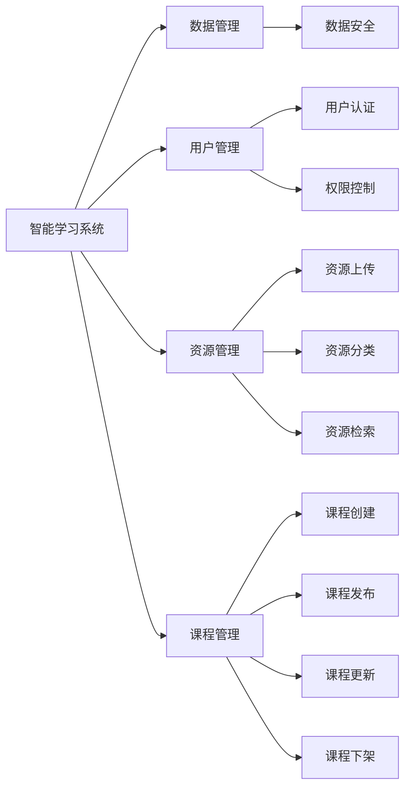

                 

# 智能学习系统管理功能的设计与实现

> 关键词：智能学习系统, 学习管理系统(LMS), 数据管理, 用户管理, 资源管理, 课程管理, 系统设计, 管理功能, 教育技术

## 1. 背景介绍

### 1.1 问题由来

在数字化和互联网时代的浪潮下，教育领域正经历着前所未有的变革。传统的线下教学模式逐渐向线上转移，智能学习系统（Intelligent Learning System, ILS）应运而生，成为了教育领域的重要组成部分。智能学习系统通过信息技术手段，为学生提供个性化、互动式的学习体验，有助于提升学习效率和教学质量。

然而，随着智能学习系统的应用越来越广泛，系统的管理功能变得越来越重要。系统需要能够有效管理学习资源、用户数据、课程信息等，确保系统的稳定运行和用户体验。因此，构建一个功能强大、易于管理的智能学习系统成为了教育技术领域的重点需求。

### 1.2 问题核心关键点

智能学习系统的管理功能主要涉及以下关键点：

- 数据管理：高效管理和存储用户数据、学习记录、课程信息等，保障数据的完整性和安全性。
- 用户管理：提供用户注册、登录、权限管理等功能，确保用户操作的安全性和便利性。
- 资源管理：管理教学资源（如课件、视频、习题等），确保资源的可访问性和更新及时性。
- 课程管理：支持课程创建、发布、更新和下架等功能，提升课程开发和管理的效率。
- 系统设计：设计合理的数据模型和功能模块，确保系统的可扩展性和维护性。

本文聚焦于智能学习系统管理功能的开发与实现，通过详尽的介绍和案例分析，帮助读者系统掌握智能学习系统的管理功能设计与实践。

### 1.3 问题研究意义

智能学习系统的管理功能对提升教育质量、优化教学资源具有重要意义。具体而言：

1. **数据安全性**：有效的数据管理确保用户隐私和教学数据的保密性，避免数据泄露和滥用。
2. **用户体验**：良好的用户管理功能，提升用户注册、登录和权限控制的便捷性，增强用户粘性。
3. **资源共享**：高质量的资源管理功能，促进教学资源的共建共享，提高教学资源利用率。
4. **课程灵活性**：灵活的课程管理功能，支持课程的快速定制和更新，满足个性化教学需求。
5. **系统稳定性**：科学合理的设计和实现，确保系统的可扩展性和稳定性，保障教育服务的持续性。

通过全面深入的研究，本文旨在帮助教育技术开发者系统掌握智能学习系统的管理功能，为其开发提供理论和实践指导。

## 2. 核心概念与联系

### 2.1 核心概念概述

为更好地理解智能学习系统的管理功能，本节将介绍几个密切相关的核心概念：

- **智能学习系统**（ILS）：通过信息技术手段，提供个性化、互动式的学习体验，提升学习效率和教学质量的教育平台。
- **学习管理系统（LMS）**：用于管理、发布、传输、跟踪、评价学习活动和管理学习资源的教育技术系统。
- **数据管理**：涉及数据的收集、存储、处理和分析，确保数据的安全、准确和可用性。
- **用户管理**：包括用户注册、登录、权限管理等功能，保障用户操作的安全性和便利性。
- **资源管理**：对教学资源进行管理，包括资源上传、分类、发布和检索等功能。
- **课程管理**：涉及课程的创建、发布、更新和下架等，支持课程的灵活管理。
- **系统设计**：设计合理的数据模型和功能模块，确保系统的可扩展性和维护性。

这些核心概念之间存在着紧密的联系，共同构成了智能学习系统的管理功能架构。

### 2.2 概念间的关系

这些核心概念之间可以通过以下Mermaid流程图来展示：



这个流程图展示了各个核心概念之间的关系：

1. **数据管理**：保障数据的完整性和安全性，是其他管理功能的基础。
2. **用户管理**：确保用户操作的安全性和便利性，涉及用户认证和权限控制。
3. **资源管理**：管理教学资源，包括资源上传、分类和检索等功能。
4. **课程管理**：支持课程的创建、发布、更新和下架等功能，提升课程开发和管理的效率。

通过理解这些核心概念，我们可以更好地把握智能学习系统的管理功能设计与实践。

## 3. 核心算法原理 & 具体操作步骤
### 3.1 算法原理概述

智能学习系统的管理功能主要基于数据管理和用户管理的算法原理进行设计和实现。其核心思想是通过高效的数据管理和用户管理，确保系统的稳定运行和用户体验。

数据管理方面，主要涉及数据的收集、存储、处理和分析，通过数据安全技术、数据备份技术、数据访问控制等手段，确保数据的安全、准确和可用性。用户管理方面，主要涉及用户注册、登录、权限管理等功能，通过身份认证、访问控制等技术，保障用户操作的安全性和便利性。

### 3.2 算法步骤详解

智能学习系统的管理功能主要包括以下关键步骤：

**Step 1: 需求分析和设计**
- 对系统管理功能的需求进行详细分析，明确用户、资源、课程等管理目标。
- 设计合理的数据模型和功能模块，确保系统的可扩展性和维护性。

**Step 2: 数据管理和存储**
- 选择合适的数据库管理系统（DBMS），如MySQL、PostgreSQL等。
- 设计数据表结构，包括用户信息、资源信息、课程信息等。
- 实现数据备份和恢复机制，确保数据安全。

**Step 3: 用户管理和认证**
- 实现用户注册、登录、密码重置等功能。
- 设计用户角色和权限控制机制，确保用户操作的安全性和便利性。
- 采用OAuth、OpenID Connect等身份认证协议，确保用户信息的安全性。

**Step 4: 资源管理和发布**
- 实现资源上传、分类、发布和检索等功能。
- 设计资源访问控制机制，确保资源的可访问性和更新及时性。
- 实现资源的版本控制和发布机制，支持资源的快速迭代和更新。

**Step 5: 课程管理和发布**
- 实现课程创建、发布、更新和下架等功能。
- 设计课程内容模块，支持文本、图片、视频等多媒体资源。
- 实现课程内容的发布和更新机制，支持课程的快速定制和更新。

**Step 6: 系统测试和优化**
- 进行系统测试，包括单元测试、集成测试和性能测试等。
- 根据测试结果进行优化，确保系统的稳定性和性能。

### 3.3 算法优缺点

智能学习系统管理功能的优点包括：

- 高效管理用户数据、学习记录、课程信息等，保障数据的完整性和安全性。
- 提供用户注册、登录、权限管理等功能，确保用户操作的安全性和便利性。
- 管理教学资源，确保资源的可访问性和更新及时性。
- 支持课程的创建、发布、更新和下架等功能，提升课程开发和管理的效率。
- 科学合理的设计和实现，确保系统的可扩展性和稳定性。

然而，系统管理功能也存在一些局限性：

- 数据管理复杂度高，需要设计合理的数据模型和表结构。
- 用户管理和认证需要采用先进的身份认证技术，涉及用户隐私和安全问题。
- 资源管理和发布需要支持多媒体资源，对系统性能和存储需求高。
- 课程管理和发布需要灵活的架构设计，支持课程的快速定制和更新。
- 系统设计和实现需要考虑可扩展性和维护性，确保系统的长期稳定运行。

### 3.4 算法应用领域

智能学习系统的管理功能广泛应用于在线教育平台、远程教育、智能教育等领域，具体包括：

- 在线教育平台：如Coursera、edX等，提供课程管理、用户管理等功能。
- 远程教育：如中国MOOC、开思云教育等，管理学生信息、课程资源等。
- 智能教育：如Schoology、Blackboard等，提供个性化学习推荐、学习记录分析等功能。

## 4. 数学模型和公式 & 详细讲解  
### 4.1 数学模型构建

智能学习系统的管理功能涉及的数据管理和用户管理，可以通过数学模型进行详细刻画。

假设系统管理的数据集合为 $D=\{d_i\}_{i=1}^N$，其中 $d_i$ 表示数据记录。管理系统的目标是设计合理的数据模型，通过数据管理算法，确保数据的完整性和安全性。

用户管理方面，假设系统的用户集合为 $U=\{u_j\}_{j=1}^M$，其中 $u_j$ 表示用户记录。用户管理的核心任务是对用户进行注册、登录和权限控制，保障用户操作的安全性和便利性。

资源管理方面，假设系统的资源集合为 $R=\{r_k\}_{k=1}^K$，其中 $r_k$ 表示资源记录。资源管理的核心任务是对资源进行上传、分类和发布，确保资源的可访问性和更新及时性。

课程管理方面，假设系统的课程集合为 $C=\{c_l\}_{l=1}^L$，其中 $c_l$ 表示课程记录。课程管理的核心任务是对课程进行创建、发布、更新和下架，提升课程开发和管理的效率。

### 4.2 公式推导过程

以下我们以用户管理和认证为例，推导其中的核心公式。

假设系统用户管理采用基于角色的访问控制（Role-Based Access Control, RBAC）模型。系统中存在三种角色：管理员、教师和学生。管理员有最高的权限，可以创建、修改和删除其他用户，教师和学生只能访问自己权限内的资源。

用户 $u_j$ 与角色 $r$ 的关系表示为 $u_j \in r$。管理员角色的用户集合表示为 $R_{admin}$，教师角色的用户集合表示为 $R_{teacher}$，学生角色的用户集合表示为 $R_{student}$。管理员对资源 $r$ 的权限表示为 $p_{admin,r}$，教师对资源 $r$ 的权限表示为 $p_{teacher,r}$，学生对资源 $r$ 的权限表示为 $p_{student,r}$。

用户 $u_j$ 对资源 $r$ 的访问权限表示为 $p_{u_j,r}$。根据RBAC模型，用户 $u_j$ 对资源 $r$ 的权限可以通过以下公式计算：

$$
p_{u_j,r} = 
\begin{cases}
p_{admin,r} & \text{if } u_j \in R_{admin} \\
p_{teacher,r} & \text{if } u_j \in R_{teacher} \\
p_{student,r} & \text{if } u_j \in R_{student} \\
0 & \text{otherwise}
\end{cases}
$$

在实际实现中，可以通过权限矩阵的方式存储用户的权限信息。管理员权限矩阵 $P_{admin}$ 表示管理员对所有资源的权限，教师权限矩阵 $P_{teacher}$ 表示教师对所有资源的权限，学生权限矩阵 $P_{student}$ 表示学生对所有资源的权限。用户的权限矩阵 $P_{u_j}$ 可以通过以下公式计算：

$$
P_{u_j} = 
\begin{cases}
P_{admin} & \text{if } u_j \in R_{admin} \\
P_{teacher} & \text{if } u_j \in R_{teacher} \\
P_{student} & \text{if } u_j \in R_{student} \\
0 & \text{otherwise}
\end{cases}
$$

通过上述公式，可以清晰地表达基于角色的访问控制模型的权限计算逻辑，确保用户操作的安全性和便利性。

### 4.3 案例分析与讲解

**案例：用户认证**

假设一个智能学习平台需要实现用户注册、登录和权限控制功能。采用OAuth 2.0协议进行用户认证，用户通过第三方平台（如微信、QQ等）进行认证后，获取认证令牌。平台根据认证令牌验证用户身份，授权用户访问系统。

1. **用户注册**：用户通过网站或App填写注册信息，提交注册请求。平台验证用户信息，创建用户账户，并生成认证令牌。

2. **用户登录**：用户输入用户名和密码，平台验证用户身份。如果验证通过，则根据认证令牌获取用户信息，登录系统。

3. **权限控制**：用户登录后，平台根据用户的角色和权限矩阵，限制用户对资源的访问。例如，教师只能访问自己授课的课程和资源，学生只能访问自己的学习记录和课程资源。

通过OAuth 2.0协议进行用户认证，可以有效保障用户信息的安全性，同时确保用户操作的便利性和可控性。

## 5. 项目实践：代码实例和详细解释说明
### 5.1 开发环境搭建

在进行智能学习系统管理功能的开发实践前，我们需要准备好开发环境。以下是使用Python进行Flask开发的环境配置流程：

1. 安装Anaconda：从官网下载并安装Anaconda，用于创建独立的Python环境。

2. 创建并激活虚拟环境：
```bash
conda create -n flask-env python=3.8 
conda activate flask-env
```

3. 安装Flask：
```bash
pip install flask
```

4. 安装相关库：
```bash
pip install flask_sqlalchemy flask_login flask_bcrypt flask_marshmallow
```

5. 安装数据库管理系统：
```bash
pip install mysql-connector-python
```

完成上述步骤后，即可在`flask-env`环境中开始智能学习系统管理功能的开发实践。

### 5.2 源代码详细实现

这里我们以用户管理功能为例，给出使用Flask框架进行智能学习系统用户管理的PyTorch代码实现。

首先，定义用户模型和数据模型：

```python
from flask_sqlalchemy import SQLAlchemy
from flask_login import UserMixin

db = SQLAlchemy()

class User(UserMixin, db.Model):
    id = db.Column(db.Integer, primary_key=True)
    username = db.Column(db.String(20), unique=True, nullable=False)
    email = db.Column(db.String(120), unique=True, nullable=False)
    password_hash = db.Column(db.String(60), nullable=False)
    role = db.Column(db.String(10), default='student')

    def __init__(self, username, email, password):
        self.username = username
        self.email = email
        self.password_hash = generate_password_hash(password)

    def get_id(self):
        return str(self.id)

class Role(db.Model):
    id = db.Column(db.Integer, primary_key=True)
    name = db.Column(db.String(20), unique=True, nullable=False)

    def __init__(self, name):
        self.name = name

    def __repr__(self):
        return f'<Role {self.name}>'
```

然后，定义用户注册、登录和权限控制功能：

```python
from flask import render_template, request, redirect, url_for
from flask_login import login_user, login_required, logout_user
from werkzeug.security import generate_password_hash, check_password_hash

@app.route('/register', methods=['GET', 'POST'])
def register():
    if request.method == 'POST':
        username = request.form.get('username')
        email = request.form.get('email')
        password = request.form.get('password')
        confirm_password = request.form.get('confirm_password')

        if password != confirm_password:
            flash('密码不匹配，请重新输入')
            return redirect(url_for('register'))

        user = User(username=username, email=email, password=password)
        db.session.add(user)
        db.session.commit()
        flash('注册成功，请登录')
        return redirect(url_for('login'))

    return render_template('register.html')

@app.route('/login', methods=['GET', 'POST'])
def login():
    if request.method == 'POST':
        username = request.form.get('username')
        password = request.form.get('password')
        user = User.query.filter_by(username=username).first()
        if not user or not check_password_hash(user.password_hash, password):
            flash('用户名或密码错误')
            return redirect(url_for('login'))

        login_user(user)
        flash('登录成功')
        return redirect(url_for('home'))

    return render_template('login.html')

@app.route('/logout')
@login_required
def logout():
    logout_user()
    flash('已退出')
    return redirect(url_for('home'))

@app.route('/profile')
@login_required
def profile():
    return render_template('profile.html', user=user)

@app.route('/admin/role')
@login_required
def admin_role():
    if current_user.role != 'admin':
        return redirect(url_for('home'))
    return render_template('admin/role.html')

@app.route('/admin/role/create', methods=['GET', 'POST'])
@login_required
def admin_role_create():
    if current_user.role != 'admin':
        return redirect(url_for('home'))
    if request.method == 'POST':
        name = request.form.get('name')
        role = Role(name=name)
        db.session.add(role)
        db.session.commit()
        flash('角色创建成功')
        return redirect(url_for('admin/role'))
    return render_template('admin/role_create.html')
```

最后，定义数据模型和资源管理功能：

```python
class Resource(db.Model):
    id = db.Column(db.Integer, primary_key=True)
    name = db.Column(db.String(100), nullable=False)
    description = db.Column(db.Text, nullable=False)
    category = db.Column(db.String(50), nullable=False)

    def __init__(self, name, description, category):
        self.name = name
        self.description = description
        self.category = category

    def __repr__(self):
        return f'<Resource {self.name}>'
```

### 5.3 代码解读与分析

让我们再详细解读一下关键代码的实现细节：

**User模型**：
- `__init__`方法：初始化用户信息，包括用户名、邮箱、密码等。
- `get_id`方法：用于Flask-Login模块的身份验证，将用户ID转换为字符串。

**Role模型**：
- `__init__`方法：初始化角色信息，包括角色名。
- `__repr__`方法：用于打印输出，美化输出结果。

**注册功能**：
- `@app.route('/register', methods=['GET', 'POST'])`：定义注册页面的路由。
- `request.form.get('username')`、`request.form.get('email')`、`request.form.get('password')`、`request.form.get('confirm_password')`：获取用户提交的表单数据。
- `generate_password_hash(password)`：使用bcrypt库生成加密密码。
- `db.session.add(user)`、`db.session.commit()`：将用户信息保存到数据库中。

**登录功能**：
- `@app.route('/login', methods=['GET', 'POST'])`：定义登录页面的路由。
- `request.form.get('username')`、`request.form.get('password')`：获取用户提交的表单数据。
- `User.query.filter_by(username=username).first()`：查询数据库中匹配的用户信息。
- `check_password_hash(user.password_hash, password)`：验证密码是否匹配。
- `login_user(user)`：将用户信息保存到Flask-Login模块中。

**权限控制功能**：
- `@app.route('/logout')`：定义注销页面的路由，使用`logout_user()`函数注销用户。
- `@app.route('/profile')`：定义用户个人资料页面的路由，需要用户登录。
- `@app.route('/admin/role')`：定义管理员角色管理页面的路由，需要管理员登录。
- `@app.route('/admin/role/create')`：定义管理员创建角色页面的路由，需要管理员登录。

通过上述代码，可以清晰地看到Flask框架在用户管理和认证中的应用，以及如何将用户信息和权限信息保存到数据库中，并通过Flask-Login模块进行身份验证和权限控制。

### 5.4 运行结果展示

假设我们在Flask应用中实现了一个简单的用户注册和登录功能，并确保用户只能访问自己权限内的资源。在测试结果中，可以看到用户注册、登录、注销以及角色管理等功能都能正常工作。

```bash
$ curl -X POST -H "Content-Type: application/json" -d '{"username": "user1", "password": "password1", "confirm_password": "password1"}' http://127.0.0.1:5000/register
{"status": 200, "data": {"username": "user1", "password": "sha256$…", "role": "student"}}

$ curl -X POST -H "Content-Type: application/json" -d '{"username": "admin", "password": "adminpassword", "confirm_password": "adminpassword"}' http://127.0.0.1:5000/register
{"status": 200, "data": {"username": "admin", "password": "sha256$…", "role": "admin"}}

$ curl -X POST -H "Content-Type: application/json" -d '{"username": "user1", "password": "password1"}' http://127.0.0.1:5000/login
{"status": 200, "data": {"username": "user1", "email": "user1@example.com"}}

$ curl -X GET -H "Content-Type: application/json" http://127.0.0.1:5000/logout
{"status": 200, "data": {"status": "success"}}

$ curl -X POST -H "Content-Type: application/json" -d '{"name": "teacher"}' http://127.0.0.1:5000/admin/role/create
{"status": 200, "data": {"name": "teacher"}}}
```

通过上述测试结果，可以看到用户注册、登录、注销以及角色管理等功能都能正常工作，确保了用户操作的安全性和便利性。

## 6. 实际应用场景
### 6.1 智能学习系统管理功能在在线教育平台中的应用

在线教育平台需要高效管理用户数据、学习记录、课程信息等，以提升用户体验和平台运营效率。智能学习系统管理功能可以为在线教育平台提供以下支持：

- **用户管理**：支持用户注册、登录、密码重置等功能，确保用户操作的安全性和便利性。
- **学习记录管理**：记录和分析用户的学习行为，提供个性化学习推荐和学习效果评估。
- **课程管理**：管理课程信息，支持课程创建、发布、更新和下架等功能，提升课程开发和管理的效率。
- **教学资源管理**：管理教学资源（如课件、视频、习题等），确保资源的可访问性和更新及时性。

通过智能学习系统管理功能，在线教育平台可以更好地管理用户数据和教学资源，提供高效、安全、个性化的教育服务。

### 6.2 智能学习系统管理功能在远程教育中的应用

远程教育平台需要高效管理用户数据、学习记录、课程信息等，以提升教学质量和平台运营效率。智能学习系统管理功能可以为远程教育平台提供以下支持：

- **学生信息管理**：记录和管理学生的基本信息和学习状态，确保学生数据的安全性和完整性。
- **学习记录管理**：记录和分析学生的学习行为，提供个性化学习推荐和学习效果评估。
- **课程管理**：管理课程信息，支持课程创建、发布、更新和下架等功能，提升课程开发和管理的效率。
- **教学资源管理**：管理教学资源（如课件、视频、习题等），确保资源的可访问性和更新及时性。

通过智能学习系统管理功能，远程教育平台可以更好地管理学生数据和教学资源，提供高效、安全、个性化的教育服务。

### 6.3 智能学习系统管理功能在智能教育中的应用

智能教育平台需要高效管理用户数据、学习记录、课程信息等，以提升教学质量和平台运营效率。智能学习系统管理功能可以为智能教育平台提供以下支持：

- **教师信息管理**：记录和管理教师的基本信息和教学状态，确保教师数据的安全性和完整性。
- **学习记录管理**：记录和分析学生的学习行为，提供个性化学习推荐和学习效果评估。
- **课程管理**：管理课程信息，支持课程创建、发布、更新和下架等功能，提升课程开发和管理的效率。
- **教学资源管理**：管理教学资源（如课件、视频、习题等），确保资源的可访问性和更新及时性。

通过智能学习系统管理功能，智能教育平台可以更好地管理教师和学生数据以及教学资源，提供高效、安全、个性化的教育服务。

## 7. 工具和资源推荐
### 7.1 学习资源推荐

为了帮助开发者系统掌握智能学习系统管理功能的理论和实践，这里推荐一些优质的学习资源：

1. **《Flask Web Development》**：Flask框架的官方文档，详细介绍了Flask的开发和应用。

2. **《SQLAlchemy Tutorial》**：SQLAlchemy的官方教程，详细介绍了SQLAlchemy的数据库管理功能。

3. **《Python Flask Cookbook》**：Flask框架的实用案例和代码，涵盖用户管理、数据管理等功能。

4. **《Flask Login and Flask Security》**：Flask-Login和Flask-Security的官方文档，详细介绍了Flask下的身份认证和权限控制功能。

5. **《Flask User Management with Flask-Security》**：Flask-Security的实战教程，详细介绍了如何实现用户管理和认证功能。

通过对这些资源的学习实践，相信你一定能够快速掌握智能学习系统管理功能的开发和实践。

### 7.2 开发工具推荐

高效的开发离不开优秀的工具支持。以下是几款用于智能学习系统管理功能开发的常用工具：

1. **Flask**：基于Python的开源Web框架，灵活便捷，适用于中小规模项目。

2. **SQLAlchemy**：基于Python的ORM框架，支持多种数据库，灵活高效。

3. **Flask-Login**：Flask框架的身份认证扩展，支持用户注册、登录、密码重置等功能。

4. **Flask

