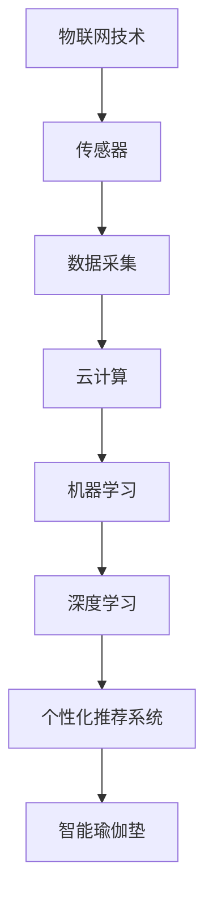

                 

# 智能瑜伽垫创业：个人健身教练的替代品

## 1. 背景介绍

在数字化、智能化的时代背景下，健身行业正经历着翻天覆地的变革。传统的健身方式逐渐被个性化、科技化的健身模式所取代，智能健身器材和智能健身App纷纷涌现，迎合了人们对高效、便捷健身的需求。本文将探讨一款基于人工智能技术的智能瑜伽垫，它将如何成为个人健身教练的替代品，为人们带来全新的健身体验。

## 2. 核心概念与联系

### 2.1 核心概念概述

智能瑜伽垫是指通过集成各种传感器和智能算法，实现对用户动作的精准监测和分析，提供个性化健身指导的智能健身器材。该产品融合了物联网技术、机器学习、深度学习等前沿技术，能够实时监测用户的动作，通过人工智能算法生成个性化健身方案，引导用户进行科学的健身训练。

- **物联网技术(IoT)**：指的是将各种设备通过互联网连接在一起，实现数据共享和实时通信。智能瑜伽垫集成的传感器（如陀螺仪、加速度计、压力传感器等）通过IoT技术，将用户的动作数据上传到云端。
- **机器学习(ML)**：是指让机器通过大量数据学习，自动提取出数据的特征，从而实现对用户动作的自动识别和分类。
- **深度学习(DL)**：是一种特殊的机器学习方法，通过多层神经网络结构，可以处理更加复杂的数据，如自然语言、图像等。深度学习可以用于更精确的动作识别和行为预测。
- **个性化推荐系统**：通过对用户数据进行分析，智能瑜伽垫能够提供个性化的健身方案，包括训练计划、动作指导、饮食建议等。

### 2.2 核心概念间的关系

智能瑜伽垫的实现涉及多个核心概念的紧密合作：



从传感器采集用户数据，到云端云计算，再到机器学习和深度学习的处理，最终通过个性化推荐系统，将量身定制的健身方案呈现在用户面前。

## 3. 核心算法原理 & 具体操作步骤

### 3.1 算法原理概述

智能瑜伽垫的核心算法主要分为两个部分：动作识别和个性化推荐。

**动作识别**：通过机器学习和深度学习算法，将用户瑜伽动作转换为数字信号，识别出用户当前的动作类型（如站立、弯曲、拉伸等）。

**个性化推荐**：根据用户动作数据和健康目标（如减肥、增肌、提高柔韧性等），通过深度学习模型，生成个性化的训练方案，包括动作序列、训练时长、强度等。

### 3.2 算法步骤详解

**Step 1: 数据采集与预处理**
- 安装传感器：在瑜伽垫上安装各种传感器，如陀螺仪、加速度计、压力传感器等。
- 数据采集：在用户使用瑜伽垫时，传感器实时采集用户动作数据，包括姿态、力度、速度、时间等。
- 数据预处理：对采集的数据进行清洗、归一化、平滑等处理，去除噪声和异常值。

**Step 2: 动作识别**
- 特征提取：从预处理后的数据中提取关键特征，如角度、速度、加速度等。
- 动作分类：通过机器学习算法（如SVM、KNN等）或深度学习算法（如卷积神经网络CNN、循环神经网络RNN等），将动作数据分类为不同的动作类型。

**Step 3: 个性化推荐**
- 用户画像：构建用户健康档案，包括性别、年龄、体重、目标等。
- 训练模型：根据用户数据和健康目标，使用深度学习模型（如LSTM、GRU等）生成个性化训练方案。
- 推荐生成：结合用户画像和训练模型，生成个性化的训练计划和动作指导。

**Step 4: 反馈与调整**
- 实时反馈：在用户进行训练时，通过智能瑜伽垫上的显示屏或手机App，实时展示训练进度和反馈信息。
- 动态调整：根据用户反馈和训练效果，动态调整训练方案，确保用户持续进步。

### 3.3 算法优缺点

**优点**：
- **个性化强**：能够根据用户的身体特征和健康目标，提供个性化的训练方案。
- **高效便捷**：用户无需聘请私人教练，即可在家进行科学、高效的健身训练。
- **实时反馈**：能够实时监测和反馈用户的训练效果，帮助用户及时调整训练计划。

**缺点**：
- **成本高**：需要购买高质量的智能瑜伽垫和配套的传感器，初期投资较高。
- **依赖设备**：智能瑜伽垫的体验依赖于设备的质量和传感器的精度，一旦设备出现问题，训练效果会受到影响。
- **隐私问题**：需要收集用户的健康数据和动作数据，可能会引发隐私保护方面的担忧。

### 3.4 算法应用领域

智能瑜伽垫主要应用于家庭健身、健身房辅助训练、企业健康管理等场景。

**家庭健身**：个人用户可以在家中使用智能瑜伽垫，根据其健康目标和身体状况，生成个性化的训练方案，实现科学健身。

**健身房辅助训练**：健身房可以通过智能瑜伽垫，对用户进行精准的训练监测和数据分析，提供更加专业化的健身指导。

**企业健康管理**：企业可以为员工配备智能瑜伽垫，作为员工健康管理的一部分，提高员工的整体健康水平。

## 4. 数学模型和公式 & 详细讲解

### 4.1 数学模型构建

智能瑜伽垫的算法模型主要包括两部分：动作识别模型和个性化推荐模型。

**动作识别模型**：采用卷积神经网络（CNN）对采集的数据进行特征提取和分类。

**个性化推荐模型**：使用循环神经网络（RNN）或长短时记忆网络（LSTM）对用户数据进行分析，生成个性化的训练方案。

### 4.2 公式推导过程

**动作识别模型的公式推导**：

假设输入为时间序列数据 $x_t=(x_t^1, x_t^2, ..., x_t^n)$，其中 $x_t^i$ 表示第 $i$ 个时间步的数据。定义卷积层为 $C_k$，池化层为 $P_k$，全连接层为 $F_k$。则动作识别模型的公式为：

$$
y = F_k(\max_{k=1}^n P_k(C_k(x_t)))
$$

其中 $y$ 为动作识别结果，$P_k$ 为池化函数，$C_k$ 为卷积函数，$F_k$ 为全连接函数。

**个性化推荐模型的公式推导**：

假设用户目标为 $g$，历史数据为 $h$，当前动作数据为 $d$。使用LSTM模型进行推荐，公式为：

$$
y = LSTM(g,h,d)
$$

其中 $y$ 为个性化推荐结果，$LSTM$ 为长短期记忆网络。

### 4.3 案例分析与讲解

假设有一个用户，目标是减肥，使用智能瑜伽垫进行训练。智能瑜伽垫通过传感器采集到用户的动作数据，通过CNN模型进行分类，识别出用户当前的动作为站立。然后，使用LSTM模型，结合用户的目标和历史数据，生成个性化的训练方案，推荐用户进行腿部拉伸训练。

## 5. 项目实践：代码实例和详细解释说明

### 5.1 开发环境搭建

**Python环境**：安装Python 3.x和必要的第三方库，如TensorFlow、Keras、NumPy等。

**硬件环境**：安装陀螺仪、加速度计、压力传感器等，连接至计算机。

**软件环境**：搭建云计算平台，部署机器学习模型。

### 5.2 源代码详细实现

**数据采集与预处理代码**：

```python
import numpy as np
from tensorflow.keras.preprocessing import sequence

# 定义传感器数据
def get_sensor_data():
    # 模拟传感器数据采集
    # ...
    # 返回数据
    return sensor_data

# 数据预处理
def preprocess_data(data):
    # 数据清洗
    # ...
    # 归一化
    # ...
    # 平滑处理
    # ...
    # 返回处理后的数据
    return preprocessed_data
```

**动作识别模型代码**：

```python
from tensorflow.keras.models import Sequential
from tensorflow.keras.layers import Conv1D, MaxPooling1D, Flatten, Dense

# 定义CNN模型
def build_cnn_model():
    model = Sequential()
    model.add(Conv1D(32, 3, activation='relu', input_shape=(n_steps, n_features)))
    model.add(MaxPooling1D(pool_size=2))
    model.add(Conv1D(64, 3, activation='relu'))
    model.add(MaxPooling1D(pool_size=2))
    model.add(Flatten())
    model.add(Dense(128, activation='relu'))
    model.add(Dense(10, activation='softmax'))
    return model

# 训练CNN模型
def train_cnn_model(model, x_train, y_train):
    model.compile(optimizer='adam', loss='categorical_crossentropy', metrics=['accuracy'])
    model.fit(x_train, y_train, batch_size=32, epochs=10)
```

**个性化推荐模型代码**：

```python
from tensorflow.keras.models import Sequential
from tensorflow.keras.layers import LSTM, Dense

# 定义LSTM模型
def build_lstm_model():
    model = Sequential()
    model.add(LSTM(128, input_shape=(n_steps, n_features)))
    model.add(Dense(10, activation='softmax'))
    return model

# 训练LSTM模型
def train_lstm_model(model, x_train, y_train):
    model.compile(optimizer='adam', loss='categorical_crossentropy', metrics=['accuracy'])
    model.fit(x_train, y_train, batch_size=32, epochs=10)
```

### 5.3 代码解读与分析

**数据采集与预处理**：通过传感器采集用户动作数据，预处理数据以去除噪声和异常值，为后续的模型训练提供高质量的数据。

**动作识别模型**：构建CNN模型，通过卷积和池化操作提取关键特征，然后通过全连接层进行分类。

**个性化推荐模型**：构建LSTM模型，通过长短期记忆网络，捕捉时间序列数据的依赖关系，生成个性化的训练方案。

### 5.4 运行结果展示

通过智能瑜伽垫的实时监测和反馈，用户可以看到自己的训练效果和建议。例如，用户在站立姿势时，智能瑜伽垫会给出站立时间过长，建议进行腿部拉伸。用户根据反馈调整训练计划，逐步达到健康目标。

## 6. 实际应用场景

### 6.1 家庭健身

智能瑜伽垫适用于家庭健身场景，用户可以随时随地进行科学、高效的训练。通过智能瑜伽垫，用户可以获得个性化的健身方案，提高健身效果和效率。

### 6.2 健身房辅助训练

健身房可以通过智能瑜伽垫，对用户进行精准的训练监测和数据分析，提供更加专业化的健身指导。这将有助于提升健身房的服务质量和用户满意度。

### 6.3 企业健康管理

企业可以为员工配备智能瑜伽垫，作为员工健康管理的一部分，提高员工的整体健康水平。智能瑜伽垫可以记录员工的健康数据，帮助企业更好地管理员工的健康状况。

### 6.4 未来应用展望

未来，智能瑜伽垫的应用将更加广泛，包括智能衣物的结合、智能营养饮食的推荐等。通过智能瑜伽垫，用户可以实现从运动到饮食的全面健康管理，成为个人健康管理的全面解决方案。

## 7. 工具和资源推荐

### 7.1 学习资源推荐

1. **深度学习与机器学习课程**：Coursera、edX等平台提供的大规模在线课程，涵盖深度学习和机器学习的核心知识。
2. **智能健身技术书籍**：《智能健身技术：理论与实践》、《人工智能与运动健康》等书籍，深入介绍智能健身技术的发展和应用。
3. **开源项目与论文**：Github、arXiv等平台提供大量开源智能健身项目和论文，方便学习和参考。

### 7.2 开发工具推荐

1. **Python编程语言**：Python是人工智能领域最广泛使用的编程语言，适合进行模型开发和数据分析。
2. **TensorFlow**：由Google开发的深度学习框架，支持高效的模型训练和推理。
3. **Keras**：Keras是一个高层次的深度学习API，支持快速构建和训练深度学习模型。
4. **PyTorch**：由Facebook开发的深度学习框架，支持动态图和静态图两种计算图机制。

### 7.3 相关论文推荐

1. **动作识别论文**：《Yoga Pose Recognition Using Convolutional Neural Network》
2. **个性化推荐论文**：《Personalized Recommendation System using Recurrent Neural Networks》
3. **智能健身论文**：《Smart Fitness Wearable and Cloud-Based Exercise Training System》

## 8. 总结：未来发展趋势与挑战

### 8.1 研究成果总结

智能瑜伽垫的开发与应用，是人工智能技术在健康管理领域的重要应用之一。通过集成物联网技术和人工智能算法，智能瑜伽垫能够实现对用户动作的精准监测和分析，提供个性化的健身指导。

### 8.2 未来发展趋势

智能瑜伽垫的未来发展将呈现以下几个趋势：

1. **多模态数据融合**：未来智能瑜伽垫将结合更多传感器，如心率传感器、血氧传感器等，实现对用户健康状态的全面监测。
2. **跨平台互通**：智能瑜伽垫将实现与智能手表、智能电视等设备的互联互通，提供更全面的健康管理方案。
3. **AI辅助设计**：智能瑜伽垫将结合AI设计算法，生成更科学、个性化的训练计划和动作指导。

### 8.3 面临的挑战

智能瑜伽垫的发展仍面临以下挑战：

1. **数据隐私**：智能瑜伽垫需要收集用户的健康数据和动作数据，如何保护用户隐私是一个重要问题。
2. **设备成本**：智能瑜伽垫的硬件成本较高，需要找到降低成本的方案。
3. **模型复杂度**：智能瑜伽垫的模型需要具备高度的复杂性，以实现对用户动作的精准识别和推荐，但这也增加了模型的训练难度。

### 8.4 研究展望

未来的研究将集中在以下几个方面：

1. **提高数据隐私保护**：采用差分隐私、联邦学习等技术，保护用户数据隐私。
2. **降低设备成本**：开发更高效、更经济的传感器，降低智能瑜伽垫的硬件成本。
3. **优化模型性能**：研究更高效、更准确的算法，优化智能瑜伽垫的性能。

## 9. 附录：常见问题与解答

**Q1: 智能瑜伽垫如何确保用户数据的安全和隐私？**

A: 智能瑜伽垫会采用数据加密、差分隐私、联邦学习等技术，确保用户数据的安全和隐私。

**Q2: 智能瑜伽垫的硬件成本是否过高？**

A: 智能瑜伽垫的硬件成本较高，但随着技术的发展和规模化生产，成本会逐渐降低。

**Q3: 智能瑜伽垫的模型复杂度如何优化？**

A: 智能瑜伽垫的模型复杂度可以通过简化算法结构、采用高效的优化器、减少模型参数等方式进行优化。

**Q4: 智能瑜伽垫的应用场景有哪些？**

A: 智能瑜伽垫适用于家庭健身、健身房辅助训练、企业健康管理等场景，具有广泛的应用前景。

**Q5: 智能瑜伽垫的未来发展趋势是什么？**

A: 智能瑜伽垫的未来发展将包括多模态数据融合、跨平台互通、AI辅助设计等方面。

---

作者：禅与计算机程序设计艺术 / Zen and the Art of Computer Programming

