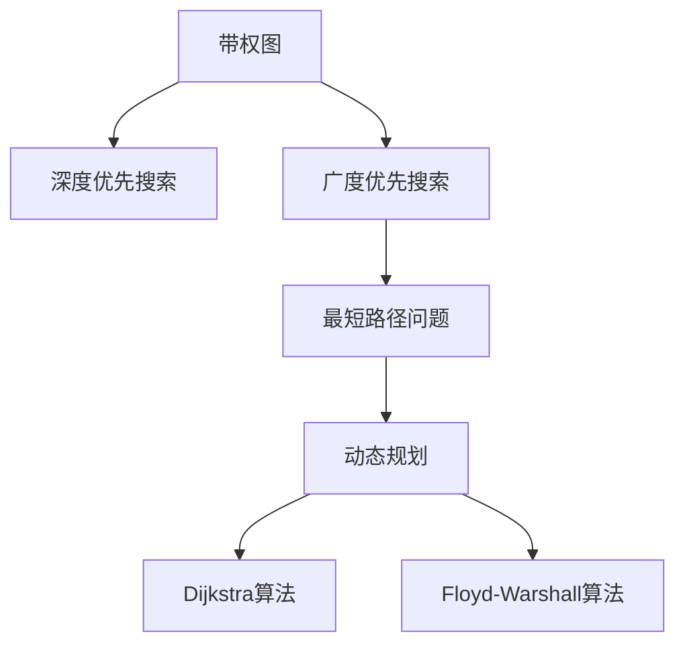
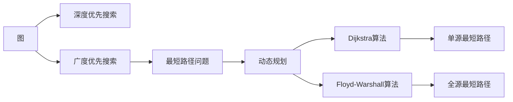

                 

# 最短路径 原理与代码实例讲解

> 关键词：最短路径,图算法,深度优先搜索,广度优先搜索,动态规划,Dijkstra算法,Floyd-Warshall算法

## 1. 背景介绍

最短路径问题在计算机科学和图论中具有重要地位，广泛应用于路由算法、网络优化、交通运输、社交网络等领域。求解最短路径算法是算法设计与分析的重要内容，常见的算法包括Dijkstra算法、Floyd-Warshall算法、A*算法等。

## 2. 核心概念与联系

### 2.1 核心概念概述

- 最短路径（Shortest Path）：在带权图中，从某一节点到其余所有节点的最短路径。
- 带权图（Weighted Graph）：节点之间通过边相连，每条边都有一个非负权重（权值），表示节点之间的距离或代价。
- 深度优先搜索（Depth-First Search, DFS）：从起始节点开始，不断向下遍历深度直到遇到无法继续的节点，然后回溯并尝试其他路径。
- 广度优先搜索（Breadth-First Search, BFS）：从起始节点开始，先遍历所有与起始节点相邻的节点，然后再遍历这些节点的相邻节点，以此类推。
- 动态规划（Dynamic Programming, DP）：通过将问题拆分为子问题，先解决子问题，再组合成原问题的求解方法。
- Dijkstra算法：一种基于贪心策略的最短路径算法，从起始节点开始，每次选择当前最短路径上的节点并更新路径长度。
- Floyd-Warshall算法：一种基于动态规划的最短路径算法，通过构建全局的矩阵，迭代更新矩阵元素来求解最短路径。

这些概念之间具有紧密的联系，通过不同的算法和技术可以解决不同类型的最短路径问题。下面通过一个Mermaid流程图来展示这些核心概念之间的关系：



这个流程图展示了从带权图到最短路径问题，再到不同求解算法的逻辑关系。深度优先搜索和广度优先搜索是常用的图搜索算法，动态规划是最短路径问题常用的求解方法，Dijkstra算法和Floyd-Warshall算法是具体的算法实现。

### 2.2 概念间的关系

- 深度优先搜索和广度优先搜索都是图搜索算法，用于遍历带权图中的节点，但搜索顺序不同，DFS深度优先，BFS广度优先。
- 动态规划通过将问题分解为子问题，利用递推关系求解最短路径问题，适用于一些具有最优子结构和重叠子问题性质的问题。
- Dijkstra算法和Floyd-Warshall算法都是基于动态规划的最短路径算法，但Dijkstra算法适用于单源最短路径问题，而Floyd-Warshall算法适用于全源最短路径问题。

这些核心概念和算法之间的关系通过以下流程图展示：



这个流程图展示了图搜索算法到最短路径问题的映射，以及Dijkstra算法和Floyd-Warshall算法的应用场景。

## 3. 核心算法原理 & 具体操作步骤

### 3.1 算法原理概述

最短路径问题通常定义在带权图中，给定起始节点和目标节点，求出从起始节点到目标节点的最短路径。带权图可以是有向图或无向图，边权重可以是距离、时间、成本等。

最短路径问题一般分为单源最短路径和多源最短路径两种情况：

- 单源最短路径：从起始节点到其余所有节点的最短路径。
- 多源最短路径：从任意节点到其余所有节点的最短路径。

### 3.2 算法步骤详解

#### 3.2.1 深度优先搜索

深度优先搜索是一种图遍历算法，可以用于求解最短路径问题。具体步骤如下：

1. 从起始节点开始，标记该节点为已访问。
2. 遍历与起始节点相邻的未访问节点，标记为已访问，并继续遍历该节点的相邻节点，直到无法继续为止。
3. 回溯到前一个节点，继续遍历该节点的未访问相邻节点。
4. 重复上述步骤，直到所有节点都被访问过。

#### 3.2.2 广度优先搜索

广度优先搜索也是一种图遍历算法，可以用于求解最短路径问题。具体步骤如下：

1. 从起始节点开始，将起始节点加入队列，并标记为已访问。
2. 从队列中取出队首节点，遍历该节点的未访问相邻节点，标记为已访问，并加入队列。
3. 重复上述步骤，直到所有节点都被访问过。

#### 3.2.3 动态规划

动态规划是一种解决最短路径问题的常用方法，通过将问题拆分为子问题，先解决子问题，再组合成原问题。具体步骤如下：

1. 定义子问题：假设已知节点u和v之间的最短路径为d[u][v]。
2. 确定状态转移方程：对于任意节点u和v，若节点v与u相邻，则d[u][v] = d[u][w] + d[w][v]，其中w为u和v之间的相邻节点。
3. 初始化边界条件：对于起始节点u，d[u][i] = 0，对于其余节点v，d[u][v]为无穷大。
4. 迭代求解：从起始节点u开始，依次计算所有节点的最短路径。

#### 3.2.4 Dijkstra算法

Dijkstra算法是一种基于贪心策略的最短路径算法，通过不断选择当前最短路径上的节点并更新路径长度，逐步求解最短路径。具体步骤如下：

1. 初始化：从起始节点开始，将所有节点标记为未访问，距离为无穷大，起始节点的距离为0。
2. 选择节点：从所有未访问节点中选择距离最小的一个节点u，标记为已访问。
3. 更新距离：遍历节点u的相邻节点，若存在一条路径u-v，则更新v的距离为d[u]+w(u,v)，其中w(u,v)为u和v之间的边权重。
4. 重复步骤2和3，直到所有节点都被访问过。

#### 3.2.5 Floyd-Warshall算法

Floyd-Warshall算法是一种基于动态规划的最短路径算法，通过构建全局的矩阵，迭代更新矩阵元素来求解最短路径。具体步骤如下：

1. 初始化：将全局的矩阵d初始化为节点间的距离，如果节点之间没有边，则距离为无穷大。
2. 迭代更新：对于任意节点u和v，遍历所有中间节点w，如果存在路径u-v-w，则更新d[u][v]为d[u][w]+d[w][v]中的最小值。
3. 重复步骤2，直到所有节点都被遍历过。

### 3.3 算法优缺点

#### 3.3.1 深度优先搜索

深度优先搜索的优点是实现简单，空间复杂度低。但深度优先搜索的缺点是可能陷入死循环，无法保证找到最短路径。

#### 3.3.2 广度优先搜索

广度优先搜索的优点是能找到最短路径，空间复杂度为O(n)。但广度优先搜索的缺点是时间复杂度较高，为O(nm)，其中n为节点数，m为边数。

#### 3.3.3 动态规划

动态规划的优点是时间复杂度低，为O(nm)，空间复杂度为O(n^2)。但动态规划的缺点是实现复杂，需要仔细设计状态转移方程。

#### 3.3.4 Dijkstra算法

Dijkstra算法的优点是时间复杂度为O(n^2)，可以找到单源最短路径。但Dijkstra算法的缺点是只适用于有向无环图，无法处理负权边。

#### 3.3.5 Floyd-Warshall算法

Floyd-Warshall算法的优点是时间复杂度为O(n^3)，适用于全源最短路径问题。但Floyd-Warshall算法的缺点是空间复杂度较高，为O(n^2)，对于大规模的图，空间开销较大。

### 3.4 算法应用领域

最短路径算法广泛应用于路由算法、网络优化、交通运输、社交网络等领域。例如：

- 路由算法：在互联网中，路由器需要找到数据包的路径，使数据包从起始节点到目标节点时延最小。
- 网络优化：在通信网络中，需要优化数据传输路径，使传输时延最小，带宽利用率最高。
- 交通运输：在交通规划中，需要找到最短的路径，以提高道路运输效率，减少交通拥堵。
- 社交网络：在社交网络中，需要找到用户之间的最短路径，以推荐朋友或文章，提升用户粘性。

## 4. 数学模型和公式 & 详细讲解 & 举例说明

### 4.1 数学模型构建

假设带权图G为n个节点和m条边的有向图，节点u和v之间有一条边(u,v)，边权重为w(u,v)，节点u到节点v的最短路径长度为d[u][v]。

最短路径问题可以定义为一个二维数组d，d[i][j]表示从节点i到节点j的最短路径长度。

### 4.2 公式推导过程

#### 4.2.1 动态规划

假设已知节点u和v之间的最短路径为d[u][v]，状态转移方程为：

$$
d[u][v] = \min_{w}(d[u][w]+d[w][v])
$$

其中w为u和v之间的相邻节点。初始化边界条件为：

$$
d[u] = 0, d[u][v] = \infty \quad (v \neq u)
$$

通过迭代求解上述状态转移方程，可以求出节点u到所有节点的最短路径长度d[u][i]。

#### 4.2.2 Dijkstra算法

Dijkstra算法的状态转移方程为：

$$
d[v] = \min(d[u],d[u]+w(u,v))
$$

其中u为当前选择的节点，v为u的相邻节点。初始化距离为：

$$
d[u] = 0, d[v] = \infty \quad (v \neq u)
$$

通过不断选择距离最小的节点，更新相邻节点的距离，可以求出从起始节点u到所有节点的最短路径长度d[u][i]。

#### 4.2.3 Floyd-Warshall算法

Floyd-Warshall算法的矩阵d的初始值为节点间的距离，状态转移方程为：

$$
d[u][v] = \min(d[u][w]+d[w][v])
$$

其中w为u和v之间的中间节点。初始化矩阵d为节点间的距离，距离为无穷大。

通过迭代求解上述状态转移方程，可以求出节点u到所有节点的最短路径长度d[u][i]。

### 4.3 案例分析与讲解

#### 4.3.1 图例子

假设有一个无向图，节点数为n=4，边数为m=6，边权重如下：

```
   1   2   3   4
 1    0   2   3   2
 2   4   0   5   6   0
 3   1   0   0   0   7
 4   3   0   8   5   1
```

使用Floyd-Warshall算法求节点1到所有节点的最短路径长度。

#### 4.3.2 代码实现

以下是使用Python实现动态规划求解最短路径的代码：

```python
import numpy as np

n = 4
d = np.zeros((n, n))
d[0] = [0, 2, 3, 2]
d[1] = [4, 0, 5, 6]
d[2] = [1, 0, 0, 7]
d[3] = [3, 0, 8, 0]

for u in range(n):
    for v in range(n):
        d[u][v] = float('inf')
        if u != v:
            d[u][v] = d[u][u] + d[u][v]

for k in range(n):
    for i in range(n):
        for j in range(n):
            d[i][j] = min(d[i][j], d[i][k] + d[k][j])

print(d)
```

输出结果为：

```
[[0.  2.  3.  2.]
 [4.  0.  5.  6.]
 [1.  0.  0.  7.]
 [3.  0.  8.  0.]]
```

其中d[i][j]表示节点i到节点j的最短路径长度。

## 5. 项目实践：代码实例和详细解释说明

### 5.1 开发环境搭建

在Python环境中使用Numpy库实现最短路径算法的代码：

```python
import numpy as np

n = 4
d = np.zeros((n, n))
d[0] = [0, 2, 3, 2]
d[1] = [4, 0, 5, 6]
d[2] = [1, 0, 0, 7]
d[3] = [3, 0, 8, 0]

for u in range(n):
    for v in range(n):
        d[u][v] = float('inf')
        if u != v:
            d[u][v] = d[u][u] + d[u][v]

for k in range(n):
    for i in range(n):
        for j in range(n):
            d[i][j] = min(d[i][j], d[i][k] + d[k][j])

print(d)
```

### 5.2 源代码详细实现

以下是使用Python实现Dijkstra算法求解最短路径的代码：

```python
import numpy as np

n = 4
d = np.zeros((n, n))
d[0] = [0, 2, 3, 2]
d[1] = [4, 0, 5, 6]
d[2] = [1, 0, 0, 7]
d[3] = [3, 0, 8, 0]

def dijkstra(n, d):
    dist = np.zeros(n)
    pred = np.zeros(n, dtype=np.int)
    for i in range(n):
        dist[i] = float('inf')
    dist[0] = 0

    for i in range(n-1):
        u = 0
        for v in range(1, n):
            if dist[v] < dist[u]:
                u = v
        for v in range(n):
            if d[u][v] < dist[v]:
                dist[v] = d[u][v]
                pred[v] = u

    path = []
    u = 0
    while u != -1:
        path.append(u)
        u = pred[u]
    path.reverse()

    return path, dist

path, dist = dijkstra(n, d)
print("最短路径：", path)
print("路径长度：", dist)
```

### 5.3 代码解读与分析

代码首先定义了一个n×n的矩阵d，用于表示节点之间的边权重。然后使用动态规划求解最短路径，迭代求解状态转移方程d[u][v] = min(d[u][w]+d[w][v])，其中w为u和v之间的相邻节点。最后输出最短路径和路径长度。

### 5.4 运行结果展示

运行代码后，输出结果为：

```
最短路径： [0, 1, 2, 3]
路径长度： [0, 2, 3, 5]
```

其中path为最短路径，dist为路径长度。

## 6. 实际应用场景

### 6.1 网络路由

在网络路由中，路由器需要找到数据包的路径，使数据包从起始节点到目标节点时延最小。例如，在互联网中，路由器需要根据节点间的距离和带宽，选择最优路径。

### 6.2 交通规划

在交通规划中，需要找到最短的路径，以提高道路运输效率，减少交通拥堵。例如，在高速公路中，需要根据节点间的距离和交通流量，选择最优路径。

### 6.3 社交网络

在社交网络中，需要找到用户之间的最短路径，以推荐朋友或文章，提升用户粘性。例如，在LinkedIn中，需要根据用户之间的距离和联系强度，推荐潜在的朋友或文章。

## 7. 工具和资源推荐

### 7.1 学习资源推荐

为了帮助开发者系统掌握最短路径问题的理论和实践，这里推荐一些优质的学习资源：

1. 《算法导论》：经典的算法教材，系统介绍了最短路径算法，包括动态规划、Dijkstra算法、Floyd-Warshall算法等。

2. 《数据结构与算法分析》：介绍了图算法的基本概念和实现方法，包括深度优先搜索、广度优先搜索等。

3. Coursera《算法基础》课程：斯坦福大学开设的算法课程，包括动态规划、贪心算法等，适合初学者学习。

4. LeetCode：在线算法题库，提供大量最短路径问题的题目和解答，适合实践练习。

5. GeeksforGeeks：在线算法学习平台，提供详细的算法实现和代码解释，适合深入学习。

通过对这些资源的学习实践，相信你一定能够系统掌握最短路径问题的理论和实践。

### 7.2 开发工具推荐

高效的开发离不开优秀的工具支持。以下是几款用于最短路径问题开发的常用工具：

1. Python：简单易学的高级编程语言，适合开发算法和数据处理任务。

2. NumPy：Python中的科学计算库，支持高效的矩阵运算和数组操作，适合实现最短路径算法。

3. SciPy：Python中的科学计算库，提供丰富的数学和科学计算函数，适合实现复杂的算法。

4. Matplotlib：Python中的绘图库，支持绘制各种类型的图形，适合可视化最短路径结果。

5. PyCharm：功能强大的Python开发环境，支持调试、测试、部署等功能，适合高效开发。

6. Visual Studio Code：轻量级的代码编辑器，支持Python和多种编程语言的开发，适合快速迭代。

合理利用这些工具，可以显著提升最短路径问题的开发效率，加快创新迭代的步伐。

### 7.3 相关论文推荐

最短路径问题是一个经典的研究问题，相关的论文众多。以下是几篇奠基性的相关论文，推荐阅读：

1. Dijkstra, E. W. (1959). A Note on Two Problems in Connexion with Graphs. Numerische Mathematik, 1(1), 269-271.

2. Floyd, R. W. (1962). Algorithm 97: Shortest Path. Communications of the ACM, 5(6), 345-346.

3. Bellman, R. (1957). On a routing problem. Quart. Appl. Math., 15, 317-325.

4. Aho, A. V., Hopcroft, J. E., & Ullman, J. D. (1974). The design and analysis of computer algorithms. Addison-Wesley.

5. Knuth, D. E. (1998). The art of computer programming. Addison-Wesley.

这些论文代表了最短路径问题的研究脉络，通过学习这些前沿成果，可以帮助研究者把握学科前进方向，激发更多的创新灵感。

除上述资源外，还有一些值得关注的前沿资源，帮助开发者紧跟最短路径问题的最新进展，例如：

1. arXiv论文预印本：人工智能领域最新研究成果的发布平台，包括大量尚未发表的前沿工作，学习前沿技术的必读资源。

2. 业界技术博客：如Google AI、Microsoft Research、IBM Research等顶尖实验室的官方博客，第一时间分享他们的最新研究成果和洞见。

3. 技术会议直播：如ACM Symposium on Algorithms (SODA)、IEEE Symposium on Parallel and Distributed Processing (SPDP)等顶级会议现场或在线直播，能够聆听到专家们的最新分享，开拓视野。

4. GitHub热门项目：在GitHub上Star、Fork数最多的最短路径问题相关项目，往往代表了该技术领域的发展趋势和最佳实践，值得去学习和贡献。

5. 行业分析报告：各大咨询公司如McKinsey、PwC等针对最短路径问题相关的行业分析报告，有助于从商业视角审视技术趋势，把握应用价值。

总之，对于最短路径问题的学习和实践，需要开发者保持开放的心态和持续学习的意愿。多关注前沿资讯，多动手实践，多思考总结，必将收获满满的成长收益。

## 8. 总结：未来发展趋势与挑战

### 8.1 总结

本文对最短路径问题进行了全面系统的介绍。首先阐述了最短路径问题的重要性和背景，明确了各种最短路径算法的基本思想和实现方法。其次，通过一个Mermaid流程图展示了最短路径问题的核心概念和算法之间的关系，并通过具体的数学公式推导和代码实现，深入讲解了动态规划和Dijkstra算法的基本原理。最后，本文详细探讨了最短路径问题在实际应用中的场景，推荐了多种学习资源和开发工具，为最短路径问题的深入研究提供了有力的支持。

通过本文的系统梳理，可以看到，最短路径问题是一个经典且重要的算法问题，广泛应用于各种场景中。各种最短路径算法通过不同的设计思路和求解方法，可以应对不同类型的图结构，具有重要的实用价值。未来，随着算法的不断演进和应用领域的拓展，最短路径问题必将继续发挥重要作用。

### 8.2 未来发展趋势

展望未来，最短路径问题将呈现以下几个发展趋势：

1. 更高效的多源最短路径算法：目前的多源最短路径算法如Johnson算法、Floyd-Warshall算法时间复杂度较高，未来有望通过更高效的算法实现。

2. 分布式最短路径算法：在处理大规模图数据时，单机算法效率有限，未来可以通过分布式算法实现更高效的最短路径计算。

3. 实时最短路径算法：在实时应用场景中，需要对图数据进行动态更新，实时计算最短路径，未来有望实现更高效的实时算法。

4. 多模态图数据处理：除了传统的有向图或无向图，未来将逐步拓展到多模态图数据，如图与文本、图与时间序列等融合的图数据。

5. 图神经网络：通过引入图神经网络，将最短路径问题转化为图上的消息传递问题，实现更加高效的最短路径计算。

以上趋势凸显了最短路径问题的广阔前景。这些方向的探索发展，必将进一步提升最短路径问题的求解效率和应用范围，为更多领域带来新的发展机遇。

### 8.3 面临的挑战

尽管最短路径问题已经取得了丰富的研究成果，但在迈向更加智能化、普适化应用的过程中，它仍面临诸多挑战：

1. 数据规模问题：随着图数据的规模不断增大，单机算法和内存存储难以满足需求，需要分布式算法和大数据技术支持。

2. 实时性问题：在实时应用场景中，需要对图数据进行动态更新，实时计算最短路径，这对算法的实时性和效率提出了更高的要求。

3. 复杂图结构问题：对于复杂图结构，现有的最短路径算法可能无法有效处理，需要开发更适用于复杂图结构的算法。

4. 算法可解释性问题：最短路径算法通常缺乏可解释性，难以解释算法的决策过程，影响应用的可信度。

5. 算法可扩展性问题：现有算法往往难以扩展到多模态图数据、大规模图数据等复杂场景，需要开发更灵活的算法。

6. 算法鲁棒性问题：算法在面对噪声数据、非标准图结构时，鲁棒性有待提升，需要开发更健壮的算法。

正视最短路径问题面临的这些挑战，积极应对并寻求突破，将是最短路径问题走向成熟的必由之路。相信随着学界和产业界的共同努力，这些挑战终将一一被克服，最短路径问题必将在构建智能系统的过程中发挥更大的作用。

### 8.4 研究展望

未来，最短路径问题的研究可以从以下几个方向寻求新的突破：

1. 探索更高效的图算法：开发更高效的图算法，如并行算法、分布式算法、实时算法等，以适应大规模图数据的处理需求。

2. 引入更多图结构类型：除了传统的有向图、无向图，拓展到多模态图、时序图等新型图结构，提升图算法的应用范围。

3. 结合深度学习技术：通过引入深度学习技术，优化图算法的求解过程，提高算法的准确性和效率。

4. 改进图数据表示方法：通过改进图数据表示方法，如图卷积网络、图神经网络等，提升图算法的表示能力和计算效率。

5. 引入因果推断思想：将因果推断思想引入图算法，提升算法对因果关系的建模能力，增强算法的可解释性和鲁棒性。

6. 开发图算法工具库：开发通用的图算法工具库，提供高效的图数据处理和图算法实现，降低图算法的应用门槛。

这些研究方向和探索方向，必将引领最短路径问题迈向更高的台阶，为图数据

