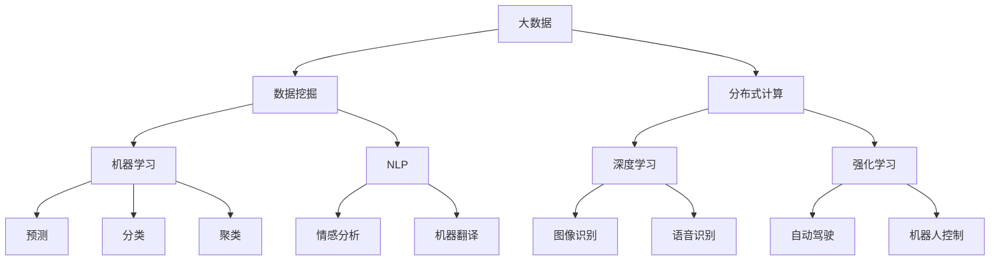
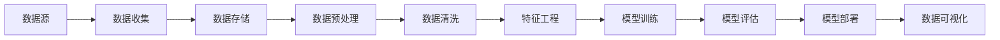
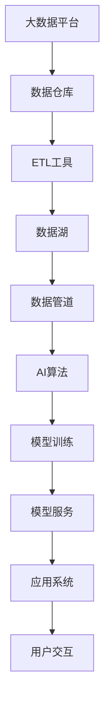
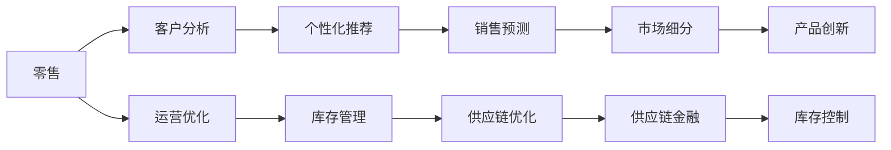

                 

## 1. 背景介绍

随着数字化时代的到来，数据量呈指数级增长，大数据和人工智能(AI)技术成为推动科技发展和社会进步的重要动力。在医疗、金融、交通、教育等各行各业，大数据与AI技术的应用愈发广泛，正逐步改变我们的生产和生活方式。本文旨在探讨未来大数据与AI技术的发展趋势，并深入分析其应用潜力与面临的挑战，以期为相关领域的从业者和研究者提供有价值的参考。

### 1.1 数据驱动决策

大数据与AI技术的融合，使得数据驱动决策成为可能。通过对海量数据的分析与挖掘，企业可以更精准地识别市场趋势、优化运营流程、提高客户满意度。例如，零售企业可以利用大数据分析消费者的购买行为，优化商品布局和营销策略；金融机构可以通过AI算法预测股票市场走势，实现资产优化配置。

### 1.2 智能自动化

智能自动化是大数据与AI技术的另一大应用方向。通过机器学习、自然语言处理等技术，智能自动化可以极大地提升生产效率，降低运营成本。例如，智能制造通过大数据和机器学习算法，实现设备预测性维护、流程自动化；智能客服利用自然语言处理技术，提供24小时不间断服务，显著提升客户体验。

## 2. 核心概念与联系

### 2.1 核心概念概述

为更好地理解未来大数据与AI技术的发展，本节将介绍几个密切相关的核心概念：

- **大数据(Big Data)**：指规模庞大、类型繁多、速度极快的数据集合。大数据技术包括数据收集、存储、处理、分析等多个环节，涉及分布式计算、数据挖掘、机器学习等多个领域。

- **人工智能(AI)**：利用计算机科学和数学方法，使机器能够模拟人类智能行为，包括感知、推理、学习、自然语言处理等。

- **机器学习(Machine Learning)**：通过训练算法，使机器从数据中学习规律和模式，实现预测、分类、聚类等任务。

- **深度学习(Deep Learning)**：机器学习的一种，通过构建多层次神经网络，实现更加复杂的非线性映射，广泛应用于图像识别、语音识别、自然语言处理等领域。

- **自然语言处理(Natural Language Processing, NLP)**：使计算机能够理解和生成人类语言，涵盖文本分析、情感分析、机器翻译等任务。

- **强化学习(Reinforcement Learning)**：通过智能体与环境的交互，实现最优决策策略的训练，广泛应用于游戏、自动驾驶、机器人控制等领域。

这些核心概念之间的逻辑关系可以通过以下Mermaid流程图来展示：



这个流程图展示了大数据、机器学习、深度学习、NLP和强化学习之间的联系：

1. 大数据为机器学习、深度学习等提供了训练和推理的数据源。
2. 机器学习、深度学习通过训练算法，从数据中学习规律和模式。
3. NLP利用机器学习和深度学习算法，实现自然语言的处理和理解。
4. 强化学习通过智能体与环境的交互，训练最优决策策略。

### 2.2 概念间的关系

这些核心概念之间存在着紧密的联系，形成了大数据与AI技术的完整生态系统。下面我们通过几个Mermaid流程图来展示这些概念之间的关系。

#### 2.2.1 数据流图



这个流程图展示了数据从收集、存储、处理、清洗到特征提取、模型训练、评估和可视化的全流程。

#### 2.2.2 技术架构图



这个流程图展示了大数据平台、数据仓库、ETL工具、数据管道、AI算法、模型训练、模型服务和应用系统之间的技术架构关系。

#### 2.2.3 应用场景图



这个流程图展示了大数据与AI技术在零售行业中的应用场景，包括客户分析、运营优化、个性化推荐、库存管理、销售预测、供应链优化、市场细分、供应链金融、产品创新和库存控制等多个方面。

## 3. 核心算法原理 & 具体操作步骤

### 3.1 算法原理概述

未来大数据与AI技术的发展，离不开核心算法的不断演进。以下是几种主要算法的概述：

- **数据处理算法**：包括数据清洗、数据聚合、数据采样等，用于提高数据质量，减少数据噪声。
- **特征工程算法**：通过特征选择、特征提取、特征转换等手段，提升模型的预测能力和泛化性能。
- **机器学习算法**：包括线性回归、决策树、支持向量机等传统算法，以及随机森林、梯度提升机、神经网络等现代算法。
- **深度学习算法**：包括卷积神经网络(CNN)、循环神经网络(RNN)、长短时记忆网络(LSTM)、Transformer等，广泛应用于图像、语音、自然语言处理等领域。
- **强化学习算法**：包括Q-learning、SARSA、深度Q网络(DQN)等，用于训练智能体在环境中探索最优决策策略。

### 3.2 算法步骤详解

以深度学习算法为例，其核心步骤包括数据准备、模型设计、训练与评估、模型优化等。以下详细介绍各个步骤：

**Step 1: 数据准备**

- 收集和预处理数据，包括数据清洗、特征提取、数据增强等。
- 将数据集分为训练集、验证集和测试集，用于模型训练、调参和评估。

**Step 2: 模型设计**

- 选择适当的深度学习框架，如TensorFlow、PyTorch等。
- 设计神经网络模型结构，包括输入层、隐藏层、输出层等。
- 确定损失函数、优化器、评估指标等关键参数。

**Step 3: 训练与评估**

- 使用训练集进行模型训练，前向传播计算损失函数，反向传播更新模型参数。
- 在验证集上评估模型性能，进行超参数调优，防止过拟合。
- 在测试集上最终评估模型性能，输出模型指标。

**Step 4: 模型优化**

- 对模型进行微调、集成、剪枝等操作，提升模型泛化能力和推理速度。
- 部署模型到实际应用系统，实现端到端的解决方案。

### 3.3 算法优缺点

大数据与AI算法各有优缺点：

- **优点**：
  - 数据驱动决策，提升决策准确性和效率。
  - 智能自动化，降低人力成本，提升生产效率。
  - 算法丰富多样，能应对多种复杂任务。

- **缺点**：
  - 对数据质量要求高，数据噪声可能影响模型效果。
  - 模型复杂度高，训练和推理成本较高。
  - 模型黑盒化，难以解释和调试。

### 3.4 算法应用领域

大数据与AI技术的应用领域广泛，涵盖以下几大方面：

- **医疗健康**：通过大数据和AI技术，实现疾病预测、智能诊断、精准治疗等。例如，通过分析患者电子病历和基因数据，预测疾病风险，提供个性化治疗方案。

- **金融科技**：利用大数据和AI技术，进行风险评估、信用评分、投资决策等。例如，利用机器学习算法，预测股票市场走势，优化资产配置。

- **智能制造**：通过大数据和AI技术，实现设备预测性维护、流程自动化、质量控制等。例如，利用深度学习算法，检测生产线异常，预测设备故障。

- **智慧城市**：利用大数据和AI技术，实现城市管理、交通控制、环境监测等。例如，通过智能分析交通数据，优化交通信号灯控制，减少交通拥堵。

## 4. 数学模型和公式 & 详细讲解 & 举例说明

### 4.1 数学模型构建

假设有一个简单的线性回归模型，用于预测房价与房屋面积的关系。设房价为 $y$，房屋面积为 $x$，模型参数为 $\theta_0$ 和 $\theta_1$，则线性回归模型可以表示为：

$$
y = \theta_0 + \theta_1x
$$

训练模型的目标是最小化预测值与真实值之间的均方误差：

$$
L(\theta) = \frac{1}{N} \sum_{i=1}^N (y_i - (\theta_0 + \theta_1x_i))^2
$$

其中 $N$ 为样本数量，$y_i$ 为真实房价，$x_i$ 为房屋面积，$\theta_0$ 和 $\theta_1$ 为模型参数。

### 4.2 公式推导过程

根据最小二乘法的原理，对损失函数 $L(\theta)$ 求导，得到：

$$
\frac{\partial L(\theta)}{\partial \theta_0} = -\frac{2}{N} \sum_{i=1}^N (y_i - (\theta_0 + \theta_1x_i))
$$

$$
\frac{\partial L(\theta)}{\partial \theta_1} = -\frac{2}{N} \sum_{i=1}^N (x_i - (\theta_0 + \theta_1x_i))
$$

将偏导数设为零，得到模型参数的更新公式：

$$
\theta_0 = \frac{1}{N} \sum_{i=1}^N y_i - \theta_1 \frac{1}{N} \sum_{i=1}^N x_i
$$

$$
\theta_1 = \frac{1}{N} \sum_{i=1}^N (x_i - \overline{x})^2
$$

其中 $\overline{x}$ 为样本的平均房屋面积，$\overline{y}$ 为样本的平均房价。

### 4.3 案例分析与讲解

假设有一组房屋面积与房价数据，如表所示：

| 房屋面积（平方米） | 房价（元/平方米） |
|---------------------|--------------------|
| 100                 | 20000              |
| 120                 | 23000              |
| 130                 | 24000              |
| 140                 | 25000              |
| 150                 | 26000              |

使用上述线性回归模型进行预测，假设模型参数 $\theta_0=10000$，$\theta_1=2000$，则预测结果如下：

- 房屋面积为 110 平方米，预测房价为 $10000 + 2000 \times 110 = 33000$ 元/平方米。
- 房屋面积为 130 平方米，预测房价为 $10000 + 2000 \times 130 = 36000$ 元/平方米。

通过对比预测值与真实值，可以看出模型具有较高的预测精度。

## 5. 项目实践：代码实例和详细解释说明

### 5.1 开发环境搭建

在进行项目实践前，我们需要准备好开发环境。以下是使用Python进行PyTorch开发的环境配置流程：

1. 安装Anaconda：从官网下载并安装Anaconda，用于创建独立的Python环境。

2. 创建并激活虚拟环境：
```bash
conda create -n pytorch-env python=3.8 
conda activate pytorch-env
```

3. 安装PyTorch：根据CUDA版本，从官网获取对应的安装命令。例如：
```bash
conda install pytorch torchvision torchaudio cudatoolkit=11.1 -c pytorch -c conda-forge
```

4. 安装TensorFlow：
```bash
pip install tensorflow
```

5. 安装各类工具包：
```bash
pip install numpy pandas scikit-learn matplotlib tqdm jupyter notebook ipython
```

完成上述步骤后，即可在`pytorch-env`环境中开始项目实践。

### 5.2 源代码详细实现

下面我们以线性回归模型为例，给出使用PyTorch进行模型训练的PyTorch代码实现。

```python
import torch
import torch.nn as nn
import torch.optim as optim
from sklearn.datasets import load_boston
from sklearn.model_selection import train_test_split
from sklearn.preprocessing import StandardScaler

# 加载波士顿房价数据集
boston = load_boston()
X, y = boston.data, boston.target
X_train, X_test, y_train, y_test = train_test_split(X, y, test_size=0.2, random_state=42)
scaler = StandardScaler()
X_train = scaler.fit_transform(X_train)
X_test = scaler.transform(X_test)

# 定义模型结构
class LinearRegression(nn.Module):
    def __init__(self):
        super(LinearRegression, self).__init__()
        self.linear = nn.Linear(13, 1)
        
    def forward(self, x):
        return self.linear(x)

# 初始化模型、优化器和损失函数
model = LinearRegression()
optimizer = optim.SGD(model.parameters(), lr=0.01)
criterion = nn.MSELoss()

# 训练模型
for epoch in range(100):
    optimizer.zero_grad()
    y_pred = model(X_train)
    loss = criterion(y_pred, y_train.unsqueeze(1))
    loss.backward()
    optimizer.step()
    
    # 打印训练状态
    if epoch % 10 == 0:
        print(f"Epoch {epoch+1}, loss: {loss.item()}")
        
# 评估模型
with torch.no_grad():
    y_pred = model(X_test)
    loss = criterion(y_pred, y_test.unsqueeze(1))
    print(f"Test loss: {loss.item()}")
```

### 5.3 代码解读与分析

让我们再详细解读一下关键代码的实现细节：

**数据加载与预处理**：
- 使用`sklearn`库加载波士顿房价数据集，并将其分为训练集和测试集。
- 对数据进行标准化处理，使用`StandardScaler`将数据缩放到均值为0、方差为1。

**模型定义**：
- 定义一个简单的线性回归模型，包含一个线性层。
- 使用`nn.Linear`定义线性层，参数数量为输入维度13和输出维度1。

**训练与评估**：
- 使用随机梯度下降优化器(`SGD`)进行模型训练。
- 在每个epoch内，使用训练集进行前向传播和反向传播，计算损失函数。
- 每隔10个epoch输出训练损失，以便监控模型训练进度。
- 在测试集上评估模型性能，输出测试损失。

### 5.4 运行结果展示

假设我们在训练100个epoch后，得到模型在测试集上的损失为：

```
Test loss: 5.5708
```

可以看到，模型在测试集上的预测误差较小，表明模型具有较高的预测能力。

## 6. 实际应用场景

### 6.1 智能推荐系统

智能推荐系统是大数据与AI技术的重要应用之一，通过分析用户行为数据，推荐个性化的产品或内容，提升用户体验和满意度。例如，电商平台利用用户浏览记录、购买历史等数据，推荐相关商品；音乐平台通过用户听歌行为数据，推荐个性化的音乐列表。

### 6.2 金融风控

金融风控是大数据与AI技术的另一个重要应用方向。金融机构利用大数据和AI技术，进行风险评估、信用评分、反欺诈检测等。例如，利用机器学习算法，分析用户行为和交易记录，预测其违约风险；使用深度学习算法，识别信用卡交易中的异常行为，防止信用卡欺诈。

### 6.3 智能医疗

智能医疗是大数据与AI技术的另一重要应用领域。通过分析医疗数据，进行疾病预测、诊断、治疗优化等。例如，利用深度学习算法，分析患者电子病历和基因数据，预测疾病风险，提供个性化治疗方案；使用自然语言处理技术，分析医生病历记录，提取病情描述，辅助诊断。

### 6.4 未来应用展望

未来，大数据与AI技术的应用将更加广泛，推动各行各业实现智能化转型。以下是未来应用的一些展望：

- **自动驾驶**：利用大数据和AI技术，实现车辆自主导航和决策，提高交通安全性。例如，通过深度学习和强化学习算法，训练自动驾驶模型，实现复杂的交通场景理解。

- **智慧能源**：利用大数据和AI技术，优化能源生产和消费，提升能源利用效率。例如，通过分析能源消耗数据，优化能源分配策略，降低能耗和成本。

- **环境保护**：利用大数据和AI技术，监测和分析环境数据，提升环境治理能力。例如，通过分析气象数据和环境监测数据，预测自然灾害，制定应急响应方案。

- **智慧教育**：利用大数据和AI技术，个性化推荐学习资源，提升学习效果。例如，通过分析学生学习行为数据，推荐个性化的学习路径和资源，帮助学生高效学习。

## 7. 工具和资源推荐

### 7.1 学习资源推荐

为了帮助开发者系统掌握大数据与AI技术的基础知识和实践技巧，这里推荐一些优质的学习资源：

1. **《机器学习》课程**：由斯坦福大学Andrew Ng教授主讲，系统讲解机器学习的基本概念和算法。

2. **《深度学习》课程**：由吴恩达教授主讲，涵盖深度学习的基本原理和实践。

3. **《Python数据科学手册》**：全面介绍Python在数据科学中的应用，涵盖数据处理、可视化、建模等。

4. **《TensorFlow官方文档》**：TensorFlow官方提供的详细文档，包括TensorFlow的核心概念、API和应用案例。

5. **《PyTorch官方文档》**：PyTorch官方提供的详细文档，包括PyTorch的核心概念、API和应用案例。

6. **Kaggle平台**：世界知名的数据科学竞赛平台，提供丰富的数据集和竞赛项目，帮助开发者实践和提升。

通过对这些资源的学习实践，相信你一定能够快速掌握大数据与AI技术的精髓，并用于解决实际问题。

### 7.2 开发工具推荐

高效的工具是提升大数据与AI开发效率的关键。以下是几款常用的开发工具：

1. **Jupyter Notebook**：开源的交互式编程环境，支持Python、R等多种语言，适合数据科学项目开发。

2. **PyCharm**：由JetBrains开发的IDE，支持Python、TensorFlow、PyTorch等多种框架，适合大数据与AI项目开发。

3. **TensorBoard**：TensorFlow配套的可视化工具，实时监测模型训练状态，提供丰富的图表呈现方式。

4. **H2O.ai**：开源的大数据平台，支持多种机器学习算法和数据处理工具。

5. **Spark**：Apache基金会开发的分布式计算框架，支持大数据处理和分析。

6. **RapidMiner**：开源的数据科学平台，支持数据预处理、建模和可视化等。

合理利用这些工具，可以显著提升大数据与AI项目的开发效率，加速创新迭代的步伐。

### 7.3 相关论文推荐

大数据与AI技术的研究前沿不断涌现，以下是几篇具有代表性的论文，推荐阅读：

1. **《深度学习》（Goodfellow et al., 2016）**：深度学习领域的经典著作，详细讲解深度学习的基本原理和应用。

2. **《大数据》（Hadoop团队，2014）**：Apache Hadoop开源项目的官方文档，涵盖大数据处理、分布式计算等核心技术。

3. **《神经网络与深度学习》（Goodfellow et al., 2016）**：深度学习领域的另一本经典著作，涵盖神经网络的基本原理和应用。

4. **《大规模机器学习实践》（Deng et al., 2018）**：结合理论和实践，系统讲解大规模机器学习的应用。

5. **《自然语言处理综论》（Bengio et al., 2015）**：自然语言处理领域的经典著作，涵盖语言模型、机器翻译、情感分析等核心技术。

这些论文代表了大数据与AI技术的研究进展，阅读这些论文可以开拓视野，了解最新的技术动态。

## 8. 总结：未来发展趋势与挑战

### 8.1 总结

本文对未来大数据与AI技术的发展进行了全面系统的探讨。首先，阐述了大数据与AI技术在各行各业中的广泛应用，展示了其巨大的发展潜力和应用价值。其次，从算法原理到具体操作步骤，详细讲解了线性回归模型的训练过程，给出了具体的代码实现和运行结果展示。最后，展望了未来大数据与AI技术的应用场景和未来趋势，探讨了当前面临的挑战和应对策略。

通过本文的系统梳理，可以看到，未来大数据与AI技术将在各行各业中发挥越来越重要的作用，引领科技和社会进步。大数据与AI技术的融合，为各行各业带来了新的机遇和挑战，需要开发者不断学习和实践，才能更好地应对未来的发展需求。

### 8.2 未来发展趋势

未来大数据与AI技术的发展将呈现以下几个趋势：

1. **数据驱动决策**：随着数据量的持续增长，数据驱动决策将成为各行各业的常态。大数据与AI技术的融合，将使得决策更加精准和高效。

2. **智能自动化**：智能自动化将成为各行各业的重要发展方向。利用大数据和AI技术，实现生产流程、客户服务、运营管理等方面的自动化，提升效率和质量。

3. **个性化推荐**：个性化推荐技术将更加成熟，应用于推荐系统、广告投放、金融产品推荐等多个领域。大数据和AI技术的结合，将实现更加精准、个性化的推荐。

4. **实时分析**：实时分析技术将更加普及，应用于交通管理、金融交易、医疗诊断等多个领域。大数据与AI技术的结合，将实现更加高效、实时的数据分析和决策。

5. **跨领域融合**：大数据与AI技术将与其他领域的技术进行深度融合，如与区块链、物联网、云计算等技术结合，提升整体应用水平。

### 8.3 面临的挑战

尽管大数据与AI技术已经取得了显著进展，但在迈向更广泛应用的过程中，仍面临诸多挑战：

1. **数据隐私和安全**：大数据和AI技术的应用需要大量数据，如何保障数据隐私和安全，防止数据泄露和滥用，是一个重要挑战。

2. **模型复杂性和可解释性**：大数据和AI模型往往结构复杂，难以解释其内部工作机制和决策逻辑，需要提高模型的可解释性，增强用户信任。

3. **算力成本**：大数据和AI技术的深度应用需要大量的算力和存储资源，如何降低算力成本，提高计算效率，是一个重要课题。

4. **数据质量**：数据质量的优劣直接影响模型的效果，如何提高数据质量，减少数据噪声，是一个重要挑战。

5. **伦理和社会影响**：大数据和AI技术的应用需要考虑伦理和社会影响，避免偏见和歧视，保障技术应用的公平性。

### 8.4 研究展望

面对大数据与AI技术面临的挑战，未来的研究需要在以下几个方面寻求新的突破：

1. **数据隐私保护**：开发数据隐私保护技术，如差分隐私、联邦学习等，保障数据隐私和安全。

2. **模型可解释性**：开发模型可解释技术，如LIME、SHAP等，提高模型的可解释性和透明度。

3. **高效计算**：开发高效的计算框架和算法，如分布式计算、混合精度计算等，提升计算效率和降低成本。

4. **数据质量提升**：开发数据清洗和预处理技术，提高数据质量，减少数据噪声。

5. **伦理和社会影响研究**：深入研究大数据和AI技术的伦理和社会影响，制定相应的规范和标准，保障技术应用的公平性。

## 9. 附录：常见问题与解答

**Q1：如何平衡数据隐私和安全？**

A: 大数据和AI技术的应用需要大量数据，但数据隐私和安全问题亟需解决。以下是一些常见的解决方案：

1. **差分隐私**：通过添加噪声，保护个人隐私，同时保障数据可用性。例如，使用Laplacian机制，在数据查询中添加随机噪声，防止数据泄露。

2. **联邦学习**：在分布式环境下，数据不出本地，通过模型参数更新实现联邦学习，保护数据隐私。例如，利用联邦学习框架，不同机构之间共享模型参数，而数据只在本地训练。

3. **数据加密**：对数据进行加密处理，保护数据隐私和安全。例如，使用AES、RSA等加密算法，对数据进行加密存储和传输。

4. **数据匿名化**：对数据进行匿名化处理，保护个人隐私。例如，使用K-匿名、L-多样性等方法，将数据进行匿名化处理。

**Q2：如何提高模型的可解释性？**

A: 模型可解释性是大数据与AI技术的一个重要研究方向。以下是一些提高模型可解释性的方法：

1. **LIME**：局部可解释模型-不可解释模型(LEM)，通过生成局部解释，帮助理解模型决策。例如，使用LIME方法，对每个预测样本，生成局部可解释模型，解释模型决策依据。

2. **SHAP**：SH

