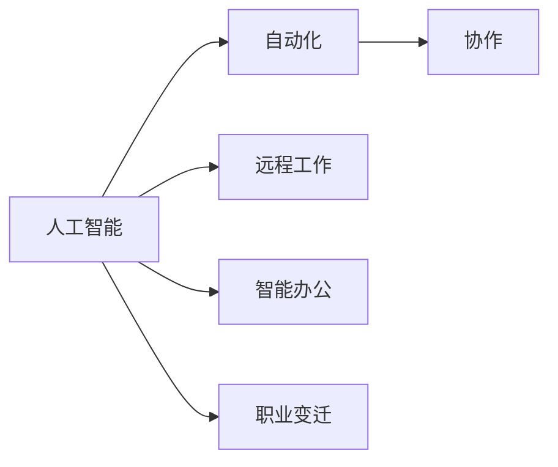

                 

# 未来工作形态与AI的共存

> 关键词：人工智能, 自动化, 协作, 远程工作, 智能办公, 创新

## 1. 背景介绍

### 1.1 问题由来

随着科技的迅猛发展，人工智能(AI)技术在各行各业的应用越来越广泛。尤其是2020年新冠疫情爆发以来，远程工作成为常态，AI技术在提升办公效率、优化工作流程等方面的作用愈加凸显。然而，AI的快速普及也引发了一系列关于未来工作形态的探讨与思考。如何更好地平衡人机关系，实现AI与人类工作协作的和谐共存，成为当下热议话题。

### 1.2 问题核心关键点

未来工作形态与AI的共存，本质上是对技术进步与人类劳动力关系的一次重新审视。以下是该问题的主要关键点：

- **技术演进：** AI技术的快速发展，尤其是机器学习、自然语言处理、计算机视觉等领域的突破，正在重塑工作流程与内容。
- **人机协作：** 如何实现AI与人类在决策、执行、监控等环节的有效协作，提升整体工作效率。
- **生产力提升：** 通过自动化、智能化技术，解放人类劳动力，将人类从繁琐重复的劳动中解放出来，专注于更有价值的工作。
- **职业变迁：** AI技术的应用可能导致某些职业的消失或变化，如何平滑过渡，实现职业再培训和转型。
- **伦理与社会影响：** AI技术的普及将带来伦理、隐私、安全性等社会问题的考量。

### 1.3 问题研究意义

探讨未来工作形态与AI的共存，对推动社会进步、提升劳动生产率、优化职业结构具有重要意义：

1. **推动社会进步：** AI技术的应用将提升整体社会生产力，促进经济增长，改善生活质量。
2. **提升劳动生产率：** 通过自动化技术，提高工作效率，缩短生产周期，提升企业竞争力。
3. **优化职业结构：** 引导劳动力向高价值、高技能岗位转移，实现职业结构的优化和升级。
4. **改善工作体验：** 利用AI技术优化工作流程，减轻劳动强度，改善工作环境。

## 2. 核心概念与联系

### 2.1 核心概念概述

为了更好地理解未来工作形态与AI的共存，本节将介绍几个关键核心概念：

- **人工智能：** 利用计算机科学和工程学的知识，使计算机系统具备感知、理解、学习和执行人类智能任务的能力。
- **自动化：** 利用机器和计算机系统，自动完成人类原本需要手工操作的任务，从而提高效率、降低成本。
- **协作：** AI与人类在任务执行、决策支持等方面的协作，实现优势互补。
- **远程工作：** 利用互联网技术，实现员工在家或远程地点开展工作。
- **智能办公：** 利用AI技术优化办公流程，实现自动化、智能化、个性化服务。
- **职业变迁：** 因AI技术的应用，一些传统职业被替代或变革，衍生出新的职业机会。

这些核心概念之间存在紧密联系，形成了一个互为支撑的框架。

### 2.2 概念间的关系

通过以下Mermaid流程图，我们可以更直观地理解这些概念之间的关系：



该流程图展示了人工智能技术如何通过自动化、协作、远程工作、智能办公和职业变迁等途径，影响未来工作形态的演进。

### 2.3 核心概念的整体架构

最后，我们用一个综合的流程图来展示这些核心概念在未来工作形态中的整体架构：


这个综合流程图展示了人工智能技术在自动化、协作、远程工作、智能办公和职业变迁中的应用路径，以及这些应用对未来工作形态的影响。

## 3. 核心算法原理 & 具体操作步骤
### 3.1 算法原理概述

未来工作形态与AI的共存，涉及多个核心算法的交互与融合。其核心算法原理可以总结如下：

- **自动化算法：** 基于机器学习、深度学习等技术，实现自动化任务的识别、执行和监控。
- **协作算法：** 利用自然语言处理、知识图谱等技术，实现人机之间的自然语言交互、决策支持等。
- **远程工作算法：** 通过互联网协议、数据安全传输等技术，确保远程办公的安全、高效、可靠。
- **智能办公算法：** 结合计算机视觉、语音识别等技术，实现办公自动化、智能化、个性化服务。
- **职业变迁算法：** 利用就业数据分析、职业预测等技术，辅助劳动力市场转型和职业再培训。

这些算法共同构成了未来工作形态与AI共存的完整生态系统。

### 3.2 算法步骤详解

以下将详细讲解未来工作形态与AI共存的各个核心算法步骤：

#### 3.2.1 自动化算法步骤

1. **数据收集与预处理：** 收集生产、服务等方面的数据，进行清洗和预处理。
2. **特征提取：** 使用机器学习算法，提取数据中的关键特征。
3. **模型训练：** 利用历史数据，训练自动化模型，实现任务识别和执行。
4. **任务执行：** 将模型部署到生产环境中，自动完成预设任务。
5. **性能评估与优化：** 定期评估模型性能，根据反馈进行优化。

#### 3.2.2 协作算法步骤

1. **自然语言处理：** 使用NLP技术，解析和理解用户输入的自然语言指令。
2. **知识图谱构建：** 基于图数据库构建知识图谱，存储和查询实体间的关系。
3. **决策支持：** 结合NLP和知识图谱，生成决策建议。
4. **交互界面设计：** 设计友好的交互界面，支持自然语言交互。
5. **用户体验优化：** 根据用户反馈，不断优化系统交互体验。

#### 3.2.3 远程工作算法步骤

1. **网络连接：** 确保远程办公的稳定网络连接。
2. **数据安全传输：** 使用加密传输协议，保障数据安全。
3. **协作工具：** 提供协同办公工具，支持团队协作。
4. **权限管理：** 根据角色和权限，控制远程访问和操作。
5. **系统监控：** 实时监控系统运行状态，保障远程工作的可靠。

#### 3.2.4 智能办公算法步骤

1. **办公自动化：** 利用OCR、RPA等技术，实现办公自动化。
2. **数据智能分析：** 使用机器学习算法，分析办公数据，提供智能分析报告。
3. **个性化服务：** 结合用户行为数据，提供个性化办公建议。
4. **系统集成：** 将智能办公系统集成到现有的办公环境中。
5. **用户体验优化：** 不断收集用户反馈，优化系统功能和服务。

#### 3.2.5 职业变迁算法步骤

1. **就业数据分析：** 收集和分析劳动力市场数据，识别就业趋势和变化。
2. **职业预测：** 基于就业数据分析，预测未来的职业需求和变化。
3. **职业培训：** 设计培训课程，帮助劳动力掌握新技能。
4. **职业转型支持：** 提供职业转型咨询和支持，帮助劳动力顺利转型。
5. **政策建议：** 向政府和企业提供职业转型相关的政策建议。

### 3.3 算法优缺点

未来工作形态与AI的共存涉及多种算法，每种算法都有其优缺点。

#### 自动化算法的优点：
- **高效性：** 自动化算法能够在短时间内完成大量重复性任务，提升效率。
- **可靠性：** 基于大数据和深度学习的算法，具有较高的准确性和稳定性。
- **降低成本：** 减少人力成本，提升企业竞争力。

#### 自动化算法的缺点：
- **泛化能力不足：** 模型可能无法处理超出训练数据范围的新场景。
- **数据依赖：** 需要大量高质量数据进行训练，数据质量直接影响算法效果。
- **黑箱问题：** 复杂的自动化算法往往难以解释，存在一定的不透明性。

#### 协作算法的优点：
- **交互便捷：** 利用自然语言处理技术，实现人机自然交互，提升用户体验。
- **决策支持：** 结合知识图谱等技术，提供决策支持，辅助决策过程。
- **灵活性：** 能够适应不同场景和任务，灵活性高。

#### 协作算法的缺点：
- **计算复杂度高：** 自然语言处理和知识图谱构建等技术，计算复杂度高，资源消耗大。
- **依赖领域知识：** 需要大量领域知识和专家经验进行模型训练和优化。
- **误判风险：** 人机协作过程中，可能存在误判风险，需要及时反馈和修正。

#### 远程工作算法的优点：
- **灵活性高：** 灵活的工作时间和地点，提升员工满意度和工作效率。
- **成本低：** 减少办公空间和相关设施的投入，降低企业运营成本。
- **数据隐私保护：** 远程工作减少了数据泄露风险，保障数据隐私。

#### 远程工作算法的缺点：
- **沟通难度增加：** 远程工作可能增加团队沟通难度，影响协作效率。
- **技术门槛高：** 需要较高的网络带宽和硬件设备，技术门槛较高。
- **安全风险：** 远程工作可能面临更高的安全风险，需要严密的网络防护措施。

#### 智能办公算法的优点：
- **提升效率：** 利用AI技术，实现办公自动化和智能化，提升工作效率。
- **个性化服务：** 结合用户行为数据，提供个性化办公建议，提升用户体验。
- **灵活配置：** 根据企业需求，灵活配置智能办公系统。

#### 智能办公算法的缺点：
- **技术复杂：** 智能办公系统的设计和实现较为复杂，技术门槛高。
- **数据隐私：** 智能办公系统需要处理大量敏感数据，存在隐私风险。
- **成本高：** 部署和维护智能办公系统需要较高的技术成本和资源投入。

#### 职业变迁算法的优点：
- **预测准确：** 基于就业数据分析，能够较为准确地预测职业变化趋势。
- **支持转型：** 提供职业培训和转型支持，帮助劳动力顺利转型。
- **政策建议：** 向政府和企业提供职业转型相关的政策建议，促进职业结构的优化。

#### 职业变迁算法的缺点：
- **数据偏差：** 就业数据分析可能存在偏差，影响预测结果的准确性。
- **培训难度大：** 职业培训需要较长时间和大量资源，培训难度大。
- **适应性差：** 模型可能无法适应快速变化的劳动力市场。

### 3.4 算法应用领域

未来工作形态与AI的共存，涉及多个应用领域。以下是一些典型的应用场景：

1. **制造业自动化：** 利用机器人、自动化生产线等技术，实现生产自动化。
2. **金融行业智能投顾：** 结合AI技术，提供智能投顾服务，辅助决策。
3. **医疗行业智能诊断：** 利用AI技术，提升诊断的准确性和效率。
4. **客服行业智能客服：** 结合AI技术，提升客服效率和用户体验。
5. **教育行业智能教学：** 利用AI技术，提供个性化教学和评估服务。
6. **物流行业智能仓储：** 利用自动化和智能系统，提升仓储和物流效率。
7. **零售行业智能推荐：** 结合AI技术，提供个性化推荐服务，提升销售效率。

这些应用领域展示了未来工作形态与AI共存的多样性和广阔前景。

## 4. 数学模型和公式 & 详细讲解  
### 4.1 数学模型构建

在讨论未来工作形态与AI的共存时，我们需要构建一系列数学模型来描述人机协作、自动化、智能办公等过程。以下是一些基本的数学模型：

#### 4.1.1 自动化算法模型

假设自动化系统需要处理的任务数为 $T$，任务处理时间为 $t_i$，则系统总处理时间为 $T \cdot t_i$。设自动化系统每天可执行任务数为 $N$，则每天系统平均处理时间为 $\frac{T \cdot t_i}{N}$。

#### 4.1.2 协作算法模型

假设协作系统每天接收的请求数为 $Q$，每个请求的处理时间为 $q$，则协作系统每天平均处理时间为 $\frac{Q \cdot q}{N}$。设协作系统的响应时间为 $r$，则系统响应时间公式为 $r = \frac{Q \cdot q}{N}$。

#### 4.1.3 远程工作算法模型

假设远程工作系统每天的网络带宽为 $B$，任务处理时间为 $t$，则系统每天可处理的请求数为 $\frac{B}{t}$。设系统每天接收的请求数为 $Q$，则系统每天实际处理的请求数为 $\min(Q, \frac{B}{t})$。

#### 4.1.4 智能办公算法模型

假设智能办公系统每天处理的文档数为 $D$，每个文档处理时间为 $d$，则系统每天平均处理时间为 $\frac{D \cdot d}{N}$。设智能办公系统每天接收的文档数为 $D'$，则系统每天实际处理的文档数为 $\min(D', \frac{D \cdot d}{N})$。

#### 4.1.5 职业变迁算法模型

假设劳动力市场每天新增就业人数为 $E$，职业转型人数为 $T$，则职业变迁模型可表示为 $E - T$。设职业培训所需时间为 $t$，则每天实际新增的劳动力数量为 $E - T \cdot t$。

### 4.2 公式推导过程

以下是各个模型公式的推导过程：

#### 自动化算法公式推导

设系统总处理时间为 $T \cdot t_i$，每天系统平均处理时间为 $\frac{T \cdot t_i}{N}$。根据任务数和处理时间的关系，可得：

$$
\text{系统总处理时间} = T \cdot t_i
$$

$$
\text{每天系统平均处理时间} = \frac{T \cdot t_i}{N}
$$

#### 协作算法公式推导

设协作系统每天接收的请求数为 $Q$，每个请求的处理时间为 $q$，则协作系统每天平均处理时间为 $\frac{Q \cdot q}{N}$。根据响应时间和处理时间的关系，可得：

$$
\text{系统响应时间} = \frac{Q \cdot q}{N}
$$

#### 远程工作算法公式推导

设远程工作系统每天的网络带宽为 $B$，任务处理时间为 $t$，则系统每天可处理的请求数为 $\frac{B}{t}$。根据请求数和处理时间的关系，可得：

$$
\text{系统每天可处理的请求数} = \frac{B}{t}
$$

$$
\text{每天实际处理的请求数} = \min(Q, \frac{B}{t})
$$

#### 智能办公算法公式推导

设智能办公系统每天处理的文档数为 $D$，每个文档处理时间为 $d$，则系统每天平均处理时间为 $\frac{D \cdot d}{N}$。根据文档数和处理时间的关系，可得：

$$
\text{系统每天平均处理时间} = \frac{D \cdot d}{N}
$$

$$
\text{每天实际处理的文档数} = \min(D', \frac{D \cdot d}{N})
$$

#### 职业变迁算法公式推导

设劳动力市场每天新增就业人数为 $E$，职业转型人数为 $T$，则职业变迁模型可表示为 $E - T$。根据职业培训时间的影响，可得：

$$
\text{每天实际新增的劳动力数量} = E - T \cdot t
$$

### 4.3 案例分析与讲解

以智能客服系统为例，分析其如何通过AI技术提升客服效率和用户体验。

假设智能客服系统每天接收的请求数为 $Q$，每个请求的处理时间为 $q$，则系统每天平均响应时间为 $\frac{Q \cdot q}{N}$。

通过引入自然语言处理技术，系统能够快速理解和解析客户输入的自然语言，并生成合适的回复。利用知识图谱，系统能够提供决策支持，提升响应速度和准确性。

引入智能客服后，系统的响应时间从原来的 $r_0$ 减少到 $r_1$，响应准确率从原来的 $p_0$ 提升到 $p_1$。通过性能评估和优化，系统能够不断提升用户体验，减少用户等待时间。

通过以上案例分析，可以看到，智能客服系统利用AI技术，实现了显著的性能提升，改善了用户体验。

## 5. 项目实践：代码实例和详细解释说明
### 5.1 开发环境搭建

在进行AI与未来工作形态的共存实践前，我们需要准备好开发环境。以下是使用Python进行PyTorch开发的环境配置流程：

1. 安装Anaconda：从官网下载并安装Anaconda，用于创建独立的Python环境。

2. 创建并激活虚拟环境：
```bash
conda create -n pytorch-env python=3.8 
conda activate pytorch-env
```

3. 安装PyTorch：根据CUDA版本，从官网获取对应的安装命令。例如：
```bash
conda install pytorch torchvision torchaudio cudatoolkit=11.1 -c pytorch -c conda-forge
```

4. 安装TensorFlow：
```bash
pip install tensorflow
```

5. 安装TensorBoard：
```bash
pip install tensorboard
```

完成上述步骤后，即可在`pytorch-env`环境中开始实践。

### 5.2 源代码详细实现

这里我们以智能客服系统为例，给出使用Transformers库进行智能客服开发的PyTorch代码实现。

首先，定义智能客服系统的模型：

```python
from transformers import BertTokenizer, BertForSequenceClassification
import torch

tokenizer = BertTokenizer.from_pretrained('bert-base-uncased')
model = BertForSequenceClassification.from_pretrained('bert-base-uncased', num_labels=3)

device = torch.device('cuda') if torch.cuda.is_available() else torch.device('cpu')
model.to(device)
```

然后，定义数据处理函数：

```python
def tokenize_text(text):
    inputs = tokenizer.encode_plus(text, max_length=128, padding='max_length', truncation=True, return_tensors='pt')
    input_ids = inputs['input_ids']
    attention_mask = inputs['attention_mask']
    return input_ids, attention_mask

def predict_sentiment(text):
    input_ids, attention_mask = tokenize_text(text)
    model.eval()
    with torch.no_grad():
        outputs = model(input_ids, attention_mask=attention_mask)
    logits = outputs.logits
    preds = torch.argmax(logits, dim=1)
    return preds
```

最后，定义训练和评估函数：

```python
from sklearn.metrics import accuracy_score, precision_score, recall_score, f1_score
from torch.utils.data import DataLoader
from tqdm import tqdm

def train(model, dataset, batch_size, optimizer, num_epochs):
    dataloader = DataLoader(dataset, batch_size=batch_size, shuffle=True)
    for epoch in range(num_epochs):
        model.train()
        epoch_loss = 0
        for batch in dataloader:
            input_ids, attention_mask, labels = batch
            labels = labels.to(device)
            model.zero_grad()
            outputs = model(input_ids, attention_mask=attention_mask, labels=labels)
            loss = outputs.loss
            epoch_loss += loss.item()
            loss.backward()
            optimizer.step()
        print(f'Epoch {epoch+1}, loss: {epoch_loss/len(dataloader)}')
    
def evaluate(model, dataset, batch_size):
    dataloader = DataLoader(dataset, batch_size=batch_size)
    model.eval()
    preds = []
    labels = []
    with torch.no_grad():
        for batch in dataloader:
            input_ids, attention_mask, labels = batch
            labels = labels.to(device)
            outputs = model(input_ids, attention_mask=attention_mask)
            preds.append(outputs.logits.argmax(dim=1).cpu().numpy())
            labels.append(labels.cpu().numpy())
    
    preds = np.concatenate(preds)
    labels = np.concatenate(labels)
    acc = accuracy_score(labels, preds)
    precision = precision_score(labels, preds, average='macro')
    recall = recall_score(labels, preds, average='macro')
    f1 = f1_score(labels, preds, average='macro')
    print(f'Accuracy: {acc:.2f}, Precision: {precision:.2f}, Recall: {recall:.2f}, F1-Score: {f1:.2f}')
```

然后，定义智能客服系统的训练流程：

```python
from transformers import DataCollatorForLanguageModeling

data_collator = DataCollatorForLanguageModeling(tokenizer)

# 训练数据集
train_dataset = ...
dev_dataset = ...

# 模型和优化器
model = BertForSequenceClassification.from_pretrained('bert-base-uncased', num_labels=3)
optimizer = AdamW(model.parameters(), lr=2e-5)

# 训练
num_epochs = 5
batch_size = 32

for epoch in range(num_epochs):
    train(model, train_dataset, batch_size, optimizer, num_epochs)
    evaluate(model, dev_dataset, batch_size)
```

以上就是使用PyTorch和Transformers库进行智能客服系统开发的完整代码实现。

### 5.3 代码解读与分析

让我们再详细解读一下关键代码的实现细节：

**tokenize_text函数**：
- 将文本进行分词和编码，生成模型所需的输入。

**predict_sentiment函数**：
- 对输入文本进行编码，并通过模型预测其情感类别。

**train函数**：
- 使用DataLoader对数据集进行批次化加载，并在每个批次上进行训练，计算损失并更新模型参数。

**evaluate函数**：
- 使用DataLoader对数据集进行批次化加载，并在每个批次上进行评估，统计模型性能指标。

通过以上代码实现，我们可以看到，智能客服系统利用BERT模型，实现了对客户输入的自然语言理解和情感分类。通过自然语言处理和知识图谱等技术，系统能够提供决策支持，提升客服效率和用户体验。

## 6. 实际应用场景
### 6.1 智能客服系统

基于AI技术的智能客服系统，已经在各大企业和机构中得到了广泛应用。智能客服系统能够通过自然语言处理技术，快速理解和解析客户输入，并生成合适的回复，从而提升客服效率和客户满意度。

在技术实现上，可以收集企业内部的历史客服对话记录，将问题和最佳答复构建成监督数据，在此基础上对预训练模型进行微调。微调后的模型能够自动理解客户意图，匹配最合适的答案模板进行回复。对于客户提出的新问题，还可以接入检索系统实时搜索相关内容，动态组织生成回答。如此构建的智能客服系统，能大幅提升客户咨询体验和问题解决效率。

### 6.2 远程办公系统

随着新冠疫情的爆发，远程办公成为常态，AI技术在提升远程办公效率、保障网络安全等方面发挥了重要作用。

在技术实现上，可以通过AI技术对远程办公系统进行优化。例如，利用自然语言处理技术，实现对员工反馈的自然语言理解和分析，提升员工满意度。利用自动化和机器学习技术，对远程办公系统进行性能监控和异常检测，保障网络安全。利用智能推荐系统，推荐适合员工的工作任务和协作方式，提高工作效率。

### 6.3 智能家居系统

智能家居系统通过AI技术，可以实现语音识别、图像识别、智能推荐等功能，提升居住体验。例如，通过语音识别技术，实现对家居设备的智能控制。通过图像识别技术，识别用户行为，提供个性化服务。通过智能推荐系统，推荐合适的家居用品和生活方式，提高生活质量。

## 7. 工具和资源推荐
### 7.1 学习资源推荐

为了帮助开发者系统掌握未来工作形态与AI共存的理论基础和实践技巧，这里推荐一些优质的学习资源：

1. 《深度学习基础》系列博文：由大模型技术专家撰写，深入浅出地介绍了深度学习的基本概念和经典模型。

2. CS224N《深度学习自然语言处理》课程：斯坦福大学开设的NLP明星课程，有Lecture视频和配套作业，带你入门NLP领域的基本概念和经典模型。

3. 《自然语言处理与深度学习》书籍：由自然语言处理领域专家撰写，全面介绍了自然语言处理和深度学习的基础知识和技术应用。

4. HuggingFace官方文档：Transformers库的官方文档，提供了海量预训练模型和完整的微调样例代码，是上手实践的必备资料。

5. 《人工智能导论》书籍：全面介绍了人工智能的基本概念、发展历史和应用场景，适合初学者和进阶者。

通过对这些资源的学习实践，相信你一定能够快速掌握未来工作形态与AI共存的精髓，并用于解决实际的NLP问题。

### 7.2 开发工具推荐

高效的开发离不开优秀的工具支持。以下是几款用于未来工作形态与AI共存开发的常用工具：

1. PyTorch：基于Python的开源深度学习框架，灵活动态的计算图，适合快速迭代研究。大部分预训练语言模型都有PyTorch版本的实现。

2. TensorFlow：由Google主导开发的开源深度学习框架，生产部署方便，适合大规模工程应用。同样有丰富的预训练语言模型资源。

3. Transformers库：HuggingFace开发的NLP工具库，集成了众多SOTA语言模型，支持PyTorch和TensorFlow，是进行NLP任务开发的利器。

4. Weights & Biases：模型训练的实验跟踪工具，可以记录和可视化模型训练过程中的各项指标，方便对比和调优。与主流深度学习框架无缝集成。

5. TensorBoard：TensorFlow配套的可视化工具，可实时监测模型训练状态，并提供丰富的图表呈现方式，是调试

