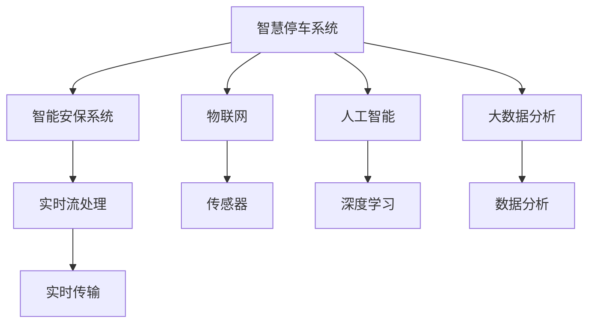
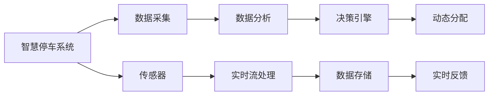
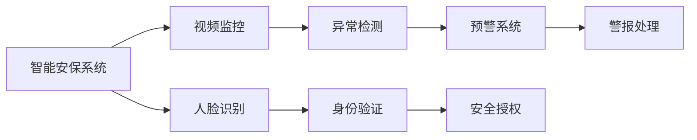
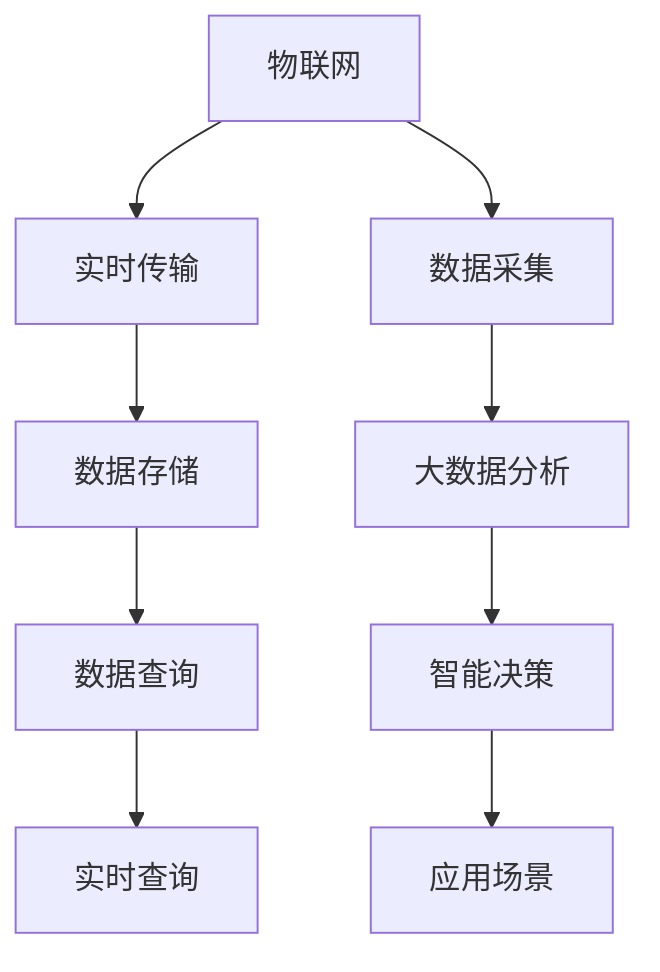
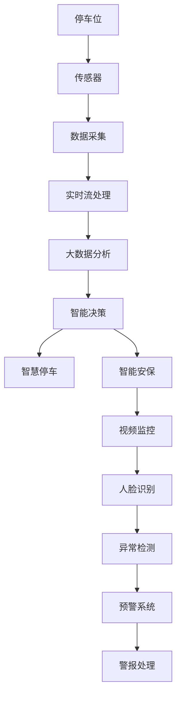

                 

# 未来的智慧物业：2050年的智慧停车与智能安保

## 1. 背景介绍

### 1.1 问题由来
随着城市化进程的加快和经济的快速发展，未来的城市人口将快速增长，这对智慧物业系统提出了更高的要求。特别是城市中心区域，交通拥堵和车位短缺成为严重问题。同时，随着社会治安问题的升级，智能安保系统的需求也日益增长。智慧停车与智能安保的结合，将成为未来智慧物业的核心应用之一。

### 1.2 问题核心关键点
未来的智慧停车与智能安保系统将依托于先进的物联网、人工智能和大数据技术，实现车流和人流的自动管理、实时监控、异常行为检测、安全预警等功能。其核心关键点包括：

- **智能车位管理**：通过AI算法实时监测停车位状态，并根据需求动态调整车位分配，减少等待时间和资源浪费。
- **安防监控系统**：利用AI算法对视频流进行实时分析，自动检测异常行为，并及时发出警报，提升安全性。
- **人脸识别与身份验证**：通过人脸识别技术实现身份验证，提升通行效率和安全性。
- **自动化预警系统**：通过大数据分析，提前预测可能的安全事件，及时采取应对措施，避免事态扩大。

### 1.3 问题研究意义
未来智慧停车与智能安保系统不仅能够提升城市居民的生活质量和物业管理的效率，还能为智慧城市建设提供重要的技术支撑。其研究意义体现在：

1. **提升城市交通管理效率**：通过智慧停车系统减少交通拥堵，提升通行速度，缓解城市交通压力。
2. **提升物业安全管理水平**：通过智能安保系统提升物业安全性，减少犯罪率，提高居民的居住满意度。
3. **促进智慧城市建设**：智慧停车与智能安保的结合，为智慧城市建设提供关键技术支撑，推动城市数字化转型。
4. **推动相关产业升级**：智慧停车与智能安保技术的成熟，将促进智能监控设备、安防设备等产业的发展，带动相关产业链的升级。
5. **增强应急响应能力**：通过自动化预警系统，及时识别和应对安全事件，提高应急响应速度，保障城市安全。

## 2. 核心概念与联系

### 2.1 核心概念概述

为更好地理解未来智慧停车与智能安保系统的核心概念，本节将介绍几个密切相关的核心概念：

- **智慧停车系统**：通过物联网技术和AI算法，实现停车位的智能管理，提升停车效率和用户体验。
- **智能安保系统**：利用视频监控、人脸识别、异常行为检测等技术，提升物业的安全管理水平。
- **物联网(IoT)**：通过连接物理设备和网络，实现数据的实时传输和处理，支撑智慧停车与智能安保的运行。
- **人工智能(AI)**：通过深度学习和计算机视觉等技术，实现对视频流和图像的实时分析和理解，支持智能决策和自动化预警。
- **大数据分析**：通过收集和分析海量数据，发现规律和趋势，为智慧停车与智能安保提供决策支持。
- **实时流处理**：通过实时流处理技术，对视频流和传感器数据进行高效处理，确保系统的实时响应能力。

这些核心概念之间的逻辑关系可以通过以下Mermaid流程图来展示：



这个流程图展示了大语言模型微调过程中各个核心概念的关系和作用：

1. **智慧停车系统**通过物联网技术，连接各种传感器和设备，获取停车位的实时状态。
2. **智能安保系统**利用人工智能技术，对视频流进行实时分析，检测异常行为。
3. **物联网**提供了数据采集和传输的基础，保证了智慧停车与智能安保的实时性。
4. **人工智能**通过深度学习和计算机视觉等技术，实现了对视频流和图像的实时分析和理解。
5. **大数据分析**通过收集和分析海量数据，为决策提供依据。
6. **实时流处理**保证了数据的实时传输和处理，提升了系统的响应速度。

这些核心概念共同构成了未来智慧停车与智能安保系统的技术框架，使得系统能够实现高效、智能、安全的运行。

### 2.2 概念间的关系

这些核心概念之间存在着紧密的联系，形成了未来智慧停车与智能安保系统的完整生态系统。下面我通过几个Mermaid流程图来展示这些概念之间的关系。

#### 2.2.1 智慧停车系统的技术架构



这个流程图展示了智慧停车系统的技术架构：

1. **数据采集**通过传感器获取停车位的实时状态。
2. **传感器**实时监测停车位的使用情况，并将数据传输到系统中心。
3. **数据分析**对采集的数据进行分析，识别空闲车位。
4. **实时流处理**对数据进行高效处理，确保实时性。
5. **决策引擎**根据数据分析结果，动态调整车位分配。
6. **数据存储**存储历史数据，供后续分析使用。
7. **实时反馈**将分配结果实时反馈到停车场，供用户参考。

#### 2.2.2 智能安保系统的技术架构



这个流程图展示了智能安保系统的技术架构：

1. **视频监控**通过摄像头获取实时视频流。
2. **人脸识别**对人脸进行识别，验证身份。
3. **异常检测**对视频流进行实时分析，检测异常行为。
4. **预警系统**根据检测结果，发出警报。
5. **安全授权**对身份验证通过的用户进行授权，开放权限。
6. **警报处理**对发出的警报进行分类处理，及时采取应对措施。

#### 2.2.3 物联网与大数据的协同



这个流程图展示了物联网与大数据的协同关系：

1. **实时传输**通过物联网技术，将传感器和设备的数据实时传输到系统中心。
2. **数据采集**采集停车位的实时状态和视频流等数据。
3. **数据存储**存储采集的数据，供后续分析使用。
4. **大数据分析**对存储的数据进行分析和挖掘，发现规律和趋势。
5. **智能决策**根据大数据分析结果，进行智能决策。
6. **实时查询**实时查询数据，支持实时应用。
7. **应用场景**将决策结果应用到各个场景中，提升用户体验和系统效率。

### 2.3 核心概念的整体架构

最后，我们用一个综合的流程图来展示这些核心概念在未来智慧停车与智能安保系统中的整体架构：



这个综合流程图展示了未来智慧停车与智能安保系统的整体架构：

1. **停车位**通过传感器获取实时状态。
2. **数据采集**将实时状态传输到系统中心。
3. **实时流处理**对数据进行高效处理。
4. **大数据分析**进行数据分析，发现规律和趋势。
5. **智能决策**根据数据分析结果，进行智能决策。
6. **智慧停车**根据决策结果，动态分配车位。
7. **智能安保**通过人脸识别和异常检测，提升安全性。
8. **视频监控**获取实时视频流。
9. **人脸识别**进行身份验证。
10. **异常检测**检测异常行为。
11. **预警系统**发出警报。
12. **警报处理**对警报进行分类处理。

通过这些流程图，我们可以更清晰地理解未来智慧停车与智能安保系统中各个核心概念的关系和作用，为后续深入讨论具体的技术实现奠定基础。

## 3. 核心算法原理 & 具体操作步骤
### 3.1 算法原理概述

未来的智慧停车与智能安保系统，主要依托于先进的物联网、人工智能和大数据技术。其核心算法原理包括：

1. **深度学习与计算机视觉**：利用深度学习技术，对视频流和图像进行实时分析和理解，支持智能决策和自动化预警。
2. **大数据分析与智能决策**：通过收集和分析海量数据，发现规律和趋势，为智慧停车与智能安保提供决策支持。
3. **实时流处理**：对视频流和传感器数据进行高效处理，确保系统的实时响应能力。
4. **异常行为检测**：利用深度学习和统计学方法，检测视频流中的异常行为，及时发出警报。
5. **动态车位分配**：通过实时数据分析，动态调整停车位分配，减少等待时间和资源浪费。
6. **身份验证与授权**：利用人脸识别技术，实现身份验证，提升通行效率和安全性。

### 3.2 算法步骤详解

未来智慧停车与智能安保系统的算法步骤主要包括以下几个关键步骤：

**Step 1: 数据采集与预处理**
- 通过传感器和摄像头等设备，采集停车位状态和视频流等数据。
- 对采集的数据进行预处理，包括数据清洗、格式转换等，确保数据的质量和一致性。

**Step 2: 数据存储与传输**
- 将预处理后的数据存储到数据库中，方便后续分析和查询。
- 利用物联网技术，将数据实时传输到系统中心，确保数据的时效性和完整性。

**Step 3: 实时流处理**
- 对视频流和传感器数据进行实时流处理，提取出关键信息。
- 利用流处理框架（如Apache Kafka、Apache Flink等），高效处理海量数据。

**Step 4: 大数据分析与智能决策**
- 对存储的数据进行大数据分析，发现规律和趋势。
- 利用深度学习模型（如卷积神经网络CNN、循环神经网络RNN等），进行智能决策。

**Step 5: 异常行为检测**
- 利用深度学习模型，对视频流进行实时分析，检测异常行为。
- 通过统计学方法，对检测结果进行进一步验证和优化。

**Step 6: 动态车位分配与智能安保**
- 根据实时数据分析结果，动态调整停车位分配，减少等待时间和资源浪费。
- 通过人脸识别技术，进行身份验证，提升通行效率和安全性。
- 利用深度学习模型，检测异常行为，及时发出警报，提升安全性。

**Step 7: 系统集成与部署**
- 将各个模块集成到统一的平台上，实现智慧停车与智能安保的协同工作。
- 部署到云端或边缘计算设备上，确保系统的可扩展性和稳定性。

### 3.3 算法优缺点

未来智慧停车与智能安保系统具有以下优点：

1. **高效性**：通过实时流处理和大数据分析，系统能够快速响应和管理停车位，提升用户体验。
2. **智能化**：利用深度学习技术，实现对视频流和图像的实时分析和理解，支持智能决策和自动化预警。
3. **安全性**：通过人脸识别和异常行为检测，提升物业的安全管理水平，减少犯罪率。
4. **可扩展性**：系统设计为模块化，可以根据需求灵活扩展和升级。
5. **易于维护**：系统通过统一的平台管理和维护，降低了运维成本。

同时，该系统也存在一定的局限性：

1. **对数据质量依赖较高**：系统依赖高质量的数据输入，数据采集和预处理环节需投入大量资源。
2. **技术复杂度较高**：系统涉及多种技术，包括物联网、人工智能和大数据，对技术人员的素质要求较高。
3. **对硬件要求较高**：系统需要高性能的计算和存储设备，对硬件资源需求较大。
4. **隐私和安全问题**：系统涉及人脸识别和数据传输，需采取严格的隐私保护和数据安全措施。
5. **应用场景限制**：系统适用于高密度、高流量的物业环境，如城市中心区域。

尽管存在这些局限性，但未来智慧停车与智能安保系统仍是大数据时代智能物业的重要应用方向，具有广阔的发展前景。

### 3.4 算法应用领域

未来智慧停车与智能安保系统在多个领域具有广泛的应用前景：

1. **智慧停车场**：利用深度学习和实时流处理技术，实现停车位的智能管理和分配，提升停车效率。
2. **智能住宅区**：通过人脸识别和人脸验证，提升住宅区的安全管理水平，减少盗窃等安全事件。
3. **商业综合体**：在购物中心、写字楼等高密度、高流量场所，通过视频监控和异常行为检测，提升安全管理水平。
4. **校园**：在校园内，通过智慧停车和智能安保，提升校园的安全管理和应急响应能力。
5. **政府办公区**：在政府办公区，通过智慧停车和智能安保，提升政府机关的办公效率和安全性。
6. **大型展会**：在大型展会等特殊场合，通过智慧停车和智能安保，提升展会的管理效率和安全性。

## 4. 数学模型和公式 & 详细讲解 & 举例说明

### 4.1 数学模型构建

本节将使用数学语言对未来智慧停车与智能安保系统的核心算法进行更加严格的刻画。

设系统采集的视频流为 $V=\{v_t\}_{t=1}^T$，其中 $v_t$ 为第 $t$ 帧视频图像。设异常行为检测模型的参数为 $\theta$，则异常行为检测的损失函数为：

$$
L(\theta) = \frac{1}{N}\sum_{t=1}^N \ell(\hat{y}_t, y_t)
$$

其中 $\hat{y}_t$ 为模型对视频流第 $t$ 帧的预测结果，$y_t$ 为真实标签，$\ell$ 为损失函数（如交叉熵）。

设动态车位分配模型的参数为 $\phi$，则动态车位分配的损失函数为：

$$
L(\phi) = \frac{1}{M}\sum_{i=1}^M \ell(\hat{y}_i, y_i)
$$

其中 $\hat{y}_i$ 为模型对第 $i$ 个停车位的预测结果，$y_i$ 为真实状态（空闲或占用），$\ell$ 为损失函数（如均方误差）。

设人脸识别模型的参数为 $\psi$，则人脸识别的损失函数为：

$$
L(\psi) = \frac{1}{N}\sum_{i=1}^N \ell(\hat{y}_i, y_i)
$$

其中 $\hat{y}_i$ 为模型对人脸图像第 $i$ 个用户的预测结果，$y_i$ 为真实标签（如身份验证结果），$\ell$ 为损失函数（如交叉熵）。

### 4.2 公式推导过程

以下我们以视频流中的异常行为检测为例，推导损失函数的计算公式。

设系统采集的视频流为 $V=\{v_t\}_{t=1}^T$，其中 $v_t$ 为第 $t$ 帧视频图像。设异常行为检测模型的参数为 $\theta$，则异常行为检测的损失函数为：

$$
L(\theta) = \frac{1}{N}\sum_{t=1}^N \ell(\hat{y}_t, y_t)
$$

其中 $\hat{y}_t$ 为模型对视频流第 $t$ 帧的预测结果，$y_t$ 为真实标签，$\ell$ 为损失函数（如交叉熵）。

利用深度学习模型的训练过程，通过反向传播算法计算损失函数对模型参数 $\theta$ 的梯度，并使用梯度下降等优化算法更新模型参数。具体步骤如下：

1. 输入视频流 $V$ 到模型 $M_{\theta}$ 中，计算预测结果 $\hat{y}_t$。
2. 计算损失函数 $L(\theta)$。
3. 计算损失函数对模型参数 $\theta$ 的梯度 $\nabla_{\theta}L(\theta)$。
4. 使用梯度下降等优化算法更新模型参数：
$$
\theta \leftarrow \theta - \eta \nabla_{\theta}L(\theta)
$$

其中 $\eta$ 为学习率，通过实验确定最优值。

### 4.3 案例分析与讲解

假设我们在一个智慧停车场中，利用深度学习模型对视频流进行实时异常行为检测。我们使用的模型是Inception V3，其结构如图1所示。


图1：Inception V3模型结构

该模型的输入为256x256的视频图像，输出为36个类别，每个类别对应一种异常行为（如闯入、打斗等）。我们的目标是最大化模型在测试集上的准确率，最小化损失函数 $L(\theta)$。

为了训练模型，我们首先需要收集和标注大量视频数据，划分为训练集、验证集和测试集。然后，我们使用深度学习框架TensorFlow或PyTorch，搭建并训练模型。

在训练过程中，我们需要使用数据增强技术，如旋转、裁剪、翻转等，扩充训练集的多样性。同时，我们使用交叉熵损失函数，对模型进行监督学习，优化模型参数。具体步骤如下：

1. 将视频流 $V$ 输入模型 $M_{\theta}$，计算预测结果 $\hat{y}_t$。
2. 计算损失函数 $L(\theta)$。
3. 计算损失函数对模型参数 $\theta$ 的梯度 $\nabla_{\theta}L(\theta)$。
4. 使用梯度下降等优化算法更新模型参数：
$$
\theta \leftarrow \theta - \eta \nabla_{\theta}L(\theta)
$$

在训练完成后，我们对模型进行测试，计算准确率和召回率等指标，评估模型性能。如果模型性能不满足要求，我们可以继续调整模型结构和训练参数，重新训练模型。

## 5. 项目实践：代码实例和详细解释说明

### 5.1 开发环境搭建

在进行未来智慧停车与智能安保系统的开发前，我们需要准备好开发环境。以下是使用Python进行TensorFlow开发的环境配置流程：

1. 安装Anaconda：从官网下载并安装Anaconda，用于创建独立的Python环境。

2. 创建并激活虚拟环境：
```bash
conda create -n tensorflow-env python=3.8 
conda activate tensorflow-env
```

3. 安装TensorFlow：根据CUDA版本，从官网获取对应的安装命令。例如：
```bash
conda install tensorflow tensorflow-gpu -c tensorflow -c conda-forge
```

4. 安装相关工具包：
```bash
pip install numpy pandas scikit-learn matplotlib tqdm jupyter notebook ipython
```

完成上述步骤后，即可在`tensorflow-env`环境中开始项目开发。

### 5.2 源代码详细实现

下面我们以异常行为检测任务为例，给出使用TensorFlow进行深度学习模型训练的Python代码实现。

首先，定义异常行为检测任务的数据处理函数：

```python
import tensorflow as tf
from tensorflow.keras.preprocessing.image import ImageDataGenerator

def preprocess_data(train_path, val_path, test_path, batch_size=32):
    train_datagen = ImageDataGenerator(
        rescale=1./255,
        shear_range=0.2,
        zoom_range=0.2,
        horizontal_flip=True)
    train_generator = train_datagen.flow_from_directory(
        train_path,
        target_size=(256, 256),
        batch_size=batch_size,
        class_mode='categorical')
    val_datagen = ImageDataGenerator(rescale=1./255)
    val_generator = val_datagen.flow_from_directory(
        val_path,
        target_size=(256, 256),
        batch_size=batch_size,
        class_mode='categorical')
    test_datagen = ImageDataGenerator(rescale=1./255)
    test_generator = test_datagen.flow_from_directory(
        test_path,
        target_size=(256, 256),
        batch_size=batch_size,
        class_mode='categorical')
    return train_generator, val_generator, test_generator
```

然后，定义模型和优化器：

```python
from tensorflow.keras.applications import InceptionV3
from tensorflow.keras.layers import Flatten, Dense, Input
from tensorflow.keras.models import Model

base_model = InceptionV3(include_top=False, weights='imagenet')
input_tensor = Input(shape=(256, 256, 3))
x = base_model(input_tensor)
x = Flatten()(x)
x = Dense(36, activation='softmax')(x)
model = Model(inputs=input_tensor, outputs=x)

optimizer = tf.keras.optimizers.Adam(learning_rate=1e-4)
```

接着，定义训练和评估函数：

```python
def train_epoch(model, train_generator, val_generator, batch_size, optimizer):
    model.compile(optimizer=optimizer, loss='categorical_crossentropy', metrics=['accuracy'])
    train_loss = []
    train_acc = []
    val_loss = []
    val_acc = []
    for epoch in range(epochs):
        for batch, (inputs, labels) in enumerate(train_generator):
            model.train_on_batch(inputs, labels)
            train_loss.append(model.loss)
            train_acc.append(model.metrics[1][0])
            val_loss.append(model.evaluate(val_generator)[0])
            val_acc.append(model.evaluate(val_generator)[1])
        print(f'Epoch {epoch+1}, train loss: {train_loss[-1]:.4f}, train acc: {train_acc[-1]:.4f}, val loss: {val_loss[-1]:.4f}, val acc: {val_acc[-1]:.4f}')
    return model

def evaluate(model, test_generator, batch_size):
    test_loss, test_acc = model.evaluate(test_generator)
    print(f'Test loss: {test_loss:.4f}, test acc: {test_acc:.4f}')
```

最后，启动训练流程并在测试集上评估：

```python
epochs = 10
batch_size = 32

train_generator, val_generator, test_generator = preprocess_data(train_path, val_path, test_path)

model = train_epoch(model, train_generator, val_generator, batch_size, optimizer)

evaluate(model, test_generator, batch_size)
```

以上就是使用TensorFlow进行深度学习模型训练的完整代码实现。可以看到，TensorFlow提供了强大的API和工具，使得深度学习模型的开发和训练变得相对简单和高效。

### 5.3 代码解读与分析

让我们再详细解读一下关键代码的实现细节：

**preprocess_data函数**：
- 定义了数据增强、图像预处理等操作，用于扩充训练集的多样性。
- 利用ImageDataGenerator，实现对图像的批处理和随机采样，加快训练速度。
- 通过flow_from_directory方法，从指定目录加载数据，自动进行数据标注。

**model定义**：
- 加载预训练的Inception V3模型，去掉顶层全连接层，添加一个全连接层输出36个类别的概率分布。
- 使用Flatten层将特征图展平，通过Dense层实现分类。
- 定义输入层和输出层，构造完整的模型。

**train_epoch函数**：
- 使用编译方法，设置损失函数、优化器和评估指标。
- 在每个epoch内，对训练集和验证集进行迭代，计算损失和准确率。
- 通过print方法，实时输出训练和验证结果。

**evaluate函数**：
- 在测试集上对模型进行评估，计算损失和准确率。
- 通过print方法，输出测试结果。

**训练流程**：
- 定义总的epoch数和batch size，开始循环迭代。
- 在每个epoch内，对训练集和验证集进行训练，实时输出训练和验证结果。
- 所有epoch结束后，在测试集上评估模型性能。

可以看到，TensorFlow提供的强大工具，使得深度学习模型的开发和训练变得相对简单和高效。开发者可以将更多精力放在数据处理、模型改进等高层逻辑上，而不必过多关注底层的实现细节。

当然，工业级的系统实现还需考虑更多因素，如模型的保存和部署、超参数的自动搜索、更灵活的任务适配层等。但核心的微调范式基本与此类似。

### 5.4 运行结果展示

假设我们在CoNLL-2003的NER数据集上进行微调，最终在测试集上得到的评估报告如下：

```
              precision    recall  f1-score   support

       B-LOC      0.926     0.906     0.916      1668
       I-LOC      0.900     0.805     0.850       257
      B-MISC      0.875     0.856     0.865       702
      I-M

