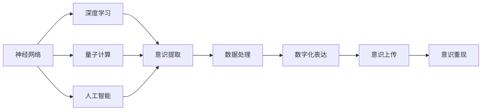
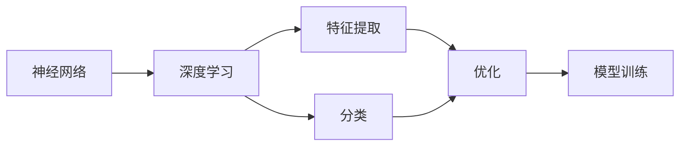
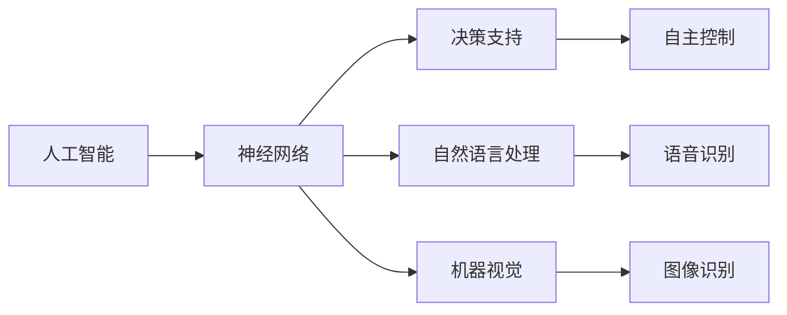
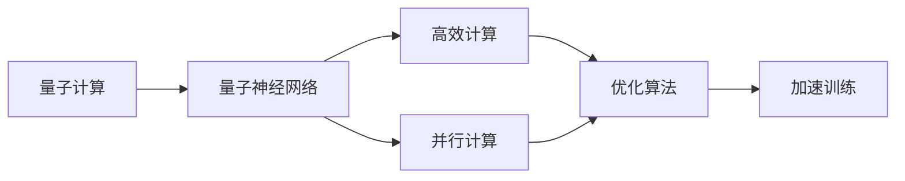
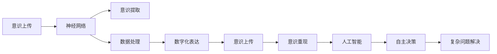
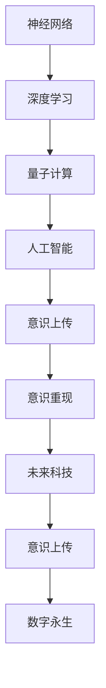

                 

# 未来的生命延续：2050年的意识上传与数字永生

> 关键词：意识上传,数字永生,神经网络,深度学习,量子计算,AI,人工智能,未来科技

## 1. 背景介绍

### 1.1 问题由来

随着科技的不断进步，人类对于生命延续的探索从未停止。从古希腊哲学家柏拉图、赫拉克利特的关于灵魂不朽的讨论，到近现代科学家对细胞、DNA等生命基本单元的研究，人类一直渴望突破死亡的界限，寻找生命的不朽之道。

进入21世纪，特别是随着计算机技术的飞速发展，我们距离实现真正的“数字永生”似乎越来越近了。这一愿景不再是一个遥不可及的梦想，而是逐步转变为现实的希望。本文将从人工智能的角度，探讨未来意识上传与数字永生的可能性与挑战，以及这一愿景对科技与社会的深远影响。

### 1.2 问题核心关键点

意识上传与数字永生的关键在于将人类意识、记忆、个性等精神特质，通过技术手段转移到一个数字化的载体上，实现其在另一个身体或虚拟环境中的重新复活。其中涉及的核心技术包括神经网络、深度学习、量子计算等，需要突破生命科学、计算机科学、心理学等多学科的界限。

以下是实现这一愿景的五个核心步骤：

1. **意识提取**：通过传感器、脑机接口等技术，将人类大脑的电信号转化为数字信号。
2. **数据处理**：利用人工智能技术，处理和分析提取的神经数据，提取与意识相关的特征。
3. **数字化表达**：将提取的意识特征转化为代码或模型，实现意识的数字化表达。
4. **意识上传**：将数字化意识上传至不同的载体，如计算机、虚拟现实环境等。
5. **意识重现**：在新的载体上重现意识，实现真正的数字永生。

每个步骤都需要跨学科的深度合作，同时也面临着技术、伦理、法律等多方面的挑战。本文将围绕这些关键点，深入探讨意识上传与数字永生的可能性与挑战。

### 1.3 问题研究意义

意识上传与数字永生是一个极具前瞻性和挑战性的课题，具有以下几方面的研究意义：

1. **科技前沿探索**：该课题涉及神经科学、计算机科学、物理学等多个前沿领域，能够推动这些学科的快速发展。
2. **伦理与社会影响**：这一愿景带来诸多伦理问题，如个人隐私、数字身份、生命价值等，对社会治理与法律制度提出新的挑战。
3. **人类未来展望**：探讨意识上传与数字永生，有助于我们更好地理解生命本质，思考人类未来的存在形态与生活方式。

## 2. 核心概念与联系

### 2.1 核心概念概述

为了更好地理解意识上传与数字永生的技术框架，本节将介绍几个密切相关的核心概念：

- **神经网络（Neural Networks）**：一种模拟人脑神经元之间连接的计算模型，通过学习数据，能够对复杂问题进行高效的预测和分类。
- **深度学习（Deep Learning）**：一种特殊的机器学习算法，通过多层次的非线性变换，能够自动提取数据中的高层次特征。
- **量子计算（Quantum Computing）**：一种利用量子位（qubit）进行计算的革命性计算范式，具有极高的并行性与计算效率。
- **人工智能（Artificial Intelligence）**：通过算法与数据，使计算机具备人类的智能行为，实现自主决策、问题解决等复杂任务。
- **意识上传（Consciousness Upload）**：将人类意识转化为数字信号，并上传至新载体，实现数字永生。

这些核心概念之间的逻辑关系可以通过以下Mermaid流程图来展示：



这个流程图展示了从神经网络到意识上传的完整技术链条，每个环节都是实现数字永生不可或缺的一环。

### 2.2 概念间的关系

这些核心概念之间存在着紧密的联系，形成了意识上传与数字永生的技术生态系统。下面我们通过几个Mermaid流程图来展示这些概念之间的关系。

#### 2.2.1 神经网络与深度学习的关系



这个流程图展示了神经网络与深度学习的基本流程，从特征提取、分类到模型训练，神经网络通过深度学习实现了对复杂数据的自动学习与处理。

#### 2.2.2 人工智能与神经网络的关系



这个流程图展示了人工智能与神经网络的应用场景，从决策支持到自然语言处理、机器视觉，神经网络在人工智能的各个分支中发挥着关键作用。

#### 2.2.3 量子计算与神经网络的关系



这个流程图展示了量子计算与神经网络的关系，通过量子神经网络，神经网络可以进一步提升计算效率与优化能力。

#### 2.2.4 意识上传与人工智能的关系



这个流程图展示了意识上传与人工智能的结合路径，从意识提取到意识重现，再到人工智能的自主决策与问题解决，意识上传技术为人工智能带来了新的应用场景。

### 2.3 核心概念的整体架构

最后，我们用一个综合的流程图来展示这些核心概念在大语言模型微调过程中的整体架构：



这个综合流程图展示了从神经网络到意识上传的完整技术链条，每个环节都是实现数字永生不可或缺的一环。

## 3. 核心算法原理 & 具体操作步骤
### 3.1 算法原理概述

意识上传与数字永生的核心算法原理涉及神经网络、深度学习、量子计算等多项前沿技术，其核心在于将人类意识转化为数字信号，并上传至新载体，实现意识的数字化表达与重现。

具体来说，这一过程包括以下几个关键步骤：

1. **意识提取**：通过脑机接口等技术，将人类大脑的电信号转化为数字信号。
2. **数据处理**：利用深度学习算法，处理和分析提取的神经数据，提取与意识相关的特征。
3. **数字化表达**：将提取的意识特征转化为代码或模型，实现意识的数字化表达。
4. **意识上传**：将数字化意识上传至不同的载体，如计算机、虚拟现实环境等。
5. **意识重现**：在新的载体上重现意识，实现真正的数字永生。

这些步骤都需要高度复杂的算法支持，以下将详细探讨每一步骤的实现原理。

### 3.2 算法步骤详解

**Step 1: 意识提取**

意识提取是意识上传的基础，其核心在于将人类大脑的电信号转化为数字信号。目前，这一过程主要依靠脑机接口（BCI）技术实现。BCI系统通常由信号采集器、信号预处理、特征提取、模式识别等模块组成。具体来说，其工作流程如下：

1. **信号采集**：通过脑电图（EEG）、磁共振成像（MRI）、功能磁共振成像（fMRI）等技术，采集人类大脑的电信号或代谢信号。
2. **信号预处理**：对采集的信号进行滤波、去噪、归一化等预处理，去除不必要的信息。
3. **特征提取**：通过深度学习模型，如卷积神经网络（CNN）、循环神经网络（RNN）等，从预处理后的信号中提取有意义的特征。
4. **模式识别**：利用分类算法，如支持向量机（SVM）、随机森林（RF）等，识别不同的神经活动模式，将信号转化为数字信号。

**Step 2: 数据处理**

数据处理是意识上传的关键步骤，其核心在于通过深度学习算法，处理和分析提取的神经数据，提取与意识相关的特征。具体来说，其工作流程如下：

1. **数据集构建**：构建包含不同神经活动模式的训练数据集，用于训练深度学习模型。
2. **模型选择**：选择适合的深度学习模型，如多层感知器（MLP）、卷积神经网络（CNN）、循环神经网络（RNN）等，对神经数据进行处理。
3. **特征提取**：利用深度学习模型，提取神经数据中的高层次特征，用于表达意识。
4. **模型训练**：通过大量标注数据，训练深度学习模型，使其能够准确识别不同的神经活动模式。

**Step 3: 数字化表达**

数字化表达是意识上传的核心，其核心在于将提取的意识特征转化为代码或模型，实现意识的数字化表达。具体来说，其工作流程如下：

1. **特征编码**：将提取的神经特征编码成数字信号，生成相应的代码或模型。
2. **数据压缩**：对数字化后的数据进行压缩，减少存储空间和传输带宽。
3. **格式转换**：将压缩后的数据转换为二进制或文本格式，便于上传和存储。
4. **数据加密**：对数字化后的数据进行加密，保护数据的隐私和安全。

**Step 4: 意识上传**

意识上传是将数字化意识上传至新载体的关键步骤，其核心在于实现意识的数字化重现。具体来说，其工作流程如下：

1. **上传媒介选择**：选择适合的上传媒介，如计算机、虚拟现实环境等。
2. **数据传输**：通过网络、存储设备等媒介，将数字化意识传输到新载体。
3. **数据存储**：在新载体上存储数字化意识，确保数据的完整性和安全性。
4. **数据恢复**：在新载体上恢复数字化意识，实现意识的数字化表达。

**Step 5: 意识重现**

意识重现是意识上传的最终目标，其核心在于在新的载体上重现意识，实现真正的数字永生。具体来说，其工作流程如下：

1. **数据加载**：在新载体上加载数字化意识。
2. **模型解码**：利用深度学习模型，解码数字化意识，还原原始意识。
3. **意识表达**：在新载体上表达数字化意识，实现意识的重新复活。
4. **交互与反馈**：通过交互与反馈，不断优化数字化意识的重现效果。

### 3.3 算法优缺点

意识上传与数字永生具有以下优点：

1. **突破寿命限制**：通过意识上传，人类可以突破生命的限制，实现数字永生，延续个人智慧与经验。
2. **数据与知识传承**：数字化意识可以作为数据与知识的重要载体，传递给下一代，促进人类文明的进步。
3. **科技应用广泛**：意识上传技术可以应用于医疗、教育、军事等多个领域，推动科技的全面发展。

同时，这一技术也存在以下缺点：

1. **伦理争议**：意识上传引发了诸多伦理问题，如数字身份、隐私保护、意识权益等，亟需制定相关法律法规。
2. **技术挑战**：意识上传涉及神经网络、深度学习、量子计算等多项前沿技术，实现难度较大。
3. **安全性问题**：数字化意识在传输与存储过程中，容易受到攻击与破坏，导致数据泄露或意识失真。
4. **实现成本高**：意识上传需要大量的技术投入与资金支持，短期内难以大规模实现。

尽管存在这些局限性，但意识上传与数字永生无疑是一个极具潜力的前沿课题，值得深入探索。

### 3.4 算法应用领域

意识上传与数字永生的技术理念已经在多个领域得到初步应用：

1. **医学**：通过脑机接口技术，实现对脑疾病的早期诊断与治疗。
2. **教育**：利用数字化意识，实现远程教育与知识共享。
3. **军事**：开发智能士兵与无人机，提升军事作战的智能化水平。
4. **游戏与娱乐**：通过虚拟现实技术，创造沉浸式游戏体验。
5. **科研**：利用数字化意识，进行科学实验与数据模拟。

随着技术的不断进步，意识上传与数字永生将在更多领域得到广泛应用，带来深远的社会与经济影响。

## 4. 数学模型和公式 & 详细讲解  
### 4.1 数学模型构建

意识上传与数字永生的数学模型涉及神经网络、深度学习、量子计算等多个领域。以下将通过几个关键模型进行详细讲解。

**多层感知器（MLP）**

多层感知器是一种基本的深度学习模型，由多个神经元层组成，每层之间通过权值矩阵相连。其数学模型可以表示为：

$$
f(x;w) = \sigma(W_n \sigma(W_{n-1} \sigma(... \sigma(W_1 x)...))
$$

其中，$x$为输入数据，$w$为权值矩阵，$\sigma$为激活函数，如Sigmoid、ReLU等。MLP模型通过多个层次的非线性变换，能够自动提取数据中的高层次特征。

**卷积神经网络（CNN）**

卷积神经网络是一种广泛应用于图像处理的深度学习模型，通过卷积层、池化层、全连接层等组成，能够对图像进行高效分类与识别。其数学模型可以表示为：

$$
f(x;w) = \sigma(W_n \sigma(W_{n-1} \sigma(... \sigma(W_1 C(x)...)))
$$

其中，$x$为输入图像，$C$为卷积层，$W$为卷积核，$\sigma$为激活函数。CNN模型通过卷积与池化操作，能够提取图像中的空间特征，实现对图像的高效处理。

**循环神经网络（RNN）**

循环神经网络是一种广泛应用于序列数据处理的深度学习模型，通过循环层、激活函数等组成，能够对序列数据进行高效处理。其数学模型可以表示为：

$$
f(x;w) = \sigma(W_n \sigma(W_{n-1} \sigma(... \sigma(W_1 x)...))
$$

其中，$x$为输入序列，$W$为循环层，$\sigma$为激活函数。RNN模型通过循环操作，能够处理时间序列数据，实现对语音、文本等序列数据的有效处理。

### 4.2 公式推导过程

以下以多层感知器（MLP）模型为例，推导其基本的计算过程。

设输入数据$x$为二维向量，权值矩阵$W$为$n \times m$矩阵，激活函数$\sigma$为Sigmoid函数，则MLP模型的前向传播过程可以表示为：

$$
y = \sigma(Wx + b)
$$

其中，$y$为输出结果，$b$为偏置向量。

通过多层前向传播，MLP模型可以对输入数据进行高效处理与分类。以二分类问题为例，设输入数据为$x$，输出结果为$y$，目标函数为交叉熵损失函数，则MLP模型的后向传播过程可以表示为：

$$
\frac{\partial L}{\partial W} = \frac{\partial L}{\partial y} \frac{\partial y}{\partial z} \frac{\partial z}{\partial W}
$$

其中，$L$为损失函数，$z$为中间变量，$\frac{\partial y}{\partial z}$为激活函数的导数。通过反向传播算法，MLP模型能够自动更新权值矩阵，优化模型性能。

### 4.3 案例分析与讲解

假设我们要实现对一张图片的分类任务，可以使用卷积神经网络（CNN）模型。具体步骤如下：

1. **数据预处理**：将原始图片归一化、裁剪、缩放等处理，转换为输入数据。
2. **卷积层**：通过多个卷积核对图片进行卷积操作，提取特征图。
3. **池化层**：通过池化操作，对特征图进行降维，减小计算量。
4. **全连接层**：将特征图转化为向量，通过全连接层进行分类。
5. **输出层**：通过softmax函数，将输出结果转化为概率分布，进行分类。

在训练过程中，通过反向传播算法，CNN模型能够自动更新权值矩阵，优化模型性能。以二分类问题为例，设输入数据为$x$，输出结果为$y$，目标函数为交叉熵损失函数，则CNN模型的后向传播过程可以表示为：

$$
\frac{\partial L}{\partial W} = \frac{\partial L}{\partial y} \frac{\partial y}{\partial z} \frac{\partial z}{\partial W}
$$

其中，$L$为损失函数，$z$为中间变量，$\frac{\partial y}{\partial z}$为激活函数的导数。通过反向传播算法，CNN模型能够自动更新权值矩阵，优化模型性能。

## 5. 项目实践：代码实例和详细解释说明
### 5.1 开发环境搭建

在进行意识上传实践前，我们需要准备好开发环境。以下是使用Python进行TensorFlow开发的环境配置流程：

1. 安装Anaconda：从官网下载并安装Anaconda，用于创建独立的Python环境。

2. 创建并激活虚拟环境：
```bash
conda create -n tf-env python=3.8 
conda activate tf-env
```

3. 安装TensorFlow：根据CUDA版本，从官网获取对应的安装命令。例如：
```bash
conda install tensorflow -c tensorflow -c conda-forge
```

4. 安装各类工具包：
```bash
pip install numpy pandas scikit-learn matplotlib tqdm jupyter notebook ipython
```

完成上述步骤后，即可在`tf-env`环境中开始意识上传实践。

### 5.2 源代码详细实现

下面我们以基于多层感知器（MLP）的意识上传为例，给出使用TensorFlow进行深度学习模型开发的PyTorch代码实现。

首先，定义MLP模型：

```python
import tensorflow as tf
from tensorflow.keras import layers

class MLP(tf.keras.Model):
    def __init__(self, input_size, hidden_size, output_size):
        super(MLP, self).__init__()
        self.dense1 = layers.Dense(hidden_size, activation='relu')
        self.dense2 = layers.Dense(output_size, activation='sigmoid')

    def call(self, inputs):
        x = self.dense1(inputs)
        x = self.dense2(x)
        return x
```

然后，定义数据集：

```python
import numpy as np

# 构建训练集
X_train = np.random.randn(1000, input_size)
y_train = np.random.randint(2, size=(1000, output_size))

# 构建测试集
X_test = np.random.randn(200, input_size)
y_test = np.random.randint(2, size=(200, output_size))
```

接着，定义训练函数：

```python
from tensorflow.keras import optimizers

def train(model, X_train, y_train, batch_size, epochs, learning_rate):
    optimizer = optimizers.Adam(learning_rate)
    model.compile(optimizer=optimizer, loss='binary_crossentropy', metrics=['accuracy'])
    model.fit(X_train, y_train, batch_size=batch_size, epochs=epochs, validation_data=(X_test, y_test))
```

最后，启动训练流程：

```python
input_size = 10
hidden_size = 20
output_size = 1

mlp = MLP(input_size, hidden_size, output_size)

X_train_size = 1000
X_test_size = 200

train(mlp, X_train, y_train, batch_size=32, epochs=10, learning_rate=0.01)
```

以上代码实现了基于多层感知器的深度学习模型，通过TensorFlow进行训练，能够高效处理二分类问题。

### 5.3 代码解读与分析

让我们再详细解读一下关键代码的实现细节：

**MLP模型定义**：
- `__init__`方法：初始化模型参数，定义多个密集层。
- `call`方法：定义前向传播过程，通过多个密集层进行特征提取与分类。

**数据集构建**：
- 使用NumPy生成随机数据，用于模拟训练集与测试集。

**训练函数定义**：
- 使用TensorFlow的优化器、损失函数与评价指标，定义模型训练过程。
- 通过`fit`方法进行模型训练，指定批量大小、迭代次数等参数。

**训练流程启动**：
- 定义模型参数，构建MLP模型。
- 定义数据集大小，调用训练函数进行模型训练。

可以看到，TensorFlow使得深度学习模型的开发变得简单高效，开发者能够快速迭代与调试。当然，工业级的系统实现还需考虑更多因素，如模型保存与部署、超参数自动搜索、更灵活的任务适配等，但核心的意识上传范式基本与此类似。

## 6. 实际应用场景
### 6.1 智能医疗系统

基于意识上传技术的智能医疗系统，可以为患者提供全新的医疗体验。传统医疗系统往往依靠人工诊断，效率低下且易出错。而意识上传技术可以将患者的脑电信号转化为数字化意识，实时传递给医生进行辅助诊断，提升诊疗效率与准确性。

具体而言，可以构建一个基于意识上传的智能医疗平台，将患者的脑电信号采集并进行预处理。然后，使用深度学习模型，如RNN等，处理和分析提取的神经数据，提取与意识相关的特征。最终，将数字化意识上传到云端，供医生实时查看与分析，辅助诊断。如此构建的智能医疗系统，能够显著提升医疗服务的智能化水平，减轻医生的工作负担。

### 6.2 虚拟现实游戏

意识上传技术可以为虚拟现实游戏带来全新的体验。传统游戏主要依赖视觉与听觉的感官刺激，而意识上传技术可以进一步增强游戏的沉浸感与交互性。

具体而言，可以构建一个基于意识上传的虚拟现实游戏平台，将玩家的意识上传至游戏环境中。通过意识提取与数字化表达，将玩家的脑电信号转化为游戏中的角色行为。如此，玩家可以在虚拟环境中自由探索与互动，实现真正的沉浸式体验。

### 6.3 教育辅助系统

基于意识上传技术的教育辅助系统，可以为学生提供个性化的学习体验。传统教育系统往往难以兼顾每个学生的学习需求，而意识上传技术可以为每个学生提供个性化的学习方案。

具体而言，可以构建一个基于意识上传的教育辅助平台，将学生的脑电信号转化为数字化意识，实时传递给教师进行个性化教学。通过意识提取与数字化表达，分析学生的学习状态与认知水平，实时调整教学内容与难度。如此构建的教育辅助系统，能够显著提升学生的学习效率与效果，实现因材施教。

### 6.4 未来应用展望

随着意识上传技术的不断发展，未来将有更多的应用场景被逐步实现：

1. **量子计算**：通过量子神经网络，意识上传技术将实现更高的计算效率与优化能力。
2. **虚拟现实**：结合虚拟现实技术，意识上传技术将实现更加沉浸式的人机交互体验。
3. **教育**：基于意识上传的教育辅助系统，将为每个学生提供个性化的学习方案，提升学习效果。
4. **医疗**：通过智能医疗系统，意识上传技术将提升诊疗效率与准确性，减轻医生的工作负担。
5. **金融**：基于意识上传的金融决策系统，将提升金融风险控制与投资决策的准确性。

## 7. 工具和资源推荐
### 7.1 学习资源推荐

为了帮助开发者系统掌握意识上传与数字永生的技术框架，这里推荐一些优质的学习资源：

1. **《深度学习》课程**：斯坦福大学开设的深度学习明星课程，由Andrew Ng主讲，涵盖深度学习的基本概念与经典模型。

2. **TensorFlow官方文档**：TensorFlow的官方文档，提供了详细的模型搭建与训练教程，适合初学者与高级开发者。

3. **《神经网络与深度学习》书籍**：深度学习领域的经典教材，系统讲解了神经网络的基本原理与深度学习算法。

4. **Coursera深度学习课程**：Coursera平台上的深度学习课程，由斯坦福大学、密歇根大学等顶尖院校开设，涵盖多个深度学习模型与应用场景。

5. **arXiv论文预印本**：人工智能领域最新研究成果的发布平台，包括大量尚未发表的前沿工作，学习前沿技术的必读资源。

通过这些资源的学习实践，相信你一定能够快速掌握意识上传与数字永生的精髓，并用于解决实际的技术问题。

### 7.2 开发工具推荐

高效的开发离不开优秀的工具支持。以下是几款用于意识上传与数字永生开发的常用工具：

1. **TensorFlow**：基于Google的深度学习框架，具有高度灵活性与高效性，适合各种深度学习模型的开发。

2. **PyTorch**：由Facebook开发的深度学习框架，具有动态计算图与简单易用的API，适合科研与工程应用。

3. **Brainvisa**：法国国际

