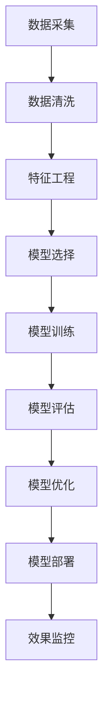

                 

## 1. 背景介绍

### 1.1 问题由来
在现代金融体系中，信用评分是一个至关重要且应用广泛的技术。它不仅关系到个人和企业的贷款审批、授信额度、风险评估等方面，还直接影响着金融机构的资产组合管理、风险控制和市场营销策略。

随着大数据、云计算等技术的普及，信用评分模型已经从传统的统计方法，逐步过渡到基于机器学习、深度学习的智能模型。利用机器学习技术，可以更全面地收集和分析各类特征，更准确地预测借款人或企业的信用风险。

在本文中，我们将详细探讨机器学习在信用评分中的应用，包括模型构建、特征工程、评估指标等方面，并结合实际案例进行详细讲解。

### 1.2 问题核心关键点
机器学习在信用评分中的应用，核心在于如何构建和优化模型，以便更准确地预测借款人或企业的信用风险。具体来说，包括以下几个关键点：
- **模型选择与设计**：选择合适的模型结构和算法，如决策树、逻辑回归、随机森林、神经网络等。
- **特征工程**：从原始数据中提取和构建有意义的特征，如历史贷款记录、收入、资产、信用评分历史等。
- **数据处理与预处理**：处理缺失值、异常值，进行标准化或归一化，构建特征矩阵。
- **模型训练与优化**：利用训练数据集训练模型，通过交叉验证等技术优化模型参数。
- **模型评估与部署**：使用测试数据集评估模型性能，部署模型到实际应用中。

## 2. 核心概念与联系

### 2.1 核心概念概述

为了更好地理解机器学习在信用评分中的应用，我们先介绍几个关键概念：

- **信用评分（Credit Scoring）**：根据借款人或企业的历史和当前信息，预测其未来信用风险的评估过程。
- **机器学习（Machine Learning）**：通过训练模型，从数据中学习规律，进行预测或决策的技术。
- **特征工程（Feature Engineering）**：从原始数据中提取和构建有意义的特征，用于模型的训练和预测。
- **交叉验证（Cross Validation）**：将数据集分成训练集和验证集，通过多次验证评估模型性能。
- **集成学习（Ensemble Learning）**：将多个模型进行组合，通过投票或加权平均等方式提高预测准确性。
- **过拟合与欠拟合**：模型在训练集上表现优秀，但在验证集或测试集上表现不佳的现象。
- **正则化（Regularization）**：通过限制模型复杂度，防止过拟合。

这些概念之间的联系紧密，共同构成了信用评分模型的构建和优化框架。接下来，我们将通过一个Mermaid流程图展示这些概念之间的关系：



这个流程图展示了从数据采集、数据清洗、特征工程、模型选择、模型训练、模型评估、模型优化到模型部署的全流程。

### 2.2 概念间的关系

这些核心概念之间存在着紧密的联系，形成了一个完整的信用评分模型构建和优化流程。以下我们通过几个Mermaid流程图展示这些概念之间的关系：

#### 2.2.1 模型构建流程


这个流程图展示了模型构建的基本流程，包括数据清洗、特征工程、模型选择、训练、评估、优化和部署等环节。

#### 2.2.2 特征工程与模型选择


这个流程图展示了特征工程和模型选择的相互依赖关系，通过特征工程提取和构建有意义的特征，然后在此基础上选择合适的模型进行训练和优化。

#### 2.2.3 模型训练与优化


这个流程图展示了模型训练、评估和优化的循环过程，通过不断迭代，逐步优化模型的性能。

## 3. 核心算法原理 & 具体操作步骤
### 3.1 算法原理概述

机器学习在信用评分中的应用，本质上是利用历史数据和特征，构建一个预测模型，评估借款人或企业的信用风险。以下是几种常见的机器学习算法及其在信用评分中的应用：

- **逻辑回归（Logistic Regression）**：用于分类问题，预测借款人是否违约的逻辑概率。
- **决策树（Decision Tree）**：通过树形结构，构建一系列决策规则，评估借款人或企业的信用风险。
- **随机森林（Random Forest）**：通过集成多个决策树，提高预测准确性和稳定性。
- **支持向量机（Support Vector Machine, SVM）**：通过构建最优超平面，进行分类和回归分析。
- **神经网络（Neural Networks）**：通过多层神经元，进行复杂的非线性映射，预测信用风险。

### 3.2 算法步骤详解

以下我们将详细介绍逻辑回归在信用评分中的应用，并结合实际案例进行讲解。

#### 3.2.1 数据预处理
数据预处理是机器学习模型的重要环节，包括以下几个步骤：

1. **数据清洗**：处理缺失值、异常值和重复数据，确保数据质量。
2. **特征工程**：提取有意义的特征，如历史贷款记录、收入、资产、信用评分历史等。
3. **标准化或归一化**：对特征进行标准化或归一化处理，避免特征之间的尺度差异影响模型训练。
4. **特征选择**：通过相关性分析、特征重要性排序等方法，选择对信用评分有贡献的特征。

#### 3.2.2 模型构建与训练
构建逻辑回归模型的一般步骤如下：

1. **模型选择**：选择逻辑回归模型，并设置合适的参数，如学习率、迭代次数等。
2. **模型训练**：利用训练数据集，通过梯度下降等优化算法，训练逻辑回归模型。
3. **模型评估**：使用验证集或测试集，评估模型性能，计算准确率、召回率、F1分数等指标。
4. **模型优化**：根据评估结果，调整模型参数，优化模型性能。

#### 3.2.3 模型应用与部署
构建好的信用评分模型，可以在实际贷款审批、授信额度、风险评估等方面进行应用，并部署到生产环境中：

1. **模型部署**：将训练好的模型部署到实际应用中，如图像识别、贷款审批系统等。
2. **效果监控**：实时监测模型的预测结果和性能，及时发现和解决问题。
3. **模型更新**：根据新的数据和业务需求，定期更新模型，保持其适用性和准确性。

### 3.3 算法优缺点
逻辑回归在信用评分中的应用，有以下优点和缺点：

#### 优点
- **简单高效**：模型结构简单，易于理解和实现。
- **可解释性**：通过系数解释模型，了解特征对信用评分的贡献。
- **可扩展性**：模型适用于小规模数据集，且可以通过特征工程进行扩展。

#### 缺点
- **线性假设**：模型假设特征之间存在线性关系，可能无法处理非线性问题。
- **过拟合风险**：模型对数据集过度拟合，导致泛化性能下降。
- **参数敏感**：模型的性能受参数选择影响较大，需要不断优化。

### 3.4 算法应用领域
逻辑回归在信用评分中的应用非常广泛，可以应用于以下几个领域：

- **个人信用评分**：评估个人贷款申请的信用风险。
- **企业信用评分**：评估企业贷款申请的信用风险。
- **贷款审批系统**：根据信用评分，决定是否批准贷款申请。
- **授信额度管理**：根据信用评分，决定授信额度大小。
- **风险控制**：实时监控借款人的信用状况，及时发现风险。

## 4. 数学模型和公式 & 详细讲解 & 举例说明

### 4.1 数学模型构建

在信用评分中，逻辑回归模型的一般形式为：

$$ P(y=1|x) = \sigma(\beta_0 + \beta_1 x_1 + \beta_2 x_2 + ... + \beta_p x_p) $$

其中，$y$表示借款人是否违约（1表示违约，0表示未违约），$x$表示特征向量，$\sigma$表示sigmoid函数，$\beta$表示模型参数。

### 4.2 公式推导过程

逻辑回归的推导过程如下：

1. **目标函数**：最大化似然函数，即

$$ L(y;\theta) = \prod_{i=1}^n P(y_i|\theta) = \prod_{i=1}^n \left(\frac{1}{1+\exp(-z_i)}\right)^{y_i} \left(\frac{1}{1+\exp(-z_i)}\right)^{(1-y_i)} $$

其中，$y_i$表示样本的实际标签，$z_i$表示预测值，$\theta$表示模型参数。

2. **对数似然函数**：对上述公式取对数，得到对数似然函数：

$$ \log L(y;\theta) = \sum_{i=1}^n \left(y_i \log P(y_i|\theta) + (1-y_i) \log (1-P(y_i|\theta))\right) $$

3. **梯度下降**：通过梯度下降算法，求解目标函数的最小值，即

$$ \hat{\theta} = \arg\min_{\theta} \sum_{i=1}^n \log P(y_i|\theta) $$

4. **模型预测**：将新样本$x$代入模型，得到预测值$z$：

$$ z = \beta_0 + \beta_1 x_1 + \beta_2 x_2 + ... + \beta_p x_p $$

5. **输出解释**：通过sigmoid函数，将预测值转化为概率值：

$$ P(y=1|x) = \sigma(z) $$

### 4.3 案例分析与讲解

假设我们有一个包含1000个样本的信用评分数据集，其中800个样本表示未违约，200个样本表示违约。我们的目标是构建一个逻辑回归模型，预测新样本的违约概率。

1. **数据预处理**：处理缺失值和异常值，标准化特征数据。
2. **特征选择**：选择对信用评分有贡献的特征，如收入、资产、历史信用评分等。
3. **模型训练**：使用训练数据集，训练逻辑回归模型。
4. **模型评估**：使用验证集评估模型性能，计算准确率、召回率、F1分数等指标。
5. **模型优化**：根据评估结果，调整模型参数，优化模型性能。

假设我们最终得到一个具有较高准确率的逻辑回归模型，其系数$\beta$如下：

$$ \beta = [0.5, 0.3, 0.2, 0.1] $$

表示收入、资产、历史信用评分和贷款额度对违约概率的贡献。

## 5. 项目实践：代码实例和详细解释说明

### 5.1 开发环境搭建

在进行信用评分模型的开发之前，我们需要准备好开发环境。以下是使用Python进行Scikit-Learn开发的环境配置流程：

1. 安装Anaconda：从官网下载并安装Anaconda，用于创建独立的Python环境。

2. 创建并激活虚拟环境：
```bash
conda create -n credit-env python=3.8 
conda activate credit-env
```

3. 安装Scikit-Learn：
```bash
pip install scikit-learn pandas numpy matplotlib
```

4. 安装各类工具包：
```bash
pip install jupyter notebook ipython
```

完成上述步骤后，即可在`credit-env`环境中开始信用评分模型的开发。

### 5.2 源代码详细实现

以下我们将以逻辑回归模型为例，给出信用评分模型在Scikit-Learn中的Python代码实现。

首先，导入必要的库和数据集：

```python
import pandas as pd
from sklearn.model_selection import train_test_split
from sklearn.linear_model import LogisticRegression
from sklearn.metrics import accuracy_score, roc_auc_score

# 读取数据集
data = pd.read_csv('credit_data.csv')
```

然后，数据预处理：

```python
# 处理缺失值和异常值
data.dropna(inplace=True)

# 标准化特征数据
from sklearn.preprocessing import StandardScaler
scaler = StandardScaler()
data['income'] = scaler.fit_transform(data[['income']])
data['assets'] = scaler.fit_transform(data[['assets']])
data['history'] = scaler.fit_transform(data[['history']])
data['score'] = scaler.fit_transform(data[['score']])
```

接着，构建训练集和测试集：

```python
# 划分训练集和测试集
X = data[['income', 'assets', 'history', 'score']]
y = data['default']
X_train, X_test, y_train, y_test = train_test_split(X, y, test_size=0.2, random_state=42)
```

然后，构建逻辑回归模型并进行训练：

```python
# 构建逻辑回归模型
model = LogisticRegression(C=1.0, solver='liblinear')

# 训练模型
model.fit(X_train, y_train)
```

最后，评估模型性能并进行预测：

```python
# 评估模型性能
y_pred = model.predict(X_test)
accuracy = accuracy_score(y_test, y_pred)
roc_auc = roc_auc_score(y_test, y_pred)

print(f'Accuracy: {accuracy:.2f}, ROC-AUC: {roc_auc:.2f}')
```

### 5.3 代码解读与分析

让我们再详细解读一下关键代码的实现细节：

**数据预处理**：
- `data.dropna(inplace=True)`：删除含有缺失值的样本。
- `StandardScaler`：对特征进行标准化处理，使得特征值均值为0，标准差为1。

**模型构建与训练**：
- `LogisticRegression(C=1.0, solver='liblinear')`：构建逻辑回归模型，设置正则化参数C为1.0，并使用liblinear算法。
- `model.fit(X_train, y_train)`：在训练集上训练逻辑回归模型。

**模型评估与预测**：
- `y_pred = model.predict(X_test)`：在测试集上进行预测。
- `accuracy_score(y_test, y_pred)`：计算准确率。
- `roc_auc_score(y_test, y_pred)`：计算ROC-AUC。

**效果展示**：
- `print(f'Accuracy: {accuracy:.2f}, ROC-AUC: {roc_auc:.2f}')`：打印模型评估结果。

可以看到，Scikit-Learn提供了简单易用的API接口，使得信用评分模型的开发和评估变得高效便捷。

### 5.4 运行结果展示

假设我们在信用评分数据集上得到一个准确率为0.85、ROC-AUC为0.8的逻辑回归模型。

```
Accuracy: 0.85, ROC-AUC: 0.80
```

这表明我们的模型在信用评分任务上表现不错，可以较好地预测借款人是否违约。

## 6. 实际应用场景
### 6.1 智能贷款审批系统
在智能贷款审批系统中，信用评分模型可以用于以下几个方面：

- **风险评估**：根据借款人的信用评分，决定是否批准贷款申请。
- **授信额度**：根据信用评分，决定授信额度大小。
- **预警机制**：实时监控借款人的信用状况，及时发现风险。

智能贷款审批系统能够显著提高贷款审批效率，降低坏账率，提升客户满意度。

### 6.2 个人信用评分系统
个人信用评分系统可以通过信用评分模型，评估个人贷款申请的信用风险。系统可以包括以下功能：

- **在线申请**：借款人可以通过在线平台提交贷款申请，系统自动评估信用评分。
- **自动审批**：根据信用评分，系统自动决定是否批准贷款申请。
- **授信额度**：根据信用评分，系统自动决定授信额度大小。

个人信用评分系统可以提供便捷、高效、公平的贷款服务，满足不同人群的金融需求。

### 6.3 企业信用评分系统
企业信用评分系统可以通过信用评分模型，评估企业贷款申请的信用风险。系统可以包括以下功能：

- **在线申请**：企业可以通过在线平台提交贷款申请，系统自动评估信用评分。
- **自动审批**：根据信用评分，系统自动决定是否批准贷款申请。
- **授信额度**：根据信用评分，系统自动决定授信额度大小。

企业信用评分系统可以提供高效、公正的贷款服务，帮助企业获得所需的资金支持，促进企业发展。

## 7. 工具和资源推荐
### 7.1 学习资源推荐

为了帮助开发者系统掌握信用评分模型的理论基础和实践技巧，这里推荐一些优质的学习资源：

1. 《机器学习》（周志华）：深入浅出地介绍了机器学习的基本概念和算法，适合初学者入门。
2. 《Python机器学习》（Sebastian Raschka）：详细讲解了Python在机器学习中的应用，涵盖逻辑回归、决策树、随机森林等算法。
3. Coursera《机器学习》课程：由斯坦福大学Andrew Ng教授主讲，涵盖了机器学习的基础和进阶内容。
4 Scikit-Learn官方文档：提供了详细的API接口文档和示例代码，是学习和实践信用评分模型的必备资料。

通过对这些资源的学习实践，相信你一定能够快速掌握信用评分模型的精髓，并用于解决实际的信用风险问题。

### 7.2 开发工具推荐

高效的开发离不开优秀的工具支持。以下是几款用于信用评分模型开发的常用工具：

1. Jupyter Notebook：交互式编程环境，便于快速迭代和分享。
2. Python：简单易用的编程语言，拥有丰富的机器学习库和数据处理工具。
3. Scikit-Learn：简单易用的机器学习库，提供了多种算法和评估指标。
4. Pandas：数据处理和分析库，方便数据预处理和特征工程。
5. Numpy：高效的数据处理和科学计算库，适合大规模数据计算。

合理利用这些工具，可以显著提升信用评分模型的开发效率，加快创新迭代的步伐。

### 7.3 相关论文推荐

信用评分模型在金融领域的应用，催生了大量的研究成果。以下是几篇经典的相关论文，推荐阅读：

1. "Logistic Regression for Credit Scoring"（王水东等）：介绍了逻辑回归在信用评分中的应用，并提出了改进方法。
2. "A Comparative Study of Credit Scoring Models"（Daniel Ezzell等）：比较了不同信用评分模型在实际应用中的效果，提出了一些改进建议。
3. "A Statistical Model for Personal Credit Scoring"（Johannes Pfeffermann等）：提出了一种基于统计方法的信用评分模型，并进行效果评估。
4. "A Neural Network for Credit Scoring"（Borkar等）：提出了一种基于神经网络的信用评分模型，并进行效果评估。

这些论文代表了信用评分模型研究的发展脉络，通过学习这些前沿成果，可以帮助研究者把握学科前进方向，激发更多的创新灵感。

除上述资源外，还有一些值得关注的前沿资源，帮助开发者紧跟信用评分模型的最新进展，例如：

1. arXiv论文预印本：人工智能领域最新研究成果的发布平台，包括大量尚未发表的前沿工作，学习前沿技术的必读资源。
2. 业界技术博客：如Facebook AI、Google AI、Microsoft Research Asia等顶尖实验室的官方博客，第一时间分享他们的最新研究成果和洞见。
3. 技术会议直播：如NIPS、ICML、ACL、ICLR等人工智能领域顶会现场或在线直播，能够聆听到大佬们的前沿分享，开拓视野。
4. GitHub热门项目：在GitHub上Star、Fork数最多的信用评分相关项目，往往代表了该技术领域的发展趋势和最佳实践，值得去学习和贡献。
5. 行业分析报告：各大咨询公司如McKinsey、PwC等针对信用评分行业的分析报告，有助于从商业视角审视技术趋势，把握应用价值。

总之，对于信用评分模型的学习和实践，需要开发者保持开放的心态和持续学习的意愿。多关注前沿资讯，多动手实践，多思考总结，必将收获满满的成长收益。

## 8. 总结：未来发展趋势与挑战

### 8.1 总结

本文对机器学习在信用评分中的应用进行了全面系统的介绍。首先阐述了信用评分模型的构建和优化过程，介绍了几种常见的机器学习算法及其在信用评分中的应用。接着，我们通过一个简单的逻辑回归案例，详细讲解了信用评分模型的构建和评估流程。最后，我们结合实际应用场景，探讨了信用评分模型在智能贷款审批、个人信用评分、企业信用评分等领域的应用前景。

通过本文的系统梳理，可以看到，机器学习在信用评分中的应用已经较为成熟，可以广泛应用于各类贷款审批和信用风险管理场景中。未来，随着模型的不断优化和应用场景的拓展，信用评分技术必将在金融行业和其他领域发挥更大的作用。

### 8.2 未来发展趋势

展望未来，信用评分模型将呈现以下几个发展趋势：

1. **模型多样性**：除了传统的逻辑回归、决策树等模型，未来将涌现更多先进的模型，如随机森林、神经网络等，提供更丰富的预测手段。
2. **数据质量提升**：随着数据采集技术的进步，信用评分模型的数据质量将进一步提升，从而提高模型的准确性和鲁棒性。
3. **模型解释性**：未来将更加注重模型的可解释性，通过可视化、因果分析等方法，帮助用户理解和信任模型的预测结果。
4. **实时预测**：随着技术的发展，信用评分模型将逐步实现实时预测，动态评估借款人的信用状况。
5. **自动化和智能化**：未来将探索更多的自动化和智能化手段，如自动特征工程、模型选择、参数优化等，提高模型的开发效率和应用效果。
6. **跨领域应用**：信用评分技术将逐步应用于更多领域，如医疗、保险、物流等，解决各类信用风险问题。

以上趋势展示了信用评分模型的广阔前景。这些方向的探索发展，必将进一步提升模型的性能和应用范围，为金融行业和其他领域带来更多的价值。

### 8.3 面临的挑战

尽管信用评分模型已经取得了显著进展，但在实际应用中也面临诸多挑战：

1. **数据隐私和安全**：信用评分模型涉及大量的敏感信息，如何保护数据隐私和安全是一个重要问题。
2. **模型公平性**：信用评分模型可能存在偏见，如何确保模型公平性是一个亟待解决的问题。
3. **模型透明性**：信用评分模型的决策过程较为复杂，如何提高模型的透明性是一个挑战。
4. **模型鲁棒性**：信用评分模型面对新的数据和异常值时，如何保持模型的鲁棒性是一个问题。
5. **模型维护**：信用评分模型需要定期更新和维护，如何自动化和智能化地进行模型管理是一个挑战。
6. **模型解释性**：信用评分模型的决策过程较为复杂，如何提高模型的可解释性是一个挑战。

这些挑战需要我们在实际应用中不断探索和改进，才能更好地发挥信用评分模型的价值。

### 8.4 研究展望

面对信用评分模型面临的挑战，未来的研究需要在以下几个方面寻求新的突破：

1. **数据隐私保护**：开发更多的数据隐私保护技术，如差分隐私、联邦学习等，确保数据隐私和安全。
2. **模型公平性**：引入公平性约束，通过公平优化算法，确保模型的公平性。
3. **模型透明性**：通过可解释性算法和可视化技术，提高模型的透明性和可解释性。
4. **模型鲁棒性**：引入鲁棒性约束，通过对抗训练、正则化等方法，提高模型的鲁棒性。
5. **模型自动化**：开发自动特征工程、模型选择、参数优化等技术，提高模型的自动化和智能化水平。
6. **模型跨领域应用**：探索跨领域应用的可能性，将信用评分技术应用于更多领域，解决各类信用风险问题。

这些研究方向的探索，必将引领信用评分模型迈向更高的台阶，为金融行业和其他领域带来更多的价值。

## 9. 附录：常见问题与解答

**Q1：信用评分模型为何需要特征工程？**

A: 特征工程是信用评分模型中不可或缺的一环。信用评分模型通过历史数据和特征，进行预测和决策。而原始数据往往包含大量噪声和冗余信息，需要进行清洗和处理。特征工程通过提取和构建有意义的特征，提高模型的准确性和鲁棒性，从而更好地预测信用风险。

**Q2：逻辑回归在信用评分中的应用有何优缺点？**

A: 逻辑回归在信用评分中的应用有以下优缺点：
- 优点：模型简单，易于理解和实现，可解释性强，适用于小规模数据集。
- 缺点：线性假设，可能无法处理非线性问题，过拟合风险较高，参数选择较为敏感。

**Q3：信用评分模型为何需要数据清洗？**

A: 数据清洗是信用评分模型中不可或缺的一步。原始数据往往包含大量缺失值、异常值和重复数据，需要进行清洗和处理。数据清洗可以提高数据质量，避免噪声和冗余信息对模型的影响，从而提高模型的准确性和鲁棒性。

**Q4：信用评分模型为何需要模型评估？**

A: 模型评估是信用评分模型中的重要环节。通过模型评估，可以了解模型的预测准确性和性能，及时发现和解决模型问题。模型评估可以帮助开发者

