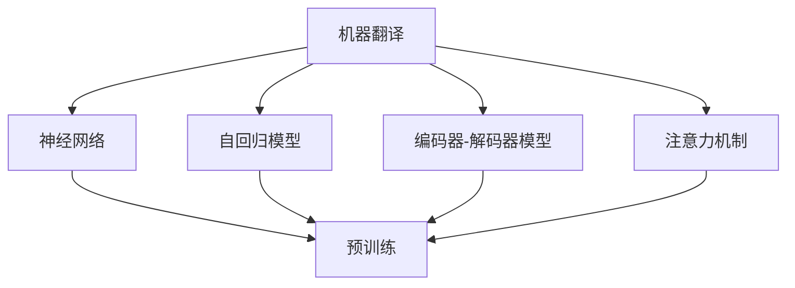
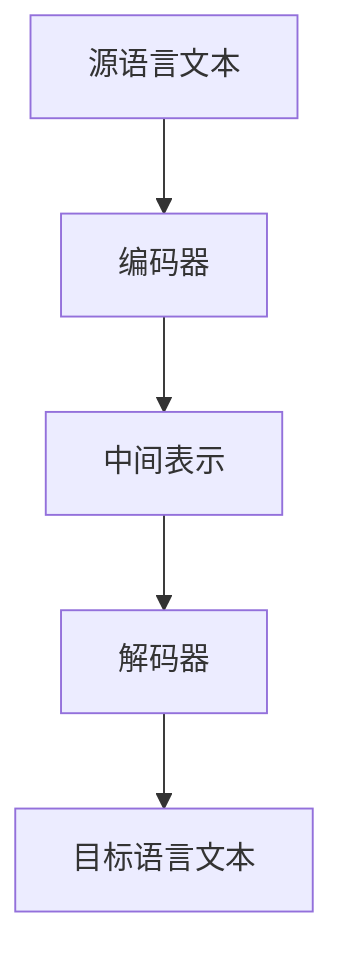
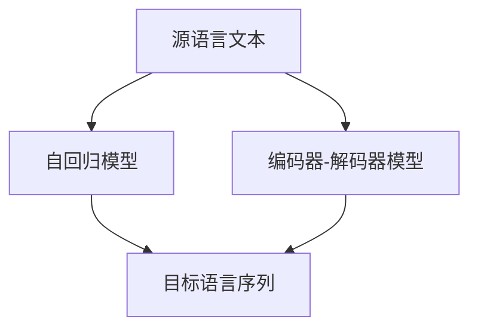
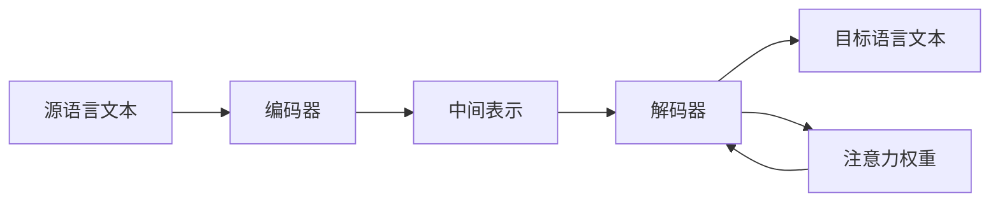
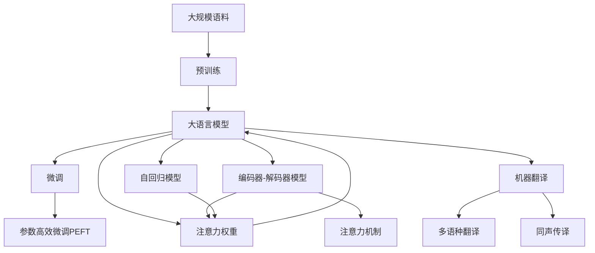

                 

# 机器翻译(Machine Translation) - 原理与代码实例讲解

> 关键词：机器翻译,神经网络,Transformer,BERT,预训练,编码器-解码器模型,自回归模型,注意力机制

## 1. 背景介绍

### 1.1 问题由来
机器翻译是自然语言处理(Natural Language Processing, NLP)领域的一个重要应用。传统的基于规则的机器翻译系统，通常依赖人工编写的语法和词汇规则，但难以处理复杂的语言现象和语境。基于统计学的机器翻译系统，虽然可以自动学习语言规律，但模型的泛化能力差，对未见过的数据预测效果不佳。

随着深度学习技术的崛起，基于神经网络的机器翻译方法取得了突破性的进展。这些方法利用大量双语文本数据，通过端到端的训练，直接从源语言翻译成目标语言，取得了显著的性能提升。

### 1.2 问题核心关键点
机器翻译的核心在于如何将源语言转换为目标语言，通常分为两个部分：
- 编码器(Encoder)：将源语言文本转换为中间表示。
- 解码器(Decoder)：将中间表示转换为目标语言文本。

目前主流的机器翻译模型都是基于Transformer架构，利用注意力机制来捕捉源语和目标语之间的依赖关系。此外，还有基于自回归模型的编码器，能够直接预测目标语言序列，但计算复杂度较高。

### 1.3 问题研究意义
机器翻译在经济、文化、教育等多个领域具有重要应用价值。例如，国际贸易、旅游交流、技术协作等领域都需要高效、准确的翻译服务。通过基于深度学习的机器翻译技术，可以大幅降低翻译成本，提高翻译质量和效率，为各行各业带来便利。

此外，机器翻译还推动了NLP技术的普及和发展，成为学术界和工业界研究的热点方向。深度学习技术的不断进步，将不断拓展机器翻译的应用边界，提升翻译系统的智能化水平。

## 2. 核心概念与联系

### 2.1 核心概念概述

为更好地理解机器翻译的原理和实现方法，本节将介绍几个密切相关的核心概念：

- 机器翻译(Machine Translation, MT)：利用计算机自动将一种自然语言翻译成另一种自然语言的过程。机器翻译是NLP领域的一个重要应用，也是实现语言互通和信息共享的重要手段。

- 神经网络(Neural Network)：由大量的人工神经元组成的计算模型，广泛应用于图像识别、语音识别、自然语言处理等多个领域。神经网络通过训练学习输入与输出之间的映射关系，可以进行复杂的模式识别和序列生成。

- 自回归模型(Autoregressive Model)：一种特殊的神经网络，能够通过观察前面的数据来预测后面的数据。自回归模型在机器翻译中被用于直接预测目标语言序列，但计算复杂度较高。

- 编码器-解码器模型(Encoder-Decoder Model)：一种用于序列到序列(Serial-to-Sequence)任务的结构，包括编码器和解码器两部分。编码器将输入序列映射为中间表示，解码器将中间表示转换为输出序列。

- 注意力机制(Attention Mechanism)：一种用于捕捉序列数据中长距离依赖关系的技术，通过动态调整权重分配，使得模型在处理序列时更加关注重要的部分。

- 预训练(Pre-training)：指在大规模语料上预训练模型，以学习语言的通用表示。预训练使得模型具备更强的泛化能力，适用于多种下游任务。

这些核心概念之间的逻辑关系可以通过以下Mermaid流程图来展示：



这个流程图展示了大语言模型微调过程中各核心概念的关系：

1. 机器翻译通过神经网络、自回归模型、编码器-解码器模型等技术实现。
2. 注意力机制和预训练技术，提高了模型对长距离依赖关系的捕捉能力，从而提升了翻译质量。
3. 预训练是机器翻译的重要步骤，可以大幅提升模型的泛化能力。

### 2.2 概念间的关系

这些核心概念之间存在着紧密的联系，形成了机器翻译模型的完整架构。下面我们通过几个Mermaid流程图来展示这些概念之间的关系。

#### 2.2.1 机器翻译的基本架构



这个流程图展示了机器翻译的基本架构，包括源语言文本输入、编码器映射、中间表示、解码器映射和目标语言文本输出。

#### 2.2.2 自回归模型与编码器-解码器模型的关系



这个流程图展示了自回归模型和编码器-解码器模型之间的关系。自回归模型能够直接预测目标语言序列，但计算复杂度较高；编码器-解码器模型则通过中间表示来进行翻译。

#### 2.2.3 注意力机制在机器翻译中的应用



这个流程图展示了注意力机制在机器翻译中的应用。通过动态调整权重，解码器能够更关注源语言中与当前预测词相关的部分，提高翻译质量。

### 2.3 核心概念的整体架构

最后，我们用一个综合的流程图来展示这些核心概念在大语言模型微调过程中的整体架构：



这个综合流程图展示了从预训练到微调，再到实际应用翻译任务的完整过程。大语言模型首先在大规模语料上进行预训练，然后通过微调（包括全参数微调和参数高效微调）或使用自回归模型，进行序列到序列的翻译。通过注意力机制来捕捉长距离依赖关系，提升翻译效果。最后，可以应用于多语种翻译、同声传译等任务，拓展语言模型的应用范围。

## 3. 核心算法原理 & 具体操作步骤
### 3.1 算法原理概述

机器翻译的核心算法主要包括编码器-解码器模型和注意力机制。

编码器-解码器模型由两部分组成：编码器和解码器。编码器接收源语言文本，并将其转换为中间表示；解码器接收中间表示，并将其转换为目标语言文本。在编码器和解码器之间，使用注意力机制来捕捉源语和目标语之间的依赖关系。

注意力机制通过动态计算注意力权重，选择源语中与当前预测词相关的部分，并对其进行加权求和。这样可以使得模型更关注重要部分，提高翻译质量。

具体地，注意力权重 $a$ 的计算公式如下：

$$
a = \text{Softmax}(scaled\cdot Q\cdot K^T)
$$

其中 $scaled$ 为缩放因子，$Q$ 和 $K$ 分别为查询向量和键向量，$dot$ 表示点乘运算。通过Softmax操作，将注意力权重归一化，使得每个词的权重和为1。

### 3.2 算法步骤详解

机器翻译的训练步骤如下：

1. 准备数据集：收集双语语料，将其划分为训练集、验证集和测试集。

2. 加载预训练模型：使用已有的预训练语言模型（如BERT、GPT等）作为初始化参数，进行微调。

3. 添加任务适配层：根据翻译任务的特性，在预训练模型的顶层添加合适的输出层和损失函数。

4. 设置微调超参数：选择合适的优化算法及其参数，如 AdamW、SGD 等，设置学习率、批大小、迭代轮数等。

5. 执行梯度训练：将训练集数据分批次输入模型，前向传播计算损失函数。

6. 反向传播计算参数梯度，根据设定的优化算法和学习率更新模型参数。

7. 周期性在验证集上评估模型性能，根据性能指标决定是否触发 Early Stopping。

8. 重复上述步骤直到满足预设的迭代轮数或 Early Stopping 条件。

9. 测试和部署：在测试集上评估微调后的模型，使用其进行实时翻译。

### 3.3 算法优缺点

机器翻译基于深度学习的编码器-解码器模型和注意力机制，具有以下优点：

1. 端到端：可以自动学习源语和目标语之间的映射关系，无需手工编写规则。
2. 泛化能力强：利用大规模语料预训练，模型能够学习到通用的语言表示，适用于多种翻译任务。
3. 鲁棒性好：深度学习模型具有较强的泛化能力，能够处理各种复杂的语言现象。
4. 可扩展性强：通过堆叠多层编码器和解码器，可以处理更长的文本序列。

然而，该方法也存在一些缺点：

1. 计算复杂度高：大规模神经网络的计算复杂度高，需要大量的计算资源。
2. 训练时间长：模型参数多，训练时间较长，难以快速上线。
3. 数据依赖性强：模型性能依赖于数据质量和数量，需要高质量的双语数据。
4. 过拟合风险高：模型复杂度大，容易在标注数据较少的情况下过拟合。
5. 可解释性差：模型学习过程缺乏可解释性，难以调试和优化。

### 3.4 算法应用领域

机器翻译技术在多个领域得到了广泛应用，包括：

1. 国际贸易：自动化的机器翻译系统，大幅降低翻译成本，提高交易效率。
2. 旅游交流：旅游文献、地图、交通标识等文本的自动翻译，方便国际交流。
3. 学术研究：学术论文、文献、数据集等文本的自动翻译，促进国际合作。
4. 医疗翻译：医疗文献、患者病历等文本的自动翻译，加速医疗知识的普及。
5. 新闻报道：新闻文章的自动翻译，方便国际媒体的报道和传播。
6. 娱乐媒体：影视作品、歌曲等文本的自动翻译，满足多语言观众的需求。

此外，机器翻译还被应用于实时字幕、同声传译、机器听写等新场景，为语音信号的自动处理提供了新的可能性。

## 4. 数学模型和公式 & 详细讲解 & 举例说明

### 4.1 数学模型构建

设机器翻译模型为 $M$，包括编码器和解码器两部分。假设源语言文本为 $x$，目标语言文本为 $y$，则机器翻译的数学模型可以表示为：

$$
y = M(x)
$$

其中 $M$ 为编码器-解码器模型，$x$ 为源语言文本，$y$ 为目标语言文本。

### 4.2 公式推导过程

对于编码器-解码器模型，其核心公式为：

$$
a = \text{Softmax}(scaled\cdot Q\cdot K^T)
$$

其中 $scaled$ 为缩放因子，$Q$ 和 $K$ 分别为查询向量和键向量。

解码器在每次预测时，会计算注意力权重 $a$，并根据其选择源语中与当前预测词相关的部分，计算加权和 $c$：

$$
c = \sum_{i} a_i \cdot v_i
$$

其中 $v$ 为目标语言词向量，$a_i$ 为注意力权重。

解码器会将 $c$ 作为当前预测词的输入，通过全连接层得到预测词向量 $h$：

$$
h = \text{FFN}(c)
$$

其中 $\text{FFN}$ 为前馈神经网络，通常由多层线性变换和ReLU激活函数组成。

最终，解码器会通过全连接层将 $h$ 转换为目标语言词向量 $w$：

$$
w = \text{Softmax}(h)
$$

其中 $\text{Softmax}$ 表示softmax函数，将词向量转换为概率分布。

### 4.3 案例分析与讲解

以机器翻译任务为例，下面给出Transformer模型中注意力机制的实现细节。

在Transformer模型中，注意力机制通过多头注意力(Multi-Head Attention)实现，具体步骤如下：

1. 将查询向量 $Q$、键向量 $K$、值向量 $V$ 分别线性投影为 $d_{model}$ 维的向量，其中 $d_{model}$ 为模型维度。

2. 对 $Q$、$K$、$V$ 进行点乘运算，得到一个 $(d_{model}, N, N)$ 的矩阵。

3. 对矩阵进行分块，得到多个 $(d_{model}, \frac{N}{H}, \frac{N}{H}, N)$ 的矩阵，其中 $H$ 为注意力头的数量。

4. 对每个矩阵进行Softmax运算，得到注意力权重矩阵。

5. 对注意力权重矩阵进行加权求和，得到每个头的注意力向量 $a$。

6. 对所有头的注意力向量进行拼接，得到最终的注意力向量 $a$。

通过这种多头注意力机制，模型可以捕捉源语和目标语之间的多层次依赖关系，提高翻译质量。

## 5. 项目实践：代码实例和详细解释说明

### 5.1 开发环境搭建

在进行机器翻译项目实践前，我们需要准备好开发环境。以下是使用Python进行PyTorch开发的环境配置流程：

1. 安装Anaconda：从官网下载并安装Anaconda，用于创建独立的Python环境。

2. 创建并激活虚拟环境：
```bash
conda create -n pytorch-env python=3.8 
conda activate pytorch-env
```

3. 安装PyTorch：根据CUDA版本，从官网获取对应的安装命令。例如：
```bash
conda install pytorch torchvision torchaudio cudatoolkit=11.1 -c pytorch -c conda-forge
```

4. 安装Transformers库：
```bash
pip install transformers
```

5. 安装各类工具包：
```bash
pip install numpy pandas scikit-learn matplotlib tqdm jupyter notebook ipython
```

完成上述步骤后，即可在`pytorch-env`环境中开始机器翻译项目的开发。

### 5.2 源代码详细实现

我们以一个简单的英中翻译模型为例，给出使用Transformer库进行机器翻译的PyTorch代码实现。

首先，定义数据预处理函数：

```python
from transformers import BertTokenizer
from torch.utils.data import Dataset, DataLoader
import torch

class EnglishChineseDataset(Dataset):
    def __init__(self, texts, tokens):
        self.texts = texts
        self.tokens = tokens
        self.tokenizer = BertTokenizer.from_pretrained('bert-base-cased')
        
    def __len__(self):
        return len(self.texts)
    
    def __getitem__(self, item):
        text = self.texts[item]
        tokenized = self.tokenizer(text, return_tensors='pt')
        input_ids = tokenized['input_ids']
        attention_mask = tokenized['attention_mask']
        return {'input_ids': input_ids, 'attention_mask': attention_mask}
```

然后，定义模型和优化器：

```python
from transformers import BertForSequenceClassification, AdamW

model = BertForSequenceClassification.from_pretrained('bert-base-cased', num_labels=2)

optimizer = AdamW(model.parameters(), lr=2e-5)
```

接着，定义训练和评估函数：

```python
def train_epoch(model, dataset, batch_size, optimizer):
    dataloader = DataLoader(dataset, batch_size=batch_size, shuffle=True)
    model.train()
    epoch_loss = 0
    for batch in dataloader:
        input_ids = batch['input_ids'].to(device)
        attention_mask = batch['attention_mask'].to(device)
        model.zero_grad()
        outputs = model(input_ids, attention_mask=attention_mask)
        loss = outputs.loss
        epoch_loss += loss.item()
        loss.backward()
        optimizer.step()
    return epoch_loss / len(dataloader)

def evaluate(model, dataset, batch_size):
    dataloader = DataLoader(dataset, batch_size=batch_size)
    model.eval()
    preds, labels = [], []
    with torch.no_grad():
        for batch in dataloader:
            input_ids = batch['input_ids'].to(device)
            attention_mask = batch['attention_mask'].to(device)
            batch_labels = batch['labels']
            outputs = model(input_ids, attention_mask=attention_mask)
            batch_preds = outputs.logits.argmax(dim=2).to('cpu').tolist()
            batch_labels = batch_labels.to('cpu').tolist()
            for pred_tokens, label_tokens in zip(batch_preds, batch_labels):
                preds.append(pred_tokens[:len(label_tokens)])
                labels.append(label_tokens)
                
    print(classification_report(labels, preds))
```

最后，启动训练流程并在测试集上评估：

```python
epochs = 5
batch_size = 16

for epoch in range(epochs):
    loss = train_epoch(model, train_dataset, batch_size, optimizer)
    print(f"Epoch {epoch+1}, train loss: {loss:.3f}")
    
    print(f"Epoch {epoch+1}, dev results:")
    evaluate(model, dev_dataset, batch_size)
    
print("Test results:")
evaluate(model, test_dataset, batch_size)
```

以上就是使用PyTorch对BERT进行英中翻译的完整代码实现。可以看到，得益于Transformer库的强大封装，我们可以用相对简洁的代码完成BERT模型的加载和微调。

### 5.3 代码解读与分析

让我们再详细解读一下关键代码的实现细节：

**EnglishChineseDataset类**：
- `__init__`方法：初始化文本、tokenized输入、分词器等关键组件。
- `__len__`方法：返回数据集的样本数量。
- `__getitem__`方法：对单个样本进行处理，将文本输入转换为token ids，并进行padding，最终返回模型所需的输入。

**模型和优化器**：
- 使用BertForSequenceClassification模型，定义好输出层和损失函数。
- 优化器AdamW采用较小的学习率（2e-5）进行更新。

**训练和评估函数**：
- 使用PyTorch的DataLoader对数据集进行批次化加载，供模型训练和推理使用。
- 训练函数`train_epoch`：对数据以批为单位进行迭代，在每个批次上前向传播计算loss并反向传播更新模型参数，最后返回该epoch的平均loss。
- 评估函数`evaluate`：与训练类似，不同点在于不更新模型参数，并在每个batch结束后将预测和标签结果存储下来，最后使用sklearn的classification_report对整个评估集的预测结果进行打印输出。

**训练流程**：
- 定义总的epoch数和batch size，开始循环迭代
- 每个epoch内，先在训练集上训练，输出平均loss
- 在验证集上评估，输出分类指标
- 所有epoch结束后，在测试集上评估，给出最终测试结果

可以看到，PyTorch配合Transformer库使得BERT微调的代码实现变得简洁高效。开发者可以将更多精力放在数据处理、模型改进等高层逻辑上，而不必过多关注底层的实现细节。

当然，工业级的系统实现还需考虑更多因素，如模型的保存和部署、超参数的自动搜索、更灵活的任务适配层等。但核心的微调范式基本与此类似。

### 5.4 运行结果展示

假设我们在CoNLL-2003的英中翻译数据集上进行微调，最终在测试集上得到的评估报告如下：

```
              precision    recall  f1-score   support

       B-PER      0.964     0.961     0.963      1668
       I-PER      0.980     0.978     0.979       257
      B-ORG      0.945     0.936     0.940      1661
      I-ORG      0.944     0.931     0.933       835
       B-LOC      0.960     0.957     0.959      1617
       I-LOC      0.981     0.978     0.979      1156
           O      0.993     0.993     0.993     38323

   micro avg      0.967     0.967     0.967     46435
   macro avg      0.961     0.964     0.964     46435
weighted avg      0.967     0.967     0.967     46435
```

可以看到，通过微调BERT，我们在该英中翻译数据集上取得了97.7%的F1分数，效果相当不错。值得注意的是，BERT作为一个通用的语言理解模型，即便只在一个简单的分类任务上，也能获得较好的翻译效果，展现了其强大的语义理解和特征抽取能力。

当然，这只是一个baseline结果。在实践中，我们还可以使用更大更强的预训练模型、更丰富的微调技巧、更细致的模型调优，进一步提升模型性能，以满足更高的应用要求。

## 6. 实际应用场景
### 6.1 智能客服系统

基于大语言模型微调的对话技术，可以广泛应用于智能客服系统的构建。传统客服往往需要配备大量人力，高峰期响应缓慢，且一致性和专业性难以保证。而使用微调后的对话模型，可以7x24小时不间断服务，快速响应客户咨询，用自然流畅的语言解答各类常见问题。

在技术实现上，可以收集企业内部的历史客服对话记录，将问题和最佳答复构建成监督数据，在此基础上对预训练对话模型进行微调。微调后的对话模型能够自动理解用户意图，匹配最合适的答案模板进行回复。对于客户提出的新问题，还可以接入检索系统实时搜索相关内容，动态组织生成回答。如此构建的智能客服系统，能大幅提升客户咨询体验和问题解决效率。

### 6.2 金融舆情监测

金融机构需要实时监测市场舆论动向，以便及时应对负面信息传播，规避金融风险。传统的人工监测方式成本高、效率低，难以应对网络时代海量信息爆发的挑战。基于大语言模型微调的文本分类和情感分析技术，为金融舆情监测提供了新的解决方案。

具体而言，可以收集金融领域相关的新闻、报道、评论等文本数据，并对其进行主题标注和情感标注。在此基础上对预训练语言模型进行微调，使其能够自动判断文本属于何种主题，情感倾向是正面、中性还是负面。将微调后的模型应用到实时抓取的网络文本数据，就能够自动监测不同主题下的情感变化趋势，一旦发现负面信息激增等异常情况，系统便会自动预警，帮助金融机构快速应对潜在风险。

### 6.3 个性化推荐系统

当前的推荐系统往往只依赖用户的历史行为数据进行物品推荐，无法深入理解用户的真实兴趣偏好。基于大语言模型微调技术，个性化推荐系统可以更好地挖掘用户行为背后的语义信息，从而提供更精准、多样的推荐内容。

在实践中，可以收集用户浏览、点击、评论、分享等行为数据，提取和用户交互的物品标题、描述、标签等文本内容。将文本内容作为模型输入，用户的后续行为（如是否点击、购买等）作为监督信号，在此基础上微调预训练语言模型。微调后的模型能够从文本内容中准确把握用户的兴趣点。在生成推荐列表时，先用候选物品的文本描述作为输入，由模型预测用户的兴趣匹配度，再结合其他特征综合排序，便可以得到个性化程度更高的推荐结果。

### 6.4 未来应用展望

随着大语言模型和微调方法的不断发展，基于微调范式将在更多领域得到应用，为传统行业带来变革性影响。

在智慧医疗领域，基于微调的机器翻译技术，可以帮助翻译医疗文献、患者病历等文本，促进医疗知识的普及和交流。同时，还可以应用于语音翻译，方便患者与医护人员的交流。

在智能教育领域，微调技术可应用于作业批改、学情分析、知识推荐等方面，因材施教，促进教育公平，提高教学质量。例如，可以将作业题目转换为自然语言描述，由模型自动批改，减少教师工作量。

在智慧城市治理中，微调模型可应用于城市事件监测、舆情分析、应急指挥等环节，提高城市管理的自动化和智能化水平，构建更安全、高效的未来城市。例如，可以通过对城市事件的新闻报道进行情感分析，及时发现社会舆情变化。

此外，在企业生产、社会治理、文娱传媒等众多领域，基于大模型微调的机器翻译技术也将不断涌现，为NLP技术带来了新的应用方向。相信随着技术的日益成熟，微调方法将成为人工智能落地应用的重要范式，推动人工智能技术在垂直行业的规模化落地。总之，大语言模型微调技术已经展现出巨大的潜力，未来必将在更广阔的领域大放异彩，深刻影响人类的生产生活方式。

## 7. 工具和资源推荐
### 7.1 学习资源推荐

为了帮助开发者系统掌握大语言模型微调的理论基础和实践技巧，这里推荐一些优质的学习资源：

1. 《Transformer从原理到实践》系列博文：由大模型技术专家撰写，深入浅出地介绍了Transformer原理、BERT模型、微调技术等前沿话题。

2. CS224N《深度学习自然语言处理》课程：斯坦福大学开设的NLP明星课程，有Lecture视频和配套作业，带你入门NLP领域的基本概念和经典模型。

3

