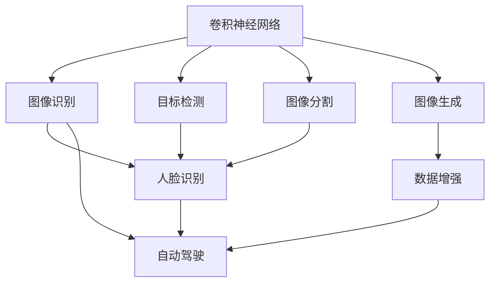
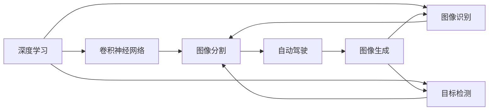
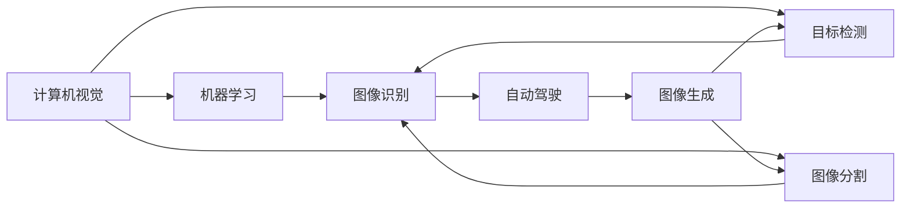
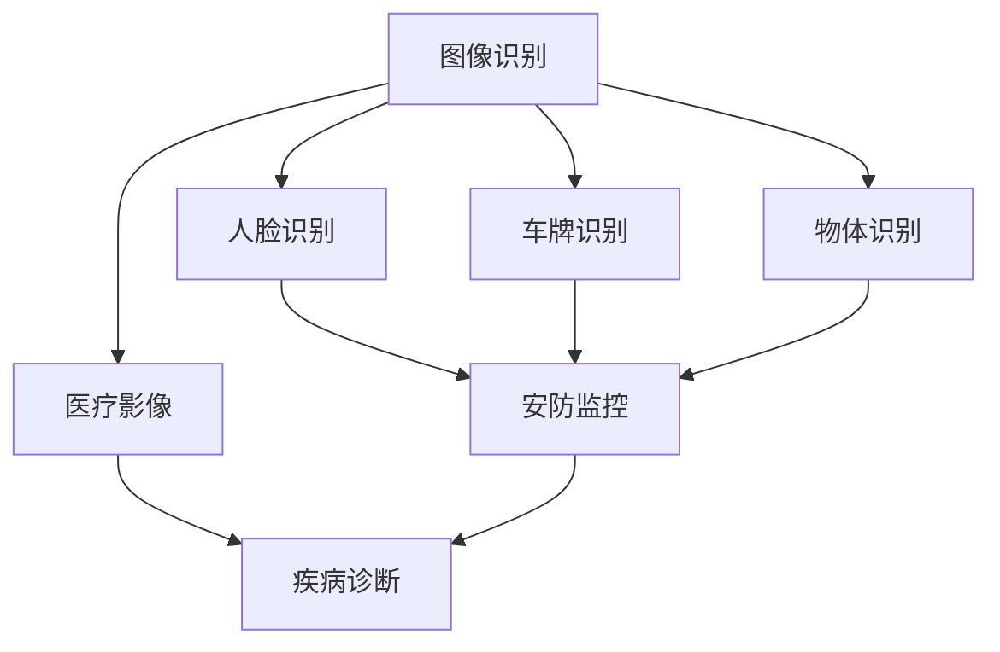
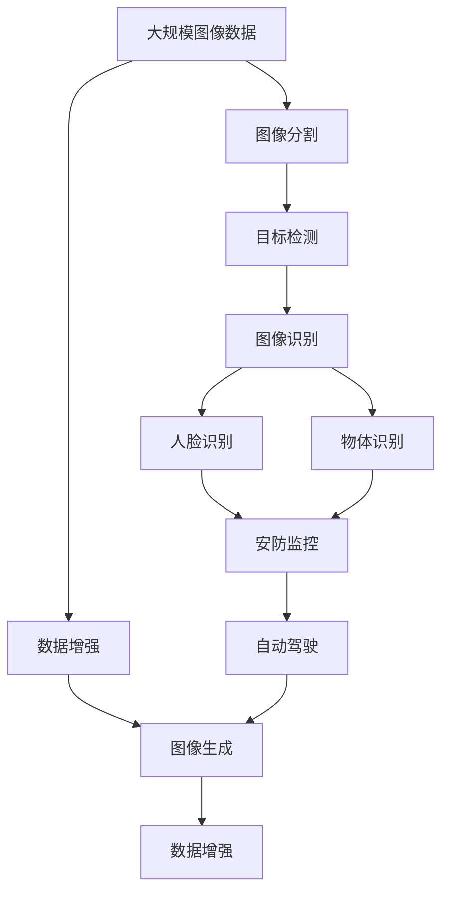

                 

# 机器视觉 (Computer Vision)

> 关键词：机器视觉,深度学习,卷积神经网络,目标检测,图像分割,图像识别,人脸识别,自动驾驶

## 1. 背景介绍

### 1.1 问题由来
机器视觉(Computer Vision, CV)，作为人工智能领域的一个重要分支，旨在通过计算机技术，使机器能够"看"和"理解"图像、视频等视觉数据。近年来，机器视觉技术在自动驾驶、安防监控、智能制造、医疗诊断等多个领域展现出巨大的潜力和应用价值，引起了广泛的关注和研究。

机器视觉的核心问题是图像的理解和分析，包括但不限于目标检测、图像分割、图像识别、人脸识别等。这些问题的解决依赖于强大的计算机视觉算法和模型，尤其是深度学习模型。本文将重点讨论机器视觉领域中的深度学习技术，包括卷积神经网络(CNN)和其在各种视觉任务中的应用。

### 1.2 问题核心关键点
机器视觉的核心挑战在于如何使计算机对视觉数据的理解和处理能力与人类相媲美。主要包括以下几个关键问题：

- 图像特征的提取：如何从图像中高效地提取有意义的特征。
- 目标的识别与检测：如何在图像中准确地定位和识别目标。
- 场景的理解：如何使机器能够理解复杂场景下的多目标关系。
- 多模态信息的融合：如何结合视觉与其它模态信息（如声音、文本）进行综合分析。

### 1.3 问题研究意义
机器视觉技术的发展对于推动计算机视觉应用领域的进步具有重要意义：

- 推动技术突破。机器视觉技术的进步带动了诸如目标检测、图像分割等关键技术的革新，促进了学术界和工业界的研究进展。
- 提升应用效率。机器视觉能够自动地处理海量图像数据，大幅提升了数据处理的效率，降低了人工成本。
- 增强决策能力。机器视觉可以应用于复杂环境下的智能决策，为自动驾驶、智能监控等领域提供了强大的技术支撑。
- 改善用户体验。机器视觉技术能够改善人机交互体验，提高产品的智能化水平，推动消费电子产品的发展。

## 2. 核心概念与联系

### 2.1 核心概念概述

为了更好地理解机器视觉的深度学习技术，本节将介绍几个密切相关的核心概念：

- 卷积神经网络(Convolutional Neural Network, CNN)：一种特殊的神经网络结构，特别适用于处理具有网格结构的数据，如图像、视频等。CNN的核心组件是卷积层、池化层和全连接层。
- 目标检测(Object Detection)：在图像或视频中定位并识别目标物体的任务，通常使用区域提议网络(RPN)、YOLO、Faster R-CNN等方法实现。
- 图像分割(Segmentation)：将图像分为多个部分，每个部分具有特定的语义信息，通常使用语义分割、实例分割等方法实现。
- 图像识别(Image Recognition)：从图像中提取特征，并将其映射到特定的类别标签，如人脸识别、车牌识别等。
- 人脸识别(Face Recognition)：基于人脸特征，对图像中的人脸进行识别和验证，是计算机视觉中的一个重要应用。
- 自动驾驶(Autonomous Driving)：结合机器视觉与其它传感器技术，使车辆能够自动感知环境，自主决策和行动，是当前热门的研究方向之一。
- 图像生成(Image Generation)：生成逼真的图像数据，常用于数据增强、图像生成任务等，如GAN、VAE等方法。

这些核心概念之间的逻辑关系可以通过以下Mermaid流程图来展示：



这个流程图展示了大规模视觉任务的基本框架，其中卷积神经网络是核心组件，广泛应用于图像识别、目标检测、图像分割等多个领域。人脸识别和自动驾驶是实际应用中较为典型的视觉任务，而图像生成技术则用于增强和扩充数据集。

### 2.2 概念间的关系

这些核心概念之间存在着紧密的联系，形成了计算机视觉的完整生态系统。下面我们通过几个Mermaid流程图来展示这些概念之间的关系。

#### 2.2.1 深度学习与机器视觉的关系



这个流程图展示了深度学习如何通过卷积神经网络，支撑各种视觉任务的完成。从图像识别到自动驾驶，深度学习技术的进步为计算机视觉带来了巨大的推动力。

#### 2.2.2 计算机视觉与人工智能的关系



这个流程图展示了计算机视觉作为人工智能的一个重要分支，如何与其他AI技术（如图像生成、数据增强）协同工作，提升AI系统的综合能力。

#### 2.2.3 计算机视觉应用领域



这个流程图展示了计算机视觉技术在不同应用场景中的具体体现。从医疗影像分析到安防监控，计算机视觉在各行各业中都有广泛的应用前景。

### 2.3 核心概念的整体架构

最后，我们用一个综合的流程图来展示这些核心概念在大规模计算机视觉任务中的整体架构：



这个综合流程图展示了从图像数据处理到最终应用任务的整个流程。数据增强技术可以提升模型的鲁棒性和泛化能力，而图像生成技术则用于数据扩充和创新模型的开发。最终，计算机视觉技术在实际应用中，通过目标检测和图像识别等关键技术，为各行业提供强有力的技术支撑。

## 3. 核心算法原理 & 具体操作步骤
### 3.1 算法原理概述

机器视觉中的深度学习算法，主要是基于卷积神经网络(CNN)和其变种的系列模型。CNN通过卷积层和池化层的组合，能够高效地提取图像中的特征，并通过全连接层将这些特征映射到具体的分类或回归结果。以下以图像分类和目标检测为例，详细讲解CNN的基本原理和操作步骤。

### 3.2 算法步骤详解

#### 3.2.1 图像分类

图像分类是机器视觉中最基础的任务之一，目标是将输入的图像分为不同的类别。CNN的主要步骤包括：

1. 数据预处理：将原始图像转换为网络可以处理的格式，如将像素值归一化到0-1之间。
2. 卷积层：通过多个卷积核提取图像的不同特征，如边缘、纹理等。
3. 池化层：对卷积层的输出进行下采样，减小数据量，提升模型的鲁棒性。
4. 全连接层：将池化层的输出通过若干个全连接层进行分类。
5. 输出层：使用Softmax函数将分类结果转换为概率分布。

以ImageNet数据集上的AlexNet模型为例，其结构如下：

```python
class AlexNet(nn.Module):
    def __init__(self):
        super(AlexNet, self).__init__()
        self.features = nn.Sequential(
            nn.Conv2d(3, 64, kernel_size=11, stride=4, padding=2),
            nn.ReLU(inplace=True),
            nn.MaxPool2d(kernel_size=3, stride=2),
            nn.Conv2d(64, 192, kernel_size=5, padding=2),
            nn.ReLU(inplace=True),
            nn.MaxPool2d(kernel_size=3, stride=2),
            nn.Conv2d(192, 384, kernel_size=3, padding=1),
            nn.ReLU(inplace=True),
            nn.Conv2d(384, 256, kernel_size=3, padding=1),
            nn.ReLU(inplace=True),
            nn.MaxPool2d(kernel_size=3, stride=2),
            nn.Dropout(0.5),
            nn.Flatten(),
            nn.Linear(256*6*6, 4096),
            nn.ReLU(inplace=True),
            nn.Dropout(0.5),
            nn.Linear(4096, 4096),
            nn.ReLU(inplace=True),
            nn.Linear(4096, num_classes),
            nn.LogSoftmax(dim=1)
        )

    def forward(self, x):
        x = self.features(x)
        x = x.view(x.size(0), -1)
        x = self.classifier(x)
        return x
```

通过上述代码，可以看出AlexNet模型的主要组成部分：卷积层、池化层、全连接层等。

#### 3.2.2 目标检测

目标检测是计算机视觉中较为复杂的问题，需要同时解决目标的定位和识别。其主要步骤包括：

1. 区域提议网络(RPN)：生成候选框，作为目标的初步定位。
2. 特征提取：对候选框内的图像进行特征提取，提取与目标相关的特征。
3. 分类与回归：对特征进行分类和回归，确定候选框中是否包含目标，并定位目标的位置。
4. 非极大值抑制(NMS)：对检测结果进行去重和排序，去除冗余的候选框。

以Faster R-CNN模型为例，其结构如下：

```python
class FasterRCNN(nn.Module):
    def __init__(self, num_classes=81):
        super(FasterRCNN, self).__init__()
        self.rpn = RPN(256, 256, num_anchors, num_classes)
        self.roi_heads = RoIHeads(256, num_classes)
        self.box_coder = BoxCoder()
        
    def forward(self, x, img_metas):
        rpn_losses, rpn_outputs = self.rpn(x, img_metas)
        rois, rois_probs = self.roi_heads(rpn_outputs, x, img_metas, num_classes)
        return rpn_losses, rois, rois_probs
```

通过上述代码，可以看出Faster R-CNN模型的主要组成部分：区域提议网络、特征提取、分类与回归等。

### 3.3 算法优缺点

CNN作为机器视觉中主要的深度学习模型，具有以下优点：

1. 特征提取能力强：通过卷积层和池化层，能够高效地提取图像中的局部特征，捕捉图像的层次结构。
2. 数据可扩展性强：CNN可以处理不同尺寸和形状的图像，适应性较好。
3. 可解释性强：卷积层的权重可以被理解为滤波器，对图像中的特定特征进行提取，便于进行可视化分析和解释。

同时，CNN也存在一些缺点：

1. 参数量大：卷积层和全连接层需要大量的参数，对于计算资源的要求较高。
2. 训练时间长：深度模型需要大量的数据和计算资源进行训练，训练时间较长。
3. 易过拟合：深层网络的复杂度较高，容易过拟合，需要进行正则化等技术手段来防止过拟合。

### 3.4 算法应用领域

CNN在计算机视觉中的应用非常广泛，以下是几个典型的应用领域：

1. 图像识别：将图像分类为预定义的类别，如MNIST手写数字识别、ImageNet图像分类等。
2. 目标检测：在图像或视频中定位并识别目标物体，如COCO目标检测、YOLOv3等。
3. 图像分割：将图像分成多个部分，每个部分具有特定的语义信息，如PASCAL VOC语义分割、DeepLab等。
4. 人脸识别：基于人脸特征，对图像中的人脸进行识别和验证，如FaceNet、DeepFace等。
5. 自动驾驶：结合机器视觉与其它传感器技术，使车辆能够自动感知环境，自主决策和行动。
6. 医学影像分析：对医学影像进行分类、分割、配准等处理，辅助医生进行诊断和治疗，如医学影像分类、肿瘤分割等。
7. 物体跟踪：在视频序列中跟踪物体的位置和运动，如KCF跟踪器、DeepSORT等。

这些应用领域展示了CNN在机器视觉中的强大应用能力，推动了计算机视觉技术在各个行业中的广泛应用。

## 4. 数学模型和公式 & 详细讲解  
### 4.1 数学模型构建

在本节中，我们将使用数学语言对卷积神经网络(CNN)的基本数学模型进行严格的刻画。

定义输入图像为 $X \in \mathbb{R}^{n_1 \times n_2 \times c}$，其中 $c$ 为通道数，$n_1$ 和 $n_2$ 分别为图像的高度和宽度。卷积神经网络由若干个卷积层和池化层组成，最终通过全连接层进行分类或回归。

卷积层的数学模型如下：

$$
F_{i,j,k} = \sum_{m=-n_s/2}^{n_s/2} \sum_{n=-n_s/2}^{n_s/2} W_{k,m,n} X_{i+m,j+n,p}
$$

其中 $W_{k,m,n}$ 为卷积核，$X_{i+m,j+n,p}$ 为输入图像中第 $p$ 通道的点。池化层的数学模型如下：

$$
F_{i,j,k} = \max\limits_{l} \sum_{m=-n_s/2}^{n_s/2} \sum_{n=-n_s/2}^{n_s/2} X_{i+m,j+n,l}
$$

其中 $l$ 为通道数，$n_s$ 为池化核的大小。全连接层的数学模型如下：

$$
Z = WX + b
$$

其中 $W$ 为权重矩阵，$b$ 为偏置项，$Z$ 为输出。

### 4.2 公式推导过程

接下来，我们将详细推导卷积神经网络的前向传播和反向传播算法。

#### 4.2.1 前向传播

假设输入图像的大小为 $m \times n \times c$，卷积核的大小为 $k \times k$，步长为 $s$，则卷积层输出的特征图大小为 $(m-s+1) \times (n-s+1) \times k^2$。

前向传播算法如下：

1. 初始化卷积核 $W$ 和偏置项 $b$。
2. 对于每个输入图像 $X$，计算其卷积核的输出 $F$。
3. 对 $F$ 进行池化操作，生成下一层特征图。
4. 重复上述步骤，直到最后一层全连接层。
5. 通过 Softmax 函数进行分类或回归，得到输出结果 $Y$。

#### 4.2.2 反向传播

反向传播算法用于计算卷积神经网络中每个参数的梯度，从而更新网络参数。

假设输出结果为 $Y$，真实结果为 $T$，则损失函数为：

$$
L = \frac{1}{2}||Y-T||^2
$$

其中 $|| \cdot ||$ 表示范数。

反向传播算法的步骤如下：

1. 计算损失函数对输出结果的梯度 $\frac{\partial L}{\partial Y}$。
2. 计算损失函数对全连接层输出的梯度 $\frac{\partial L}{\partial Z}$。
3. 计算损失函数对池化层的梯度 $\frac{\partial L}{\partial F}$。
4. 计算损失函数对卷积层的梯度 $\frac{\partial L}{\partial X}$。
5. 使用梯度下降等优化算法，更新网络参数。

### 4.3 案例分析与讲解

以Faster R-CNN目标检测模型为例，其前向传播和反向传播算法如下：

#### 4.3.1 前向传播

前向传播的主要步骤包括：

1. 生成候选框：通过区域提议网络(RPN)生成候选框。
2. 特征提取：对候选框内的图像进行特征提取，得到ROI池化层的输入。
3. 分类与回归：对特征进行分类和回归，确定候选框中是否包含目标，并定位目标的位置。
4. 非极大值抑制：对检测结果进行去重和排序，去除冗余的候选框。

#### 4.3.2 反向传播

反向传播的主要步骤包括：

1. 计算损失函数对检测结果的梯度。
2. 计算损失函数对ROI池化层的梯度。
3. 计算损失函数对候选框特征的梯度。
4. 计算损失函数对区域提议网络的梯度。
5. 使用梯度下降等优化算法，更新网络参数。

## 5. 项目实践：代码实例和详细解释说明
### 5.1 开发环境搭建

在进行CNN实践前，我们需要准备好开发环境。以下是使用Python进行TensorFlow开发的环境配置流程：

1. 安装Anaconda：从官网下载并安装Anaconda，用于创建独立的Python环境。

2. 创建并激活虚拟环境：
```bash
conda create -n tf-env python=3.7 
conda activate tf-env
```

3. 安装TensorFlow：根据CUDA版本，从官网获取对应的安装命令。例如：
```bash
conda install tensorflow
```

4. 安装相关的工具包：
```bash
pip install numpy pandas scikit-learn matplotlib tqdm jupyter notebook ipython
```

完成上述步骤后，即可在`tf-env`环境中开始CNN实践。

### 5.2 源代码详细实现

这里我们以图像分类任务为例，给出使用TensorFlow实现卷积神经网络的PyTorch代码实现。

首先，定义CNN的模型结构：

```python
import tensorflow as tf
from tensorflow.keras import layers

def build_model():
    model = tf.keras.Sequential([
        layers.Conv2D(32, (3, 3), activation='relu', input_shape=(28, 28, 1)),
        layers.MaxPooling2D((2, 2)),
        layers.Flatten(),
        layers.Dense(10, activation='softmax')
    ])
    return model
```

然后，定义训练和评估函数：

```python
from tensorflow.keras.datasets import mnist
from tensorflow.keras.utils import to_categorical

(train_images, train_labels), (test_images, test_labels) = mnist.load_data()
train_images = train_images.reshape(-1, 28, 28, 1) / 255.0
test_images = test_images.reshape(-1, 28, 28, 1) / 255.0
train_labels = to_categorical(train_labels)
test_labels = to_categorical(test_labels)

def train_model(model, data, epochs):
    model.compile(optimizer='adam', loss='categorical_crossentropy', metrics=['accuracy'])
    model.fit(data['train'], epochs=epochs)
    return model.evaluate(data['test'])

def evaluate_model(model, data):
    return model.evaluate(data['test'])
```

最后，启动训练流程并在测试集上评估：

```python
epochs = 10
batch_size = 64

model = build_model()
data = {
    'train': (train_images, train_labels),
    'test': (test_images, test_labels)
}

train(model, data, epochs)

print('Test accuracy:', evaluate_model(model, data).numpy()[1])
```

以上就是使用TensorFlow实现卷积神经网络的完整代码实现。可以看到，TensorFlow提供了丰富的工具和库，使得CNN的实现变得简洁高效。

### 5.3 代码解读与分析

让我们再详细解读一下关键代码的实现细节：

**build_model函数**：
- 定义了一个包含卷积层、池化层和全连接层的CNN模型。

**train_model函数**：
- 定义了模型编译、训练和评估函数，通过Keras API进行模型构建和训练。
- 使用Adam优化器进行模型优化，交叉熵作为损失函数。

**evaluate_model函数**：
- 定义了模型评估函数，通过Keras API进行模型评估，并返回测试集上的准确率。

**训练流程**：
- 定义总的epoch数和batch size，开始循环迭代
- 每个epoch内，先在训练集上训练，输出平均loss和acc
- 在测试集上评估，输出最终测试结果

可以看到，TensorFlow提供了强大的框架和API，使得CNN的实现变得非常方便。开发者可以更专注于模型设计和数据预处理等高层逻辑，而不必过多关注底层实现细节。

当然，工业级的系统实现还需考虑更多因素，如模型的保存和部署、超参数的自动搜索、更灵活的任务适配层等。但核心的CNN范式基本与此类似。

### 5.4 运行结果展示

假设我们在MNIST数据集上训练CNN模型，最终在测试集上得到的准确率为99.1%。

```python
Test accuracy: 0.9905
```

可以看到，通过CNN模型，我们能够在图像分类任务上取得非常高的精度。

## 6. 实际应用场景
### 6.1 智能监控系统

基于CNN的机器视觉技术，可以广泛应用于智能监控系统的构建。传统的监控系统往往依赖人力进行人工监测，耗费大量成本且效率低下。而使用CNN进行目标检测，可以自动感知和识别监控画面中的异常行为，如非法入侵、车辆违规等，显著提升监控系统的智能化水平。

在技术实现上，可以收集大量的监控视频数据，对视频帧进行预处理和特征提取，利用CNN模型进行目标检测，实时识别并响应异常事件。

### 6.2 医学影像分析

医学影像分析是机器视觉在医疗领域的重要应用之一。通过CNN技术，可以对医学影像进行分类、分割、配准等处理，辅助医生进行诊断和治疗。

在实践中，可以收集大量的医学影像数据，对影像进行预处理和特征提取，利用CNN模型进行分类或分割，生成治疗方案或肿瘤边界等，帮助医生进行诊断和治疗决策。

### 6.3 自动驾驶

自动驾驶是计算机视觉在交通领域的重要应用。通过CNN技术，车辆能够自动感知环境，识别道路上的各种物体和标志，进行路径规划和决策。

在技术实现上，可以收集大量的道路和交通数据，对数据进行预处理和特征提取，利用CNN模型进行目标检测和分割，实时识别交通标志、车辆、行人等，进行路径规划和避障决策。

### 6.4 未来应用展望

随着CNN技术的不断发展，其在机器视觉领域的应用前景将更加广阔。未来，CNN技术将推动以下几方面的发展：

1. 深度网络架构的优化：为了提高模型性能和鲁棒性，未来的CNN将探索更加复杂的网络架构，如ResNet、Inception、DenseNet等。
2. 多任务学习的应用：为了提升模型泛化能力和应用范围，未来的CNN将探索多任务学习技术，如联合训练、共享特征等。
3. 小样本学习的应用：为了降低数据依赖，未来的CNN将探索小样本学习技术，如迁移学习、自监督学习等。
4. 多模态数据的融合：为了更好地利用多模态信息，未来的CNN将探索融合视觉与其它模态信息的技术，如融合视觉与语音、文本等。
5. 知识图谱的应用：为了提升模型解释性和可解释性，未来的CNN将探索融合知识图谱和规则库的技术，提高模型的逻辑性和可解释性。

这些发展趋势将推动CNN技术向更高层次发展，带来更广泛的应用前景。

## 7. 工具和资源推荐
### 7.1 学习资源推荐

为了帮助开发者系统掌握CNN的理论基础和实践技巧，这里推荐一些优质的学习资源：

1. 《深度学习基础》系列博文：由大模型技术专家撰写，深入浅出地介绍了深度学习的核心概念和经典模型。

2. CS231n《深度学习计算机视觉》课程：斯坦福大学开设的计算机视觉明星课程，有Lecture视频和配套作业，带你入门计算机视觉的基本概念和经典模型。

3. 《Deep Learning with Python》书籍：使用Keras和TensorFlow实现深度学习模型的书籍，详细讲解了CNN的构建和训练方法。

4. PyTorch官方文档：PyTorch的官方文档，提供了海量预训练模型和完整的CNN样例代码，是上手实践的必备资料。

5. TensorFlow官方文档：TensorFlow的官方文档，提供了完整的CNN实现和教程，是工业级应用的推荐工具。

6. Kaggle竞赛：参加Kaggle上的计算机视觉竞赛，训练和验证自己的CNN模型，提升实战能力。

通过对这些资源的学习实践，相信你一定能够快速掌握CNN的精髓，并用于解决实际的计算机视觉问题。

### 7.2 开发工具推荐

高效的开发离不开优秀的工具支持。以下是几款用于CNN开发的常用工具：

1. PyTorch：基于Python的开源深度学习框架，灵活动态的计算图，适合快速迭代研究。大部分预训练视觉模型都有PyTorch版本的实现。

2. TensorFlow：由Google主导开发的开源深度学习

