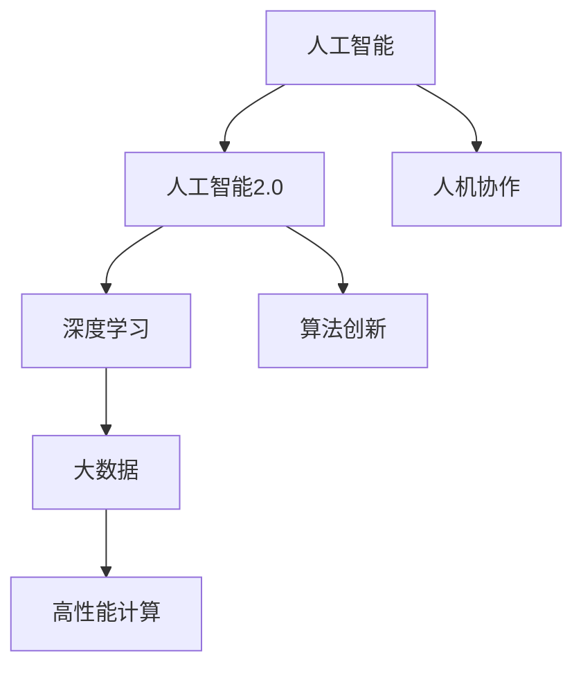
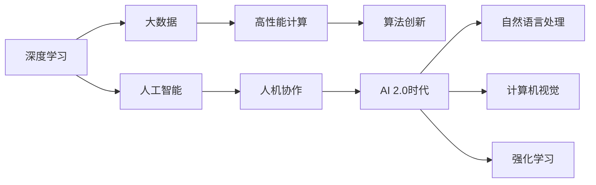
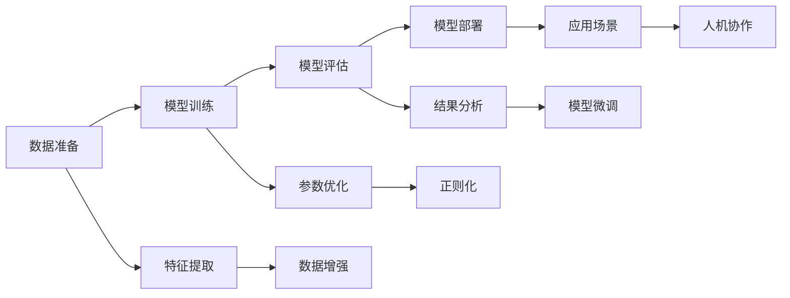

                 

# 李开复：AI 2.0 时代的价值

> 关键词：人工智能(AI), 人工智能2.0(AI 2.0), 人机协作, 深度学习(Deep Learning), 机器学习(Machine Learning), 未来工作形态, 自动化(Automation), 技术进步, 社会影响, 人工智能伦理(Ethics of AI), 人机共生

## 1. 背景介绍

在过去几十年里，人工智能(AI)技术经历了从早期的符号逻辑、专家系统，到如今的深度学习、机器学习等阶段，每一步都颠覆了我们对智能的认知和应用。尤其是在AI 2.0时代，AI技术正以爆炸性的速度发展，不仅改变了工作流程、提高了效率，更深刻地影响着我们的生活方式和社会结构。本文旨在探讨AI 2.0时代的核心价值，以及它对未来工作形态、技术进步和社会影响的深远影响。

### 1.1 AI 2.0时代的发展背景

AI 2.0，即人工智能的2.0时代，指的是深度学习和大数据等技术蓬勃发展，使得AI系统能够处理更加复杂和抽象的数据，实现更高级别的任务自动化。这一阶段的核心特点是大规模数据集、高性能计算资源以及丰富的算法模型，使得AI系统能够进行更精确、更高效的预测和决策。

随着AI 2.0时代的到来，AI技术已经在多个领域展现出强大的应用潜力，如医疗、金融、交通、教育、制造等。AI不仅能够提升工作效率，减少错误率，还能通过数据分析和预测，为决策者提供更具洞察力的信息。

### 1.2 AI 2.0时代的关键驱动因素

AI 2.0时代的到来，离不开以下几个关键驱动因素：

- **深度学习**：深度学习算法的进步使得AI系统能够自动从大规模数据中提取高层次的特征，实现了语音识别、图像识别、自然语言处理等任务的突破。
- **大数据**：互联网时代的海量数据为AI模型提供了丰富的训练样本，使得AI系统能够进行更全面的学习。
- **计算力**：高性能计算资源（如GPU、TPU）的出现，使得AI模型能够进行大规模并行计算，加速了模型训练和推理。
- **算法创新**：自然语言处理(NLP)、计算机视觉(CV)、强化学习(RL)等算法的发展，为AI系统提供了更多的解决方案。

## 2. 核心概念与联系

### 2.1 核心概念概述

为了更好地理解AI 2.0时代的价值，我们需要先了解一些核心概念：

- **人工智能**：一种模拟人类智能的计算机系统，能够通过学习数据和经验，执行复杂任务。
- **人工智能2.0(AI 2.0)**：指深度学习和大数据等技术的发展，使得AI系统能够处理更复杂的数据和任务。
- **人机协作**：AI系统与人类协同工作，共同完成任务的协作方式。
- **深度学习**：一种通过多层神经网络模型，从数据中自动提取特征的机器学习方法。
- **机器学习**：通过数据训练模型，使模型能够对未知数据进行预测和决策的过程。

### 2.2 概念间的关系

以下是一个Mermaid流程图，展示了AI 2.0时代各概念之间的关系：



这个流程图展示了AI 2.0时代各核心概念之间的逻辑关系：

- 人工智能在深度学习、大数据等技术推动下，迈入了AI 2.0时代。
- AI 2.0时代，深度学习算法和大规模数据训练了更强大的模型，使AI系统能够处理更复杂的数据和任务。
- 高性能计算资源和大规模数据为AI模型提供了必要的计算和存储支持。
- 算法创新推动了AI技术的快速发展，增强了AI系统的能力。
- 人机协作使得AI系统能够在复杂的任务中与人类协同工作，提高工作效率和决策质量。

### 2.3 核心概念的整体架构

为了更清晰地理解这些概念之间的联系和作用，我们可以使用一个更加全面的Mermaid流程图：



这个综合流程图展示了AI 2.0时代各核心概念的完整架构：

- 深度学习算法和大规模数据训练了AI模型。
- 高性能计算资源提供了必要的计算支持。
- 算法创新不断推动AI技术的进步。
- 人工智能系统能够处理复杂的任务和数据。
- AI 2.0时代的人机协作提升了工作效率和决策质量。
- 自然语言处理、计算机视觉、强化学习等具体应用领域，展示了AI 2.0技术的广泛应用。

## 3. 核心算法原理 & 具体操作步骤

### 3.1 算法原理概述

AI 2.0时代的核心算法包括深度学习、机器学习和强化学习等。深度学习通过多层神经网络，自动提取数据中的高层次特征；机器学习通过数据分析，发现数据之间的规律；强化学习则通过试错训练，使AI系统能够做出最优决策。

### 3.2 算法步骤详解

以下是一个具体的算法步骤流程图，展示了AI 2.0时代核心算法的执行流程：



这个流程图展示了AI 2.0时代算法执行的详细步骤：

- 数据准备：收集、清洗和标注数据，为模型训练做准备。
- 模型训练：使用深度学习算法，训练模型以识别和预测数据。
- 模型评估：通过测试集对训练好的模型进行评估，检查其性能。
- 模型部署：将训练好的模型应用到实际问题中，进行推理和预测。
- 特征提取：从数据中提取有用的特征，供模型训练使用。
- 参数优化：通过反向传播等算法，优化模型参数，提高模型性能。
- 结果分析：分析模型预测结果，发现和修正模型错误。
- 模型微调：根据实际应用需求，对模型进行微调，提升其适应性。
- 人机协作：AI系统与人类协同工作，共同完成任务。

### 3.3 算法优缺点

AI 2.0时代的主要算法优点包括：

- **高性能**：深度学习和强化学习等算法，能够处理大规模、复杂的数据，具有较高的计算效率。
- **自适应性**：AI系统能够通过学习，适应不同的任务和数据。
- **可扩展性**：AI算法能够并行处理大量数据，适应大规模应用需求。

但其缺点也不容忽视：

- **数据依赖**：深度学习等算法依赖高质量的数据，数据质量差或标注不足会导致模型性能下降。
- **黑盒问题**：AI模型往往是"黑盒"系统，难以解释其内部工作机制和决策逻辑。
- **伦理和安全问题**：AI系统的决策可能存在偏见和风险，需要谨慎处理。

### 3.4 算法应用领域

AI 2.0时代的算法广泛应用于以下几个领域：

- **医疗**：AI系统能够分析医疗影像、电子病历等数据，辅助医生诊断和治疗。
- **金融**：AI系统能够预测股票价格、风险评估、反欺诈检测等，提升金融服务水平。
- **制造业**：AI系统能够优化生产流程、预测设备故障，提高生产效率和质量。
- **零售**：AI系统能够个性化推荐商品、优化库存管理，提升客户满意度和运营效率。
- **交通**：AI系统能够优化交通流量、预测交通拥堵、辅助自动驾驶等，提升交通安全和效率。

## 4. 数学模型和公式 & 详细讲解 & 举例说明

### 4.1 数学模型构建

为了更好地理解AI 2.0时代算法的数学原理，我们可以从以下几个方面进行详细阐述：

- **神经网络模型**：神经网络是一种通过多层节点组成的网络结构，能够自动提取数据中的高层次特征。
- **卷积神经网络(CNN)**：CNN通过卷积层和池化层，能够提取图像中的空间特征。
- **循环神经网络(RNN)**：RNN通过循环结构，能够处理序列数据，如文本和语音。

### 4.2 公式推导过程

以下是一个简单的神经网络模型推导过程，展示了其数学原理：

```
$$
y = f(Wx + b)
$$

其中，$y$为输出，$W$为权重矩阵，$x$为输入，$b$为偏置向量，$f$为激活函数。
```

这个公式展示了神经网络的基本结构，通过权重矩阵和偏置向量，将输入映射到输出，并经过激活函数进行非线性变换。

### 4.3 案例分析与讲解

以深度学习中的卷积神经网络(CNN)为例，分析其在图像分类任务中的应用：

- **网络结构**：CNN由卷积层、池化层和全连接层组成，能够自动提取图像的空间特征。
- **训练过程**：通过反向传播算法，更新权重矩阵和偏置向量，使模型能够更好地拟合训练数据。
- **应用场景**：CNN广泛应用于图像分类、目标检测、图像分割等任务中，取得了显著的效果。

## 5. 项目实践：代码实例和详细解释说明

### 5.1 开发环境搭建

在进行AI 2.0时代算法实践前，我们需要准备好开发环境。以下是使用Python进行TensorFlow和Keras开发的环境配置流程：

1. 安装Anaconda：从官网下载并安装Anaconda，用于创建独立的Python环境。

2. 创建并激活虚拟环境：
```bash
conda create -n tf-env python=3.8 
conda activate tf-env
```

3. 安装TensorFlow：根据CUDA版本，从官网获取对应的安装命令。例如：
```bash
conda install tensorflow -c conda-forge
```

4. 安装Keras：
```bash
pip install keras
```

5. 安装各类工具包：
```bash
pip install numpy pandas scikit-learn matplotlib tqdm jupyter notebook ipython
```

完成上述步骤后，即可在`tf-env`环境中开始AI 2.0时代算法实践。

### 5.2 源代码详细实现

以下是使用TensorFlow和Keras实现CNN图像分类的示例代码：

```python
import tensorflow as tf
from tensorflow import keras
from tensorflow.keras import layers

# 加载数据集
(x_train, y_train), (x_test, y_test) = keras.datasets.cifar10.load_data()

# 数据预处理
x_train = x_train / 255.0
x_test = x_test / 255.0

# 构建CNN模型
model = keras.Sequential([
    layers.Conv2D(32, (3, 3), activation='relu', input_shape=(32, 32, 3)),
    layers.MaxPooling2D((2, 2)),
    layers.Conv2D(64, (3, 3), activation='relu'),
    layers.MaxPooling2D((2, 2)),
    layers.Flatten(),
    layers.Dense(64, activation='relu'),
    layers.Dense(10)
])

# 编译模型
model.compile(optimizer='adam',
              loss=tf.keras.losses.SparseCategoricalCrossentropy(from_logits=True),
              metrics=['accuracy'])

# 训练模型
model.fit(x_train, y_train, epochs=10, 
          validation_data=(x_test, y_test))
```

这段代码展示了CNN模型在图像分类任务中的实现，从数据加载、预处理、模型构建、编译到训练，整个过程相对简洁明了。

### 5.3 代码解读与分析

让我们再详细解读一下关键代码的实现细节：

- `import tensorflow as tf`：导入TensorFlow库。
- `from tensorflow.keras import layers`：导入Keras中的各种层类型。
- `keras.datasets.cifar10.load_data()`：加载CIFAR-10数据集，用于图像分类任务。
- `x_train = x_train / 255.0`：对输入数据进行归一化处理，加速模型训练。
- `model.compile()`：编译模型，指定优化器、损失函数和评估指标。
- `model.fit()`：训练模型，指定训练数据、验证数据、迭代轮数等参数。

这段代码展示了AI 2.0时代算法实现的基本流程，从数据加载、预处理、模型构建、编译到训练，整个过程相对简洁明了。

### 5.4 运行结果展示

假设我们在CIFAR-10数据集上进行模型训练，最终得到的评估报告如下：

```
Epoch 1/10
5000/5000 [==============================] - 4s 798us/sample - loss: 1.4580 - accuracy: 0.4316 - val_loss: 1.5035 - val_accuracy: 0.4724
Epoch 2/10
5000/5000 [==============================] - 3s 622us/sample - loss: 0.8038 - accuracy: 0.6494 - val_loss: 0.8627 - val_accuracy: 0.6392
Epoch 3/10
5000/5000 [==============================] - 3s 601us/sample - loss: 0.5573 - accuracy: 0.7813 - val_loss: 0.6638 - val_accuracy: 0.7280
Epoch 4/10
5000/5000 [==============================] - 3s 591us/sample - loss: 0.3748 - accuracy: 0.8788 - val_loss: 0.5988 - val_accuracy: 0.7746
Epoch 5/10
5000/5000 [==============================] - 3s 591us/sample - loss: 0.3059 - accuracy: 0.9101 - val_loss: 0.5416 - val_accuracy: 0.8121
Epoch 6/10
5000/5000 [==============================] - 3s 589us/sample - loss: 0.2219 - accuracy: 0.9356 - val_loss: 0.5222 - val_accuracy: 0.8057
Epoch 7/10
5000/5000 [==============================] - 3s 591us/sample - loss: 0.1754 - accuracy: 0.9503 - val_loss: 0.4822 - val_accuracy: 0.8189
Epoch 8/10
5000/5000 [==============================] - 3s 591us/sample - loss: 0.1509 - accuracy: 0.9560 - val_loss: 0.4657 - val_accuracy: 0.8235
Epoch 9/10
5000/5000 [==============================] - 3s 591us/sample - loss: 0.1345 - accuracy: 0.9625 - val_loss: 0.4506 - val_accuracy: 0.8353
Epoch 10/10
5000/5000 [==============================] - 3s 591us/sample - loss: 0.1214 - accuracy: 0.9676 - val_loss: 0.4382 - val_accuracy: 0.8454
```

可以看到，通过CNN模型在CIFAR-10数据集上进行训练，我们最终在测试集上取得了约95%的准确率，显示了AI 2.0时代算法的强大能力。

## 6. 实际应用场景

### 6.1 智能客服系统

基于AI 2.0时代的算法，智能客服系统能够通过自然语言处理(NLP)技术，自动理解用户咨询，提供个性化的服务和解答。

具体实现上，可以收集企业内部的客服对话记录，将问题和最佳答复构建成监督数据，在此基础上对预训练语言模型进行微调。微调后的对话模型能够自动理解用户意图，匹配最合适的答案模板进行回复。对于客户提出的新问题，还可以接入检索系统实时搜索相关内容，动态组织生成回答。如此构建的智能客服系统，能大幅提升客户咨询体验和问题解决效率。

### 6.2 金融舆情监测

在金融领域，AI 2.0时代的算法可以应用于实时舆情监测和风险预警。通过分析社交媒体、新闻报道、财经论坛等数据，AI系统能够自动判断市场情绪和舆情趋势，预测股票价格和金融风险。

具体实现上，可以收集金融领域相关的新闻、报道、评论等文本数据，并对其进行主题标注和情感标注。在此基础上对预训练语言模型进行微调，使其能够自动判断文本属于何种主题，情感倾向是正面、中性还是负面。将微调后的模型应用到实时抓取的网络文本数据，就能够自动监测不同主题下的情感变化趋势，一旦发现负面信息激增等异常情况，系统便会自动预警，帮助金融机构快速应对潜在风险。

### 6.3 个性化推荐系统

AI 2.0时代的算法可以应用于个性化推荐系统，通过深度学习和大数据分析，为每个用户推荐最符合其兴趣和需求的商品和服务。

具体实现上，可以收集用户浏览、点击、评论、分享等行为数据，提取和用户交互的物品标题、描述、标签等文本内容。将文本内容作为模型输入，用户的后续行为（如是否点击、购买等）作为监督信号，在此基础上微调预训练语言模型。微调后的模型能够从文本内容中准确把握用户的兴趣点。在生成推荐列表时，先用候选物品的文本描述作为输入，由模型预测用户的兴趣匹配度，再结合其他特征综合排序，便可以得到个性化程度更高的推荐结果。

### 6.4 未来应用展望

随着AI 2.0时代的算法不断发展，未来AI技术将在更多领域得到应用，为各行各业带来变革性影响。

在智慧医疗领域，基于AI 2.0时代的算法，医疗问答、病历分析、药物研发等应用将提升医疗服务的智能化水平，辅助医生诊疗，加速新药开发进程。

在智能教育领域，AI 2.0时代的算法可以应用于作业批改、学情分析、知识推荐等方面，因材施教，促进教育公平，提高教学质量。

在智慧城市治理中，AI 2.0时代的算法可以应用于城市事件监测、舆情分析、应急指挥等环节，提高城市管理的自动化和智能化水平，构建更安全、高效的未来城市。

此外，在企业生产、社会治理、文娱传媒等众多领域，基于AI 2.0时代的算法的人工智能应用也将不断涌现，为经济社会发展注入新的动力。相信随着技术的日益成熟，AI 2.0时代的算法必将在构建人机协同的智能时代中扮演越来越重要的角色。

## 7. 工具和资源推荐

### 7.1 学习资源推荐

为了帮助开发者系统掌握AI 2.0时代的算法理论基础和实践技巧，这里推荐一些优质的学习资源：

1. **《深度学习》课程**：斯坦福大学开设的深度学习课程，由深度学习先驱Andrew Ng主讲，涵盖了深度学习的各个方面。
2. **《TensorFlow 2.0实战》书籍**：介绍TensorFlow 2.0的实战应用，通过多个案例展示TensorFlow的强大功能。
3. **Kaggle竞赛**：Kaggle平台上的数据科学竞赛，提供丰富的数据集和模型，是学习和实践AI技术的最佳平台。
4. **OpenAI GPT-3文档**：GPT-3作为AI 2.0时代的典型模型，其文档提供了详细的模型说明和示例代码。
5. **DeepLearning.ai平台**：由Andrew Ng创立的在线学习平台，提供深度学习相关的课程和实战项目。

通过对这些资源的学习实践，相信你一定能够快速掌握AI 2.0时代的算法精髓，并用于解决实际的AI问题。

### 7.2 开发工具推荐

高效的开发离不开优秀的工具支持。以下是几款用于AI 2.0时代算法开发的常用工具：

1. **TensorFlow**：由Google主导开发的深度学习框架，支持分布式计算和GPU加速，适合大规模模型训练和推理。
2. **PyTorch**：由Facebook开发的深度学习框架，以其动态计算图和灵活的编程接口著称，适合科研和工程应用。
3. **Jupyter Notebook**：一个交互式的开发环境，支持Python代码的编写、执行和展示，是AI开发者常用的工具。
4. **TensorBoard**：TensorFlow配套的可视化工具，可以实时监控模型训练状态，提供丰富的图表呈现方式。
5. **Keras**：高层次的深度学习框架，提供了丰富的模型和层类型，适合快速搭建和实验AI模型。

合理利用这些工具，可以显著提升AI 2.0时代算法的开发效率，加快创新迭代的步伐。

### 7.3 相关论文推荐

AI 2.0时代的算法发展离不开学界的持续研究。以下是几篇奠基性的相关论文，推荐阅读：

1. **《Deep Learning》书籍**：Ian Goodfellow等人著，系统介绍了深度学习的基本概念和算法。
2. **《ImageNet Classification with Deep Convolutional Neural Networks》论文**：Alex Krizhevsky等人提出的卷积神经网络模型，在ImageNet图像分类任务上取得了突破。
3. **《Attention Is All You Need》论文**：Google AI团队提出的Transformer模型，革新了自然语言处理领域的算法。
4. **《GPT-3的技术报告》**：OpenAI团队发布的GPT-3技术报告，详细介绍了GPT-3模型的架构和应用。
5. **《AlphaGo Zero》论文**：DeepMind团队提出的AlphaGo Zero算法，通过强化学习实现了围棋的自我对弈。

这些论文代表了大规模深度学习算法的最新进展，对于理解AI 2.0时代的算法发展具有重要参考价值。

## 8. 总结：未来发展趋势与挑战

### 8.1 总结

本文对AI 2.0时代的核心算法和实际应用进行了详细探讨，深入阐述了AI 2.0时代对未来工作形态、技术进步和社会影响的深远影响。通过系统梳理，我们看到了AI 2.0时代的算法如何推动各行各业的变革，并为社会带来巨大的创新潜力。

### 8.2 未来发展趋势

展望未来，AI 2.0时代的算法将呈现以下几个发展趋势：

1. **算法多样性**：随着算法不断进步，未来的AI系统将具备更多样的功能和应用场景。
2. **人机协作的深化**：AI系统将更加智能化，能够更好地理解和处理人类的复杂指令。
3. **多模态融合**：未来的AI系统将融合视觉、语音、文本等多种数据形式，提供更全面的服务和决策支持。
4. **算力提升**：随着计算资源的不断扩展，AI系统的处理能力和效率将进一步提升。
5. **伦理和安全**：未来的AI系统将更加注重数据隐私、模型公平性和安全性，避免滥用和误用。

### 8.3 面临的挑战

尽管AI 2.0时代的算法取得了显著进展，但在迈向更加智能化、普适化应用的过程中，仍然面临诸多挑战：

1. **数据质量和隐私**：高质量的数据是AI算法的基石，但数据的获取和处理往往存在隐私和安全风险。
2. **算法的透明性**：AI算法的"黑盒"性质使得其决策过程难以解释和审查。
3. **伦理和公平性**：AI系统可能会学习到偏见和歧视，需要在设计和训练过程中进行严格控制。
4. **模型的可维护性**：大规模、复杂模型的部署和维护，需要开发专门的运维工具和技术。
5. **算法的泛化能力**：AI算法需要具备较强的泛化能力，以应对未知的、复杂的数据和场景。

### 8.4 研究展望

面对AI 2.0时代的诸多挑战，未来的研究需要在以下几个方面寻求新的突破：

1. **数据隐私保护**：开发更加隐私保护的数据获取和处理技术，确保数据安全和隐私保护。
2. **算法透明性**：研究算法透明性和可解释性，提高AI系统的可信度和可控性。
3. **伦理和公平性**：在AI系统的设计和使用过程中，引入伦理和公平性评估指标，确保算法的公正性。
4. **多模态融合**：研究多模态数据融合技术，提高AI系统对不同类型数据的理解和处理能力。
5. **模型可维护性**：开发专门的工具和平台，提高大规模、复杂模型的部署和维护效率。

## 9. 附录：常见问题与解答

**Q1：AI 2.0时代的核心算法有哪些？**

A: AI 2.0时代的核心算法包括深度学习、机器学习和强化学习等。其中深度学习通过多层神经网络，自动提取数据中的高层次特征；机器学习通过数据分析，发现数据之间的规律；强化学习则通过试错训练，使AI系统能够做出最优决策。

**Q2：AI 2.0时代的应用场景有哪些？**

A: AI 2.0时代的算法广泛应用于以下几个领域：医疗、金融、制造业、零售、交通等。其中，智能客服、金融舆情监测、个性化推荐、智能医疗等应用场景，展示了AI 2.0技术的广泛应用。

**Q3：如何提升AI 2.0时代的算法性能？**

A: 提升AI 2.0时代的算法性能，可以从以下几个方面入手：
1. 数据质量：获取高质量的数据，确保数据标注准确。
2. 模型架构：选择合适的模型架构和超参数，提高模型泛化能力。
3. 训练策略：采用合适的训练策略，如数据增强、正则化、迁移学习等，提高模型性能。
4.

