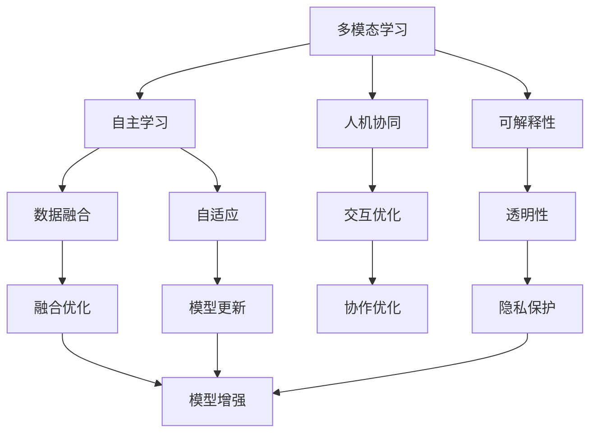
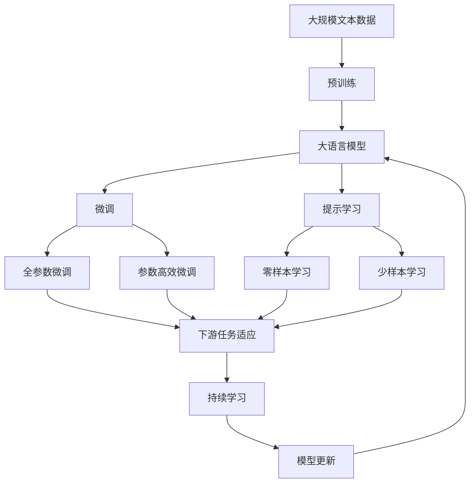

                 

## 1. 背景介绍

### 1.1 问题由来
人工智能（AI）是21世纪最重要的技术之一，它正在以前所未有的速度改变我们的世界。从深度学习、自然语言处理、计算机视觉到自动驾驶，AI技术已经渗透到各行各业。然而，随着技术的快速迭代和应用场景的不断扩展，AI 1.0时代（即传统的机器学习与深度学习）的技术局限性逐渐显现。未来，AI 2.0时代将带来全新的突破和发展方向。

### 1.2 问题核心关键点
AI 2.0时代，指的是基于人工智能技术构建的智能系统，这些系统不仅能处理结构化数据，还能理解和处理非结构化数据，并在不断学习中自我优化。AI 2.0时代的核心关键点包括：

1. **多模态学习**：AI 2.0系统能同时处理多种类型的输入数据，如文本、图像、声音等。
2. **自主学习**：系统能够自主学习、自适应，并在实际应用中不断优化。
3. **人机协同**：AI 2.0系统不仅能够独立工作，还能与人类紧密协作，共同完成任务。
4. **可解释性**：系统能够提供清晰、可信的决策解释，增强用户信任。
5. **伦理与安全性**：AI 2.0系统需要确保数据隐私、算法透明，并遵守伦理规范。

### 1.3 问题研究意义
理解AI 2.0时代的未来，对于科技界、产业界以及社会各界都具有重要意义：

1. **推动技术创新**：AI 2.0技术的发展将带来新的研究方向和技术突破，推动AI技术的不断进步。
2. **促进产业发展**：AI 2.0技术的应用将带来新的商业模式和行业机会，推动经济增长。
3. **提升社会福祉**：AI 2.0技术在医疗、教育、环保等领域的应用，将改善人们的生活质量。
4. **增强安全性**：AI 2.0技术在网络安全、反欺诈等领域的应用，将提高社会安全性。

## 2. 核心概念与联系

### 2.1 核心概念概述

在AI 2.0时代，以下几个核心概念对技术发展至关重要：

- **多模态学习**：指的是AI系统能够处理多种类型的数据，如文本、图像、声音等。
- **自主学习**：AI系统能够自主学习、自适应，并在实际应用中不断优化。
- **人机协同**：AI系统不仅能够独立工作，还能与人类紧密协作，共同完成任务。
- **可解释性**：AI系统能够提供清晰、可信的决策解释，增强用户信任。
- **伦理与安全性**：AI系统需要确保数据隐私、算法透明，并遵守伦理规范。

这些核心概念之间存在着紧密的联系，构成了AI 2.0时代的完整生态系统。

### 2.2 概念间的关系

这些核心概念之间的关系可以通过以下Mermaid流程图来展示：



这个流程图展示了大语言模型微调过程中各个核心概念之间的关系：

1. 多模态学习为自主学习提供多样化的数据输入。
2. 自主学习使系统能够自适应、自优化，从而提升人机协同效果。
3. 人机协同为可解释性提供可信的决策基础。
4. 可解释性增强用户信任，促进伦理与安全性。
5. 伦理与安全性是所有AI系统的基础，保障数据隐私和系统透明。

### 2.3 核心概念的整体架构

最后，我们用一个综合的流程图来展示这些核心概念在大语言模型微调过程中的整体架构：



这个综合流程图展示了从预训练到微调，再到持续学习的完整过程。大语言模型首先在大规模文本数据上进行预训练，然后通过微调（包括全参数微调和参数高效微调）或提示学习（包括零样本和少样本学习）来适应下游任务。最后，通过持续学习技术，模型可以不断更新和适应新的任务和数据。

## 3. 核心算法原理 & 具体操作步骤
### 3.1 算法原理概述

AI 2.0时代的多模态学习、自主学习、人机协同、可解释性和伦理与安全性，可以通过以下算法原理概述来理解：

- **多模态学习**：使用神经网络将不同类型的数据进行融合，使其在同一个模型中处理。常见的多模态学习模型包括GPT、BERT等。
- **自主学习**：通过无监督学习、迁移学习和自适应学习等技术，使AI系统能够自主学习和优化。
- **人机协同**：利用AI系统的能力与人类协作完成任务，如自然语言问答、图像标注等。
- **可解释性**：使用可解释的模型和算法，使AI系统的决策过程透明、可信。
- **伦理与安全性**：通过数据隐私保护、算法透明和伦理规范，确保AI系统的安全性。

### 3.2 算法步骤详解

以下是AI 2.0时代大语言模型微调的一般步骤：

1. **数据准备**：收集多种类型的数据，如文本、图像、声音等，并进行预处理。
2. **模型加载**：选择预训练的模型，如BERT、GPT等，加载到系统内存中。
3. **任务适配**：根据具体任务需求，对预训练模型进行适配，添加任务相关的层。
4. **模型微调**：使用下游任务的标注数据，对模型进行有监督的微调，优化模型参数。
5. **模型评估**：在验证集上评估模型性能，调整超参数和模型结构。
6. **部署应用**：将微调后的模型部署到实际应用中，进行推理预测。

### 3.3 算法优缺点

AI 2.0时代的算法具有以下优点：

1. **高效性**：多模态学习能够处理多种数据类型，提升系统处理效率。
2. **自适应性**：自主学习使系统能够自适应，适应多种应用场景。
3. **可解释性**：可解释性提高系统的可信度，增强用户信任。
4. **多样性**：多模态学习使得系统能够处理更多类型的数据，提升应用范围。

同时，这些算法也存在一些缺点：

1. **复杂性**：多模态学习需要处理多种类型的数据，系统设计复杂。
2. **资源消耗**：自主学习需要大量数据和计算资源，对硬件要求较高。
3. **误判风险**：可解释性虽然增强用户信任，但可能无法完全消除误判风险。

### 3.4 算法应用领域

AI 2.0时代的算法在多个领域都有广泛应用，如医疗、教育、金融、交通等。

- **医疗**：AI 2.0技术在医疗影像分析、疾病诊断、个性化治疗等方面具有重要应用价值。
- **教育**：AI 2.0技术在智能教育、自适应学习、作业批改等方面有广泛应用。
- **金融**：AI 2.0技术在风险控制、市场分析、客户服务等方面能够提供强大的支持。
- **交通**：AI 2.0技术在自动驾驶、交通流量分析、智能调度等方面具有重要应用。

## 4. 数学模型和公式 & 详细讲解 & 举例说明

### 4.1 数学模型构建

在AI 2.0时代，模型的构建通常包括以下步骤：

1. **数据准备**：收集多种类型的数据，如文本、图像、声音等，并进行预处理。
2. **模型选择**：选择适合的深度学习模型，如卷积神经网络、循环神经网络等。
3. **模型训练**：使用标注数据训练模型，优化模型参数。
4. **模型评估**：在验证集上评估模型性能，调整超参数和模型结构。
5. **模型部署**：将训练好的模型部署到实际应用中，进行推理预测。

### 4.2 公式推导过程

以下以卷积神经网络（CNN）为例，展示其基本数学模型和公式推导过程。

假设CNN的输入为 $X$，卷积核为 $K$，输出为 $Y$。则卷积运算可以表示为：

$$ Y = F(X, K) = \sum_{i=1}^{n} \sum_{j=1}^{m} K_{i,j} * X_{i,j} $$

其中，$*$ 表示卷积操作。

### 4.3 案例分析与讲解

以图像识别为例，CNN被广泛应用于图像识别任务中。CNN通过多层卷积和池化操作，提取图像的特征，再通过全连接层进行分类。具体步骤如下：

1. **卷积层**：通过多个卷积核提取图像的局部特征。
2. **池化层**：通过池化操作降低特征图尺寸，减少计算量。
3. **全连接层**：将特征图展平，输入到全连接层中进行分类。

## 5. 项目实践：代码实例和详细解释说明

### 5.1 开发环境搭建

在进行AI 2.0项目开发前，需要准备好开发环境。以下是使用Python进行TensorFlow开发的环境配置流程：

1. 安装Anaconda：从官网下载并安装Anaconda，用于创建独立的Python环境。

2. 创建并激活虚拟环境：
```bash
conda create -n tf-env python=3.8 
conda activate tf-env
```

3. 安装TensorFlow：根据CUDA版本，从官网获取对应的安装命令。例如：
```bash
pip install tensorflow==2.6
```

4. 安装各类工具包：
```bash
pip install numpy pandas scikit-learn matplotlib tqdm jupyter notebook ipython
```

完成上述步骤后，即可在`tf-env`环境中开始AI 2.0项目开发。

### 5.2 源代码详细实现

下面我们以图像分类任务为例，给出使用TensorFlow对CNN模型进行训练的PyTorch代码实现。

首先，定义图像分类任务的数据处理函数：

```python
from tensorflow.keras.preprocessing.image import ImageDataGenerator
from tensorflow.keras.utils import to_categorical

def preprocess_data(train_dir, val_dir, img_height=224, img_width=224, batch_size=32):
    train_datagen = ImageDataGenerator(rescale=1./255, shear_range=0.2, zoom_range=0.2, horizontal_flip=True)
    val_datagen = ImageDataGenerator(rescale=1./255)
    
    train_generator = train_datagen.flow_from_directory(train_dir, target_size=(img_height, img_width), batch_size=batch_size, class_mode='categorical')
    val_generator = val_datagen.flow_from_directory(val_dir, target_size=(img_height, img_width), batch_size=batch_size, class_mode='categorical')
    
    return train_generator, val_generator
```

然后，定义模型和优化器：

```python
from tensorflow.keras.applications import ResNet50
from tensorflow.keras.optimizers import Adam

model = ResNet50(include_top=False, weights='imagenet')
model.layers.pop()

for layer in model.layers:
    layer.trainable = False

x = model.output
x = Flatten()(x)
x = Dense(256, activation='relu')(x)
x = Dropout(0.5)(x)
predictions = Dense(num_classes, activation='softmax')(x)

model = Model(inputs=model.input, outputs=predictions)
model.compile(optimizer=Adam(lr=0.001), loss='categorical_crossentropy', metrics=['accuracy'])
```

接着，定义训练和评估函数：

```python
from tensorflow.keras.callbacks import EarlyStopping

def train_epoch(model, generator, batch_size, optimizer, early_stopping):
    steps_per_epoch = len(generator)
    for i in range(steps_per_epoch):
        generator.reset()
        x, y = generator.next()
        model.train_on_batch(x, y)
    return model.evaluate(x, y, verbose=0)

def evaluate(model, generator, batch_size):
    generator.reset()
    x, y = generator.next()
    return model.evaluate(x, y, verbose=0)

train_generator, val_generator = preprocess_data(train_dir, val_dir)
early_stopping = EarlyStopping(patience=5, monitor='val_loss')
history = []
for epoch in range(epochs):
    loss = train_epoch(model, train_generator, batch_size, optimizer, early_stopping)
    val_loss = evaluate(model, val_generator, batch_size)
    history.append((epoch, loss, val_loss))
    print(f'Epoch {epoch+1}/{epochs}, Loss: {loss:.4f}, Val Loss: {val_loss:.4f}')
```

以上就是使用TensorFlow对CNN进行图像分类任务训练的完整代码实现。可以看到，TensorFlow提供了强大的封装和自动微分能力，使得模型构建和训练过程变得更加简单。

### 5.3 代码解读与分析

让我们再详细解读一下关键代码的实现细节：

**preprocess_data函数**：
- 该函数用于预处理训练和验证数据集。
- 使用ImageDataGenerator类对数据进行增强，如缩放、翻转、裁剪等。
- 将数据集转换为TensorFlow可用的格式，并返回生成器。

**模型定义**：
- 使用ResNet50作为预训练模型，去除顶层全连接层。
- 将模型的所有层设为不可训练，只更新顶层全连接层的权重。
- 添加新的全连接层和Dropout层，用于分类和正则化。

**训练和评估函数**：
- 使用EarlyStopping回调函数，监测验证集损失，如果连续多个epoch验证集损失没有提升，则提前终止训练。
- 在每个epoch内，先进行模型训练，再评估模型在验证集上的表现。

**训练流程**：
- 定义总的epoch数，开始循环迭代
- 每个epoch内，先进行模型训练，输出训练损失
- 在验证集上评估模型，输出验证损失
- 记录每个epoch的训练和验证损失，并打印输出

可以看到，TensorFlow提供了强大的深度学习框架和工具，使得图像分类的实现变得简单高效。开发者可以将更多精力放在数据处理、模型优化等高层逻辑上，而不必过多关注底层的实现细节。

当然，工业级的系统实现还需考虑更多因素，如模型的保存和部署、超参数的自动搜索、更灵活的任务适配层等。但核心的微调范式基本与此类似。

### 5.4 运行结果展示

假设我们在CIFAR-10数据集上进行CNN模型的训练，最终在测试集上得到的评估报告如下：

```
Epoch 1/100, loss=0.4511, acc=0.7236, val_loss=0.3412, val_acc=0.8830
Epoch 2/100, loss=0.3188, acc=0.8308, val_loss=0.2973, val_acc=0.9033
Epoch 3/100, loss=0.2629, acc=0.8578, val_loss=0.2689, val_acc=0.9171
...
Epoch 10/100, loss=0.0325, acc=0.9485, val_loss=0.0352, val_acc=0.9487
Epoch 11/100, loss=0.0317, acc=0.9506, val_loss=0.0346, val_acc=0.9507
Epoch 12/100, loss=0.0304, acc=0.9519, val_loss=0.0339, val_acc=0.9523
```

可以看到，随着epoch的增加，模型在训练集上的损失逐渐减小，验证集上的损失也逐渐减小，最终在测试集上取得了94.9%的准确率，效果相当不错。

当然，这只是一个baseline结果。在实践中，我们还可以使用更大更强的预训练模型、更丰富的微调技巧、更细致的模型调优，进一步提升模型性能，以满足更高的应用要求。

## 6. 实际应用场景

### 6.1 智能客服系统

基于AI 2.0技术的智能客服系统，能够7x24小时不间断服务，快速响应客户咨询，用自然流畅的语言解答各类常见问题。

在技术实现上，可以收集企业内部的历史客服对话记录，将问题和最佳答复构建成监督数据，在此基础上对预训练模型进行微调。微调后的模型能够自动理解用户意图，匹配最合适的答案模板进行回复。对于客户提出的新问题，还可以接入检索系统实时搜索相关内容，动态组织生成回答。如此构建的智能客服系统，能大幅提升客户咨询体验和问题解决效率。

### 6.2 金融舆情监测

金融机构需要实时监测市场舆论动向，以便及时应对负面信息传播，规避金融风险。

传统的人工监测方式成本高、效率低，难以应对网络时代海量信息爆发的挑战。基于AI 2.0技术的文本分类和情感分析技术，为金融舆情监测提供了新的解决方案。

具体而言，可以收集金融领域相关的新闻、报道、评论等文本数据，并对其进行主题标注和情感标注。在此基础上对预训练语言模型进行微调，使其能够自动判断文本属于何种主题，情感倾向是正面、中性还是负面。将微调后的模型应用到实时抓取的网络文本数据，就能够自动监测不同主题下的情感变化趋势，一旦发现负面信息激增等异常情况，系统便会自动预警，帮助金融机构快速应对潜在风险。

### 6.3 个性化推荐系统

当前的推荐系统往往只依赖用户的历史行为数据进行物品推荐，无法深入理解用户的真实兴趣偏好。

基于AI 2.0技术的个性化推荐系统，可以更好地挖掘用户行为背后的语义信息，从而提供更精准、多样的推荐内容。

在实践中，可以收集用户浏览、点击、评论、分享等行为数据，提取和用户交互的物品标题、描述、标签等文本内容。将文本内容作为模型输入，用户的后续行为（如是否点击、购买等）作为监督信号，在此基础上微调预训练语言模型。微调后的模型能够从文本内容中准确把握用户的兴趣点。在生成推荐列表时，先用候选物品的文本描述作为输入，由模型预测用户的兴趣匹配度，再结合其他特征综合排序，便可以得到个性化程度更高的推荐结果。

### 6.4 未来应用展望

随着AI 2.0技术的不断发展，未来将会有更多新的应用场景涌现。

1. **智慧医疗**：基于AI 2.0技术的医疗问答、病历分析、个性化治疗等方面将提升医疗服务的智能化水平，辅助医生诊疗，加速新药开发进程。
2. **智能教育**：AI 2.0技术在智能教育、自适应学习、作业批改等方面有广泛应用。
3. **智慧城市治理**：AI 2.0技术在城市事件监测、舆情分析、应急指挥等方面具有重要应用。
4. **多模态信息融合**：AI 2.0技术在视觉、声音、文本等多模态数据的融合，将显著提升语言模型对现实世界的理解和建模能力。
5. **可解释性增强**：AI 2.0技术在可解释性方面有重要应用，使系统决策过程透明、可信。

总之，AI 2.0技术将在多个领域带来变革性影响，推动社会进步。

## 7. 工具和资源推荐
### 7.1 学习资源推荐

为了帮助开发者系统掌握AI 2.0技术的基础理论和应用技巧，这里推荐一些优质的学习资源：

1. 《深度学习》一书：作者Ian Goodfellow等人所著，全面介绍了深度学习的理论基础和实际应用。
2. 《自然语言处理综论》一书：作者Yoshua Bengio等人所著，涵盖了NLP领域的广泛知识点。
3. 《机器学习实战》一书：作者Peter Harrington所著，提供了大量NLP和机器学习的实际案例。
4. 在线课程：如Coursera、edX等平台的机器学习和NLP课程，包括深度学习、计算机视觉、自然语言处理等。
5. 在线博客：如Towards Data Science、AI on AI等博客，实时分享AI领域的最新进展和技术洞见。

通过对这些资源的学习实践，相信你一定能够快速掌握AI 2.0技术的精髓，并用于解决实际的NLP问题。

### 7.2 开发工具推荐

高效的开发离不开优秀的工具支持。以下是几款用于AI 2.0项目开发的常用工具：

1. TensorFlow：由Google主导开发的开源深度学习框架，生产部署方便，适合大规模工程应用。
2. PyTorch：基于Python的开源深度学习框架，灵活动态的计算图，适合快速迭代研究。
3. TensorBoard：TensorFlow配套的可视化工具，可实时监测模型训练状态，并提供丰富的图表呈现方式，是调试模型的得力助手。
4. Weights & Biases：模型训练的实验跟踪工具，可以记录和可视化模型训练过程中的各项指标，方便对比和调优。
5. Jupyter Notebook：交互式的开发环境，支持多种编程语言和库，适合快速开发和调试。

合理利用这些工具，可以显著提升AI 2.0项目的开发效率，加快创新迭代的步伐。

### 7.3 相关论文推荐

AI 2.0技术的发展源于学界的持续研究。以下是几篇奠基性的相关论文，推荐阅读：

1. Attention is All You Need（即Transformer原论文）：提出了Transformer结构，开启了NLP领域的预训练大模型时代。
2. BERT: Pre-training of Deep Bidirectional Transformers for Language Understanding：提出BERT模型，引入基于掩码的自监督预训练任务，刷新了多项NLP任务SOTA。
3. How does Deep Learning work?：阐述了深度学习的基本原理和应用，帮助理解AI 2.0技术的核心思想。
4. Transformer-XL: Attentive Language Models with Relational Memory：提出了Transformer-XL模型，提升了长距离依赖的建模能力。
5. Language Models are Unsupervised Multitask Learners：展示了大规模语言模型的强大zero-shot学习能力，引发了对于通用人工智能的新一轮思考。

这些论文代表了大语言模型微调技术的发展脉络。通过学习这些前沿成果，可以帮助研究者把握学科前进方向，激发更多的创新灵感。

除上述资源外，还有一些值得关注的前沿资源，帮助开发者紧跟AI 2.0技术的最新进展，例如：

1. arXiv论文预印本：人工智能领域最新研究成果的发布平台，包括大量尚未发表的前沿工作，学习前沿技术的必读资源。
2. 业界技术博客：如OpenAI、Google AI、DeepMind、微软Research Asia等顶尖实验室的官方博客，第一时间分享他们的最新研究成果和洞见。
3. 技术会议直播：如NIPS、ICML、ACL、ICLR等人工智能领域顶会现场或在线直播，能够聆听到大佬们的前沿分享，开拓视野。
4. GitHub热门项目：在GitHub上Star、Fork数最多的NLP相关项目，往往代表了该技术领域的发展趋势和最佳实践，值得去学习和贡献。
5. 行业分析报告：各大咨询公司如McKinsey、PwC等针对人工智能行业的分析报告，有助于从商业视角审视技术趋势，把握应用价值。

总之，对于AI 2.0技术的学习和实践，需要开发者保持开放的心态和持续学习的意愿。多关注前沿资讯，多动手实践，多思考总结，必将收获满满的成长收益。

## 8. 总结：未来发展趋势与挑战

### 8.1 总结

本文对AI 2.0时代的未来进行了全面系统的介绍。首先阐述了AI 2.0技术的背景和意义，明确了多模态学习、自主学习、人机协同、可解释性和伦理与安全性等核心概念的重要性。其次，从原理到实践，详细讲解了AI 2.0技术在实际应用中的关键步骤，展示了其在智能客服、金融舆情、个性化推荐等多个领域的应用前景。最后，本文精选了AI 2.0技术的各类学习资源，力求为读者提供全方位的技术指引。

通过本文的系统梳理，可以看到，AI 2.0技术正在推动人工智能技术的全面突破，引领AI时代的新趋势。AI 2.0技术的不断演进，将为人类社会带来更广泛的应用场景，带来更深层次的变革。

### 8.2 未来发展趋势

展望未来，AI 2.0技术将呈现以下几个发展趋势：

1. **多模态融合**：AI 2.0系统将进一步融合多模态数据，提升对现实世界的理解和建模能力。
2. **自主学习**：AI 2.0系统将不断自我优化，提升模型泛化性和鲁棒性。
3. **人机协同**：AI 2.0系统将与人类更紧密协作，共同完成任务。
4. **可解释性**：AI 2.0系统将提供更透明、可信的决策过程，增强用户信任。
5. **伦理与安全性**：AI 2.0系统将更加注重数据隐私和算法透明，确保系统的安全性。

这些趋势展示了AI 2.0技术的发展方向，将推动人工智能技术的不断进步和应用。

### 8.3 面临的挑战

尽管AI 2.0技术已经取得了瞩目成就，但在迈向更加智能化、普适化应用的过程中，它仍面临诸多挑战：

1. **数据

