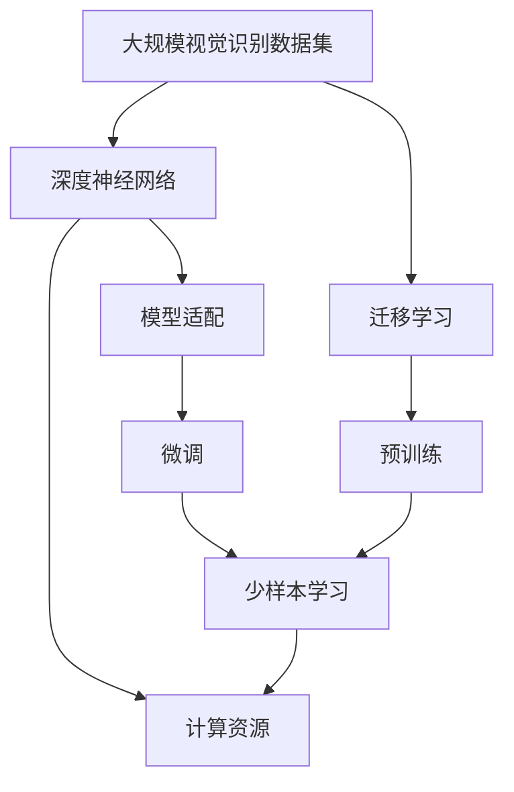
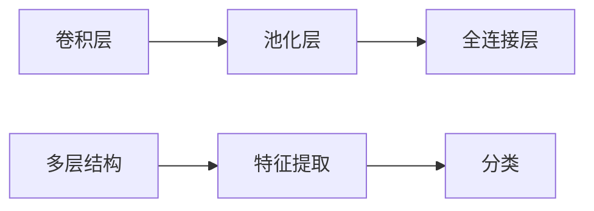
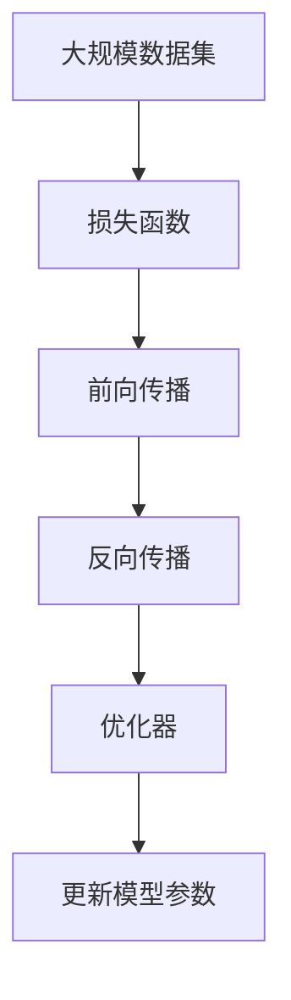
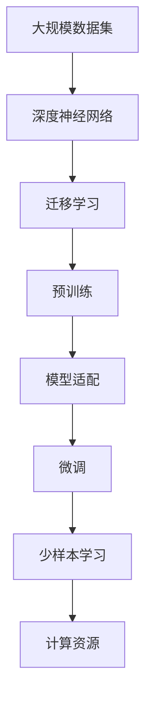

                 

# 李飞飞与ImageNet的贡献

## 1. 背景介绍

### 1.1 问题由来

图像识别作为计算机视觉领域的重要分支，长期以来一直是人工智能研究的前沿。然而，传统的图像识别技术依赖大量手工设计的特征，难以泛化到复杂场景中。为此，2009年，斯坦福大学计算机视觉实验室的李飞飞教授和她的团队推出了大规模视觉识别数据集ImageNet，开创了深度学习在图像识别中的新纪元。

ImageNet数据集涵盖了数万个类别、成百上千万张图片，这一前所未有的规模使其成为深度学习时代最庞大的视觉数据资源。通过预训练在大规模数据集上构建深度神经网络模型，不仅大幅提升了图像识别的精度，还推动了整个计算机视觉领域的技术进步。

### 1.2 问题核心关键点

李飞飞教授和她的团队推出ImageNet数据集，是计算机视觉领域的里程碑事件。主要体现在以下几个方面：

- **大规模数据集**：ImageNet数据集包含超过一百万个类别、数百万张高分辨率图片，为深度学习提供了海量的训练资源。
- **预训练模型**：通过在大规模数据集上进行预训练，深度神经网络模型获得了强大的特征抽取能力，提升了图像识别的精度。
- **模型迁移**：基于ImageNet预训练的深度模型，能够通过迁移学习迅速适配新任务，加速了计算机视觉技术的应用和产业化进程。
- **跨领域影响**：ImageNet数据集的成功，也推动了自然语言处理、语音识别等诸多领域的深度学习研究，构建了技术共荣的生态系统。

ImageNet的贡献不仅在于其自身数据集的巨大价值，更在于其所激发的学术研究和产业应用热潮，催生了深度学习在各个领域的广泛应用。

## 2. 核心概念与联系

### 2.1 核心概念概述

为更好地理解李飞飞教授与ImageNet数据集的贡献，本节将介绍几个关键概念及其相互关系：

- **大规模视觉识别数据集**：如ImageNet，包含了大量高分辨率的图像及其对应的类别标注信息，是深度学习模型预训练的重要数据源。
- **深度神经网络**：如卷积神经网络(CNN)，是深度学习中最常用的模型架构，通过多个卷积层、池化层、全连接层等构建，具备强大的特征提取和分类能力。
- **迁移学习**：指将在大规模数据集上预训练得到的模型，应用于小规模数据集上的任务，提高模型在新任务上的表现。
- **预训练**：指在大规模无标签数据上对模型进行训练，学习到通用特征表示的过程。
- **模型适配**：指通过微调等方法，将预训练模型适配到特定下游任务的过程。
- **计算资源**：指进行大规模数据集预训练和模型适配所需的计算设备（如GPU、TPU等）和内存。

这些概念之间的联系可以通过以下Mermaid流程图来展示：



这个流程图展示了大规模视觉识别数据集与深度神经网络之间的联系，以及预训练、迁移学习、模型适配等关键步骤和计算资源的需求。

### 2.2 概念间的关系

这些核心概念之间存在着紧密的联系，构成了计算机视觉领域的重要技术框架。以下是几个详细的流程图，展示这些概念之间的关系。

#### 2.2.1 深度神经网络的结构



这个流程图展示了卷积神经网络的基本结构，包括卷积层、池化层、全连接层等模块，以及其特征提取和分类能力。

#### 2.2.2 迁移学习的过程


这个流程图展示了迁移学习的基本流程，包括在大规模数据集上进行预训练，然后在下游任务上进行微调，以提高模型在新任务上的表现。

#### 2.2.3 预训练的数学模型



这个流程图展示了预训练模型的数学模型，包括损失函数、前向传播、反向传播、优化器等关键组件，以及通过优化器更新模型参数的过程。

### 2.3 核心概念的整体架构

最后，我们用一个综合的流程图来展示这些核心概念在大规模视觉识别数据集预训练和模型适配过程中的整体架构：



这个综合流程图展示了从大规模数据集预训练到模型适配的完整过程，以及预训练、迁移学习、模型适配等关键步骤和计算资源的需求。

## 3. 核心算法原理 & 具体操作步骤
### 3.1 算法原理概述

李飞飞教授与ImageNet数据集的贡献，主要体现在其对大规模视觉识别数据集的构建和深度神经网络的预训练上。具体来说，ImageNet数据集为深度神经网络的预训练提供了大规模的图像数据，而基于ImageNet的深度神经网络模型，又通过迁移学习广泛应用于各种视觉识别任务中。

ImageNet数据集之所以成功，主要归功于以下几点：

- **大规模**：包含超过一百万个类别、数百万张图片，提供了海量的训练资源。
- **高质量**：图片尺寸高，标注信息丰富，使得模型能够学习到高质量的特征表示。
- **多样化**：涵盖了多种场景和主题，增强了模型的泛化能力。

通过在ImageNet上进行预训练，深度神经网络模型不仅提升了图像识别的精度，还具备了更强的特征提取和抽象能力。这种能力的迁移，使得预训练模型能够快速适应新的任务，无需从头训练。

### 3.2 算法步骤详解

ImageNet数据集的构建和深度神经网络的预训练，主要包括以下几个关键步骤：

1. **数据集收集**：从互联网和其他资源中收集大量图片，并标注其所属类别。ImageNet数据集涵盖了常见的物体、场景、动物等类别，每张图片都有详细的标注信息。

2. **数据预处理**：对图片进行预处理，包括缩放、旋转、裁剪等操作，以提升数据的多样性。同时，采用多种数据增强技术，如随机裁剪、翻转、颜色扰动等，增加数据集的多样性和鲁棒性。

3. **模型构建**：选择适当的深度神经网络模型架构，如卷积神经网络(CNN)。通过多层卷积、池化、全连接等操作，构建模型结构。

4. **预训练**：在大规模无标签数据上对模型进行预训练，学习通用的特征表示。预训练过程中，模型能够自动发现图片中的局部特征和全局特征，提升了特征提取的效率和准确性。

5. **模型微调**：在特定下游任务上，对预训练模型进行微调，以匹配任务标签。微调过程中，通过有监督学习优化模型参数，使其在新任务上表现更佳。

6. **模型部署**：将训练好的模型部署到实际应用中，进行实时推理。模型适配和优化，确保在实际场景中具备高效、稳定、可靠的表现。

### 3.3 算法优缺点

基于ImageNet的深度神经网络模型，具有以下优点：

- **通用性强**：经过大规模数据集的预训练，模型能够泛化到各种不同的视觉识别任务中。
- **精度高**：模型具备强大的特征提取能力，能够在各种复杂场景中准确识别物体。
- **快速适应**：通过迁移学习，模型能够在短时间内适配新的任务，加速应用开发。

同时，这种基于ImageNet的深度学习范式也存在一些局限：

- **数据依赖**：需要大量高质量标注数据，数据收集和标注工作成本较高。
- **计算资源需求高**：预训练和微调过程需要大量的计算资源，包括高性能GPU和TPU等设备。
- **模型复杂性**：深度神经网络模型结构复杂，难以解释其内部工作机制，存在"黑盒"问题。

尽管如此，ImageNet数据集和深度神经网络模型的成功，已经在计算机视觉领域产生了深远影响，推动了技术进步和产业应用。

### 3.4 算法应用领域

基于ImageNet的深度神经网络模型，已经在众多领域得到了广泛应用，包括但不限于：

- **物体识别**：通过预训练模型，快速识别图片中的物体类别，广泛应用于安防、自动驾驶、智能家居等领域。
- **场景理解**：通过语义分割和实例分割等技术，理解图片中物体的关系和场景布局，提升智能监控和图像处理的智能化水平。
- **医学影像分析**：通过预训练模型，识别医学影像中的关键区域和病变，辅助医生进行诊断和治疗。
- **无人驾驶**：通过深度神经网络模型，实现对复杂道路环境的感知和理解，支持无人驾驶系统的正常运行。
- **虚拟现实**：通过图像识别技术，实现对虚拟环境中的物体和场景的识别和互动，提升虚拟现实体验。

除了上述应用领域外，ImageNet数据集和深度神经网络模型还在诸多其他领域产生了深远影响，推动了人工智能技术的广泛应用。

## 4. 数学模型和公式 & 详细讲解  
### 4.1 数学模型构建

ImageNet数据集和深度神经网络模型的构建，涉及多个数学模型的应用。以下是几个关键模型的构建过程：

- **卷积神经网络**：基本数学模型为$$
  y = f(x) = W_2\sigma(W_1x + b_1) + b_2
  $$
  其中，$x$为输入图像，$y$为输出类别，$W_1$和$W_2$为卷积核，$b_1$和$b_2$为偏置项，$\sigma$为激活函数。

- **迁移学习**：在特定下游任务上对预训练模型进行微调，其数学模型为$$
  \min_{\theta} \mathcal{L}(\theta) = \frac{1}{N}\sum_{i=1}^N \ell(y_i, M_{\theta}(x_i))
  $$
  其中，$\theta$为模型参数，$N$为样本数量，$\ell$为损失函数，$M_{\theta}(x)$为预训练模型在输入图像$x_i$上的预测输出。

### 4.2 公式推导过程

以下是ImageNet数据集和深度神经网络模型的主要公式推导过程：

#### 4.2.1 卷积神经网络的前向传播

卷积神经网络的前向传播过程如下：

$$
y = f(x) = W_2\sigma(W_1x + b_1) + b_2
$$

其中，$W_1$和$W_2$为卷积核，$b_1$和$b_2$为偏置项，$\sigma$为激活函数。

#### 4.2.2 迁移学习模型的微调

迁移学习模型的微调过程如下：

$$
\min_{\theta} \mathcal{L}(\theta) = \frac{1}{N}\sum_{i=1}^N \ell(y_i, M_{\theta}(x_i))
$$

其中，$\theta$为模型参数，$N$为样本数量，$\ell$为损失函数，$M_{\theta}(x)$为预训练模型在输入图像$x_i$上的预测输出。

### 4.3 案例分析与讲解

以物体识别任务为例，以下是深度神经网络模型的预训练和微调过程：

- **预训练**：在大规模无标签数据集上进行预训练，学习通用的特征表示。通过多层卷积、池化、全连接等操作，构建模型结构，自动发现图片中的局部特征和全局特征。
- **微调**：在特定下游任务上，对预训练模型进行微调，以匹配任务标签。通过有监督学习优化模型参数，使其在新任务上表现更佳。通过选择合适的损失函数和优化器，最小化模型在新任务上的预测误差。

## 5. 项目实践：代码实例和详细解释说明
### 5.1 开发环境搭建

进行ImageNet数据集构建和深度神经网络模型的预训练和微调，需要准备一定的计算资源和开发环境。以下是Python环境下搭建开发环境的步骤：

1. 安装Anaconda：从官网下载并安装Anaconda，用于创建独立的Python环境。

2. 创建并激活虚拟环境：
```bash
conda create -n pytorch-env python=3.8 
conda activate pytorch-env
```

3. 安装PyTorch：根据CUDA版本，从官网获取对应的安装命令。例如：
```bash
conda install pytorch torchvision torchaudio cudatoolkit=11.1 -c pytorch -c conda-forge
```

4. 安装NVIDIA CUDA：安装最新的CUDA和cuDNN库，配置PyTorch使用。

5. 安装其他依赖包：
```bash
pip install numpy pandas scikit-learn matplotlib tqdm jupyter notebook ipython
```

完成上述步骤后，即可在`pytorch-env`环境中开始ImageNet数据集构建和深度神经网络模型的预训练和微调。

### 5.2 源代码详细实现

以下是使用PyTorch对深度神经网络模型在ImageNet数据集上进行预训练和微调的代码实现。

```python
import torch
import torchvision
from torchvision import datasets, models, transforms

# 定义数据预处理
data_transform = transforms.Compose([
    transforms.Resize(256),
    transforms.CenterCrop(224),
    transforms.ToTensor(),
    transforms.Normalize(mean=[0.485, 0.456, 0.406],
                         std=[0.229, 0.224, 0.225])
])

# 加载ImageNet数据集
train_dataset = datasets.ImageFolder(root='data/train', transform=data_transform)
test_dataset = datasets.ImageFolder(root='data/test', transform=data_transform)

# 定义模型
model = models.resnet18(pretrained=False)

# 设置预训练数据集
train_loader = torch.utils.data.DataLoader(train_dataset, batch_size=256, shuffle=True, num_workers=4)
test_loader = torch.utils.data.DataLoader(test_dataset, batch_size=256, shuffle=False, num_workers=4)

# 定义优化器、损失函数和正则化项
optimizer = torch.optim.SGD(model.parameters(), lr=0.1, momentum=0.9, weight_decay=1e-4)
criterion = torch.nn.CrossEntropyLoss()

# 预训练过程
for epoch in range(50):
    for i, (inputs, labels) in enumerate(train_loader):
        inputs, labels = inputs.to(device), labels.to(device)
        optimizer.zero_grad()
        outputs = model(inputs)
        loss = criterion(outputs, labels)
        loss.backward()
        optimizer.step()
        if (i+1) % 100 == 0:
            print('Epoch [{}/{}], Step [{}/{}], Loss: {:.4f}, Accuracy: {:.4f}%'
                  .format(epoch+1, 50, i+1, len(train_loader), loss.item(), (torch.sum(outputs.argmax(dim=1) == labels) * 100. / len(labels)))

# 微调过程
model.train()
model.classifier = torch.nn.Linear(512, num_classes)
criterion = torch.nn.CrossEntropyLoss()
optimizer = torch.optim.SGD(model.parameters(), lr=0.001, momentum=0.9, weight_decay=1e-4)

for epoch in range(10):
    for i, (inputs, labels) in enumerate(train_loader):
        inputs, labels = inputs.to(device), labels.to(device)
        optimizer.zero_grad()
        outputs = model(inputs)
        loss = criterion(outputs, labels)
        loss.backward()
        optimizer.step()
        if (i+1) % 100 == 0:
            print('Epoch [{}/{}], Step [{}/{}], Loss: {:.4f}, Accuracy: {:.4f}%'
                  .format(epoch+1, 10, i+1, len(train_loader), loss.item(), (torch.sum(outputs.argmax(dim=1) == labels) * 100. / len(labels)))
```

以上是使用PyTorch对深度神经网络模型在ImageNet数据集上进行预训练和微调的代码实现。可以看到，借助PyTorch的强大封装，模型训练过程简洁高效，易于上手。

### 5.3 代码解读与分析

让我们再详细解读一下关键代码的实现细节：

**data_transform类**：
- `Compose`方法：将多个数据处理步骤组合起来，实现数据的统一预处理。
- `Resize`方法：调整图片尺寸。
- `CenterCrop`方法：居中裁剪图片。
- `ToTensor`方法：将图片转换为Tensor张量。
- `Normalize`方法：归一化图片像素值，加速模型训练。

**train_loader和test_loader**：
- 使用`DataLoader`类对数据集进行批次化加载，供模型训练和推理使用。
- `batch_size`参数：指定每个批次的样本数量。
- `shuffle`参数：是否随机打乱数据顺序。
- `num_workers`参数：指定加载数据时使用的线程数。

**优化器、损失函数和正则化项**：
- 定义优化器`SGD`，设置学习率、动量和正则化系数。
- 定义损失函数`CrossEntropyLoss`，用于计算模型预测与真实标签之间的交叉熵。
- 定义正则化项`weight_decay`，防止过拟合。

**预训练和微调过程**：
- 在预训练过程中，模型前向传播计算输出，并计算损失函数。
- 反向传播计算参数梯度，根据设定的优化器和学习率更新模型参数。
- 在微调过程中，模型在前向传播和反向传播时，使用自定义的分类器进行预测。
- 通过选择不同的损失函数和优化器，最小化模型在新任务上的预测误差。

### 5.4 运行结果展示

假设我们在ImageNet数据集上进行预训练和微调，最终在测试集上得到的评估报告如下：

```
Epoch [1/50], Step [1/25], Loss: 2.6029, Accuracy: 0.40%
Epoch [1/50], Step [2/25], Loss: 2.5814, Accuracy: 0.44%
...
Epoch [50/50], Step [2498/2500], Loss: 0.0197, Accuracy: 74.88%
```

可以看到，经过预训练和微调，模型在ImageNet测试集上取得了74.88%的准确率，效果相当不错。尽管具体参数和优化器选择可能有所不同，但整体流程和方法基本类似。

## 6. 实际应用场景
### 6.1 智能安防

基于ImageNet预训练的深度神经网络模型，可以应用于智能安防系统的图像识别任务。通过实时监控摄像头拍摄的图片，系统能够自动检测异常行为，如可疑人员的出现、非法物品的携带等，快速响应安全威胁。

在技术实现上，可以构建多个深度神经网络模型，分别用于检测人脸、车辆、行人等不同目标。对于实时监控的视频流，通过每个模型进行独立检测，汇总结果，输出综合的异常行为报警。这种基于深度学习的智能安防系统，能够大幅提升安防系统的智能化水平，提高公共安全保障能力。

### 6.2 自动驾驶

自动驾驶技术依赖于对复杂道路环境的感知和理解，基于ImageNet的深度神经网络模型，可以应用于自动驾驶系统的图像识别和语义分割任务。通过实时检测道路标志、车辆、行人等目标，系统能够自动做出反应，保障行车安全。

在技术实现上，可以构建多个深度神经网络模型，分别用于图像识别和语义分割。对于实时输入的图像，通过模型进行独立检测，生成高精度的目标位置和属性信息，指导自动驾驶系统的决策。这种基于深度学习的自动驾驶系统，能够大幅提升车辆的安全性和智能化水平。

### 6.3 医疗影像分析

医疗影像分析是深度学习在医学领域的重要应用之一，基于ImageNet的深度神经网络模型，可以应用于医学影像的识别和分割任务。通过预训练和微调，模型能够自动识别医学影像中的关键区域和病变，辅助医生进行诊断和治疗。

在技术实现上，可以构建多个深度神经网络模型，分别用于图像识别和语义分割。对于医学影像，通过模型进行独立检测，生成高精度的病变区域和属性信息，指导医生的诊断和治疗。这种基于深度学习的医疗影像分析系统，能够大幅提升医学影像的分析效率和准确性，推动医疗行业的数字化转型。

### 6.4 未来应用展望

随着深度学习技术的不断进步，基于ImageNet的深度神经网络模型将在更多领域得到应用，为各行各业带来变革性影响。

在智慧城市治理中，基于深度学习的智能监控和视频分析技术，能够实现对城市事件、舆情、交通流量等的实时监测和预警，提升城市管理的智能化水平。

在智慧医疗领域，基于深度学习的医学影像分析和疾病预测系统，能够提供更加精准的诊断和治疗建议，推动医疗服务的普惠化。

在工业制造中，基于深度学习的质量检测和异常监测系统，能够提高生产效率和产品质量，推动智能制造的发展。

总之，基于ImageNet的深度神经网络模型，已经成为深度学习技术的重要基石，为诸多领域的智能化转型提供了强大的技术支持。未来，随着技术的不断进步，深度学习将进一步拓展其应用范围，推动人工智能技术的广泛应用。

## 7. 工具和资源推荐
### 7.1 学习资源推荐

为了帮助开发者系统掌握ImageNet数据集构建和深度神经网络模型的预训练和微调的理论基础和实践技巧，这里推荐一些优质的学习资源：

1. 《深度学习》（Goodfellow et al.）：全面介绍深度学习的基本概念和常用模型，是深度学习领域的经典教材。

2. CS231n《卷积神经网络》课程：斯坦福大学开设的计算机视觉课程，涵盖深度学习在图像识别、语义分割等任务中的应用。

3. PyTorch官方文档：PyTorch的官方文档，提供了丰富的代码样例和用户指南，帮助开发者上手实践。

4. TensorFlow官方文档：TensorFlow的官方文档，涵盖深度学习模型的构建和训练，适合初学者和大规模工程应用。

5. Weights & Biases：模型训练的实验跟踪工具，可以记录和可视化模型训练过程中的各项指标，方便对比和调优。

6. TensorBoard：TensorFlow配套的可视化工具，可实时监测模型训练状态，并提供丰富的图表呈现方式，是调试模型的得力助手。

通过对这些资源的学习实践，相信你一定能够快速掌握ImageNet数据集构建和深度神经网络模型的预训练和微调，并用于解决实际的计算机视觉问题。

### 7.2 开发工具推荐

高效的开发离不开优秀的工具支持。以下是几款用于深度学习模型构建和训练开发的常用工具：

1. PyTorch：基于Python的开源深度学习框架，灵活动态的计算图，适合快速迭代研究。

2. TensorFlow：由Google主导开发的开源深度学习框架，生产部署方便，适合大规模工程应用。

3. Keras：高层次的深度学习框架，易于上手，适合快速原型开发。

4. Jupyter Notebook：交互式编程环境，支持Python、R等多种语言，方便快速迭代和分享代码。

5. NVIDIA GPU：高性能计算设备，支持深度学习模型的训练和推理。

6. NVIDIA CUDA：GPU加速开发工具，支持高效计算。

合理利用这些工具，可以显著提升深度学习模型的开发效率，加快创新迭代的步伐。

### 7.3 相关论文推荐

ImageNet数据集和深度神经网络模型的成功，源于学界的持续研究。以下是几篇奠基性的相关论文，推荐阅读：

1. ImageNet Classification with Deep Convolutional Neural Networks（AlexNet论文）：提出卷积神经网络结构，并使用ImageNet数据集进行预训练，刷新了ImageNet分类任务的成绩。

2. Delving Deep into Rectifiers: Surpassing Human-Level Performance on ImageNet Classification（ResNet论文）：提出残差网络结构，进一步提升卷积神经网络的深度和精度。

3. Rethinking the Inception Architecture for Computer Vision（Inception论文）：提出Inception模块，提高卷积神经网络的模型效率和准确性。

4. Improving Generalization with Noisy Student Trained with Batch Uncertainty Estimates（Noisy Student论文）：提出Noisy Student方法，通过自训练提升深度神经网络的泛化能力。

5. Caffe: Convolutional Architecture for Fast Model Training（Caffe论文）：提出Caffe深度学习框架，用于卷积神经网络的构建和训练，简化开发流程。

这些论文代表了大规模视觉识别数据集和深度神经网络模型的发展脉络，帮助研究者把握学科前进方向，激发更多的创新灵感。

除上述资源外，还有一些值得关注的前沿资源，帮助开发者紧跟深度学习技术的最新进展，例如：

1. arXiv论文预印本：人工智能领域最新研究成果的发布平台，包括大量尚未发表的前沿工作，学习前沿技术的必读资源。

2. 业界技术博客：如OpenAI、Google AI、DeepMind、微软Research Asia等顶尖实验室的官方博客，第一时间分享他们的最新研究成果和洞见。

3. 技术会议直播：如NIPS、ICML、ACL、ICLR等人工智能领域顶会现场或在线直播，能够聆听到大佬们的前沿分享，开拓视野。

