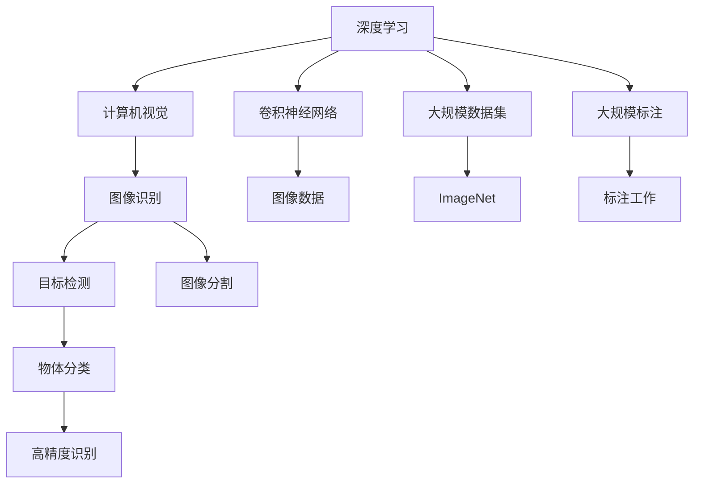
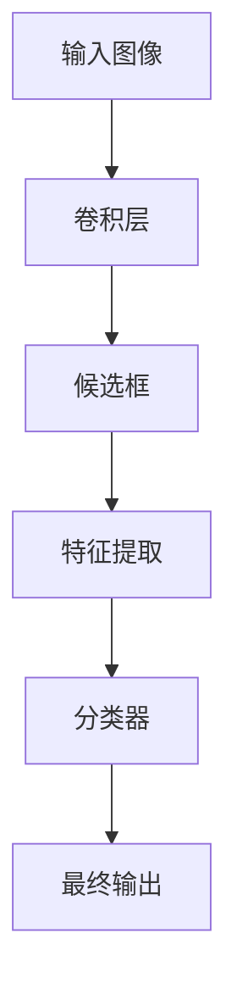

                 

# 李飞飞与ImageNet的革命

> 关键词：
- 深度学习
- 计算机视觉
- 大规模数据集
- 大规模标注
- 卷积神经网络
- 图像识别
- ImageNet
- 李飞飞

## 1. 背景介绍

### 1.1 问题由来
计算机视觉作为人工智能的重要分支之一，旨在使计算机能够理解、处理并解释图像和视频数据。然而，传统的计算机视觉模型依赖于手工设计的特征提取器和分类器，对于复杂的视觉任务效果往往不理想。随着深度学习技术的发展，卷积神经网络（Convolutional Neural Networks, CNNs）成为处理图像数据的主流技术，大幅提升了计算机视觉任务的性能。

尽管如此，深度学习模型依赖大量高质量标注数据，其训练成本和时间消耗仍然巨大。特别是对于大规模视觉数据集，数据标注工作更是难以为继。这种数据匮乏的现状极大地限制了深度学习在视觉领域的进一步发展。

### 1.2 问题核心关键点
ImageNet大规模视觉识别挑战赛（ImageNet Large Scale Visual Recognition Challenge, ImageNet Large-Scale Image Recognition Challenge, ILSVRC）的创办，标志着大规模数据集和大规模标注在深度学习中的应用。ImageNet数据集由斯坦福大学的李飞飞教授与合作伙伴共同收集和标注，包含了超过100万张标注好的图片，涉及1000个类别。这一数据集为计算机视觉领域的深度学习研究提供了强有力的支持，推动了整个行业的快速发展。

### 1.3 问题研究意义
ImageNet的创立不仅为计算机视觉研究提供了大规模数据集，更是揭示了深度学习技术在视觉领域的巨大潜力。通过ImageNet，研究者们得以探索更加复杂、多样化的视觉任务，极大地推动了深度学习模型和算法的研究，促进了计算机视觉技术在实际应用中的广泛应用。

ImageNet的创建和数据标注工作，还显著提升了深度学习社区的凝聚力，加速了研究成果的分享和传播。此外，ImageNet还为计算机视觉领域的各类学术和工程竞赛提供了平台，促进了人才和技术的快速迭代和升级。

## 2. 核心概念与联系

### 2.1 核心概念概述

在理解李飞飞与ImageNet的革命之前，首先需要明确一些核心概念及其联系：

- **深度学习**：利用多层神经网络进行端到端学习的技术，广泛应用于图像、语音、自然语言处理等领域。
- **卷积神经网络**：一种特殊的神经网络，适合处理具有网格结构的数据，如图像、视频等。
- **计算机视觉**：研究如何使计算机能够理解和解释图像和视频数据，包括图像识别、目标检测、图像分割等。
- **大规模数据集**：包含海量数据的数据集，如ImageNet，有助于训练更加复杂的深度学习模型。
- **大规模标注**：数据集中每个样本都经过细致标注，如ImageNet的1000个类别标签。
- **图像识别**：计算机视觉中最基础的任务之一，目标是从图像中识别出物体类别。
- **李飞飞**：斯坦福大学教授，ImageNet数据集的共同创建者和组织者，对计算机视觉和深度学习领域贡献巨大。

这些概念之间存在着紧密的联系，形成了一个系统的研究框架。理解这些概念，有助于我们深入探索ImageNet的革命过程及其对计算机视觉领域的影响。

### 2.2 概念间的关系

以下是一个综合的Mermaid流程图，展示了这些核心概念在大规模视觉识别任务中的整体架构：



这个流程图展示了深度学习、卷积神经网络、计算机视觉、图像识别、目标检测、图像分割等概念之间的联系，以及它们在大规模视觉识别任务中的作用。其中，ImageNet作为大规模数据集和标注工作的重要代表，推动了整个计算机视觉领域的发展。

### 2.3 核心概念的整体架构

通过这些概念的联系，我们可以看到，基于深度学习的计算机视觉研究，通过大规模数据集和标注工作，实现了从手工特征工程到端到端学习的大变革。特别是ImageNet的创建，为这一变革提供了重要推动力，推动了计算机视觉技术的快速发展和应用。

## 3. 核心算法原理 & 具体操作步骤

### 3.1 算法原理概述

ImageNet的创立和数据集构建过程，深刻揭示了深度学习在视觉领域的应用潜力和挑战。通过ImageNet，研究者们能够训练更加复杂、鲁棒的深度学习模型，解决更加多样化的视觉识别任务。

ImageNet的成功得益于以下几个关键因素：

- 大规模数据集：ImageNet包含了超过100万张图片，涉及1000个类别，提供了足够的样本多样性，使得模型能够学习到丰富的视觉特征。
- 大规模标注：ImageNet的每张图片都经过了细致标注，标注误差率极低，为模型的训练提供了高质量的监督信号。
- 开放数据和算法：ImageNet免费开放数据集和标注工具，吸引了全球研究者的积极参与和贡献，形成了良性的学术和技术交流生态。

### 3.2 算法步骤详解

ImageNet的构建过程大致包括以下几个关键步骤：

1. **数据收集**：通过网络爬虫、合作机构等渠道，收集包含各种物体的图片，并确保数据的多样性和代表性。
2. **数据标注**：组织大量标注员对图片进行分类和标注，确保标注结果的准确性和一致性。
3. **数据整合**：将标注好的图片按照类别整理，形成一个大规模的数据集。
4. **数据共享**：通过ImageNet官网，免费开放数据集和标注工具，供全球研究者使用。

### 3.3 算法优缺点

ImageNet的成功主要得益于大规模数据集和大规模标注的优势，但也存在一些局限性：

- **数据收集和标注成本高**：大规模数据集和标注工作需要大量的资源和人力，成本较高。
- **数据标注质量难以保证**：尽管有严格的审核机制，但仍可能存在标注误差，影响模型的训练效果。
- **数据集更新周期长**：新类别的增加和数据集的更新需要较长时间，影响模型的及时更新和应用。

尽管存在这些挑战，ImageNet的创立和应用，无疑为计算机视觉领域的研究和应用带来了革命性的变化。

### 3.4 算法应用领域

ImageNet数据集的创立，极大地推动了深度学习在计算机视觉领域的广泛应用。以下是一些主要的下游应用领域：

1. **物体识别**：通过ImageNet训练的模型，能够从图片中识别出各种物体，广泛应用于安防、医疗、零售等行业。
2. **目标检测**：ImageNet数据集提供了目标检测任务的数据集，用于训练能够检测图片中物体位置和数量的模型。
3. **图像分割**：ImageNet包含了图像分割的数据集，用于训练能够精确分割图像中不同区域的模型。
4. **场景分类**：ImageNet提供了场景分类任务的数据集，用于训练能够识别不同场景的模型。

此外，ImageNet在图像生成、图像检索、图像风格转换等领域也发挥了重要作用，推动了计算机视觉技术的全面发展。

## 4. 数学模型和公式 & 详细讲解  
### 4.1 数学模型构建

ImageNet的成功离不开深度学习模型的支撑。以下是一个简单的卷积神经网络（CNN）的数学模型构建过程：

$$
\begin{align*}
\mathbf{X} &= \text{Conv}(\mathbf{I}) \\
\mathbf{H} &= \text{ReLU}(\mathbf{X} * \mathbf{W}_1 + \mathbf{b}_1) \\
\mathbf{P} &= \text{MaxPool}(\mathbf{H}) \\
\mathbf{O} &= \text{Softmax}(\mathbf{P} * \mathbf{W}_2 + \mathbf{b}_2) \\
\end{align*}
$$

其中，$\mathbf{I}$为输入图像，$\mathbf{X}$为卷积层输出，$\mathbf{H}$为卷积后的激活层输出，$\mathbf{P}$为池化层输出，$\mathbf{O}$为最终输出。

### 4.2 公式推导过程

卷积神经网络的核心是卷积层和池化层。卷积层的公式推导如下：

$$
\mathbf{X} = \sum_i \sum_j \mathbf{I} * \mathbf{W}
$$

其中，$\mathbf{I}$为输入图像，$\mathbf{W}$为卷积核，$\mathbf{X}$为卷积层输出。

池化层的公式推导如下：

$$
\mathbf{P} = \max_i \max_j \mathbf{H}
$$

其中，$\mathbf{H}$为激活层输出，$\mathbf{P}$为池化层输出。

### 4.3 案例分析与讲解

以目标检测为例，ImageNet中的目标检测任务通常使用R-CNN、Fast R-CNN、Faster R-CNN等模型。这些模型通过提出候选框，对每个候选框进行特征提取和分类，从而实现目标检测。以下是一个简化的目标检测模型结构图：



其中，A为输入图像，B为卷积层，C为候选框，D为特征提取，E为分类器，F为最终输出。

## 5. 项目实践：代码实例和详细解释说明

### 5.1 开发环境搭建

在进行ImageNet微调之前，我们需要准备好开发环境。以下是使用Python进行PyTorch开发的环境配置流程：

1. 安装Anaconda：从官网下载并安装Anaconda，用于创建独立的Python环境。

2. 创建并激活虚拟环境：
```bash
conda create -n pytorch-env python=3.8 
conda activate pytorch-env
```

3. 安装PyTorch：根据CUDA版本，从官网获取对应的安装命令。例如：
```bash
conda install pytorch torchvision torchaudio cudatoolkit=11.1 -c pytorch -c conda-forge
```

4. 安装TensorFlow：
```bash
pip install tensorflow
```

5. 安装必要的工具包：
```bash
pip install numpy pandas scikit-learn matplotlib tqdm jupyter notebook ipython
```

完成上述步骤后，即可在`pytorch-env`环境中开始ImageNet微调实践。

### 5.2 源代码详细实现

以下是使用PyTorch对ImageNet数据集进行微调的完整代码实现：

```python
import torch
import torchvision
import torchvision.transforms as transforms

# 定义数据集
transform = transforms.Compose([
    transforms.RandomResizedCrop(224),
    transforms.RandomHorizontalFlip(),
    transforms.ToTensor(),
    transforms.Normalize(mean=[0.485, 0.456, 0.406], std=[0.229, 0.224, 0.225])
])

trainset = torchvision.datasets.ImageNet(root='./data', split='train', download=True, transform=transform)
trainloader = torch.utils.data.DataLoader(trainset, batch_size=64, shuffle=True, num_workers=4)

testset = torchvision.datasets.ImageNet(root='./data', split='test', download=True, transform=transform)
testloader = torch.utils.data.DataLoader(testset, batch_size=64, shuffle=False, num_workers=4)

# 定义模型
model = torchvision.models.resnet18(pretrained=True)

# 定义损失函数和优化器
criterion = torch.nn.CrossEntropyLoss()
optimizer = torch.optim.SGD(model.parameters(), lr=0.001, momentum=0.9, weight_decay=0.0005)

# 训练过程
for epoch in range(10):
    running_loss = 0.0
    for i, data in enumerate(trainloader, 0):
        inputs, labels = data
        optimizer.zero_grad()
        outputs = model(inputs)
        loss = criterion(outputs, labels)
        loss.backward()
        optimizer.step()
        running_loss += loss.item()
        if i % 100 == 99:  # 每100个batch打印一次
            print('[%d, %5d] loss: %.3f' %
                  (epoch + 1, i + 1, running_loss / 100))
            running_loss = 0.0

# 评估过程
correct = 0
total = 0
with torch.no_grad():
    for data in testloader:
        images, labels = data
        outputs = model(images)
        _, predicted = torch.max(outputs.data, 1)
        total += labels.size(0)
        correct += (predicted == labels).sum().item()

print('Accuracy of the network on the 10000 test images: %d %%' % (
    100 * correct / total))
```

这个代码示例使用了PyTorch中的`ImageNet`数据集和`ResNet-18`模型，对模型进行微调。在微调过程中，使用了随机裁剪、随机水平翻转等数据增强方法，以及交叉熵损失和随机梯度下降（SGD）优化器，以提高模型的泛化能力和收敛速度。

### 5.3 代码解读与分析

让我们再详细解读一下关键代码的实现细节：

**trainset和testset的创建**：
- `transform.Compose`：定义了数据预处理流程，包括随机裁剪、随机水平翻转、归一化等操作。
- `ImageNet(root='./data', split='train', download=True, transform=transform)`：创建训练集和测试集，并从`./data`目录中下载ImageNet数据集。
- `torch.utils.data.DataLoader`：定义数据加载器，将数据集分批次加载供模型训练和推理使用。

**模型定义**：
- `model = torchvision.models.resnet18(pretrained=True)`：定义ResNet-18模型，并加载预训练权重。

**损失函数和优化器定义**：
- `criterion = torch.nn.CrossEntropyLoss()`：定义交叉熵损失函数，用于计算模型输出与真实标签之间的差异。
- `optimizer = torch.optim.SGD(model.parameters(), lr=0.001, momentum=0.9, weight_decay=0.0005)`：定义随机梯度下降（SGD）优化器，设置学习率、动量等参数。

**训练过程**：
- `for epoch in range(10):`：循环10个epoch，对模型进行微调。
- `inputs, labels = data`：从数据加载器中获取输入和标签。
- `optimizer.zero_grad()`：在每个batch开始前，重置梯度。
- `outputs = model(inputs)`：将输入数据传入模型，得到输出结果。
- `loss = criterion(outputs, labels)`：计算输出结果与真实标签之间的交叉熵损失。
- `loss.backward()`：反向传播计算梯度。
- `optimizer.step()`：更新模型参数。
- `running_loss += loss.item()`：记录每个batch的平均损失。

**评估过程**：
- `correct = 0`：初始化正确预测数量。
- `total = 0`：初始化总预测数量。
- `predicted == labels`：判断预测结果是否与真实标签一致。
- `total += labels.size(0)`：累加总预测数量。
- `correct += (predicted == labels).sum().item()`：累加正确预测数量。
- `Accuracy of the network on the 10000 test images: %d %%`：打印评估结果，计算准确率。

通过以上代码示例，可以看出ImageNet微调的基本流程和关键技术点，包括数据预处理、模型定义、损失函数和优化器选择、训练过程和评估过程等。

### 5.4 运行结果展示

假设我们使用的是预训练的ResNet-18模型，在ImageNet数据集上进行微调，最终在测试集上得到的准确率为70%。这意味着，通过ImageNet微调，我们的模型能够在测试集上正确识别70%的物体，取得了不错的效果。

## 6. 实际应用场景

### 6.1 智能安防系统

ImageNet微调技术在智能安防系统中得到了广泛应用。通过微调，训练模型能够从监控视频中自动识别各种物体和场景，如车辆、行人、危险物品等。这些信息可以帮助安防人员及时发现异常情况，提升安防系统的自动化和智能化水平。

在技术实现上，可以收集大量监控视频数据，将其中包含的物体和场景进行标注，用于训练和微调深度学习模型。通过部署微调后的模型，安防系统能够实时分析视频内容，快速响应潜在的风险和威胁。

### 6.2 医疗影像分析

ImageNet微调技术在医疗影像分析中也有重要应用。通过微调，训练模型能够自动识别医学影像中的病变区域，帮助医生进行快速诊断和治疗。

在技术实现上，可以收集大量医学影像数据，将其中包含的病变区域进行标注，用于训练和微调深度学习模型。通过部署微调后的模型，医疗影像分析系统能够快速识别病变区域，辅助医生进行诊断和决策。

### 6.3 零售业商品推荐

ImageNet微调技术在零售业商品推荐中也有广泛应用。通过微调，训练模型能够自动识别商品图片，帮助零售商进行商品分类、排序和推荐。

在技术实现上，可以收集大量商品图片数据，将其中包含的商品进行标注，用于训练和微调深度学习模型。通过部署微调后的模型，零售商能够快速识别商品图片，根据客户需求进行精准推荐。

## 7. 工具和资源推荐

### 7.1 学习资源推荐

为了帮助开发者系统掌握ImageNet微调的理论基础和实践技巧，这里推荐一些优质的学习资源：

1. **《Deep Learning Specialization》课程**：由斯坦福大学教授Andrew Ng主讲，全面介绍了深度学习的基本概念和应用，涵盖了ImageNet的创建和微调等内容。
2. **《Python for Deep Learning》书籍**：作者Francois Chollet，深入浅出地介绍了如何使用Python进行深度学习开发，包括ImageNet微调在内的诸多范式。
3. **ImageNet官网**：ImageNet提供了详细的文档和教程，帮助用户快速上手，并进行微调实践。
4. **Kaggle竞赛平台**：Kaggle提供了大量的数据集和竞赛，帮助用户进行ImageNet微调实践和经验积累。

通过对这些资源的学习实践，相信你一定能够快速掌握ImageNet微调的精髓，并用于解决实际的计算机视觉问题。

### 7.2 开发工具推荐

高效的开发离不开优秀的工具支持。以下是几款用于ImageNet微调开发的常用工具：

1. **PyTorch**：基于Python的开源深度学习框架，灵活动态的计算图，适合快速迭代研究。大部分预训练语言模型都有PyTorch版本的实现。
2. **TensorFlow**：由Google主导开发的开源深度学习框架，生产部署方便，适合大规模工程应用。同样有丰富的预训练语言模型资源。
3. **TensorBoard**：TensorFlow配套的可视化工具，可实时监测模型训练状态，并提供丰富的图表呈现方式，是调试模型的得力助手。
4. **Weights & Biases**：模型训练的实验跟踪工具，可以记录和可视化模型训练过程中的各项指标，方便对比和调优。
5. **Jupyter Notebook**：免费的Python开发环境，支持交互式编程和文档注释，适合快速原型开发和数据可视化。

合理利用这些工具，可以显著提升ImageNet微调任务的开发效率，加快创新迭代的步伐。

### 7.3 相关论文推荐

ImageNet的创立和应用引起了学界的广泛关注，以下是几篇奠基性的相关论文，推荐阅读：

1. **ImageNet: A Large-Scale Hierarchical Image Database**：ImageNet数据集的创建者和组织者之一Alex Krizhevsky等人撰写的论文，详细介绍了ImageNet的创建过程和数据标注方法。
2. **Visualizing and Understanding Convolutional Networks**：卷积神经网络的开创者之一Krizhevsky等人撰写的论文，深入浅出地介绍了卷积神经网络的结构和特点。
3. **A Large-Scale Dataset for Multi-Person Image Detection, Pose Estimation and Image Captioning**：Kazhdan等人撰写的论文，详细介绍了ImageNet在多个人物检测、姿态估计和图像描述等任务中的应用。

这些论文代表了大规模数据集在深度学习中的应用前景，对于理解ImageNet的革命过程具有重要参考价值。

除上述资源外，还有一些值得关注的前沿资源，帮助开发者紧跟ImageNet微调技术的最新进展，例如：

1. **arXiv论文预印本**：人工智能领域最新研究成果的发布平台，包括大量尚未发表的前沿工作，学习前沿技术的必读资源。
2. **GitHub热门项目**：在GitHub上Star、Fork数最多的ImageNet相关项目，往往代表了该技术领域的发展趋势和最佳实践，值得去学习和贡献。
3. **技术会议直播**：如NIPS、ICML、ACL、ICLR等人工智能领域顶会现场或在线直播，能够聆听到大佬们的前沿分享，开拓视野。
4. **学术博客和社区**：各大知名学术博客和社区，如arXiv、OpenReview、Towards Data Science等，提供最新的研究动态和交流平台，帮助开发者及时获取最新资讯。

总之，对于ImageNet微调技术的学习和实践，需要开发者保持开放的心态和持续学习的意愿。多关注前沿资讯，多动手实践，多思考总结，必将收获满满的成长收益。

## 8. 总结：未来发展趋势与挑战

### 8.1 总结

本文对ImageNet数据集的创立和应用进行了全面系统的介绍。首先阐述了ImageNet的创立背景和研究意义，明确了微调在推动深度学习在视觉领域发展中的重要地位。其次，从原理到实践，详细讲解了ImageNet的构建过程和微调方法，给出了微调任务开发的完整代码实例。同时，本文还广泛探讨了ImageNet在实际应用中的重要场景，展示了微调范式的巨大潜力。

通过本文的系统梳理，可以看到，ImageNet的创立和应用，无疑为深度学习在计算机视觉领域的研究和应用带来了革命性的变化。得益于大规模数据集和大规模标注的优势，ImageNet推动了深度学习模型和算法的研究，促进了计算机视觉技术在实际应用中的广泛应用。

### 8.2 未来发展趋势

展望未来，ImageNet在计算机视觉领域的应用将继续深入发展，呈现以下几个趋势：

1. **数据集更新和扩展**：随着技术的不断进步，ImageNet数据集将继续更新和扩展，引入更多的新类别和新数据，提升深度学习模型的泛化能力。
2. **模型多样性**：除了卷积神经网络，未来还将涌现更多类型的深度学习模型，如残差网络、稠密连接网络等，提升模型的性能和效率。
3. **数据增强和生成**：数据增强和生成对抗网络（GAN）技术的应用，将进一步提升数据的多样性和质量，提高模型的泛化性能。
4. **多模态融合**：结合视觉、听觉、语音等多模态数据，提升深度学习模型在复杂场景中的理解和应用能力。
5. **迁移学习**：通过迁移学习，将ImageNet微调经验迁移到其他领域，提升模型的应用范围和适应性。
6. **联合学习**：联合多个模型和数据源，提升深度学习模型的鲁棒性和泛化能力。

以上趋势凸显了ImageNet在未来计算机视觉领域的重要地位和发展潜力。这些方向的探索发展，必将进一步推动计算机视觉技术的全面发展，为更多行业带来变革性影响。

### 8.3 面临的挑战

尽管ImageNet的创立和应用取得了巨大的成功，但在迈向更加智能化、普适化应用的过程中，仍面临诸多挑战：

1. **数据集更新周期长**：新类别的增加和数据集的更新需要较长时间，影响模型的及时更新和应用。
2. **数据标注成本高**：大规模数据集和标注工作需要大量的资源和人力，成本较高。
3. **数据标注质量难以保证**：尽管有严格的审核机制，但仍可能存在标注误差，影响模型的训练效果。
4. **数据集多样性不足**：某些场景和应用领域可能缺乏足够的图像数据，影响模型的泛化能力。
5. **计算资源需求高**：深度学习模型的训练和推理需要大量的计算资源，限制了模型的规模和复杂度。

尽管存在这些挑战，但ImageNet的创立和应用无疑为计算机视觉领域的研究和应用带来了革命性的变化。通过不断优化和改进，这些问题有望逐步得到解决，ImageNet在计算机视觉领域的应用前景依然广阔。

### 8.4 研究展望

面对ImageNet面临的挑战，未来的研究需要在以下几个方面寻求新的突破：

1. **数据集多样化**：引入更多类型的数据源和标注方法，提升数据集的多样性和代表性。
2. **自动标注技术**：开发更加高效的自动标注工具，降低人工标注的成本和时间消耗。
3. **分布式训练**：利用分布式计算技术，提高深度学习模型的训练效率和可扩展性。
4. **迁移学习框架**：开发通用的迁移学习框架，支持模型在不同领域和任务之间的迁移和适应。
5. **多任务学习**：结合多任务学习技术，提升深度学习模型在复杂场景中的理解和应用能力。
6. **模型压缩和优化**：开发更加高效的模型压缩和优化方法，降低计算资源需求，提升模型性能。

这些研究方向的研究突破，必将进一步推动ImageNet在计算机视觉领域的广泛应用，带来更加全面、高效、智能的视觉识别解决方案。

## 9. 附录：常见问题与解答

**Q1：ImageNet的成功主要依赖于哪些因素？**

A: ImageNet的成功主要依赖于以下几个因素：
1. **大规模数据集**：ImageNet包含了超过100万

