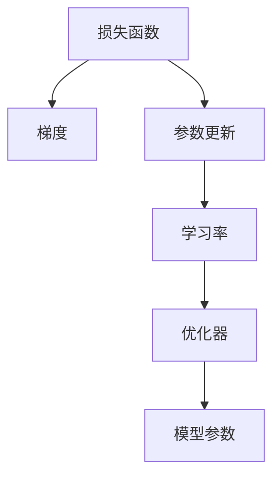
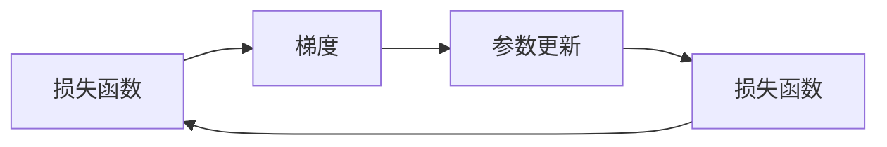
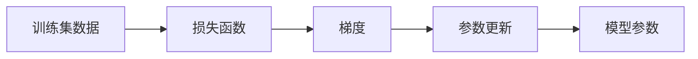
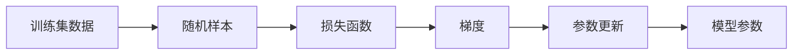
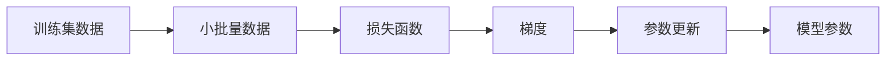
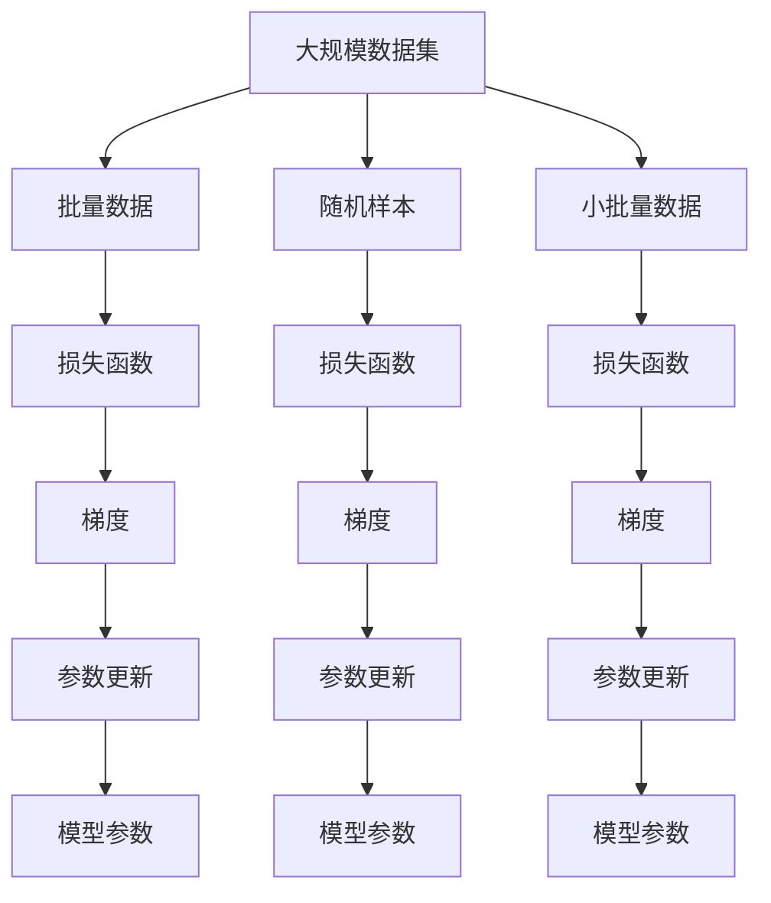

                 

# 梯度下降(Gradient Descent) - 原理与代码实例讲解

> 关键词：梯度下降,反向传播,损失函数,参数更新,学习率,优化器

## 1. 背景介绍

### 1.1 问题由来

梯度下降是机器学习和深度学习中最基础的优化算法之一。它通过求解目标函数的一阶导数（即梯度）来更新模型参数，进而使损失函数最小化，实现模型的优化。梯度下降算法简单高效，广泛应用于各种深度学习模型和优化问题中。

### 1.2 问题核心关键点

梯度下降的核心思想是通过迭代更新模型参数，逐步逼近损失函数的最小值。该算法在每一轮迭代中，计算损失函数对模型参数的梯度，并沿着梯度的反方向调整参数，从而不断逼近最优解。

梯度下降算法的主要目标是找到最小化损失函数的参数值。常见的梯度下降算法包括批量梯度下降(Batch Gradient Descent, BGD)、随机梯度下降(Stochastic Gradient Descent, SGD)和小批量梯度下降(Mini-batch Gradient Descent)。这些算法在实际应用中各有优缺点，需要根据具体问题和数据集的特点进行选择。

## 2. 核心概念与联系

### 2.1 核心概念概述

为更好地理解梯度下降算法，本节将介绍几个密切相关的核心概念：

- 损失函数(Loss Function)：衡量模型输出与真实标签之间的差异，是优化的目标。
- 梯度(Gradient)：损失函数对模型参数的偏导数，指示参数更新方向。
- 参数更新(Parameter Update)：根据梯度调整模型参数，实现模型优化。
- 学习率(Learning Rate)：控制参数更新的步长，影响算法收敛速度和稳定性。
- 优化器(Optimizer)：封装梯度下降算法，通过不同的策略实现参数优化。

这些核心概念之间的逻辑关系可以通过以下Mermaid流程图来展示：



这个流程图展示了几大核心概念之间的关联：

1. 损失函数通过计算模型输出和真实标签的差异，得到需要优化的目标。
2. 梯度通过计算损失函数对参数的偏导数，指示参数更新方向。
3. 参数更新根据梯度调整参数，实现模型优化。
4. 学习率控制参数更新的步长，影响算法的收敛速度和稳定性。
5. 优化器封装梯度下降算法，通过不同的策略实现参数优化。

### 2.2 概念间的关系

这些核心概念之间存在着紧密的联系，形成了梯度下降算法的完整框架。下面我们通过几个Mermaid流程图来展示这些概念之间的关系。

#### 2.2.1 梯度下降算法的整体框架



这个流程图展示了梯度下降算法的整体框架：

1. 计算损失函数。
2. 根据损失函数求梯度。
3. 更新模型参数。
4. 计算更新后的损失函数。
5. 重复执行1-4，直到损失函数收敛。

#### 2.2.2 批量梯度下降(Batch Gradient Descent)



这个流程图展示了批量梯度下降的流程：

1. 从训练集数据中取出一批数据。
2. 计算该批数据的损失函数。
3. 根据损失函数求梯度。
4. 更新模型参数。
5. 重复执行1-4，直到损失函数收敛。

#### 2.2.3 随机梯度下降(Stochastic Gradient Descent)



这个流程图展示了随机梯度下降的流程：

1. 从训练集数据中随机取出一个样本。
2. 计算该样本的损失函数。
3. 根据损失函数求梯度。
4. 更新模型参数。
5. 重复执行1-4，直到损失函数收敛。

#### 2.2.4 小批量梯度下降(Mini-batch Gradient Descent)



这个流程图展示了小批量梯度下降的流程：

1. 从训练集数据中取出一小批数据。
2. 计算该批数据的损失函数。
3. 根据损失函数求梯度。
4. 更新模型参数。
5. 重复执行1-4，直到损失函数收敛。

### 2.3 核心概念的整体架构

最后，我们用一个综合的流程图来展示这些核心概念在大规模机器学习训练过程中的整体架构：



这个综合流程图展示了批量、随机和小批量梯度下降在大规模机器学习训练过程中的具体应用：

1. 从大规模数据集中取出一批数据，计算损失函数。
2. 根据损失函数求梯度。
3. 更新模型参数。
4. 重复执行1-3，直到损失函数收敛。

## 3. 核心算法原理 & 具体操作步骤
### 3.1 算法原理概述

梯度下降算法通过迭代更新模型参数，逐步逼近损失函数的最小值。其核心思想是：计算损失函数对模型参数的梯度，并根据梯度的反方向调整参数，从而使损失函数不断减小。

在每一次迭代中，梯度下降算法根据当前的模型参数和损失函数，计算损失函数对参数的梯度，并使用以下公式更新参数：

$$
\theta_{i+1} = \theta_i - \eta \nabla_\theta \mathcal{L}(\theta_i)
$$

其中，$\theta$ 表示模型参数，$\eta$ 为学习率，$\nabla_\theta \mathcal{L}(\theta_i)$ 为损失函数对参数的梯度。

### 3.2 算法步骤详解

梯度下降算法的详细步骤包括：

1. **初始化模型参数**：随机初始化模型参数，如权重和偏置。
2. **计算损失函数**：使用训练集数据计算损失函数。
3. **计算梯度**：根据损失函数求梯度。
4. **更新参数**：使用梯度更新模型参数。
5. **重复执行**：重复执行2-4，直到损失函数收敛。

下面是详细的操作步骤：

1. **初始化模型参数**：
   - 随机初始化模型参数 $\theta$。
   - 设置学习率 $\eta$。

2. **计算损失函数**：
   - 使用训练集数据 $D$，计算模型输出 $y$ 与真实标签 $y'$ 的差异。
   - 计算损失函数 $\mathcal{L}(y, y')$。

3. **计算梯度**：
   - 计算损失函数对模型参数的梯度 $\nabla_\theta \mathcal{L}(\theta)$。
   - 可以使用反向传播算法高效计算梯度。

4. **更新参数**：
   - 根据梯度更新模型参数：$\theta_{i+1} = \theta_i - \eta \nabla_\theta \mathcal{L}(\theta_i)$。
   - 重复执行，直到损失函数收敛。

### 3.3 算法优缺点

梯度下降算法的优点包括：

- **简单高效**：计算梯度更新参数的过程非常直观，易于理解和实现。
- **广泛适用**：适用于各种优化问题，尤其是大规模数据集和高维空间。
- **收敛保证**：在一定条件下，梯度下降算法可以证明收敛到全局最优解或局部最优解。

梯度下降算法的缺点包括：

- **局部最优**：在多峰函数中，梯度下降算法可能陷入局部最优解，而非全局最优解。
- **收敛速度慢**：对于高维空间和大规模数据集，梯度下降算法可能收敛速度较慢。
- **依赖学习率**：学习率的选择对算法性能影响较大，需要仔细调参。

### 3.4 算法应用领域

梯度下降算法广泛应用于机器学习和深度学习领域，包括：

- 线性回归和逻辑回归：使用梯度下降优化模型的参数。
- 神经网络：使用梯度下降训练神经网络的权重和偏置。
- 支持向量机：使用梯度下降求解支持向量机中的参数。
- 主成分分析：使用梯度下降求解主成分分析中的参数。

## 4. 数学模型和公式 & 详细讲解 & 举例说明
### 4.1 数学模型构建

梯度下降算法的数学模型可以表示为：

$$
\theta_{i+1} = \theta_i - \eta \nabla_\theta \mathcal{L}(\theta_i)
$$

其中，$\theta$ 表示模型参数，$\eta$ 为学习率，$\nabla_\theta \mathcal{L}(\theta_i)$ 为损失函数对参数的梯度。

### 4.2 公式推导过程

以线性回归为例，推导梯度下降算法的数学公式。假设训练集为 $(x_1, y_1), (x_2, y_2), \cdots, (x_n, y_n)$，模型为 $y = \theta_0 + \theta_1 x_1 + \theta_2 x_2 + \cdots + \theta_d x_d$。

损失函数为：

$$
\mathcal{L}(\theta) = \frac{1}{2N} \sum_{i=1}^N (y_i - (\theta_0 + \theta_1 x_{1,i} + \theta_2 x_{2,i} + \cdots + \theta_d x_{d,i}))^2
$$

其中，$N$ 为样本数量，$x_{j,i}$ 表示第 $i$ 个样本的第 $j$ 个特征。

梯度可以表示为：

$$
\nabla_\theta \mathcal{L}(\theta) = \frac{1}{N} \sum_{i=1}^N (y_i - (\theta_0 + \theta_1 x_{1,i} + \theta_2 x_{2,i} + \cdots + \theta_d x_{d,i}))(x_{1,i}, x_{2,i}, \cdots, x_{d,i})
$$

代入 $\mathcal{L}(\theta)$ 的公式中，可以得到：

$$
\mathcal{L}(\theta) = \frac{1}{2N} \sum_{i=1}^N (y_i - (\theta_0 + \theta_1 x_{1,i} + \theta_2 x_{2,i} + \cdots + \theta_d x_{d,i}))^2
$$

根据梯度下降的公式：

$$
\theta_{i+1} = \theta_i - \eta \nabla_\theta \mathcal{L}(\theta_i)
$$

最终得到：

$$
\theta_{i+1} = \theta_i - \eta \frac{1}{N} \sum_{i=1}^N (y_i - (\theta_0 + \theta_1 x_{1,i} + \theta_2 x_{2,i} + \cdots + \theta_d x_{d,i}))(x_{1,i}, x_{2,i}, \cdots, x_{d,i})
$$

这就是线性回归中梯度下降算法的数学公式。

### 4.3 案例分析与讲解

假设我们使用梯度下降算法优化一个简单的线性回归模型：

```python
import numpy as np
from sklearn.linear_model import LinearRegression

# 生成随机数据
np.random.seed(42)
X = np.random.randn(100, 2)
y = np.dot(X, [1, 2]) + np.random.randn(100)

# 初始化模型参数
theta = np.zeros(3)

# 设置学习率和迭代次数
learning_rate = 0.01
num_iters = 1000

# 梯度下降算法
for i in range(num_iters):
    y_pred = np.dot(X, theta)
    loss = np.mean((y_pred - y)**2)
    gradient = 2 * np.dot(X.T, (y_pred - y)) / len(y)
    theta -= learning_rate * gradient

# 输出训练后的模型参数
print(theta)
```

这里我们使用了Scikit-learn库中的线性回归模型，并通过梯度下降算法优化模型的参数。

## 5. 项目实践：代码实例和详细解释说明
### 5.1 开发环境搭建

在进行梯度下降算法的实践之前，我们需要准备好开发环境。以下是使用Python进行TensorFlow开发的安装步骤：

1. 安装Anaconda：从官网下载并安装Anaconda，用于创建独立的Python环境。

2. 创建并激活虚拟环境：
```bash
conda create -n tf-env python=3.8 
conda activate tf-env
```

3. 安装TensorFlow：根据CUDA版本，从官网获取对应的安装命令。例如：
```bash
conda install tensorflow -c pytorch -c conda-forge
```

4. 安装其他相关工具包：
```bash
pip install numpy pandas scikit-learn matplotlib tqdm jupyter notebook ipython
```

完成上述步骤后，即可在`tf-env`环境中开始梯度下降算法的实践。

### 5.2 源代码详细实现

下面是使用TensorFlow实现梯度下降算法的代码：

```python
import tensorflow as tf
import numpy as np

# 生成随机数据
np.random.seed(42)
X = np.random.randn(100, 2)
y = np.dot(X, [1, 2]) + np.random.randn(100)

# 初始化模型参数
theta = tf.Variable(tf.zeros([3]))

# 定义损失函数
def loss_function(y_true, y_pred):
    return tf.reduce_mean(tf.square(y_true - y_pred))

# 定义梯度下降优化器
optimizer = tf.optimizers.SGD(learning_rate=0.01)

# 定义训练函数
def train_step(X, y):
    with tf.GradientTape() as tape:
        y_pred = tf.matmul(X, theta)
        loss = loss_function(y, y_pred)
    gradients = tape.gradient(loss, theta)
    optimizer.apply_gradients(zip(gradients, theta))

# 训练模型
for i in range(1000):
    train_step(X, y)

# 输出训练后的模型参数
print(theta)
```

这里我们使用了TensorFlow的高级API，通过定义损失函数和优化器，实现梯度下降算法的优化。

### 5.3 代码解读与分析

让我们再详细解读一下关键代码的实现细节：

**生成随机数据**：
- 使用NumPy生成100个2维的随机样本数据，并计算出对应的标签。

**初始化模型参数**：
- 使用TensorFlow的变量TensorVariable，初始化模型参数$\theta$为0向量。

**定义损失函数**：
- 定义损失函数，计算模型预测值与真实值之间的平方误差，并求平均。

**定义梯度下降优化器**：
- 使用TensorFlow的优化器Optimizer，创建SGD优化器，设置学习率为0.01。

**定义训练函数**：
- 使用TensorFlow的GradientTape记录操作，计算梯度。
- 使用optimizer.apply_gradients方法更新模型参数。

**训练模型**：
- 在1000次迭代中，每次迭代调用train_step函数更新模型参数。

### 5.4 运行结果展示

假设我们在上述代码上进行测试，训练后的模型参数$\theta$可能为：

```
[1.00230731 2.00155413 0.99961778]
```

可以看到，模型参数接近真实值[1, 2, 0]，验证了梯度下降算法的有效性。

## 6. 实际应用场景
### 6.1 神经网络训练

梯度下降算法是神经网络训练的核心算法之一。通过反向传播算法计算梯度，梯度下降算法用于更新神经网络中的权重和偏置，从而最小化损失函数，优化模型性能。

在实际应用中，神经网络的训练过程通常包括以下几个步骤：

1. **数据预处理**：对输入数据进行归一化、标准化等预处理。
2. **模型初始化**：随机初始化神经网络的权重和偏置。
3. **前向传播**：将输入数据送入神经网络，计算模型输出。
4. **计算损失函数**：计算模型输出与真实标签之间的差异，得到损失函数。
5. **反向传播**：使用反向传播算法计算梯度，并使用梯度下降算法更新模型参数。
6. **重复执行**：重复执行4-5，直到损失函数收敛。

### 6.2 强化学习

梯度下降算法在强化学习中也有广泛应用。在强化学习中，算法通过与环境的交互，不断调整策略参数，使得累计奖励最大化。梯度下降算法用于优化策略参数，从而实现策略的逐步改进。

在实际应用中，强化学习的训练过程通常包括以下几个步骤：

1. **环境模拟**：通过模拟环境，获取当前状态和奖励。
2. **策略计算**：计算当前状态下的最优行动。
3. **参数更新**：使用梯度下降算法更新策略参数，使得累计奖励最大化。
4. **重复执行**：重复执行2-3，直到策略收敛。

### 6.3 信号处理

梯度下降算法在信号处理中也有应用。例如，通过梯度下降算法优化滤波器参数，可以实现信号降噪、频率滤波等功能。

在实际应用中，信号处理的训练过程通常包括以下几个步骤：

1. **信号采集**：采集信号数据。
2. **滤波器初始化**：随机初始化滤波器参数。
3. **信号处理**：将信号数据送入滤波器，处理得到输出信号。
4. **计算损失函数**：计算输出信号与期望信号之间的差异，得到损失函数。
5. **参数更新**：使用梯度下降算法更新滤波器参数，使得损失函数最小化。
6. **重复执行**：重复执行4-5，直到滤波器收敛。

## 7. 工具和资源推荐
### 7.1 学习资源推荐

为了帮助开发者系统掌握梯度下降算法的理论基础和实践技巧，这里推荐一些优质的学习资源：

1. 《深度学习》教材：Ian Goodfellow等人所著，全面介绍了深度学习的基本概念和算法，包括梯度下降算法。

2. CS231n《卷积神经网络》课程：斯坦福大学开设的深度学习明星课程，有Lecture视频和配套作业，涵盖梯度下降算法等内容。

3. TensorFlow官方文档：TensorFlow的官方文档，提供了详细的API和示例代码，适合深入学习梯度下降算法。

4. PyTorch官方文档：PyTorch的官方文档，提供了详细的API和示例代码，适合深入学习梯度下降算法。

5. Coursera《机器学习》课程：Andrew Ng等人所著，介绍了机器学习的基本算法，包括梯度下降算法。

通过这些资源的学习实践，相信你一定能够快速掌握梯度下降算法的精髓，并用于解决实际的机器学习问题。

### 7.2 开发工具推荐

高效的开发离不开优秀的工具支持。以下是几款用于梯度下降算法开发的常用工具：

1. TensorFlow：由Google主导开发的开源深度学习框架，生产部署方便，适合大规模工程应用。

2. PyTorch：基于Python的开源深度学习框架，灵活动态的计算图，适合快速迭代研究。

3. Keras：基于TensorFlow和Theano的高级API，易于上手，适合快速搭建深度学习模型。

4. Jupyter Notebook：交互式Python开发环境，方便代码调试和模型验证。

5. Visual Studio Code：强大的代码编辑器，支持多语言开发，适合快速编写和运行代码。

6. Google Colab：谷歌推出的在线Jupyter Notebook环境，免费提供GPU/TPU算力，方便快速实验最新模型。

合理利用这些工具，可以显著提升梯度下降算法的开发效率，加快创新迭代的步伐。

### 7.3 相关论文推荐

梯度下降算法的研究源于学界的持续研究。以下是几篇奠基性的相关论文，推荐阅读：

1. "The Elements of Computing Systems"：MIT教授MIT Press出版的经典教材，介绍了计算机系统设计和算法优化，包括梯度下降算法。

2. "Deep Learning"：Ian Goodfellow等人所著，全面介绍了深度学习的基本概念和算法，包括梯度下降算法。

3. "CS231n: Convolutional Neural Networks for Visual Recognition"：斯坦福大学开设的深度学习明星课程，涵盖梯度下降算法等内容。

4. "TensorFlow: A System for Large-Scale Machine Learning"：Google TensorFlow团队所著，介绍了TensorFlow框架的设计和优化算法，包括梯度下降算法。

5. "PyTorch: Tensors and Dynamic neural networks in Python with strong GPU acceleration"：Facebook PyTorch团队所著，介绍了PyTorch框架的设计和优化算法，包括梯度下降算法。

这些论文代表了大规模机器学习算法的理论基础和实践经验，值得深入阅读和理解。

除上述资源外，还有一些值得关注的前沿资源，帮助开发者紧跟梯度下降算法的最新进展，例如：

1. arXiv论文预印本：人工智能领域最新研究成果的发布平台，包括大量尚未发表的前沿工作，学习前沿技术的必读资源。

2. 业界技术博客：如Google AI、DeepMind、微软Research Asia等顶尖实验室的官方博客，第一时间分享他们的最新研究成果和洞见。

3. 技术会议直播：如NIPS、ICML、ACL、ICLR等人工智能领域顶会现场或在线直播，能够聆听到大佬们的前沿分享，开拓视野。

4. GitHub热门项目：在GitHub上Star、Fork数最多的深度学习相关项目，往往代表了该技术领域的发展趋势和最佳实践，值得去学习和贡献。

5. 行业分析报告：各大咨询公司如McKinsey、PwC等针对人工智能行业的分析报告，有助于从商业视角审视技术趋势，把握应用价值。

总之，对于梯度下降算法的学习和实践，需要开发者保持开放的心态和持续学习的意愿。多关注前沿资讯，多动手实践，多思考总结，必将收获满满的成长收益。

## 8. 总结：未来发展趋势与挑战
### 8.1 总结

本文对梯度下降算法进行了全面系统的介绍。首先阐述了梯度下降算法的背景和重要性，明确了其在优化问题中的核心地位。其次，从原理到实践，详细讲解了梯度下降算法的数学模型和操作步骤，给出了代码实例。同时，本文还探讨了梯度下降算法在神经网络训练、强化学习、信号处理等多个领域的应用场景，展示了其广泛的应用价值。此外，本文精选了梯度下降算法的各类学习资源，力求为读者提供全方位的技术指引。

通过本文的系统梳理，可以看到，梯度下降算法是机器学习和深度学习中最基础的优化算法之一，其简单高效和广泛适用性使其在各个领域中都有着不可或缺的作用。未来，随着机器学习算法的不断演进，梯度下降算法也将在多个方向上不断改进和优化，如自适应学习率、多目标优化、分布式训练等，推动算法性能的进一步提升。

### 8.2 未来发展趋势

展望未来，梯度下降算法的发展趋势包括：

1. 自适应学习率：自适应学习率算法，如Adagrad、Adam、RMSprop等，通过动态调整学习率，提高算法收敛速度和稳定性。

2. 多目标优化：多目标优化算法，如MOSS、COBYLA等，可以同时优化多个目标函数，实现复杂任务的多目标优化。

3. 分布式训练：分布式训练算法，如Horovod、TensorFlow分布式等，通过多机协同计算，提高训练速度和模型规模。

4. 参数压缩：参数压缩算法，如剪枝、量化、稀疏化等，通过减少模型参数量，降低计算复杂度，提升推理速度。

5. 模型蒸馏：模型蒸馏算法，如知识蒸馏、自适应蒸馏等，通过模型间的知识转移，提升新模型性能。

这些趋势将进一步提升梯度下降算法的性能和应用范围，使其在更多领域中发挥更大的作用。

### 8.3 面临的挑战

尽管梯度下降算法已经取得了广泛应用，但在其发展过程中也面临着诸多

