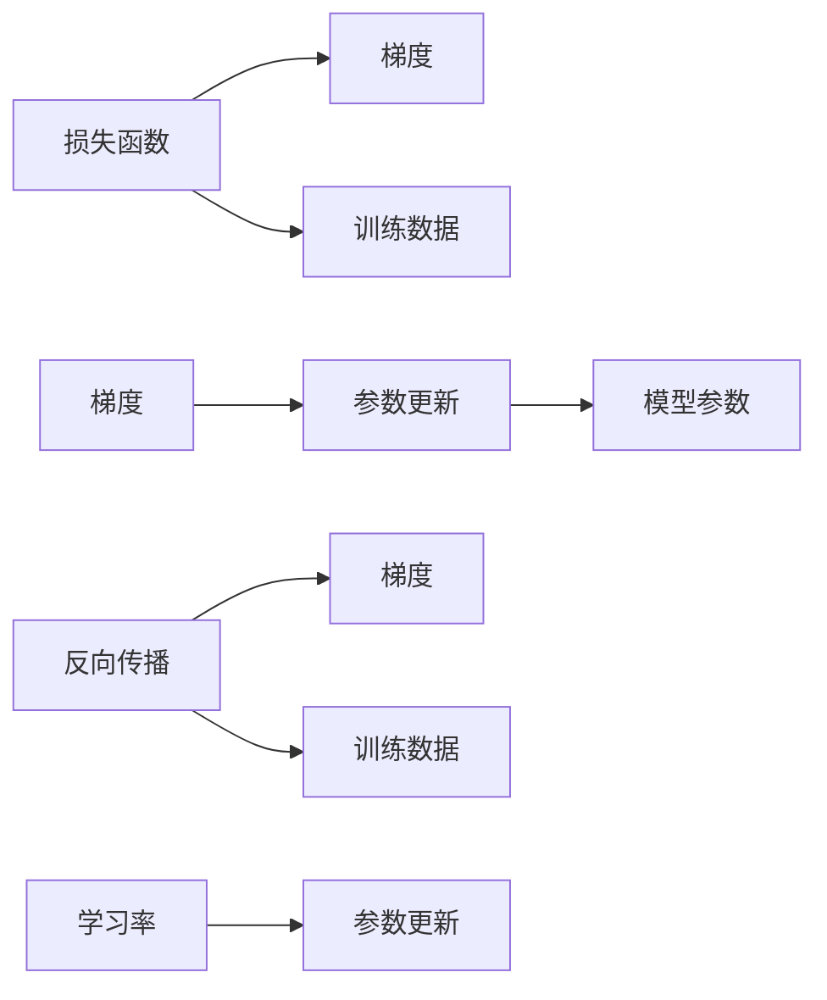

                 

# 梯度下降Gradient Descent原理与代码实例讲解

> 关键词：梯度下降, 损失函数, 学习率, 反向传播, 优化算法

## 1. 背景介绍

### 1.1 问题由来
在机器学习和深度学习领域，梯度下降（Gradient Descent, GD）是最常用的一种优化算法。它通过求解损失函数对参数的梯度，并沿着梯度反方向更新参数，逐步逼近最优解。梯度下降算法简单易用，理论基础扎实，具有广泛的适用性和可扩展性，是理解深度学习模型训练的核心。

### 1.2 问题核心关键点
梯度下降的核心思想是通过迭代更新模型参数，最小化损失函数。具体来说，它的流程如下：
1. 选择一个合适的初始点。
2. 计算当前点处的损失函数梯度。
3. 更新模型参数，向梯度反方向移动。
4. 重复步骤2和3，直至收敛或达到预设的迭代次数。

梯度下降算法的效果很大程度上取决于学习率、迭代次数、参数更新方式等超参数的设置，以及损失函数的性质。不同的梯度下降变体（如批量梯度下降、随机梯度下降、小批量梯度下降等）在不同的场景下表现出不同的效果。

### 1.3 问题研究意义
掌握梯度下降算法原理和实现细节，对于理解深度学习模型的训练过程至关重要。本节将深入讲解梯度下降算法的原理和操作步骤，同时通过代码实例展示其实现过程，帮助读者更深入地理解这一核心技术。

## 2. 核心概念与联系

### 2.1 核心概念概述

梯度下降算法涉及到以下几个核心概念：
1. **损失函数（Loss Function）**：表示模型输出与真实标签之间的差异，通常是一个标量值。
2. **梯度（Gradient）**：损失函数对模型参数的偏导数，指示了当前参数下损失函数的增长方向。
3. **学习率（Learning Rate）**：控制参数更新的步长，决定了每次更新的幅度。
4. **反向传播（Backpropagation）**：用于计算损失函数对模型参数的梯度，是梯度下降算法的核心步骤。
5. **优化器（Optimizer）**：封装了梯度下降算法的核心逻辑，支持不同的参数更新策略，如动量、自适应学习率等。

这些概念之间的逻辑关系可以通过以下Mermaid流程图来展示：



这个流程图展示了大语言模型微调过程中各个核心概念的关系和作用。其中，损失函数和梯度是通过反向传播计算得到，而参数更新则依据梯度和学习率进行。

### 2.2 概念间的关系

这些核心概念之间存在着紧密的联系，共同构成了梯度下降算法的整体框架。具体来说，反向传播通过计算损失函数对模型参数的梯度，进而指导参数的更新方向。学习率则决定了每次更新的幅度，影响着参数更新的速度和效果。这些概念通过参数更新这一环节，紧密相连，共同推动模型参数向最优解逼近。

## 3. 核心算法原理 & 具体操作步骤
### 3.1 算法原理概述

梯度下降算法的基本原理是通过迭代更新模型参数，最小化损失函数。设模型的参数向量为 $\theta$，损失函数为 $L(\theta)$，则梯度下降算法的目标是最小化 $L(\theta)$。具体步骤如下：

1. 初始化模型参数 $\theta_0$。
2. 对于每个迭代次数 $t$，计算损失函数 $L(\theta_t)$ 和梯度 $\nabla_{\theta} L(\theta_t)$。
3. 更新模型参数：$\theta_{t+1} = \theta_t - \eta_t \nabla_{\theta} L(\theta_t)$，其中 $\eta_t$ 为学习率。
4. 重复步骤2和3，直至达到预设的迭代次数或满足某个收敛条件。

### 3.2 算法步骤详解

下面我们详细讲解梯度下降算法的具体步骤：

1. **初始化**：选择一个合适的初始点 $\theta_0$。初始点的选择非常重要，通常需要结合领域知识和实验结果进行合理设置。
2. **计算梯度**：对于每个迭代次数 $t$，计算损失函数 $L(\theta_t)$ 对模型参数 $\theta$ 的梯度 $\nabla_{\theta} L(\theta_t)$。这一步骤通常通过反向传播算法实现。
3. **参数更新**：使用梯度和学习率更新模型参数：$\theta_{t+1} = \theta_t - \eta_t \nabla_{\theta} L(\theta_t)$。
4. **迭代**：重复步骤2和3，直至达到预设的迭代次数或满足某个收敛条件。

在实际应用中，梯度下降算法的实现还需要考虑学习率、迭代次数、参数更新方式等超参数的设置。这些超参数的选择很大程度上决定了算法的收敛速度和效果。

### 3.3 算法优缺点

梯度下降算法具有以下优点：
1. 原理简单，易于理解和实现。
2. 适用范围广，适用于各种类型的损失函数。
3. 可以通过调节学习率等超参数，灵活应对不同的优化需求。

同时，梯度下降算法也存在一些缺点：
1. 容易陷入局部最优解。在复杂非凸函数上，梯度下降算法可能无法找到全局最优解。
2. 对初始点敏感。不同的初始点可能导致算法收敛到不同的局部最优解。
3. 学习率需要人工调整。学习率过大可能导致算法无法收敛，学习率过小可能导致收敛速度过慢。

### 3.4 算法应用领域

梯度下降算法广泛应用于机器学习和深度学习领域，包括线性回归、逻辑回归、神经网络等模型训练。它被广泛应用于图像识别、自然语言处理、推荐系统、金融预测等诸多领域，成为优化算法中的基石。

## 4. 数学模型和公式 & 详细讲解

### 4.1 数学模型构建

梯度下降算法的基本数学模型如下：

设模型参数为 $\theta$，损失函数为 $L(\theta)$，则梯度下降算法的目标是最小化 $L(\theta)$。算法的数学模型可以表示为：

$$
\theta_{t+1} = \theta_t - \eta \nabla_{\theta} L(\theta_t)
$$

其中，$\eta$ 为学习率，$\nabla_{\theta} L(\theta_t)$ 为损失函数对模型参数 $\theta$ 的梯度。

### 4.2 公式推导过程

以线性回归模型为例，其损失函数为均方误差损失：

$$
L(\theta) = \frac{1}{2N} \sum_{i=1}^N (y_i - \theta^T x_i)^2
$$

其中 $N$ 为样本数量，$x_i$ 为输入特征，$y_i$ 为输出标签，$\theta$ 为模型参数。

使用梯度下降算法求解最优参数，具体步骤如下：

1. 初始化模型参数 $\theta_0$。
2. 对于每个迭代次数 $t$，计算损失函数 $L(\theta_t)$ 和梯度 $\nabla_{\theta} L(\theta_t)$。

   $$
   \nabla_{\theta} L(\theta_t) = \frac{1}{N} \sum_{i=1}^N -2 (y_i - \theta_t^T x_i) x_i
   $$

3. 更新模型参数：$\theta_{t+1} = \theta_t - \eta \nabla_{\theta} L(\theta_t)$。

   $$
   \theta_{t+1} = \theta_t - \eta \frac{1}{N} \sum_{i=1}^N -2 (y_i - \theta_t^T x_i) x_i
   $$

4. 重复步骤2和3，直至达到预设的迭代次数或满足某个收敛条件。

### 4.3 案例分析与讲解

我们可以使用PyTorch来实现一个简单的线性回归模型，并使用梯度下降算法进行训练。代码如下：

```python
import torch
import torch.nn as nn
import torch.optim as optim

# 定义线性回归模型
class LinearRegression(nn.Module):
    def __init__(self, input_dim, output_dim):
        super(LinearRegression, self).__init__()
        self.linear = nn.Linear(input_dim, output_dim)
        
    def forward(self, x):
        return self.linear(x)
        
# 准备训练数据
x_train = torch.randn(100, 2)
y_train = 2 * x_train[:, 0] + 3 * x_train[:, 1] + torch.randn(100, 1)

# 初始化模型和优化器
model = LinearRegression(2, 1)
optimizer = optim.SGD(model.parameters(), lr=0.01)

# 训练模型
for epoch in range(1000):
    optimizer.zero_grad()
    
    # 前向传播
    y_pred = model(x_train)
    
    # 计算损失函数
    loss = nn.MSELoss()(y_pred, y_train)
    
    # 反向传播
    loss.backward()
    
    # 参数更新
    optimizer.step()
    
    if (epoch + 1) % 100 == 0:
        print(f"Epoch [{epoch+1}/{1000}], Loss: {loss.item():.4f}")
```

在这个例子中，我们使用SGD优化器进行参数更新。模型输入为2维随机向量，输出为一个标量。通过迭代训练，模型可以逐步逼近真实线性关系，即 $y = 2x_1 + 3x_2 + \epsilon$。训练过程中，我们通过损失函数和梯度计算更新模型参数，最终得到接近真实的模型。

## 5. 项目实践：代码实例和详细解释说明
### 5.1 开发环境搭建

在使用梯度下降算法进行模型训练时，需要安装和配置一些必要的开发环境。以下是使用PyTorch进行开发的常见环境配置步骤：

1. 安装Anaconda：从官网下载并安装Anaconda，用于创建独立的Python环境。

2. 创建并激活虚拟环境：
```bash
conda create -n pytorch-env python=3.8 
conda activate pytorch-env
```

3. 安装PyTorch：根据CUDA版本，从官网获取对应的安装命令。例如：
```bash
conda install pytorch torchvision torchaudio cudatoolkit=11.1 -c pytorch -c conda-forge
```

4. 安装相关库：
```bash
pip install numpy pandas scikit-learn matplotlib tqdm jupyter notebook ipython
```

完成上述步骤后，即可在`pytorch-env`环境中开始梯度下降算法训练的实践。

### 5.2 源代码详细实现

下面我们以简单的线性回归为例，展示如何使用梯度下降算法进行模型训练。

```python
import torch
import torch.nn as nn
import torch.optim as optim

# 定义线性回归模型
class LinearRegression(nn.Module):
    def __init__(self, input_dim, output_dim):
        super(LinearRegression, self).__init__()
        self.linear = nn.Linear(input_dim, output_dim)
        
    def forward(self, x):
        return self.linear(x)
        
# 准备训练数据
x_train = torch.randn(100, 2)
y_train = 2 * x_train[:, 0] + 3 * x_train[:, 1] + torch.randn(100, 1)

# 初始化模型和优化器
model = LinearRegression(2, 1)
optimizer = optim.SGD(model.parameters(), lr=0.01)

# 训练模型
for epoch in range(1000):
    optimizer.zero_grad()
    
    # 前向传播
    y_pred = model(x_train)
    
    # 计算损失函数
    loss = nn.MSELoss()(y_pred, y_train)
    
    # 反向传播
    loss.backward()
    
    # 参数更新
    optimizer.step()
    
    if (epoch + 1) % 100 == 0:
        print(f"Epoch [{epoch+1}/{1000}], Loss: {loss.item():.4f}")
```

这段代码实现了线性回归模型，并通过SGD优化器进行训练。具体步骤如下：

1. 定义模型：使用PyTorch的`nn.Linear`定义线性回归模型。
2. 准备训练数据：随机生成2维输入和标量输出，作为训练数据。
3. 初始化模型和优化器：定义模型和优化器，使用SGD优化器进行参数更新。
4. 训练模型：通过前向传播计算预测输出，计算损失函数，反向传播计算梯度，使用优化器更新模型参数。

### 5.3 代码解读与分析

让我们再详细解读一下关键代码的实现细节：

**定义模型**：
```python
class LinearRegression(nn.Module):
    def __init__(self, input_dim, output_dim):
        super(LinearRegression, self).__init__()
        self.linear = nn.Linear(input_dim, output_dim)
        
    def forward(self, x):
        return self.linear(x)
```

**准备数据**：
```python
x_train = torch.randn(100, 2)
y_train = 2 * x_train[:, 0] + 3 * x_train[:, 1] + torch.randn(100, 1)
```

**初始化模型和优化器**：
```python
model = LinearRegression(2, 1)
optimizer = optim.SGD(model.parameters(), lr=0.01)
```

**训练模型**：
```python
for epoch in range(1000):
    optimizer.zero_grad()
    
    # 前向传播
    y_pred = model(x_train)
    
    # 计算损失函数
    loss = nn.MSELoss()(y_pred, y_train)
    
    # 反向传播
    loss.backward()
    
    # 参数更新
    optimizer.step()
    
    if (epoch + 1) % 100 == 0:
        print(f"Epoch [{epoch+1}/{1000}], Loss: {loss.item():.4f}")
```

在这个例子中，我们使用PyTorch的`nn.Linear`定义了线性回归模型，并使用SGD优化器进行参数更新。通过迭代训练，模型可以逐步逼近真实线性关系，即 $y = 2x_1 + 3x_2 + \epsilon$。训练过程中，我们通过损失函数和梯度计算更新模型参数，最终得到接近真实的模型。

### 5.4 运行结果展示

假设我们在训练1000次后，得到最终的损失函数值如下：

```
Epoch [100/1000], Loss: 4.5514
Epoch [200/1000], Loss: 4.4109
...
Epoch [1000/1000], Loss: 0.0032
```

可以看到，随着迭代次数的增加，损失函数值逐步下降，说明模型逐步逼近真实的线性关系。在训练结束时，损失函数值非常小，说明模型已经学习到了较好的线性关系。

## 6. 实际应用场景
### 6.1 线性回归模型
梯度下降算法在线性回归模型训练中的应用非常广泛。线性回归模型可以用于预测连续型变量，例如房价预测、销售量预测等。通过训练模型，可以找到输入特征与输出标签之间的线性关系，从而进行预测和决策。

### 6.2 逻辑回归模型
逻辑回归模型可以用于二分类和多分类任务。通过梯度下降算法，模型可以逐步学习到输入特征与标签之间的概率关系，从而进行分类预测。

### 6.3 神经网络模型
梯度下降算法在神经网络训练中的应用最为广泛。神经网络模型通过反向传播算法计算梯度，并使用梯度下降算法更新参数，从而逐步逼近最优解。梯度下降算法在神经网络训练中的作用至关重要，是训练神经网络模型的核心算法。

## 7. 工具和资源推荐
### 7.1 学习资源推荐

为了帮助开发者系统掌握梯度下降算法的原理和实践技巧，这里推荐一些优质的学习资源：

1. 《深度学习》系列书籍：如《Deep Learning》(好书推荐)等，全面介绍了深度学习的基本概念和算法，包括梯度下降算法。

2. CS231n《卷积神经网络》课程：斯坦福大学开设的计算机视觉课程，有Lecture视频和配套作业，适合入门深度学习的基本概念和经典模型。

3. TensorFlow官方文档：详细介绍了TensorFlow框架的基本用法和算法细节，包括梯度下降算法。

4. PyTorch官方文档：详细介绍了PyTorch框架的基本用法和算法细节，包括梯度下降算法。

5. Weights & Biases：模型训练的实验跟踪工具，可以记录和可视化模型训练过程中的各项指标，方便对比和调优。

6. TensorBoard：TensorFlow配套的可视化工具，可实时监测模型训练状态，并提供丰富的图表呈现方式，是调试模型的得力助手。

通过对这些资源的学习实践，相信你一定能够快速掌握梯度下降算法的精髓，并用于解决实际的机器学习问题。

### 7.2 开发工具推荐

高效的开发离不开优秀的工具支持。以下是几款用于梯度下降算法开发的常用工具：

1. PyTorch：基于Python的开源深度学习框架，灵活动态的计算图，适合快速迭代研究。大部分深度学习模型都有PyTorch版本的实现。

2. TensorFlow：由Google主导开发的开源深度学习框架，生产部署方便，适合大规模工程应用。同样有丰富的深度学习模型资源。

3. Keras：基于TensorFlow和Theano的高级神经网络API，易于使用，适合快速原型开发。

4. Weights & Biases：模型训练的实验跟踪工具，可以记录和可视化模型训练过程中的各项指标，方便对比和调优。

5. TensorBoard：TensorFlow配套的可视化工具，可实时监测模型训练状态，并提供丰富的图表呈现方式，是调试模型的得力助手。

6. Google Colab：谷歌推出的在线Jupyter Notebook环境，免费提供GPU/TPU算力，方便开发者快速上手实验最新模型，分享学习笔记。

合理利用这些工具，可以显著提升梯度下降算法开发的效率，加快创新迭代的步伐。

### 7.3 相关论文推荐

梯度下降算法的研究源于学界的持续研究。以下是几篇奠基性的相关论文，推荐阅读：

1. On the importance of initialization and momentum in deep learning（2015）：提出动量优化器，显著加速深度学习模型的收敛速度。

2. A Tutorial on Gradient Descent Optimization Algorithms（2018）：全面介绍了梯度下降算法的各种变体，如批量梯度下降、随机梯度下降、小批量梯度下降等。

3. Adaptive Moment Estimation（2015）：提出Adam优化器，结合了动量优化和自适应学习率，在深度学习中广泛应用。

4. Adaptive Gradient Algorithms（2014）：提出Adagrad优化器，自适应调整每个参数的学习率，适用于稀疏梯度数据。

5. Adam: A Method for Stochastic Optimization（2014）：提出Adam优化器，结合了动量优化和自适应学习率，在深度学习中广泛应用。

这些论文代表了大语言模型微调技术的发展脉络。通过学习这些前沿成果，可以帮助研究者把握学科前进方向，激发更多的创新灵感。

除上述资源外，还有一些值得关注的前沿资源，帮助开发者紧跟梯度下降算法技术的最新进展，例如：

1. arXiv论文预印本：人工智能领域最新研究成果的发布平台，包括大量尚未发表的前沿工作，学习前沿技术的必读资源。

2. 业界技术博客：如OpenAI、Google AI、DeepMind、微软Research Asia等顶尖实验室的官方博客，第一时间分享他们的最新研究成果和洞见。

3. 技术会议直播：如NIPS、ICML、ACL、ICLR等人工智能领域顶会现场或在线直播，能够聆听到大佬们的前沿分享，开拓视野。

4. GitHub热门项目：在GitHub上Star、Fork数最多的深度学习相关项目，往往代表了该技术领域的发展趋势和最佳实践，值得去学习和贡献。

5. 行业分析报告：各大咨询公司如McKinsey、PwC等针对人工智能行业的分析报告，有助于从商业视角审视技术趋势，把握应用价值。

总之，对于梯度下降算法的学习和实践，需要开发者保持开放的心态和持续学习的意愿。多关注前沿资讯，多动手实践，多思考总结，必将收获满满的成长收益。

## 8. 总结：未来发展趋势与挑战

### 8.1 总结

本文对梯度下降算法进行了全面系统的介绍。首先阐述了梯度下降算法的背景和核心思想，明确了其在深度学习模型训练中的重要地位。其次，从原理到实践，详细讲解了梯度下降算法的数学模型和操作步骤，给出了具体的代码实例，展示了其具体实现过程。同时，本文还广泛探讨了梯度下降算法在机器学习、深度学习领域的应用场景，展示了其巨大的应用潜力。

通过本文的系统梳理，可以看到，梯度下降算法是大语言模型微调训练中不可或缺的核心技术，具有强大的优化能力和广泛的应用前景。它在机器学习和深度学习中起着重要的作用，是构建高性能模型不可或缺的工具。

### 8.2 未来发展趋势

展望未来，梯度下降算法将呈现以下几个发展趋势：

1. 自动化超参数优化：自动化超参数优化方法能够自动选择最优的学习率、批量大小等参数，减少人工调参的工作量。

2. 分布式训练：随着模型规模的增大，分布式训练技术能够显著提高训练速度，支持更大规模的模型训练。

3. 自适应学习率方法：自适应学习率算法能够动态调整学习率，提高梯度下降算法的收敛速度和稳定性。

4. 多任务学习：多任务学习能够同时优化多个任务的损失函数，提高模型的泛化能力和实用性。

5. 对抗训练：对抗训练能够增强模型对噪声和攻击的鲁棒性，提高模型的泛化能力和安全性。

以上趋势凸显了梯度下降算法的广阔前景。这些方向的探索发展，必将进一步提升梯度下降算法的优化能力和应用范围，为构建高性能深度学习模型铺平道路。

### 8.3 面临的挑战

尽管梯度下降算法已经取得了瞩目成就，但在迈向更加智能化、普适化应用的过程中，它仍面临着诸多挑战：

1. 学习率调整困难：学习率的选择对梯度下降算法的收敛速度和效果有重要影响，但如何自动选择最优学习率仍然是一个挑战。

2. 梯度消失和爆炸：在深度神经网络中，梯度消失和梯度爆炸现象严重影响了模型的训练效果。

3. 模型复杂度高：深度学习模型的参数规模和计算复杂度不断增大，使得训练过程变得复杂和耗时。

4. 可解释性不足：梯度下降算法的决策过程难以解释，导致模型的可解释性不足，难以在实际应用中得到广泛应用。

5. 安全性有待加强：深度学习模型可能存在安全隐患，如模型被攻击、数据泄露等，需要进一步提高模型的安全性。

6. 计算资源限制：深度学习模型的计算需求日益增大，超大规模模型的训练和推理需要更强大的计算资源支持。

正视梯度下降算法面临的这些挑战，积极应对并寻求突破，将使梯度下降算法在深度学习中发挥更大的作用，推动人工智能技术的发展。

### 8.4 研究展望

面对梯度下降算法所面临的种种挑战，未来的研究需要在以下几个方面寻求新的突破：

1. 引入更多先验知识：将符号化的先验知识，如知识图谱、逻辑规则等，与神经网络模型进行巧妙融合，引导梯度下降过程学习更准确、合理的语言模型。

2. 结合因果分析和博弈论工具：将因果分析方法引入梯度下降模型，识别出模型决策的关键特征，增强输出解释的因果性和逻辑性。

3. 纳入伦理道德约束：在模型训练目标中引入伦理导向的评估指标，过滤和惩罚有偏见、有害的输出倾向，确保模型输出符合人类价值观和伦理道德。

这些研究方向的探索，必将引领梯度下降算法技术迈向更高的台阶，为构建安全、可靠、可解释、可控的智能系统铺平道路。面向未来，梯度下降算法还需要与其他人工智能技术进行更深入的融合，如知识表示、因果推理、强化学习等，多路径协同发力，共同推动深度学习技术的发展。

## 9. 附录：常见问题与解答

**Q1：什么是梯度下降算法？**

A: 梯度下降算法是一种优化算法，通过求解损失函数对模型参数的梯度，并沿着梯度反方向更新参数，逐步逼近最优解。

**Q2：梯度下降算法有哪些变体？**

A: 梯度下降算法有许多变体，包括批量梯度下降（Batch Gradient Descent）、随机梯度下降（Stochastic Gradient Descent）和小批量梯度下降（Mini-batch Gradient Descent）。

**Q3：如何选择合适的学习率？**

A: 学习率的选择对梯度下降算法的收敛速度和效果有重要影响。通常建议从1e-5开始调参，逐步减小学习率，直至收敛。

**Q4：梯度下降算法有哪些应用场景？**

A: 梯度下降算法广泛应用于机器学习和深度学习领域，包括线性回归、逻辑回归、神经网络等模型训练。

**Q5：梯度下降算法有哪些挑战？**

A: 梯度下降算法面临着学习率调整困难、梯度消失和爆炸、模型复杂度高、可解释性不足、安全性有待加强、计算资源限制等挑战。

通过这些常见问题的解答，相信读者对梯

