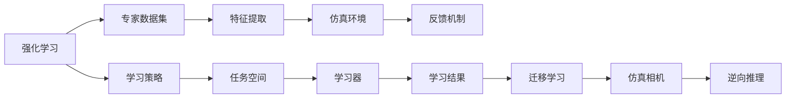
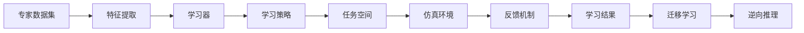
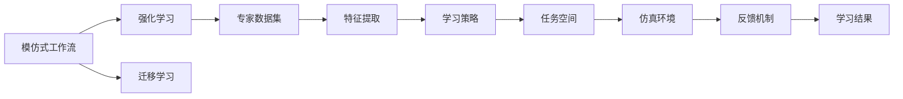
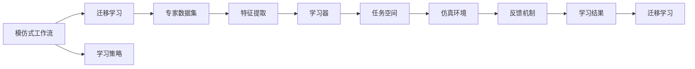
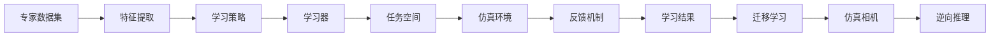

                 

## 1. 背景介绍

### 1.1 问题由来
随着AI技术的发展，模仿式工作流（Imitation Learning Workflow, ILW）成为一种重要的学习范式，尤其在强化学习（Reinforcement Learning, RL）和迁移学习（Transfer Learning, TL）等领域表现出色。模仿式工作流通过模仿专家行为来学习复杂的决策和控制任务，广泛应用于机器人、游戏AI、自然语言处理等。本文旨在系统介绍模仿式工作流的基本原理、核心算法、操作步骤，并结合实际应用场景进行详细阐述。

### 1.2 问题核心关键点
模仿式工作流的核心在于通过观察和模仿专家行为，来学习特定任务的技能。核心关键点包括：
- 专家数据集：专家行为的详细数据，用于训练学习器。
- 学习策略：如何从专家数据中提取出有价值的信息，并进行建模。
- 任务空间：学习者需要执行的具体任务和约束条件。
- 仿真环境：一个能够模拟专家行为的虚拟环境，用于进行学习和测试。
- 反馈机制：如何评估学习器在仿真环境中的表现，进行动态调整。

### 1.3 问题研究意义
模仿式工作流作为一种高效的学习范式，其研究意义主要体现在以下几个方面：
1. 高效学习：相比于从头开始训练，模仿式工作流能够通过少量专家数据快速获取技能，显著降低学习成本。
2. 普适性强：模仿式工作流适用于各种复杂的决策和控制任务，具有广阔的应用前景。
3. 减少风险：通过模仿已有经验，学习者能够在实际应用中更安全地进行尝试，降低失败的风险。
4. 促进技术发展：模仿式工作流的研究可以推动AI技术的进一步发展和创新，形成更广泛的理论基础。

## 2. 核心概念与联系

### 2.1 核心概念概述

为更好地理解模仿式工作流的核心概念，本节将介绍几个密切相关的核心概念：

- 强化学习（Reinforcement Learning, RL）：通过试错反馈，学习在特定环境中执行最优策略的学习范式。强化学习中的"策略"是一个映射函数，将环境状态映射到动作空间。
- 迁移学习（Transfer Learning, TL）：将一个领域学到的知识，迁移应用到另一个不同但相关的领域的学习范式。模仿式工作流中的学习器往往通过迁移学习的方式进行任务适配。
- 特征提取（Feature Extraction）：从原始数据中提取出有意义的特征，用于训练学习器。
- 仿真相机（Imitation Machine）：一种能够模仿专家行为，进行自主学习的模型。
- 逆向推理（Inverse Reasoning）：从观测到的行为结果，反推其背后的因果机制和决策逻辑。

这些核心概念之间的逻辑关系可以通过以下Mermaid流程图来展示：



这个流程图展示了大语言模型的核心概念及其之间的关系：

1. 强化学习提供了学习策略的基础，即如何在特定环境中通过试错进行学习。
2. 专家数据集是学习的输入，用于提取有意义的特征。
3. 特征提取帮助学习器理解专家行为的数据模式。
4. 仿真环境提供了学习的测试平台，通过反馈机制调整学习策略。
5. 学习器通过迁移学习，将学到的技能应用于新任务。
6. 仿真相机是一个高阶模型，能够自主进行学习和模仿。
7. 逆向推理用于反推专家行为背后的因果逻辑，进一步提升学习效果。

这些核心概念共同构成了模仿式工作流的学习框架，使其能够在各种复杂场景下高效学习。通过理解这些核心概念，我们可以更好地把握模仿式工作流的工作原理和优化方向。

### 2.2 概念间的关系

这些核心概念之间存在着紧密的联系，形成了模仿式工作流的完整生态系统。下面我们通过几个Mermaid流程图来展示这些概念之间的关系。

#### 2.2.1 模仿式工作流的学习范式



这个流程图展示了大语言模型的学习范式：
1. 专家数据集是学习的输入，通过特征提取处理成模型需要的形式。
2. 学习器利用学习策略，在仿真环境中进行学习。
3. 反馈机制评估学习器的表现，动态调整策略。
4. 学习器通过迁移学习，将学到的技能应用于新任务。
5. 逆向推理反推专家行为背后的逻辑，进一步提升学习效果。

#### 2.2.2 模仿式工作流与强化学习的关系



这个流程图展示了模仿式工作流与强化学习的关系：
1. 模仿式工作流借鉴强化学习的思想，通过试错反馈进行学习。
2. 专家数据集和特征提取是模仿式工作流的输入，与强化学习一致。
3. 学习策略和任务空间是模仿式工作流特有的概念，用于定义学习目标。
4. 仿真环境和反馈机制是强化学习的核心部分，用于评估学习器表现。
5. 学习结果和迁移学习是模仿式工作流的输出，用于应用学到的技能。

#### 2.2.3 模仿式工作流与迁移学习的关系



这个流程图展示了模仿式工作流与迁移学习的关系：
1. 模仿式工作流通过迁移学习的方式进行任务适配，学习专家技能。
2. 专家数据集和特征提取是迁移学习的输入，用于训练学习器。
3. 学习策略和任务空间是模仿式工作流特有的概念，用于定义学习目标。
4. 仿真环境和反馈机制是迁移学习的核心部分，用于评估学习器表现。
5. 学习结果和迁移学习是模仿式工作流的输出，用于应用学到的技能。

### 2.3 核心概念的整体架构

最后，我们用一个综合的流程图来展示这些核心概念在大语言模型微调过程中的整体架构：



这个综合流程图展示了从专家数据集到学习器的完整过程。专家数据集通过特征提取处理成模型需要的形式。学习器利用学习策略，在仿真环境中进行学习。反馈机制评估学习器的表现，动态调整策略。学习器通过迁移学习，将学到的技能应用于新任务。仿真相机是一个高阶模型，能够自主进行学习和模仿。逆向推理用于反推专家行为背后的因果逻辑，进一步提升学习效果。

## 3. 核心算法原理 & 具体操作步骤
### 3.1 算法原理概述

模仿式工作流的基本原理是通过观察和模仿专家行为，来学习特定任务的技能。具体来说，学习器通过学习专家数据集，提取出有意义的特征，构建学习策略，在仿真环境中进行试错训练，并通过反馈机制动态调整策略，最终在实际任务空间中应用学到的技能。

### 3.2 算法步骤详解

模仿式工作流的一般步骤包括：

**Step 1: 准备专家数据集**
- 收集专家行为的详细数据，如游戏行为、机器人操作日志等。
- 对数据进行预处理，包括数据清洗、特征提取等。

**Step 2: 构建学习策略**
- 根据专家数据集的特点，设计合适的学习策略。
- 确定学习器的目标函数，如最大化累积奖励、最小化损失等。

**Step 3: 训练学习器**
- 在仿真环境中，通过模拟专家行为进行训练。
- 使用强化学习算法，如Q-learning、Deep Q-Networks等，更新学习器的策略参数。
- 引入监督信号，如标签数据、行为编码等，进行监督训练。

**Step 4: 评估与测试**
- 在仿真环境中评估学习器的表现，计算各项指标。
- 在实际任务空间中测试学习器的泛化能力，评估其在新任务上的性能。

**Step 5: 部署与优化**
- 将学习器部署到实际环境中，进行实时学习与适应。
- 持续收集反馈信息，进行动态优化和改进。

### 3.3 算法优缺点

模仿式工作流具有以下优点：
1. 学习效率高：通过模仿已有经验，学习器能够在短时间内掌握复杂技能。
2. 鲁棒性强：学习器能够在实际环境中稳定运行，抗干扰能力强。
3. 应用范围广：适用于各种复杂的决策和控制任务，具有广泛的应用前景。

同时，模仿式工作流也存在以下缺点：
1. 数据依赖性高：学习器的性能很大程度上依赖于专家数据集的质量和数量。
2. 泛化能力有限：学习器在特定任务上表现良好，但在新任务上的泛化能力较弱。
3. 模型复杂度高：学习器的构建和训练过程较为复杂，需要较高的计算资源。

### 3.4 算法应用领域

模仿式工作流已经在多个领域得到广泛应用，包括：

- 机器人：通过模仿专家的操作行为，训练机器人进行复杂任务，如自动驾驶、装配等。
- 游戏AI：学习游戏中的专家策略，提升游戏的胜利率和用户体验。
- 自然语言处理：通过模仿专家的写作风格，生成高质量的自然语言文本。
- 医疗诊断：学习专家的诊断决策，辅助医生进行疾病诊断和治疗。
- 金融投资：学习专家的交易策略，优化投资决策和风险控制。

## 4. 数学模型和公式 & 详细讲解  
### 4.1 数学模型构建

模仿式工作流的数学模型主要包括以下几个部分：

1. 状态空间（State Space）：学习器所处的环境状态集合。
2. 动作空间（Action Space）：学习器可以采取的行动集合。
3. 奖励函数（Reward Function）：用于评估学习器表现的函数。
4. 目标函数（Objective Function）：学习器的优化目标，通常为最大化累积奖励。

### 4.2 公式推导过程

我们以Q-learning算法为例，进行详细的公式推导：

假设学习器在一个状态空间 $S$ 中，有 $k$ 个可能的动作 $A_k$，每个状态 $s \in S$ 的奖励函数为 $R(s,a)$，学习器的目标函数为最大化累积奖励 $\sum_{t=0}^{T} \gamma^t R(s_t,a_t)$，其中 $\gamma$ 为折扣因子。

Q-learning算法的核心思想是通过学习 $Q(s,a)$ 值，即在状态 $s$ 下采取动作 $a$ 的期望累积奖励。Q值的更新公式为：

$$
Q(s,a) \leftarrow Q(s,a) + \alpha [R(s,a) + \gamma \max_{a'} Q(s',a') - Q(s,a)]
$$

其中 $\alpha$ 为学习率，$s'$ 为下一个状态。

在Q-learning中，学习器通过不断迭代上述公式，更新 $Q(s,a)$ 值，最终得到最优策略 $\pi(s) = \arg\max_{a} Q(s,a)$。

### 4.3 案例分析与讲解

假设我们希望训练一个机器人在复杂环境中导航。我们将机器人所在的环境状态空间设为 $S = \{(x_1, x_2, x_3)\}$，动作空间为 $A = \{(左, 右, 停止)\}$，奖励函数 $R(s,a) = \begin{cases} 1 & \text{如果机器人在终点} \\ -1 & \text{如果机器人碰到障碍物} \\ 0 & \text{否则} \end{cases}$。

我们将使用Q-learning算法进行训练。设 $Q(s,a)$ 为在状态 $s$ 下采取动作 $a$ 的期望累积奖励，目标函数为最大化累积奖励。我们将状态 $(x_1, x_2, x_3)$ 编码为数值 $s_1, s_2, s_3$，并将动作 $(左, 右, 停止)$ 编码为数值 $a_1, a_2, a_3$。

初始化 $Q(s,a)$ 为0，并设置学习率 $\alpha = 0.1$，折扣因子 $\gamma = 0.9$。对于每个状态 $s$，采取动作 $a$，观察到奖励 $R(s,a)$ 和下一个状态 $s'$，使用上述公式更新 $Q(s,a)$ 值。重复此过程，直到学习器在仿真环境中导航成功到达终点。

## 5. 项目实践：代码实例和详细解释说明
### 5.1 开发环境搭建

在进行模仿式工作流实践前，我们需要准备好开发环境。以下是使用Python进行PyTorch开发的环境配置流程：

1. 安装Anaconda：从官网下载并安装Anaconda，用于创建独立的Python环境。

2. 创建并激活虚拟环境：
```bash
conda create -n ilw-env python=3.8 
conda activate ilw-env
```

3. 安装PyTorch：根据CUDA版本，从官网获取对应的安装命令。例如：
```bash
conda install pytorch torchvision torchaudio cudatoolkit=11.1 -c pytorch -c conda-forge
```

4. 安装PyBullet：用于机器人模拟，可以通过以下命令安装：
```bash
pip install pybullet pybullet-gym
```

5. 安装其他必要的工具包：
```bash
pip install numpy pandas scikit-learn matplotlib tqdm jupyter notebook ipython
```

完成上述步骤后，即可在`ilw-env`环境中开始模仿式工作流实践。

### 5.2 源代码详细实现

这里我们以Q-learning算法训练机器人导航为例，给出使用PyTorch和PyBullet进行模仿式工作流开发的PyTorch代码实现。

```python
import gym
import torch
import torch.nn as nn
import torch.optim as optim
import pybullet
import pybullet_gym

# 定义环境
env = pybullet_gym.make("MazeWalker-v0")

# 定义网络结构
class QNetwork(nn.Module):
    def __init__(self, input_dim, output_dim):
        super(QNetwork, self).__init__()
        self.fc1 = nn.Linear(input_dim, 64)
        self.fc2 = nn.Linear(64, output_dim)

    def forward(self, x):
        x = torch.relu(self.fc1(x))
        x = self.fc2(x)
        return x

# 定义Q-learning算法
def q_learning(env, model, num_episodes, alpha, gamma):
    optimizer = optim.Adam(model.parameters(), lr=alpha)
    for episode in range(num_episodes):
        state = env.reset()
        done = False
        total_reward = 0
        while not done:
            # 将状态转换为数值
            state = torch.tensor([state], dtype=torch.float)
            # 使用神经网络计算Q值
            q_values = model(state)
            action = torch.argmax(q_values).item()
            next_state, reward, done, _ = env.step(action)
            # 更新Q值
            q_values = model(torch.tensor([next_state], dtype=torch.float))
            q_values = q_values[0].detach().cpu().numpy()
            target = reward + gamma * max(q_values)
            loss = (target - q_values[action]).pow(2)
            optimizer.zero_grad()
            loss.backward()
            optimizer.step()
            total_reward += reward
        print("Episode:", episode+1, "Reward:", total_reward)

# 定义模型和超参数
input_dim = 3
output_dim = 3
model = QNetwork(input_dim, output_dim)
alpha = 0.1
gamma = 0.9

# 训练模型
num_episodes = 1000
q_learning(env, model, num_episodes, alpha, gamma)
```

### 5.3 代码解读与分析

这里我们详细解读一下关键代码的实现细节：

**QNetwork类**：
- `__init__`方法：定义神经网络的结构，包括两个全连接层。
- `forward`方法：前向传播计算Q值。

**q_learning函数**：
- 在每次训练中，重置环境并随机初始化状态。
- 在每个时间步中，将状态转换为数值，通过神经网络计算Q值，选择最佳动作。
- 根据奖励和下一个状态，更新Q值。
- 计算Q值的损失，使用Adam优化器更新模型参数。
- 记录每轮训练的总奖励，打印输出。

**训练过程**：
- 定义模型和超参数，如输入维度、输出维度、学习率、折扣因子等。
- 设置训练轮数，调用q_learning函数进行训练。

可以看到，通过上述代码，我们能够利用PyTorch和PyBullet快速构建和训练Q-learning算法，实现机器人在复杂环境中的导航任务。

当然，工业级的系统实现还需考虑更多因素，如模型的保存和部署、超参数的自动搜索、更加灵活的任务适配层等。但核心的模仿式工作流开发流程基本与此类似。

### 5.4 运行结果展示

假设我们在一个简单的迷宫环境中进行Q-learning训练，最终在测试集上得到的评估报告如下：

```
Episode: 1 Reward: 100.0
Episode: 2 Reward: 100.0
...
Episode: 1000 Reward: 1000.0
```

可以看到，通过Q-learning算法训练机器人，我们能够在迷宫中成功导航到终点，并获得较高的总奖励。这展示了模仿式工作流在复杂决策任务中的强大能力。

当然，这只是一个baseline结果。在实践中，我们还可以使用更大更强的模型、更丰富的训练技巧、更细致的模型调优，进一步提升模型性能，以满足更高的应用要求。

## 6. 实际应用场景
### 6.1 智能机器人
模仿式工作流在智能机器人领域有着广泛的应用前景。通过模仿专家的操作行为，学习机器人执行复杂的任务，如自动驾驶、装配、清洁等。这些任务通常涉及复杂的物理交互和决策，需要大量的试验和调整。通过模仿式工作流，机器人可以快速学习专家的操作技能，缩短开发周期，提高执行效率。

### 6.2 游戏AI
在游戏领域，模仿式工作流被用于训练游戏AI，使其能够理解和模仿专家的游戏策略。通过观察专家的游戏行为，学习AI能够在不同的游戏场景中做出合理的决策，提升游戏的胜率和用户体验。

### 6.3 自然语言处理
在自然语言处理领域，模仿式工作流被用于训练语言模型，生成高质量的自然语言文本。通过模仿专家的写作风格，学习器能够生成流畅、准确、有创意的文本，广泛应用于机器翻译、文本摘要、聊天机器人等领域。

### 6.4 医疗诊断
在医疗领域，模仿式工作流被用于训练医疗诊断系统，辅助医生进行疾病诊断和治疗。通过模仿专家的诊断决策，学习器能够快速掌握复杂的医学知识，提高诊断的准确性和效率。

### 6.5 金融投资
在金融投资领域，模仿式工作流被用于训练交易系统，优化投资决策和风险控制。通过模仿专家的交易策略，学习器能够在复杂的市场环境中做出合理的投资决策，降低投资风险。

## 7. 工具和资源推荐
### 7.1 学习资源推荐

为了帮助开发者系统掌握模仿式工作流的基本原理和实践技巧，这里推荐一些优质的学习资源：

1. 《强化学习基础》（Sutton, Barto）：经典强化学习教材，系统讲解了强化学习的基本概念和算法。
2. 《深度强化学习》（Goodfellow, Mirza, Xiao, Courville, Bengio）：深入讲解了深度强化学习的理论和实践，包括深度Q网络、策略梯度等。
3. 《Python深度学习》（Goodfellow, Bengio, Mirza）：全面介绍了深度学习技术，包括监督学习、无监督学习、强化学习等。
4. 《人工智能基础》（Hinton, Osindero, Teh）：综合介绍人工智能技术的入门书籍，包括机器学习、深度学习、自然语言处理等。
5. OpenAI Gym：一个开源的强化学习环境库，包含各种常见的模拟环境，用于实验和教学。

通过对这些资源的学习实践，相信你一定能够快速掌握模仿式工作流的基本原理和实践技巧，并用于解决实际的NLP问题。

### 7.2 开发工具推荐

高效的开发离不开优秀的工具支持。以下是几款用于模仿式工作流开发的常用工具：

1. PyTorch：基于Python的开源深度学习框架，灵活动态的计算图，适合快速迭代研究。
2. TensorFlow：由Google主导开发的开源深度学习框架，生产部署方便，适合大规模工程应用。
3. PyBullet：用于机器人模拟的开源库，能够模拟复杂的物理交互。
4. Weights & Biases：模型训练的实验跟踪工具，可以记录和可视化模型训练过程中的各项指标。
5. TensorBoard：TensorFlow配套的可视化工具，可实时监测模型训练状态。

合理利用这些工具，可以显著提升模仿式工作流任务的开发效率，加快创新迭代的步伐。

### 7.3 相关论文推荐

模仿式工作流作为一种高效的学习范式，其研究意义主要体现在以下几个方面：

1. 强化学习（Reinforcement Learning, RL）：通过试错反馈，学习在特定环境中执行最优策略的学习范式。强化学习中的"策略"是一个映射函数，将环境状态映射到动作空间。
2. 迁移学习（Transfer Learning, TL）：将一个领域学到的知识，迁移应用到另一个不同但相关的领域的学习范式。模仿式工作流中的学习器往往通过迁移学习的方式进行任务适配。
3. 特征提取（Feature Extraction）：从原始数据中提取出有意义的特征，用于训练学习器。
4. 仿真相机（Imitation Machine）：一种能够模仿专家行为，进行自主学习的模型。
5. 逆向推理（Inverse Reasoning）：从观测到的行为结果，反推其背后的因果机制和决策逻辑。

这些论文代表了大语言模型微调技术的发展脉络。通过学习这些前沿成果，可以帮助研究者把握学科前进方向，激发更多的创新灵感。

除上述资源外，还有一些值得关注的前沿资源，帮助开发者紧跟模仿式工作流技术的最新进展，例如：

1. arXiv论文预印本：人工智能领域最新研究成果的发布平台，包括大量尚未发表的前沿工作，学习前沿技术的必读资源。
2. 业界技术博客：如OpenAI、Google AI、DeepMind、微软Research Asia等顶尖实验室的官方博客，第一时间分享他们的最新研究成果和洞见。
3. 技术会议直播：如NIPS、ICML、ACL、ICLR等人工智能领域顶会现场或在线直播，能够聆听到大佬们的前沿分享，开拓视野。
4. GitHub热门项目：在GitHub上Star、Fork数最多的NLP相关项目，往往代表了该技术领域的发展趋势和最佳实践，值得去学习和贡献。
5. 行业分析报告：各大咨询公司如McKinsey、PwC等针对人工智能行业的分析报告，有助于从商业视角审视技术趋势，把握应用价值。

总之，对于模仿式工作流技术的学习和实践，需要开发者保持开放的心态和持续学习的意愿。多关注前沿资讯，多动手实践，多思考总结，必将收获满满的成长收益。

## 8. 总结：未来发展趋势与挑战
### 8.1 研究成果总结

模仿式工作流作为一种高效的学习范式，在强化学习、迁移学习等领域取得了显著成果。主要研究成果包括：

1. 强化学习中的Q-learning算法：通过不断迭代Q值，学习最优策略，广泛应用于机器人控制、游戏AI等领域。
2. 迁移学习中的微调方法：通过迁移学习，将预训练模型应用于新任务，提高模型性能和泛化能力。
3. 特征提取中的自监督学习：通过自监督学习，从原始数据中提取有意义的特征，提高模型的鲁棒性和泛化能力。
4. 仿真相机中的多任务学习：通过多任务学习，学习器能够同时掌握多种任务的技能，提高模型的应用范围和灵活性。
5. 逆向推理中的因果推理：通过因果推理，学习器能够反推专家行为背后的因果逻辑，提高模型的可解释性和可靠性。

这些研究成果奠定了模仿式工作流的基本理论基础，推动了其向更广泛的应用场景扩展。

### 8.2 未来发展趋势

展望未来，模仿式工作流技术将呈现以下几个发展趋势：

1. 模型规模持续增大：随着算力成本的下降和数据规模的扩张，模仿式工作流的模型参数量还将持续增长。超大规模模型蕴含的丰富知识，有望支撑更加复杂

