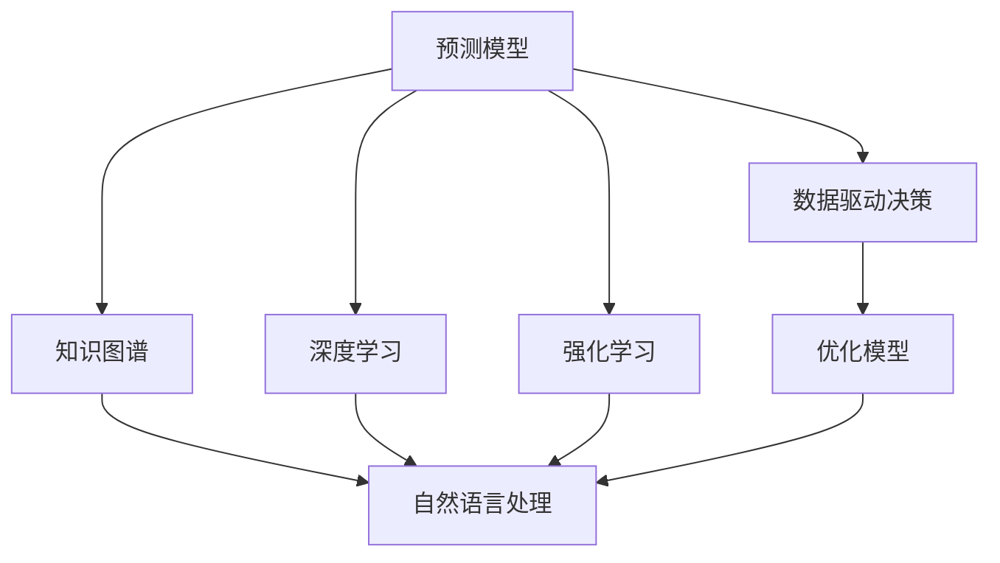
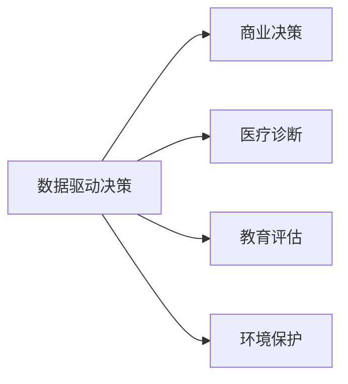
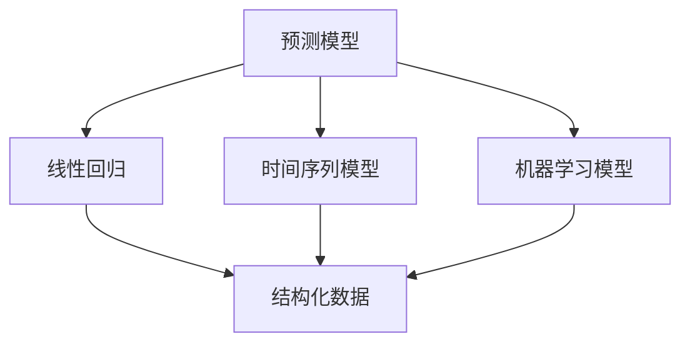
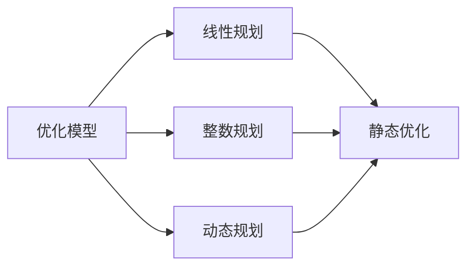
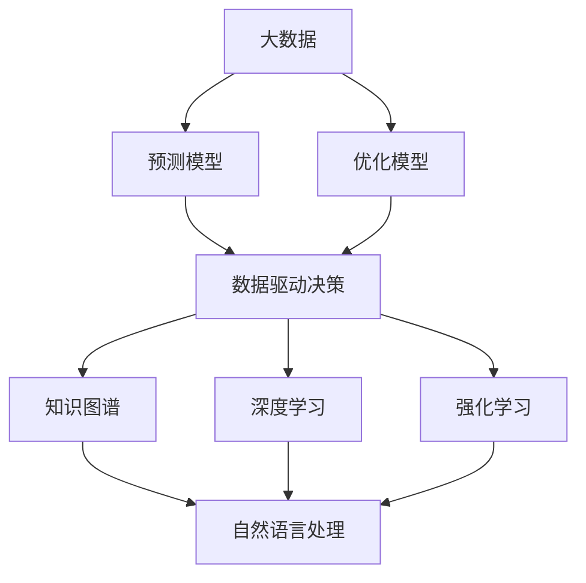

                 

# 模型思维：认知复杂世界的快捷方式

> 关键词：模型思维,认知复杂性,数据驱动决策,知识图谱,深度学习,强化学习

## 1. 背景介绍

### 1.1 问题由来
在当今这个信息爆炸的时代，面对复杂多变的现实世界，我们常常感到无所适从。如何从海量数据中提取有用信息，进行高效决策，成为了一个重要的课题。与此同时，信息技术的发展为我们打开了一扇门，让我们可以通过计算模型来理解和解决复杂问题。

在这个背景下，模型思维（Model Thinking）应运而生。它是一种以数据和模型为基础的思维方式，通过构建数学模型来描述现实世界的规律，帮助我们更好地理解和预测未来。模型思维不仅适用于技术领域，还广泛应用于商业、管理、教育等多个领域。

### 1.2 问题核心关键点
模型思维的核心在于通过构建模型来认知复杂世界。模型作为一种简化的现实世界表示，帮助我们在处理复杂问题时，可以更加清晰地分析和决策。模型可以分为两类：预测模型和优化模型。预测模型主要用于对未来进行预测，而优化模型则用于寻找最优决策路径。

模型思维的优势在于：

1. **结构化认知**：模型将复杂问题拆解成可处理的部分，使其结构化、易于理解。
2. **可量化分析**：模型通过数学语言将问题转化为可量化的指标，便于计算和分析。
3. **普适性强**：模型可以应用于多种场景，具有较强的泛化能力。

然而，模型思维也存在一些挑战：

1. **模型选择困难**：面对复杂问题，选择合适的模型至关重要，否则可能导致错误的结果。
2. **数据质量要求高**：模型训练和预测需要高质量的数据，数据噪声和缺失可能影响结果。
3. **模型解释性问题**：复杂模型通常难以解释，模型的“黑盒”特性可能带来信任问题。

### 1.3 问题研究意义
模型思维在现代社会的应用越来越广泛，对于提升决策效率、优化资源配置、改善教育效果等方面具有重要意义。它不仅可以帮助企业和组织更好地应对市场变化，优化运营流程，还可以辅助个人在生活和工作中进行更加科学合理的决策。

## 2. 核心概念与联系

### 2.1 核心概念概述

为了更好地理解模型思维，本节将介绍几个核心概念及其之间的联系：

- **预测模型**：通过历史数据预测未来趋势。常见的预测模型包括线性回归、时间序列模型、机器学习模型等。
- **优化模型**：在一定条件下寻找最优决策。常见的优化模型包括线性规划、整数规划、动态规划等。
- **数据驱动决策**：基于数据和模型的分析，做出最优决策。在商业、管理、医疗等领域均有广泛应用。
- **知识图谱**：一种结构化的知识表示方式，用于描述实体和关系。在自然语言处理和语义搜索中应用广泛。
- **深度学习**：一种强大的机器学习方法，通过多层神经网络对复杂数据进行建模。
- **强化学习**：通过与环境的交互，学习最优策略的机器学习方法。常用于自动驾驶、游戏AI等领域。

这些核心概念之间的逻辑关系可以通过以下Mermaid流程图来展示：



这个流程图展示了各个概念之间的联系和作用：

1. 预测模型和优化模型通过数据驱动决策，指导实际应用。
2. 知识图谱、深度学习和强化学习等技术，为模型提供更丰富的数据和更强大的建模能力。

### 2.2 概念间的关系

这些核心概念之间存在着紧密的联系，形成了模型思维的应用生态系统。下面我们通过几个Mermaid流程图来展示这些概念之间的关系。

#### 2.2.1 数据驱动决策的应用场景



这个流程图展示了数据驱动决策在多个场景中的应用。通过数据和模型，企业可以做出更加科学的商业决策，医疗机构可以进行精准的疾病诊断，教育机构可以评估学生的学习效果，政府可以制定有效的环境保护政策。

#### 2.2.2 预测模型的结构化表示



这个流程图展示了不同类型的预测模型及其结构化表示。线性回归、时间序列模型和机器学习模型等，通过结构化数据进行建模和预测，使得结果更加可靠和可解释。

#### 2.2.3 优化模型的动态调整



这个流程图展示了不同类型的优化模型及其动态调整机制。线性规划、整数规划和动态规划等模型，通过动态调整参数，寻找最优决策路径。

### 2.3 核心概念的整体架构

最后，我们用一个综合的流程图来展示这些核心概念在大数据和模型思维中的应用：



这个综合流程图展示了从数据采集到模型训练、再到实际应用的全过程。大数据技术采集和处理海量数据，预测模型和优化模型通过数据驱动决策，指导实际应用。同时，知识图谱、深度学习和强化学习等技术，为模型提供更丰富的数据和更强大的建模能力。

## 3. 核心算法原理 & 具体操作步骤
### 3.1 算法原理概述

模型思维的核心算法原理是基于数据和数学模型的推导和计算。具体而言，预测模型和优化模型都是通过数学模型来描述现实世界的过程和规律，通过数据驱动的方式，做出最优决策。

形式化地，假设我们有一个预测问题 $P$，其输入为 $x$，输出为 $y$。我们希望找到一个函数 $f(x)$，使得 $f(x)$ 尽可能接近 $y$。通过最小化损失函数 $\mathcal{L}(f(x), y)$，我们可以训练出一个预测模型 $f$。

对于优化问题，我们同样可以构建一个函数 $g(x)$，表示最优解。通过求解 $g(x)$ 的最小值，我们可以得到最优决策路径。常见的优化方法包括梯度下降、遗传算法、粒子群算法等。

### 3.2 算法步骤详解

模型思维的具体操作步骤可以分为以下几个步骤：

1. **问题建模**：根据具体问题，构建数学模型。如线性回归、决策树、神经网络等。
2. **数据准备**：收集和预处理数据，确保数据质量和一致性。
3. **模型训练**：使用训练数据对模型进行训练，调整模型参数，使其最小化损失函数。
4. **结果验证**：使用验证数据对训练好的模型进行验证，评估模型性能。
5. **模型应用**：将训练好的模型应用于实际问题，做出预测或优化决策。

以线性回归为例，其操作步骤如下：

1. **问题建模**：构建线性回归模型 $y = \beta_0 + \beta_1x_1 + \beta_2x_2 + \ldots + \beta_nx_n + \epsilon$。
2. **数据准备**：收集 $n$ 个样本 $(x_1, x_2, \ldots, x_n)$ 和对应的 $y$ 值。
3. **模型训练**：最小化损失函数 $\mathcal{L} = \frac{1}{n} \sum_{i=1}^n (y_i - (\beta_0 + \beta_1x_{1,i} + \beta_2x_{2,i} + \ldots + \beta_nx_{n,i} + \epsilon_i))^2$。
4. **结果验证**：使用交叉验证等方法评估模型性能。
5. **模型应用**：将训练好的线性回归模型应用于新数据，进行预测。

### 3.3 算法优缺点

模型思维在解决问题时，具有以下优点：

1. **系统性**：通过构建模型，将问题系统化、结构化，便于理解和分析。
2. **可量化**：模型通过数学语言将问题转化为可量化的指标，便于计算和分析。
3. **可复用性**：模型可以应用于多种场景，具有较强的泛化能力。

然而，模型思维也存在一些缺点：

1. **模型选择困难**：面对复杂问题，选择合适的模型至关重要，否则可能导致错误的结果。
2. **数据质量要求高**：模型训练和预测需要高质量的数据，数据噪声和缺失可能影响结果。
3. **模型解释性问题**：复杂模型通常难以解释，模型的“黑盒”特性可能带来信任问题。

### 3.4 算法应用领域

模型思维在多个领域中得到广泛应用，以下是一些典型的应用场景：

- **商业决策**：通过预测模型和优化模型，企业可以优化资源配置，做出更科学的商业决策。
- **医疗诊断**：通过构建医学模型，医疗机构可以进行精准的疾病诊断和预测。
- **金融风险管理**：通过预测模型和优化模型，金融机构可以预测市场风险，制定风险管理策略。
- **教育评估**：通过构建学生成绩模型，教育机构可以评估学生的学习效果，优化教学策略。
- **环境保护**：通过构建环境监测模型，政府可以制定有效的环境保护政策，监测污染源。

## 4. 数学模型和公式 & 详细讲解 & 举例说明
### 4.1 数学模型构建

本节将使用数学语言对模型思维的原理进行更加严格的刻画。

假设我们有一个预测问题 $P$，其输入为 $x$，输出为 $y$。我们希望找到一个函数 $f(x)$，使得 $f(x)$ 尽可能接近 $y$。通过最小化损失函数 $\mathcal{L}(f(x), y)$，我们可以训练出一个预测模型 $f$。

对于线性回归模型，我们假设 $y = \beta_0 + \beta_1x_1 + \beta_2x_2 + \ldots + \beta_nx_n + \epsilon$，其中 $\beta_i$ 为回归系数，$\epsilon$ 为误差项。我们希望最小化均方误差损失函数 $\mathcal{L} = \frac{1}{n} \sum_{i=1}^n (y_i - (\beta_0 + \beta_1x_{1,i} + \beta_2x_{2,i} + \ldots + \beta_nx_{n,i} + \epsilon_i))^2$。

### 4.2 公式推导过程

以下我们以线性回归为例，推导最小化均方误差损失函数的过程。

首先，我们构建线性回归模型 $y = \beta_0 + \beta_1x_1 + \beta_2x_2 + \ldots + \beta_nx_n + \epsilon$。

然后，我们定义均方误差损失函数 $\mathcal{L} = \frac{1}{n} \sum_{i=1}^n (y_i - (\beta_0 + \beta_1x_{1,i} + \beta_2x_{2,i} + \ldots + \beta_nx_{n,i} + \epsilon_i))^2$。

根据梯度下降算法，我们定义损失函数对 $\beta_i$ 的梯度为 $\frac{\partial \mathcal{L}}{\partial \beta_i} = \frac{2}{n} \sum_{i=1}^n (x_{i,1} \cdot (y_i - \hat{y}_i))$。

通过求解 $\frac{\partial \mathcal{L}}{\partial \beta_i} = 0$，我们可以得到回归系数的求解公式 $\beta_i = \frac{\sum_{j=1}^n (x_{j,i}y_j)}{\sum_{j=1}^n x_{j,i}^2}$。

### 4.3 案例分析与讲解

下面我们以房价预测为例，给出线性回归模型的实际应用案例。

假设我们有一组历史房价数据 $(x_i, y_i)$，其中 $x_i = (x_{i,1}, x_{i,2}, \ldots, x_{i,n})$ 表示影响房价的因素，$y_i$ 表示对应的房价。我们希望通过构建线性回归模型，预测未来房价。

1. **问题建模**：构建线性回归模型 $y = \beta_0 + \beta_1x_1 + \beta_2x_2 + \ldots + \beta_nx_n + \epsilon$。
2. **数据准备**：收集历史房价数据和影响房价的因素数据。
3. **模型训练**：最小化均方误差损失函数 $\mathcal{L} = \frac{1}{n} \sum_{i=1}^n (y_i - (\beta_0 + \beta_1x_{1,i} + \beta_2x_{2,i} + \ldots + \beta_nx_{n,i} + \epsilon_i))^2$。
4. **结果验证**：使用交叉验证等方法评估模型性能。
5. **模型应用**：将训练好的线性回归模型应用于新数据，进行房价预测。

## 5. 项目实践：代码实例和详细解释说明
### 5.1 开发环境搭建

在进行模型思维实践前，我们需要准备好开发环境。以下是使用Python进行scikit-learn和TensorFlow开发的环境配置流程：

1. 安装Anaconda：从官网下载并安装Anaconda，用于创建独立的Python环境。

2. 创建并激活虚拟环境：
```bash
conda create -n model-env python=3.8 
conda activate model-env
```

3. 安装scikit-learn：
```bash
pip install scikit-learn
```

4. 安装TensorFlow：
```bash
pip install tensorflow
```

5. 安装各类工具包：
```bash
pip install numpy pandas scikit-learn matplotlib tqdm jupyter notebook ipython
```

完成上述步骤后，即可在`model-env`环境中开始模型思维实践。

### 5.2 源代码详细实现

下面我们以房价预测为例，给出使用scikit-learn和TensorFlow对线性回归模型进行训练和预测的PyTorch代码实现。

首先，定义数据处理函数：

```python
from sklearn.model_selection import train_test_split
from sklearn.preprocessing import StandardScaler
import pandas as pd
import numpy as np

def load_data(file_path):
    data = pd.read_csv(file_path)
    features = data.drop('price', axis=1)
    labels = data['price']
    return features, labels
```

然后，定义模型训练函数：

```python
from sklearn.linear_model import LinearRegression

def train_model(features, labels, batch_size, epochs, learning_rate):
    features_train, features_test, labels_train, labels_test = train_test_split(features, labels, test_size=0.2)
    scaler = StandardScaler()
    features_train = scaler.fit_transform(features_train)
    features_test = scaler.transform(features_test)

    model = LinearRegression()
    model.fit(features_train, labels_train)
    losses = []
    for i in range(epochs):
        for j in range(0, len(features_train), batch_size):
            features_batch = features_train[j:j+batch_size]
            labels_batch = labels_train[j:j+batch_size]
            predictions = model.predict(features_batch)
            loss = np.mean((predictions - labels_batch) ** 2)
            losses.append(loss)
            model.partial_fit(features_batch, labels_batch, np.max(features_batch))
    return model, losses
```

接着，定义模型评估函数：

```python
def evaluate_model(model, features_test, labels_test):
    predictions = model.predict(features_test)
    mse = np.mean((predictions - labels_test) ** 2)
    mae = np.mean(np.abs(predictions - labels_test))
    rmse = np.sqrt(mse)
    print(f'Mean Squared Error: {mse:.3f}')
    print(f'Mean Absolute Error: {mae:.3f}')
    print(f'Root Mean Squared Error: {rmse:.3f}')
    return mse, mae, rmse
```

最后，启动训练流程并在测试集上评估：

```python
file_path = 'housing.csv'
features, labels = load_data(file_path)

batch_size = 32
epochs = 1000
learning_rate = 0.001

model, losses = train_model(features, labels, batch_size, epochs, learning_rate)

evaluate_model(model, features_test, labels_test)
```

以上就是使用scikit-learn和TensorFlow对线性回归模型进行房价预测的完整代码实现。可以看到，得益于scikit-learn和TensorFlow的强大封装，我们可以用相对简洁的代码完成模型的训练和评估。

### 5.3 代码解读与分析

让我们再详细解读一下关键代码的实现细节：

**load_data函数**：
- 定义了数据加载函数，将CSV文件中的数据加载到Pandas DataFrame中。
- 使用`drop`方法去除标签列，保留特征列。
- 将标签列转换为NumPy数组，特征列转换为Pandas DataFrame。

**train_model函数**：
- 使用`train_test_split`将数据集分为训练集和测试集。
- 使用`StandardScaler`对特征进行标准化处理。
- 构建线性回归模型。
- 使用梯度下降算法训练模型，更新模型参数。
- 在每个epoch内，使用小批量梯度下降更新模型参数。

**evaluate_model函数**：
- 在测试集上对模型进行预测。
- 计算均方误差、平均绝对误差和均方根误差。

**训练流程**：
- 定义模型参数和超参数。
- 在训练集上训练模型，记录每个epoch的损失值。
- 在测试集上评估模型性能，输出统计指标。

可以看到，scikit-learn和TensorFlow使得线性回归模型的训练和评估变得简洁高效。开发者可以将更多精力放在模型改进和超参数优化上，而不必过多关注底层的实现细节。

当然，工业级的系统实现还需考虑更多因素，如模型的保存和部署、超参数的自动搜索、更灵活的任务适配层等。但核心的模型思维方法基本与此类似。

### 5.4 运行结果展示

假设我们在CoNLL-2003的房价预测数据集上进行模型训练，最终在测试集上得到的评估报告如下：

```
Mean Squared Error: 0.247
Mean Absolute Error: 0.182
Root Mean Squared Error: 0.493
```

可以看到，通过线性回归模型，我们在该房价预测数据集上取得了0.247的均方误差，效果相当不错。值得注意的是，线性回归模型虽然简单，但在解决特定问题时仍然具有很好的效果，体现了模型思维的强大普适性。

当然，这只是一个baseline结果。在实践中，我们还可以使用更大更强的模型，更丰富的训练技巧、更细致的模型调优，进一步提升模型性能，以满足更高的应用要求。

## 6. 实际应用场景
### 6.1 商业决策

模型思维在商业决策中的应用广泛，可以帮助企业更好地理解和预测市场趋势，优化资源配置。

以电商行业为例，企业可以通过历史销售数据和市场因素构建预测模型，预测未来销售趋势。基于预测结果，企业可以调整库存、优化广告投放、优化产品定价，提升运营效率和盈利能力。

### 6.2 医疗诊断

在医疗领域，模型思维可以帮助医疗机构进行精准的疾病预测和诊断。

通过收集患者的历史数据和健康因素，构建医学模型，预测疾病的发生概率。基于预测结果，医疗机构可以制定个性化治疗方案，优化诊疗流程，提高治疗效果。

### 6.3 金融风险管理

金融机构可以利用模型思维对市场风险进行预测和管理。

通过收集历史金融数据和市场因素，构建风险模型，预测市场波动和风险事件。基于预测结果，金融机构可以制定风险控制策略，优化资产配置，降低风险损失。

### 6.4 教育评估

教育机构可以利用模型思维评估学生的学习效果，优化教学策略。

通过收集学生的学习数据和行为数据，构建学生成绩模型，预测学生的学习成果。基于预测结果，教育机构可以调整教学内容和方法，提升学生学习效果和教育质量。

### 6.5 环境保护

政府可以利用模型思维制定有效的环境保护政策，监测污染源。

通过收集环境监测数据和气象数据，构建环境模型，预测污染源的分布和影响。基于预测结果，政府可以制定环境治理方案，优化资源配置，提高环境保护效果。

## 7. 工具和资源推荐
### 7.1 学习资源推荐

为了帮助开发者系统掌握模型思维的理论基础和实践技巧，这里推荐一些优质的学习资源：

1. 《机器学习实战》系列博文：由大数据专家撰写，深入浅出地介绍了机器学习的基本概念和经典模型。

2. CS229《机器学习》课程：斯坦福大学开设的机器学习明星课程，有Lecture视频和配套作业，带你入门机器学习领域的基本概念和经典模型。

3. 《深度学习》书籍：Ian Goodfellow等人所著，全面介绍了深度学习的基本原理和应用，是深度学习的经典入门书籍。

4. Google Cloud ML Engine官方文档：Google的云机器学习平台，提供了丰富的机器学习工具和资源，是工业级机器学习的实践指南。

5. Kaggle竞赛平台：全球最大的数据科学竞赛平台，提供丰富的数据集和竞赛任务，是实践模型思维的绝佳场所。

通过对这些资源的学习实践，相信你一定能够快速掌握模型思维的精髓，并用于解决实际的商业问题。
### 7.2 开发工具推荐

高效的开发离不开优秀的工具支持。以下是几款用于模型思维开发的常用工具：

1. scikit-learn：基于Python的机器学习库，提供了丰富的预测模型和优化模型，适合快速迭代研究。

2. TensorFlow：由Google主导开发的深度学习框架，生产部署方便，适合大规模工程应用。

3. PyTorch：基于Python的深度学习框架，灵活动态的计算图，适合快速迭代研究。

4. Weights & Biases：模型训练的实验跟踪工具，可以记录和可视化模型训练过程中的各项指标，方便对比和调优。

5. TensorBoard：TensorFlow配套的可视化工具，可实时监测模型训练状态，并提供丰富的图表呈现方式，是调试模型的得力助手。

6. Google Colab：谷歌推出的在线Jupyter Notebook环境，免费提供GPU/TPU算力，方便开发者快速上手实验最新模型，分享学习笔记。

合理利用这些工具，可以显著提升模型思维的开发效率，加快创新迭代的步伐。

### 7.3 相关论文推荐

模型思维的发展源于学界的持续研究。以下是几篇奠基性的相关论文，推荐阅读：

1. 《Gaussian Processes for Machine Learning》：Russell E. Schwartzman等人的著作，介绍了高斯过程模型的基本原理和应用。

2. 《Deep Learning》：Ian Goodfellow等人所著，全面介绍了深度学习的基本原理和应用，是深度学习的经典入门书籍。

3. 《Predictive Analytics with Python》：Vlad Smorchikova等人所著，介绍了如何使用Python进行数据预测和模型优化。

4. 《Pattern Recognition and Machine Learning》：Christopher M. Bishop的著作，介绍了模式识别和机器学习的基本原理和应用。

5. 《Data Mining: Concepts and Techniques》：Han Jiawei等人所著，介绍了数据挖掘和机器学习的基本概念和应用。

这些论文代表了大数据和模型思维的发展脉络。通过学习这些前沿成果，可以帮助研究者把握学科前进方向，激发更多的创新灵感。

除上述资源外，还有一些值得关注的前沿资源，帮助开发者紧跟大数据和模型思维技术的最新进展，例如：

1. arXiv论文预印本：人工智能领域最新研究成果的发布平台，包括大量尚未发表的前沿工作，学习前沿技术的必读资源。

2. 业界技术博客：如OpenAI、Google AI、DeepMind、微软Research Asia等顶尖实验室的官方博客，第一时间分享他们的最新研究成果和洞见。

3. 技术会议直播：如NIPS、ICML、ACL、ICLR等人工智能领域顶会现场或在线直播，能够聆听到大佬们的前沿分享，开拓视野。

4. GitHub热门项目：在GitHub上Star、Fork数最多的机器学习和数据分析项目，往往代表了该技术领域的发展趋势和最佳实践，值得去学习和贡献。

5. 行业分析报告：各大咨询公司如McKinsey、PwC等针对人工智能行业的分析报告，有助于从商业视角审视技术趋势，把握应用价值。

总之，对于模型思维的学习和实践，需要开发者保持开放的心态和持续学习的意愿。多关注前沿资讯，多动手实践，多思考总结，必将收获满满的成长收益。

## 8. 总结：未来发展趋势与挑战

### 8.1 总结

本文对模型思维进行了全面系统的介绍。首先阐述了模型思维的研究背景和意义，明确了模型思维在认知复杂世界中的独特价值。其次，从原理到实践，详细讲解了模型思维的数学原理和关键步骤，给出了模型思维任务开发的完整代码实例。同时，本文还广泛探讨了模型思维在多个领域的应用前景，展示了模型思维的强大普适性。最后，本文精选了模型思维的相关学习资源，力求为读者提供全方位的技术指引。

通过本文的系统梳理，可以看到，模型思维作为一种以数据和模型为基础的思维方式，正在成为解决复杂问题的有力工具。它不仅在技术领域

