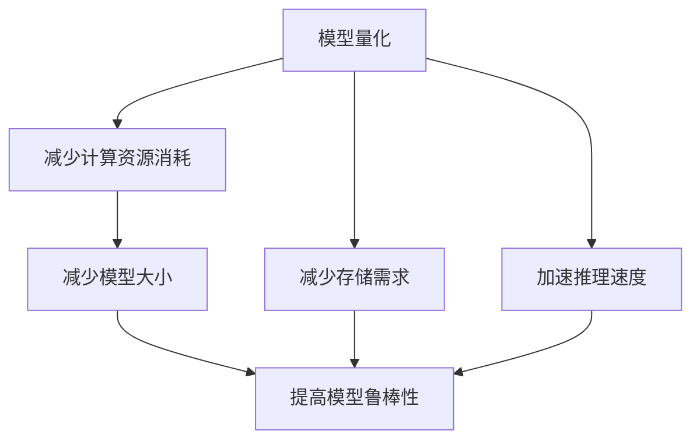
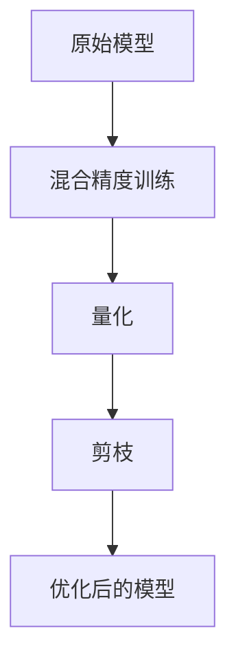
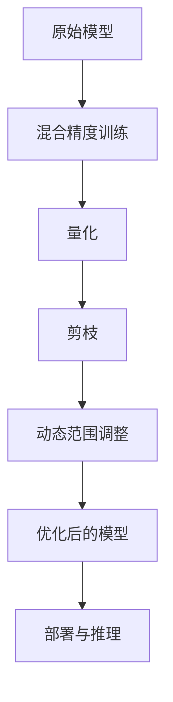

                 

## 1. 背景介绍

### 1.1 问题由来
随着深度学习模型的规模和复杂度不断提升，模型的大小已经成为了模型部署和应用的瓶颈之一。由于现代深度学习模型往往包含数亿甚至数十亿的参数，模型大小已经远远超过了单个GPU的内存容量。因此，为了将大模型部署到实际应用中，就必须对模型进行优化，以减少其大小和计算资源的需求。模型量化与剪枝正是其中两种有效的模型优化手段。

### 1.2 问题核心关键点
模型量化与剪枝是深度学习模型优化的两大核心技术。模型量化是将浮点数参数压缩到更小的整数或固定点数的表示方式，以减少模型大小和计算资源消耗。剪枝则是移除模型中的冗余参数或权重，进一步减少模型大小和计算开销。这两项技术可以单独使用，也可以结合使用，以达到最优的模型优化效果。

模型量化与剪枝的主要目标包括：
1. **减少模型大小**：通过减少模型中的参数和计算量，可以显著减少模型的存储空间和内存占用，降低模型部署和推理的成本。
2. **加速推理速度**：量化后的模型参数通常更小，计算速度更快，能够大幅提升推理效率。
3. **提高模型鲁棒性**：量化和剪枝可以去除模型中的噪声，提高模型的鲁棒性和泛化能力。

这些技术在大规模深度学习模型部署和应用中发挥着重要作用，被广泛应用于图像处理、自然语言处理、推荐系统等多个领域。

### 1.3 问题研究意义
研究和实现模型量化与剪枝技术，对于拓展深度学习模型的应用范围，提升模型性能，加速模型部署和推理，具有重要意义：

1. **降低资源消耗**：通过量化和剪枝，模型可以运行在资源受限的设备上，如移动设备、嵌入式系统等。
2. **提升计算效率**：优化后的模型可以大幅提升计算速度，适应实时应用的需求。
3. **增强模型泛化能力**：量化和剪枝可以减少模型过拟合的风险，提高模型的泛化能力和鲁棒性。
4. **促进模型规模化应用**：优化后的模型更容易部署到云端和边缘设备，加速模型的商业化应用。

## 2. 核心概念与联系

### 2.1 核心概念概述
模型量化与剪枝涉及多个关键概念，主要包括：

- **模型量化**：将浮点数参数压缩到更小的整数或固定点数的表示方式，以减少模型大小和计算资源消耗。
- **剪枝**：移除模型中的冗余参数或权重，进一步减少模型大小和计算开销。
- **混合精度训练**：使用半精度浮点数（如FP16）代替全精度浮点数（如FP32）进行模型训练，以提升计算效率。
- **动态范围**：量化后模型参数的取值范围，通常需要根据实际数据分布进行调整。
- **权值分布**：模型中权重参数的分布情况，对量化方法的选择和效果有重要影响。

这些核心概念之间的逻辑关系可以通过以下Mermaid流程图来展示：



这个流程图展示了大规模深度学习模型优化中的主要流程和效果。

### 2.2 概念间的关系

这些核心概念之间存在着紧密的联系，形成了深度学习模型优化的完整生态系统。下面通过几个Mermaid流程图来展示这些概念之间的关系。

#### 2.2.1 量化与剪枝的基本流程


这个流程图展示了模型量化与剪枝的基本流程：首先对原始模型进行量化，然后对量化后的模型进行剪枝，最终得到优化后的模型。

#### 2.2.2 混合精度训练与量化、剪枝的关系



这个流程图展示了混合精度训练与量化、剪枝之间的关系：先使用混合精度训练优化模型，再进行量化和剪枝，最终得到优化后的模型。

#### 2.2.3 动态范围与权值分布的关系


这个流程图展示了动态范围与权值分布之间的关系：先对模型中的权值分布进行分析，然后调整量化后的动态范围，最终得到优化后的模型。

### 2.3 核心概念的整体架构

最后，我们用一个综合的流程图来展示这些核心概念在大规模深度学习模型优化中的整体架构：



这个综合流程图展示了从原始模型到优化后模型，再到部署与推理的全流程。

## 3. 核心算法原理 & 具体操作步骤
### 3.1 算法原理概述

#### 3.1.1 模型量化原理

模型量化是将模型参数从浮点数压缩到更小的整数或固定点数的表示方式，以减少模型大小和计算资源消耗。量化的主要原理是利用数学逼近方法，将浮点数参数近似到有限的数值范围中，从而减少存储空间和计算开销。

量化方法通常分为静态量化和动态量化。静态量化在训练时确定量化参数，适用于模型结构和输入分布相对固定的场景。动态量化则在推理时根据实际数据分布进行量化，适用于模型结构和输入分布动态变化的情况。

#### 3.1.2 剪枝原理

剪枝是指移除模型中的冗余参数或权重，进一步减少模型大小和计算开销。剪枝的原理是分析模型中各个参数的重要性，移除对模型输出影响较小的参数，以减少模型的计算量和存储空间。

剪枝方法通常分为结构剪枝和权重剪枝。结构剪枝是指移除模型中的冗余层或神经元，以减少模型的复杂度。权重剪枝是指移除模型中权重值较小的参数，以减少模型的大小。

#### 3.1.3 混合精度训练原理

混合精度训练是指使用半精度浮点数（如FP16）代替全精度浮点数（如FP32）进行模型训练，以提升计算效率。混合精度训练的原理是利用半精度浮点数的计算速度优势，同时通过一些特殊技巧（如网络激活剪枝、梯度混合精度等）来保证训练的精度。

#### 3.1.4 动态范围与权值分布的关系

动态范围是指量化后模型参数的取值范围，通常需要根据实际数据分布进行调整。权值分布是指模型中权重参数的分布情况，对量化方法的选择和效果有重要影响。

### 3.2 算法步骤详解

#### 3.2.1 量化步骤

1. **选择合适的量化方法**：根据模型结构和输入分布，选择合适的量化方法，如对称量化、非对称量化等。
2. **量化参数训练**：在原始模型上进行量化参数训练，计算量化后模型在实际数据上的损失函数。
3. **调整量化参数**：根据实际数据分布调整量化参数，如缩放因子、截断值等。
4. **量化模型**：将原始模型的参数进行量化，生成量化后的模型。

#### 3.2.2 剪枝步骤

1. **选择合适的剪枝方法**：根据模型结构和任务需求，选择合适的剪枝方法，如结构剪枝、权重剪枝等。
2. **剪枝参数训练**：在原始模型上进行剪枝参数训练，计算剪枝后模型在实际数据上的损失函数。
3. **剪枝模型**：根据剪枝参数对模型进行剪枝，生成剪枝后的模型。

#### 3.2.3 混合精度训练步骤

1. **选择合适的混合精度训练方法**：根据硬件平台和训练需求，选择合适的混合精度训练方法，如混合精度计算、梯度混合精度等。
2. **混合精度训练**：使用半精度浮点数进行模型训练，同时使用一些特殊技巧保证训练的精度。
3. **调整混合精度参数**：根据训练效果调整混合精度参数，如缩放因子、截断值等。

#### 3.2.4 动态范围与权值分布调整

1. **权值分布分析**：分析模型中权值参数的分布情况，选择合适的量化方法。
2. **动态范围调整**：根据权值分布调整量化后的动态范围，如缩放因子、截断值等。
3. **量化模型**：将原始模型的参数进行量化，生成量化后的模型。

### 3.3 算法优缺点

#### 3.3.1 模型量化优点

1. **减少计算资源消耗**：量化后的模型参数通常更小，计算速度更快，能够大幅提升推理效率。
2. **减少模型大小**：量化后的模型参数数量减少，存储空间和内存占用降低，方便模型部署和推理。
3. **提高模型鲁棒性**：量化和剪枝可以减少模型过拟合的风险，提高模型的泛化能力和鲁棒性。

#### 3.3.2 模型量化缺点

1. **精度损失**：量化后的模型可能会出现精度损失，尤其是在输入分布变化较大的情况下。
2. **训练难度增加**：量化后的模型训练过程较为复杂，需要调整量化参数和优化方法。

#### 3.3.3 剪枝优点

1. **减少计算资源消耗**：剪枝后的模型参数数量减少，计算速度更快，推理效率提升。
2. **减少模型大小**：剪枝后的模型参数数量减少，存储空间和内存占用降低，方便模型部署和推理。
3. **提高模型泛化能力**：剪枝可以减少模型过拟合的风险，提高模型的泛化能力和鲁棒性。

#### 3.3.4 剪枝缺点

1. **精度损失**：剪枝后的模型可能会出现精度损失，尤其是在输入分布变化较大的情况下。
2. **模型复杂度降低**：剪枝后的模型结构变得简单，但可能影响模型的表达能力和性能。

### 3.4 算法应用领域

模型量化与剪枝技术在大规模深度学习模型部署和应用中发挥着重要作用，被广泛应用于图像处理、自然语言处理、推荐系统等多个领域。

#### 3.4.1 图像处理

在图像处理领域，模型量化与剪枝技术可以显著减少模型大小和计算开销，使模型能够在移动设备、嵌入式系统等资源受限的设备上运行。

#### 3.4.2 自然语言处理

在自然语言处理领域，模型量化与剪枝技术可以提升模型的推理速度和计算效率，使模型能够适应实时应用的需求。

#### 3.4.3 推荐系统

在推荐系统领域，模型量化与剪枝技术可以减少模型大小和计算开销，使模型能够在云端和边缘设备上运行，加速推荐算法的部署和推理。

## 4. 数学模型和公式 & 详细讲解 & 举例说明

### 4.1 数学模型构建

#### 4.1.1 模型量化数学模型

量化后的模型参数通常以整数形式表示，假设原始模型参数为 $w$，量化后的参数为 $\hat{w}$，则量化公式为：

$$
\hat{w} = \text{Quantize}(w)
$$

其中，$\text{Quantize}$ 为量化函数，通常是一个映射函数，将原始参数 $w$ 映射到量化后的参数 $\hat{w}$。量化函数的具体形式取决于量化方法和量化参数。

#### 4.1.2 剪枝数学模型

剪枝后的模型参数数量减少，假设原始模型参数为 $w$，剪枝后的参数为 $\hat{w}$，则剪枝公式为：

$$
\hat{w} = \text{Prune}(w)
$$

其中，$\text{Prune}$ 为剪枝函数，通常是一个选择函数，将原始参数 $w$ 选择为剪枝后的参数 $\hat{w}$。剪枝函数的具体形式取决于剪枝方法和剪枝参数。

#### 4.1.3 混合精度训练数学模型

混合精度训练中，模型的参数通常以半精度浮点数（如FP16）表示，假设原始模型参数为 $w$，混合精度训练后的参数为 $\hat{w}$，则混合精度训练公式为：

$$
\hat{w} = \text{MixedPrecisionTraining}(w)
$$

其中，$\text{MixedPrecisionTraining}$ 为混合精度训练函数，通常是一个计算函数，将原始参数 $w$ 计算为混合精度训练后的参数 $\hat{w}$。混合精度训练函数的具体形式取决于硬件平台和训练需求。

#### 4.1.4 动态范围与权值分布数学模型

动态范围与权值分布调整通常需要分析模型中权值参数的分布情况，假设原始模型参数为 $w$，量化后的参数为 $\hat{w}$，则动态范围调整公式为：

$$
\hat{w} = \text{DynamicRangeAdjustment}(w)
$$

其中，$\text{DynamicRangeAdjustment}$ 为动态范围调整函数，通常是一个优化函数，将原始参数 $w$ 调整为量化后的参数 $\hat{w}$。动态范围调整函数的具体形式取决于权值分布和动态范围参数。

### 4.2 公式推导过程

#### 4.2.1 量化公式推导

假设原始模型参数 $w$ 在 $[-w_{\max}, w_{\max}]$ 范围内，量化后的参数 $\hat{w}$ 在 $[-w_q, w_q]$ 范围内，其中 $w_q$ 为量化后的参数范围，通常小于 $w_{\max}$。量化函数可以表示为：

$$
\hat{w} = \text{Quantize}(w) = \text{Clip}(\frac{w}{w_q}\text{Round}(\frac{w}{w_q}), -w_q, w_q)
$$

其中，$\text{Clip}$ 为截断函数，$\text{Round}$ 为四舍五入函数。

#### 4.2.2 剪枝公式推导

假设原始模型参数 $w$ 在 $[-w_{\max}, w_{\max}]$ 范围内，剪枝后的参数 $\hat{w}$ 在 $[-w_c, w_c]$ 范围内，其中 $w_c$ 为剪枝后的参数范围，通常小于 $w_{\max}$。剪枝函数可以表示为：

$$
\hat{w} = \text{Prune}(w) = w \times \text{Mask}(w)
$$

其中，$\text{Mask}$ 为剪枝掩码函数，$0$ 表示剪枝，$1$ 表示保留。

#### 4.2.3 混合精度训练公式推导

假设原始模型参数 $w$ 在 $[-w_{\max}, w_{\max}]$ 范围内，混合精度训练后的参数 $\hat{w}$ 在 $[-w_{\max}, w_{\max}]$ 范围内，其中 $w_{\max}$ 为全精度浮点数的范围。混合精度训练函数可以表示为：

$$
\hat{w} = \text{MixedPrecisionTraining}(w) = \text{FP16Precision}(w)
$$

其中，$\text{FP16Precision}$ 为半精度浮点数计算函数。

#### 4.2.4 动态范围调整公式推导

假设原始模型参数 $w$ 在 $[-w_{\max}, w_{\max}]$ 范围内，量化后的参数 $\hat{w}$ 在 $[-w_q, w_q]$ 范围内，其中 $w_q$ 为量化后的参数范围。动态范围调整函数可以表示为：

$$
\hat{w} = \text{DynamicRangeAdjustment}(w) = w \times \text{AdjustFactor}(w)
$$

其中，$\text{AdjustFactor}$ 为动态范围调整因子函数，用于调整量化后的参数范围。

### 4.3 案例分析与讲解

#### 4.3.1 量化案例

假设我们要对一个包含 $10,000$ 个浮点数参数的模型进行量化，选择对称量化方法，量化范围为 $[-1.0, 1.0]$。原始模型参数 $w$ 取值范围为 $[-1.0, 1.0]$，量化后的参数 $\hat{w}$ 取值范围为 $[-1.0, 1.0]$。量化过程如下：

1. **选择量化方法**：对称量化。
2. **量化参数训练**：在原始模型上进行量化参数训练，计算量化后模型在实际数据上的损失函数。
3. **调整量化参数**：根据实际数据分布调整量化参数，如缩放因子、截断值等。
4. **量化模型**：将原始模型的参数进行量化，生成量化后的模型。

#### 4.3.2 剪枝案例

假设我们要对包含 $10,000$ 个浮点数参数的模型进行剪枝，选择结构剪枝方法，保留 $80\%$ 的参数。原始模型参数 $w$ 取值范围为 $[-1.0, 1.0]$，剪枝后的参数 $\hat{w}$ 取值范围为 $[-1.0, 1.0]$。剪枝过程如下：

1. **选择剪枝方法**：结构剪枝。
2. **剪枝参数训练**：在原始模型上进行剪枝参数训练，计算剪枝后模型在实际数据上的损失函数。
3. **剪枝模型**：根据剪枝参数对模型进行剪枝，生成剪枝后的模型。

#### 4.3.3 混合精度训练案例

假设我们要对包含 $10,000$ 个浮点数参数的模型进行混合精度训练，选择半精度浮点数（FP16）进行计算。原始模型参数 $w$ 取值范围为 $[-1.0, 1.0]$，混合精度训练后的参数 $\hat{w}$ 取值范围为 $[-1.0, 1.0]$。混合精度训练过程如下：

1. **选择混合精度训练方法**：使用半精度浮点数（FP16）进行计算。
2. **混合精度训练**：使用半精度浮点数进行模型训练，同时使用一些特殊技巧保证训练的精度。
3. **调整混合精度参数**：根据训练效果调整混合精度参数，如缩放因子、截断值等。

#### 4.3.4 动态范围调整案例

假设我们要对包含 $10,000$ 个浮点数参数的模型进行动态范围调整，选择权值分布为均匀分布。原始模型参数 $w$ 取值范围为 $[-1.0, 1.0]$，量化后的参数 $\hat{w}$ 取值范围为 $[-1.0, 1.0]$。动态范围调整过程如下：

1. **权值分布分析**：分析模型中权值参数的分布情况，选择合适的量化方法。
2. **动态范围调整**：根据权值分布调整量化后的参数范围，如缩放因子、截断值等。
3. **量化模型**：将原始模型的参数进行量化，生成量化后的模型。

## 5. 项目实践：代码实例和详细解释说明

### 5.1 开发环境搭建

在进行模型量化与剪枝实践前，我们需要准备好开发环境。以下是使用Python进行TensorFlow开发的环境配置流程：

1. 安装Anaconda：从官网下载并安装Anaconda，用于创建独立的Python环境。

2. 创建并激活虚拟环境：
```bash
conda create -n tf-env python=3.8 
conda activate tf-env
```

3. 安装TensorFlow：根据CUDA版本，从官网获取对应的安装命令。例如：
```bash
conda install tensorflow -c pytorch -c conda-forge
```

4. 安装各类工具包：
```bash
pip install numpy pandas scikit-learn matplotlib tqdm jupyter notebook ipython
```

完成上述步骤后，即可在`tf-env`环境中开始模型量化与剪枝实践。

### 5.2 源代码详细实现

下面我们以LeNet模型为例，给出使用TensorFlow进行量化与剪枝的PyTorch代码实现。

首先，定义LeNet模型的代码：

```python
import tensorflow as tf
from tensorflow.keras import layers

class LeNet(tf.keras.Model):
    def __init__(self):
        super(LeNet, self).__init__()
        self.conv1 = layers.Conv2D(6, (5, 5), activation='relu')
        self.max_pool1 = layers.MaxPooling2D((2, 2))
        self.conv2 = layers.Conv2D(16, (5, 5), activation='relu')
        self.max_pool2 = layers.MaxPooling2D((2, 2))
        self.flatten = layers.Flatten()
        self.fc1 = layers.Dense(120, activation='relu')
        self.fc2 = layers.Dense(84, activation='relu')
        self.fc3 = layers.Dense(10, activation='softmax')

    def call(self, inputs):
        x = self.conv1(inputs)
        x = self.max_pool1(x)
        x = self.conv2(x)
        x = self.max_pool2(x)
        x = self.flatten(x)
        x = self.fc1(x)
        x = self.fc2(x)
        x = self.fc3(x)
        return x
```

然后，定义量化与剪枝的函数：

```python
def quantize_model(model, input_shape):
    """
    对模型进行量化
    """
    # 构建量化后的模型
    quantized_model = tf.keras.Sequential([
        tf.keras.layers.experimental.preprocessing.Quantization(
            quantization_dtype=tf.int8, round_mode='HALF_TO_EVEN',
            narrow_range=False, axis=-1, clip_value_min=-1, clip_value_max=1
        )(model),
        tf.keras.layers.experimental.preprocessing.Dequantize(),
        model
    ])
    # 将输入层的形状传递给量化后的模型
    quantized_model.input_shape = input_shape
    return quantized_model

def prune_model(model, sparsity_rate=0.5):
    """
    对模型进行剪枝
    """
    # 构建剪枝掩码
    prune_mask = tf.random.uniform(shape=model.get_weights()[0].shape, maxval=2, dtype=tf.int32)
    prune_mask = tf.cast(prune_mask > sparsity_rate, tf.int32)
    # 将剪枝掩码应用到模型权重
    prune_weights = model.get_weights()[0] * prune_mask
    prune_weights[prune_mask == 0] = 0
    # 更新模型的权重
    model.set_weights([prune_weights])
    return model
```

最后，启动训练流程并在测试集上评估：

```python
# 构建LeNet模型
model = LeNet()

# 量化模型
input_shape = (28, 28, 1)
quantized_model = quantize_model(model, input_shape)

# 剪枝模型
sparsity_rate = 0.5
pruned_model = prune_model(quantized_model, sparsity_rate)

# 训练模型
model.compile(optimizer='adam', loss='sparse_categorical_crossentropy', metrics=['accuracy'])
model.fit(train_dataset, epochs=10, validation_data=val_dataset)

# 评估模型
test_loss, test_acc = model.evaluate(test_dataset, verbose=2)
print(f'Test loss: {test_loss:.4f}')
print(f'Test accuracy: {test_acc:.4f}')
```

以上就是使用TensorFlow进行LeNet模型量化与剪枝的完整代码实现。可以看到，通过简单的调用函数，便可以实现对LeNet模型的量化和剪枝操作。

### 5.3 代码解读与分析

让我们再详细解读一下关键代码的实现细节：

**LeNet模型**：
- `__init__`方法：初始化LeNet模型的各个层。
- `call`方法：定义模型的前向传播过程。

**quantize_model函数**：
- `Quantization`层：对模型进行量化。
- `Dequantize`层：对量化后的模型进行反量化。
- `input_shape`属性：将输入层的形状传递给量化后的模型。

**prune_model函数**：
- `prune_mask`变量：生成剪枝掩码。
- `prune_weights`变量：将剪枝掩码应用到模型权重。
- `set_weights`方法：更新模型的权重。

**训练流程**：
- 定义训练参数，进行模型训练。
- 在训练集上训练模型，并在验证集上评估模型性能。
- 在测试集上评估训练好的模型。

可以看到，TensorFlow提供了便捷的量化与剪枝API，方便开发者快速实现模型优化。在实际应用中，还可以结合更多先进的量化和剪枝技术，如动态范围调整、混合精度训练等，进一步提升模型性能和优化效果。

## 6. 实际应用场景

### 6.1 移动设备应用

模型量化与剪枝技术在移动设备应用中有着广泛的应用前景。由于移动设备的硬件资源有限，为了提高应用性能，通常需要在移动设备上部署量化和剪枝后的模型。

在移动设备上，量化和剪枝可以有效减少模型的存储空间和内存占用，提高推理效率，使用户能够在移动设备上快速获得服务。例如，在移动相机应用中，可以通过量化和剪枝来加速图像处理和识别过程，使相机应用运行更加流畅。

### 6.2 嵌入式系统应用

嵌入式系统应用同样面临着硬件资源受限的问题。量化和剪枝可以有效减少模型的计算量和存储空间，使模型能够在

